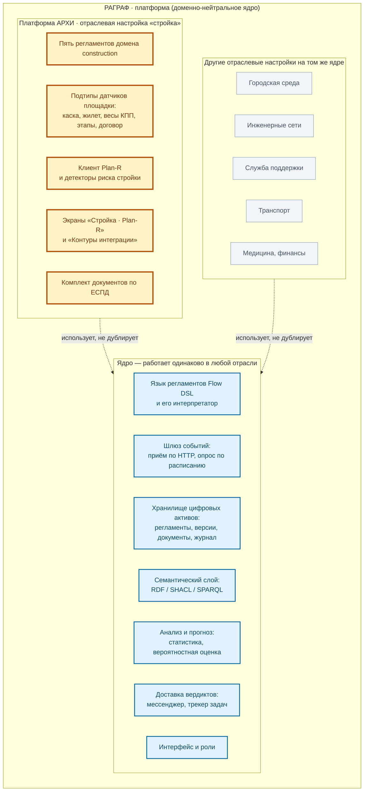
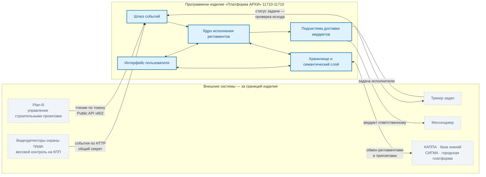
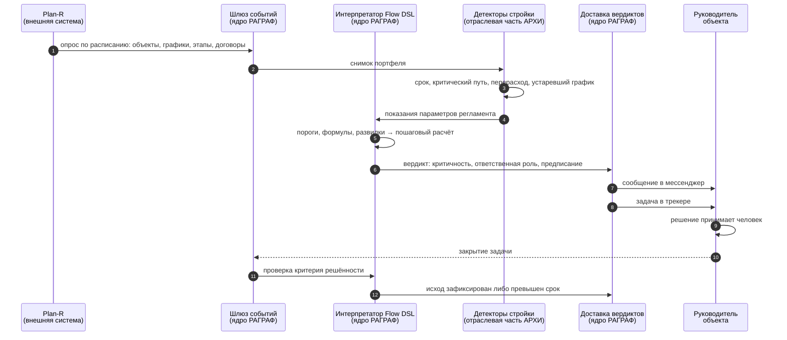

# Платформа АРХИ внутри РАГРАФ — архитектурная граница

Документ отвечает на один вопрос: **где кончается платформа и начинается отраслевое решение**. Он нужен и приёмочной комиссии, и разработчику: первой — чтобы понимать, что именно принимается, второму — чтобы знать, куда класть новый код.

Короткий ответ: **АРХИ — не отдельная программа и не надстройка над чужой системой.** Это предметная настройка РАГРАФ: тот же движок, то же хранилище, тот же язык регламентов, тот же интерфейс. Отраслевого в АРХИ — около 4%: клиент внешней системы управления проектами, детекторы риска стройки, два экрана, пять регламентов и датасеты охраны труда.

**Замер 2026-09-04.** Пересчитано по двум мерам — узкой (только исходный текст программ) и полной (плюс регламенты и датасеты как артефакты настройки). Обе дают один порядок величины.

| Мера | Отраслевая часть | Всего | Доля |
|---|---|---|---|
| Только код (`.py`, `.ts`, `.tsx`) | 3 395 строк | 94 499 | **3,6%** |
| Код + регламенты + датасеты | 4 985 строк | 117 439 | **4,2%** |

Состав отраслевой части во второй мере говорит больше, чем сама доля:

| Что | Строк | Доля отраслевой части |
|---|---|---|
| Код: клиент Plan-R, сидер, детекторы риска, привязки, макет, клиент DAS | 1 792 | 36% |
| Код: два экрана и их модели данных | 1 603 | 32% |
| Пять регламентов домена (по три файла: граф, онтология, ограничения) | 917 | 18% |
| Датасеты графа знаний: охрана труда, аналитика Plan-R, стройка, оптоволокно | 673 | 14% |

**Треть отраслевой части — не код, а данные.** Регламенты и датасеты, то есть ровно то, что заводит методолог без программиста. Это и есть техническое содержание тезиса «отрасль задаётся настройкой»: даже внутри отраслевых 4% доля, требующая разработчика, составляет две трети, а остальное — предметная работа.

Ссылки на файлы, вошедшие в замер, — раздел 4.

Это и есть главный технический довод продукта: **отраслевое решение получается настройкой, а не новым проектом с нуля** (ТЗ 8.0, раздел «Одно ядро — много отраслей»).

---

## 1. Вложенность: что во что входит



**Как читать.** Жёлтое — то, что принимается по техническому заданию АРХИ. Голубое — платформа, на которой это работает; она не является предметом отраслевой приёмки, но без неё АРХИ не существует. Серое — доказательство того, что ядро действительно доменно-нейтрально: на нём уже работают другие отрасли, и это проверяется автоматически (приложение А программы и методики испытаний, пункт 4.1.1 (4) — 9 наборов, 77 проверок).

---

## 2. Что совпадает, что отличается

| Слой | Общее с РАГРАФ | Своё у АРХИ |
|---|---|---|
| Язык регламентов | Flow DSL целиком: узлы, формулы, развилки, статический контроль | — |
| Ядро исполнения | интерпретатор, пошаговый расчёт, критерий решённости | — |
| Хранилище | регламенты, версии, документы-основания, журнал | — |
| Семантика | онтология RDF/OWL, ограничения SHACL, запросы SPARQL | — |
| Шлюз событий | приём по HTTP, планировщик, защита от повторов | клиент Plan-R как источник опроса |
| Данные предметной области | реестр доменов, библиотека подтипов датчиков | домен `construction`, 5 регламентов, 5 подтипов датчиков площадки |
| Детекторы риска | механизм тревог с адресатом и предписанием | 4 детектора стройки: срок, критический путь, перерасход, устаревший график |
| Доставка | мессенджер, трекер задач, привязки каналов | привязки «объект — регламент — канал» |
| Интерфейс | студия, редактор, журнал, ситуационный центр, роли | экран портфеля объектов, экран контуров интеграции, роль «строитель» |
| Документация | — | комплект ЕСПД: ТЗ 8.0, спецификация, три руководства, ПМИ, методические рекомендации |

**Ни одна строка исполняющего ядра не содержит условий вида «если стройка».** Отрасль задаётся данными: доменом регламента, подтипом датчика, привязкой канала. Проверяется поиском: имя домена `construction` не встречается ни в интерпретаторе (`flow_executor.py`), ни в семантическом слое (`turtle_bridge.py`), ни в обработчиках запросов по регламентам (`api/regulations.py`).

**Одно исключение, названное прямо.** Модуль хранилища `regulation_store.py` содержит имя домена — 79 упоминаний в миграциях начальных данных (`reseed_construction_ppe_violation_v1` и подобные). Это не логика исполнения: миграции засевают демонстрационные регламенты и живут рядом с хранилищем по историческим причинам. На доменную нейтральность самого хранилища это не влияет — операции записи, чтения и версионирования отрасли не знают, — но при переносе изделия в другую отрасль эти миграции придётся вынести. Отмечено здесь, чтобы проверяющий, нашедший совпадения поиском, видел объяснение, а не расхождение с документом.

---

## 3. Граница: что внутри, что снаружи



**Направления связей — это и есть границы ответственности.**

| Связь | Направление | Режим | Что это значит для приёмки |
|---|---|---|---|
| Plan-R | наружу → внутрь | **в рабочем контуре только чтение** | изделие не меняет графики заказчика; ошибка в графике остаётся ошибкой в графике. Оговорка ниже |
| Видеодетекторы, весы | наружу → внутрь | приём по HTTP | изделие не управляет оборудованием |
| Трекер задач | в обе стороны | запись задач, чтение статусов | единственный контур, где изделие пишет во внешнюю систему |
| Мессенджер | внутрь → наружу | исходящие | входящего канала нет; ответить системе в мессенджере нельзя |
| КАППА, СИГМА | в обе стороны | обмен файлами | обмен по запросу, не постоянный поток |

**Оговорка про режим чтения Plan-R.** Клиент `planr_client.py` содержит методы записи (`post`, `put`, `delete`), и проверяющий найдёт их поиском. Ими пользуется **единственный** потребитель — `planr_seeder.py`, отдельный инструмент подготовки демонстрационных данных, запускаемый администратором вручную командой `python -m app.services.etl.planr_seeder`. Рабочий контур сбора данных (`puller.py`) вызывает только чтение. Проверяется поиском вызовов `client.post` / `client.put` / `client.delete` по каталогу `backend/app/services/etl/`: все совпадения находятся в файле подготовки данных.

Практический смысл: на боевом экземпляре заказчика инструмент подготовки не применяется, и изделие физически не может изменить график. Но утверждение «режим — чтение» относится к рабочему контуру, а не к отсутствию таких методов в коде.

---

## 4. Сквозной ход: событие → вердикт → человек → проверка исхода



Отраслевого в этой цепочке — только участник `AR`: он знает, что такое «этап», «критический путь» и «стоимость договора». Всё остальное не знает про стройку ничего.

---

## 5. Где что лежит

```
docs/ARCHI-CONSTRUCTION/
├── README.md                          настоящий документ
├── images/                            иллюстрации к документам
└── GOST-19/                           комплект программных документов ЕСПД
    ├── 11710-11710-1 Техническое задание (редакция 8.0, ЦИИ НГУ).md
    ├── 11710-11710-1 Техническое задание (редакция 7.6, Группа Мета).md
    ├── 11710-11710 Спецификация.md
    ├── 11710-11710-31 Описание применения.md
    ├── 11710-11710-32 Руководство системного программиста.md
    ├── 11710-11710-33 Руководство программиста.md
    ├── 11710-11710-34 Руководство оператора.md
    ├── 11710-11710-51 Программа и методика испытаний.md
    └── 11710-11710-90 Методические рекомендации.md
```

Имена файлов следуют обозначениям по ГОСТ 19.103-77: сначала обозначение документа, затем наименование. Техническое задание имеет две редакции под одним обозначением 11710-11710-1 — действующую 8.0 (заказчик ЦИИ НГУ) и предшествующую 7.6 (заказчик ООО «Группа Мета»); вторая приведена для сверки формулировок, приёмка ведётся по 8.0. Спецификация по ГОСТ 19.202-78 обозначается обозначением самой программы, без кода вида документа, — отсюда отсутствие суффикса у файла `11710-11710 Спецификация.md`.

Отраслевая часть в исходных текстах:

| Что | Где |
|---|---|
| Клиент Plan-R, подготовка демонстрационных данных | `backend/app/services/etl/planr_client.py`, `planr_seeder.py` |
| Детекторы риска стройки | `backend/app/services/planr_proactive.py` |
| Привязки «объект — регламент — канал» | `backend/app/services/planr_bindings_store.py`, `backend/app/api/planr_bindings.py` |
| Подтипы датчиков площадки | `backend/app/services/sensor_schema_store.py`, блок «Construction» |
| Регламенты стройки | `backend/app/services/fixtures.py`, домен `construction` |
| Экраны | `frontend/src/components/planr/` |
| Страница продукта | `frontend/src/components/landing/ArchiPlatformScreen.tsx` |

Всё остальное — общая платформа. Правка ядра ради стройки означает, что граница нарушена: отраслевое требование нужно выразить данными, а если это невозможно — расширить ядро так, чтобы расширение осталось доменно-нейтральным.

---

## 6. Как проверить, что граница держится

| Утверждение | Как проверяется |
|---|---|
| Исполняющее ядро не знает про стройку | поиск `construction` в `flow_executor.py`, `turtle_bridge.py`, `api/regulations.py` — совпадений нет |
| Исключение названо и объяснено | поиск в `regulation_store.py` даёт 79 совпадений — это миграции начальных данных, см. раздел 2 |
| На ядре работают другие отрасли | `./start.command` → пункт 3; группа 4.1.1 (4) — 9 наборов, 77 проверок |
| Отраслевая часть проверяется отдельно | группы 4.1.1 (6), 4.1.3 (2), 4.1.9.3 в приложении А ПМИ |
| Рабочий контур Plan-R — только чтение | вызовы `client.post` / `client.put` / `client.delete` встречаются лишь в `planr_seeder.py`; `puller.py` их не делает |

Полная методика — `GOST-19/11710-11710-51 Программа и методика испытаний.md`.
