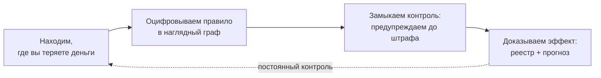

# Что для вас делает РАГРАФ — памятка заказчику

> Дата: 2026-07-21. Коротко и по делу: что мы делаем на ваших процессах, что вы получаете и почему это
> безопасно. Версия для заказчика (без внутренней кухни).

## Коротко

Мы находим, где ваш бизнес теряет деньги на несоблюдении собственных правил, переводим правило в наглядную
цифровую форму, замыкаем постоянный контроль и **доказываем**, что потеря прекратилась.

## Что вы получаете

- **Доказанное соответствие, а не «на слово».** По каждому решению — трасса «из чего вывод» (что, по какой
  норме, на каких данных). Готовый артефакт для аудитора.
- **Предупреждение до потери.** Система замечает отклонение и поднимает ответственного *до* штрафа или простоя,
  а не после.
- **Честность при неполных данных.** «Нет данных» ≠ «нарушение» — вам не дают ложный «уверенный ответ», когда
  сигнала просто нет.
- **Постоянный контроль, а не разовый отчёт.** Найденная дыра остаётся под наблюдением и не возвращается.
- **Понятные цифры.** Считает код по вашим правилам, а не «чёрный ящик ИИ». Каждый вывод проверяем.

## Почему это безопасно

- **Неинвазивно.** Мы **только читаем** данные через API — ничего не пишем в ваши системы и графики.
- **Ваши данные — ваши.** Не заменяем ваши платформы, а достраиваем слой проверки поверх них.
- **Проверяемо вами.** «Проверьте сами: вот данные, вот норма» — а не «поверьте нам на слово».

## Пример

На стройке срыв срока на критическом пути регулярно оборачивался пеней — и узнавали об этом постфактум. Мы
оцифровали правило контроля критического пути и замкнули его на ваши данные графика: теперь система ловит
замедление заранее и предупреждает ответственного — **до** пени. За квартал — измеримое число пойманных срывов
и посчитанная непонесённая пеня.

## Итог

Дыра, что забирала деньги, перестаёт течь — и это **доказано**, а не обещано. Дальше тот же подход
переносится на следующие правила по порядку их влияния на деньги.
