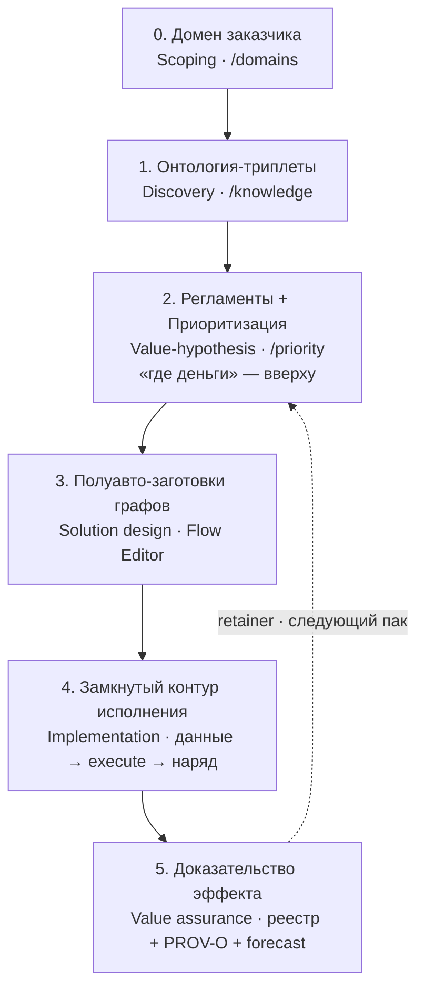
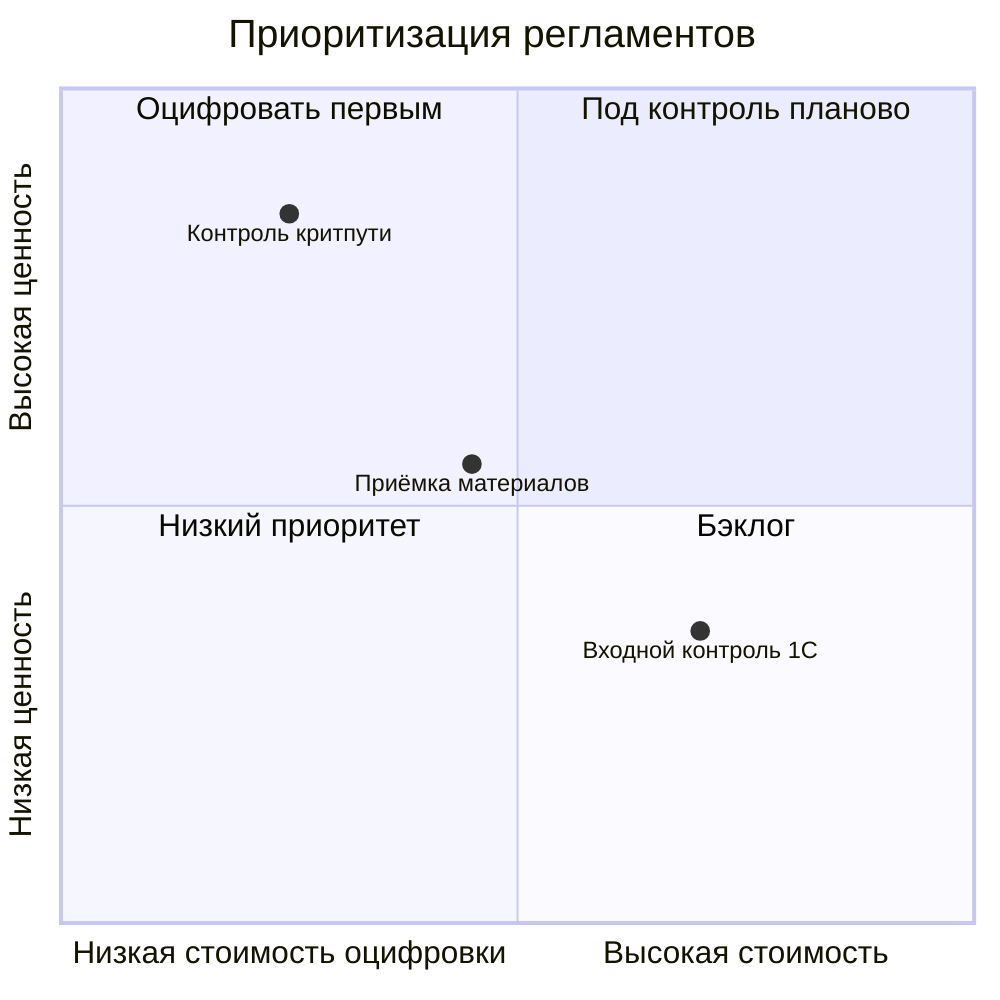
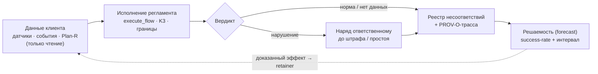

# Руководство консультанта РАГРАФ: от домена заказчика до замкнутого контура

> Дата: 2026-07-21. Для консультанта-пользователя, который ведёт клиента с РАГРАФ за спиной крупной
> консалтинговой фирмы (BCG или аналог). Показывает работу **внутри клиента**: от заведения домена до
> работающего контура отслеживания исполнения регламентов — и как это ложится на цикл работы топ-консалтинга.
>
> Связано: [GUIDE-CLIENT-RAGRAF.md](GUIDE-CLIENT-RAGRAF.md) — памятка заказчику (что оставлять клиенту).
> Внутренние материалы (стратегия захода, примеры контуров) — в основном репозитории проекта, не в этой публичной подборке.

---

## 0. Коротко

**Кто ты.** Консультант внутри клиента. Клиент — не новый: он давно с фирмой и **доверяет** ей. Твоя работа —
не «продать софт», а привычная консалтинговая: прийти, найти, **где бизнес теряет деньги**, починить дыру и
доказать, что она больше не течёт. РАГРАФ — инструмент, который делает эту работу **проверяемой** (не «на слово»)
и **переиспользуемой** (каждый заход оставляет пак-IP).

**Замкнутый путь одной строкой:** завёл домен заказчика → описал логику его бизнеса триплетами → загрузил
текстовые регламенты и **приоритизировал** (где деньги — вверху) → полуавтоматически собрал заготовки графов →
замкнул исполняемый контур → **дыра перестала забирать деньги, и это доказано**.

**Соответствие фазам работы консалтинга** (стандартный цикл top-tier; не конфиденциальная методология фирмы):

| Фаза engagement | Шаг в РАГРАФ | Экран / маршрут | Артефакт |
|---|---|---|---|
| 1. Scoping / Kickoff | Завести **домен заказчика** | «Домены» · `/domains` | рабочее пространство клиента |
| 2. Diagnostic / Discovery | **Онтология-триплеты** логики бизнеса | «Граф знаний» · `/knowledge` | граф сущностей/правил клиента |
| 3. Prioritization / Value-hypothesis | Загрузить регламенты → **приоритизация** | «Приоритизация» · `/priority` | матрица ценность×стоимость, «где деньги» |
| 4. Solution design | **Полуавто-заготовки графов** | извлечение из текста → «Поток» · `/regulations/*/flow` | черновики регламентов-графов |
| 5. Implementation / Build | **Замкнуть контур исполнения** | датчики/данные → «Запуск» → наряд | работающий проактивный контур |
| 6. Value assurance / Sustain | **Доказать эффект** | forecast + реестр + PROV-O | доказанная решаемость, retainer |

**Путь одним взглядом:**

---

## 1. Как это ложится на цикл работы консалтинга

Топ-консалтинг работает гипотезо-ориентированно и по 80/20: **диагностика → приоритеты (где ценность) →
дизайн решения → внедрение (у BCG — через BCG X) → подтверждение эффекта**. РАГРАФ встраивается в каждую фазу
и добавляет то, чего у классического консалтинга не было — **инструмент доказательства**:

- В диагностике консультант обычно строит «логическую модель» бизнеса в голове/слайдах. В РАГРАФ она становится
  **формальным графом** (триплеты + регламенты), над которым можно ВЫЧИСЛЯТЬ (приоритет, противоречия, полнота).
- Приоритизация «где теряем» обычно экспертная. В РАГРАФ **сигналы приоритета вычислимы**, потому что корпус —
  граф, а не PDF.
- Рекомендации обычно ложатся на полку. В РАГРАФ они становятся **исполняемым контуром** — от разового проекта к
  постоянному контролю (retainer).
- Эффект обычно «на слово». В РАГРАФ он **доказан** трассой (PROV-O) и решаемостью (success-rate + интервал).

---

## 2. Пошаговый playbook в РАГРАФ

### Шаг 0. Завести домен заказчика (Scoping)

- Экран **«Домены»** (`/domains`) → «Создать домен». Поля: `label` (название домена клиента), `hint` (короткое
  описание), опц. `icon`/`color`. Технически — `POST /api/domains` (`api.domains.create`).
- Домен = рабочее пространство клиента: под него лягут онтология, регламенты, датчики, метрики. Один клиент — один
  (или несколько по бизнес-линиям) домен.
- *Результат:* пустой, но именованный контейнер, куда пойдёт вся дальнейшая работа.

### Шаг 1. Построить онтологию-триплеты логики бизнеса (Discovery)

- Экран **«Граф знаний»** (`/knowledge`, Knowledge Ingest Studio). Дроп-поинт **табличных триплетов**
  `subject → predicate → object`, которые РАГРАФ превращает в Turtle и в граф знаний.
- Здесь ты формализуешь **логику онтологии клиента**: сущности (роли, объекты, документы, этапы), их связи и
  обязанности. Готовые образцы уже в системе: онтология стройки (438 триплетов «работник → СИЗ / опасности /
  обязанности»), ЖКХ (282), самоописание платформы (153) — берутся как шаблон и дорабатываются под клиента.
- *Зачем это до регламентов:* онтология даёт словарь и связи, на которые опираются регламенты и анализ (кто за что
  отвечает, что с чем связано). Это «карта местности» клиента.
- *Результат:* граф знаний домена — основа для регламентов и приоритизации.

### Шаг 2. Загрузить текстовые регламенты и приоритизировать (Value-hypothesis)

- **Импорт/извлечение регламентов.** На странице «Регламенты» — создание из текста (`/regulations/new-from-text`):
  вставляешь текст приказа/нормы, РАГРАФ **извлекает параметры и пороги** (детерминированное правило-извлечение,
  `api.sandbox.extractParameters`; словарь дообучается). Есть также из JSON и из библиотеки датчиков.
- **Приоритизация** — страница **«Приоритизация»** (`/priority`). Как только свод оцифрован графами, приоритет
  становится **вычислимым**. Матрица **ценность × стоимость оцифровки**:
  - **Ценность (0..100)** = критичность исхода (штраф/блокировка/претензия) + влияние на слои бизнеса +
    нормативный вес + риск;
  - **Стоимость/усилие (0..100)** = сложность графа (узлы + параметры).
  - Квадранты: **«Оцифровать первым»** (высокая ценность + низкое усилие — quick win, **вверху списка = где
    деньги**) → «Под контроль (планово)» (ценно, но дорого) → «Бэклог» → «Низкий приоритет».
**Матрица приоритизации (ценность × стоимость):**

- Так «где теряются деньги» оказывается **вверху списка** (квадрант «Оцифровать первым» — высокая ценность,
  низкая стоимость), дальше — по убыванию влияния на бизнес. Это твоя дорожная карта: что чинить первым.
- *Смежное:* «Свод противоречий» (`/conflicts`) и проверка непротиворечивости (`/consistency`) — находят, где
  правила клиента спорят между собой или оставляют дыру. Это тоже «где деньги утекают» — только из-за самих правил.
- *Результат:* ранжированный список «что оцифровать и взять под контроль первым» + найденные дыры/противоречия.

### Шаг 3. Полуавтоматически собрать заготовки графов (Solution design)

- Для регламента-квик-вина открываешь **«Поток»** (`/regulations/:id/flow`, Flow Editor). Заготовка графа
  создаётся **полуавтоматически**: из извлечённых параметров собирается стартовый flow
  (`input → threshold → switch/compare → output`), который ты доводишь мышью — пороги, зоны развилки, действия
  реакции, приоритеты выходов. Без кода.
- Тут же — **валидатор границ**: проверяет сам регламент на дыры/нахлёсты зон **до** инцидентов (не пропустил ли
  ты интервал). «Магия» text→регламент-граф — реальная функция, показывай её.
- **Прогон сценария** — кнопка **«Запуск»** (Play) в редакторе: гоняешь регламент на тестовых данных
  (пресеты «Норма/Внимание/Критично»), видишь вердикт, уровень, PROV-O-трассу и подсветку сработавшего пути.
  Так проверяешь логику ДО подключения к боевым данным.
- *Результат:* работающий (на тесте) регламент-граф под конкретную дыру.

### Шаг 4. Замкнуть исполняемый контур (Implementation / Build)

- **Подключаешь данные** к input/sensor-узлам: боевые датчики/события через live-ETL (`/live`, `/etl-control`) или
  события из систем клиента (таск-трекер, Plan-R, видеоаналитика). РАГРАФ работает **неинвазивно** — только читает,
  не пишет в контур клиента.
- На каждом тике/событии регламент **исполняется** (`execute_flow`): числовые границы, K3 («нет данных ≠
  нарушение»), развилка → вердикт с уровнем критичности.
- **Наряд ответственному**: при срабатывании — адресное уведомление/задача (Telegram/мессенджер/LEYKA) конкретному
  человеку **до** штрафа/простоя (проактивно). Для стройки — готовые детекторы Plan-R
  (`critical-path-slip`, `budget-overrun`, `upcoming-deadline`).
- *Результат:* дыра теперь под постоянным исполняемым контролем — контур замкнут.

**Замкнутый контур одним взглядом:**

### Шаг 5. Доказать, что дыра перестала забирать деньги (Value assurance)

- **Реестр несоответствий + PROV-O** — журнал прогонов (`/audit-log`): неизменяемая запись каждого вердикта с
  пошаговой трассой «из чего вывод». Это комплаенс-грейд артефакт для клиента и аудитора.
- **Решаемость (forecast)** — по накопленным прогонам: success-rate критерия с доверительным интервалом
  (`GET /api/regulations/:id/forecast`). Показываешь: было — течёт, стало — критерий выполняется в N% с
  доверительным интервалом.
- **Эффект в деньгах** — связываешь вердикты с суммой предотвращённого (штраф/пеня/простой, которых не случилось).
  Это твой ROI-кейс и основание для retainer.
- *Результат:* доказанный эффект + постоянный контур = продолжающийся контракт, а не разовый проект.

---

## 3. Сквозной пример: дыра, что забирала деньги

Клиент-застройщик, давно с фирмой, доверяет. Диагностика (Шаги 0–2) показывает: **срыв сроков на критическом
пути** регулярно приводит к пене подрядчику (~50 тыс ₽/день) — и об этом узнают постфактум. Приоритизация ставит
регламент контроля критпути в квадрант «Оцифровать первым» (высокая ценность, низкое усилие — данные графика уже
в Plan-R).

- Шаг 3: полуавтоматически собираешь граф «этап на критпути + прогресс < X при финише ≤ N дней → тревога».
- Шаг 4: подключаешь данные Plan-R (только чтение), контур ловит замедление критпути **на каждом pull** и шлёт
  адресный наряд ответственному ГИП/PM — **до** того, как пеня набежала.
- Шаг 5: за квартал реестр показывает M пойманных срывов; forecast — критерий «срок удержан» выполняется в N%;
  эффект = сумма непонесённой пени. Дыра **починена и это доказано.**

Тот же паттерн переносится на охрану труда (порог газ/шум → наряд специалисту по ОТ), комплаенс, экомониторинг —
меняется только пак, ядро одно.

---

## 4. Что показывать клиенту, а что держать при себе

- Клиенту показываешь **результат и доказательство**: карту приоритетов, вердикты, PROV-O-трассу, решаемость,
  деньги. Это и есть ценность.
- **Не** раскрываешь клиентской ИТ полную калибровку скоринга и «способ» верификации — это ноу-хау фирмы/РАГРАФ
  (IP = ноу-хау + ПО/БД). Продаёшь доказанность, не рецепт.

---

## 5. Почему консультанту это выгодно

- **Быстрее.** Онтология + извлечение из текста + полуавто-заготовки графов сокращают путь «регламент → исполнимое
  ПО» с месяцев (нужна разработка) до дней (мышью).
- **Доказуемо.** Deliverable не «мы проверили», а формально доказанный вердикт с трассой — новый класс работы,
  под который раньше не было инструмента.
- **Переиспользуемо.** Пак, собранный у клиента А, на ~80% работает у клиента Б той же вертикали → следующий заход
  дешевле, а у фирмы копится библиотека паков-IP.
- **Продлевает контракт.** Разовый отчёт превращается в постоянный исполняемый контур (retainer), а не «спасибо,
  до свидания».

---

## 6. Почему это не скопировать (ров)

Два ответа на возражение «да такое вайбкодится за десять дней» — держи их в голове на любой встрече.

- **Клиент не сделает это сам — «болит, но терпимо».** Боль у заказчика есть, но она терпима: сам он её кодить
  не сядет (иначе давно бы сел). «Гвоздь» из ноги бизнеса вытаскивает и накладывает пластырь только консультант —
  приходит, ставит диагноз, **останавливает утечку денег**. Это работа с болью, а не установка ещё одной
  программы. За десять дней вайбкодинга получается экран; диагноз + доказанный контур у конкретного клиента — нет.
- **Интерфейс повторят — параметры нет.** Ценность не в экране (его-то как раз скопируют), а в наборе
  **оптимальных параметров** регламентов. Набор храним **локально** и делим с клиентом права на те калибровки,
  при которых **Байес доволен результатом** — доказанный success-rate. UI собрать за дни можно; проверенные
  границы, при которых контур реально ловит нарушение, — нельзя. Это продолжение §4: продаём доказанность, не рецепт.

---

## 7. Чек-лист одной страницей

- [ ] **Домен** заказчика заведён (`/domains`).
- [ ] **Онтология-триплеты** логики бизнеса загружены (`/knowledge`).
- [ ] **Регламенты** извлечены из текста (`/regulations/new-from-text`); свод проверен на противоречия (`/conflicts`).
- [ ] **Приоритизация** построена (`/priority`); «где деньги» — вверху (квадрант «Оцифровать первым»).
- [ ] Для топ-регламента собрана **заготовка графа**, проверена валидатором границ и прогоном «Запуск».
- [ ] **Контур замкнут**: данные подключены (только чтение), наряд ответственному настроен.
- [ ] **Эффект доказан**: реестр + PROV-O + forecast; посчитан предотвращённый убыток → основание для retainer.
