# ARC.md — Архитектура системы LEYKA

> **L**EYKA · *Lightweight Engineering Yard for Knowledge Activities*
> Корпоративный task-tracker для **ЦИИ НГУ** (Центр искусственного интеллекта НГУ).
> Отслеживает проекты с заказчиками/грантодателями, обязательства центра по
> 11 KPI Минобрнауки и реальную работу команд по канбану.
>
> **Версия документа:** 1.0 · **Дата:** 2026-04-24
> **Статус:** active · **Прод:** [leyka-nsu.vercel.app](https://leyka-nsu.vercel.app)

[]()
[]()
[]()
[]()

---

## 📑 Оглавление

1. [Обзор системы](#1-обзор-системы)
2. [Слоистая архитектура](#2-слоистая-архитектура)
3. [Доменная модель](#3-доменная-модель)
4. [Жизненный цикл проекта](#4-жизненный-цикл-проекта)
5. [RBAC: два уровня ролей + visibility](#5-rbac-два-уровня-ролей--visibility)
6. [Аутентификация и авторизация](#6-аутентификация-и-авторизация)
7. [Цепочка приглашений](#7-цепочка-приглашений)
8. [KPI-подсистема](#8-kpi-подсистема)
9. [API-контракт](#9-api-контракт)
10. [Деплой и инфраструктура](#10-деплой-и-инфраструктура)
11. [Безопасность](#11-безопасность)
12. [Метрики проекта](#12-метрики-проекта)
13. [Тестовая стратегия](#13-тестовая-стратегия)
14. [Принятые архитектурные решения (ADR)](#14-принятые-архитектурные-решения-adr)
15. [Дальнейшее развитие](#15-дальнейшее-развитие)

---

## 1. Обзор системы

### 1.1 High-level диаграмма

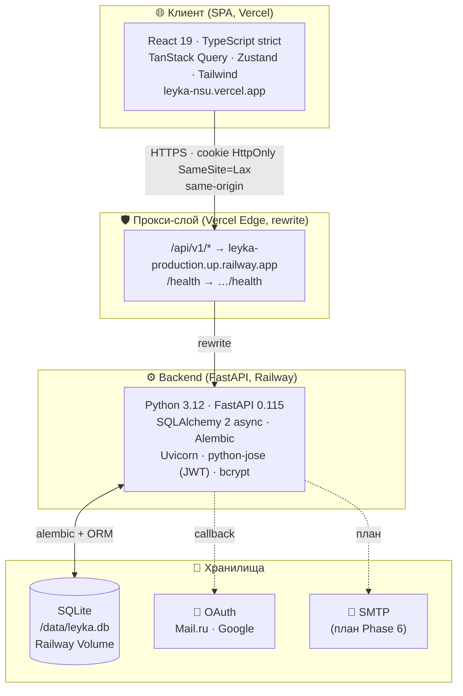

### 1.2 Ключевые свойства

| Свойство            | Значение                                         | Обоснование                                                |
|---------------------|--------------------------------------------------|------------------------------------------------------------|
| **Async-only**      | SQLAlchemy AsyncSession, FastAPI async endpoints | Веб-IO bound, единый стиль                                 |
| **Same-origin**     | Vercel rewrite вместо CORS preflight             | Cookie-auth работает без `withCredentials` плясок          |
| **HttpOnly-cookie** | JWT в `leyka_session`, не localStorage           | Защита от XSS-кражи токена                                 |
| **Type-safe API**   | OpenAPI → openapi-typescript → `types.gen.ts`    | Изменение схемы ломает фронт-билд → рано видно             |
| **SQLite на проде** | Persistent volume на Railway, режим WAL          | <50 юзеров, объём БД <100 МБ за 5 лет — Postgres избыточен |
| **Stateless API**   | Никаких in-memory сессий                         | Можно горизонтально скейлить (когда понадобится)           |

### 1.3 Что система НЕ делает

- ❌ Не хранит файлы — только URL (Yandex.Disk, Google Drive, GitHub).
- ❌ Не отправляет email (Phase 6).
- ❌ Не имеет mobile-приложения (PWA-обёртка — на потом).
- ❌ Не интегрируется с 1С/НГУ-учёткой (только OAuth).
- ❌ Не делает нормальный realtime — обновление через TanStack Query polling.

---

## 2. Слоистая архитектура

### 2.1 Backend (Python · FastAPI · SQLAlchemy 2)

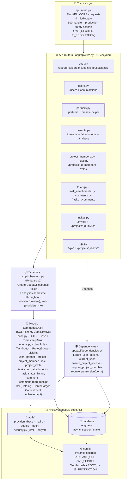

**Правило слоёв:** стрелки зависимостей идут только **вниз**. API → Schemas → Models → Database. Любая бизнес-логика, которая нужна в нескольких роутерах, выносится в `dependencies.py` или helper-модуль.

### 2.2 Frontend (React 19 · TypeScript · TanStack Query · Zustand)

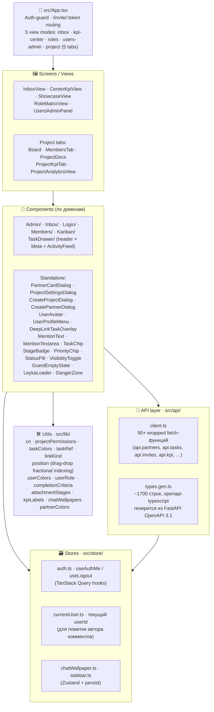

**Правило компонентов:** компонент знает только про свой проп-API. Глобальное состояние — через TanStack Query (server state) и Zustand (client UI prefs). Никаких prop-drilling больше двух уровней.

### 2.3 Стратегия мутаций: optimistic updates + точечный invalidate

**Контекст.** На проде RTT Vercel-edge → Railway (eu-west) → SQLite (на persistent volume) → ответ обратно — стабильно **200–600 мс**. Если каждое UI-действие (смена приоритета, +1 час оценки, переключение типа задачи) делает «mutate → ждать ответ → invalidate список → ждать refetch → React rerender», пользователь видит задержку **~400–700 мс** перед визуальным откликом. Воспринимается как «лагает», даже когда сеть работает идеально — это просто декомпозиция round-trip × 2.

**Решение.** Для всех частых пользовательских мутаций над задачей применяем паттерн TanStack Query optimistic update:

```ts
// TaskMeta.tsx — обобщённая схема updateMutation/statusMutation.
async function optimisticUpdate(patch: Partial<Task>) {
  // 1. Останавливаем in-flight refetch'и, чтобы они не перезатёрли наш patch.
  await queryClient.cancelQueries({ queryKey: tasksKey })
  await queryClient.cancelQueries({ queryKey: inboxKey })
  await queryClient.cancelQueries({ queryKey: singleTaskKey })

  // 2. Snapshot предыдущего состояния — пригодится для rollback.
  const prevTasks  = queryClient.getQueryData<Task[]>(tasksKey)
  const prevInbox  = queryClient.getQueryData<Task[]>(inboxKey)
  const prevSingle = queryClient.getQueryData<Task>(singleTaskKey)

  // 3. Применяем patch ко ВСЕМ кешам, где живёт эта задача.
  const merge = (t: Task): Task => ({ ...t, ...patch })
  queryClient.setQueryData<Task[]>(tasksKey, (old) => (old ?? []).map(...))
  queryClient.setQueryData<Task[]>(inboxKey, (old) => (old ?? []).map(...))
  if (prevSingle) queryClient.setQueryData<Task>(singleTaskKey, merge(prevSingle))

  return { prevTasks, prevInbox, prevSingle }
}

const updateMutation = useMutation({
  mutationFn: (payload) => api.tasks.update(task.id, payload),
  onMutate:  (payload) => optimisticUpdate(payload as Partial<Task>),
  onError:   (e, _v, ctx) => { rollback(ctx); alert(e.message) },
  onSettled: invalidateAffected, // точечный invalidate — см. ниже
})
```

**Эффект.** UI обновляется в **том же кадре**, что и клик (0 мс воспринимаемой задержки). Запрос идёт фоном; если упадёт — стейт откатывается из snapshot, пользователь видит alert. Если ответ сервера отличается от оптимистичного значения (например, бэк нормализовал `related_task_ids`) — `onSettled` через invalidate подтянет точные данные.

**Точечный invalidate.** Раньше после мутации делалось `invalidateQueries({ queryKey: ['tasks'] })`, что matchedвало **все** ключи `['tasks', *]` — то есть рефетчили задачи всех проектов пользователя, не только текущего. Сейчас invalidate сужен до конкретных ключей: `['tasks', task.project_id]`, `['inbox', 'all-tasks']`, `['task', task.id]`, `['task-history', task.id]`. Снижает трафик и latency спин-апа кеша, особенно у директора центра (~5+ проектов).

**Где паттерн уже применён.**
- [Board.tsx](frontend/src/components/Kanban/Board.tsx) — drag&drop карточки на канбане (исторически первый сценарий, паттерн отсюда).
- [TaskMeta.tsx](frontend/src/components/TaskDrawer/TaskMeta.tsx) — `updateMutation` (приоритет, тип, исполнитель, дедлайн, оценка, название, описание) и `statusMutation` (смена статуса в drawer).

**Где паттерн пока НЕ нужен.**
- Создание сущностей (POST `/projects`, `/tasks`, `/partners`) — оптимистичная вставка с временным UUID требует генерации id на клиенте и сложной reconciliation. Доля операций «создал задачу» в общей нагрузке ≪ «изменил поле задачи» — не окупается.
- Удаление (`deleteMutation`) — drawer закрывается синхронно по `onSuccess`, оптимистичное скрытие задачи из списка дало бы прирост ~150 мс, не критично.
- Комментарии (`api.comments.create`) — у пользователя есть наглядный спиннер «Отправка…» в кнопке `ctaPrimary`, переход 200 мс ощущается приемлемо.

**Когда расширять паттерн на остальное.** Триггер — жалоба пользователя «здесь тоже подтормаживает». Не делать «впрок», потому что optimistic-код увеличивает поверхность багов (race с refetch'ами, расхождение с серверной нормализацией). Текущий минимум — там, где это критично для воспринимаемой скорости интерфейса.

**Правило для ревью.** Если в новой мутации меняется поле задачи/проекта/комментария, которое сразу отображается на экране — рассмотри optimistic. Если меняется поле, которое юзер не видит (например, `last_seen_at`) — обычный onSuccess + invalidate.

---

## 3. Доменная модель

### 3.1 Сущности и их связи

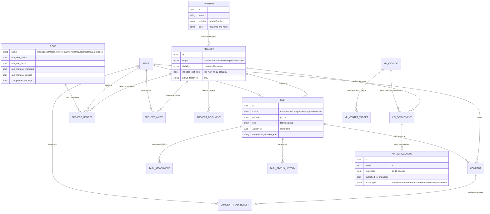

### 3.2 Все таблицы

| Таблица                  | Назначение                                              | Ключевые поля                                                                |
|--------------------------|---------------------------------------------------------|-------------------------------------------------------------------------------|
| `users`                  | Аккаунты (OAuth + root)                                 | email, full_name, role, is_superuser, oauth_provider                          |
| `partners`               | Заказчики/грантодатели                                  | name, type, status, **visibility**, **color** (для инициала в sidebar)        |
| `projects`               | Инициативы под партнёра                                 | title, stage, **visibility**, budget, **gdrive_folder_id**, **included_slot_keys** |
| `project_documents`      | Чек-лист документации проекта (по 12 стадиям)           | project_id, stage, slot_key (NULL = «свой»), url, title, kind                |
| `project_members`        | M:N user×project с ролью в проекте                      | project_id, user_id, role_id (UNIQUE pair)                                    |
| `roles`                  | RBAC-роли проекта (12 permission flags)                 | name, can_view_tasks, can_edit_project, can_manage_members …                  |
| `project_invites`        | Ссылки-приглашения                                      | token, role_id, inviter_id, expires_at, max_uses, used_count                  |
| `tasks`                  | Карточки канбана                                        | title, status, priority, **kind** (task/idea/bug), assignee_id, **author_id** |
| `task_status_history`    | Аудит переходов статусов                                | task_id, old_status, new_status, changed_by_id, changed_at                    |
| `task_attachments`       | URL-ссылки (Я.Диск, Docs, GitHub …)                     | task_id, url, title, kind, stage                                              |
| `comments`               | Чат внутри задачи                                       | task_id, author_id, text, edited_at                                           |
| `comment_read_receipts`  | M:N comment×user — кто прочитал                         | comment_id, user_id, read_at                                                  |
| `kpi_catalog`            | Справочник 11 KPI Минобрнауки                           | code (z-1..z-11), title, unit, sort_order                                     |
| `kpi_center_targets`     | План центра на год по каждой KPI                        | catalog_id, year, target_value                                                |
| `project_kpi_commitments`| Обязательство проекта                                   | project_id, catalog_id, target_value, due_date                                |
| `kpi_achievements`       | Факты выполнения (Роспатент, статья, акт)               | commitment_id, value, title, **evidences[]** (до 10), **published_in_showcase**, **asset_type**, **published_evidence_idx** |

**Дополнительно (не таблицы — статические каталоги в коде):**

| Где | Что |
|---|---|
| `backend/app/checklist/stage_slots.py` ↔ `frontend/src/lib/stageSlots.ts` | Каталог рекомендованных «слотов» документов по 12 стадиям ЦИИ (40+ артефактов: NDA, ТЗ, акт сдачи, ПМИ, …). Single source of truth, редактируется через PR. |

### 3.3 Enum'ы

| Enum                  | Значения                                                                          |
|-----------------------|-----------------------------------------------------------------------------------|
| `UserRole`            | `pm` · `developer` · `analyst` · `designer` · `curator` · `observer` · `customer` · `guest` |
| `TaskStatus`          | `inbox` · `todo` · `in_progress` · `waiting` · `review` · `done`                  |
| `TaskPriority`        | `p1` · `p2` · `p3` · `p4` (цвета: красный · оранжевый · синий · серый)           |
| `TaskKind`            | `task` · `idea` · `bug`                                                           |
| `ProjectStage`        | `presale` · `active` · `paused` · `completed` · `archived`                        |
| `ProjectVisibility`   | `private` · `public` · `demo`                                                     |
| `PartnerVisibility`   | `private` · `public`                                                              |
| `PartnerType`         | `enterprise` · `government` · `startup` · `research`                              |
| `PartnerStatus`       | `lead` · `negotiation` · `active` · `paused` · `archived`                         |

**Slug-каталоги (валидируются в Pydantic, без отдельного enum):**

| Каталог | Значения | Где определён |
|---|---|---|
| `AssetType` (витрина) | `article` · `software` · `invention` · `dataset` · `event` · `deployed` · `sandbox` | `app.schemas.kpi.ALLOWED_ASSET_TYPES` ↔ `lib/assetTypes.ts` |
| Партнёр-цвет | `rose` · `amber` · `sky` · `emerald` · `violet` · `fuchsia` · `teal` · `orange` | `app.schemas.partner.ALLOWED_PARTNER_COLORS` ↔ `lib/partnerColors.ts` |
| Stage документа | `negotiation` · `research` · `tor` · `rnd_research` · `rnd_dev` · `user_docs` · `pmi_testing` · `handover` · `deployment` · `remarks` · `support` · `reporting` | `frontend/src/lib/attachmentStages.ts` (хранится как свободный VARCHAR в БД) |

---

## 4. Жизненный цикл проекта

### 4.1 Стадии (Project.stage)

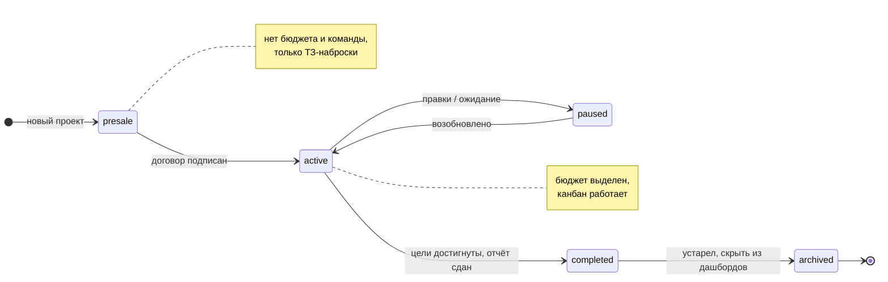

### 4.2 Жизнь одной задачи (Task.status)

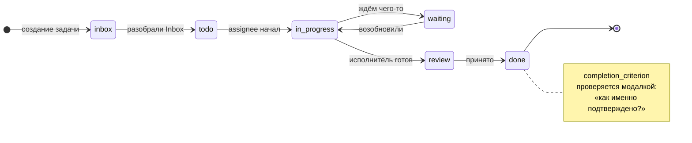

Каждый переход пишется в `task_status_history` (SQLAlchemy event listener в `app/models/task.py`) → используется для аналитики throughput / lead time.

---

## 5. RBAC: два уровня ролей + visibility

> Ключевое решение Phase 1 / 1.5: разделить **глобальную должность** и
> **проектные права**. Списки лейблов синхронизированы, чтобы админ не
> путался, но семантика разная.

### 5.1 Уровень 1 — глобальная должность (`User.role`)

Информационный тег. Задаётся в карточке профиля. На авторизацию **не влияет**.

| Роль        | Кто это                                                              |
|-------------|----------------------------------------------------------------------|
| `pm`        | Менеджер проекта (PM)                                                |
| `developer` | Разработчик/инженер                                                  |
| `analyst`   | Аналитик / data scientist                                            |
| `designer`  | Дизайнер интерфейсов                                                 |
| `curator`   | Куратор (надзорная роль, см. §5.3)                                   |
| `observer`  | Наблюдатель                                                          |
| `customer`  | Внешний контактный (заказчик)                                        |
| `guest`     | Default для свежих OAuth-юзеров до первого вступления в проект       |

### 5.2 Уровень 2 — роль в проекте (`ProjectMember.role` → `Role`)

Реальные permission'ы. У одного юзера могут быть **разные роли в разных проектах**.

| Роль          | view_tasks | edit_tasks | move_status | delete_tasks | manage_members | edit_project | manage_budget | view_confidential |
|---------------|:----------:|:----------:|:-----------:|:------------:|:--------------:|:------------:|:-------------:|:-----------------:|
| Менеджер      | ✅          | ✅          | ✅           | ✅            | ✅              | ✅            | ✅             | ✅                 |
| Разработчик   | ✅          | ✅          | ✅           | ❌            | ❌              | ❌            | ❌             | ❌                 |
| Аналитик      | ✅          | ✅          | ✅           | ❌            | ❌              | ❌            | ❌             | ❌                 |
| Куратор       | ✅          | ❌          | ❌           | ❌            | ❌              | ❌            | ❌             | ✅                 |
| Наблюдатель   | ✅          | ❌          | ❌           | ❌            | ❌              | ❌            | ❌             | ❌                 |
| Заказчик      | ✅          | ❌          | ❌           | ❌            | ❌              | ❌            | ❌             | ❌                 |

> Полная матрица из 12 флагов настраивается админом через UI **«Управление доступом»** ([RoleMatrixView](frontend/src/components/RoleMatrixView.tsx)).

### 5.3 Куратор — надзорная роль

Подключается к проекту чтобы **наблюдать**, не правит. Типовые сценарии:

- **Директор центра** — проверка отчётности.
- **Директор грантодателя** — контроль исполнения по гранту.
- **Главбух НГУ** — сверка устава и расходов.
- **Научный руководитель** — прогресс аспирантов.
- **Внутренний аудитор** — выборочные проверки.

### 5.4 Над всем — `is_superuser`

Флаг администратора центра. **Обходит обе модели.** Защищён от само-разжалования: последний активный admin не может ни снять с себя `is_superuser`, ни задеактивировать ([проверка в `update_user`](backend/app/api/v1/users.py#L131)). Защищён от само-удаления (`DELETE /users/{me}` → 400).

### 5.5 Visibility — третий слой над RBAC

| Сущность   | Значения                  | Кто видит                                                         |
|------------|---------------------------|-------------------------------------------------------------------|
| `Project`  | private (по умолчанию)    | члены проекта + superuser                                          |
|            | public                    | все аккаунты центра                                                |
|            | demo                      | все, включая гостей; безопасен для тренировок                     |
| `Partner`  | private (по умолчанию)    | сотрудники с доступом ≥ к одному проекту партнёра + superuser     |
|            | public                    | все аккаунты центра                                                |

Менять может только superuser — переключатель «🔒 закрытый / 🌍 открытый / ✨ демо» в карточке заказчика и в настройках проекта ([VisibilityToggle.tsx](frontend/src/components/VisibilityToggle.tsx)).

---

## 6. Аутентификация и авторизация

### 6.1 Способы входа

| # | Способ | Кто использует | Где валиден |
|---|---|---|---|
| 1 | 🔐 **OAuth Mail.ru** | Сотрудники НГУ (основной) | прод + dev |
| 2 | 🔐 **OAuth Google** | Коллеги с корпоративным Google | прод + dev |
| 3 | 🛡 **Local** (`/auth/local`) | Резервный root (`ROOT_EMAIL`/`ROOT_PASSWORD`) | прод + dev |
| 4 | 🧪 **Mock** (`/auth/mock/picker`) | Dev-выбор юзера без реального SSO | только при `ENABLE_MOCK_AUTH=true` И `IS_PRODUCTION=false` |

### 6.2 OAuth-флоу (с CSRF и graceful cancel)

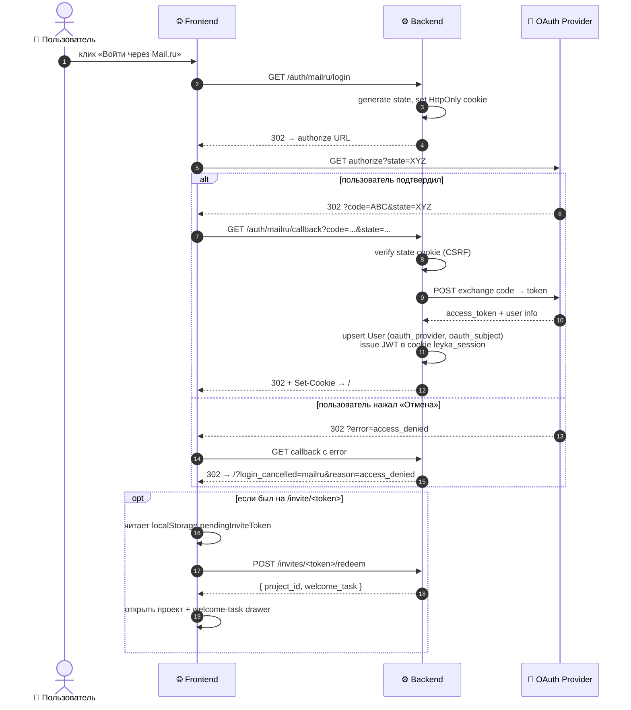

### 6.3 Сессия

- JWT в HttpOnly cookie `leyka_session`, `SameSite=Lax`, `Secure=true` на проде.
- TTL — 7 дней (`JWT_EXPIRE_HOURS=168`), без refresh-token (для простоты — на проде логинимся раз в неделю).
- На каждом API-запросе `current_user_optional` декодирует JWT, грузит User, проверяет `is_active`. Деактивированный юзер мгновенно теряет доступ.

### 6.4 Защиты на уровне приложения

| Защита                           | Где                                                           |
|----------------------------------|---------------------------------------------------------------|
| Production safety asserts        | [main.py](backend/app/main.py) — fail-fast при дефолтном JWT_SECRET, mock-auth, не-secure cookies на проде |
| OAuth state CSRF                 | [auth.py](backend/app/api/v1/auth.py) — random state в short-TTL cookie, проверка через `compare_digest` |
| Last-admin lockout protection    | [users.py](backend/app/api/v1/users.py) — нельзя разжаловать/задеактивировать последнего admin'а |
| Self-edit field stripping        | [users.py](backend/app/api/v1/users.py) — юзер не может выдать себе `is_superuser` через PATCH |
| Author always from cookie        | [comments.py](backend/app/api/v1/comments.py) — `author_id` форсится из сессии, нельзя притвориться другим |
| Project member-only writes       | [dependencies.py](backend/app/api/dependencies.py) — `ensure_project_access` |

---

## 7. Цепочка приглашений

> Phase 4. Реализует основной онбординг-сценарий: «admin зовёт менеджера → менеджер зовёт разработчиков».

### 7.1 Модель `ProjectInvite`

```
┌────────────────────────────────────────────────────────────┐
│ id            UUID                                          │
│ project_id    FK projects (CASCADE)                         │
│ role_id       FK roles (RESTRICT)  ─ какую роль получит     │
│ inviter_id    FK users (SET NULL)  ─ кто пригласил          │
│ token         VARCHAR(64) UNIQUE   ─ secrets.token_urlsafe  │
│ email_hint    String?              ─ для UI «приглашение …» │
│ greeting      String?              ─ первый коммент         │
│ expires_at    DateTime             ─ default now + 7 дней   │
│ max_uses      Int                  ─ default 1              │
│ used_count    Int                  ─ инкрементится в redeem │
└────────────────────────────────────────────────────────────┘
```

### 7.2 Полный поток

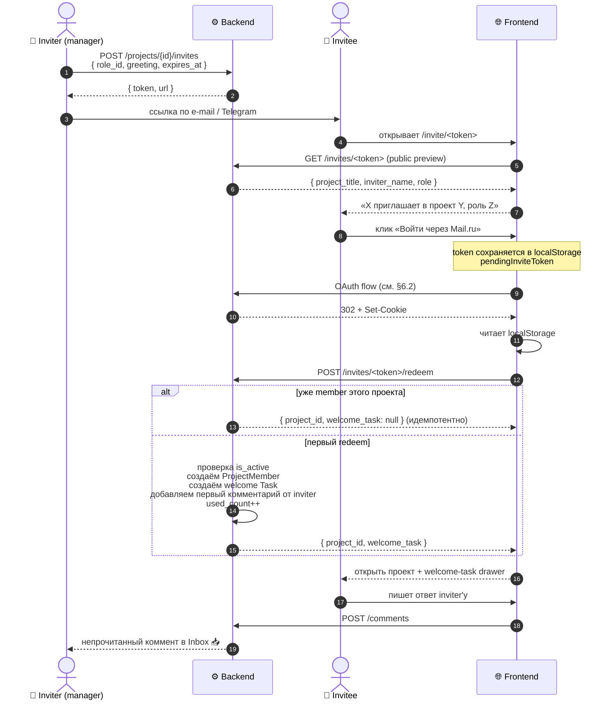

Тесты потока: [test_invites.py](backend/tests/test_invites.py) — 19 кейсов (создание, права, preview, expired/used, идемпотентность, multi-use, list, revoke).

---

## 8. KPI-подсистема

### 8.1 Концепция

Всё крутится вокруг **11 обязательных KPI Минобрнауки** (Приложение №2 к Правилам экспертизы). Они хранятся в `kpi_catalog` со стабильными кодами `z-1`…`z-11` — не меняются, к ним привязываются обязательства проектов и факты.

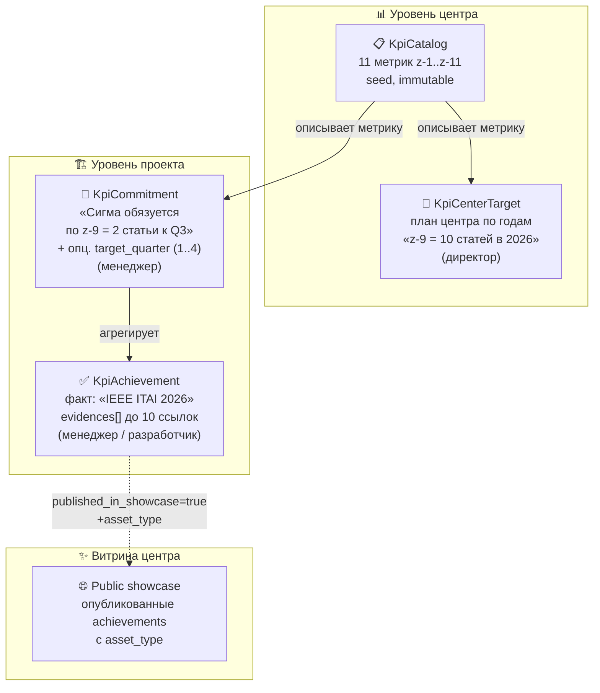

### 8.2 Подсчёт прогресса (центральная сводка)

```
для каждой KPI z-N:
   plan_for_year   = sum(KpiCenterTarget where year=Y)
   committed       = sum(ProjectKpiCommitment.target_value where catalog=N)
   achieved        = sum(KpiAchievement.value where commitment.catalog=N
                         and occurred_at within year Y)

   цвет рамки тайла:
      🔴 если committed = 0                         → ищи заказчика/грант
      🟠 если 0 < achieved < plan*0.8               → в работе
      🟢 если plan*0.8 ≤ achieved < plan            → почти закрыт
      🟢🟢 если achieved ≥ plan                      → перевыполнено
```

Дополнительно для **каждой пары (KPI, квартал)** считается срез:

```
для квартала Q ∈ {1,2,3,4}:
   q_target   = sum(commitments where target_quarter=Q)  # см. §8.7
   q_achieved = sum(achievements where occurred_at ∈ [Y-Q-start, Y-Q-end))
   q_status   = _classify_quarter_status(...)  # 6 значений

для года-к-моменту (cumulative-as-of-now):
   через = current_quarter (для текущего года) | 4 (прошлый) | 0 (будущий)
   target_to_date   = sum(q_target for q ≤ через)
   achieved_to_date = sum(q_achieved for q ≤ через)
   year_status      = done / on_track ≥70% / at_risk ≥30% / missed <30% / no_plan
```

UI: [CenterKpiView](frontend/src/components/CenterKpiView.tsx) — каждый тайл это:
- **корона `year_progress`** (6px) сверху — суммарный статус года к этому моменту, толерантный к смещению работы между кварталами;
- **стопка из 4 слоёв `Q1..Q4`** (снизу вверх) — per-quarter outcome, честная история «уложились / нет»;
- **тон рамки тайла** — годовой прогресс по формуле выше, для быстрого worst-case-индикатора.

### 8.3 Множественные доказательства (evidences[])

У каждого `KpiAchievement` — JSON-массив `evidences: [{url, title}]` (до 10
штук). Один факт KPI = один показатель в подсчёте, но карточек-доказательств
к нему может быть несколько: акт + договор + ссылка на демо.

`KpiAchievement.evidence_url` (legacy single-URL) сохранён для обратной
совместимости — write-path дублирует туда `evidences[0].url`. Со временем
будет дропнут.

API: `PUT /kpi/achievements/{id}/evidences` атомарно заменяет весь массив.
Доступ: superuser или менеджер проекта с `can_manage_budget`.

### 8.4 Витрина центра (showcase)

Публичная страница «Витрина ЦИИ» — отдельная навигационная позиция в sidebar
рядом с «KPI центра». Реализована **как фильтр** над существующими
`KpiAchievement`, без отдельной сущности:

- `KpiAchievement.published_in_showcase: bool` — admin поставил «✨».
- `KpiAchievement.asset_type: str | None` — slug из 7 типов
  (`article` · `software` · `invention` · `dataset` · `event` · `deployed` · `sandbox`).
  Whitelist в `ALLOWED_ASSET_TYPES` (Pydantic), зеркало `lib/assetTypes.ts`.
- `KpiAchievement.published_evidence_idx: int` — какое из `evidences`
  показывать на витрине (часто это маркетинговая ссылка на демо, а не
  PDF акта).

`GET /showcase` отдаёт `ShowcaseAsset[]` — флаттенный достижение с JOIN'ом
на project + partner для рендера в карточке. Доступно **всем залогиненным**
(включая гостей без membership'ов) — это публичный имидж центра.

Авто-предложение типа: при включении галки «✨ опубликовать» фронт прогоняет
`detectAssetType(url)` по `evidences` (см. [lib/assetTypes.ts](frontend/src/lib/assetTypes.ts))
и помечает звёздочкой ★ предложенный тип на основе домена URL: `arxiv.org` →
article, `patents.google.com` → invention, `*.vercel.app` → deployed, и т.д.

UI: [ShowcaseView](frontend/src/components/ShowcaseView.tsx),
toggle в [CenterKpiView · ShowcaseToggle](frontend/src/components/CenterKpiView.tsx).

---

## 8.5 Чек-лист документации проекта

Каждый проект на вкладке «Доки» имеет персональный чек-лист обязательных
артефактов по 12 стадиям жизненного цикла ЦИИ.

### Каталог слотов

`backend/app/checklist/stage_slots.py` — статический dict из 12 стадий ×
3-4 рекомендованных артефакта (NDA, ТЗ, акт сдачи, ПМИ, …). Зеркало на
фронте — `frontend/src/lib/stageSlots.ts`. Источник правды редактируется
через PR; миграция БД при изменении не нужна (slot_key — свободная строка
в `project_documents`).

### Логика «по умолчанию выключено»

`Project.included_slot_keys: list[str]` — список slot_key'ев, явно
включённых в чек-лист этого проекта. **По умолчанию пуст** — менеджер
кликает зелёную галку «✓ Включить» у тех слотов, которые нужны под его
проект. Это снимает «давление 39 пунктами» с нового проекта.

API: `POST/DELETE /projects/{id}/included-slots/{slot_key}` атомарно
toggles set. Подсчёт «закрыто N/M» в UI учитывает только включённые
слоты + extras (свои документы и attachments из задач, каждый = +1/+1).

### Модель ProjectDocument

Документ-ссылка уровня проекта (не задачи):
```python
class ProjectDocument:
    project_id: FK
    stage: str           # slug из ATTACHMENT_STAGES
    slot_key: str | None # NULL = «свой» документ вне рекомендованных
    url, title, kind     # как у TaskAttachment, kind=detect_kind(url)
    created_by_id: FK
```

Уникальность по `(project_id, lower(url))` — защита от дубля одной ссылки
в одном проекте. UI: [StageChecklistTable](frontend/src/components/StageChecklistTable.tsx).

---

## 8.6 Квартальные контрольные точки и прогноз

Менеджер проекта при создании обязательства может (опционально) указать
**квартал-дедлайн** `target_quarter ∈ {1,2,3,4} | NULL` и **год**
`target_year ∈ [2024..2100] | NULL`. Это превращает обязательство в
*milestone* — типа «РИД (z-4) к Q3 2026, регистрация 2-3 месяца» / «ПО (z-2)
к Q4 2025» / «ДПО (z-6) задним числом за Q3 2024 — наполнение архива».

UNIQUE расширен до `(project_id, kpi_code, target_quarter, target_year)`
(см. миграции 0028 и 0029) — по одной метрике в проекте можно держать:
- одно безквартальное «общий план до конца проекта» (`Q=NULL, Y=NULL`),
- многолетние квартальные milestone'ы: `Q3 2024`, `Q3 2025`, `Q3 2026` —
  три отдельных строки без конфликта,
- комбинации квартал × год вплоть до `4 × N лет = 4N` обязательств на одну метрику.

NULL в SQLite UNIQUE считается «не равным», что и даёт нужную семантику.

### Эффективный год обязательства

Поле `target_year` опциональное (NULL для legacy-записей до миграции 0029).
Pure-функция `_commitment_year(c, fallback_year)` определяет «эффективный
год» обязательства по приоритету:

1. явный `c.target_year` (если задан) — главный источник правды;
2. иначе `c.due_date.year` (если задан) — fallback для записей с дедлайном;
3. иначе `fallback_year` — обычно год запроса.

Compatibility-tradeoff: записи без `target_year` И без `due_date` видны в
любом year-запросе (через ветку 3 fallback'а). Это ОК для исходных legacy-
данных и исчезает само, когда менеджеры заводят новые обязательства через
UI (фронт всегда пишет явный `target_year`).

### Светофор риска

`_classify_risk(achieved, target, days_left)` — pure-функция, единая для
проектного и центрового прогноза:

| Условие | Цвет | Семантика |
|---|---|---|
| `achieved >= target` | 🟢 green | Выполнено |
| `achieved/target >= 50%` или `days_left > 30` | 🟡 yellow | Под контролем |
| Иначе | 🔴 red | Риск срыва |

### API прогноза

| Эндпоинт | Кому | Что отдаёт |
|---|---|---|
| `GET /forecast/center?year=Y&quarter=Q` | Любой залогиненный (не-superuser видит только свои проекты) | Все обязательства с `target_quarter=Q` + светофор + counts `{green, yellow, red, total}` |
| `GET /projects/{id}/forecast?year=Y&quarter=Q` | Член проекта | То же, отфильтрованное по проекту — менеджер видит свои риски проактивно |

UI:
- **`ForecastView`** — отдельная страница в сайдбаре между «KPI центра» и
  «Витрина центра». Селектор Q1..Q4, 4 плитки-сводки, таблица обязательств,
  отсортированная red→yellow→green с кликом на проект.
- **Виджет в `InboxView`** — для superuser; полоса сверху «🔴 N KP под угрозой
  · ещё M под контролем», кликабельная, ведёт на ForecastView.
- **`ProjectKpiTab`** — показывает банер `«Прогноз Q3: X выполнено, Y под
  контролем, Z рисков»` + Q-бейдж рядом с кодом метрики в каждой строке
  обязательства.

### Квартальные срезы в табло центра

`/analytics/kpi-summary` для каждого item возвращает:
- `quarters: list[KpiQuarterStat]` (4 элемента Q1..Q4) — `{target, achieved, pct, status}`
  где `status ∈ {done, on_track, at_risk, missed, planned, no_plan}`;
- `year_progress: KpiYearProgress` — `{target_to_date, achieved_to_date, pct,
  status, through_quarter}` — cumulative-as-of-now «нагнали ли годовой план
  на текущий момент». Толерантна к смещению работы между Q: если план был
  на Q2, факт случился в Q3 — Q2 в стопке остаётся `missed` (честная
  история), а year_progress к концу Q3 уже `done`.

См. [ForecastView.tsx](frontend/src/components/ForecastView.tsx),
[CenterKpiView.tsx · MiniTile/QuarterLayer/YearProgressCrown](frontend/src/components/CenterKpiView.tsx).

---

## 8.7 Drag-and-drop загрузка во временную папку Google Drive

«Временная папка ЦИИ» — drag-and-drop сервис для нетехнических сотрудников,
которые не умеют пользоваться Я.Диском/G.Drive. Файл бросаешь на стадию
в чек-листе — он уходит в Google Drive админа центра, в чек-листе
появляется ссылка с бейджем «🕒 30 дней».

### Архитектурное решение

**OAuth user-flow вместо Service Account.** Service Accounts Google **не
имеют storage quota** для personal Drive (политика Google с 2022) — могут
читать расшаренные папки, но не могут создавать в них файлы (HTTP 403
`storageQuotaExceeded`). Решение, чтобы остаться на бесплатном personal
Drive админа (15 ГБ):

1. Один раз через `backend/scripts/authorize_gdrive.py` админ получает
   `refresh_token` своего Google-аккаунта (OAuth installed app flow).
2. LEYKA через refresh_token получает свежий access_token каждые 60 мин,
   пишет файлы под видом самого админа.
3. Файлы лежат в его 15 ГБ-квоте — Google пропускает.

ENV: `GOOGLE_DRIVE_REFRESH_TOKEN`, `GOOGLE_DRIVE_ROOT_FOLDER_ID`,
переиспользует `GOOGLE_CLIENT_ID/SECRET` (которые уже есть для login-OAuth).
Если env не заполнены — endpoint возвращает 503 «загрузка временно
недоступна», остальное приложение работает (graceful degrade).

### Структура хранения

```
📁 LEYKA-Temp/                    ← root-папка в Drive админа
   📁 МТС — Аналитика/            ← подпапка проекта (auto-created)
   │   📄 ТЗ.pdf
   │   📄 акт.docx
   📁 ЦИИ — Операционка/
       📄 презентация.pptx
```

`Project.gdrive_folder_id` кэширует id подпапки, чтобы не делать lookup
при каждом upload. Создаётся лениво при первом аплоаде в проект, не
переименовывается при переименовании проекта.

### Endpoint

`POST /projects/{id}/uploads` — multipart/form-data, лимит 15 МБ,
whitelist 13 расширений (pdf/docx/xlsx/pptx/png/jpg/md/txt/csv/...).
Создаёт `ProjectDocument` с `kind='gdrive_temp'` (фронт рисует бейдж
«🕒 30 дней»). Доступ: `can_edit_tasks` в проекте.

UI: [DropZone](frontend/src/components/DropZone.tsx) +
[uploadFile](frontend/src/lib/uploadFile.ts) (XHR с progress-bar).
Optimistic UI: pending-чип появляется мгновенно при drop, потом
заменяется на финальный (успех) или красный с подсказкой (ошибка).

### Чистка

В Phase 1 — нет автоматики. Админ раз в месяц чистит вручную в Google Drive UI.
В Phase 2 — Railway Cron-task → `/admin/cleanup-temp-uploads` удаляет файлы
старше 30 дней + соответствующие `ProjectDocument` записи.

Подробная инструкция настройки: [GOOGLE_DRIVE_SETUP.md](GOOGLE_DRIVE_SETUP.md).

---

## 9. API-контракт

### 9.1 Все эндпоинты (72 route'а)

| Группа         | Эндпоинты                                                                       |
|----------------|---------------------------------------------------------------------------------|
| **Auth**       | `GET /auth/providers` · `GET /auth/me` · `POST /auth/local` · `POST /auth/logout` · `GET /auth/{provider}/login` · `GET /auth/{provider}/callback` · `GET /auth/mock/picker` |
| **Users**      | `GET /users` · `POST /users` · `GET /users/{id}` · `PATCH /users/{id}` · `DELETE /users/{id}` · `GET /users/me/memberships` |
| **Partners**   | `GET /partners` · `POST /partners` · `GET /partners/{id}` · `PATCH /partners/{id}` · `DELETE /partners/{id}` · `POST /partners/{id}/presale-project` |
| **Projects**   | `GET /projects` · `POST /projects` · `GET /projects/{id}` · `PATCH /projects/{id}` · `DELETE /projects/{id}` · `GET /projects/{id}/attachments` · `GET /projects/{id}/analytics` |
| **Members**    | `GET /projects/{id}/members` · `POST /projects/{id}/members` · `PATCH /projects/{id}/members/{mid}` · `DELETE /projects/{id}/members/{mid}` |
| **Roles**      | `GET /roles` · `PATCH /roles/{id}`                                              |
| **Invites**    | `POST /projects/{id}/invites` · `GET /projects/{id}/invites` · `GET /invites/{token}` · `POST /invites/{token}/redeem` · `DELETE /invites/{id}` |
| **Tasks**      | `GET /tasks` · `POST /tasks` · `GET /tasks/{id}` · `PATCH /tasks/{id}` · `DELETE /tasks/{id}` · `PATCH /tasks/{id}/status` · `GET /tasks/{id}/history` · `POST /tasks/{id}/mark-read` · `GET /tasks/lookup` |
| **Attachments**| `GET /tasks/{id}/attachments` · `POST /tasks/{id}/attachments` · `PATCH /tasks/{id}/attachments/{aid}` · `DELETE /tasks/{id}/attachments/{aid}` |
| **Comments**   | `GET /comments` · `POST /comments` · `PATCH /comments/{id}` · `DELETE /comments/{id}` |
| **KPI**        | `GET /kpi/catalog` · `GET /kpi/catalog/{code}/center-targets` · `PUT /kpi/catalog/{code}/center-targets/{year}` · `DELETE /kpi/catalog/{code}/center-targets/{year}` · `GET /kpi/catalog/{code}/achievements` · `GET /analytics/kpi-summary?year=Y` (фильтр по эффективному году commitments + `quarters[]` + `year_progress`) · `/projects/{id}/kpi/...` (commitment с опц. `target_quarter` и `target_year` — поддержка многолетних milestone'ов и backfill) · **`PUT /kpi/achievements/{id}/evidences`** · **`PATCH /kpi/achievements/{id}/showcase`** |
| **Forecast**   | **`GET /forecast/center?year&quarter`** · **`GET /projects/{id}/forecast?year&quarter`** (контрольные точки, светофор риска) |
| **Showcase**   | **`GET /showcase`** (карточки витрины центра, доступно гостям)                   |
| **Project Docs**| **`GET /projects/{id}/document-checklist`** · **`POST /projects/{id}/documents`** · **`PATCH /projects/{id}/documents/{doc}`** · **`DELETE /projects/{id}/documents/{doc}`** · **`POST/DELETE /projects/{id}/included-slots/{slot_key}`** · **`GET /document-checklist/catalog`** |
| **Uploads**    | **`POST /projects/{id}/uploads`** (multipart → Google Drive temp folder)        |
| **Health**     | `GET /health` (для Railway probe и frontend banner)                             |

### 9.2 Type-safety end-to-end

```
1. FastAPI → OpenAPI 3.1 spec (автогенерится из Pydantic schemas + endpoints)
2. openapi-typescript /openapi.json → src/api/types.gen.ts
3. src/api/client.ts вручную тонкие wrapper'ы — typed по components['schemas']
4. TanStack Query useQuery/useMutation с typed return → React-компоненты
   получают полные TS-типы без any
```

Любое изменение бэк-схемы → `npm run gen:api` → ломается фронт-компиляция → ловим до коммита.

### 9.3 Swagger UI / OpenAPI публикация

FastAPI по дефолту монтирует три служебных эндпоинта на корне приложения
(не под `/api/v1`, а прямо на root — это конвенция FastAPI):

| Путь            | Что отдаёт                                              |
|-----------------|---------------------------------------------------------|
| `/docs`         | Swagger UI с группировкой по тегам и «Try it out»       |
| `/redoc`        | Альтернативный ReDoc-рендер той же спеки                |
| `/openapi.json` | Сырая OpenAPI 3.1 спецификация (источник для codegen)   |

В [`backend/app/main.py`](backend/app/main.py) `docs_url` / `redoc_url` /
`openapi_url` **не переопределены** → активны дефолты. Заголовок и описание
заданы в `FastAPI(title=..., description=..., version=...)`.

**Прод-доступ:**
- Swagger: https://leyka-production.up.railway.app/docs
- ReDoc: https://leyka-production.up.railway.app/redoc
- OpenAPI JSON: https://leyka-production.up.railway.app/openapi.json

`vercel.json` не проксирует `/docs` (только `/api/*` и `/health`), поэтому
с фронт-домена Swagger недоступен — заходить нужно прямо на Railway.
Это сознательно: Swagger используют разработчики, у которых ссылка на
Railway уже сохранена в закладках.

**Аутентификация в Swagger.** Сейчас страница доступна без пароля. Для
запросов, требующих сессии, нужно сначала вручную дёрнуть
`POST /api/v1/auth/local` — браузер сохранит HttpOnly cookie, и
последующие вызовы из Swagger полетят от твоего имени.

**Открытость на проде — осознанная.** Схема API — не секрет: фронт всё
равно генерируется по этому же `openapi.json`, и ссылку любой может
вытащить из DevTools. Реальная защита в RBAC и валидации payload'ов на
сервере. Если бизнес-требования усилятся, добавим HTTP Basic gate
(`ROOT_EMAIL`/`ROOT_PASSWORD`) — это ADR-кандидат, см. backlog §15.

---

## 10. Деплой и инфраструктура

### 10.1 Прод-стек

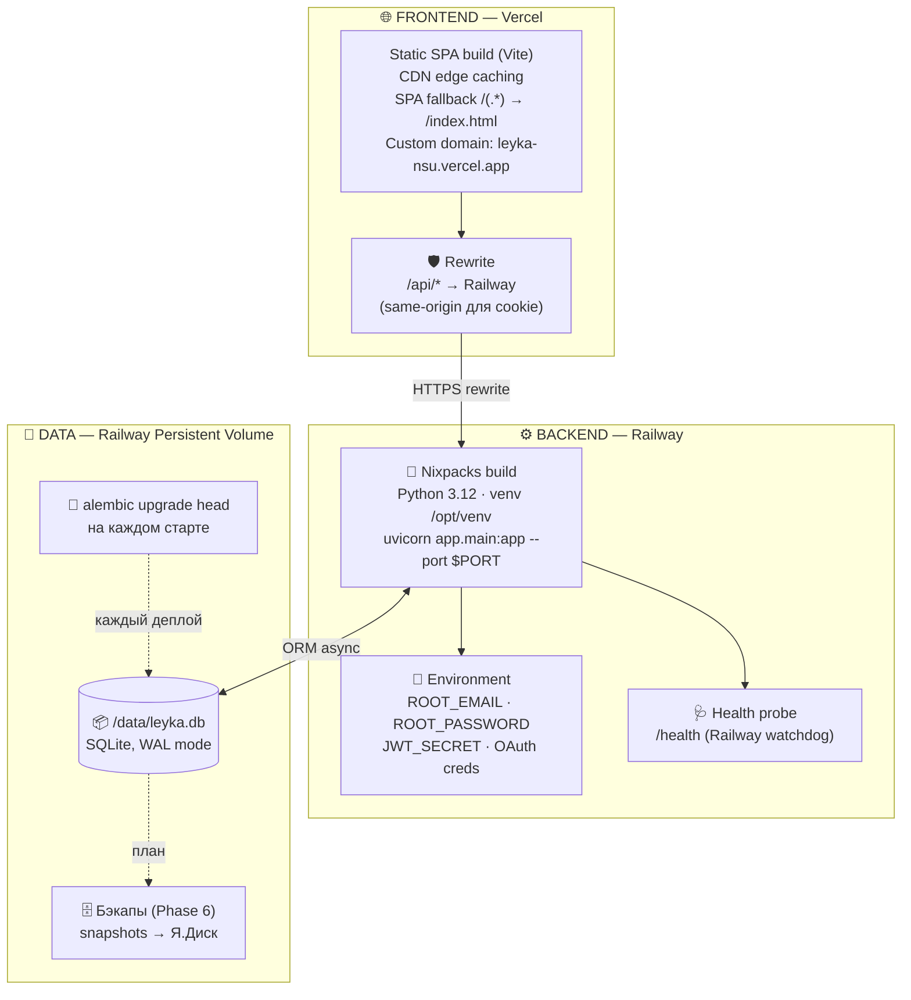

### 10.2 CI/CD

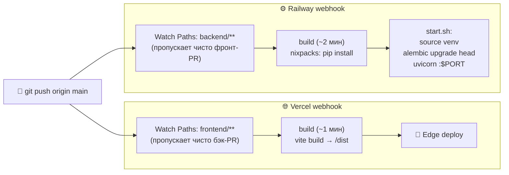

Подробности: [DEPLOY.md](DEPLOY.md), [SKILL-RELEASE.md](SKILL-RELEASE.md).

### 10.3 Файлы конфигурации

| Файл                       | Назначение                                  |
|----------------------------|---------------------------------------------|
| `frontend/vercel.json`     | SPA fallback + rewrites на Railway          |
| `nixpacks.toml`            | Python 3.12 + venv setup для Railway        |
| `railway.json`             | startCommand, healthcheck path              |
| `backend/start.sh`         | activate venv → migrate → uvicorn           |
| `backend/.env`             | Локальные секреты (НЕ в git)                |
| `backend/alembic.ini`      | Конфиг миграций                             |

### 10.4 Почему фронт на Vercel, бэк на Railway (а не моно-контейнер)

> Логичный вопрос: «не проще ли всё положить на Railway в один контейнер,
> чтобы убрать сетевые задержки между сервисами»? Короткий ответ — **нет**,
> потому что выигрыш в задержке API (десятки мс) меньше потерь на загрузке
> статики (сотни мс), плюс мы теряем независимый деплой. Длинный ответ ниже.

**Аргументы за разделение (по убыванию важности).**

1. **CDN для статики — критичнее, чем близость к API.**
   Vercel — это edge-CDN с ~300 PoP по миру. `index.html`, JS-bundle (~530 КБ), CSS, шрифты, иконки отдаются с ближайшей точки за **20–50 мс**. Если бы статика жила на Railway (eu-west), пользователь из Новосибирска получал бы первую отрисовку через **300+ мс TLS до Frankfurt** — медленнее в 6–10 раз. Time-to-first-paint — самый болезненный пункт UX, и его улучшает именно CDN.

2. **Immutable-кэш статики «бесплатно».**
   Vercel автоматически выставляет `Cache-Control: max-age=31536000, immutable` на хешированных bundle'ах (`index-CUD8QsOR.js`). Повторный визит = ноль сетевых запросов за статикой, только API-вызовы. На Railway это потребовало бы тонкой настройки nginx — лишний кусок инфры с риском ошибиться.

3. **Независимый деплой и rollback.**
   `git push main` → Vercel пересобирает фронт за ~30 сек, Railway не трогается; `git push` с правкой бэка — наоборот. Если фронт сломан после релиза — откат одной кнопкой Vercel deployments, бэкенд продолжает работать, БД не падает. В моно-контейнере любая ошибка в TS-сборке валит и API.

4. **Разные runtime/CPU-профили.**
   Фронт = статический HTTP (бесплатно у Vercel). Бэк = async-Python + SQLite-файл на persistent volume, ему нужны RAM и постоянный диск с WAL-журналом. Один контейнер = делить ресурсы и потерять возможность масштабировать раздельно.

5. **Cookie-auth работает «само» без CORS.**
   Браузер видит фронт и API на одном домене (`leyka-nsu.vercel.app/api/v1/...`) благодаря Vercel rewrite на Railway. `SameSite=Lax`+`HttpOnly` cookie работает без preflight-запросов, без CORS-заморочек, без `OPTIONS` round-trip. См. ADR-003.

**Контраргумент: «но задержка API в 80 мс между Vercel-edge и Railway».**
Эта задержка реальна, но **не она причина воспринимаемых лагов** в UI. Декомпозиция типичного PATCH'а:

| Стадия | Время |
|---|---|
| TLS+TCP до Railway, headers | 80–180 мс |
| FastAPI auth-cookie + DB UPDATE + RETURNING | 30–80 мс |
| Ответ обратно | 80–180 мс |
| Refetch списка задач (если без optimistic) | 80–180 мс + 30–80 мс |
| **Итог: 300–700 мс** | |

Если положить фронт+бэк в один контейнер на Railway, задержка PATCH сократится до ~150–300 мс (сэкономили один TLS-handshake) — но **загрузка страницы вырастет с ~50 мс до ~300 мс** для каждого запроса статики. Чистый проигрыш для большинства сессий, где открытие приложения и навигация по экранам случается чаще, чем mutation.

Воспринимаемая скорость UI решается не инфраструктурой, а паттерном **optimistic updates** — см. §2.3. После его применения время отклика на PATCH становится **0 мс независимо от RTT**, поэтому экономить десятки мс на API уже не имеет смысла.

**Когда стоило бы пересмотреть это решение.**
- Если бы у нас была СВОЯ команда DevOps и ПОЛЬЗОВАТЕЛИ только из России — имело бы смысл рассмотреть Yandex Cloud (статика на Object Storage + CDN, бэк на Compute) — это снизило бы и latency API, и latency статики для конкретного гео. Но усложняет CI/CD и забирает админ-ресурс.
- Если бы фронт-bundle стал > 2 МБ — порог, после которого CDN-выигрыш перестаёт компенсироваться, и имеет смысл серверный SSR (что меняет всю архитектуру).
- Если бы появился long-poll/WebSocket/SSE — пришлось бы держать persistent connection к бэку, и тут моно-контейнер дал бы плюс. Сейчас polling 15 сек через TanStack Query — этого достаточно.

**Итого:** разделение `Vercel | Railway` — это **сознательное архитектурное решение**, оптимизирующее именно ту метрику, которая чаще всего влияет на пользователя (TTFP), за счёт небольшого ухудшения той, которая решается на уровне фронта (perceived API latency через optimistic updates).

---

## 11. Безопасность

### 11.1 Чек-лист (зафиксирован в audit'е до релиза)

| Категория              | Защита                                                  | Статус |
|------------------------|---------------------------------------------------------|:------:|
| **Auth bypass**        | Все API под `Depends(current_user)` → 401 для анонимов  | ✅      |
| **JWT**                | HttpOnly cookie, SameSite=Lax, Secure на проде          | ✅      |
| **Production secrets** | Fail-fast при дефолтном JWT_SECRET / mock-auth на проде | ✅      |
| **CSRF (OAuth)**       | Random state в short-TTL cookie, `compare_digest`       | ✅      |
| **Author spoofing**    | `comments.author_id` форсится из cookie                 | ✅      |
| **Last-admin lockout** | Нельзя разжаловать/удалить последнего активного admin'а | ✅      |
| **Self-elevation**     | Self-edit режет `is_superuser`/`is_active`/`role`       | ✅      |
| **Direct task access** | `ensure_project_access` → 403 для не-членов             | ✅      |
| **Project leakage**    | Outsider lookup исключает чужие задачи                  | ✅      |
| **Invite enumeration** | Token = 24 байта base64url (`secrets.token_urlsafe`)    | ✅      |
| **XSS**                | Нет `dangerouslySetInnerHTML`, MentionText escape'ит    | ✅      |
| **CVE-аудит deps**     | python-dotenv 1.2.2, python-jose 3.5.0, bcrypt 4.0.1    | ✅      |
| **Starlette CVE**      | Документированный риск-acceptance: не используем FileResponse / multipart | ⚠ doc'd |

Регресс-тесты: [test_auth_lockdown.py](backend/tests/test_auth_lockdown.py) — 19 кейсов.

---

## 12. Метрики проекта

| Метрика                            | Значение                |
|------------------------------------|-------------------------|
| **Backend LOC** (`app/`)           | ~5 000                  |
| **Frontend LOC** (`src/`)          | ~18 000                 |
| **Backend файлов** (`*.py`)        | 50+                     |
| **Frontend компонентов** (`*.tsx`) | 35+                     |
| **API эндпоинтов**                 | 72                      |
| **Доменных моделей**               | 15 таблиц               |
| **Pydantic схем**                  | 11 модулей              |
| **Alembic миграций**               | 16                      |
| **Backend тестов**                 | **132 (all green)**     |
| **Frontend typecheck**             | strict, 0 errors        |
| **Bundle size (prod, gzip)**       | ~250 KB                 |
| **Языков i18n**                    | 1 (RU; EN — на потом)   |
| **OAuth провайдеров**              | 3 (Mail.ru, Google, mock) |
| **RBAC ролей в seed'е**            | 6 (12 permission flags) |
| **KPI центра**                     | 11 (z-1..z-11)          |
| **Visibility-режимов**             | 3 для проекта, 2 для партнёра |

---

## 13. Тестовая стратегия

### 13.1 Тестовая пирамида (текущая)

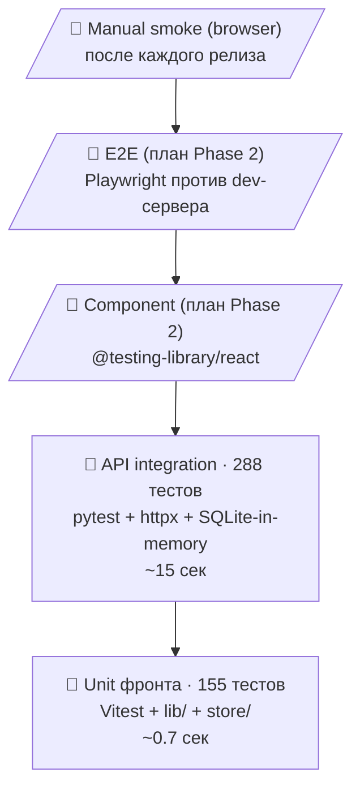

> Подробности — [SKILL-TESTPLAN.md](SKILL-TESTPLAN.md). Стиль диаграмм — [SKILL-MERMAID.md](SKILL-MERMAID.md).

### 13.2 Покрытие по доменам

| Файл                       | Тестов | Что покрывает                                        |
|----------------------------|:------:|------------------------------------------------------|
| `test_smoke.py`            | 4      | Health, /auth/me для anon/logged                     |
| `test_auth_lockdown.py`    | 19     | Anon-blocking, OAuth state CSRF, cancel flow         |
| `test_partners.py`         | 5      | CRUD заказчиков                                      |
| `test_projects.py`         | 6      | CRUD проектов, фильтр по партнёру                    |
| `test_visibility.py`       | 12     | private/public/demo матрица доступа                  |
| `test_user_admin.py`       | 15     | DELETE /users, last-admin lockout, rename            |
| `test_members.py`          | 6      | Add/update/remove participants                       |
| `test_roles.py`            | 6      | Permission matrix update                             |
| `test_tasks.py`            | 7      | CRUD + status history + mark-read                    |
| `test_attachments.py`      | 7      | URL-attachments lifecycle                            |
| `test_comments.py`         | 6      | Comment CRUD, edited_at, author from cookie          |
| `test_read_receipts.py`    | 4      | M:N read tracking                                    |
| `test_kpi.py`              | 13     | Catalog, commitments, achievements, year aggregation |
| `test_analytics.py`        | 3      | Project analytics: throughput, lead time             |
| `test_invites.py`          | 19     | Цепочка приглашений (создание, redeem, list, revoke) |

### 13.3 Тест-фикстуры

```
tests/conftest.py
   ├── engine          ─ in-memory SQLite, StaticPool, fresh per test
   ├── session_maker   ─ async_sessionmaker над engine
   ├── client          ─ AsyncClient (анон) с подменённым get_db
   ├── admin_client    ─ AsyncClient с cookie superuser'а
   ├── user_client     ─ AsyncClient с cookie regular_user
   └── helpers         ─ create_partner, create_project, add_member, _mk_user
```

---

## 14. Принятые архитектурные решения (ADR)

> Решения с обоснованием. Если приходит соблазн «передумать» — сначала
> прочитай тред, почему сейчас именно так.

| ADR  | Решение                                          | Почему                                                        |
|------|--------------------------------------------------|---------------------------------------------------------------|
| 001  | UUID в качестве primary key                      | Безопасный URL-share, легко генерить на клиенте               |
| 002  | SQLite на проде, не Postgres                     | <50 юзеров, объём БД <100 МБ за 5 лет — обоснование в SKILL-INFRA |
| 003  | Same-origin через Vercel rewrite, не CORS        | Cookie-auth работает «само», нет preflight-задержек           |
| 004  | HttpOnly cookie, не localStorage для JWT         | Защита от XSS-кражи токена                                    |
| 005  | Один `User.full_name` вместо `display_name`      | Простота, single source of truth (см. ревизию 2026-04-24)     |
| 006  | Два уровня ролей (User.role + ProjectMember)     | Глобальная должность ≠ права в проекте; синхронизированы лейблы |
| 007  | Visibility поверх RBAC                           | Гибкость онбординга: гость видит только public/demo           |
| 008  | Цепочка инвайтов вместо self-signup              | Контроль доступа: админ зовёт менеджера → менеджер зовёт devs |
| 009  | TanStack Query, не Redux                         | Минимум boilerplate для server state, optimistic updates      |
| 010  | Zustand для UI prefs, не Context                 | 2KB, persist middleware, нет re-render каскадов               |
| 011  | URL-based attachments (без файлового хранилища)  | НГУ уже использует Я.Диск/Google Docs — не дублируем          |
| 012  | Last-admin protection в backend, не frontend     | Critical защита, нельзя обойти через прямой API-вызов         |
| 013  | OpenAPI → TypeScript codegen                     | Контракт — единственная правда, нет ручных типов              |
| 014  | Phase 4 invites без email-нотификации            | SMTP — отдельный риск (deliverability); URL копируется руками |
| 015  | Welcome-задача с greeting от inviter             | Замыкает петлю: invitee сразу пишет ответ в чат пригласившему |
| 016  | Vercel (фронт) + Railway (бэк), не моно-контейнер| CDN для статики критичнее, чем -80мс на API; см. §10.4        |
| 017  | Optimistic updates для PATCH-мутаций задачи      | 0мс воспринимаемой задержки вместо 300–700мс; см. §2.3        |
| 018  | Чек-лист: «по умолчанию выключено, юзер включает» | Снимает «давление 39 пунктами» с нового проекта; см. §8.5     |
| 019  | Каталог слотов в коде, не в БД                   | 12×~3 артефакта меняются командой ЦИИ через PR, миграция не нужна |
| 020  | Drag-and-drop через OAuth user-flow, не Service Account | Service Account не имеет storage quota в personal Drive (Google policy 2022); см. §8.6 |
| 021  | Витрина центра как фильтр над KpiAchievement     | Не дублируем данные: одна запись = и KPI-факт, и (опц.) карточка витрины; см. §8.4 |
| 022  | Множественные evidences[] (до 10) у KPI-факта    | Один факт = N доказательств (акт + договор + демо); маркетинговая ссылка для витрины выбирается отдельно; см. §8.3 |
| 023  | Партнёр.color: ручной выбор + hash-fallback      | Серый исключён (плохой контраст); цветовая идентификация в sidebar — собственность пользователя |
| 024  | Складной sidebar (icon-rail) с persist           | Notion/Slack-стандарт; ⌘+B; до 10 партнёров без скролла       |

---

## 15. Дальнейшее развитие

### 15.1 Backlog (приоритизировано)

| Phase  | Что                                                            | Сложность  |
|--------|----------------------------------------------------------------|------------|
| **6**  | SMTP-нотификации (приглашения, ответы в @-упоминаниях)         | M (config) |
| **7**  | Бэкап БД на Yandex.Disk + retention policy                     | M          |
| **8**  | Wiki-страницы для проектов (markdown + конфиденциальный flag)  | L          |
| **9**  | Per-project KPI report PDF (для отчётности в Минобрнауки)      | M          |
| **10** | Bulk export проекта (zip с задачами + комментами + ссылками)   | M          |
| **11** | I18n: английский UI                                            | S          |
| **12** | PWA: offline-режим, push-уведомления                           | L          |

### 15.2 Технический долг

- ❌ Нет E2E-тестов (Playwright). Манульный smoke после каждого релиза.
- ❌ TanStack Query refetch стратегия не оптимизирована (везде `refetchInterval: 15s` где нужно — overkill).
- ❌ Bundle не code-split'нут — все 250KB загружаются сразу.
- ❌ SQLite не enforce'ит FK constraints без `PRAGMA foreign_keys=ON` — компенсируем ORM cascade'ами.

---

## 16. Ссылки

| Документ              | Содержание                                                        |
|-----------------------|-------------------------------------------------------------------|
| [README.md](README.md)| Пользовательская инструкция: роли, KPI, типовые сценарии          |
| [Swagger UI (live)](https://leyka-production.up.railway.app/docs)| OpenAPI 3.1 + интерактивный «Try it out» по всем ручкам |
| [DEPLOY.md](DEPLOY.md)| Шаги первичного деплоя на Vercel/Railway                          |
| [SKILL-RELEASE.md](SKILL-RELEASE.md)| Релизный процесс, обнаруженные подводные камни      |
| [SKILL-AUTH.md](SKILL-AUTH.md)| Детали OAuth-конфигурации провайдеров                     |
| [SKILL-UI-Master.md](SKILL-UI-Master.md)| UI-гайдлайны (цвета, тени, иконки)              |
| [SKILL-TESTPLAN.md](SKILL-TESTPLAN.md)| Тест-план, пирамида, рецепты добавления тестов  |
| [SKILL-INFRA.md](SKILL-INFRA.md)| SQLite vs Postgres, размер БД, спецификация НГУ-сервера   |
| [SKILL-MERMAID.md](SKILL-MERMAID.md)| **Гайдлайны для всех Mermaid-диаграмм** в проекте    |
| [TODONOW.md](TODONOW.md)| Текущий план работ, открытые вопросы                            |
| [backlog.md](backlog.md)| Долгосрочный бэклог идей                                         |

---

> *Документ создан 2026-04-24. Поддерживается параллельно с кодом.*
> *При значимых изменениях архитектуры — обновлять одновременно с PR.*
