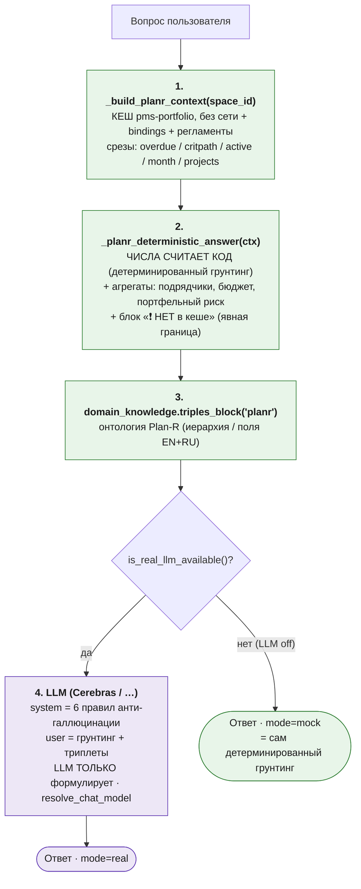

# Архитектура ИИ-аналитика Plan-R (гибрид: детерминированный грунтинг + LLM)

**Дата:** 2026-07-03. **Статус:** реализовано (P0+), разбор качества по 16 вопросам проведён.
**Связано:** [REQ-ANALYST-STUDIO-PLANR-AGENT.md](REQ-ANALYST-STUDIO-PLANR-AGENT.md) (требования),
[REQ-ZET-INTEGRATION.md](../REQ-ZET-INTEGRATION.md) / [TZ_ZET_v2_final.md](../TZ_ZET_v2_final.md) (планка
доверенности), [ROADMAP-PLANR.md](ROADMAP-PLANR.md) (банк вопросов).

> Этот документ описывает **как устроен** агент (пайплайн, слои, анти-галлюцинация) и
> **разбор качества** по каждому вопросу. Требования — в REQ-ANALYST.

---

## 1. Планка качества (из ZET/TZ-ZET)

РАГРАФ = **детерминированный верификатор** с *информационной асимметрией*: числа и факты
считает КОД, LLM только формулирует. Пользователь должен **доверять** ответу → 3 требования:
1. **Числа не выдумываются** — все метрики из детерминированного грунтинга.
2. **Ссылки из реестра** — `/planr?space=…`, `/regulations/…` (id из bindings), не сочиняются.
3. **Честная граница** — чего нет в кеше, то прямо «нужен целевой pull», а не догадка.

## 2. Гибридный пайплайн (`sandbox.planr_ask`)

**Ключевое усложнение (то, что добавили):** system-промпт получает **данные проекта из Plan-R**
(грунтинг) + **онтологию** (триплеты). LLM работает не «из головы», а поверх детерминированного
среза → числа не галлюцинируются, а формулировка живая.

## 3. Слои грунтинга (детерминированные, `_planr_deterministic_answer`)

| Блок | Источник | Отвечает на вопросы |
|---|---|---|
| Сводка (объекты/просрочка/крит/макс) | `summary` | критические показатели; в графике/риске; дайджест |
| Требуют внимания (top-N, +стоимость этапа) | `stages` | что требует внимания; эскалация |
| 🎯 Критический путь (ВСЕ критпуть-этапы или «нет») | `stages[critical_path]` | отклонение на критпути |
| 🔧 В работе сейчас (0<факт<100) | `active_stages` | текущие работы |
| 📅 Финиш в текущем месяце | `month_plan_stages` | план на месяц |
| 👷 Просрочки по подрядчикам (агрегат) | `stages` | какой подрядчик хуже |
| 💰 Перерасход бюджета (факт>план по объекту) | `projects` | перерасход бюджета |
| 📊 Портфельный риск (макс.просрочка × стоимость договора) | `projects` + `stages` | что тянет портфель вниз |
| ❗ НЕТ в кеше | константа | разрешения/ГГЭ, вехи, baseline/EVM, ставки штрафов, ресурсы |
| Регламенты + ссылка на портфель | `bindings`/`reg_names` | доверие/цитируемость |

**Почему агрегаты считает код, а не LLM:** «у какого подрядчика больше просрочек», «портфельный
риск», «перерасход» — это подсчёты. Если отдать их LLM (как раньше), он выдумывает (напр. ставку
штрафа «0,1% × 18 дн»). Поэтому агрегаты — детерминированные, LLM их только пересказывает.

## 4. Анти-галлюцинация (system-промпт, 5 правил)

1. Критический путь = ТОЛЬКО 🎯-этапы; не выдавать просрочку за критпуть; нет 🎯 → «не отмечено».
2. Причину отклонения НЕ выдумывать (нет в данных → «нужен целевой pull»).
3. Ответственный = подрядчик; внутренний (Куратор/ГИП) — нет в кеше, ФИО не сочинять.
4. Деньги/штрафы: НЕ придумывать ставку/процент/сумму; можно лишь приоритизировать по
   стоимости этапа + просрочке; денежный штраф — по договору (нет в кеше).
5. Нет данных (см. «❗ НЕТ в кеше») → честно сказать, не заполнять догадкой.

## 5. Контракт данных (что персистит Plan-R через API)

**ЕСТЬ:** progress, cost_plan/fact, статус, имена, подрядчик, criticalPath (боевые данные),
finish-даты (боевые), стоимость договора (прокси из cost_plan). **НЕТ (движок считает сам /
не отдаёт):** даты у API-засеянных демо; slip; разрешения/ГГЭ; target-версии (план-факт/EVM);
вехи; ставки штрафов; ресурсы (люди/техника). → всё из «НЕТ» списка = честный отказ + роадмап.

## 6. Разбор качества по 16 вопросам (тест на Cerebras gpt-oss-120b)

| # | Вопрос | Данные | Было → Стало |
|---|---|---|---|
| 1 | Требуют внимания | overdue | ✅ хорошо |
| 2 | Ближайшая веха | вех нет | ❌ выдумывал → ✅ честный отказ (boundary) |
| 3 | Критические показатели | summary | ✅ |
| 4 | Прогноз по штрафам | overdue+стоимость | ❌ выдумывал ставку 0,1% → ✅ риск-балл + честно про ставку |
| 5 | Отклонение на критпути | critical_path | ❌ путал с просрочкой, выдумывал причины → ✅ только 🎯 |
| 6 | Что в работе | active | ✅ |
| 7 | Финиш в месяце | month_plan | ✅ (на демо честно «дат нет») |
| 8 | План-факт от baseline | нет target | ❌ → ✅ честный отказ (Этап 4) |
| 9 | Разрешения/ГГЭ | нет | ❌ → ✅ честный отказ (Этап 2) |
| 10 | Разрешение на ввод | нет | ✅ честный отказ |
| 11 | Портфельный риск | projects+stages | ⚠️ неявно → ✅ детерм. риск-ранжирование |
| 12 | Подрядчик с просрочками | агрегат | ⚠️ LLM-агрегация → ✅ детерм. агрегат |
| 13 | Перерасход бюджета | projects cost | ❌ не было в грунтинге → ✅ блок (по объектам; по этапам честно «нет») |
| 14 | В графике / в риске | summary | ✅ |
| 15 | Что эскалировать | overdue+критпуть+риск | ✅ |
| 16 | Дайджест | весь грунтинг | ✅ |

**Итог:** ключевые провалы (штрафы, критпуть, бюджет, вехи, разрешения) закрыты обогащением
детерминированного грунтинга + явной границей + правилами промпта. Числа не выдумываются,
ссылки из реестра, недостающее — честный отказ. Это и есть «верификатор с инф. асимметрией» ZET.

## 6a. Стабильность и кросс-модельный тест (2026-07-04)

Тест: 3 вопроса × 3 модели Cerebras + стабильность (1 вопрос × gpt-oss-120b × 10 прогонов
с паузами). Эталон детерминирован кодом: ООО Проект ИС=5, СтройГрупп=3, МостИнжиниринг=1.

| Модель | Факты (числа) | Выдуманные ставки | Вывод |
|---|---|---|---|
| **gpt-oss-120b** | ✅ 5/3/1 верно во всех прогонах | нет | **эталон** — рекомендуемая по умолчанию |
| **gemma-4-31b** | ✅ верно, кратко | нет | ок (медленнее ~50 т/с) |
| **zai-glm-4.7** | ✅ верно (после фикса) | нет | reasoning-модель — см. фикс ниже |

**Стабильность (gpt-oss × 10 прогонов):** числа НЕ «плавают» — 5/3/1 в каждом прогоне (факты
из грунтинга, не из модели); варьируется только формулировка. Ни одной выдуманной ставки штрафа.
`temperature` снижена 0.2 → **0.1** (верификатор: факты фиксированы, «творчество» не нужно).

**Найден и починен баг (zai-glm-4.7):** reasoning-модель тратит токены на «мышление»; при малом
`max_tokens` упиралась в лимит с ПУСТЫМ `content` (finish=length) → `planr_ask` отдавал сырой
грунтинг (выглядело как «эхо блока данных»). **Фикс:** при пустом `content` — ретрай с минимальным
system-промптом и щедрым бюджетом токенов (`min(max(eff_max,4000),8000)`). После фикса GLM отвечает
корректно на все 3 вопроса (fallback=False). Модель-агностично — спасает любую reasoning-модель.

**Вывод для доверия:** «плавает» только стиль, а не цифры — ровно то, что даёт детерминированный
грунтинг. Числовая галлюцинация невозможна by design (модель не считает, только пересказывает).

## 7. Что дальше (по мере роста данных)

- **Интент-роутинг (regex) — опция, НЕ обязателен для точности:** грунтинг сейчас
  комплексный (все блоки), LLM выбирает релевантный. Regex-фокус («ФОКУС: критпуть») мог бы
  ТРИМить грунтинг для скорости/краткости — добавим, если ответы станут слишком длинными.
- **Новые данные → новые срезы + снятие из «НЕТ в кеше»:** разрешения/ГГЭ (Этап 2),
  target-версии/EVM (Этап 4), EPS-роли (внутренний ответственный), свежесть графиков (Q2),
  ресурсы (Q4/Q5, блок — нужен экспорт из Plan-R).
- **Регресс-тест 16 вопросов** прогонять после изменений грунтинга (снапшот-фикстура +
  проверка «нет выдуманных ставок/причин/вех»).

## Файлы
`backend/app/services/sandbox.py` (`_build_planr_context`, `_planr_deterministic_answer`,
`planr_ask` + system-промпт), `backend/app/services/etl/puller.py` (`_build_planr_portfolio` —
срезы+стоимость), `backend/app/services/domain_knowledge.py` (триплеты `planr`),
`frontend/src/components/sandbox/SandboxScreen.tsx` (чипы вопросов).
