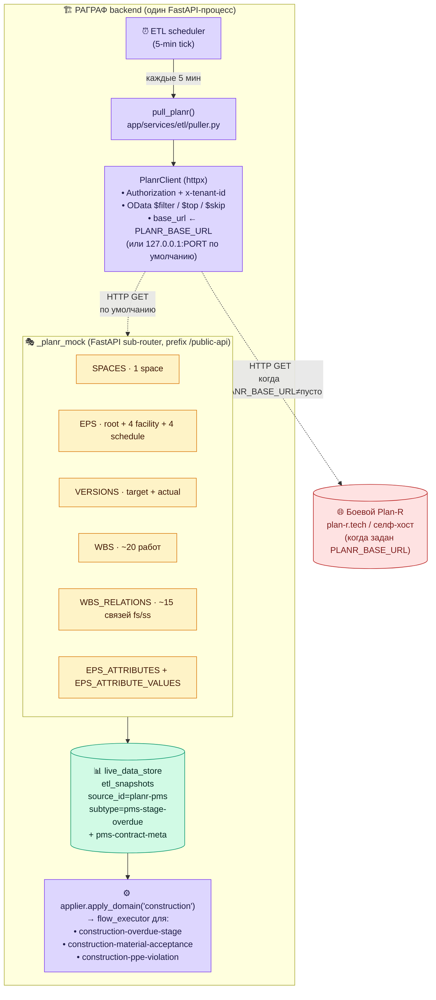
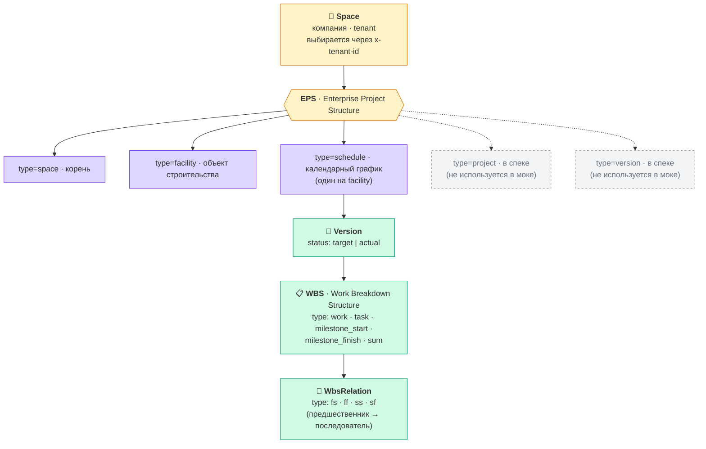
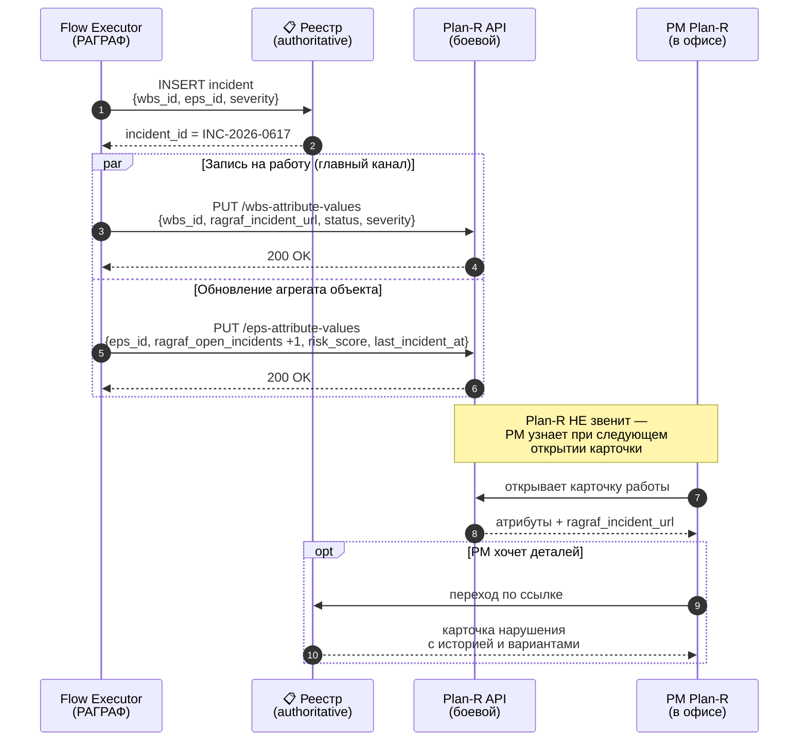
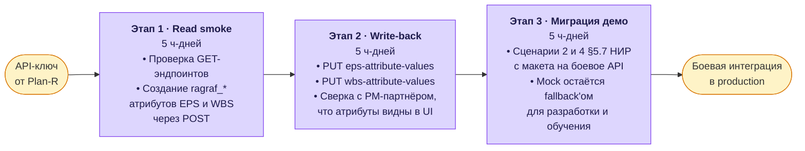

# Plan-R Mock + согласованная модель боевой интеграции

**Адресат:** команда РАГРАФ (для эксплуатации) + индустриальные партнёры строительной отрасли (для демонстрации) + методологи (для понимания, как эмулируется и переходит в боевой режим интеграция) + команда Plan-R (как живой документ согласованной модели).
**Автор:** РАГРАФ.
**Статус:** v1.1 — обновлён 2026-06-03 после прямого диалога с командой Plan-R и согласования модели боевой записи. v1.0 — реализован 2026-05-25.
**Базовый спек:** [plan-r.tech Public API v602](https://plan-r.tech/public-api/swagger/index.html).
**Связанный документ:** [`UML-PARTNER-INTEGRATION-FLOWS.md`](../UML-PARTNER-INTEGRATION-FLOWS.md) — 6 mermaid-диаграмм согласованных сценариев интеграции для команды Plan-R и Σ СИГМА.

---

## 0. Коротко

В РАГРАФ встроен **мок Plan-R Public API v602** (российская PMS для строительства), эмулирующий 7 GET-эндпоинтов чтения. Мок имеет синтетический датасет из 4 стройобъектов Новосибирска с реалистичной структурой работ, договоров и просрочек. ETL puller `pull_planr` каждые 5 минут ходит в этот мок, агрегирует данные и пишет в `etl_snapshots` под `source_id=planr-pms`, типы `pms-stage-overdue` и `pms-contract-meta`. Construction-регламенты в потоке получают живые PMS-метрики без настройки внешнего сервиса.

**Что нового в v1.1 (2026-06-03):**

- Начат **прямой диалог с командой Plan-R**, получено принципиальное согласие на выдачу API-ключа для тестового пространства;
- Согласована **архитектурная модель боевой интеграции** — «реестр нарушений в РАГРАФ + связь с задачами WBS через кастомные атрибуты EPS/WBS», **без push-уведомлений** в график (это сознательный выбор Plan-R, а не пробел);
- Изучены **все 25 эндпоинтов** публичного API v602 и сведены в **4 логических контура** для РАГРАФ;
- Подготовлена **дорожная карта перехода на боевое API** — 3 этапа × 5 человеко-дней ≈ 3 рабочие недели после получения ключа.

**Конфиг — одна переменная окружения:**
- По умолчанию (`PLANR_BASE_URL` пуст) → ходит во встроенный mock на том же сервере
- Для боевого Plan-R → `PLANR_BASE_URL=https://plan-r.tech` + реальный токен/тенант

---

## 1. Архитектура (текущая, read-only через мок)



Когда `PLANR_BASE_URL` указывает на внешний сервер, поток идентичен — меняется только URL в httpx-клиенте, всё остальное (auth, OData, mapping) работает как с моком. Это первичный read-канал. Боевой режим v1.1 добавит **write-канал** (см. §5).

---

## 2. Соответствие Plan-R Public API v602

Спека: `/public-api/swagger/602/swagger.json` (29 schemas, 14 endpoints).

### 2.1 Сущности (EPS-иерархия из Primavera P6)



### 2.2 Карта 4 логических контуров публичного API v602

Изучение Swagger v602 (по состоянию на 2026-06-03) показывает, что публичный API содержит **25 эндпоинтов в 8 тематических группах**, которые для целей РАГРАФ удобно свести в **4 логических контура**:

```mermaid
flowchart LR
    subgraph C1["📁 EPS · структура портфеля (10 эндп.)"]
        E1["GET·POST·PUT·DELETE /eps"]
        E2["GET·POST·PUT·DELETE /eps-attributes"]
        E3["GET·PUT /eps-attribute-values"]
    end

    subgraph C2["🔀 WBS · декомпозиция работ (12 эндп.)"]
        W1["GET·POST·PUT·DELETE /wbs"]
        W2["GET·POST·PUT·DELETE /wbs-attributes"]
        W3["GET·POST·PUT·DELETE /wbs-relations"]
    end

    subgraph C3["📌 Versions · план vs факт (2 эндп.)"]
        V1["GET /versions"]
        V2["PUT /versions/&#123;id&#125; — смена статуса"]
    end

    subgraph C4["🏢 Spaces · пространства (1 эндп.)"]
        S1["GET /spaces"]
    end

    PURPOSE_C1["<b>Назначение в РАГРАФ:</b><br/>чтение иерархии объектов +<br/>запись агрегатов реестра<br/>нарушений на узлы портфеля"]
    PURPOSE_C2["<b>Главный канал записи:</b><br/>ссылки на инциденты<br/>прямо на конкретные работы<br/>WBS — proof-of-impact"]
    PURPOSE_C3["<b>Опциональный канал:</b><br/>смена статуса версии<br/>при критическом накоплении<br/>отклонений"]
    PURPOSE_C4["<b>Изоляция данных:</b><br/>выбор пространства<br/>при первом подключении,<br/>наследование прав"]

    C1 --- PURPOSE_C1
    C2 --- PURPOSE_C2
    C3 --- PURPOSE_C3
    C4 --- PURPOSE_C4

    classDef contour fill:#ddd6fe,stroke:#7c3aed,color:#1e1b4b
    classDef purpose fill:#fef3c7,stroke:#d97706,color:#451a03
    class E1,E2,E3,W1,W2,W3,V1,V2,S1 contour
    class PURPOSE_C1,PURPOSE_C2,PURPOSE_C3,PURPOSE_C4 purpose
```



Все эндпоинты поддерживают OData-фильтрацию и пагинацию (см. §2.4). Аутентификация — по API-ключу пользователя Plan-R + tenant. Полная UML-карта сценариев — в [`UML-PARTNER-INTEGRATION-FLOWS.md`](../UML-PARTNER-INTEGRATION-FLOWS.md).

### 2.3 Реализованные в моке эндпоинты (7 из 25)

Мок v1.0 покрывает только read-сторону для текущего ETL-пуллера:

| Метод | Путь | Реализация в моке |
|---|---|---|
| GET | `/public-api/spaces` | 1 space «ООО НСК Строители» |
| GET | `/public-api/eps` | 9 узлов: 1 root + 4 facility + 4 schedule |
| GET | `/public-api/eps-attributes` | 3 атрибута (сумма, штраф, ИНН подрядчика) |
| GET | `/public-api/eps-attribute-values` | 12 значений (3 атрибута × 4 facility) |
| GET | `/public-api/versions` | 8 версий (target + actual для каждого schedule) |
| GET | `/public-api/wbs` | 20 работ (5 на каждый объект) |
| GET | `/public-api/wbs-relations` | 15 связей fs / ss типа |

**Не реализованы в моке** (планируются в v1.2 одновременно с боевой интеграцией — см. §5 и дорожную карту в §11):
- `POST /public-api/eps-attributes` + `PUT /public-api/eps-attribute-values` — главный write-канал агрегатов реестра
- `POST /public-api/wbs-attributes` + `PUT /public-api/wbs-attribute-values` — главный write-канал инцидентных ссылок
- `PUT /public-api/versions/{id}` — опциональная смена статуса baseline при критических отклонениях
- Остальные CRUD-эндпоинты (POST/PUT/DELETE для EPS, WBS, WbsRelations) — **не используем сознательно**: РАГРАФ не создаёт структуру в Plan-R, только дополняет атрибутами

### 2.4 OData поддержка

| Параметр | Поддержка в моке | Примечание |
|---|---|---|
| `$filter` | минимальная: `field eq 'value'` или `field eq 123` | хватает для нашего ETL |
| `$top` | да | пагинация |
| `$skip` | да | пагинация |
| `$orderby` | игнорируется (возвращаем default-порядок) | для демо не критично |
| `$select` | игнорируется (возвращаем все поля) | |
| `$apply` | игнорируется | агрегации не реализованы |

### 2.5 Авторизация (как в реальном Plan-R)

Заголовки в каждом запросе:
- `Authorization: <token>` — apiKey, **не Bearer**! (это особенность Plan-R, отличается от стандарта OAuth2)
- `x-tenant-id: <space-id>` — выбор воркспейса

В моке зашиты константы (`DEMO_TOKEN`, `DEMO_TENANT`), чтобы не плодить
state. Любой другой токен → 401, любой другой тенант → 403.

---

## 3. Синтетический датасет

### 3.1 Объекты (4 facility)

| EPS-id | Название | Подрядчик | Сумма, млн ₽ | Штраф/день |
|---|---|---|---|---|
| `eps-puls` | ЖК «Пульсар» (5 секций, Заельцовский р-н) | ООО «СтройМонтаж» (ИНН 5404987654) | 1 850 | 0.10% |
| `eps-crys` | БЦ «Кристалл» (Большевистская, 14 эт.) | ООО «Альфа Инжиниринг» (5404123789) | 920 | 0.15% |
| `eps-sch42` | Капремонт МБОУ СОШ №42 | ООО «РемСтрой-42» (5404555111) | 85 | 0.05% |
| `eps-bridge-inya` | Реконструкция моста через р. Иня | АО «Мостострой-12» (5404888222) | 720 | 0.20% |

### 3.2 Сценарии просрочки (по WBS-работам)

Датасет специально сконструирован под три демо-сценария:

| Объект | Макс. просрочка | Класс | Что должно сработать на дашборде |
|---|---|---|---|
| ЖК «Пульсар» | 7 дней (монолит) | WARN | Уведомление ГИП + расчёт штрафа = 7 × 50 000 ₽ × 1850 / 1000 ≈ 648 тыс ₽ |
| БЦ «Кристалл» | 2 дня | НОРМА | Мониторинг без эскалации |
| Школа №42 | 18 дней (замена кровли) | CRITICAL | Эскалация инвестору, рассмотрение расторжения (`construction-overdue-stage` критический threshold = 14 дней) |
| Мост Иня | 0 дней | НОРМА | По графику |

### 3.3 Структура WBS (пример ЖК «Пульсар»)

| Код | Название | Тип | Просрочка | Прогресс |
|---|---|---|---|---|
| 1.1 | Земляные работы и фундамент | work | 0 дн | 100% |
| 1.2 | Монолит подземной части (стилобат) | work | **7 дн** | 85% |
| 1.3 | Монолит секций 1–3, этажи 1–5 | work | 2 дн | 72% |
| 1.4 | Кладка наружных стен | work | 0 дн | 30% |
| 1.5 | Окна, фасадная отделка | milestone_start | 0 дн | 0% |
| 1.6 | Ввод в эксплуатацию | milestone_finish | 0 дн | 0% |

WBS-связи (`fs`, finish-start) формируют классическую цепочку «фундамент →
монолит → стены → фасады → инженерка → ввод», как в боевом Primavera-проекте.

---

## 4. Mapping Plan-R → РАГРАФ-сенсоры

### 4.1 pms-stage-overdue ← Plan-R WBS (work)

Источник: `GET /public-api/wbs?EpsId=<schedule>&$filter=type eq 'work'` для
каждой actual-версии графика.

| Поле в нашем `sensor_field_schemas` | Из чего вычитывается из Plan-R |
|---|---|
| `event` | литерал `"stage_overdue"` |
| `stage_label` | `wbs.values.name` (или `wbs.code` если name отсутствует) |
| `overdue_days` | `wbs.values.overdue_days` |
| `contractor_id` | `wbs.values.contractor_id` |
| `planned_completion` | `wbs.values.planned_completion` |
| `actual_progress_pct` | `wbs.values.actual_progress_pct` |

Плюс агрегаты per-tick:
- `max_overdue_days` — max по всем работам всех объектов
- `critical_overdue_count` — счёт работ с `overdue_days ≥ 14`

### 4.2 pms-contract-meta ← Plan-R EPS-attributes (facility)

Источник: `GET /public-api/eps?$filter=type eq 'facility'` + `eps-attributes`
+ `eps-attribute-values`. Эвристика маппинга `_normalize_attr_key()` в
[`planr_client.py`](../../backend/app/services/etl/planr_client.py):

| Поле | Plan-R label (substring match) | Тип |
|---|---|---|
| `contract_value_million_rub` | «Сумма договора» | decimal (млн ₽) |
| `penalty_rate_percent` | «Ставка штрафа» | decimal (%) |
| `contractor_inn` | «ИНН генподрядчика» | string |
| `facility_id` | EPS id напрямую | string |
| `facility_name` | EPS name напрямую | string |

Это снимает ограничение, что у каждого тенанта Plan-R могут быть свои
labels атрибутов. На стороне РАГРАФ — стабильные ключи.

---

## 5. Согласованная модель боевой записи (v1.1)

После прямого диалога с командой Plan-R (2026-06-03) зафиксирована **архитектурная модель write-back** для боевого режима. Модель отвечает на главный вопрос «как РАГРАФ пишет нарушения в Plan-R, не мешая основной работе с графиком» — и опирается на философию Plan-R: **«это инструмент планирования, а не сцена realtime-мониторинга»**.

### 5.1 Принципы

| Принцип | Что означает |
|---|---|
| **Реестр — у нас** | Источник истины по нарушениям живёт в DuckDB-таблице `incidents_registry` РАГРАФ; в Plan-R через атрибуты лежат **только ссылки и агрегаты**, не сами записи. |
| **Связь через атрибуты, не через notification feed** | РАГРАФ не пушит сообщения внутрь UI Plan-R (этого нет в API и не должно быть — Plan-R планирует график, не звенит при каждом происшествии). |
| **Параллельные каналы для критики** | Для срочных алертов используются LEYKA + Макс/Telegram + СМС — каналы доставки исполнителю, не Plan-R. |
| **PM получает контекст по запросу** | Когда PM открывает карточку работы в Plan-R, он видит атрибут со ссылкой в реестр РАГРАФ и опционально переходит — pull, не push. |

### 5.2 Кастомные атрибуты на стороне Plan-R

**На уровне EPS (объект портфеля):**

| Имя атрибута | Тип | Что туда пишем |
|---|---|---|
| `ragraf_open_incidents` | integer | Число открытых нарушений по объекту |
| `ragraf_risk_score` | decimal (0–100) | Агрегированный риск-скор по реестру |
| `ragraf_last_incident_at` | timestamp | Время последнего нарушения |
| `ragraf_registry_url` | string (URL) | Ссылка на полный реестр объекта в РАГРАФ |

**На уровне WBS (работа):**

| Имя атрибута | Тип | Что туда пишем |
|---|---|---|
| `ragraf_incident_url` | string (URL) | Ссылка на запись в реестре РАГРАФ |
| `ragraf_incident_status` | string | `opened` / `in_progress` / `closed` |
| `ragraf_incident_severity` | string | `info` / `warning` / `critical` |
| `ragraf_regulation_id` | string | Идентификатор сработавшего регламента |

Все атрибуты — РАГРАФ-неймспейс (`ragraf_*`), не пересекаются с пользовательскими атрибутами Plan-R. Создаются однократно при первом подключении через `POST /eps-attributes` и `POST /wbs-attributes`.

### 5.3 Sequence: запись нарушения в Plan-R



### 5.4 Что НЕ делаем (сознательно)

- **Не создаём** структуру (EPS, WBS, Versions) в Plan-R через POST — это компетенция PM, мы только дополняем атрибутами;
- **Не используем** notification-эндпоинты — их нет в API, и не нужны (см. философию Plan-R выше);
- **Не пишем в Versions** на каждое нарушение — `PUT /versions/{id}` для смены статуса используется только при критическом накоплении отклонений и только после явного согласования с PM;
- **Не загружаем файлы** (фото, накладные) в Plan-R — это идёт через LEYKA, в Plan-R через атрибут попадает только ссылка на LEYKA-задачу.

---

## 6. Конфигурация и переключение mock ↔ боевой Plan-R

### 6.1 Переменные окружения

```bash
# Дефолт (mock на том же хосте, 127.0.0.1:$PORT):
PLANR_BASE_URL=
PLANR_AUTH_TOKEN=demo-token-2026
PLANR_TENANT_ID=nsk-builders-demo

# Боевой Plan-R заказчика:
PLANR_BASE_URL=https://plan-r.example.com
PLANR_AUTH_TOKEN=<реальный apiKey из Plan-R UI>
PLANR_TENANT_ID=<реальный space-id>
```

Если `PLANR_AUTH_TOKEN` пуст — puller возвращает `skipped` без health-error
(аналогично disabled LEYKA).

### 6.2 Где зашиты токены мока

В файле `app/api/_planr_mock.py`, константы:
```python
DEMO_TOKEN = "demo-token-2026"
DEMO_TENANT = "nsk-builders-demo"
```

Любой другой токен → 401, любой другой тенант → 403. На Railway/Vercel —
работает безо всякой конфигурации, дефолтные значения зашиты в puller.

### 6.3 Подключение к боевому Plan-R — шаги для заказчика

1. Получить от admin Plan-R инстанса:
   - apiKey-токен (UI Plan-R → Settings → API Keys → Generate)
   - space-id того воркспейса, где живут проекты (UI: URL после `/spaces/`)
2. Прописать в Railway / .env:
   ```
   PLANR_BASE_URL=https://plan-r.example.com
   PLANR_AUTH_TOKEN=<token>
   PLANR_TENANT_ID=<space-id>
   ```
3. Перезапустить backend.
4. На странице **Пульт ядра** → ETL источник `planr-pms` должен загореться
   зелёным (health=ok), снапшоты начнут писаться в `etl_snapshots`.
5. На дашборде «Состояние ETL» появится `planr-pms` с реальной просрочкой
   этапов из боевого Plan-R.

**Кода менять не нужно** — клиент совместим со спекой v602, mapping атрибутов
сохраняется (если labels на боевом сервере содержат «Сумма договора», «Ставка
штрафа», «ИНН» — иначе нужно подправить `_LABEL_TO_KEY` в `planr_client.py`).

---

## 7. Что демонстрирует мок методологу/заказчику

### Сценарий демо (3 минуты)

1. **Заказчик открывает дашборд РАГРАФ → раздел «Состояние ETL»**
   → видит `planr-pms` с 4 snapshots в минуту, health=ok

2. **Заказчик открывает регламент `construction-overdue-stage` → Flow**
   → видит цепочку `pms-stage-overdue` (sensor) → input `allowedOverdueDays` (3 дня)
   → threshold → switch → output (уведомление ГИП / эскалация инвестору)

3. **Заказчик нажимает «Запустить» (или ждёт автоматического tick)**
   → flow_executor берёт последний snapshot с `max_overdue_days = 18`
   → threshold 14 превышен → switch выбирает «Эскалация инвестору»
   → output `escalate_investor` срабатывает (level=2)
   → в `regulation_metrics` записывается прогон

4. **Заказчик открывает регламент → метрики «ТФС-6 подкрепление»**
   → success_rate, p50_latency, recent_runs (с указанием конкретного объекта
   `eps-sch42` через trace)

5. **Заказчик переключает env-переменную** `PLANR_BASE_URL` на реальный
   адрес → перезапуск → тот же поток работает уже с боевыми данными подрядчика.

### Что заказчик НЕ увидит явно (но что есть под капотом)

- 7 GET-эндпоинтов точно по спеке Plan-R v602
- OData $filter с правильной семантикой
- Авторизация в правильном формате (apiKey + x-tenant-id)
- 12 тестов покрывают auth, shape, OData, pagination, e2e flow

---

## 8. Известные ограничения мока

| Что | Почему ограничено | Когда решим | Статус v1.1 |
|---|---|---|---|
| Только GET-эндпоинты (нет POST/PUT/DELETE) | v1.0 — РАГРАФ был read-only потребителем Plan-R | На v1.2 — добавим POST `/eps-attributes`, `/wbs-attributes` и PUT `/*-attribute-values` (см. §5 модель + §11 дорожная карта) | 🚧 запланировано |
| OData только `eq` (нет `gt/lt/and/or`) | Минимум для текущего ETL | По мере появления сложных фильтров | ⏸ остаётся |
| Все данные статичные (overdue_days фиксирован) | Демо-эффект: видимая критическая просрочка | Можно сделать осциллирующим | ⏸ остаётся |
| 1 space, 4 facility | Демо-набор | По запросу — расширяем датасет | ⏸ остаётся |
| Нет WbsAttribute (только EpsAttribute) | Для pms-stage-overdue хватало values в WBS | На v1.2 — добавим, потому что **WbsAttribute стал главным write-каналом** для инцидентных ссылок (см. §5.2) | 🚧 запланировано |
| Нет аутентификации по oauth2 / mTLS | Только apiKey-токен | Plan-R сам пока не поддерживает | ⏸ остаётся |

---

## 9. Тестирование

Покрытие — [`backend/tests/test_planr_mock.py`](../../backend/tests/test_planr_mock.py),
12 тестов:

1. **Auth (3 теста):** 401 без хедера, 401 с неверным токеном, 403 с неверным тенантом
2. **Shape (4 теста):** spaces / eps / versions / wbs возвращают правильную структуру
3. **OData (2 теста):** $filter по type, $top + $skip пагинация
4. **Dataset invariants (1 тест):** есть хотя бы 1 critical-просрочка (≥ 14 дней)
5. **E2E (2 теста):** `pull_planr()` ходит в mock через ASGI-transport и пишет snapshots в `etl_snapshots`

```bash
cd backend && .venv/bin/python -m pytest tests/test_planr_mock.py -v
# 12 passed in 1.62s
```

---

## 10. Связанные документы

- [`docs/UML-PARTNER-INTEGRATION-FLOWS.md`](../UML-PARTNER-INTEGRATION-FLOWS.md) — **главный документ для презентации команде Plan-R**: 6 mermaid-диаграмм согласованных сценариев интеграции (компонентная карта, activity, два sequence, use-case, state)
- [`docs/OTCHET-NIR-RAGRAF-2026.md`](../OTCHET-NIR-RAGRAF-2026.md) §5.6.1 — раздел НИР с дорожной картой боевой интеграции, картой 4 контуров, согласованной моделью
- [`docs/CONCEPT-ARHI-CONSTRUCTION.md`](../CONCEPT-ARHI-CONSTRUCTION.md) — концепт расширения РАГРАФ под АРХИ
- [`backend/data/fixtures/construction-overdue-stage.flow.json`](../../backend/data/fixtures/construction-overdue-stage.flow.json) — регламент, потребляющий `pms-stage-overdue`
- [`backend/data/fixtures/construction-material-acceptance.flow.json`](../../backend/data/fixtures/construction-material-acceptance.flow.json) — кросс-валидация с `delivery-discrepancy`
- [`backend/app/services/sensor_schema_store.py`](../../backend/app/services/sensor_schema_store.py) — schemas для `pms-stage-overdue` и `pms-contract-meta`
- Plan-R Public API Swagger v602: https://plan-r.tech/public-api/swagger/index.html

---

## 11. Дорожная карта боевой интеграции (3 этапа)

Переход с макета на боевой API Plan-R запланирован тремя короткими этапами, каждый по ≈ 5 человеко-дней, общая длительность ≈ 3 рабочие недели после получения API-ключа от команды Plan-R.



**Что меняется в РАГРАФ-коде на каждом этапе:**

| Этап | Изменения в РАГРАФ |
|---|---|
| 1 · Read smoke | Добавление в `planr_client.py` методов `create_eps_attribute(name, type)` и `create_wbs_attribute(...)`; запуск через CLI `python -m app.services.etl.planr_bootstrap` |
| 2 · Write-back | Добавление сервиса `app/services/planr_writer.py` с подпиской на события `incident_opened/closed` из реестра; tests `test_planr_writer.py` с моками |
| 3 · Миграция демо | Переключение env-флага `PLANR_MODE=live` в production-окружении; макет остаётся в коде и активируется при `PLANR_MODE=mock` |

**После завершения 3 этапов мок будет использоваться только для:**
- Локальной разработки без доступа к боевому Plan-R;
- Демонстрации заказчику без выделенного контура (как сейчас);
- Учебной программы ДПО (§5.11 НИР);
- E2E-тестов (`test_planr_mock.py`, 12 проходящих).

---

## 12. Эффорт и итог

**Реально потрачено времени:**
- **v1.0 (мок, 2026-05-25):** ~5 часов
  - Mock sub-app + датасет — 2 ч
  - Plan-R client + OData parser — 1 ч
  - ETL puller — 1 ч
  - Тесты + документация — 1 ч
- **v1.1 (диалог + модель, 2026-06-03):** ~3 часа
  - Изучение Swagger v602 + карта 4 контуров — 1 ч
  - Согласование модели с командой Plan-R — 1 ч
  - Документация (этот файл + UML + НИР §5.6.1) — 1 ч
- **v1.2 (write-back в production, план):** ≈ 3 рабочие недели после получения API-ключа от Plan-R

**Итог v1.1 — что сейчас готово:**
- 7 GET-эндпоинтов мока Plan-R-совместимы (read-сторона);
- 4 стройобъекта Новосибирска с реалистичной структурой;
- 12 проходящих тестов (auth, OData, e2e);
- Демо «из коробки» — без настройки внешних сервисов;
- 1 переменная окружения для переключения на боевой Plan-R;
- **Согласованная модель боевой записи** — реестр + кастомные атрибуты EPS/WBS, без push-уведомлений;
- **Карта 4 логических контуров** публичного API v602 (25 эндпоинтов);
- **Дорожная карта v1.2** — 3 этапа × 5 ч-дней = ≈ 3 рабочие недели;
- **Презентационный UML-документ** для команд Plan-R и Σ СИГМА.

Заказчику и команде Plan-R можно показывать на следующей встрече — мок для проверки read-контура, UML и §5 для согласования write-back.
