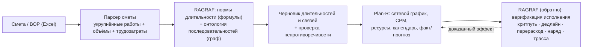

# Требование: смета/ВОР → график через RAGRAF ↔ Plan-R

**Адресат:** команда RAGRAF (для имплементации) + команда Plan-R / Айбим (для согласования контракта данных и доступа к связям/датам WBS по API).
**Автор:** RAGRAF (Барбашин О.В.).
**Статус:** v0.1 — концепт-ответ на практический вопрос коллег, написан после сверки с реальным кодом (разведка репозитория 2026-07-27, ссылки на файлы:строки ниже).
**Дата:** 2026-07-27.

---

> **Зачем этот документ.** REQ-* (от *requirement*) — внутренняя конвенция RAGRAF: фиксирует, как РАГРАФ стыкуется с внешней системой, что именно мы реализуем у себя и что просим у команды партнёра. Соседние документы того же жанра — [REQ-SIGMA-INTEGRATION.md](REQ-SIGMA-INTEGRATION.md), [REQ-ZET-INTEGRATION.md](REQ-ZET-INTEGRATION.md), [REQ-JIRA-INTEGRATION.md](REQ-JIRA-INTEGRATION.md). Практика доступа к API Plan-R — в [HOWTO-PLANR-API-TOKEN.md](HOWTO-PLANR-API-TOKEN.md).

> **Вопрос коллег (дословно по смыслу).** «Есть ведомость объёмов работ в Excel или классическая смета. Насколько хватит возможностей RAGRAF, чтобы на основании сметы построить график с технологическими последовательностями, длительностями — и что вам нужно как исходные данные?»

> **Главный тезис.** RAGRAF — **не планировщик графика**. Построение расписания (сеть, критический путь, ресурсы, календарь) — задача Plan-R, и её правильно оставить Plan-R. Из одной сметы «технологические последовательности» не выводит **ни один** инструмент: смета говорит *что и в каком объёме*, но не *в каком порядке* — порядок это отдельное инженерное знание (техкарты/ППР/СП/опыт прораба). Профиль RAGRAF — сделать это знание **явным, проверяемым и переиспользуемым графом правил**, детерминированно посчитать по нему длительности и **доказательно верифицировать** результат. То есть RAGRAF = «слой правил и доказуемости» вокруг Plan-R, а не замена планировщика.

---

## 0. Коротко

| Возможность в задаче «смета → график» | Что делает RAGRAF | Артефакт в коде | Статус |
|---|---|---|---|
| Длительность из трудозатрат (`трудозатраты/(звено×смена)`) | Считает узлом-формулой и раскладывает по зонам норм | `formula_eval.py`, `flow_executor.py` (`_eval_formula_node`) | **есть сейчас** (одношагово) |
| Технологические последовательности как граф | Хранит триплетами `субъект→предикат→объект`, правит в UI, отдаёт по SPARQL | `csv_to_rdf.py`, `api/knowledge.py`, `domain_knowledge.py` | **механизм есть**, правил порядка работ нет |
| Проверка непротиворечивости правил (дыры/нахлёсты зон и окон) | 14 проверок Flow DSL | `regulation_analysis.py`, `validator.py` | **есть сейчас** |
| Верификация готового графика Plan-R | Детекторы: критпуть поехал, дедлайн, перерасход, устаревший график | `planr_proactive.py`, `etl/puller.py` | **есть сейчас** |
| Доказательная трасса вердикта | PROV-O trace + неизменяемый реестр | `flow_executor.py`, `audit_log_store.py`, `turtle_bridge.py` | **есть сейчас** |
| Парсер сметы/ВОР (Excel, ГЭСН/ФЕР) | — | нет | **сборка под задачу** |
| Библиотека последовательностей работ (рёбра «работа→работа») | — | нет (есть только онтология охраны труда/этапов ЖЦ) | **завести один раз** (пак-IP) |
| Сетевой расчёт (CPM, топосортировка, ресурсы, календарь) | — | нет | **делает Plan-R** |

**Ключевой вывод одной строкой:** возможностей RAGRAF **хватает**, чтобы посчитать длительности, держать и проверять правила последовательностей/норм и верифицировать итоговый график; их **не хватает**, чтобы автономно построить корректную технологическую сеть из сметы — для этого нужны заведённые правила последовательностей (один раз) и Plan-R как планировщик.

---

## 1. Что RAGRAF реально делает сегодня (с привязкой к коду)

### 1.1. Считает длительности — движок регламентов (Flow DSL)

Узел `formula` — это безопасный AST-вычислитель (`formula_eval.py`, не `eval`): арифметика `+ − × ÷ // % **`, сравнения и цепочки (`0 < x < 10`), функции `min/max/round/floor/ceil/…`, трёхзначная логика Клини (нет данных → «неизвестно», а не ошибка). Выражение `трудозатраты / (звено × сменность)` **вычислимо буквально**. В прогоне графа (`flow_executor.py`, `_eval_formula_node`) результат кладётся в поток как число и дальше классифицируется:
- узлом `switch` — раскладка по числовым зонам `{min, max, метка}` (в норме / у предела / превышение);
- либо узлом `compare` — операторы `>, <, ≥, =, ≠, вне диапазона`.

Пример «длительность из трудозатрат → зоны нормы» реализуется **сегодня** одной формулой + одним `switch`.

*Честные пределы движка:* формула читает переменные только из входных узлов; цепочки «формула→формула по имени» и оконные (темповые) величины сейчас не собрать одной цепочкой; единиц измерения движок не проверяет; обратной задачи «дана длительность — найди звено» (солвер) нет. Это детерминированный **скалярный калькулятор в узле + верификатор правил**, а не электронная таблица и не планировщик.

### 1.2. Хранит правила последовательностей — граф знаний (триплеты)

Knowledge Ingest Studio (`api/knowledge.py`, фронт `KnowledgeIngestScreen`) принимает CSV `субъект,предикат,объект`; `csv_to_rdf.py` (`triples_to_turtle`) превращает **любой** предикат в RDF/Turtle. Значит правило «`Устройство_фундамента` `предшествует` `Монтаж_каркаса`» хранится **без правок кода**, редактируется в UI, запрашивается по SPARQL, выгружается в Каппу.

*Что уже есть по стройке (домен `construction`):* онтологии охраны труда («работник → СИЗ / опасности / обязанности», 438 триплетов), этапов жизненного цикла (Проектирование/Строительство/Эксплуатация), понятий Plan-R-аналитики (этап WBS, критпуть, просрочка). *Чего нет:* готовых рёбер `предшествует/зависит_от` между конкретными работами — их надо внести один раз (это и есть переиспользуемый **пак-IP**).

### 1.3. Проверяет и доказывает

- **Непротиворечивость правил** (`regulation_analysis.py`, `GET /regulations/{id}/consistency`): дыры и нахлёсты числовых зон и временных окон (`SWITCH_UNCOVERED_RANGE`, `SWITCH_ZONE_OVERLAP/GAP`, `TIME_GATE_OVERLAP/GAP`, противоречивые выходы, мёртвые узлы). Механика интервалов переиспользуема для правила «длительность < нормы → флаг».
- **Детекторы графика Plan-R** (`planr_proactive.py`, детерминированные, без LLM): `critical-path-slip` (критпуть с отставанием, эскалация ≥ 14 дней), `budget-overrun`, `upcoming-deadline` (финиш ≤ 7 дней при прогрессе < 90%), `stale-schedule` (график не пересчитывали давно).
- **Доказательная трасса**: `execute_flow` → `trace` по каждому узлу «из чего вывод»; append-only реестр несоответствий (`audit_log_store.py`) + PROV-O провенанс основания (`turtle_bridge.py`).

---

## 2. Как RAGRAF работает с Plan-R сейчас (важно для контракта данных)

В рантайме связь **строго односторонняя: Plan-R → RAGRAF (только чтение)**. Боевой pull (`etl/planr_client.py`, `fetch_aggregates`) делает только GET (`/eps`, `/versions`, `/wbs`), результат пишется в собственное хранилище снапшотов RAGRAF, **не обратно в Plan-R**.

**Тянется из WBS:** финиш (прогноз и целевой/базовый), просрочка (`slip`), прогресс %, статус, подрядчик, стоимость план/факт, флаг критпути, свежесть графика.

**НЕ отдаётся текущим API инстанса (и потому не тянется):**
- **связи предшественник→преемник** — эндпоинт `/wbs-relations` возвращает 405 (явный комментарий `planr_client.py`);
- **дата старта этапа** — атрибут объявлен, но в рантайме не читается;
- **длительность этапа** — не отдаётся и нигде не вычисляется.

RAGRAF **не пересчитывает критический путь сам** — он доверяет флагу `criticalPath` из Plan-R. Записи графика в Plan-R в рабочем приложении нет вообще (единственный код с записью — отдельный CLI-сидер демо-данных в изолированное демо-пространство, к рабочему контуру отношения не имеет).

Это соответствует нашей модели интеграции: RAGRAF = реестр несоответствий + верификация исполнения, **без push в график** Plan-R.

---

## 3. Разделение труда RAGRAF ↔ Plan-R

- **Смета/ВОР** → парсер → структурированные работы (объёмы, трудозатраты).
- **RAGRAF** → нормы длительности + граф последовательностей → **черновик** длительностей и связей + проверка непротиворечивости. Черновик — это **экспорт-заготовка для человека/импорта в Plan-R**, а не автозапись в Plan-R.
- **Plan-R** → сетевой график, критический путь, ресурсное выравнивание, календарь, факт/прогноз.
- **RAGRAF обратно** → верификация исполнения с доказательной трассой.

Именно на «обратном» плече видно, что RAGRAF даёт то, чего нет у планировщика: не «нарисовать гант», а **доказать, что технология и сроки соблюдены**.

---

## 4. Контракт данных — что нужно как исходные данные

### 4.1. Из сметы / ВОР — по каждой позиции

| Поле | Обяз. | Зачем |
|---|---|---|
| Код (ГЭСН/ФЕР/ТЕР/ЕНиР или классификатор) | да | привязка к виду работ и норме |
| Наименование работы | да | укрупнение, сопоставление |
| Единица измерения | да | контроль размерности |
| Объём (количество) | да | вход для расчёта |
| **Трудозатраты (чел-ч, маш-ч)** | желательно | основа длительности; если есть в смете (ГЭСН даёт) — считать не надо |
| Ресурсы / звено (состав бригады, механизмы) | да* | делитель для длительности |
| Раздел / этап / захватка | желательно | группировка и укрупнение |
| Стоимость план (и факт) | опц. | приоритизация, контроль бюджета |

\* Если трудозатрат или звена нет — нужно согласованное допущение по звену и сменности (тогда длительность считается по нормам, а не из сметы).

### 4.2. Правила (заводятся один раз, переиспользуются между объектами)

| Правило | Формат | Источник |
|---|---|---|
| Технологические последовательности: пары/цепочки видов работ с отношением предшествования, тип связи (FS/SS/FF), лаг | CSV `субъект,предикат,объект` (поддерживается) | техкарты (ТК), ППР, СП, шаблоны WBS Plan-R, эксперт |
| Нормы перевода трудозатрат → длительность (звено, смен/сут, коэффициенты) | входные значения / литералы в формуле регламента | ЕНиР/ГЭСН/ведомственные |
| Рабочий календарь, погодные ограничения наружных работ | опц. | заказчик / нормы |

### 4.3. Форматы обмена

- Смета — Excel/CSV со **стабильными колонками** (код, наименование, ед., объём, трудозатраты, раздел). Плавающая структура листа увеличивает объём работ по парсеру.
- Последовательности — CSV `субъект,предикат,объект` (принимается «из коробки»).

---

## 5. Чего сейчас нет — и что это за работа

| Пробел | Тип работы | Оценка |
|---|---|---|
| Парсер сметы/ВОР (Excel, коды ГЭСН/ФЕР, объёмы, трудозатраты) | сборка коннектора под задачу | небольшая, разовая |
| Библиотека последовательностей работ (рёбра «работа→работа») для типа объекта | контентная — завести правила один раз | зависит от полноты ТК/ППР; переиспользуется |
| Многошаговые цепочки формул и оконные величины | доработка движка (`_build_formula_scope`, `_build_formula_history`) | если понадобится многоуровневый норматив |
| Детекторы «старт раньше предшественника» и «длительность ниже нормы» | новые детекторы в `planr_proactive.py` | небольшая, зависит от §6 |
| Сетевой расчёт (CPM, ресурсы, календарь) | **вне рамок RAGRAF** — делает Plan-R | — |

---

## 6. Что просим у команды Plan-R (feature requests к API)

Чтобы «обратное плечо» верификации закрывало технологические последовательности, из Plan-R по API желательно отдавать то, чего сейчас нет:

1. **Связи предшественник→преемник (dependency links)** по WBS — сейчас `/wbs-relations` возвращает 405. Без них не проверить нарушение очерёдности и не собрать зависимости.
2. **Дата старта этапа** — сейчас в рантайме не читается (нужно для проверки `старт преемника < финиш предшественника`).
3. **Длительность этапа** (или пара старт+финиш, из которой она выводится) — сейчас не отдаётся.
4. Подтверждение семантики системных uuid-атрибутов WBS (старт `…0003`, slip `…0029` и т.д.) — у Plan-R нет эндпоинта-словаря, смысл выведен по данным и стоит сверить.

Эти пункты — не претензия, а фиксация точек стыковки: где Plan-R раскроет данные, там RAGRAF добавит проверку и доказуемость.

---

## 7. Пилот — предлагаемый объём

1. Берём **один типовой объект** и его смету/ВОР.
2. Разбираем смету в укрупнённые работы (объёмы + трудозатраты) — минимальный парсер.
3. Заводим онтологию последовательностей и нормы длительности как граф/регламенты (пак под тип объекта).
4. Получаем **черновик длительностей и связей** + прогон проверки непротиворечивости (дыры/нахлёсты).
5. Отдаём черновик в Plan-R на планирование (импорт/ручная сверка).
6. Вешаем RAGRAF на **верификацию исполнения**: нарушение очерёдности, длительность ниже нормы, критпуть/дедлайн/перерасход — с доказательной трассой.

Критерий успеха пилота: на реальном объекте RAGRAF (а) детерминированно посчитал длительности из сметы, (б) нашёл хотя бы одну реальную дыру/нахлёст в нормах или очерёдности, (в) выдал по готовому графику доказуемый вердикт соответствия.

---

## 8. Открытые вопросы

1. Полнота исходной сметы: есть ли в ней трудозатраты по позициям, или их надо добирать из норм?
2. Насколько стабильна структура Excel-сметы у коллег (единый шаблон или разнобой)?
3. Есть ли у команды готовые техкарты/ППР/шаблоны WBS, из которых собрать библиотеку последовательностей, или нужен эксперт-прораб?
4. Готов ли Plan-R раскрыть связи/старт-даты по API (§6) — от этого зависит глубина «обратной» верификации.
5. Уровень укрупнения работ: до раздела сметы, до вида работ или до отдельной позиции?

---

*Документ описывает возможности на уровне архитектуры; конкретная калибровка проверок и «способ» доказуемости — ноу-хау RAGRAF и в контракт данных не входят.*
