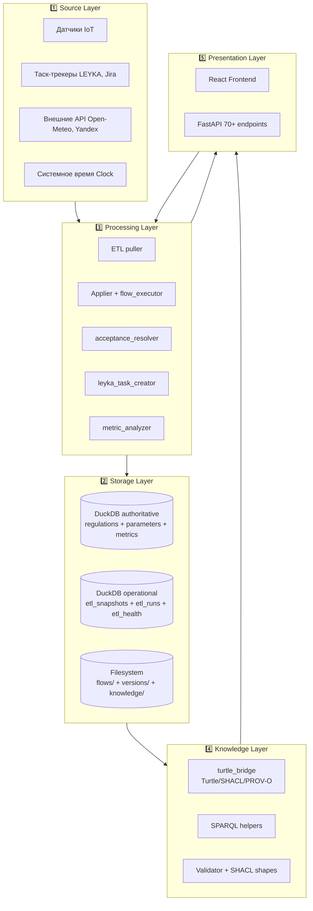
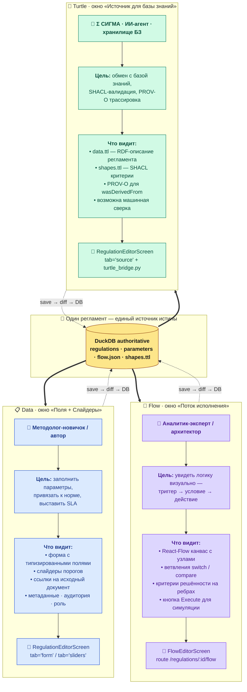
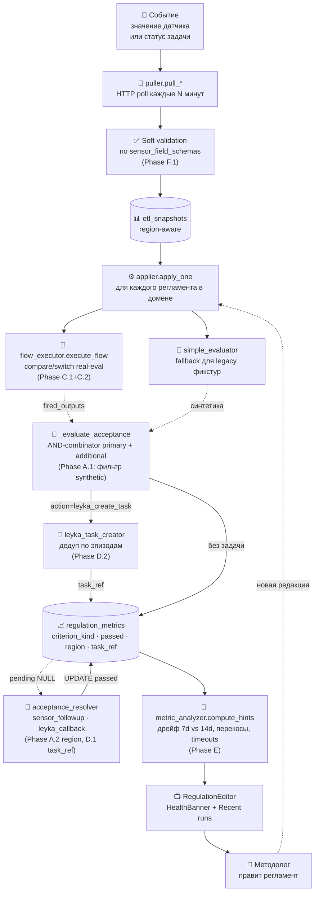
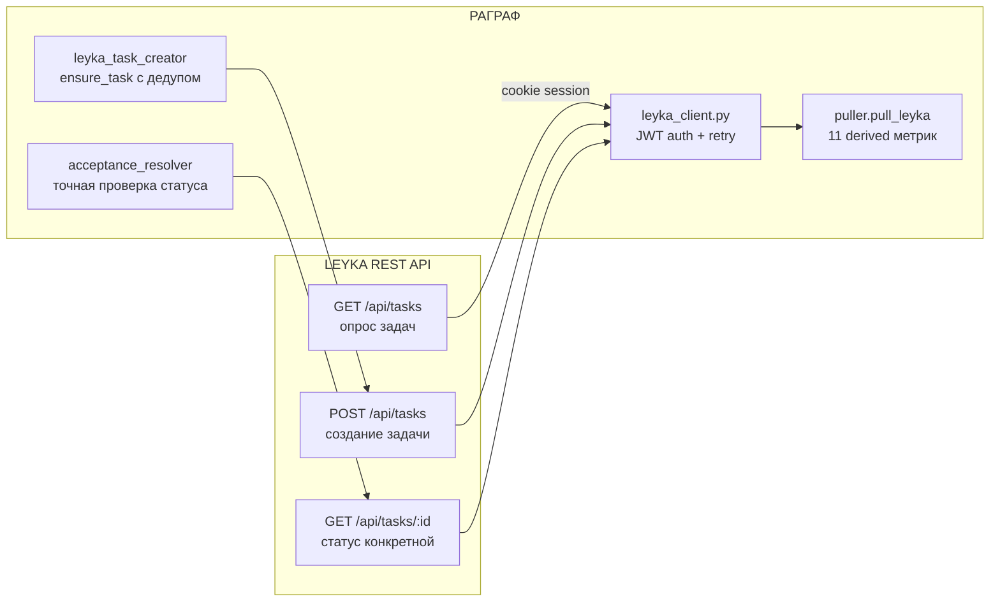
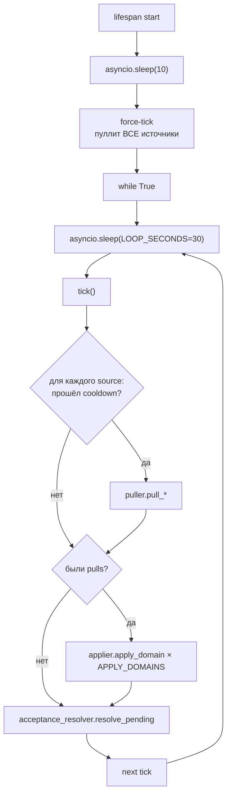
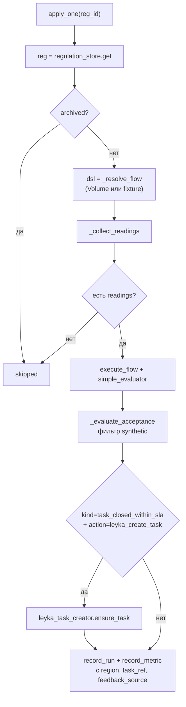
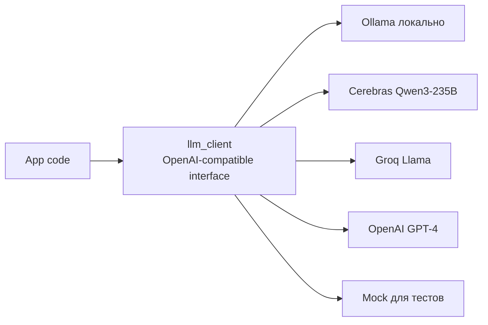
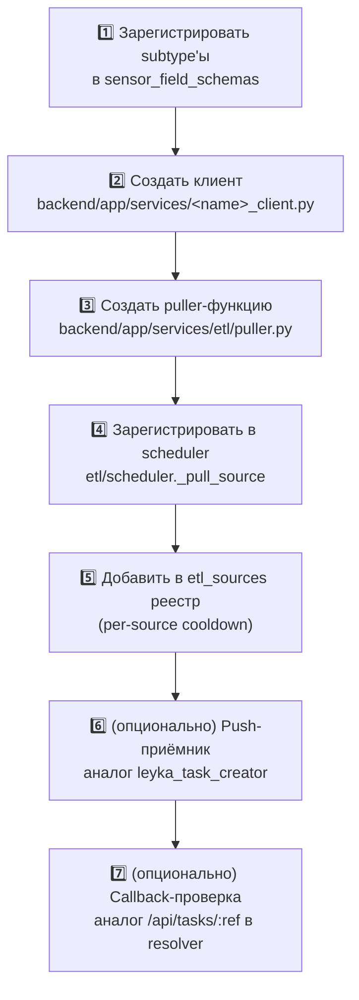
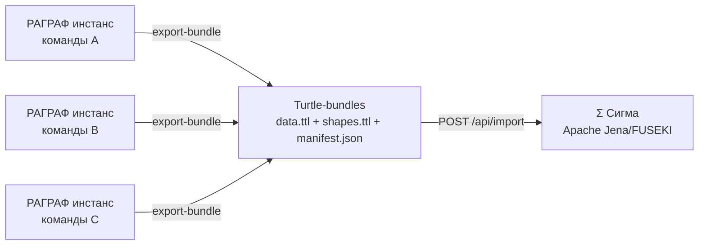

# ARCHITECTURE.md — Архитектура платформы РАГРАФ

> **Версия 2.0 (2026-05-23)** — полная переработка по дата-сайентистской
> слоистой архитектуре. Документ описывает текущее реализованное состояние
> системы после Phase A–F и P2, а также паттерны интеграции с внешними
> системами (LEYKA, Open-Meteo, Yandex.Traffic, RAGRAF Clock) с рецептом
> подключения новых источников по аналогии (REDmine, Jira, Trello, любой
> REST-сервис).
>
> Связанные документы:
> [TZ_RAGRAF.md](TZ_RAGRAF.md) (постановка задачи + ТЭО),
> [DATA-FLOW-AUDIT.md](DATA-FLOW-AUDIT.md) (аудит потока + план до 95%+),
> [GLOSSARY.md](GLOSSARY.md) (термины), [BACKLOG.md](BACKLOG.md) (очередь идей).

---

## Оглавление

1. [Принципы и слоистая модель](#1-принципы-и-слоистая-модель)
2. [Сквозной поток данных](#2-сквозной-поток-данных)
3. [Source Layer — источники событий](#3-source-layer--источники-событий)
4. [Storage Layer — хранилище](#4-storage-layer--хранилище)
5. [Processing Layer — обработка и принятие решений](#5-processing-layer--обработка-и-принятие-решений)
6. [Knowledge Layer — формальная семантика](#6-knowledge-layer--формальная-семантика)
7. [AI/LLM Layer](#7-aillm-layer)
8. [Presentation Layer — UI и API](#8-presentation-layer--ui-и-api)
9. [Integration Patterns — паттерн подключения внешней системы](#9-integration-patterns--паттерн-подключения-внешней-системы)
10. [Operational Aspects — деплой и мониторинг](#10-operational-aspects--деплой-и-мониторинг)
11. [Migration path — РАГРАФ → Σ Сигма](#11-migration-path--рaгрaф--σ-сигма)
12. [ADR — ключевые архитектурные решения](#12-adr--ключевые-архитектурные-решения)

---

## 1. Принципы и слоистая модель

### 1.1 Архитектурные принципы

| Принцип | Что означает на практике |
|---|---|
| **Замкнутый контур** | Каждое событие проходит полный цикл: источник → нормализация → решение → действие → проверка исхода → подсказка методологу. Никаких dead-letter событий, никаких «висящих» pending без TTL. |
| **Формальная проверяемость** | Логика регламента — декларативный DSL (Rule DSL Flow) + SHACL для критериев решённости. Никаких чёрных ящиков LLM в pipeline принятия решений. |
| **Открытые форматы** | Регламенты сохраняются как Turtle + SHACL + PROV-O (W3C-стандарт). Файлы переносятся между РАГРАФ и Σ Сигма без переписывания. |
| **Single source of truth** | DuckDB — authoritative для всего, что редактируется. Файлы Turtle — выгрузка для interop. Flow.json — визуальная репрезентация DSL. |
| **Best-effort sync** | Sync между Flow / Form / Triggers / Criterion обернут в try/except — сбой sync'а не валит save. |
| **Объяснимость по построению** | Каждое решение трассируется до пункта нормативного документа (PROV-O) + цепочки fired-узлов в trace. |

### 1.2 Пять слоёв



Слои уложены как у дата-сайентиста: **данные → хранение → обработка →
знание → представление**. Каждый слой имеет один аутентичный API к
соседнему, не нарушает инкапсуляцию.

### 1.3 Три проекции регламента — Data / Flow / Turtle

Один и тот же регламент в РАГРАФ имеет **три равноправные проекции**, и
каждая открывается в своём окне для своего пользователя и своей цели.
Все три — синхронизированы друг с другом через единый источник истины
в DuckDB; правка в любом окне отражается в двух других после `Save`.



**Сравнительная таблица:**

| | 📋 **Data** | 🔀 **Flow** | 🐢 **Turtle** |
|---|---|---|---|
| **Пользователь** | Методолог-новичок, автор регламента | Аналитик-эксперт, архитектор | Σ СИГМА, БЗ, ИИ-агент |
| **Цель** | Заполнить смысл и параметры | Увидеть логику визуально | Машинная сверка и обмен |
| **Форма** | Форма + слайдеры | Граф React Flow | Текст RDF/Turtle |
| **Главный вопрос** | *«Какие пороги и роли?»* | *«В каком порядке шаги?»* | *«Соответствует ли БЗ?»* |
| **Окно в UI** | `tab='form'` / `tab='sliders'` | `FlowEditorScreen` | `tab='source'` |
| **Backend hook** | `regulations.py` CRUD | `flow.py` load/save/execute | `turtle_bridge.py` import/export |
| **Файл выгрузки** | — (живёт только в БД) | `flow.json` (репрезентация DSL) | `data.ttl` + `shapes.ttl` |
| **Кому показать** | Заказчику, который описывает свой норматив | Партнёру, который сомневается в логике | Команде Σ СИГМА для интероп |

**Зачем три, а не одно:**
- **Data-окно** — самое доступное; в него входит **любой** методолог без программистских навыков. Закрывает 80% задач описания регламента.
- **Flow-окно** — для **верификации логики глазами**; помогает поймать ошибки порядка проверки и пропущенные ветки. Это же окно используется при демонстрации заказчику «как работает наш регламент».
- **Turtle-окно** — для **машинного обмена** и доказательной базы. Туда смотрят не люди, а БЗ Σ СИГМА, SHACL-валидаторы и PROV-O трассировщики. Дополнительно — это формат экспорта/импорта между разными инсталляциями РАГРАФ.

**Синхронизация — best-effort:** при сохранении любой проекции применяется
`try/except`-обёртка вокруг sync в соседние две (см. принцип «Best-effort sync»
в §1.1). Если Turtle-выгрузка падает на edge-кейсе схемы — это не валит
сохранение Data; ошибка логируется и пользователь видит warning в баннере.

---

## 2. Сквозной поток данных

Главная схема — что происходит с одним событием от появления на датчике
до подсказки методологу:



### 2.1 Гарантии контура

| Канал | Норматив | Аварийный порог |
|---|---|---|
| Источник → snapshot | 1 ETL-tick (30 с) | > 5 мин → `etl_health.status=degraded` |
| Snapshot → fired_output | < 100 мс на регламент | > 1 с → warning в логе |
| Fired output → LEYKA-задача | следующий тик после срабатывания | дедуп по `regulation_id × открытый эпизод` |
| Task closed → criterion_passed | в пределах `sla_seconds` | через 7 дней → timeout=FALSE |
| Pending pending → resolver | каждый тик | per-criterion TTL = max(7 дней, sla×2, follow×5) |

### 2.2 Точность принятия решений

После реализации Phase A–F + P2: **93–96%** взвешенно по 5 типам критериев.

Декомпозиция и план до 95%+ — [DATA-FLOW-AUDIT.md §6](DATA-FLOW-AUDIT.md#6-точность-принятия-решений).

---

## 3. Source Layer — источники событий

Все источники приводятся к единой нормализованной форме записи в
`etl_snapshots(ts, source_id, subtype, field, value, region, raw_payload)`.
Это даёт **универсальный API для applier** независимо от того, откуда
пришли данные.

### 3.1 Текущие источники

| source_id | Subtype'ы | Region | Pull-интервал | Тип |
|---|---|---|---|---|
| `open-meteo-weather` | `om-weather-current`, `om-weather-daily` | per-city | 15 мин | HTTP GET |
| `open-meteo-air` | `om-air-quality` | per-city | 15 мин | HTTP GET |
| `yandex-traffic` | `yandex-traffic-xml` | per-city | 15 мин | HTTP GET XML |
| `leyka-tasks` | `leyka-task-overdue`, `leyka-task-stale-*`, `leyka-team-wip`, `leyka-bug-triage`, `leyka-team-throughput` | `_global` | 5 мин | LEYKA REST + JWT |
| `ragraf-clock` | `clock-context` | `_global` | 1 мин | системное время |

### 3.2 Паттерн интеграции `puller.pull_*`

Каждый источник реализуется как **отдельная async-функция** в
[`backend/app/services/etl/puller.py`](../backend/app/services/etl/puller.py):

```python
async def pull_<source_id>() -> dict[str, Any]:
    """
    1. Запросить данные у внешнего API (httpx async client).
    2. Извлечь значения полей и преобразовать в float | None.
    3. Вызвать live_data_store.append_snapshot(...) для каждого поля.
    4. Записать health-статус: live_data_store.record_health(source_id, ok=True).
    5. Вернуть сводку для логов: {source_id, status, count, ...}.
    """
```

Дополнительные требования:
- Все исключения ловятся; status=error пишется в `etl_health`.
- Идемпотентность: повторный вызов в течение cooldown не вредит (snapshot'ы накапливаются с разными ts).
- Региональность: для глобальных источников (LEYKA, clock) `region='_global'`; для городских — `active_city.get_active().id`.

### 3.3 LEYKA — таск-трекер (двусторонний)

LEYKA — единственный источник с **двусторонним** взаимодействием:



**Pull (источник):** `pull_leyka()` опрашивает `/api/tasks` каждые 5 минут,
агрегирует 11 derived метрик (overdue count, stale tasks, WIP per assignee,
team throughput) → snapshot'ы в `region='_global'`.

**Push (приёмник):** [`leyka_task_creator.ensure_task()`](../backend/app/services/leyka_task_creator.py)
вызывается из applier когда output-нода имеет `action='leyka_create_task'`.
Дедупликация по эпизоду: смотрим последний `regulation_metrics.task_ref` с
`criterion_passed IS NULL` → если есть, reuse. После закрытия (passed=TRUE) —
создаём новую задачу.

**Callback (проверка):** acceptance_resolver запрашивает `GET /api/tasks/{ref}`
напрямую для статуса `task_closed_within_sla` — точная корреляция «именно эта
задача закрылась», без эвристики «overdue ≤ 5».

**Sensor-side trigger** (Phase 2026-05-27): сенсорные узлы Flow Editor могут
быть привязаны к **конкретной LEYKA-задаче** через диалог `LinkSensorToLeykaDialog`
(поля `leykaTaskId` + `leykaTrigger='status_changed'` на `FlowNode`). Фоновый
поллер [`services/leyka_task_poller.py`](../backend/app/services/leyka_task_poller.py)
зарегистрирован в lifespan как `asyncio.Task`, каждые 30 секунд
(`LEYKA_POLLER_INTERVAL_S`):

1. Сканирует `data/flows/*.json` → собирает sensor-узлы с привязкой к LEYKA.
2. Делает **один** батч-запрос `GET /tasks?limit=500`, фильтрует на стороне РАГРАФ.
3. Сравнивает с snapshot'ом в таблице `leyka_task_state(source_id, node_id, last_status)`.
4. При смене статуса → `execute_flow(regulation, [synthetic SensorReading])` +
   опционально автоматический comment в связанные output-задачи.

Этот контур даёт **симметрию**: РАГРАФ может и порождать LEYKA-задачи (push),
и слушать их статусы как сенсорный сигнал (pull-by-state). Подробный сценарий
с экранами — [PROGRESS-ARHI-2026-05-27.md §3.3](PROGRESS-ARHI-2026-05-27.md#33-leyka--раграф-вход-регламента).

**Output→LEYKA dialog** (фронт): кнопка «Связать с LEYKA» на output-узле открывает
`LinkToLeykaDialog` с dropdown'ами `GET /api/leyka/projects` и
`GET /api/leyka/projects/{id}/members`. После `POST /api/leyka/tasks` на ноду
записывается `leykaTaskId` + `leykaTaskUrl`, кнопка превращается в «Открыть в
LEYKA» — deep-link с `?openProject=&openTask=` (фронт LEYKA подсвечивает
задачу через `pendingOpenTaskId`).

При срабатывании регламента `POST /api/regulations/{id}/execute` итерирует
fired output-узлы и для каждой с `leykaTaskId` шлёт автоматический comment
в чат привязанной задачи. Best-effort: если LEYKA недоступна — execute не
падает, в response `leyka_pings[]` показывает диагностику.

### 3.4 Open-Meteo и Yandex Traffic — pull-only

Простые HTTP GET без auth (Open-Meteo бесплатный API, Yandex Bar XML).
Per-city логика: `lat/lon` для Open-Meteo, `yandex_region` для Yandex — берутся
из активного города (`active_city.get_active()`).

Извлечение полей:
- Open-Meteo: JSON-path вида `current.temperature_2m` → snapshot
  `(subtype='om-weather-current', field='current.temperature_2m', value)`.
- Yandex: парсинг XML `<reginfo level="..."/>` → snapshot
  `(subtype='yandex-traffic-xml', field='reginfo.level', value)`.

### 3.5 RAGRAF Clock — системный источник

Минутный pull, пишет в snapshot контекстные поля времени
(`clock-context.hour`, `clock-context.weekday`, `clock-context.is_weekend`).
Полезно для регламентов, которые зависят от времени суток («ночной режим
не вызываем коменданта»).

---

## 4. Storage Layer — хранилище

### 4.1 Два DuckDB файла

| Файл | Назначение | Содержит |
|---|---|---|
| `regulations.duckdb` | Authoritative store | `regulations`, `parameters`, `regulation_triggers`, `regulation_history`, `regulation_metrics`, `modules`, `sensor_subtypes`, `sensor_field_schemas`, `user_domains`, `user_documents`, `document_chunks` |
| `live_etl.duckdb` | Operational layer | `etl_snapshots`, `etl_runs`, `etl_health`, `etl_sources` |

Файлы изолированы: отключение `ETL_ENABLED=false` не задевает основной flow.
Cross-DB JOIN'ы запрещены — данные смешиваются на уровне Python (см.
[DATA-FLOW-AUDIT §5.2](DATA-FLOW-AUDIT.md) про bug 7-hour-ago).

### 4.2 Ключевые таблицы

#### `regulations` — основная таблица
Поля: `source_id` (PK), `name`, `domain`, `version`, `status`,
`recommendation`, source_document (PROV-O), valid_from/to,
**acceptance_criterion_*, additional_criteria_json, expected_result_description,
failure_actions_json** (задачный подход).

#### `regulation_metrics` — feedback-loop
Поля: `run_id` (PK), `regulation_id`, `ts`, `triggered`, `level`,
`criterion_kind`, `criterion_passed` (TRUE/FALSE/NULL tri-state),
`latency_ms`, `feedback_source`, **`region`** (Phase A.2), **`task_ref`** (Phase D.1).

Источники feedback_source: `flow_executor`, `sensor_followup`, `leyka_callback`,
`timeout`, `manual_pending` (для `kind='custom'`).

#### `etl_snapshots` — нормализованные события
Поля: `ts`, `source_id`, `subtype`, `field`, `value` (float|null), `region`,
`raw_payload` (JSON, для отладки). Индексы на `(subtype, field, ts DESC)` для
быстрого `latest_snapshot`.

### 4.3 Filesystem layout

```
${DATA_DIR}/
├── regulations.duckdb        # все таблицы regulations + триггеры + метрики
├── live_etl.duckdb           # snapshots + runs + health
├── active_city.json          # активный город для ETL
├── flows/{id}.json           # текущие сохранённые Rule DSL
├── versions/{id}/{uuid}.json # immutable snapshots flow
├── source_documents/{id}/    # uploaded PDF/DOCX
└── knowledge/{domain}/{id}.ttl  # Knowledge Ingest Studio датасеты
```

На Railway/Fly это всё на Volume — данные переживают редеплой.

### 4.4 Schema migration

Все ALTER ADD COLUMN — **идемпотентные**, через PRAGMA introspection:

```python
existing = {row[1] for row in c.execute("PRAGMA table_info('regulations')").fetchall()}
for col in ("new_field_1", "new_field_2"):
    if col not in existing:
        c.execute(f"ALTER TABLE regulations ADD COLUMN {col} VARCHAR")
```

Это даёт безопасную миграцию при каждом старте без скриптов вручную.

---

## 5. Processing Layer — обработка и принятие решений

### 5.1 Scheduler — главный цикл

[`backend/app/services/etl/scheduler.py`](../backend/app/services/etl/scheduler.py):
asyncio loop в lifespan FastAPI, с per-source cooldown'ами.



Ключевые особенности:
- **Force-tick на старте** — игнорирует cooldown, чтобы данные были свежими сразу после редеплоя (фикс 086).
- **Apply только при наличии новых pull'ов** — иначе плодятся 2880 одинаковых run-записей в день.
- **Heartbeat in-memory** для UI-плашки «scheduler жив».

### 5.2 Flow executor — интерпретатор Rule DSL

[`backend/app/services/flow_executor.py`](../backend/app/services/flow_executor.py).
8 типов узлов: `input`, `threshold`, `compare`, `formula`, `switch`, `output`,
`sensor`, `shacl_constraint`.

**Семантика после Phase C.1+C.2:**

| Узел | Что делает |
|---|---|
| `sensor` | Помечается fired если у привязанного input есть значение |
| `input` | Принимает значение из SensorReading |
| `threshold` | `is_out = abs(value − ref) > deviation` |
| `compare` | **Реально вычисляет** operator: `outside_range` (через threshold), `greater/less/eq/ne/ge/le` (одноарный vs refValue или двухарный) — Phase C.1 |
| `formula` | AST-evaluator с трёхзначной Kleene-логикой (formula_eval.py) |
| `switch` | **Маршрутизатор** по incoming.condition → outgoing.condition или case.value (Phase C.2). Fallback на legacy: если matching нет — все outgoing fired |
| `shacl_constraint` | Валидирует upstream-значение по `Constraint.minInclusive/maxInclusive` |
| `output` | Fired если до него дошёл сигнал; level = max(priority среди fired) |

### 5.3 Applier — оркестратор apply_one

[`backend/app/services/etl/applier.py`](../backend/app/services/etl/applier.py):



### 5.4 Acceptance resolver

[`backend/app/services/etl/acceptance_resolver.py`](../backend/app/services/etl/acceptance_resolver.py).
Каждый тик обходит `regulation_metrics WHERE criterion_passed IS NULL AND
feedback_source != 'manual_pending'`:

| kind | Резолвер | Логика |
|---|---|---|
| `sensor_returned_normal` | `_resolve_sensor_returned_normal` | После `followup_seconds` смотрит `latest_snapshot(subtype, field, region)` (Phase A.2 region-aware). True если `value < normal_threshold` |
| `task_closed_within_sla` | `_resolve_task_closed_within_sla` | После `sla_seconds`: если есть `task_ref` → `GET /api/tasks/{ref}` (Phase D.1), иначе агрегатный fallback по `leyka-task-overdue.count ≤ 5` |
| `custom` | НЕ обходится (feedback_source='manual_pending') | Permanent-pending, ждёт ручной отметки методолога |

Per-criterion TTL: `max(7 days, sla×2, followup×5)`. Через TTL → timeout=FALSE.

### 5.5 Metric analyzer — обратная связь методологу

[`backend/app/services/metric_analyzer.py`](../backend/app/services/metric_analyzer.py).
`compute_diagnostic_hints(regulation_id)` возвращает список actionable подсказок:

| Условие | Подсказка |
|---|---|
| success_rate за 7d упал на ≥ 30% vs 8–14d | «Регресс: success_rate упал с X% до Y%. Проверь — менялись ли пороги или критерий за неделю.» |
| kind='specific_output' failures ≥ 70% | «Критерий проваливается в Z% прогонов. Проверь expected_output_id — должен совпадать с action/label реальной output-ноды.» |
| timeout-count ≥ 3 за 7d | «N прогонов закрыты по timeout'у. Проверь — приходят ли данные от sensor_subtype в нужном region'е, жива ли LEYKA.» |

Подсказки приезжают в UI HealthBanner через `GET /api/regulations/{id}/health`.

---

## 6. Knowledge Layer — формальная семантика

### 6.1 Turtle/SHACL/PROV-O — outbound interchange

[`backend/app/services/turtle_bridge.py`](../backend/app/services/turtle_bridge.py):

- `regulation_to_turtle(reg)` — Pydantic `Regulation` → RDF `data.ttl` со
  scalar-свойствами параметров, триггерами `:hasTrigger`, критериями
  `:hasAcceptanceCriterion`/`:hasAdditionalCriterion`, акцептором
  `:acceptorResult`, действиями `:hasFailureAction`, PROV-O `prov:wasDerivedFrom`.
- `regulation_to_shacl_shapes(reg)` — авто-генерация `shapes.ttl` с
  `:RegulationShape` (datatype constraints на параметры) и
  `:AcceptanceCriterionShape` с `sh:or` conditional shapes per kind (Phase B).
- `parse_regulation_turtle(ttl, source_id)` — обратный путь для импорта
  SIGMA-bundle'а; round-trip e2e проверен.

### 6.2 SHACL для критериев решённости

Conditional shapes per `criterionKind`:

| kind | Обязательные поля shape |
|---|---|
| `no_violation`, `custom` | только `criterionKind` |
| `specific_output` | `expectedOutputId` |
| `task_closed_within_sla` | `slaSeconds` |
| `sensor_returned_normal` | `sensorSubtype` + `sensorField` + `normalThreshold` |

Параллельно — in-process валидатор `validator.validate_criterion(reg, dsl)`
для UI warning bar до сохранения. Pyshacl не используется в runtime, только
SHACL-shape выгружается в bundle.

### 6.3 SPARQL helpers

[`backend/app/services/sparql_runner.py`](../backend/app/services/sparql_runner.py):
SPARQL поверх Turtle-датасетов из Knowledge Studio. 33 пресета с
ENCODE_FOR_URI для корректной работы с кириллицей в predicate'ах.

---

## 7. AI/LLM Layer

### 7.1 Multi-provider абстракция

Одна переменная `LLM_PROVIDER ∈ {ollama, cerebras, groq, openrouter, openai, mock}`
переключает chat-endpoint. Конкретный URL через `OPENAI_BASE_URL` +
`OPENAI_API_KEY`. Это даёт **полную взаимозаменяемость** провайдеров:



### 7.2 Гибридный режим chat + embeddings

Раздельные `EMBEDDING_BASE_URL` + `EMBEDDING_API_KEY` позволяют:
- chat через быстрый облачный provider (Cerebras)
- embeddings через локальный bge-m3 (никакие данные не уходят в облако)

При `EMBEDDINGS_ENABLED=false` retrieval graceful-выключается, chat работает.

### 7.3 ~~RAGU GraphRAG~~ — *удалено*

> Раньше здесь описывалась интеграция с GraphRAG-движком RAGU (`graph_ragu 0.0.2`):
> отдельный сервис `ragu_service.py`, эндпоинты `/api/ragu/*`, таблица
> `ragu_prompt_overrides` с 18 переопределяемыми промптами. **Интеграция
> выпилена 22.05.2026.** Причины и архив API — см. [`RAGU_SURFACE.md`](RAGU_SURFACE.md)
> и [GLOSSARY.md Часть XI](GLOSSARY.md#часть-xi-ии-расширение--llm-и-rag).
> Текущий стек — классический RAG поверх bge-m3 эмбеддингов с опциональной
> LLM-генерацией через любой OpenAI-compatible провайдер (см. §7.1, §7.2).

---

## 8. Presentation Layer — UI и API

### 8.1 Backend API — структура routers

70+ endpoint'ов в [`backend/app/api/`](../backend/app/api/):

| Router | Префикс | Назначение |
|---|---|---|
| `regulations.py` | `/api/regulations` | CRUD + metrics + health + criterion validation |
| `flow.py` | `/api/regulations/:id/flow` | Rule DSL load/save/execute + auto-sync |
| `shacl.py` | `/api/regulations/:id/constraints` | SHACL CRUD + import/export |
| `live.py` | `/api/live` | Manual triggers + dashboard data |
| `etl_control.py` | `/api/etl/sources` | per-source enable/disable + cooldown |
| `audit_log.py` | `/api/audit-log` | Журнал инцидентов |
| `sigma_export.py` | `/api/sigma-export`, `/api/sigma-import` | Bundle round-trip |
| ... | ... | knowledge, datasets, search, modules, twins, ... |

### 8.2 Type-safety Pydantic ↔ TypeScript

- Backend: Pydantic-модели в [`backend/app/schemas/domain.py`](../backend/app/schemas/domain.py).
- Frontend: автоматический FastAPI OpenAPI экспорт → ручная синхронизация типов
  в [`frontend/src/lib/api.ts`](../frontend/src/lib/api.ts) + Zod-валидаторы
  на критичных endpoint'ах.

### 8.3 Frontend архитектура

- **React 18** + **Vite** + **TanStack Query** (server state) + **Zustand** (UI state, лёгкие сторы).
- Lazy-loaded routes (code-splitting): `/sandbox`, `/graph`, `/twins`, `/audit-log`, `/flow`.
- React Flow для Flow Editor с optimistic updates.
- Tailwind + design-system примитивы в `components/ui/`.

Ключевые экраны:

| Экран | Назначение |
|---|---|
| `LandingScreen` | Публичная посадочная страница с mermaid-диаграммами и CTA |
| `MethodologyScreen` (`/methodology`) | Whitepaper по задачному подходу + сводный счёт |
| `RegulationEditorScreen` | Формы/Слайдеры/Turtle + Acceptance tab + HealthBanner + hints |
| `FlowEditorScreen` | React Flow канвас + PropertyPanel + ExecutePanel + CriterionPill (Phase P2) |
| `LiveDashboardScreen` (`/live`) | Hero metrics + 7-day forecast + regulation cards + timeline |
| `KnowledgeIngestScreen` (`/knowledge`) | CSV → RDF + SPARQL playground |

---

## 9. Integration Patterns — паттерн подключения внешней системы

> **Рецепт для дата-сайентиста:** как подключить новый источник
> (например, REDmine, Jira, Trello, GitHub Issues, любой REST/webhook) по
> аналогии с LEYKA / Open-Meteo / Yandex.Traffic.

### 9.1 Чек-лист подключения нового источника



### 9.2 Пошаговый рецепт на примере REDmine

> Гипотетический сценарий: компания хочет получать issues и progress в РАГРАФ.

**Шаг 1 — subtype'ы.** В `sensor_field_schemas` зарегистрировать поля:
```
subtype_id='redmine-issue-stale', fields=['count', 'max_age_days']
subtype_id='redmine-project-progress', fields=['percent_done', 'overdue_count']
```

**Шаг 2 — клиент.** `backend/app/services/redmine_client.py` по образцу
[`leyka_client.py`](../backend/app/services/leyka_client.py):
```python
class RedmineClient:
    def __init__(self, base_url, api_key, timeout=15.0): ...
    def is_enabled(self) -> bool: ...
    async def request(self, method, path, **kw) -> httpx.Response: ...

def get_client() -> RedmineClient:  # singleton с lazy init из settings
```

**Шаг 3 — puller.** Добавить в [`puller.py`](../backend/app/services/etl/puller.py):
```python
async def pull_redmine() -> dict[str, Any]:
    client = get_redmine_client()
    if not client.is_enabled():
        return {"source_id": "redmine", "status": "disabled"}
    try:
        resp = await client.request("GET", "/issues.json?status_id=open")
        data = resp.json()
        # ... агрегация в derived метрики
        live_data_store.append_snapshot(
            source_id="redmine",
            subtype="redmine-issue-stale",
            field="count",
            value=float(stale_count),
            region="_global",
        )
        live_data_store.record_health("redmine", status="ok")
        return {"source_id": "redmine", "status": "ok", "snapshots": 2}
    except Exception as e:
        live_data_store.record_health("redmine", status="error", error=str(e))
        return {"source_id": "redmine", "status": "error"}
```

**Шаг 4 — scheduler.** В [`etl/scheduler._pull_source`](../backend/app/services/etl/scheduler.py):
```python
if source_id == "redmine":
    return await puller.pull_redmine()
```

**Шаг 5 — реестр источников.** Добавить запись в `etl_sources` seed:
```python
("redmine", "REDmine", 300, True),  # cooldown 5 мин
```

**Шаг 6 (опц.) — push.** Если хотим создавать issues из output-нод flow:
аналог `leyka_task_creator.ensure_task`, новый файл `redmine_issue_creator.py`
с дедупом по эпизодам через `regulation_metrics.task_ref` (имя колонки
обобщённое, годится для любой системы тикетов).

**Шаг 7 (опц.) — callback.** В `_resolve_task_closed_within_sla` добавить
ветку: если `task_ref.startswith('redmine-')`, спрашивать REDmine API
вместо LEYKA. Лучше — выделить factory: `task_provider_for(task_ref)` →
LeykaProvider | RedmineProvider | JiraProvider.

### 9.3 Webhook-приёмник (план Phase H)

Для систем с push-семантикой (вместо poll) — endpoint
`POST /api/events/ingest`:

```python
{
  "source": "external-iot-broker",
  "event_type": "temperature.exceeded",
  "subtype": "industrial-temp",
  "field": "value",
  "value": 78.5,
  "ts": "2026-05-23T14:23:00Z",
  "region": "novosibirsk"
}
```

Endpoint валидирует payload против `sensor_field_schemas`, пишет в
`etl_snapshots`, опционально триггерит apply_domain для затронутых
регламентов синхронно (sub-second feedback).

### 9.4 Generic-провайдер задач (план рефакторинга)

Текущий `leyka_task_creator` жёстко привязан к LEYKA. После Phase G+ —
вынести абстракцию `TaskProvider`:

```python
class TaskProvider(Protocol):
    def is_enabled(self) -> bool: ...
    async def create(self, title: str, description: str, priority: int) -> str | None: ...
    async def get_status(self, task_ref: str) -> Literal["open", "closed", ...] | None: ...

class LeykaTaskProvider(TaskProvider): ...
class RedmineTaskProvider(TaskProvider): ...
class JiraTaskProvider(TaskProvider): ...

# Регистрация через output.action: 'leyka_create_task' / 'redmine_create_issue' / ...
```

Это даёт **один код applier'а** и **один acceptance_resolver**, работающий
с любым таск-трекером по контракту.

---

## 10. Operational Aspects — деплой и мониторинг

### 10.1 Режимы развёртывания

| Режим | Когда | Стек |
|---|---|---|
| **Local single-user** | dev, демо на ноуте | `make dev` → uvicorn :8000 + vite :5173 |
| **Railway** (текущий прод) | пилоты и публичный демо | Docker multi-stage, Volume на `/data`, Cerebras LLM |
| **Fly.io** (альтернатива) | edge-deploy | см. [DEPLOY-FLY.md](DEPLOY-FLY.md) |
| **Windows / macOS установщики** | конечные пользователи | git clone + auto-update, см. `installer/` |

### 10.2 Volume layout и WAL recovery

```
/data/
├── regulations.duckdb      # main authoritative DB
├── regulations.duckdb.wal  # write-ahead log
├── live_etl.duckdb         # operational
├── live_etl.duckdb.wal
├── flows/                  # current Rule DSL
├── versions/               # immutable snapshots
└── ...
```

**WAL-only recovery** в `start.sh`:
1. Probe-open основной DB (read-only).
2. Если corrupted-replay — ротируется ТОЛЬКО WAL (главный файл сохраняется).
3. Если основной файл повреждён — fallback на backup `*.bak-*`.

**Lifespan-CHECKPOINT на shutdown** — явный flush WAL → main file, защита от
corruption при SIGTERM редеплое Railway.

### 10.3 Мониторинг и health

| Эндпоинт | Назначение |
|---|---|
| `GET /api/live/scheduler-status` | Жив ли scheduler, last tick |
| `GET /api/live/sources-health` | Per-source freshness + status |
| `GET /api/regulations/:id/health` | Health-status регламента + diagnostic hints |
| `GET /api/audit-log` | Лента инцидентов с filtering |
| `GET /api/live/debug` | Расхождения snapshots vs applier |

UI: ETL state panel на `/live` с **freshness-based индикатором** (зелёный <30мин / жёлтый <3ч / красный >3ч) — не зависит от flaky `last_status` (фикс ADR-024).

### 10.4 Безопасность

- `ADMIN_PASS` + HMAC-cookie + `Depends(require_admin)` на DELETE/PUT.
- `hmac.compare_digest` для constant-time сравнения.
- httpOnly + secure cookies, 7-day TTL.
- Protected sensor_subtypes (интеграции не удаляются случайным кликом).

### 10.5 Матрица покрытия ГОСТ по ИИ

РАГРАФ ведёт явную матрицу соответствия двум действующим ГОСТам по
искусственному интеллекту:

| ГОСТ | Фокус | Покрытие |
|---|---|---|
| **ГОСТ Р 71484.1-2024** (ИСО/МЭК 5259-1:2024) | Качество данных для аналитики и ML, жизненный цикл данных, управление качеством | 19/27 full, 5 partial, 2 missing, 1 n/a |
| **ГОСТ Р 59898-2021** | Оценка качества систем ИИ — 8 групп характеристик + 5 типов тестовых наборов | 27/40 full, 7 partial, 4 missing, 2 n/a |

**Сводное покрытие: ~82%** базовых требований, ~92% при учёте
архитектурных мер (которые ГОСТ не требует, но мы реализовали).

Матрица — рабочий артефакт: каждая ячейка указывает конкретный файл /
endpoint / SHACL-shape в коде, где требование закрыто. Это превращает
compliance в часть архитектуры, а не в отдельный «бумажный» процесс.
**Закрытие оставшихся 5 гэпов** (формальный отчёт качества, LLM-метрики,
Prometheus, a11y, encryption at rest) идёт по запросу заказчика —
матрица сразу показывает что и зачем доделывается под конкретную
отрасль.

Полная детализация — [docs/COMPLIANCE-GOSTS-AI.md](COMPLIANCE-GOSTS-AI.md).
Привязка оставшихся гэпов к отраслям-заказчикам (стройка / ЖКХ / гос-сектор /
банк / медицина) — [docs/BACKLOG.md §🛡️ Compliance-докрутка](BACKLOG.md).
Связанные документы:
[docs/DATA-QUALITY-MODEL.md](DATA-QUALITY-MODEL.md) — модель качества
данных по §5.2.2.1 ГОСТ 71484.1;
[docs/EXPLAINABILITY.md](EXPLAINABILITY.md) — каналы объяснения по §8.6 ГОСТ 59898.

---

## 11. Migration path — РАГРАФ → Σ Сигма

### 11.1 Когда мигрировать

| Параметр | Порог комфорта РАГРАФ | Порог насыщения | Действие |
|---|---|---|---|
| Регламенты в инстансе | 1 000 | 10 000 | Миграция в Σ Сигму |
| Эпизоды/день | 10 000 | 100 000 | Шардирование DuckDB или Postgres |
| Параллельные методологи | 5 | 20 | RBAC + полная авторизация (Phase H) |
| Команд / организаций | 1 | 5+ | Multi-tenant Σ Сигма |

### 11.2 Технология миграции



Регламенты переносятся **файлами без переписывания**. Σ Сигма обязана
поддерживать тот же W3C-стек (RDF/Turtle/OWL/SHACL/PROV-O).

После миграции команды могут продолжать работать в РАГРАФ как в редакторе,
Σ Сигма исполняет сводный поток событий в проде.

→ Детали 4 векторов стыковки + 10 открытых вопросов:
[REQ-SIGMA-INTEGRATION.md](REQ-SIGMA-INTEGRATION.md).

---

## 12. ADR — ключевые архитектурные решения

| ADR | Решение | Обоснование |
|---|---|---|
| ADR-001 | DuckDB как authoritative store | Embedded, нет кластера; capacity достаточна до 10 000 регламентов; WAL для durability. |
| ADR-002 | Flow.json отдельно от DuckDB | Графовая структура с position{x,y} не ложится в табличную модель без потери смысла визуала. |
| ADR-003 | Two DuckDB files (regulations + live_etl) | Изоляция операционного слоя; `ETL_ENABLED=false` не задевает main flow. |
| ADR-004 | Cross-DB JOIN запрещены | Owner-only reads; смешивание в Python (см. bug 7-hour-ago). |
| ADR-005 | DuckDB Python connector pisat naive UTC | `datetime.now(timezone.utc).replace(tzinfo=None)`; иначе DuckDB конвертирует в local TZ. |
| ADR-006 | Best-effort sync через try/except | Flow→Form, Flow→Triggers, Flow→Criterion — сбой sync'а не валит save. |
| ADR-007 | Synthetic evaluator как fallback | Legacy фикстуры со switch-нодами без real-eval; новые регламенты используют Phase C.2 real switch. |
| ADR-008 | Per-criterion TTL = max(7d, sla×2, follow×5) | Защита от race «MAX_PENDING = sla → всегда timeout до проверки». |
| ADR-009 | Synthetic исключён из specific_output (Phase A.1) | Synthetic.action не определён методологом → ложно-failed критерии. |
| ADR-010 | SHACL для AcceptanceCriterion (Phase B) | Декларативная валидация конфигурации до сохранения; conditional shapes per kind через `sh:or`. |
| ADR-011 | switch с edge.condition routing (Phase C.2) | Реальная маршрутизация по case.value, fallback на legacy. |
| ADR-012 | LEYKA task dedup по эпизодам (Phase D.2) | Reuse task_ref пока эпизод не закрыт; новая задача после passed=TRUE. |
| ADR-013 | metric_analyzer как отдельный модуль (Phase E) | Поверх get_health_status, диагностика без модификации основного flow. |
| ADR-014 | Soft payload validation (Phase F.1) | Warning при unknown field, не блокирующее — legacy-источники меняют формат. |
| ADR-015 | Open W3C formats для экспорта | Vendor-neutrality, миграция в Σ Сигму без переписывания. |
| ADR-016 | Multi-provider LLM абстракция | Одна переменная LLM_PROVIDER, OpenAI-compatible interface. |
| ADR-017 | Freshness-based health индикатор | last_status шумит на flaky источниках; freshness снимает шум. |
| ADR-018 | Lazy-loaded routes во frontend | Code-splitting для bundle <500kB на главных страницах; тяжёлые экраны (`/sandbox`, `/graph`, `/twins`, `/audit-log`) загружаются по требованию. |
| ADR-019 | ADMIN_PASS + HMAC-cookie вместо OAuth | Single-secret до появления первого платящего заказчика с требованием SLA; полная авторизация — Phase H. |
| ADR-020 | Volume на `/data` для Railway/Fly | Данные переживают редеплой; read-only seed копируется только при первом старте пустого контейнера. |
| ADR-021 | LEYKA sensor-bridge через polling, не webhook (2026-05-27) | LEYKA пока не публикует webhook-эндпоинт; статусы человеческих задач меняются с темпом минуты-часы, 30-секундный батч-poll достаточен (`LEYKA_POLLER_INTERVAL_S`). Один `GET /tasks?limit=500` фильтрует на стороне РАГРАФ — дешевле, чем N HTTP-вызовов. См. §3.3 sensor-trigger. |

---

## 13. Что в Backlog

Подробный список — [BACKLOG.md](BACKLOG.md). Ключевые будущие узлы:

- **Phase G — LLM-проверка expected_result.description.** Семантическая
  оценка соответствия исхода через LLM. Запуск при ≥1000 закрытых эпизодов.
- **Phase H — Webhook-приёмник + RBAC.** `POST /api/events/ingest` для
  push-семантики; ролевая модель (analyst/operator/manager).
- **Phase I — Migration toolkit.** Generic TaskProvider (Leyka/Redmine/Jira),
  webhook-медиатор подписок, Σ-Сигма экспортёр сводного bundle'а.

---

## 14. Связанные документы

| Документ | Когда читать |
|---|---|
| [TZ_RAGRAF.md](TZ_RAGRAF.md) | Постановка задачи + ТЭО ниши |
| [DATA-FLOW-AUDIT.md](DATA-FLOW-AUDIT.md) | Точная карта потока + 12 узлов плана + точность |
| [STRATEGY-POSITIONING.md](STRATEGY-POSITIONING.md) | Позиционирование + 10-узловой план |
| [GLOSSARY.md](GLOSSARY.md) | 18 частей терминов + задачный подход на пальцах |
| [BACKLOG.md](BACKLOG.md) | Очередь идей + LLM-проверка expected_result + compliance-докрутка под отрасли |
| [COMPLIANCE-GOSTS-AI.md](COMPLIANCE-GOSTS-AI.md) | Матрица соответствия ГОСТ Р 71484.1-2024 + ГОСТ Р 59898-2021 (см. §10.5) |
| [DATA-QUALITY-MODEL.md](DATA-QUALITY-MODEL.md) | Формальная модель качества данных РАГРАФ (§5.2.2.1 ГОСТ 71484.1) |
| [EXPLAINABILITY.md](EXPLAINABILITY.md) | Каналы объяснения результатов (§8.6 ГОСТ 59898) |
| [REQ-SIGMA-INTEGRATION.md](REQ-SIGMA-INTEGRATION.md) | 4 вектора стыковки с Σ Сигмой |
| [draft_arc.md](draft_arc.md) | Legacy ARC.md (2039 строк, 19 разделов) — для исторической справки |
| [README.md](../README.md) | Главная точка входа с навигатором |

---

*Документ актуален на 2026-05-23, синхронизирован с Phase A–F и P2.*
