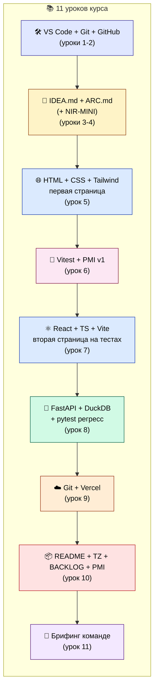
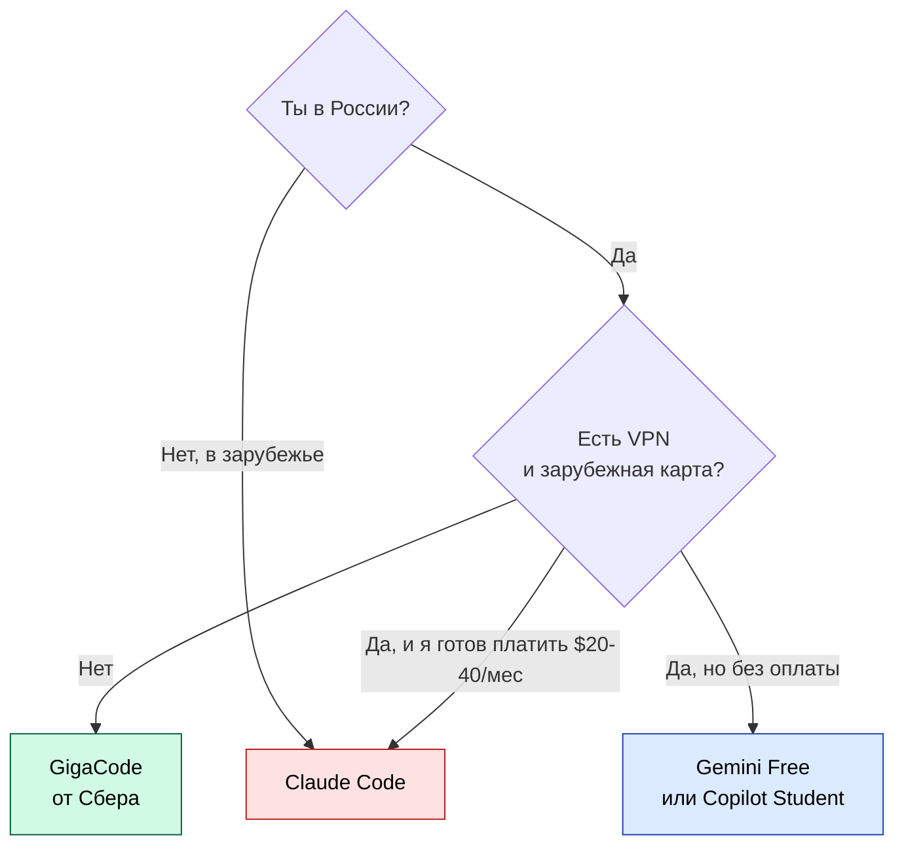

# Курс «От идеи к прототипу с ИИ-агентом» — PM-track для слушателей программы РАГРАФ

> Парный курс к [COURSE-SYSTEM-ANALYST-V1.md](COURSE-SYSTEM-ANALYST-V1.md). Тот — для тех, кто хочет проектировать системы класса РАГРАФ. Этот — для тех, кто хочет **проверять идеи руками и приходить к команде разработки с готовым прототипом**, а не с word-документом на 30 страниц.

---

## Письмо читателю

Привет.

Если ты открыл эту книгу — скорее всего, ты продукт-менеджер, маркетолог, бизнес-аналитик или просто человек с идеей, который однажды нанял разработчиков, рассказал им свою идею на словах, заплатил несколько миллионов рублей и через полгода получил **не то, что хотел**. И ты в курсе, как это бывает.

Возможно, ты прошёл курс «системный аналитик» твоей компании и понял: системному аналитику нужен **бэкграунд в коде**. А у тебя — переговоры, кастдевы, экселевские таблицы, презентации, метрики. Ты умеешь видеть продукт целиком. Но как только речь заходит про `git pull` и `npm run dev` — твои руки опускаются, и идея снова застревает в фазе «надо как-нибудь объяснить разработчикам».

Так вот: больше не надо. В 2026 году появилась **связка `VS Code + ИИ-агент`**, которая позволяет человеку без программистского бэкграунда **самостоятельно собрать рабочий прототип идеи** и положить тимлиду на стол ссылку `https://моя-идея.vercel.app` вместо ТЗ на 30 страниц. И этот курс — про то, как это сделать.

После прохождения ты будешь уметь:

- **Открыть свой ноутбук**, поставить VS Code и ИИ-агента (бесплатного, российского — GigaCode от Сбера; или зарубежного, если у тебя есть VPN и карта).
- **Провести discovery-интервью со своим агентом** по своей же идее — за 40 минут, без коуча. Получить документ `IDEA.md` с шестью обязательными разделами.
- **Собрать прототип за вечер**: страница на HTML, потом — на React, потом — с настоящим бэкендом на Python.
- **Написать к прототипу тесты** так, чтобы вторая страница и бэкенд строились **поверх готового регресс-щита**, а не на честном слове.
- **Опубликовать прототип в интернет** — получить ссылку, которой можно поделиться с заказчиком, инвестором, или, например, мамой.
- **Передать готовый прототип команде разработки** — с пакетом документации такого качества, что у тимлида не возникнет вопроса «а что вы вообще хотели?».
- И главное — **понимать, где заканчивается твоя ответственность**: безопасность, продакшен, нагрузки — это уже компетенция команды. Твоё дело — проверить, что идея жизнеспособна, и упаковать её в передаваемую форму.

Это **не** курс «как стать программистом». И не курс «как пройти собеседование на джуниора». Это курс «как продукт-менеджер с ИИ-агентом обгоняет команду из четырёх разработчиков на стадии проверки гипотезы».

Поехали.

— Команда РАГРАФ + ЦИИ НГУ, май 2026

---

## Контекст эпохи: почему именно сейчас и почему это работает

Если ты пытался гуглить «как пройти курс программирования с нуля», ты видел, что таких курсов сотни, длятся они от 6 до 18 месяцев, стоят от 60 до 400 тысяч рублей и **выпускают джуниор-разработчиков**, а не продукт-менеджеров. Ты — не джуниор-разработчик. Тебе **не надо** учить, как написать `for i in range(10)`. Тебе надо **передать идею через код**.

До 2024 года такого курса в природе не существовало. Был выбор: либо стать программистом (полгода), либо нанимать программиста и объяснять словами. С появлением ИИ-агентов в IDE появился **третий вариант**.

### Три эпохи передачи идеи разработчику

| Эпоха | Как ты передаёшь идею | Цена ошибки на этапе передачи |
|---|---|---|
| **2000-е** | Word-документ на 30 страниц, телефонные звонки, бумажные чертежи | 6 месяцев + 3 миллиона рублей на «не то» |
| **2010-е** | Figma-макеты, Confluence-страницы, Jira-тикеты | 3 месяца + 1 миллион рублей на «почти то» |
| **2026-й** | Рабочий прототип на Vercel + GitHub-репо + видео-брифинг | 2 недели + 0 рублей до решения «то/не то» |

Третий вариант появился, потому что произошло три вещи одновременно:

1. **VS Code стал универсальным редактором** — бесплатным, кросс-платформенным, расширяемым. Команда разработки уже там работает; теперь и ты можешь.
2. **ИИ-агенты научились писать рабочий код** — Anthropic Claude Code, Google Gemini, GitHub Copilot, российский GigaCode от Сбера. В мае 2026 они закрывают 80% типовых задач прототипа без человека-программиста.
3. **Бесплатный деплой стал нормой** — Vercel, Netlify, Railway за 15 минут превращают код из GitHub в публичную ссылку в интернете.

Раньше эти три части были разрозненными: VS Code был для программистов, ИИ был чат-ботом в браузере, а деплой требовал DevOps-инженера. Теперь они стянулись в **одну связку, доступную человеку без программистского образования**. И этот курс учит, как этой связкой пользоваться.

### Чем твой курс отличается от SA-track

Параллельно с тобой в ЦИИ НГУ есть курс **«Системный аналитик в IT»** ([COURSE-SYSTEM-ANALYST-V1.md](COURSE-SYSTEM-ANALYST-V1.md)) — 12 спринтов, 9 месяцев, дипломный проект. Он для другой аудитории.

| Параметр | SA-track | **PM-track (твой)** |
|---|---|---|
| Срок | 9 месяцев (12 спринтов) | **4–5 недель (11 уроков)** |
| Pre-requisites | Базы Python / JS / SQL / Git | **Никаких** — даже Word подойдёт |
| Глубина | Учишься проектировать платформу класса РАГРАФ | **Учишься собирать прототип своей идеи** |
| Сквозной кейс | Доработка реального модуля РАГРАФ | **Свой проект с нуля до Vercel-ссылки** |
| Output | Архитектурное портфолио + ГОСТ-19-документация | **Рабочая ссылка vercel.app + пакет docs (включая PMI) для команды** |

Если после PM-track ты захочешь больше — иди на SA-track. Это работает в обе стороны: системный аналитик может пройти PM-track как разогрев перед серьёзной программой, а продукт-менеджер может пройти SA-track после нашего курса, чтобы общаться с разработчиками на одном языке.

---

## Сквозной кейс курса: что ты соберёшь за 11 уроков

Каждый слушатель ведёт **один сквозной проект** все 11 уроков. Идея — твоя. Если идеи нет — берёшь дефолтную.

**Дефолтная идея ЦИИ НГУ:** «Помощник методолога ЖКХ кампуса НГУ» — мини-каталог регламентов общежитий (что делать при протечке, при пропаже электричества, при шуме после 23:00). У каждой карточки — категория, ответственный, телефон, инструкция. Прозрачный кейс с реальной аудиторией: 6000 студентов в общежитиях НГУ, проблемы каждую неделю. Этот же сценарий покрывает все шаги курса и стыкуется с реальным проектом РАГРАФ (см. фикстуры в [`backend/data/fixtures/`](../backend/data/fixtures/)).

**Альтернативные кейсы для вдохновения** (из реальной библиотеки команды):

- **Тренажёр-подборщик** в стиле SOFIA — пользователь отвечает на 5 вопросов, получает рекомендацию. Ароматерапия, выбор подарка, выбор кофейного зерна.
- **Каталог-демо** в стиле AI-SKLAD — каталог чего угодно: услуги клининга, секции для детей в районе, библиотека технических курсов.
- **Калькулятор стоимости** — форма параметров → расчёт цены. Услуги репетитора, ремонт, доставка.
- **Мини-RAGRAF** — каталог регламентов с фильтром по домену. Идеально, если ты работаешь на муниципалитет или госкомпанию.

Главное правило: **в день 1 ты выбираешь кейс и в день 11 защищаешь его в виде записанного видео-брифинга**. Между ними — 9 уроков непрерывной практики.

---

## Стек, который ты выучишь

Команда РАГРАФ построена на этом стеке — мы знаем, что он работает в продакшене на 30+ регламентах и реальных пользователях. Тот же стек ты будешь собирать в учебных целях:



Это упрощённая версия дефолтного стека Сибирской школы продуктовой разработки ([ADR-001](../../MY-VOLUME/docs/decisions/adr-001-default-stack.md)) — тот же стек, на котором построены РАГРАФ, LEYKA, SOFIA, GONKA. Учишь раз — пользуешься в проектах десять лет.

---

## Метаритуал курса: ski-coding — «лыжный шаг» левая-правая-левая-правая

Это **главный приём, который ты унесёшь домой**. Дороже всех остальных навыков курса.

**Идея.** Работа с агентом превращается в чередование двух типов шагов:

- **Левая лыжа (текст)** — ты вместе с агентом пишешь markdown-документ: IDEA.md, ARC.md, NIR-MINI.md, PMI.md, BACKLOG.md, README.md. Эти документы — носители смысла.
- **Правая лыжа (код)** — агент пишет код, выполняет команды в терминале, запускает тесты. Эти артефакты — носители проверяемости.

Если ты идёшь только на одной лыже — падаешь. Идёшь только текстом (без кода) — через неделю у тебя 4000 строк документации и ноль рабочего продукта (это называется **doc-paralysis**). Идёшь только кодом (без документов) — через неделю 5 несовместимых архитектур, никто не помнит почему (это называется **code-rush**).

```mermaid
flowchart LR
    L1["📝 Урок 3<br/>IDEA.md"] --> L2["📝 Урок 4<br/>ARC.md"]
    L2 --> R1["💻 Урок 5<br/>index.html"]
    R1 --> L3["📝 Урок 6<br/>PMI v1"]
    L3 --> R2["💻 Урок 6<br/>первые тесты"]
    R2 --> R3["💻 Урок 7<br/>React на тестах"]
    R3 --> R4["💻 Урок 8<br/>бэкенд + pytest"]
    R4 --> L4["📝 Урок 10<br/>README + TZ + BACKLOG"]
    L4 --> R5["💻 Урок 9<br/>Vercel deploy"]

    style L1 fill:#E0F2FE,stroke:#0369A1,color:#000
    style L2 fill:#E0F2FE,stroke:#0369A1,color:#000
    style L3 fill:#E0F2FE,stroke:#0369A1,color:#000
    style L4 fill:#E0F2FE,stroke:#0369A1,color:#000
    style R1 fill:#FEF3C7,stroke:#B45309,color:#000
    style R2 fill:#FEF3C7,stroke:#B45309,color:#000
    style R3 fill:#FEF3C7,stroke:#B45309,color:#000
    style R4 fill:#FEF3C7,stroke:#B45309,color:#000
    style R5 fill:#FEF3C7,stroke:#B45309,color:#000
```



**Правило 1.** Перед каждым новым куском кода — есть текстовый артефакт, который объясняет, **что** мы пишем.

**Правило 2.** После каждого куска кода — есть **обновлённый текстовый артефакт**, который зафиксировал, что фактически получилось (фактический ARC.md, не «изначально задуманный»).

**Правило 3.** Если ты три урока подряд идёшь только текстом или только кодом — это сигнал, что ритуал нарушен. Возвращайся.

Этот метаритуал — **наше ноу-хау** ([ski-coding в MY-VOLUME](../../MY-VOLUME/knowledge/skills/ski-coding.md)), отработанное на 8+ проектах команды. В каждом уроке ниже будет явная пометка **«🚶 шаг ski-coding»** — какая это сейчас лыжа.

---

## Концепт NIR-MINI — для тех, у кого идея с исследовательским компонентом

**Что такое NIR.** Научно-исследовательская работа — формат документа, в котором продуктовая команда фиксирует:

- **Исследовательский вопрос.** Что мы хотим узнать про мир / пользователя / алгоритм?
- **Состояние области.** Что уже сделано другими? Какие есть открытые источники, бенчмарки, библиотеки?
- **Гипотеза.** Что мы ожидаем найти?
- **Метод.** Как именно будем проверять (датасет, эксперимент, опрос, A/B-тест)?
- **Промежуточные находки.** Что нашли по факту?
- **Дальнейшие шаги.** Что делать с находками?

Для большинства продуктовых идей NIR не нужен — это просто полезный инструмент, **когда в твоей идее есть исследовательский угол**:

- Алгоритм рекомендаций (хочешь измерить точность).
- Data Science-фича (нужно собрать датасет, выбрать модель, замерить метрики).
- Onboarding-эксперимент (хочешь понять, какая воронка работает).
- Семантический поиск (нужно сравнить bge-m3 с TF-IDF на твоём корпусе).

**Зачем нам NIR-MINI на прототипе?** Две неожиданные причины:

1. **Помогает агенту писать код качественнее.** Когда у агента в контексте есть `NIR-MINI.md` с явной формулировкой «мы проверяем гипотезу X через метрику Y», агент пишет код, ориентированный на эту метрику, а не на общие соображения. Эта связь подтверждена в [§6.11 НИР РАГРАФ](OTCHET-NIR-RAGRAF-2026.md#611-гипотеза-раграф--ии-2--человек--воплощение-саморефлексирующего-ии-уровня-3-на-масштабе-города).

2. **Помогает тебе искать идеи для фич.** Структура NIR заставляет задавать вопросы «что уже есть на рынке?», «какие открытые источники / датасеты?», «какие конкуренты что замеряют?». Половина новых фич рождается именно из этих вопросов.

В Уроке 4 будет необязательный блок: **«если у твоей идеи есть исследовательский угол — пиши NIR-MINI.md рядом с ARC.md»**.

---

## Концепт PMI — программа и методика испытаний

**Что такое PMI.** Документ, который описывает, **как именно тестировать твой продукт**, чтобы можно было сказать «работает» / «не работает» без субъективных оценок.

Структура PMI:

- **Что тестируем.** Каждая функция продукта = свой блок.
- **Тест-кейсы.** Конкретные сценарии: «открыть главную → увидеть 6 карточек → отфильтровать по категории X → увидеть 2 карточки».
- **Acceptance criteria.** Для каждого теста — точный критерий прохождения: «прошёл, если на странице ровно 2 карточки с категорией X».
- **Ручные vs автоматические.** Какие тесты прогоняем руками (UX, дизайн), какие через инструменты (Vitest, pytest).
- **Pass/Fail-критерии.** При каком % прохождения PMI считается пройденной.

PMI — **профессиональный документ**. У РАГРАФ есть полный PMI по ГОСТ-19 ([`docs/PMI_GOST19.md`](https://github.com/Barbashin1970/LEYKA/blob/main/docs/LEYKA_PMI_GOST19.md)). В курсе мы пишем **облегчённую версию на одну страницу**, но с правильной структурой — чтобы команда разработки могла её расширить до полной без переписывания.

**Зачем нам PMI на прототипе?**

1. **Тебе.** Когда ты в Уроке 7 пишешь вторую страницу, ты можешь её сломать первую. Если есть PMI v1 + автоматические тесты — увидишь поломку через секунду. Если нет — через неделю на демо у инвестора.

2. **Команде.** Когда передаёшь прототип, PMI помогает команде понять «что тут уже работает». Они расширяют твою PMI до полной — добавляют тесты безопасности, нагрузочные, интеграционные. Но **базис ты задал**.

В Уроке 6 (новый урок про тестирование) ты напишешь первую версию PMI.md и первые юнит-тесты.

---

## Выбор ИИ-агента — четыре варианта на твой вкус

Курс **не привязан к одному агенту**. Все приёмы переносимы. Но выбор стартовой опции зависит от того, где ты живёшь и какая у тебя карта.

### Вариант 1. GigaCode + GigaChat (Сбер) — рекомендуется по умолчанию для РФ

Российский продукт, нативная поддержка русского языка, регистрация по российскому номеру телефона. Расширение для VS Code, бесплатный тариф. Никаких VPN, никаких зарубежных карт. Идеальный старт для тех, кто живёт и работает в России.

**Минусы:** контекстное окно меньше, чем у западных аналогов; реже обновляется; не всегда понимает сложные команды. Для прототипа этого хватает.

### Вариант 2. Google Gemini Code Assist Free

Бесплатный тариф до 180 тысяч автодополнений в месяц при регистрации через личный Gmail. Контекстное окно — 128 тысяч токенов (на платном — 1 миллион). Расширение для VS Code и JetBrains.

**Минусы:** доступность из России зависит от текущих геоблоков; с 18 июня 2026 года Gemini CLI и Code Assist Extension для индивидуальных тарифов переезжают в новое приложение **Antigravity** — может потребоваться переустановка.

### Вариант 3. GitHub Copilot Free / Cursor Free

**GitHub Copilot** — бесплатный тариф для студентов с подтверждением через GitHub Student Pack и для open-source-контрибьюторов; для всех остальных — платно (карта США/ЕС). **Cursor** — отдельный редактор-форк VS Code, бесплатный план с лимитами по запросам.

**Минусы:** из России — через VPN и зарубежную карту. Зато много моделей на выбор (GPT-5, Claude, Gemini).

### Вариант 4. Anthropic Claude Code

**Лучший по бенчмаркам в индустрии** в мае 2026: SWE-Bench Verified 81% (см. [RESEARCH-AI-PAIR-PROGRAMMING-2026.md](RESEARCH-AI-PAIR-PROGRAMMING-2026.md)). Используется в нашей команде для разработки самого РАГРАФ.

**Минусы:** $20–40 в месяц, требует зарубежной карты, доступ из России — через VPN.

### Какой выбрать для курса



В видео-уроках мы показываем все примеры **на GigaCode** (максимальная доступность для российской аудитории), но **все промпты работают и в Gemini, и в Claude Code, и в Copilot**. Если в уроке агент не понял с первого раза — переформулируй; если переформулировка не помогла, скорее всего, выбрана слишком сложная модель.

---

## Программа из 11 уроков

Каждый урок — **25–40 минут видео + 30–60 минут практики на твоём ноутбуке**. Полный курс — 11–15 вечеров (2 урока в неделю с практикой).

---

### Урок 1 (≈ 50 минут). «Зачем мне это вообще»

**🚶 Шаг ski-coding: нулевой — настройка контекста.**

**Контекст.** Представь: ты идёшь к тимлиду с идеей. У тебя в руках Word-файл на 12 страниц, презентация в Google Slides на 24 слайда и устное «вот тут будет такая кнопка, а тут — список». Тимлид кивает, ты уходишь, через две недели приходит макет — не то. Ещё через две — рабочий код — снова не то. Прошло месяц, потрачено два миллиона.

Альтернатива: ты приходишь к тимлиду с ссылкой `my-idea.vercel.app`, кликаешь карточку, показываешь форму, открываешь BACKLOG.md. Тимлид смотрит 5 минут и говорит: «понятно. Возьмём в спринт, добавим логин, перенесём на PostgreSQL, через 3 недели у нас прод». Прошло час, потрачено ноль.

**Этот контраст — то, ради чего ты тут.**

#### Теория (10 минут)

Жизненный цикл продукта от идеи до продакшена — 9 стадий. Где живёт продукт-аналитик (стадии 0–6: идея → формализация → ниша → ТЭО → ТЗ → архитектура → нарезка). Где живёт команда разработки (стадии 6–9: реализация → ГОСТ-19-комплект → README → отчётность). На каких стадиях ты раньше «передавал на словах» — и где это ломалось.

Концепт **anti-scope** — список того, что ты НЕ делаешь сам. Это не слабость, это профессиональная зрелость. У хирурга anti-scope: не лечит зубы. У продукт-аналитика anti-scope: не настраивает HTTPS-сертификаты.

#### Демонстрация (15 минут)

Ведущий открывает в браузере **три рабочих прототипа** из библиотеки команды и показывает:

- **SOFIA — Арома София**: один продукт-аналитик собрал за выходные. React + Vite + Vercel.
- **AI-SKLAD**: статичный HTML-каталог, один человек, две недели. Используется как демо для тендеров.
- **РАГРАФ**: тот же проект, который мы делаем. Тут уже команда из четырёх человек, но **методолог-аналитик собрал первый прототип за вечер**, а команда подключилась только когда стало ясно, что концепция работает.

#### Практика (20 минут)

Записываешь **три вопроса** в файл `00-three-questions.md` в своей личной папке: «Как это работает? Почему именно так? Что я бы сделал по-другому?» — эти три вопроса станут затравкой для следующих уроков.

#### Артефакт урока

`00-three-questions.md` — три вопроса о работе прототипов.

#### Готовые промпты для практики

```
Объясни простыми словами, чем работа продукт-аналитика с ИИ-агентом
отличается от работы продукт-аналитика без ИИ. Дай 5 конкретных примеров
из российской практики.
```

```
Я смотрю на сайт https://sofia-aroma.vercel.app. Объясни мне как продукт-
аналитику: кто целевой пользователь, какую боль закрывает, какая возможная
бизнес-модель, какие минусы?
```

```
У меня нет опыта программирования. Я могу за месяц курса собрать рабочий
прототип идеи с нуля? Какие реалистичные ожидания и какие классические
ошибки я скорее всего совершу?
```

---

### Урок 2 (≈ 60 минут). «Установка инструментов на свой ноутбук»

**🚶 Шаг ski-coding: подготовка лыж — без шага.**

**Контекст.** Самый страшный урок курса — потому что после него у тебя на ноутбуке появятся: VS Code, Git, аккаунт на GitHub.com, расширение GigaCode и Node.js. Звучит как шесть прыжков через костёр. На деле — каждый шаг займёт 3–5 минут, и ведущий проведёт тебя за руку через каждый.

#### Теория (5 минут)

Что такое IDE («Word, заточенный под код»). Что такое репозиторий («папка с историей всех изменений»). Что такое аккаунт на GitHub («твой Google Drive для репозиториев, но публичный»). Что такое ИИ-агент в редакторе («тот же ChatGPT, только видит твои файлы и может их менять»).

#### Демонстрация (25 минут)

Ведущий пошагово на экране (для Windows и для macOS отдельные дорожки):

1. Скачать VS Code → установить → запустить.
2. Установить Git: на Windows — git-scm.com, на macOS — `brew install git` или `xcode-select --install`.
3. Открыть github.com → зарегистрироваться (имя на латинице, рабочая почта).
4. На github.com → New repository → имя `course-prototype-<твоё-имя>` → Public → Create.
5. В VS Code → Open Folder → создать локально папку `~/Projects/` → Open.
6. В VS Code → терминал → `git clone <URL>` → перейти `cd course-prototype-<имя>`.
7. Установить расширение **GigaCode** через панель Extensions.
8. Авторизоваться в GigaChat по российскому номеру.
9. Открыть чат GigaCode, отправить «привет, ты кто?» — убедиться, что отвечает.

#### Практика (30 минут)

Повторяешь всё на своём ноутбуке. В конце — скриншот VS Code с агентом в чат курса.

#### Артефакт урока

Рабочий VS Code с открытым ИИ-агентом. Скриншот в чат.

#### Готовые промпты для практики

```
Привет. Я начинающий продукт-аналитик, прохожу курс. У меня сейчас открыт
пустой репозиторий в VS Code. Подскажи: ты меня слышишь, какая ты модель,
и что ты умеешь делать с моими файлами?
```

```
Помоги мне проверить, что у меня всё установлено правильно. Открой
терминал в VS Code и выполни команды: git --version, node --version,
python --version. Какие версии нашёл? Чего не хватает?
```

```
Я только что создал пустой репозиторий на github.com под именем
course-prototype-<моё-имя>. Помоги клонировать его в локальную папку
~/Projects/. Дай команды для терминала по шагам.
```

```
Создай в моём репозитории первый файл README.md с заголовком "Курс — прототип
<моё-имя>" и одним абзацем "Это репозиторий учебного курса от идеи к прототипу
с ИИ-агентом". Закоммить с сообщением "init: первый коммит" и запушь в origin.
```

---

### Урок 3 (≈ 60 минут). «Discovery-интервью с агентом — формализуем твою идею»

**🚶 Шаг ski-coding: левая лыжа (текст) — IDEA.md.**

**Контекст.** Ты пришёл на работу со словами «у нас крутая идея — приложение для X». Тимлид кивает, спрашивает «а кто пользователь? а какую метрику замерим? а где anti-scope?» — и ты понимаешь, что ответов нет. Опять.

Этот урок — про то, как **за 40 минут с агентом** превратить размытую идею в документ `IDEA.md`, на который можно показывать.

#### Теория (10 минут)

Что такое discovery-интервью. Шесть обязательных вопросов формализации идеи (мы их взяли из реальной практики 8+ проектов команды, см. [плейбук 01 в MY-VOLUME](../../MY-VOLUME/docs/playbooks/01-idea-formalization.md)):

1. **Кто пользователь.** Не «все люди», а конкретная роль.
2. **Какую конкретную боль закрываем.** С цифрами.
3. **Метрика проверки гипотезы.** Что замерим, чтобы понять — взлетело.
4. **Канал доставки.** Как пользователь найдёт продукт.
5. **Anti-scope.** Что мы НЕ делаем.
6. **Категория.** Заказной коммерческий / pet / научный / демонстрационный.

Концепты **JTBD** (Jobs To Be Done) и **Mom Test** (Роб Фитцпатрик) — два главных инструмента продукт-аналитика для проверки гипотез на интервью.

#### Демонстрация (15 минут)

Ведущий открывает в VS Code агента и говорит:

> «Идея: каталог регламентов общежитий кампуса НГУ. Проведи со мной discovery по 6 вопросам.»

Через 12 минут — готовый `IDEA.md` с 6 разделами.

#### Практика (40 минут)

Каждый слушатель выбирает свою идею. Открывает агента, запускает discovery. Финал — `IDEA.md` в репо.

#### Артефакт урока

`IDEA.md` с 6 разделами + (опционально) `lean-canvas.md` рядом.

#### Готовые промпты для практики

```
Проведи со мной discovery-интервью по моей продуктовой идее. Идея в одном
предложении: <моя идея>. Используй методику из 6 обязательных вопросов:
1) Кто пользователь (конкретная роль);
2) Какую конкретную боль я закрываю (с цифрами);
3) Какая метрика проверки гипотезы;
4) Какой канал доставки;
5) Anti-scope — что мы НЕ делаем (минимум 3 пункта);
6) Категория (заказной / pet / научный / демо).

Задавай вопросы по одному. После всех 6 — собери ответ в файл IDEA.md
в корне моего репозитория.
```

```
Я дал на 2-й вопрос абстрактный ответ ("люди тратят много времени"). Сделай
pushback в стиле Mom Test — задай уточняющие вопросы про факты её жизни,
не про мнение о моей идее. Сколько именно времени? Как часто? Было ли это вчера?
```

```
По моему IDEA.md проведи быструю проверку на согласованность: совпадает ли
пользователь из ответа 1 с метрикой из ответа 3? Покрывает ли anti-scope из
ответа 5 риски? Если есть нестыковки — укажи, где переписать.
```

```
Создай рядом с IDEA.md файл lean-canvas.md — заполни одностраничную бизнес-
модель Lean Canvas на основе моих ответов: проблема, сегменты, ценность,
решение, каналы, метрики, затраты, доходы, нечестное преимущество. Незаполненные
блоки помечай TBD.
```

---

### Урок 4 (≈ 70 минут). «Архитектурный набросок — рисуем, что будем строить; + NIR-MINI для исследовательских идей»

**🚶 Шаг ski-coding: левая лыжа (текст) — ARC.md и опционально NIR-MINI.md.**

**Контекст.** «Не пиши код, пока не нарисовал». Старое правило, актуальное вдвойне, когда у тебя нет программистского бэкграунда. Если ты не можешь нарисовать архитектуру простыми коробками-стрелочками на доске — ты не сможешь её и собрать.

К счастью, агент рисует за тебя. Твоя задача — сверить с реальностью и поправить, что не сходится.

#### Теория (15 минут)

**Часть 1. ARC.md.** Что такое архитектура простого прототипа: «коробки экранов» + «стрелочки переходов» + «коробки данных». Зачем рисовать ДО кода. ARC.md в полной версии (см. [плейбук 05](../../MY-VOLUME/docs/playbooks/05-architecture.md)) — 18 секций. Тебе на старте — **5**: пользователи / экраны / данные / действия / технологии.

**Часть 2. NIR-MINI (опционально).** Если в твоей идее есть исследовательский угол — алгоритм рекомендаций, ML-фича, A/B-эксперимент, семантический поиск — пиши `NIR-MINI.md` параллельно с ARC.md. Структура: вопрос → состояние области → гипотеза → метод → промежуточные находки → дальнейшие шаги. Эта структура помогает агенту писать код, ориентированный на конкретную метрику, а не на общие соображения. См. полный пример в [`OTCHET-NIR-RAGRAF-2026.md`](OTCHET-NIR-RAGRAF-2026.md).

**Когда NIR-MINI лишний.** Если твой прототип — простой каталог / форма / тренажёр без алгоритмической части. Тогда хватает ARC.md.

#### Демонстрация (20 минут)

Ведущий открывает IDEA.md и просит агента:

> «Оформи архитектуру в ARC.md из 5 секций. Добавь Mermaid-диаграмму схемы экранов.»

Получает черновик. Корректирует: «У нас не три экрана, а два — БД не нужна, хватит JSON.» Просит переписать.

Затем (для тех, у кого есть исследовательский угол):

> «У моей идеи есть алгоритм подбора регламентов по тегам. Напиши NIR-MINI.md на одну страницу.»

#### Практика (35 минут)

Делаешь свой ARC.md. Если идея с исследовательским углом — пишешь NIR-MINI.md.

#### Артефакты урока

- `ARC.md` с 5 секциями и Mermaid-диаграммой (обязательно).
- `NIR-MINI.md` (опционально, если применимо).

#### Готовые промпты для практики

```
Оформи архитектуру моей идеи в файл ARC.md из 5 секций:
1) Пользователи — кто и в каких ролях работает с продуктом;
2) Экраны — какие страницы будет видеть пользователь, в виде Mermaid-
   диаграммы потока навигации;
3) Данные — какие сущности хранятся, какие поля у каждой;
4) Действия — что пользователь может делать (CRUD, фильтр, поиск...);
5) Технологии — какой стек используем (HTML+CSS на старте, потом
   React+Vite, потом FastAPI+DuckDB).

Опирайся на готовый IDEA.md. Не усложняй. Это прототип, не production.
```

```
Перепиши секцию "данные" — у нас не три сущности, а две: <название 1>
и <название 2>. Связь между ними — <описание>. БД нам пока не нужна,
хватит JSON-файла в frontend/public/data.json.
```

```
Покажи мне ARC.md в виде Mermaid-диаграммы: коробки экранов слева, стрелки
переходов между ними, рядом с каждым экраном — список действий пользователя
на этом экране.
```

```
В моём ARC.md есть секция, которая выглядит избыточной для прототипа.
Найди её и предложи упростить или убрать. Объясни, почему она избыточна
на этой стадии жизненного цикла.
```

**Промпты для NIR-MINI (опционально, если у идеи есть исследовательский угол):**

```
Прочитай мой IDEA.md и ARC.md. У моей идеи есть исследовательский угол:
<алгоритм / ML-фича / A-B-эксперимент / семантический поиск>. Напиши NIR-MINI.md
из 6 секций:
1) Исследовательский вопрос — что хотим узнать;
2) Состояние области — какие готовые библиотеки / алгоритмы / датасеты
   есть, что используют конкуренты;
3) Гипотеза — что ожидаем найти;
4) Метод — как именно проверим (датасет, метрика, эксперимент);
5) Промежуточные находки — TBD, пока ничего;
6) Дальнейшие шаги — что делать с находками.

На одну страницу А4. Опирайся только на открытые источники.
```

```
По моему NIR-MINI.md — какие 3 фичи в моём прототипе нужно реализовать,
чтобы я смог замерить метрику из секции 4? Дай список с приоритетом.
```

---

### Урок 5 (≈ 70 минут). «Первый экран в браузере — HTML и Tailwind»

**🚶 Шаг ski-coding: правая лыжа (код) — index.html.**

**Контекст.** Сейчас будет момент, ради которого ты пришёл на курс: ты впервые **дважды кликнешь на файл `index.html`** и увидишь свой первый экран. И это сделал агент, а не ты.

#### Теория (5 минут)

HTML — **бумажный чертёж в браузере**. CSS — **краски и пропорции**. Tailwind — **набор готовых классов**. Что значит «локально открыть HTML-файл двойным щелчком».

#### Демонстрация (25 минут)

Ведущий: «Сделай первый экран из моего ARC.md в виде статичной HTML-страницы. Tailwind через CDN.» Через 30 секунд — `index.html`. Двойной клик — браузер открывает страницу. Список карточек.

«Добавь иконки в каждую карточку. Сделай мобильную адаптивность.» Готово.

#### Практика (40 минут)

Делаешь у себя. К концу урока — рабочий первый экран в браузере, без интернета. Это момент, когда «вот теперь я поверил».

#### Артефакт урока

`index.html` + `detail.html` в репо, открываются двойным щелчком.

#### Готовые промпты для практики

```
Опирайся на готовый ARC.md и сделай первый экран в виде статичной HTML-
страницы. Создай файл index.html в корне репозитория. Используй Tailwind
через CDN (один тег <script src="https://cdn.tailwindcss.com"></script>),
чтобы было красиво без настройки. Шапка, основной блок, подвал. Цвета —
нейтральные (slate / stone / indigo).
```

```
Добавь на главный экран 6 карточек с примерами данных по моему IDEA.md.
Каждая карточка содержит: иконку (используй SVG из Lucide через inline SVG),
заголовок, описание (2 строки), кнопку "Подробнее". Сетка: 1 колонка на
мобильных, 2 на планшетах, 3 на десктопе.
```

```
Сделай страницу адаптивной для мобильных устройств. Шапка должна сжиматься,
сетка карточек — становиться одноколоночной на ширине меньше 640px.
```

```
Добавь второй HTML-файл detail.html — детальная страница карточки. Сделай
из карточек на главной кликабельные ссылки на detail.html?id=<id>. На детальной
странице — заголовок, описание, кнопка "Назад к списку".
```

```
Я открыл index.html в браузере, но Tailwind-классы не применяются —
страница выглядит как голый HTML. Что я мог сделать не так?
```

---

### Урок 6 (≈ 80 минут). «Тестирование первого экрана — Vitest + PMI v1»

**🚶 Шаг ski-coding: гибридный — левая (PMI.md) + правая (тесты-код). Это шаг, ради которого изобрели ski-coding.**

**Контекст.** Ты только что собрал первый экран — он работает. Но ты ещё не знаешь, что в нём **сломается**, когда в Уроке 7 ты будешь перетаскивать его в React. И не узнаешь, пока не запустишь страницу и не пощёлкаешь.

После этого урока ты будешь знать **за секунду** — потому что у тебя будет автоматический тест, который пробежит сам и расскажет, что сломалось. Это называется **регресс-щит** — защита от регресса (откатов).

**Главная мысль.** В команде разработки тестировщик пишет PMI до того, как программист пишет код. У тебя в одной голове и аналитик, и тестировщик, и программист. Чтобы они не подрались — ставь чёткий ритуал: **PMI пишется как только готов первый экран, ДО второй страницы**. Иначе при разработке второй ты сломаешь первую и не заметишь.

#### Теория (15 минут)

**Часть 1. Что такое тестирование.** Три уровня:

- **Юнит-тест** — проверяет одну маленькую функцию или компонент. Например: «функция format-price отдаёт правильную строку для числа 1500». Быстро, дёшево, много.
- **Интеграционный тест** — проверяет связку нескольких частей. «Карточка отрисовывается с правильными данными из props».
- **E2E-тест** — проверяет весь сценарий сквозь интерфейс. «Открыл главную → отфильтровал → увидел 2 карточки». Медленно, дорого, мало.

Для прототипа курса хватает первого и второго уровня. E2E делает команда разработки на этапе релиза.

**Часть 2. PMI (Программа и Методика Испытаний).** Документ, в котором написано, **что и как** тестируем. Каждый блок:

- Что тестируем (компонент / функция / экран).
- Тест-кейсы (конкретные сценарии).
- Acceptance criteria (точный критерий прохождения).
- Способ (ручной / автомат).

PMI — **профессиональный документ команды**. Полная версия PMI у нас в РАГРАФ — это полноценный документ по ГОСТ-19 (см. [PMI LEYKA](https://github.com/Barbashin1970/LEYKA/blob/main/docs/LEYKA_PMI_GOST19.md) как образец). Тебе в курсе хватит облегчённой версии **на одну страницу**.

**Часть 3. Vitest.** Инструмент для запуска юнит-тестов на JavaScript / TypeScript. Уже встроен в Vite. Команда `npm run test` запускает все тесты в проекте.

#### Демонстрация (25 минут)

Ведущий просит агента:

> «Прочитай мой index.html и ARC.md. Напиши PMI v1 на одну страницу: что мы тестируем на первом экране, какие тест-кейсы, какие acceptance criteria. Сохрани в PMI.md.»

Через 3 минуты — PMI.md с блоками: «отрисовка шапки», «6 карточек», «фильтр по категории», «адаптивность mobile/desktop». Для каждого блока 1–3 тест-кейса.

> «Теперь установи Vitest и напиши автоматические юнит-тесты для функций, которые в первом экране (формат цены, рендер карточки, фильтрация массива по категории). Создай папку tests/. Запусти npm run test.»

Vitest запускается, прогоняет 6 тестов, все зелёные. Если изменить что-то в коде так, что тест сломается — Vitest тут же красным шрифтом расскажет, где.

#### Практика (40 минут)

Делаешь у себя: пишешь PMI.md, ставишь Vitest, пишешь 5–8 юнит-тестов на свой первый экран. К концу урока — `npm run test` отдаёт **зелёный регресс-щит**.

#### Артефакты урока

- `PMI.md` v1 — на одну страницу А4.
- Папка `frontend/tests/` с 5–8 юнит-тестами.
- Команда `npm run test` отдаёт зелёный статус.

#### Готовые промпты для практики

```
Прочитай мой index.html и ARC.md. Напиши PMI v1 (Программа и Методика
Испытаний) на одну страницу А4 для первого экрана. Структура:
1) Что тестируем — список из 4-6 блоков (отрисовка шапки, карточки,
   фильтр, адаптивность, навигация на detail);
2) Для каждого блока — 2-3 тест-кейса в формате "Дано / Когда / Тогда";
3) Acceptance criteria — точный критерий прохождения;
4) Способ проверки — ручной / автомат через Vitest.
Сохрани в PMI.md в корне репозитория.
```

```
Установи Vitest как dev-зависимость в моём frontend/-проекте. Настрой
vitest.config.ts. Создай папку tests/ для тест-файлов. Покажи, как
запускать тесты командой npm run test.
```

```
Напиши юнит-тесты для функций моего первого экрана:
1) format-price — форматирует число в строку с рублями ("1500" → "1 500 ₽");
2) filter-by-category — фильтрует массив объектов по полю category;
3) Card-компонент — рендерится с правильными данными из props.
Каждый тест-кейс — отдельный файл в tests/. Запусти и убедись, что все
тесты зелёные.
```

```
Сейчас все мои тесты зелёные. Намеренно сломай функцию format-price (поменяй
"₽" на "$"). Запусти npm run test и покажи, как именно Vitest сообщит
об ошибке. Потом верни как было.
```

```
Открой мой PMI.md и сверь со списком юнит-тестов в tests/. Если какой-то
блок PMI не покрыт тестом — допиши тест и обнови PMI с пометкой "автомат".
Если блок не подходит для авто-теста (про дизайн) — оставь как "ручной"
с инструкцией для тестировщика.
```

---

### Урок 7 (≈ 80 минут). «Современный фронтенд — React + TypeScript + Vite; вторая страница поверх тестов»

**🚶 Шаг ski-coding: правая лыжа (код) — но с регресс-щитом за спиной.**

**Контекст.** Поздравляю — у тебя есть рабочий первый экран и зелёный регресс-щит. Сейчас будет серьёзный скачок: ты перетащишь всё в React, добавишь вторую страницу — и **тесты пробегут после каждого изменения**. Если первый экран сломается — увидишь сразу.

Это называется **разработка через тестирование** — TDD. Команды разработки используют её именно так.

#### Теория (10 минут)

- **React** — стандарт фронтенда 2020-х. Компонентный подход.
- **TypeScript** — JavaScript со строгими типами.
- **Vite** — инструмент сборки.
- **Tailwind** — тот же, что в уроке 5, но теперь правильно установленный.

И главное: **порядок работы изменился**. Раньше ты писал код и проверял глазами. Теперь ты пишешь код и **запускаешь Vitest после каждого крупного шага**. Поломал что-то — узнаёшь за 2 секунды.

#### Демонстрация (25 минут)

Ведущий просит:

> «Преврати мой index.html в проект на React + Vite + TS + Tailwind. Перенеси юнит-тесты из tests/ в новую структуру. Прогони npm run test и убедись, что все зелёные.»

Агент:
- `npm create vite@latest frontend -- --template react-ts`
- Установка зависимостей.
- Перенос HTML-разметки в `src/App.tsx`.
- Разделение на компоненты: Header, CardList, Card, Footer.
- **Перенос юнит-тестов** под новую структуру компонентов.
- `npm run test` — зелёные.

«Добавь маршрутизацию через React Router 6 — главная и детальная.» Сделано. **Запусти тесты.** Зелёные.

«Добавь функцию фильтра по категории.» Сделано. **Запусти тесты.** Один сломался — фильтр случайно поменял регистр. Агент исправляет. **Запусти.** Зелёные.

Вот так выглядит работа с регресс-щитом.

#### Практика (45 минут)

Повторяешь у себя. Финал: React-проект с двумя страницами, фильтр работает, **все тесты зелёные**.

#### Артефакт урока

Локально запускающийся React-проект, `npm run dev` показывает две страницы; `npm run test` зелёный.

#### Готовые промпты для практики

```
Преврати мой index.html в проект на React 18 + Vite 5 + TypeScript +
Tailwind 3. Создай папку frontend/, выполни npm create vite@latest .
с шаблоном react-ts. Настрой Tailwind. Перенеси содержимое первого
экрана в компонент App.tsx. Перенеси юнит-тесты из старого tests/
в новую структуру. Запусти npm run test и убедись, что все зелёные.
```

```
Раздели страницу на компоненты: Header.tsx, CardList.tsx, Card.tsx,
Footer.tsx. Каждый — в src/components/. Передавай данные через props,
типизируй интерфейсами. После рефакторинга — прогони npm run test
и убедись, что регресс-щит зелёный.
```

```
Добавь маршрутизацию через React Router 6: главная на /, детальная
карточка на /card/:id. Используй Link для переходов. Установи
react-router-dom. После — прогони npm run test.
```

```
Добавь функцию фильтра карточек по категории через useState и select-
элемент в шапке. Напиши новый юнит-тест на функцию фильтрации.
Запусти npm run test и обнови PMI.md, добавив тест-кейс на фильтр.
```

```
У меня тест на фильтр сломался: ожидаемое значение 2, фактическое 0.
Покажи мне точное сообщение Vitest. Найди причину в коде и исправь.
После — снова прогон тестов.
```

---

### Урок 8 (≈ 110 минут). «Бэкенд на Python — FastAPI + DuckDB + pytest»

**🚶 Шаг ski-coding: правая лыжа (код) — два слоя кода (бэкенд + бэкенд-тесты).**

**Контекст.** Самый длинный урок курса. Здесь ты впервые поймёшь, **что такое API**, и почему разработчики постоянно про него говорят. И почему DuckDB — это правильный выбор для прототипа. И — главное — здесь ты впервые соберёшь **второй регресс-щит**, на этот раз для бэкенда. На pytest.

После этого урока у тебя будут две пары лыж: фронтовая (Vitest) и бэкенд (pytest). Любые правки от этого момента — оба регресса прогоняются после каждого крупного шага.

#### Теория (15 минут)

**Бэкенд** — сервер, который хранит данные и отдаёт фронту. **API** — набор «ручек», через которые фронт обращается к бэку.

**FastAPI** — самый простой Python-фреймворк для API. Делает за тебя 80% рутины. **DuckDB** — лёгкая БД в файле. На РАГРАФ в продакшене работает DuckDB же — мы пока не упёрлись в её ограничения. Переход на PostgreSQL — компетенция команды разработки, не твоя.

**pytest** — стандартный инструмент тестирования Python. Команда `pytest backend/tests/` прогоняет всё.

#### Демонстрация (35 минут)

Ведущий просит:

> «Создай Python-бэкенд в backend/. FastAPI + DuckDB. Ручка GET /api/items.»

Агент:
- Создаёт `backend/` структуру.
- Создаёт виртуальное окружение.
- Устанавливает зависимости: fastapi, uvicorn, duckdb, pydantic, **pytest**.
- Создаёт `backend/app/main.py`, `db.py`, `api/items.py`.
- Сидит 5 примеров данных.
- Запускает `uvicorn`.

> «Подключи через TanStack Query к фронту.» Готово. Фронт получает данные.

> «А теперь напиши pytest-тесты для бэкенда: одну тест-функцию на каждую ручку. Используй FastAPI TestClient. Прогоняй pytest. Обнови PMI.md разделом про бэкенд.»

Агент пишет `backend/tests/test_items.py` с 3 тестами: GET список, GET один, POST новый. `pytest` — зелёный. PMI.md обновляется новым разделом.

#### Практика (60 минут)

Повторяешь у себя. POST-ручка → форма на фронте → новый pytest-тест на POST → npm run test тоже прогоняем → всё зелёное.

#### Артефакты урока

- Фронт + бэк локально общаются.
- `pytest backend/tests/` зелёный.
- `npm run test` зелёный.
- Обновлённый `PMI.md` с разделом про бэкенд.

#### Готовые промпты для практики

```
Создай Python-бэкенд в папке backend/. Используй Python 3.12, FastAPI,
DuckDB, pytest. Структура: backend/app/main.py, backend/app/db.py,
backend/app/api/items.py, backend/tests/, backend/requirements.txt.
Сделай ручку GET /api/items — возвращает список из таблицы items.
Засидь 5 примеров данных. Покажи, как создать виртуальное окружение
и запустить uvicorn.
```

```
Подключи мой React-фронтенд к бэкенду через TanStack Query (react-query v5).
Установи @tanstack/react-query. В CardList используй useQuery для получения
данных с http://localhost:8000/api/items. Покажи loading-состояние и
обработку ошибок. Включи CORS на бэкенде для localhost:5173.
```

```
Добавь POST-ручку /api/items для создания новой карточки. На фронтенде
сделай отдельный экран /new с формой: 2 поля + кнопка "Добавить". После
успешной отправки — редирект на главную и обновление списка через
queryClient.invalidateQueries.
```

```
Напиши pytest-тесты для всех моих ручек бэкенда. Используй FastAPI TestClient.
Создай backend/tests/test_items.py с тест-функциями:
1) test_get_items_returns_list — проверка что GET /api/items возвращает список;
2) test_get_item_by_id — проверка GET /api/items/{id};
3) test_post_item_creates_new — проверка POST /api/items;
4) test_post_item_validation_error — POST с некорректными данными отдаёт 422.
Прогоняй pytest и убедись, что все зелёные.
```

```
Обнови мой PMI.md новым разделом "Бэкенд": список ручек, тест-кейсы,
acceptance criteria, способ проверки (через pytest). Сохрани с пометкой
"PMI v2 — после Урока 8".
```

```
Прогоняй сразу два набора тестов: cd frontend && npm run test, потом
cd backend && pytest. Покажи мне сводный статус. Если что-то красное —
покажи точное сообщение и предложи фикс.
```

---

### Урок 9 (≈ 80 минут). «Публикация в интернет — Git, GitHub, Vercel»

**🚶 Шаг ski-coding: правая лыжа (код) — деплой как часть продукта.**

**Контекст.** До этого урока твой прототип жил только у тебя на ноутбуке. Сейчас ты получишь **публичную ссылку**, которой можно поделиться с кем угодно в мире.

#### Теория (10 минут)

**Git-коммит** — снимок состояния файлов. **Запушить в GitHub** — отправить локальные коммиты в облачное хранилище. **Vercel** — бесплатный сервер для статичных сайтов.

Чем отличается **деплой фронта** (на Vercel) от **деплоя бэка** (на Railway / Render): фронт — статика, лёгко и бесплатно; бэк — работающий процесс, серверное окружение. Для прототипа деплоим фронт; бэк — анти-скоп твоей роли.

#### Демонстрация (25 минут)

1. `git add .` → `git commit -m "feat: рабочий прототип со связкой фронт+бэк и регресс-щитом"` → `git push origin main`.
2. vercel.com → Sign Up через GitHub.
3. Import Project → выбор репо.
4. Настройки: Framework = Vite, Root Directory = `frontend`, Build = `npm run build`, Output = `dist`.
5. Deploy → 90 секунд → готово.
6. Получаешь `https://course-prototype-имя.vercel.app`.

Что если бэк нужен в проде — Vercel не подойдёт. Команда разработки развернёт бэкенд на Railway / Render / собственном сервере.

#### Практика (45 минут)

Делаешь свой деплой. Финал: публичная ссылка в чат курса.

#### Артефакт урока

`https://<имя-проекта>.vercel.app` — открывается в любом браузере мира.

#### Готовые промпты для практики

```
Покажи мне статус моего репозитория: какие файлы изменены, какие новые,
какие закоммичены. Я только что закончил урок 8.
```

```
Создай файл .gitignore в корне репозитория. Исключи всё, что не должно
попадать в Git: node_modules/, .env, *.duckdb, .DS_Store, dist/, .vscode/,
__pycache__/, *.pyc, .venv/, .pytest_cache/, htmlcov/.
```

```
Закоммить все изменения с сообщением "feat: рабочий прототип со связкой
фронт+бэк, регресс-щит Vitest + pytest, PMI v2". Запушь в origin/main.
```

```
Я зашёл на vercel.com, авторизовался через GitHub. Подскажи пошагово,
как импортировать репозиторий и развернуть фронтенд. У меня структура:
frontend/ — это Vite-приложение, backend/ — это Python-API. Какие настройки
Vercel выбрать (Root Directory, Build Command, Output Directory) для
Vite-приложения в подпапке?
```

```
Билд на Vercel упал с ошибкой <вставить полный текст ошибки>. Что не так,
и какая команда / какое исправление поможет?
```

```
Vercel развернул мой фронт, но кнопки API не работают — стучится на
localhost:8000, которого нет в интернете. Объясни два варианта:
(1) развернуть бэкенд на Railway, (2) использовать mock-данные. Помоги
выбрать вариант для моего демо.
```

---

### Урок 10 (≈ 100 минут). «Документация — README, TZ, BACKLOG, PMI, NIR — финальный пакет для команды»

**🚶 Шаг ski-coding: левая лыжа (текст) — собираем всё в передаваемый артефакт.**

**Контекст.** У тебя есть рабочий прототип на Vercel, два регресс-щита (Vitest + pytest), PMI v2 после бэкенда. Сейчас ты соберёшь всё в **пакет документации**, который тимлид откроет за 10 минут и поймёт, что ему передали.

#### Теория (15 минут)

Пять обязательных документов финального пакета (плюс один опциональный):

- **README.md** — лицо проекта. Тимлид открывает первым. 5 вопросов за 30 секунд: что это / для кого / как запустить / какие технологии / куда тыкать дальше.
- **TZ-DRAFT.md** — черновик ТЗ. Не ГОСТ-19 (это SA-track). Минимальная структура: цель, аудитория, User Story, FR/NFR, anti-scope.
- **BACKLOG.md** — что **не сделал**, с пояснением **почему**. Это твой профессиональный иммунитет: ты заранее обозначил границы.
- **PMI.md (v3 финальный)** — программа и методика испытаний. Уже есть из Уроков 6 и 8 — здесь финализируем разделом «приёмочные критерии для команды».
- **NIR-MINI.md** (опционально) — если у твоей идеи был исследовательский угол.
- **ARC.md** — уже есть из Урока 4. Здесь — финальная ревизия после фактической реализации.

#### Демонстрация (30 минут)

Ведущий просит агента пять команд подряд:

1. «Напиши ТЗ по файлу IDEA.md → TZ-DRAFT.md.»
2. «Финализируй ARC.md под фактическую реализацию.»
3. «Составь и приоритезируй BACKLOG.md — что сделано, что в работе, что откладываем на команду (с причинами).»
4. «Финализируй PMI.md v3 — добавь раздел «приёмочные критерии для команды».»
5. «Напиши README.md проекта с скриншотом, ссылкой на Vercel, командами запуска.»

Через 15 минут — полный пакет в репо. Ведущий редактирует пару формулировок, коммитит, открывает GitHub-страницу репо — README рендерится красиво на главной.

#### Практика (55 минут)

Делаешь свой пакет. Если у тебя был NIR-MINI.md — финализируй и его. Финал: репо на GitHub содержит IDEA.md, ARC.md, (опционально NIR-MINI.md), README.md, TZ-DRAFT.md, BACKLOG.md, PMI.md, и фронт+бэк код + регресс-щит.

#### Артефакт урока

Полный пакет документации в репо. Команда разработки берёт прототип в работу без дополнительных объяснений.

#### Готовые промпты для практики

```
Напиши ТЗ по файлу IDEA.md → создай TZ-DRAFT.md на одну страницу. Структура:
1) Цель продукта;
2) Целевая аудитория с ролями;
3) Основные сценарии использования (User Story в формате "Как ... я хочу
   ... чтобы ...");
4) Функциональные требования FR-1, FR-2... (нумерованный список);
5) Нефункциональные требования (производительность, доступность);
6) Ограничения и anti-scope.
Без воды.
```

```
Финализируй мой ARC.md под фактическую реализацию. Если по факту получилось
не три экрана, а два — отрази. Если по факту нет фильтра по тегам, который
был в плане — отрази. Финальный ARC.md = "что реально получилось", не
"что хотелось".
```

```
Составь и приоритезируй BACKLOG.md. Структура:
- ✅ "Сделано" — что уже работает в прототипе (с галочками);
- 🔨 "В работе" — оставшиеся косметические правки (0-3 пункта);
- ⏳ "Откладывается на команду разработки" — для каждого пункта объясни
  ПОЧЕМУ: безопасность, миграция БД (DuckDB → PostgreSQL), нагрузочное
  тестирование, мониторинг, CI/CD, перенос на корпоративную инфраструктуру
  (минимум 5 пунктов с пояснением);
- 🚫 "Anti-scope" — то, что осознанно не входит в продукт.
Приоритизируй откладываемое по MoSCoW (Must / Should / Could / Won't).
```

```
Финализируй мой PMI.md в версию v3 для передачи команде. Добавь раздел
"Приёмочные критерии для команды разработки": что должно работать на
проде после доработки команды (логин, HTTPS, миграция на PostgreSQL,
бэкапы). Каждый критерий — с тест-кейсом, который команда должна
прогнать перед релизом.
```

```
Напиши README.md моего прототипа. Опирайся на готовый IDEA.md, ARC.md,
PMI.md. Структура: (1) заголовок с эмодзи, (2) tagline что это и для кого,
(3) бейджи статуса, (4) скриншот, (5) ссылка на Vercel-демо, (6) "Как
запустить локально" (frontend + backend), (7) "Как запустить тесты"
(npm run test + pytest), (8) "Технологии", (9) "Что дальше" со ссылкой
на BACKLOG.md и PMI.md. Стиль — для команды разработки, кратко.
```

```
Сделай ревизию всего пакета: открой IDEA.md, ARC.md, README.md, TZ-DRAFT.md,
BACKLOG.md, PMI.md (+ NIR-MINI.md если есть) и проверь, что в них нет
противоречий. Если, например, в IDEA.md anti-scope включает "не делаем
чат", а в TZ-DRAFT.md вдруг описана функция чата — укажи на нестыковку.
```

---

### Урок 11 (≈ 100 минут). «Брифинг команде разработки — итоговое испытание»

**🚶 Шаг ski-coding: защита всего, что ты собрал лыжными следами.**

**Контекст.** Финальный урок. Ты записываешь **15-минутный видео-брифинг по своему прототипу**, как будто передаёшь его реальной команде разработки. После этого ты не «прошёл курс программирования» — ты **получил новую профессию**.

#### Теория (15 минут)

Где заканчивается твоя ответственность и начинается ответственность команды:

- **Безопасность.** Аутентификация, защита от XSS / SQL-инъекций, HTTPS.
- **Миграция БД.** DuckDB → PostgreSQL при необходимости.
- **Нагрузки.** Нагрузочное тестирование, кеширование.
- **Мониторинг.** Метрики (Prometheus), логи (ELK), алерты.
- **CI/CD.** Автосборка, прогон тестов, развёртывание.
- **Перенос инфраструктуры.** На корпоративные серверы заказчика.

Хирург не лечит зубы; стоматолог не оперирует сердце. У тебя другая роль.

Главный приём — **переход от «вот идея, сделайте красиво» к «вот рабочий прототип, документация, deploy-ссылка, BACKLOG, PMI; продолжите отсюда»**. Это экономит команде **2–3 спринта аналитической работы** — реальные деньги.

#### Демонстрация (15 минут)

Ведущий проводит «учебный брифинг» по своему прототипу:

1. **«Что это»** (1 мин) — цель из IDEA.md.
2. **«Демо»** (2 мин) — Vercel-ссылка, базовые сценарии.
3. **«Архитектура»** (3 мин) — ARC.md + стек.
4. **«Как мы это проверили»** (2 мин) — PMI + два регресс-щита.
5. **«Что НЕ сделали и почему»** (3 мин) — BACKLOG.md.
6. **«Что предлагаю команде»** (1 мин) — следующие шаги, ориентировочные сроки.
7. **«Вопросы»** (3 мин) — Q&A.

#### Практика (70 минут)

Готовишь свой 15-минутный брифинг. Записываешь скринкаст. Загружаешь в чат курса. Получаешь обратную связь от ведущего и одногруппников.

#### Артефакт урока (итог курса)

Видео-брифинг 10–15 минут — защита прототипа.

#### Готовые промпты для практики

```
Помоги мне подготовить 15-минутный устный брифинг для тимлида команды
разработки. Сценарий брифинга:
1) "Что это" — одна минута на цель продукта (от IDEA.md);
2) "Демо" — две минуты на показ Vercel-ссылки и базовых сценариев;
3) "Архитектура" — три минуты разбора ARC.md и стека;
4) "Как мы это проверили" — две минуты разбора PMI и двух регресс-щитов
   (Vitest + pytest);
5) "Что мы НЕ сделали и почему" — три минуты разбора BACKLOG.md;
6) "Что предлагаю команде" — одна минута следующих шагов;
7) "Вопросы" — три минуты Q&A.
Дай мне план презентации с тезисами на каждый блок.
```

```
Сгенерируй 10 типовых вопросов, которые задаст тимлид при приёмке прототипа
от продукт-аналитика. Например: "почему DuckDB, а не PostgreSQL?", "сколько
пользователей выдержит этот код?", "где обработка ошибок?", "какое покрытие
тестами?". Для каждого вопроса дай мне 2-3 предложения готового ответа в
стиле "это прототип, для production нужно <конкретное действие команды>,
ориентир — <трудозатраты>".
```

```
Я записал скринкаст брифинга 13 минут. Хочу обратную связь по structure.
Я загружу транскрипт в файл briefing-transcript.md и попрошу тебя прочитать
его. Что улучшить в следующей версии: пробелы, повторы, места, где темп
проседает?
```

```
Помоги мне написать короткое сопроводительное письмо тимлиду по email/мессенджеру.
Структура: ссылка на репозиторий, ссылка на Vercel-демо, краткое описание
(3-4 предложения), ссылка на видео-брифинг, фраза про регресс-щит, вопрос
"когда удобно созвониться". Профессиональный, но не сухой тон.
```

---

## Что ты унесёшь домой после курса

После 11 уроков у тебя на руках будет:

✅ **Рабочий публичный прототип** твоей идеи по адресу `<твоё-имя>.vercel.app`.

✅ **GitHub-репозиторий** с историей всех коммитов.

✅ **Пакет из 6–7 документов** (IDEA, ARC, опц. NIR-MINI, README, TZ-DRAFT, BACKLOG, PMI) — готов к передаче команде разработки.

✅ **Два регресс-щита** — Vitest для фронта, pytest для бэка, оба зелёные.

✅ **Видео-брифинг** 10–15 минут — твой кейс в портфолио.

✅ **Навык**, который рынок труда 2026 года ценит выше «умения писать ТЗ в Confluence».

✅ **Понимание стека** — React + TypeScript + Vite + Python + FastAPI + DuckDB + Vercel + Vitest + pytest.

✅ **Список из 60+ готовых промптов** на русском языке.

✅ **Метаритуал ski-coding** — лыжный шаг «текст-код-текст-код», который ты будешь применять в каждом следующем проекте.

И самое главное:

✅ **Уверенность**, что между «у меня есть идея» и «вот рабочая ссылка с регресс-щитом» — не полгода работы команды из четырёх человек, а одна-две недели работы тебя и агента.

---

## Бонусный урок (опционально). «Продвинутые приёмы — ski-coding deep dive»

После основной программы желающие могут пройти расширенный урок 12, основанный на полной методологии [ski-coding](../../MY-VOLUME/knowledge/skills/ski-coding.md):

- **Цикл из 6 шагов** в полной развёртке (Аудит → Реализация → Актуализация docs → Новые фичи → Backlog → Тесты → Аудит).
- **Save-Then-Rewrite** для больших документов.
- **Phase-decomposition** (A.1 / A.2 / B.1 / ...) — как делить большую задачу.
- **Что делать, когда агент «теряет нить»** в долгой сессии.
- **Управление backlog**: MoSCoW / RICE / ICE.
- **Полноценный NIR**: от mini-версии к полному отчёту по образцу [`OTCHET-NIR-RAGRAF-2026.md`](OTCHET-NIR-RAGRAF-2026.md).
- **Полноценная PMI**: от облегчённой версии курса к ГОСТ-19-комплекту.

Этот блок переводит тебя в режим **«соло-разработчик»** — следующий уровень владения.

---

## Что дальше — два пути роста

### Путь 1. Углубиться как продакт-менеджер

Иди в [плейбук 12 «5 букв + 11 спринтов»](../../MY-VOLUME/docs/playbooks/12-product-strategy-curriculum.md) и [плейбук 10 «Mapping Product Focus»](../../MY-VOLUME/docs/playbooks/10-product-focus-mapping.md). Это JTBD, Lean Canvas, юнит-экономика, AARRR, психотипы Бартла — продуктовая методология.

### Путь 2. Перейти на SA-track и стать системным аналитиком

Если хочешь не только проверять идеи, но и **проектировать платформы класса РАГРАФ** — иди на [SA-track](COURSE-SYSTEM-ANALYST-V1.md). 12 спринтов на 9 месяцев: архитектура РАГРАФ детально (Turtle, SHACL, оракульная вычислимость, гибридный ИИ) + дипломный проект.

PM-track — это **разогрев** для SA-track, если решишь идти дальше. И полноценная самостоятельная компетенция, если решишь оставаться продакт-менеджером.

---

## Связанные документы

- [`COURSE-SYSTEM-ANALYST-V1.md`](COURSE-SYSTEM-ANALYST-V1.md) — параллельный курс для системных аналитиков.
- [`COURSE-RAGRAF-V1.md`](COURSE-RAGRAF-V1.md) — первый курс ЦИИ НГУ «РАГРАФ — собери своего ИИ-модератора регламентов».
- [`docs/RESEARCH-AI-PAIR-PROGRAMMING-2026.md`](RESEARCH-AI-PAIR-PROGRAMMING-2026.md) — обзор AI-агентов в мае 2026.
- [`docs/OTCHET-NIR-RAGRAF-2026.md`](OTCHET-NIR-RAGRAF-2026.md) §6.10–6.11 — теоретическое обоснование парного программирования с ИИ-агентом.
- [`MY-VOLUME/knowledge/skills/ski-coding.md`](../../MY-VOLUME/knowledge/skills/ski-coding.md) — полная версия методологии ski-coding.
- [`MY-VOLUME/docs/playbooks/14-pair-programming-course-for-analysts.md`](../../MY-VOLUME/docs/playbooks/14-pair-programming-course-for-analysts.md) — каноничный методический документ курса в личной базе знаний.

— Книга подготовлена 2026-05-31. Команда РАГРАФ + ЦИИ НГУ.
