# Системный аналитик в эпоху гибридного ИИ

> **Методическое пособие для самостоятельного изучения**
> Продолжение курса «РАГРАФ — собери своего ИИ-модератора регламентов» для тех, кто хочет идти дальше — проектировать **гибридные ИИ-системы** класса РАГРАФ, LEYKA и Σ Сигма, где формальная логика регламентов работает в связке с нейросетевыми моделями, а человек-методолог дообучает систему через свой опыт.
>
> **Версия:** v1.0 · **Дата выпуска:** 2026-05-29 · **Авторы:** команда РАГРАФ + ЦИИ НГУ
> **Аудитория:** выпускники курса РАГРАФ-V1, инженеры и аналитики, желающие перейти в системный анализ
> **Объём:** 12 спринтов + дипломный проект + послесловие, ≈ 9 месяцев самостоятельного изучения
> **Формат:** одна книга в Markdown — читай линейно, делай практики, веди свои заметки

---

## Письмо читателю

Привет.

Если ты держишь эту книгу в руках (точнее, открыл её на экране) — скорее всего, ты уже прошёл наш первый курс **«РАГРАФ — собери своего ИИ-модератора регламентов»** ([docs/COURSE-RAGRAF-V1.md](COURSE-RAGRAF-V1.md)) и научился собирать регламенты в Flow Editor, подключать СУП через адаптеры и защищать дипломный проект на боевых данных своей компании. Респект — ты сделал что-то, что большинство твоих коллег ещё долго будут хотеть, но не уметь.

И вот — ты понимаешь, что инструмент в руках есть, а вопросов стало больше. Как устроена сама платформа РАГРАФ под капотом? Почему DuckDB, а не Postgres? Что такое Turtle и SHACL и причём здесь онтологии? Как читать ту самую `flow.json`, которую ты привык кликать в редакторе? И главное — а **как самому спроектировать** систему такого класса с нуля? И ещё глубже — почему именно сейчас, в 2026 году, мир говорит о **гибридном ИИ** как о следующем шаге после ChatGPT и Claude, и где здесь твоё место?

Эта книга отвечает на эти вопросы. Она строится по канону коммерческого курса «Системный аналитик в IT» (12 спринтов, ≈ 9 месяцев обучения), но **полностью переписана** под нашу аудиторию, нашу платформу и **новую эпоху гибридного ИИ**. Все примеры — из реального кода РАГРАФ и LEYKA. Все архитектурные решения — те, которые мы реально приняли (и можем тебе объяснить почему). Все «грабли» — те, на которые мы реально наступили.

После прохождения этой книги ты сможешь:

- Спроектировать систему класса РАГРАФ для **новой** отрасли — от анализа стейкхолдеров до защиты архитектуры перед заказчиком.
- Читать чужой код и техническую документацию (Python / TypeScript / SQL / YAML / Turtle) на уровне понимания, без претензии написать с нуля.
- Поговорить на одном языке с разработчиком, тимлидом, тестировщиком, архитектором.
- Подготовить полный комплект документации по ГОСТ 19 / ГОСТ 34 для гос-сектора.
- Защитить свою архитектурную идею перед инвестором / комиссией / партнёром.

Это **не** курс «как стать программистом». Это курс «как стать тем человеком, который видит систему целиком и переводит хаотичные требования заказчика в работающее ПО».

Поехали.

— Команда РАГРАФ + ЦИИ НГУ, май 2026

---

## Контекст эпохи: гибридный ИИ как путь к сильному ИИ

Прежде чем погружаться в спринты, надо понять, **в какую эпоху ты входишь** как системный аналитик. Это не та же эпоха, в которой работали системные аналитики 2010-х. Тогда ИИ был отдельным «модулем» в архитектуре, который опциональный заказчик мог купить отдельно. Сегодня ИИ — это **архитектурный принцип**, и от того, как ты его встроишь, зависит, будет ли система работать или станет очередным «чёрным ящиком», который никто не решается включить в продакшен.

### Две парадигмы и их болезни

История ИИ — это история двух подходов, каждый из которых страдал своей «болезнью», когда его пытались применять в одиночку.

**ИИ-1 (символьный ИИ).** Эпоха экспертных систем 1970–1990-х. Явные правила, логические выводы, прозрачность каждого шага. Каждое решение можно проследить от исходных данных до вердикта. Можно объяснить врачу, прокурору, начальнику ЕДДС, **почему** система так решила. Болезнь: **хрупкость**. Стоит встретить ситуацию, не предусмотренную правилами — система теряет ориентацию, как человек с повреждённым правым полушарием. Любое новое исключение требует нового правила. Кодирование «здравого смысла» эксперта в виде логических правил оказалось колоссальной по объёму работой.

**ИИ-2 (нейросети и LLM).** Эпоха ChatGPT, GigaChat, YandexGPT. Адаптивность, способность работать с любым входом, обучаемость на больших данных. Болезнь: **чёрный ящик**. Никто не может проследить, почему модель выдала именно такой ответ. Модель «галлюцинирует» — придумывает несуществующие законы, регламенты, ГОСТы с полной уверенностью в своей правоте. В нестандартных ситуациях поведение непредсказуемо. Для медицины, права, обороны, критической инфраструктуры это **неприемлемо**.

| Парадигма | Сильная сторона | Болезнь | Пример провала |
|---|---|---|---|
| ИИ-1 (символьный) | Объяснимость, надёжность | Хрупкость, неспособность обобщать | Экспертная система DENDRAL «знает» химию, но падает на любом неучтённом случае |
| ИИ-2 (нейросети) | Адаптивность, мощь | Галлюцинации, непроверяемость | ChatGPT уверенно ссылается на несуществующий судебный прецедент — адвокат теряет лицензию |

Современная дискуссия в индустрии звучит так: «Либо мощно, но непроверяемо, либо проверяемо, но беспомощно». Это **ложная дилемма**. Подлинный интеллект — биологический или искусственный — требует **обеих парадигм одновременно**, как человеческий мозг требует обоих полушарий.

### Третий путь: гибридный ИИ

Сибирская школа математической логики (Юрий Ершов, Сергей Гончаров, Дмитрий Свириденко, Дмитрий Пальчунов) ещё в 1980-х показала **третий путь**: символьная логика и статистическое обучение могут быть **математически интегрированы** через механизм **оракульной вычислимости**. Формула на языке логики содержит специальные «оракульные подформулы», которые на лету вычисляются нейросетью или LLM, а результат возвращается обратно в логическую цепь для проверки и использования.

Это не «приклеить нейросеть сбоку» — это **глубокая математическая интеграция**, в которой:

- **левое полушарие** системы (онтология, SHACL, формальные правила) задаёт **рамки и контракт**: какие гипотезы допустимы, какие нет;
- **правое полушарие** системы (LLM, эмбеддинги, нейросетевые модели) генерирует **гипотезы и интуицию** внутри этих рамок;
- **мозолистое тело** между ними (оракульная вычислимость + 4-уровневая онтологическая модель) обеспечивает **двусторонний обмен**: логика проверяет нейросеть, нейросеть обогащает логику.

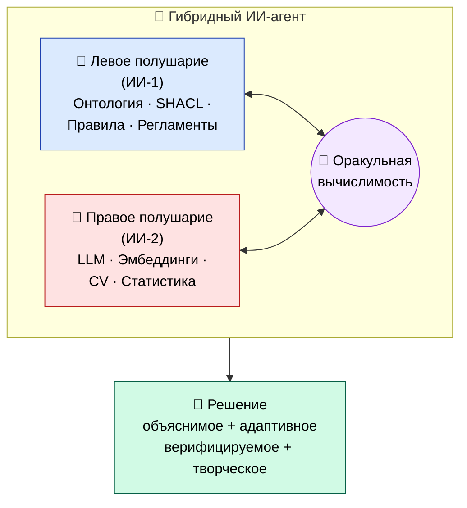

Результат — система, которая одновременно **мощна, объяснима, адаптивна и верифицируема**. То, что в индустрии теперь называют **нейросимволическим ИИ** (или гибридным ИИ), а в мировых публикациях — парадигматическим сдвигом, переопределяющим, что такое ИИ.

### Четыре столпа сильного ИИ — рамка российской стратегии

Министерство экономического развития РФ официально определило четыре компонента развития сильного ИИ. Эта рамка — не просто госплан, это **рабочий чек-лист** для системного аналитика, проектирующего ИИ-систему класса РАГРАФ или Σ Сигма. Если хоть один столп проседает — система не сильная.

| Столп | Что значит | Как реализовано в РАГРАФ |
|---|---|---|
| **1. Рассуждение (reasoning)** | Способность к логическому выводу с явным объяснением каждого шага | Rule DSL Flow — детерминированный исполнитель регламентов с PROV-O-трассой каждого срабатывания (см. Спринт 5) |
| **2. Непрерывное обучение (life-long learning)** | Адаптация к новым данным **без полного переобучения** | Методолог-человек правит регламенты в Flow Editor; SHACL валидирует; история версий хранится. Дорогостоящее дообучение LLM не требуется (см. Спринт 11) |
| **3. Гибридность (hybrid AI)** | Интеграция символьного ИИ и машинного обучения как **архитектурный принцип** | Backend РАГРАФ = ИИ-1 (детерминированный flow_executor), Студия аналитика = ИИ-2 (bge-m3 retrieval + LLM), Knowledge Studio = SPARQL по RDF-графу (см. Спринт 8) |
| **4. Вещественность (embodied AI)** | Взаимодействие с физическим миром через сенсоры и исполнительные механизмы | Sensor Library РАГРАФ — мост к реальным IoT-датчикам; output-узлы запускают физические действия через адаптеры СУП (см. Спринт 9) |

Эти четыре столпа не конкурируют — они **усиливают** друг друга. Без рассуждения нет объяснимости. Без непрерывного обучения система устаревает за полгода. Без гибридности либо беспомощна, либо непроверяема. Без вещественности — не дотягивается до реальности.

### Ключевая идея этого курса: дообучение через опыт человека = путь к сильному ИИ

Если выделить **одну мысль**, ради которой написана эта книга — она вот.

Сильный ИИ нельзя построить дообучением LLM на терабайтах текста из Reddit. Это путь к более умному попугаю, не к интеллекту. Сильный ИИ строится **в связке с человеком-экспертом**, который непрерывно дообучает систему через свой реальный опыт работы. Не разметку данных, не feedback-кнопки «👍/👎» — а **полноценное право вмешиваться в логику** системы, исправлять её регламенты, добавлять новые правила, отзывать ошибочные.

**Именно эту схему реализует связка РАГРАФ + LEYKA + методолог-аналитик:**

1. **Методолог-человек** наблюдает работу регламентов на боевых данных и видит, где система ошибается.
2. **Через Flow Editor** он правит конкретный регламент — добавляет новое условие, меняет порог, разворачивает дополнительную ветку switch.
3. **PROV-O-трасса** сохраняет историю: какое правило кто и когда поменял, на основании какого инцидента.
4. **LLM-слой** (Студия аналитика) использует обновлённую базу как контекст — для семантического поиска, для подсказок аналитику, для подготовки ответов на естественном языке.
5. **При срабатывании** регламента результат проверяется логикой (`acceptance_resolver`), и обратная связь возвращается методологу — был ли исход правильным.
6. **Цикл повторяется**. Система становится умнее **не за счёт перетренировки нейросети**, а за счёт того, что человек-эксперт **встроил свой опыт прямо в её логику**, и этот опыт виден и проверяем.

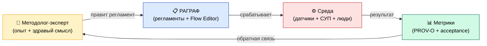

Это и есть **гибридный ИИ с дообучением через опыт человека** — путь, по которому российская научная школа предложила идти ещё до того, как мир заговорил о нейросимволическом ИИ. Подробнее теоретические основы — в работе [«Гибридный ИИ для России: от двух парадигм к единому интеллекту»](https://www.economy.gov.ru/material/departments/d01/razvitie_iskusstvennogo_intellekta/) и в [GLOSSARY.md Часть XVI](GLOSSARY.md) («Семантический ИИ — технологический фундамент»).

### Что это значит для тебя как системного аналитика

Ты входишь в эпоху, когда **проектирование гибридной системы — это уже не R&D, а основная инженерная задача**. Бизнес и государство одинаково остро требуют систем, которые:

- **мощны** — могут работать на неструктурированных данных, как LLM;
- **объяснимы** — каждое решение трассируется до пункта норматива, как у экспертной системы;
- **адаптивны** — обновляются через опыт эксперта без переобучения;
- **верифицируемы** — соответствуют ГОСТам, 152-ФЗ, отраслевым регламентам.

Эти четыре свойства невозможно получить, если ты умеешь только «прикручивать LLM через API» или только «писать SHACL-shapes от руки». Их можно получить только если ты **проектируешь систему как двухполушарного гибридного агента** и понимаешь, **где провести границу** между логикой и нейросетью, **как они обмениваются** информацией, **как человек дообучает** систему через регламенты, и **как PROV-O гарантирует объяснимость** каждого шага.

Именно этому посвящены 12 спринтов этой книги. К концу ты сможешь не только проектировать систему класса РАГРАФ, но и **обосновать архитектурное решение** перед заказчиком, регулятором, инвестором или научной комиссией. И, что не менее важно, ты сможешь объяснить **зачем** твой подход даёт стабильное преимущество перед «голым ChatGPT» — на языке, понятном и инженеру, и юристу, и врачу, и министру.

> 💡 **Дополнительное чтение перед началом курса.** Если хочешь до старта Спринта 1 понять контекст полнее — прочитай работу «Гибридный ИИ для России» (примерно 1.5 часа). Особенно главы про оракульную вычислимость Ершова-Гончарова, 4-уровневую онтологическую модель Пальчунова и фреймворк Σ Сигма как практическую реализацию гибридного подхода. Это даст тебе **общий язык** для общения с архитекторами уровня enterprise, которых ты встретишь после этого курса.

---

## Где ты в траектории обучения

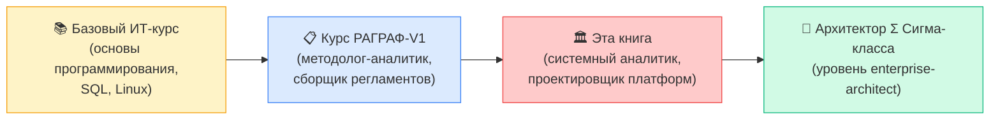

Эта книга — **третья ступень** твоего пути. После неё открываются роли уровня «architecture lead» и «head of analytics» в крупных IT-командах и проектах класса «городская платформа».

---

## Сквозной кейс книги

Каждая книга по системному анализу нуждается в сквозном примере, на котором отрабатываются все концепции. У нас он такой:

> **«Ты — выпускник РАГРАФ-курса. В понедельник тебя зовут в мэрию города Х (200 000 жителей, бюджет 18 млн ₽, нулевая команда). Задача — построить систему класса РАГРАФ для управления городскими сервисами: ЖКХ-аварии, обращения граждан, контроль СНиП на стройках, координация ЕДДС. Что ты делаешь?»**

Этот кейс мы будем «раскручивать» во всех 12 спринтах. К концу книги у тебя будет готовый набор артефактов: спецификация требований, ER-модель, BPMN-процессы, прототип UI, архитектура C4, API-контракт, тест-план, ПМИИ, документация по ГОСТ. Этого достаточно, чтобы реально начать такой проект на следующей неделе.

Параллельно — пять отдельных учебных проектов в спринтах 2 / 4 / 7 / 9, и **дипломный** в самом конце. Кейсы разные: языковая школа, онлайн-магазин, сеть клиник, стриминговый сервис, школьная столовая. Это сделано специально — чтобы ты привык смотреть на любую предметную область одинаковыми инструментами.

---

## Как читать эту книгу

### 1. По одному спринту в 2 недели

Книга рассчитана на **≈ 9 месяцев самостоятельного обучения**. Один спринт — 2 недели по 10–20 часов. Не пытайся прочитать всё за выходные: ты прочитаешь буквы, но не освоишь компетенции. Системный анализ — это **навык**, который вырабатывается практикой, а не объёмом прочитанного.

### 2. Каждый спринт по канве

В книге всё построено по единому шаблону (он же шаблон [docs/GLOSSARY.md](GLOSSARY.md), которая у тебя уже под рукой):

| Раздел | Что внутри |
|---|---|
| **Главное за минуту** | Суть темы в 5 предложениях с метафорой. Если торопишься — прочитай только это, и уже будешь в курсе |
| **О чём эта часть** | Зачем эта тема нужна **именно тебе** как системному аналитику |
| **Ключевые термины** | Определения с примерами из РАГРАФ/LEYKA. Запоминать наизусть не надо — главное понимать связи |
| **Контекст в РАГРАФ** | Где конкретно эта концепция применяется в нашей платформе. Открой проект параллельно и убедись своими глазами |
| **Сценарий / кейс / диаграмма** | Живой пример, обычно с Mermaid-диаграммой |
| **Практика 5–15 минут** | Конкретная задача, которую можно сделать за один присест |

### 3. С открытым редактором

Эта книга **бесполезна без рук**. Каждую сложную тему открывай в VS Code / Cursor / PyCharm и проверяй на реальных файлах РАГРАФ. Хочешь понять Turtle? Открой `backend/data/fixtures/*.data.ttl`. Хочешь понять Rule DSL? Открой `backend/data/fixtures/*.flow.json` и параллельно `frontend/src/components/flow/FlowEditorScreen.tsx`. Это не задача «прочитать букву» — это задача «увидеть, как буквы работают».

### 4. С блокнотом для конспекта

Заведи Obsidian / Notion / простой Markdown-блокнот и пиши **свои** заметки по каждому спринту. Через два года ты вернёшься в этот блокнот, а не в эту книгу.

### 5. С сообществом

Если у тебя есть однокурсники из РАГРАФ-V1 — проходите эту книгу **вместе**. Один спринт в две недели, потом часовой созвон, обсуждаете трудные места и задачи. Самостоятельное обучение даёт 30% эффекта, обучение в паре — 60%, в группе 4–6 человек — 90%.

---

## Полное оглавление

### Вводный модуль

«Зачем выпускник РАГРАФ-курса идёт в системные аналитики. Карьерная траектория. Сквозной кейс книги: РАГРАФ для мэрии города Х».

### Спринт 1: Понимание роли системного аналитика *(2 недели, ≈ 20 ч)*

Структура команды разработки платформы. Жизненный цикл ПО: Waterfall / Agile / DevOps. Клиент-серверная vs микросервисная архитектура. Типы ПО. Таблица «системный vs бизнес-аналитик vs методолог РАГРАФ».

### Спринт 2: Разработка требований *(2 недели, ≈ 20 ч + проект ≈ 7 ч)*

Уровни требований: бизнес → пользовательские → функциональные → нефункциональные. Анализ стейкхолдеров. UML Use Case. Use Case по Алистеру Коберну. Чек-лист качества требований. Трассировка требований. **Проект 1**: требования к мини-РАГРАФ для школьной столовой.

### Спринт 3: SQL и DuckDB для аналитиков *(2 недели, ≈ 50 ч)*

Базы данных и почему DuckDB. SQL-основы (SELECT / WHERE / JOIN / GROUP BY) на схеме РАГРАФ. Подзапросы, CTE, оконные функции. DuckDB-specific фичи (read_parquet, PIVOT). Бонус: SPARQL над Turtle. 10 SQL-задач с возрастающей сложностью.

### Спринт 4: Моделирование данных *(2 недели, ≈ 22 ч + проект ≈ 18 ч)*

Концептуальная / логическая / физическая модель. ER-диаграммы (Crow's Foot, Peter Chen). Нормализация. Словарь данных. UML Class и Object Diagram. Семантический слой как ещё один вид модели (Turtle / RDF / SHACL / OWL). **Проект 2**: модель данных для записи в стоматологию.

### Спринт 5: Моделирование процессов *(2 недели, ≈ 20 ч)*

BPMN, UML Activity, UML State Machine, DFD (Гейн-Сарсон). Главная тема: **Rule DSL Flow как наш фирменный инструмент**. Когда Rule DSL выигрывает у BPMN, а когда нет.

### Спринт 6: Пользовательские интерфейсы *(2 недели, ≈ 20 ч)*

Персоны. Use Scenario. User Journey Map. Информационная архитектура. Wireframes / mockups. Figma / Excalidraw. UX для cockpit-систем. HTML / CSS / JS-минимум для разговора с фронтенд-разработчиком.

### Спринт 7: Agile-практики *(2 недели, ≈ 20 ч + проект ≈ 15 ч)*

User Story / Job Story. INVEST / DEEP. Acceptance Criteria в Gherkin. SPIDR. User Story Map по Jeff Patton. MVP. Story Points, Planning Poker. **Проект 3**: Agile-набор для приложения сети клиник «Вита» (бэклог, US, US Map, MVP, прототип).

### Спринт 8: Архитектура системы *(2 недели, ≈ 20 ч)*

Стили: монолит / многослойная / клиент-серверная / SOA / микросервисы / serverless / event-driven. Масштабный куб (X / Y / Z axes). UML Component и Deployment Diagram. **Спецтема**: архитектура РАГРАФ от и до по 5 слоям. ADR.

### Спринт 9: Программные интерфейсы (API) *(2 недели, ≈ 20 ч + проект ≈ 15 ч)*

HTTP / TCP / IP / WebSocket. JSON / XML / YAML / Turtle. REST детально. GraphQL / gRPC / WebSocket / SSE / Webhooks. Sync vs async. UML Sequence Diagram. Postman. OpenAPI / Swagger. **Проект 4**: API для системы букинга коворкинга (5–10 endpoints + Postman + Swagger).

### Спринт 10: Реализация системы *(2 недели, ≈ 20 ч)*

CI/CD на примере РАГРАФ. DevOps как культура. Языки программирования «на уровне чтения». Парадигмы. IDE. Git-минимум для аналитика. Пирамида тестирования (unit / integration / e2e / UAT). Test Plan и Test Case.

### Спринт 11: Поддержка, обслуживание и оценка *(2 недели, ≈ 20 ч)*

Документация по ГОСТ 19 и ГОСТ 34. ПМИИ. План миграции (big bang / parallel run / phased). Обучение пользователей. Уровни поддержки L1/L2/L3 (на примере LEYKA). Change Request. KPI / метрики РАГРАФ. Documentation as code + ADR + CHANGELOG.

### Спринт 12: Расширенная архитектура и API *(4 недели, ≈ 40 ч)*

Шаблоны микросервисной архитектуры (API Gateway / Service Mesh / Circuit Breaker / Saga / Event Sourcing / CQRS). Событийно-ориентированная архитектура (Kafka / RabbitMQ / NATS). **Нотация C4** уровня Context / Container / Component / Code для РАГРАФ. **Domain-Driven Design**: Bounded Contexts, Ubiquitous Language, Aggregates. Стили API углублённо: GraphQL, AsyncAPI, HATEOAS. OpenAPI 3.1 YAML с нуля.

### Дипломный проект *(4 недели, ≈ 30 ч)*

Самостоятельная работа от и до. 5 доменов на выбор (школьная столовая / коворкинг / автомойка / клиника / автошкола). Полный цикл: требования → данные → процессы → UI → архитектура → API → тесты → документация → защита.

### Послесловие: куда дальше?

Карьерные траектории. Сертификации (ИКАН / IIBA / PSPO / TOGAF). Книжная полка. Конференции. Сообщества. Финальное слово.

---

## Карта компетенций после прохождения

| Компетенция | Уровень после РАГРАФ-V1 | Уровень после этой книги |
|---|---|---|
| Сбор требований | Базовый (по шаблону) | **Продвинутый** (стейкхолдеры, Use Case по Коберну, спецификация) |
| Моделирование данных | Базовый (Parameter в РАГРАФ) | **Продвинутый** (ER, нормализация, словарь, семантика W3C) |
| Моделирование процессов | Базовый (Rule DSL Flow) | **Продвинутый** (BPMN, UML Activity, State Machine, DFD, Rule DSL углублённо) |
| UI-проектирование | Нет | **Базовый** (персоны, wireframes, требования к UI) |
| Agile-практики | Базовый (LEYKA-задачи) | **Продвинутый** (User Stories, INVEST, US Map, MVP) |
| Архитектура | Нет | **Базовый-продвинутый** (стили, C4, ADR) |
| API-проектирование | Базовый (использование REST) | **Продвинутый** (REST + GraphQL + AsyncAPI + Swagger) |
| Тестирование | Нет | **Базовый** (пирамида, Test Plan, Test Case) |
| Документация по ГОСТ | Нет | **Базовый** (ГОСТ 19 / 34, ПМИИ) |
| Системный взгляд | Базовый | **Продвинутый** (умеешь видеть платформу целиком) |

---

## Инструментальный набор курса

Что должно быть установлено на рабочем месте к моменту прохождения. Установка одной командой через инсталлер РАГРАФ (`installer/start-ragraf.command` или `.bat`) почти всё закроет; остальное доустанавливается по ходу.

| Категория | Инструмент | Зачем нужен |
|---|---|---|
| Редактор кода | VS Code / Cursor / PyCharm Community | Чтение кода, правка YAML/Turtle, написание заметок |
| Git-клиент | `git` (CLI) или GitHub Desktop | Работа с репозиторием РАГРАФ + своими ветками |
| Диаграммы | Mermaid (плагин для VS Code) + diagrams.net (drawio) + Excalidraw | Mermaid для git-friendly диаграмм, drawio для сложных, Excalidraw для скетчей |
| Прототипы UI | Figma (бесплатный аккаунт) | Wireframes и mockups в проекте 6 |
| API-клиент | Postman / Insomnia / Bruno | Тестирование API РАГРАФ и LEYKA |
| Терминал | Встроенный в OS + zsh / fish | Запуск тестов, миграций, скриптов |
| Python | 3.12+ (через инсталлер) | Чтение backend РАГРАФ |
| Node + npm | LTS (через инсталлер) | Чтение и сборка frontend РАГРАФ |
| DuckDB CLI | `brew install duckdb` или скачать с duckdb.org | Прямой запуск SQL по локальной БД РАГРАФ |
| Браузер | Chrome / Firefox / Safari + DevTools | Отладка фронта, анализ API-запросов |

Всё бесплатное, всё open-source. Никаких лицензий покупать не надо.

---

## Условные обозначения в тексте

- **Жирным** — ключевые термины и понятия
- *Курсивом* — названия книг, источников, цитаты
- `моноширинным` — имена файлов, команды, фрагменты кода
- Блоки кода с указанием языка (`python`, `sql`, `yaml`) — готовы к запуску в твоём окружении
- `mermaid`-блоки — диаграммы, рендерятся на GitHub и в VS Code (с плагином)
- 💡 — практическое замечание или совет от наставников
- ⚠ — типичная ошибка / антипаттерн / «грабли»
- 🎯 — главный takeaway раздела
- 📋 — чек-лист

---

## Благодарности

Эта книга — коллективная работа команды РАГРАФ и ЦИИ НГУ. Отдельная благодарность нашим выпускникам первого потока курса РАГРАФ-V1 за вопросы, на которые отвечает эта книга, — без них она была бы абстрактной.

Если найдёшь в тексте ошибку, неточность или место, которое можно сделать лучше, — открой issue или Pull Request в [репозитории РАГРАФ](https://github.com/Barbashin1970/RAGRAF). Книга живёт версиями, и твой вклад сделает следующую версию ещё лучше.

---

*Поехали к Вводному модулю.*

---

## Блок A. Вход в системный анализ

> **Блок A — это вход.** Вводный модуль + первые три спринта (1, 2, 3). Они переводят выпускника курса РАГРАФ-V1 из режима «методолог, рисующий регламенты в готовой платформе» в режим «системный аналитик, проектирующий саму платформу». Дальше будут блоки B (спринты 4–6), C (спринты 7–9) и D (спринты 10–12 + дипломный проект). Этот блок отвечает за то, чтобы ученик понял, куда он попал, и закрыл фундаментальные пробелы: команда разработки, требования, SQL/DuckDB. Без этого никакой архитектуры платформ дальше не получится.

---

## Вводный модуль. Зачем выпускнику РАГРАФ-курса лезть в системный анализ

### Главное за минуту

Помнишь, как в курсе РАГРАФ-V1 ты собирал регламент для своей серверной/стройки/ЕДДС и нажимал «сохранить»? За этой кнопкой стоит около 40 эндпоинтов FastAPI, две базы DuckDB, фоновый scheduler, Flow Editor на React, SHACL-валидатор, PROV-O-трасса и pull-поллер LEYKA. Всё это кто-то спроектировал. Если ты хочешь, чтобы такая платформа появилась у тебя в мэрии, в стройтресте, в кампусе университета или в собственном стартапе — этим «кем-то» придётся стать тебе. Курс, который ты сейчас читаешь, превращает методолога в человека, который **может разговаривать с разработчиками как с равными**, проектировать систему «с чистого листа» и понимать архитектурные решения уровня Σ Сигмы (это городская версия РАГРАФ на Apache Jena + PostgreSQL, см. [GLOSSARY часть XIII](../docs/GLOSSARY.md)). Это второй курс, не альтернатива первому: первый давал тебе РАГРАФ как инструмент, второй — даёт тебе инструмент для построения РАГРАФ.

### О чём этот вводный модуль

Перед тем как открыть первый спринт, разберёмся с тремя вопросами, которые звучат у каждого второго выпускника РАГРАФ-V1:

1. **«Я же не программист, зачем мне системный анализ?»** — затем, что между «нарисовал регламент» и «он работает в боевой мэрии» лежит уйма работы, и эту работу почти всегда делает не разработчик. Её делает аналитик, и если этого аналитика нет — платформа не запускается. Не «не оптимально работает», а буквально не запускается.
2. **«Я уже методолог-аналитик, зачем мне ещё одна аналитика?»** — потому что методолог собирает регламенты внутри готовой платформы, а системный аналитик проектирует **саму платформу**. Это разные задачи. Грубо говоря, методолог пишет рецепт в кулинарной книге, а системный аналитик проектирует кухню, в которой эти рецепты будут готовиться. Кухня без рецептов — пустая комната, но и рецепты без кухни — просто литература.
3. **«А что у меня будет на выходе?»** — диплом и собственный мини-РАГРАФ, спроектированный с нуля под твою предметную область (парковки/школьное питание/коворкинг/что угодно). С документами, диаграммами, требованиями, SQL-схемой, API-контрактом. Не учебной демо-, а такой, по которой можно нанять команду и она реально соберёт.

### Чем системный аналитик отличается от методолога РАГРАФ

| Что делает | Методолог РАГРАФ (V1) | Системный аналитик (V2) |
|---|---|---|
| Кому продаёт результат | Руководителю ЕДДС, главному инженеру | Product Owner, тимлид, технический директор |
| Главный артефакт | Регламент (Turtle + SHACL + flow.json) | ТЗ, диаграммы (UML/Mermaid/C4), API-контракт |
| Где живёт его работа | Внутри РАГРАФ как контент | На GitHub/в трекере как описание платформы |
| Какие документы нужны до его работы | СНиП/СанПиН/приказ | Бизнес-цель, бюджет, состав команды |
| С кем спорит | С нормотворцами и предметниками | С разработчиками и архитекторами |
| Что должен уметь | Декомпозировать норматив на параметры | Декомпозировать систему на модули |
| Сколько кода читает | 0 строк (но Turtle — это, считай, код) | Много чужого, чтобы понять как работает |
| Сколько кода пишет | 0 строк | Иногда SQL для проверки гипотез, прототипы на Python |

Грубая аналогия. Методолог — это шеф-повар, который пишет меню в существующем ресторане. Системный аналитик — это человек, которого зовут «давай откроем новый ресторан, помоги спроектировать кухню, барную стойку, морозильники, систему заказов». Шеф-повар будет работать в этом ресторане потом — но кухня без проектировщика не появится.

### Карьерная траектория

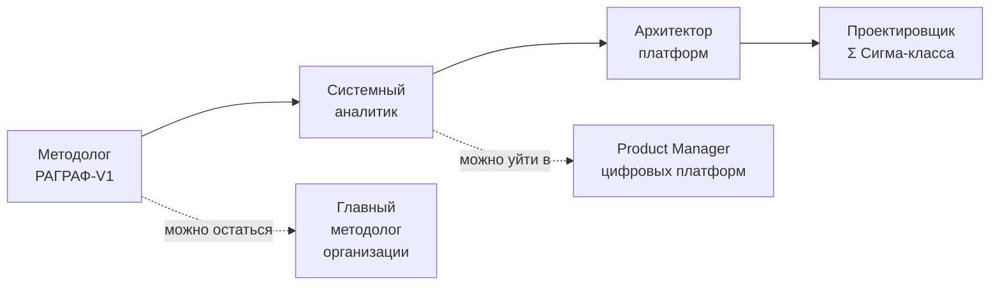

Каждый переход — это плюс примерно 30–60% к зарплате и плюс одна шкура ответственности. Никто не заставляет идти до конца. Но даже если ты остановишься на «системный аналитик» — ты будешь востребован в любой госмуниципальной цифровизации России на ближайшие 10 лет, потому что таких людей сейчас нет, а заказчики уже есть.

### Сквозной кейс книги: мэрия города Х

С этого момента и до диплома мы будем работать с одним сквозным сценарием. Знакомься.

> **Понедельник, 9:00.** Тебе звонит зам. мэра города Х (200 тыс. жителей, областной центр среднего размера). Говорит: «Я был на конференции в Новосибирске, видел РАГРАФ, видел Σ Сигму. Хочу такое же у себя. У меня есть бюджет 18 млн на первый этап, есть кабинет в мэрии, есть желание начать с парковок и шума у школ. Команды разработки нет. Программистов на районе тоже нет — все уехали в Москву. Есть бывший айтишник из ИТ-отдела мэрии, два студента-практиканта и я в роли спонсора. С чего начнём?»

Что ты делаешь дальше — это и есть содержание курса. Спринт 1 — собираешь команду и понимаешь, что такое жизненный цикл ПО. Спринт 2 — пишешь требования (без них зам. мэра через месяц передумает, потому что не сможет вспомнить, чего хотел). Спринт 3 — учишься работать с данными (DuckDB и SQL), потому что без них первый же датчик трафика сделает тебе больно. Дальше — UML/BPMN, REST API, безопасность, тестирование, DevOps. К диплому у тебя будет проект «РАГРАФ-для-города-Х» в полном виде.

### Мини-практика (5 минут)

Прежде чем читать дальше — открой любимый текстовый редактор и напиши **полстраницы** ответа на один вопрос: «Если бы мне сейчас принесли 18 млн и сказали “сделай РАГРАФ для своей организации” — что я знаю, а чего не знаю?». Это твой стартовый замер. В конце курса откроешь его и удивишься.

---

## Спринт 1: Понимание роли системного аналитика

> **Сколько займёт:** ~20 часов (3 рабочих дня + один на пересмотр).
> **Артефакт:** организационная схема команды для своего проекта «РАГРАФ-для-Х» + двухстраничная заметка «кого я могу нанять, кого нет, чем буду закрывать дыры».

### Главное за минуту

Системный аналитик — это переводчик и сшиватель. Он сидит ровно посередине между бизнесом (мэр/директор/PO) и разработкой (бэк/фронт/DevOps), и его работа — следить, чтобы первые не говорили «сделайте красиво и быстро», а вторые не отвечали «у нас всё работает, посмотрите Postman». В РАГРАФ исторически роль аналитика, разработчика и архитектора играл один человек (Олег Барбашин, см. блок «Кто делал РАГРАФ» в [REPORT-PROJECT.md](../docs/REPORT-PROJECT.md)) — это редкое исключение. В мэрии города Х так не получится: даже если у тебя одна голова, тебе всё равно придётся **формализовать роли**, иначе люди будут делать чужую работу плохо и не делать свою.

### О чём этот спринт

Цель — за 20 часов разобраться:
- как устроена команда, которая собирает платформу класса РАГРАФ,
- какие у каждого роли обязанности и зоны ответственности,
- по какому жизненному циклу ходит ПО (и почему РАГРАФ делается итерациями, а не «большим взрывом»),
- какие бывают архитектуры (монолит vs микросервисы), и какую ты выберешь для проекта города Х.

### Структура команды разработки платформы класса РАГРАФ

Минимальный состав — 5 ролей. Это **роли**, а не количество людей: в РАГРАФ-V1 одна голова закрывала все пять. В мэрии города Х (бюджет 18 млн, наука нулевая) реалистично 3–4 человека, где кто-то будет совмещать.

| Роль | Что делает | Главный артефакт | На РАГРАФ кто это | В городе Х кого нанимаешь |
|---|---|---|---|---|
| **PO (Product Owner)** | Приоритезирует фичи, держит вижн, общается с заказчиком | Backlog (см. [BACKLOG.md](../docs/BACKLOG.md)) | Олег + зам.мэра по цифре | Сам зам.мэра, надо его «обучить» |
| **Системный аналитик** | Пишет требования, рисует диаграммы, ловит противоречия | ТЗ, Use Case, API-контракт | Олег (отдельной шапкой) | Это ты |
| **Бэкенд-разработчик** | Пишет API, бизнес-логику, миграции | Код на Python/FastAPI + тесты | Олег | Один ведущий специалист (senior) с рынка + студент-стажёр |
| **Фронтенд-разработчик** | Пишет UI, формы, диаграммы | Код на TypeScript/React + e2e тесты | Олег | Один специалист (middle) + студент-практикант |
| **DevOps / SRE** | Деплой, мониторинг, безопасность, бэкапы | CI/CD pipeline, конфиги Railway/Fly | Олег + Railway + Fly | Совмещает бэкенд-разраб |

Можно ещё добавить:
- **UX/UI-дизайнер** — на ранней стадии не нужен, можно копировать паттерны из РАГРАФ (а у тех они скопированы из shadcn). Когда дойдёшь до публичного дашборда мэра — наймёшь на 2 недели.
- **Тестировщик (QA)** — на старте не нанимаешь, тесты пишут сами разработчики и аналитик. Когда система выйдет на 10+ боевых пользователей — нанимаешь.
- **Технический писатель** — никогда не нанимай первым, документация пишется по ходу. Когда документации станет много и она начнёт разъезжаться — да, тогда нужен.

### Реальный кейс: как собирался РАГРАФ

РАГРАФ — это, по сути, **однокомандный проект с одним человеком**. Стек определялся не комитетом, а одним человеком, исходя из того, что он умеет (Python, React, TypeScript). DuckDB выбран потому, что embedded и не требует отдельного сервера. SHACL/Turtle взяты не потому, что «модно», а потому что задача (объяснимость) требовала формальной семантики. UI копировался с shadcn, потому что времени на дизайн не было.

Это **антипаттерн для команды из 4+ человек**, но идеальный паттерн для одного. Если у тебя в городе Х команда из 4 — тебе придётся фиксировать решения письменно, иначе через месяц бэкенд и фронтенд будут спорить о форматах JSON.

### Жизненный цикл ПО: Waterfall vs Agile vs DevOps

Три большие парадигмы. Объясню на метафоре стройки:

| Парадигма | Метафора | Когда работает | Когда ломается |
|---|---|---|---|
| **Waterfall (каскад)** | Стройка по проекту. Полгода рисуем, год строим, неделю сдаём | Если требования НЕ меняются (космос, оборонка, мосты) | Если заказчик через 3 месяца говорит «хочу не дом, а дачу» — всё, проект сгорел |
| **Agile (гибкая разработка)** | Сборка лего по урокам. Поставил пять деталей, посмотрел, поставил ещё пять | Если требования меняются часто (госмуниципальный заказ, стартапы) | Если у тебя бюджет на 5 лет фиксирован — Agile в плановой бюрократии не приживётся |
| **DevOps** | Это не методология, а **культура**. Разработка и эксплуатация не отдельные команды, а одна. Деплой каждый день | Если у тебя SaaS-продукт и сотни клиентов | Если у тебя локальный enterprise-инстанс — DevOps вырождается в просто «у нас есть CI» |

**РАГРАФ — это Agile + лёгкий DevOps.** Доказательство — посмотри git log: коммиты идут пачками по 5–15 в день, каждый — отдельная микро-фича, версия обновляется на проде через `git push` + автодеплой на Railway. Это не Waterfall (нет полугодового ТЗ, регламенты добавляются по мере появления нужды). Не классический DevOps (нет отдельной SRE-команды, нет SLA-метрик в Prometheus — есть только healthcheck на main page).

Для города Х на старте я бы рекомендовал **классический Scrum-Agile с двухнедельными спринтами**, потому что:
- Заказчик (зам.мэра) не будет читать длинные ТЗ. Ему нужно показывать «вот посмотри, мы за 2 недели сделали приём заявок на парковку».
- Команда маленькая. Двухнедельный спринт даёт ритм без бюрократии.
- Бюджет 18 млн ≈ 6 месяцев работы команды из 4 человек = ~12 спринтов. Это удобно планировать.

### Клиент-серверная архитектура vs микросервисная

Кратко, что эти слова значат:

**Клиент-серверная архитектура** — это когда у тебя есть один **сервер** (программа, которая отвечает на запросы) и много **клиентов** (программ, которые задают вопросы). Сервер — обычно один процесс или один кластер. Все идут к нему. Это **монолит**.

**Микросервисная архитектура** — это когда твой сервер развалился на 10 маленьких сервисов. Каждый отвечает за свою часть: один за пользователей, другой за регламенты, третий за уведомления. Они общаются между собой по HTTP/gRPC/очередь. Это даёт независимый деплой, разные команды на каждый сервис, разные базы. Но цена — сложность.

| Параметр | Монолит (как РАГРАФ) | Микросервисы (как Σ Сигма) |
|---|---|---|
| Сложность кодовой базы | Низкая (всё в одном репо) | Высокая (10+ репозиториев, нужен оркестратор) |
| Сложность деплоя | Очень низкая (один docker-compose) | Очень высокая (нужны Kubernetes/Nomad) |
| Сложность отладки | Низкая (один процесс, одна логфайл) | Высокая (нужны distributed tracing, Jaeger) |
| Когда оправдана | До 50k запросов/мин, до 5 разработчиков | От 100k запросов/мин, от 15 разработчиков |
| Стоимость инфраструктуры | $50/мес (один сервер) | $5000/мес (кластер + ELK + Jaeger + Grafana) |
| Время до первой фичи в продакшен | 2 недели | 3 месяца |

**Для города Х — однозначно монолит**, как РАГРАФ. У тебя нет 15 разработчиков, у тебя нет 100k запросов/мин (у города 200к жителей даже если все одновременно подадут заявку, это будет 200к за день, ≈ 2 запроса в секунду). Микросервисы будут техническим долгом, а не активом.

Σ Сигма ушла в микросервисы, потому что её масштаб — городская агломерация на 2+ млн жителей, тысячи датчиков, несколько отдельных команд разработки. Для тебя это **горизонт через 3–4 года**. На старте — монолит.

### Типы ПО

Маленький словарь, чтобы не путаться:

- **Web-приложение** — открывается в браузере. РАГРАФ — это оно. Преимущество: ничего не надо ставить, обновляется само. Недостаток: нужен интернет.
- **Desktop-приложение** — устанавливается на компьютер. Photoshop, Word. Для платформ типа РАГРАФ — обычно не нужно.
- **Mobile-приложение** — нативное под iOS/Android. Для административных систем редко окупается, обычно делают адаптивный веб.
- **Cloud (облачное)** — приложение, которое живёт на сервере в дата-центре провайдера (AWS, Yandex Cloud, Selectel). РАГРАФ — облачное (Railway).
- **Self-hosted (само-хостинг)** — приложение, которое ты ставишь на свой сервер (например, в серверной мэрии). РАГРАФ умеет и так, и так — это его киллер-фича для госзаказа.
- **SaaS (Software as a Service)** — модель оплаты «по подписке за пользование». РАГРАФ может быть и SaaS (если ЦИИ НГУ хостит экземпляр для всех муниципалитетов), и продаваться как лицензия.

**РАГРАФ = web + cloud + self-hosted.** Этот тройной режим почти универсален для гос-IT в России.

### Сравнительная таблица: системный аналитик vs бизнес-аналитик vs методолог РАГРАФ

Это самая часто задаваемая путаница. Закроем её сразу.

| Параметр | Бизнес-аналитик | Системный аналитик | Методолог РАГРАФ |
|---|---|---|---|
| Главный вопрос | «Какую бизнес-задачу решаем?» | «Как это устроено внутри?» | «Какой норматив автоматизируем?» |
| Главный артефакт | BRD (Business Requirements Document) | SRS (Software Requirements Specification), UML | Регламент в РАГРАФ (Turtle + flow.json) |
| Кому докладывает | Заказчику, бизнес-владельцу | PO, тимлиду | Главному инженеру / руководителю службы |
| Глубина IT-знаний | Минимальная (понимает что такое API на уровне «это интерфейс») | Средняя (читает код, пишет SQL, понимает HTTP, знает SHACL) | Низкая, но знает свою предметную область очень глубоко |
| Глубина предметных знаний | Высокая | Средняя | Очень высокая (СНиП, СанПиН, отраслевые регламенты) |
| Где встречается в РАГРАФ-V1 | Не встречается — это V2 | Курс, который ты читаешь | Курс РАГРАФ-V1 |
| Карьерный возраст | 2–7 лет в IT | 3–10 лет в IT | 5–25 лет в отрасли + 1 неделя курса |
| Зарплата (2026, Москва) | 150–250к | 200–350к | 90–180к (или его обычная зарплата + надбавка) |

Часто эти роли совмещаются. Например, в небольшой команде один человек может быть бизнес-аналитиком утром и системным аналитиком после обеда. В РАГРАФ Олег совмещал всё.

### Интерактивное задание: «Заказчик хочет систему типа РАГРАФ для управления парковками»

> Тебе позвонил директор муниципального предприятия «Горпарковки». Хочет систему, которая:
> 1. Получает данные с датчиков занятости парковочных мест (200 датчиков на 12 парковках).
> 2. Получает данные с камер ANPR (распознавание номеров) на въезде/выезде.
> 3. Принимает оплату через интеграцию с парковочным аппом города.
> 4. Уведомляет инспекторов о неоплатных парковщиках через корпоративный мессенджер.
> 5. Делает дашборд для мэра «занятость в реальном времени по картам».
> Бюджет: 8 млн на первый этап (6 месяцев).

**Твоя задача:** распиши команду. Какие роли нужны (сколько человек на каждую). Кого нанимать с рынка, кого можно совмещать. Где взять компетенцию ANPR (своими силами или брать готовое решение типа Войслинка, см. [GLOSSARY часть III](../docs/GLOSSARY.md))? Какой жизненный цикл — Waterfall или Agile? Монолит или микросервисы? Запиши на полстранички.

**Подсказка-ответ (не подглядывай до того, как напишешь свой):** в реальной жизни ответ выглядит так — 1 системный аналитик (ты), 1 бэкенд (Python+FastAPI как в РАГРАФ), 1 фронтенд (React, скопировать паттерны из РАГРАФ), 0.5 ставки DevOps (можно совмещать с бэкендом), 0 на ANPR (берёшь Войслинк, потому что 200 датчиков и 12 камер — слишком мало, чтобы окупить свою разработку детекции). Жизненный цикл — Agile с двухнедельными спринтами. Монолит, потому что 200 датчиков ≈ 50 событий в минуту, не нагрузка для распределённой системы. Бюджет 8 млн / 6 месяцев = 1.3 млн в месяц ≈ 4 ФОТ-ставки в Сибири или 2 ставки в Москве. Решение: брать сибирскую команду удалённо.

### Мини-практика

Открой кейс мэрии города Х. Распиши организационную схему той команды, которая будет собирать РАГРАФ для города. Используй таблицу выше как шаблон. Для каждой роли укажи: ФИО (или «вакансия»), грейд (стажёр / специалист / ведущий специалист / архитектор — на западе говорят junior/middle/senior/architect), на полный рабочий день или совмещение, источник (нанимаем с рынка / уже есть в штате / аутсорс/подрядчик).

Финальный артефакт спринта 1 — эта таблица плюс заметка на 2 страницы «Что я понял про команду и что меня пугает». Сдаётся в LEYKA как первая дипломная веха.

> В следующем спринте мы перейдём к **разработке требований** — это даст тебе возможность превратить «хочу как у соседей» в формальный, трассируемый список того, что должна делать система.

---

## Спринт 2: Разработка требований

> **Сколько займёт:** ~27 часов (3 рабочих дня на лекции/практику + дополнительные 7 часов на Проект 1).
> **Артефакт:** документ требований к мини-РАГРАФ для контроля столовой школы (Use Case + спецификация + Mermaid-диаграмма).

### Главное за минуту

Если не зафиксировать требования письменно — через два месяца все будут спорить, что именно заказывал зам.мэра в понедельник. Через четыре — выяснится, что половину «обязательных» фич никто не помнит, а половину «забытых» теперь экстренно надо. Требования — это не бюрократия, это **страховка** от того, что ты потратишь 18 млн впустую. В курсе РАГРАФ-V1 ты работал с уже формализованными нормативами (СанПиН, СНиП) — это, по сути, готовые требования к регламенту. Системный аналитик делает обратную операцию: из устных «хочу как у соседей» извлекает формальный, проверяемый, трассируемый список требований. После этого спринта ты сможешь написать ТЗ на мини-РАГРАФ так, чтобы любой бэкенд-разработчик через неделю показал работающий прототип.

### О чём этот спринт

Будем разбирать четыре уровня требований, учиться писать Use Case (UML и Коберна), познакомимся с трассировкой через PROV-O (помнишь, в РАГРАФ-V1 это была вкладка «Трасса» в редакторе регламента?), и в конце соберём первый дипломный проект.

### Уровни требований

В системном анализе принято разделять требования на четыре уровня. Это **матрёшка**: верхний уровень определяет нижний.

| Уровень | Кто формулирует | Что отвечает | Пример из РАГРАФ |
|---|---|---|---|
| **Бизнес-требования** | Заказчик (зам.мэра) | Зачем нам эта система? | «Сократить время реакции на превышение шума у школы с 4 часов до 15 минут» |
| **Пользовательские требования** | Будущий пользователь системы (методолог ЕДДС) | Что я хочу делать в системе? | «Загрузить СанПиН по шуму, сконвертировать в регламент за 30 минут, протестировать на исторических данных» |
| **Функциональные требования** | Системный аналитик | Что конкретно должна делать система? | «Система должна позволять загружать PDF до 50 МБ, извлекать оттуда параметры (имя, мин/макс), создавать Turtle-файл с PROV-O ссылкой на пункт документа» |
| **Нефункциональные требования** | Системный аналитик + DevOps | Какими свойствами должна обладать система? | «Время загрузки страницы редактора регламента не более 2 сек, доступность системы 99.5% в рабочие часы, поддержка одновременно до 50 пользователей» |

Сравним с тем, как это устроено в РАГРАФ:
- **Бизнес-требование РАГРАФ:** «Сократить разрыв между нормативом и задачей в трекере». Сформулировано в [TZ_RAGRAF.md](../docs/TZ_RAGRAF.md).
- **Пользовательское требование:** «Методолог должен уметь форкать tutorial-01 и подменять параметры на свои за 15 минут». Закрыто в Модуле 3 курса РАГРАФ-V1.
- **Функциональное:** «Flow Editor должен поддерживать 8 типов узлов: input, threshold, compare, formula, switch, output, sensor, shacl_constraint». См. [ARCHITECTURE.md §5.2](../docs/ARCHITECTURE.md).
- **Нефункциональное:** «Время реакции UI на сохранение регламента не более 500 мс, объяснимость через PROV-O обязательна для каждого срабатывания».

**Самая частая ошибка** — путать пользовательские и функциональные. «Я хочу увидеть отчёт» — пользовательское. «Система должна выгружать CSV в кодировке UTF-8 с разделителем ;» — функциональное. Первое отвечает на «что хочу я», второе на «что делает система».

### Анализ стейкхолдеров

**Стейкхолдер** (от англ. *stakeholder*, дословно «держатель доли») — все, у кого есть интерес в системе. Не только заказчик, не только пользователь. Иначе пропустишь важные требования.

Карта стейкхолдеров для проекта города Х:

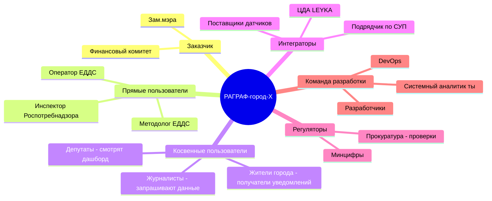

Каждый стейкхолдер даёт **свой набор требований**. Зам.мэра хочет дашборд. Методолог хочет редактор. Инспектор хочет аудит-лог с PROV-O. Журналист хочет API для своих расследований. Прокурор хочет, чтобы любое решение системы было трассируемо до пункта норматива. Без этой карты ты пропустишь как минимум треть требований.

**Лайфхак:** интервью со стейкхолдерами проводи **последовательно**, начиная с тех, кто больше всех влияет (заказчик). Записывай ответы дословно. Через две недели возвращайся и переспрашивай — половина людей переформулирует свои хотелки.

### UML Use Case на примере «оператор регистрирует инцидент»

**Use Case** (вариант использования) — формальное описание того, **что** делает пользователь в системе, без описания **как**. UML — стандартная нотация для рисования диаграмм. Use Case-диаграмма выглядит вот так:

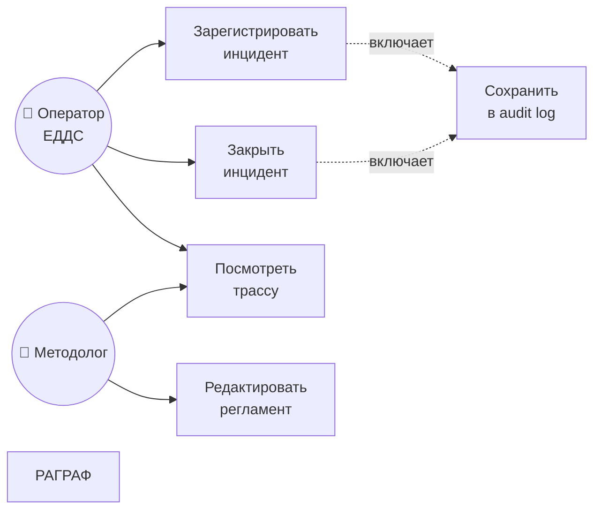

Это **высокоуровневый Use Case**. Из него ясно: оператор и методолог имеют разные роли, у них пересечение только в «посмотреть трассу». А запись в audit log происходит автоматически при регистрации и закрытии инцидента (`<<include>>` в UML).

Дальше каждый Use Case разворачивается в **детальный** документ. Стандарт — Алистер Коберн.

### Use Case по Алистеру Коберну (детальная форма)

Алистер Коберн — автор популярного шаблона. Документ описывает Use Case детально, разбирая основной поток и альтернативы. Покажу на нашем примере «срабатывание регламента превышения шума».

> **Use Case:** Срабатывание регламента превышения шума у школы
> **ID:** UC-NOISE-001
> **Уровень:** Подзадача (subfunction)
> **Главный актёр:** Регламент «Шум у школы»
> **Заинтересованные лица:**
> - Методолог — хочет, чтобы регламент сработал корректно
> - Жители — хотят, чтобы школа не работала ночью с шумом
> - Инспектор Роспотребнадзора — хочет аудит-трассу для проверки
>
> **Предусловия:**
> - Регламент «noise-near-school» активен (status=published в РАГРАФ)
> - Датчик шума `noise-school-12` онлайн
> - Текущее время — после 22:00 или до 8:00 (ночной режим по СанПиН 1.2.3685-21)
>
> **Гарантия успеха (постусловие):**
> - Создана задача в LEYKA «Проверить источник шума у школы №12»
> - Записан incident_audit_log с регламентом, параметрами, рекомендацией
> - На дашборде ЕДДС появилась карточка инцидента
>
> **Триггер:**
> - Датчик `noise-school-12` отдал событие с `value > 55 dB`
>
> **Основной поток:**
> 1. ETL puller получает событие от датчика и пишет в `etl_snapshots`.
> 2. Applier обнаруживает новый snapshot, находит активные регламенты в домене `nsk-ekologiya`, привязанные к этому датчику.
> 3. Flow executor запускает регламент «noise-near-school» с входом `noise=58 dB`.
> 4. Threshold-узел отмечает превышение (порог 55 dB ночью).
> 5. Switch выбирает ветку «alarm».
> 6. Output-узел вызывает `leyka_task_creator.ensure_task()`.
> 7. LEYKA создаёт задачу с deep-link обратно в РАГРАФ.
> 8. acceptance_resolver через 5 минут проверяет, изменилось ли значение датчика.
>
> **Альтернативные потоки:**
> - **3а. Датчик offline (нет значения):** Flow executor помечает sensor-узел как unknown, switch уходит в ветку «unknown», output отправляет уведомление обслуживающей бригаде «проверить датчик» (см. tutorial-06 из курса РАГРАФ-V1).
> - **6а. LEYKA недоступна:** ensure_task падает с error, но execute не валится — в response пишется `leyka_pings[]` с ошибкой, методолог увидит в RecentRuns.
> - **8а. Шум не утихнул через 30 мин:** acceptance_resolver помечает criterion_passed=false, эскалация в задачу мастеру.
>
> **Расширения (extensions):**
> - Если в этот же интервал срабатывает регламент по PM2.5 — оба пишутся в один incident_id (см. GLOSSARY часть VIII).
>
> **Частота:** ~2–5 срабатываний в сутки на 60 датчиков по школам.
> **Особые требования:** PROV-O трасса обязательна, ссылка на СанПиН 1.2.3685-21 пункт N.

Если ты можешь написать такой документ для своего проекта — ты уже половина системного аналитика. Вторая половина — научиться писать его быстро (1–2 часа на Use Case средней сложности).

### Чек-лист качества требований

📋 Каждое требование должно быть:

- [ ] **Полным** — нет дыр, ничего не подразумевается «по умолчанию»
- [ ] **Корректным** — не противоречит другим требованиям
- [ ] **Реализуемым** — не «телепортировать инспектора», а «отправить SMS»
- [ ] **Необходимым** — если убрать, кому-то реально станет хуже
- [ ] **Приоритетным** — есть ранг: must / should / could / won't (методология MoSCoW)
- [ ] **Однозначным** — не «быстро», а «менее 500 мс»
- [ ] **Проверяемым** — есть способ убедиться, что выполнено
- [ ] **Трассируемым** — можно проследить, откуда взялось

Последнее — самое важное. Каждое функциональное требование должно ссылаться на бизнес-требование, из которого оно выросло. И обратно: каждый строк кода в идеале должен трассироваться до требования. В РАГРАФ это сделано через **PROV-O** — каждый параметр регламента имеет `source_document` и `source_clause` (см. таблицу `regulations` в [regulation_store.py](../backend/app/services/regulation_store.py)). Это и есть трассировка «требование → код → данные → результат».

### Трассировка: требование → код → тест → документация

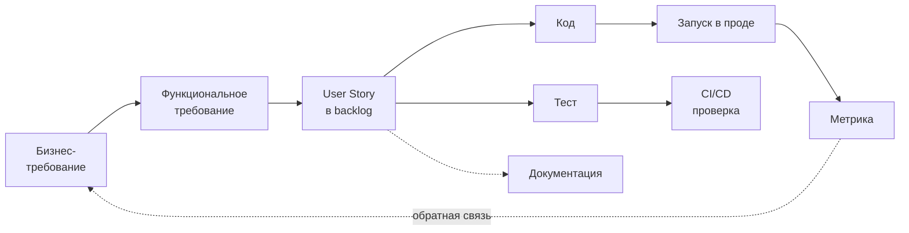

В РАГРАФ эта цепочка реализована через несколько артефактов:
- `TZ_RAGRAF.md` — бизнес-требования
- `BACKLOG.md` — функциональные требования и User Stories
- Код в `backend/app/services/` — реализация
- Тесты в `backend/tests/` — проверка
- `regulation_metrics` (таблица в DuckDB) — метрики срабатываний
- `ARCHITECTURE.md`, `GLOSSARY.md` — документация

PROV-O делает то же на уровне **данных**: для каждого срабатывания регламента видно, какой документ был основанием. Это уровень аудита, который раньше требовал отдельной системы — а в РАГРАФ встроен в саму платформу.

### Diagrams.net и Mermaid

Два главных инструмента диаграмм для системного аналитика.

**Diagrams.net** (бывший draw.io) — графический редактор UML. Бесплатный, работает в браузере. Подходит для:
- Сложных UML-диаграмм классов и состояний
- Архитектурных карт с иконками сервисов (AWS/Azure/GCP)
- Документов, где важна визуальная аккуратность

**Mermaid** — текстовый язык для диаграмм. Рендерится в Markdown (на GitHub, в Notion, в Obsidian, в Confluence). Подходит для:
- Быстрых блок-схем (flowchart)
- Sequence-диаграмм («сначала клиент → потом сервер → потом БД»)
- Диаграмм состояний (state diagram)
- Mind map
- Code-as-diagram — диаграмма живёт в репозитории рядом с кодом

В РАГРАФ диаграммы **в основном Mermaid** (см. [ARCHITECTURE.md](../docs/ARCHITECTURE.md), [GLOSSARY.md](../docs/GLOSSARY.md)). Преимущество — диаграмма обновляется вместе с документом, не отстаёт. Я рекомендую **всегда начинать с Mermaid**, и только если упёрся в его ограничения — переходить в Diagrams.net.

Минимальный пример Mermaid (та же диаграмма стейкхолдеров, но flowchart):

```
flowchart LR
  Z[Заказчик] --> ПО[Платформа]
  П[Пользователи] --> ПО
  И[Интеграторы] --> ПО
  Р[Регуляторы] -.проверяют.-> ПО
```

Mermaid синтаксис примитивен — час на освоение. После этого вся документация твоя.

### Проект 1: «Опиши требования к мини-РАГРАФ для контроля столовой школы»

Это твой первый дипломный спринт. Не маленькое упражнение — полноценный документ требований.

> **Контекст:** директор школы №42 хочет систему, которая контролирует столовую. Какие параметры — должен выяснить ты. Подумай — что в столовой можно автоматически проверять? Температуру блюд? Срок годности продуктов? Чистоту посудомойки? Калорийность меню? Реакцию детей через анкеты?
>
> **Бюджет:** 1.5 млн на первый этап (3 месяца разработки).
> **Команда:** ты + один бэкенд-разработчик + один фронтенд-разработчик.
> **Технологический стек:** РАГРАФ (то есть Python+FastAPI+DuckDB+React) — обязателен, потому что директор хочет «как в мэрии Новосибирска».

**Что нужно сделать:**

1. **Карта стейкхолдеров** (Mermaid mindmap) — минимум 6 стейкхолдеров с краткими интересами.
2. **Бизнес-требования** — 3–5 пунктов с приоритетом по MoSCoW.
3. **Пользовательские требования** — список User Stories для двух главных ролей (методолог + кто-то ещё).
4. **Функциональные требования** — 15–25 пунктов с уникальными ID (FR-001, FR-002…).
5. **Нефункциональные требования** — 8–12 пунктов (производительность, безопасность, доступность).
6. **Use Case-диаграмма** — UML или Mermaid, 5–8 use cases.
7. **Один детальный Use Case по Коберну** — самый сложный из твоих use cases.
8. **Mermaid-диаграмма архитектуры** — высокоуровневая схема как в РАГРАФ ARCHITECTURE.md.
9. **Трассировка** — таблица «бизнес-требование → функциональное требование → планируемый код модуля».

**Объём:** 15–25 страниц markdown.
**Срок сдачи:** конец спринта 2 (через неделю-полторы после начала).
**Парный аудит:** напарник проверяет по чек-листу качества требований (см. выше).

### Мини-практика

Чтобы войти в режим, начни с одной маленькой задачи. Возьми **один процесс** из своей повседневной жизни (заказ еды в Яндекс.Еде, оплата метро через Тройку, что угодно) и распиши его как Use Case по Коберну. Один основной поток + два альтернативных. На 15 минут. Это твой разогрев перед Проектом 1.

> В следующем спринте мы перейдём к **SQL и DuckDB** — это даст тебе возможность самостоятельно проверять гипотезы по данным РАГРАФ и не дёргать бэкенд-разработчика по каждому пустяку.

---

## Спринт 3: SQL и DuckDB для аналитиков

> **Сколько займёт:** ~50 часов (этот спринт самый плотный — SQL надо именно НАрабатывать).
> **Артефакт:** решённые 10 SQL-задач + дашборд «топ-проблемных доменов» одним SQL-запросом.

### Главное за минуту

SQL — это вторая (после русского) обязательная грамотность системного аналитика. Без неё ты не сможешь самостоятельно проверить гипотезу «А правда регламент по шуму срабатывает чаще ночью?», и будешь дёргать бэкенд-разработчика. С ней — открываешь DuckDB-консоль и за 15 минут получаешь ответ. В РАГРАФ выбран не Postgres и не SQLite, а именно **DuckDB** — потому что это OLAP-движок (Online Analytical Processing, аналитический), а наш use case — аналитика по таблицам, а не OLTP-транзакции. Этот спринт — самый плотный в Блоке A, потому что SQL надо именно НАбивать руки, а не учить теорией.

### О чём этот спринт

Поэтапно: что такое реляционная база данных → SELECT/WHERE/JOIN/GROUP BY → подзапросы и CTE → оконные функции → DuckDB-специфичные фичи → бонус про SPARQL. Параллельно — 10 задач на нашей схеме (regulations, parameters, sensor_readings/etl_snapshots, regulation_metrics, incident_audit_log).

### Базы данных — что это и почему DuckDB

**База данных** — программа для хранения структурированных данных + язык запросов к ним. Структурированных — значит «таблицы со строками и колонками», как в Excel, только большие и быстрые.

Базы делятся на:
- **SQL** (реляционные) — данные в таблицах, связи через foreign keys. Postgres, MySQL, SQLite, DuckDB. Это 80% мира.
- **NoSQL (document)** — данные как JSON-документы. MongoDB. Хорошо для динамичных схем (соцсети, чаты).
- **NoSQL (key-value)** — простой словарь «ключ → значение». Redis. Хорошо для кэшей.
- **Graph** — данные как граф из вершин и рёбер. Neo4j. Хорошо для социальных сетей, рекомендаций.

Дальше внутри SQL-баз есть деление на:
- **OLTP** (Online Transaction Processing) — много мелких записей и чтений в секунду. Postgres, MySQL. Используется в банках, маркетплейсах.
- **OLAP** (Online Analytical Processing) — большие аналитические запросы, агрегаты, окна. ClickHouse, DuckDB. Используется в BI-дашбордах, аналитике.

**Почему в РАГРАФ DuckDB**:

| Альтернатива | Почему не взяли |
|---|---|
| SQLite | OLTP-движок, плохо работает с аналитическими запросами (GROUP BY на миллион строк = смерть). Нам нужна аналитика по snapshot'ам. |
| Postgres | Требует отдельного сервера, дополнительный operational overhead, для embedded-сценария избыточно. РАГРАФ должен запускаться `docker compose up` без отдельной БД. |
| MySQL | Та же история, что и Postgres. Плюс MySQL хуже работает со сложным SQL. |
| MongoDB | Не реляционная — нам нужны JOIN'ы и SHACL/PROV-O вживую складываются в нормальные таблицы. |
| ClickHouse | Кластерный по дизайну, для одной мэрии города Х оверкилл. |
| **DuckDB** | Embedded (живёт как файл), OLAP-движок (быстрые агрегаты), читает Parquet и CSV без импорта, нативный Python-API. |

Для города Х выбор DuckDB сохранится. Когда (если) вырастешь до Σ Сигма-масштаба — мигрируешь на Postgres + ClickHouse + Apache Jena. Это нормальный путь развития.

### Схема таблиц РАГРАФ (для практических заданий)

Возьмём упрощённую версию реальной схемы (полная — в [regulation_store.py](../backend/app/services/regulation_store.py)).

```sql
-- Регламенты
CREATE TABLE regulations (
    source_id      VARCHAR PRIMARY KEY,  -- 'tutorial-01-basic-threshold'
    name           VARCHAR NOT NULL,      -- 'Температура серверной'
    domain         VARCHAR,               -- 'tutorial', 'nsk-ekologiya', 'construction'
    version        VARCHAR NOT NULL DEFAULT '1.0',
    status         VARCHAR NOT NULL DEFAULT 'draft',  -- 'draft' | 'published' | 'archived'
    source_document VARCHAR,              -- ссылка на PDF норматива
    updated_at     TIMESTAMP NOT NULL
);

-- Параметры регламента (что меряем)
CREATE TABLE parameters (
    source_id      VARCHAR NOT NULL,     -- FK к regulations.source_id
    id             VARCHAR NOT NULL,     -- 'room_temperature'
    name           VARCHAR NOT NULL,     -- 'Температура помещения'
    datatype       VARCHAR NOT NULL,     -- 'decimal' | 'string' | 'date' | 'boolean'
    ref_value      DOUBLE,               -- эталонное значение
    deviation      DOUBLE,               -- допустимое отклонение
    unit           VARCHAR,              -- '°C', 'дБ', 'мкг/м³'
    PRIMARY KEY (source_id, id)
);

-- Срабатывания регламентов (метрики)
CREATE TABLE regulation_metrics (
    run_id           VARCHAR PRIMARY KEY,
    regulation_id    VARCHAR NOT NULL,    -- FK к regulations.source_id
    ts               TIMESTAMP NOT NULL,
    triggered        BOOLEAN NOT NULL,    -- сработал ли регламент
    level            INTEGER NOT NULL,    -- 0=норма, 1=внимание, 2=алёрт, 3=критично
    criterion_kind   VARCHAR,             -- 'no_violation' | 'task_closed_within_sla' | ...
    criterion_passed BOOLEAN,             -- TRUE/FALSE/NULL (трёхзначка Клини, см. РАГРАФ Модуль 4)
    latency_ms       INTEGER NOT NULL,
    region           VARCHAR,             -- 'novosibirsk', 'moscow', '_global'
    task_ref         VARCHAR              -- ID задачи в LEYKA
);

-- Snapshot'ы от ETL-источников (входные данные)
CREATE TABLE etl_snapshots (
    ts             TIMESTAMP NOT NULL,
    source_id      VARCHAR NOT NULL,    -- 'open-meteo-air', 'leyka-tasks'
    subtype        VARCHAR NOT NULL,    -- 'om-air-quality'
    field          VARCHAR NOT NULL,    -- 'current.pm2_5'
    value          DOUBLE,
    region         VARCHAR
);

-- Аудит-лог инцидентов (для PROV-O трассы)
CREATE TABLE incident_audit_log (
    entry_id        VARCHAR PRIMARY KEY,
    incident_id     VARCHAR NOT NULL,
    timestamp       TIMESTAMP NOT NULL,
    event_type      VARCHAR NOT NULL,
    regulation_id   VARCHAR,
    level           INTEGER,
    recommendation  TEXT,
    user_id         VARCHAR,
    user_action     VARCHAR
);
```

### SQL-основы: SELECT, WHERE, JOIN, GROUP BY

**SELECT — самое главное**. Это «покажи мне такие-то колонки из такой-то таблицы»:

```sql
-- Все регламенты в домене tutorial
SELECT source_id, name, version
FROM regulations
WHERE domain = 'tutorial';
```

**WHERE — фильтрация**:

```sql
-- Только опубликованные регламенты экологии
SELECT name FROM regulations
WHERE domain = 'nsk-ekologiya' AND status = 'published';
```

**ORDER BY — сортировка**:

```sql
-- Последние 10 срабатываний
SELECT regulation_id, ts, level FROM regulation_metrics
ORDER BY ts DESC LIMIT 10;
```

**JOIN — соединение таблиц**. Самая частая операция аналитика. Если у тебя метрики в одной таблице, а имена регламентов в другой — JOIN соединит.

```sql
-- Срабатывания вместе с именами регламентов
SELECT m.ts, r.name, m.level, m.criterion_passed
FROM regulation_metrics m
JOIN regulations r ON m.regulation_id = r.source_id
WHERE m.ts > CURRENT_DATE - INTERVAL 7 DAY
ORDER BY m.ts DESC;
```

Виды JOIN:
- `INNER JOIN` (просто `JOIN`) — строки, где совпадение есть в обеих таблицах
- `LEFT JOIN` — все строки из левой + совпадения из правой (NULL если нет)
- `RIGHT JOIN` — наоборот
- `FULL OUTER JOIN` — всё со всех сторон

**GROUP BY — агрегаты**. Самое важное для дашбордов.

```sql
-- Сколько раз сработал каждый регламент за неделю
SELECT regulation_id, COUNT(*) as runs
FROM regulation_metrics
WHERE ts > CURRENT_DATE - INTERVAL 7 DAY
GROUP BY regulation_id
ORDER BY runs DESC;
```

Функции агрегации: `COUNT()`, `SUM()`, `AVG()`, `MIN()`, `MAX()`. Сложнее: `COUNT(DISTINCT)`, `STRING_AGG`, `ARRAY_AGG`.

**HAVING — фильтр после агрегации** (WHERE — до, HAVING — после):

```sql
-- Регламенты, которые сработали более 50 раз
SELECT regulation_id, COUNT(*) as runs
FROM regulation_metrics
GROUP BY regulation_id
HAVING runs > 50;
```

### Подзапросы, CTE, оконные функции

**Подзапрос** — SELECT внутри SELECT. Иногда удобно, часто — нечитаемо.

```sql
-- Регламенты, у которых были срабатывания (через подзапрос)
SELECT name FROM regulations
WHERE source_id IN (
    SELECT DISTINCT regulation_id FROM regulation_metrics
);
```

**CTE (Common Table Expression)** — «временная таблица» в одном запросе. Читабельнее подзапросов.

```sql
-- Тот же запрос через CTE
WITH active_regs AS (
    SELECT DISTINCT regulation_id FROM regulation_metrics
)
SELECT r.name FROM regulations r
JOIN active_regs a ON r.source_id = a.regulation_id;
```

CTE можно собирать в цепочки — `WITH a AS (...), b AS (...) SELECT ...`. Это твой главный инструмент для **сложной аналитики**.

**Оконные функции** — самая мощная штука SQL. Это агрегат, который не теряет деталь.

Пример: для каждого срабатывания регламента показать его номер по порядку:

```sql
SELECT regulation_id, ts,
       ROW_NUMBER() OVER (PARTITION BY regulation_id ORDER BY ts) as run_num
FROM regulation_metrics;
```

Или — для каждого срабатывания показать скользящее среднее последних 5 срабатываний:

```sql
SELECT ts, level,
       AVG(level) OVER (
         PARTITION BY regulation_id
         ORDER BY ts
         ROWS BETWEEN 4 PRECEDING AND CURRENT ROW
       ) as moving_avg
FROM regulation_metrics;
```

Оконные функции — это то, что отличает базового SQL-юзера от продвинутого. Прокачай их.

### DuckDB-specific фичи

Главная фишка DuckDB — она читает файлы напрямую, без импорта.

**read_csv**:

```sql
-- Прочитать CSV прямо из файла
SELECT * FROM read_csv('/tmp/yandex-traffic.csv') LIMIT 10;
```

**read_parquet**:

```sql
-- Прочитать parquet (компактный бинарный формат)
SELECT region, AVG(value) FROM read_parquet('/tmp/snapshots.parquet')
GROUP BY region;
```

**read_json**:

```sql
-- Прочитать JSON и распарсить
SELECT json_extract(payload, '$.current.pm2_5') as pm25
FROM read_json('/tmp/openmeteo.json');
```

Это **революция** для аналитика. Тебе не нужно «загрузить данные в БД», просто читай файлы. Один запрос может объединять CSV из мэрии, Parquet с датчиков и JSON из Open-Meteo. Раньше для этого был нужен Python с pandas. Теперь — одна строка SQL.

**Pivot/Unpivot** — DuckDB умеет нативный pivot:

```sql
PIVOT regulation_metrics
ON criterion_kind
USING COUNT(*)
GROUP BY regulation_id;
```

Это сразу даёт тебе таблицу: строки — регламенты, колонки — типы критериев, значения — счётчики. Помнишь, в Excel есть «сводная таблица»? Это она и есть, только из SQL.

**ATTACH** — подключение нескольких баз:

```sql
ATTACH 'live_etl.duckdb' AS etl;
SELECT * FROM etl.etl_snapshots LIMIT 10;
```

Это пригодится, потому что в РАГРАФ две DuckDB-базы (см. [ARCHITECTURE.md §4.1](../docs/ARCHITECTURE.md)) и иногда хочется JOIN между ними (хотя в production-коде РАГРАФ это запрещено — см. ADR-003 — но для аналитики на свой страх и риск можно).

### Бонус: SPARQL над Turtle

Помнишь, в курсе РАГРАФ-V1 ты сохранял регламенты как **Turtle-файлы**? Это W3C-стандарт для семантического веба (RDF). Над Turtle есть свой язык запросов — **SPARQL**. По синтаксису похож на SQL, но запрашивает граф, а не таблицу.

Пример: найти все регламенты, которые ссылаются на ГОСТ Р 50577-2018:

```sparql
PREFIX rag: <urn:ragraf:>
PREFIX prov: <http://www.w3.org/ns/prov#>

SELECT ?reg ?name WHERE {
  ?reg a rag:Regulation ;
       rag:hasName ?name ;
       prov:wasDerivedFrom ?doc .
  ?doc rag:standardNumber "ГОСТ Р 50577-2018" .
}
```

В SQL такого не сделаешь напрямую — потому что граф не сводится к одной таблице. В РАГРАФ SPARQL-запросы есть, но методолог их не пишет напрямую — есть UI-обёртка через формы. Системному аналитику знать на уровне «понимаю, как читать» — обязательно. Писать с нуля — необязательно, пока не дойдёшь до архитектуры Σ Сигмы (там SPARQL уже базовая грамотность).

Кратко, чем отличается:

| Параметр | SQL | SPARQL |
|---|---|---|
| Что запрашиваем | Таблицы и строки | Граф из триплетов |
| Главная конструкция | `SELECT FROM WHERE` | `SELECT WHERE { triple pattern }` |
| JOIN | Явный (`JOIN ON`) | Неявный (через переменные в triple-паттернах) |
| Где используется в РАГРАФ | Для метрик и аналитики (DuckDB) | Для PROV-O трассы и Knowledge Layer |

### 10 SQL-задач для практики

Решаем в DuckDB. Скачай локальную копию РАГРАФ (если ещё не) — там есть `regulations.duckdb` и `live_etl.duckdb` с реальными данными. Или сгенерируй фейк-данные по схеме выше.

**Задача 1 (warm-up):** Покажи имена всех регламентов в домене `nsk-ekologiya`.

**Задача 2:** Сколько регламентов в каждом домене? Отсортируй по убыванию.

**Задача 3:** Для каждого регламента — сколько у него параметров? (JOIN regulations + parameters + GROUP BY)

**Задача 4:** Покажи регламенты, которые НИ РАЗУ не срабатывали за последний месяц. (LEFT JOIN + WHERE IS NULL)

**Задача 5:** Топ-5 регламентов по числу срабатываний за последнюю неделю.

**Задача 6:** Какой регламент чаще всех срабатывает по ночам (с 22:00 до 8:00)? (`EXTRACT(hour FROM ts)` + GROUP BY)

**Задача 7:** Для каждого региона — средний `latency_ms` срабатываний. Где самые медленные?

**Задача 8 (CTE):** Найди регламенты, у которых `criterion_passed = FALSE` встречается чаще, чем `TRUE`. (Используй CTE для подсчёта проходов/непроходов).

**Задача 9 (оконная функция):** Для каждого регламента покажи временную дельту между его срабатываниями (`ts` минус предыдущий `ts` через `LAG()`).

**Задача 10 (дашборд):** Собери одним SQL-запросом данные для дашборда «топ-проблемных доменов». Колонки:
- `domain`
- `total_runs` — всего срабатываний за месяц
- `failed_runs` — где `criterion_passed = FALSE`
- `failure_rate` — отношение `failed_runs / total_runs * 100` (в процентах)
- `slowest_latency_ms` — самое медленное срабатывание
- `last_run_ts` — последнее срабатывание

Отфильтруй только домены, где `total_runs >= 10` (иначе статистика шумная). Отсортируй по `failure_rate` убыванию.

**Подсказка к задаче 10:** Один CTE для агрегации по доменам, потом JOIN с regulations, потом фильтрация и сортировка. ~25–35 строк SQL.

**Эталонный ответ к задаче 10** (не подглядывай раньше времени):

```sql
WITH domain_stats AS (
    SELECT r.domain,
           COUNT(*) as total_runs,
           SUM(CASE WHEN m.criterion_passed = FALSE THEN 1 ELSE 0 END) as failed_runs,
           MAX(m.latency_ms) as slowest_latency_ms,
           MAX(m.ts) as last_run_ts
    FROM regulation_metrics m
    JOIN regulations r ON m.regulation_id = r.source_id
    WHERE m.ts > CURRENT_DATE - INTERVAL 30 DAY
    GROUP BY r.domain
)
SELECT domain,
       total_runs,
       failed_runs,
       ROUND(failed_runs * 100.0 / total_runs, 2) as failure_rate,
       slowest_latency_ms,
       last_run_ts
FROM domain_stats
WHERE total_runs >= 10
ORDER BY failure_rate DESC;
```

### Мини-практика

После всех 10 задач — открой свою боевую базу (РАГРАФ-локалка, или экспорт из метрик курса РАГРАФ-V1) и **сам придумай** три аналитических вопроса, которые тебе интересны. Например: «А с какой периодичностью я редактирую регламенты?» (это `SELECT DATE_TRUNC('day', updated_at), COUNT(*) FROM regulations GROUP BY 1`). Или: «А есть ли регламенты, которые я никогда не открывал после первого создания?». Найди ответ через SQL.

Это — главный навык. Не запоминание синтаксиса, а **умение формулировать вопрос как SQL-запрос**. Когда это войдёт в привычку — ты больше не будешь дёргать бэкенд-разработчика по каждому пустяку.

### Итог спринта 3

Артефакт — markdown-файл с 10 решёнными задачами + дашборд-запрос. Сдаётся в LEYKA как M3.S. Парный аудит проверяет:
- [ ] Все 10 задач имеют рабочий SQL (R1)
- [ ] Задача 10 (дашборд) использует CTE или оконные функции (R2)
- [ ] Решения откомментированы (зачем именно так) (R3)
- [ ] Хотя бы одна задача использует DuckDB-специфичные фичи (read_csv, PIVOT) (R4)

---

## Что дальше — Блок B

После трёх спринтов Блока A ты:
- понимаешь, как устроена команда платформы класса РАГРАФ,
- умеешь писать требования с трассировкой,
- бегло читаешь и пишешь SQL на DuckDB.

В Блоке B (спринты 4–6) пойдут инструменты моделирования: **моделирование данных** (ER-диаграммы, нормализация, семантический слой Turtle/SHACL), **моделирование процессов** (BPMN, UML Activity, State Machine, Rule DSL Flow) и **пользовательские интерфейсы** (персоны, wireframes, Telegram-style Лента и cockpit-системы).

Между блоками — короткое домашнее задание: применить навыки Блока A к своему сквозному кейсу «РАГРАФ-для-города-Х». Это твой дипломный проект, который будет расти от спринта к спринту.

К концу курса (Блок D, диплом) у тебя на руках будет:
- спроектированная архитектура «РАГРАФ-для-Х»,
- 80+ функциональных требований с трассировкой,
- ER-диаграмма базы и SQL-схема,
- API-контракт (OpenAPI),
- 3–5 прототипов на Python/React (не production, но рабочие),
- Roadmap внедрения на 12 месяцев с бюджетной оценкой.

Этим документом можно идти к зам.мэру в понедельник и говорить: «У меня готов проект. Нанимаем команду — запускаемся через 3 недели». Это и есть продукт системного аналитика.

---

> *Конец Блока A. Дальше — Блок B (спринты 4–6): моделирование данных, процессов и пользовательских интерфейсов.*

## Блок B. Инструменты системного аналитика: данные, процессы, интерфейсы

> Это второй блок курса «Системный аналитик в эпоху гибридного ИИ». В первом блоке мы разобрались, кто такой системный аналитик и как он смотрит на мир. Теперь — инструменты. Если первый блок был про «уметь думать», то этот — про «уметь моделировать». Три спринта, три плоскости проекции: данные (что хранится), процессы (что происходит во времени), интерфейсы (что видит человек). Между ними — нитка, на которую нанизана вся ваша работа.

---

## Спринт 4: Моделирование данных

### Главное за минуту

Прикинь: ты в Tinkoff заказал доставку еды. В голове у тебя картинка — «я хочу шаурму из «Гирос» через час». В приложении эта же штука уже выглядит иначе: карточка ресторана, корзина, статус. А в базе данных у Тинькова это вообще куча таблиц с какими-то FK, индексами и foreign-ключами на пользователя. **Один и тот же кусок реальности живёт в трёх измерениях** — это и есть три уровня модели данных. Системный аналитик — переводчик между этими тремя языками. В РАГРАФ ровно та же история: «регламент» в голове методолога — это процедура реагирования; в нашей логической модели — связь шести таблиц; на физическом уровне — DuckDB-табличка плюс Turtle-файл рядом. И всё это про одно и то же.

### О чём эта часть

Аналитик 80% времени проводит на стыке предметной области и базы данных. Если ты не умеешь моделировать данные — ты, по сути, переписчик задач от заказчика разработчикам с потерей 30% смысла на каждом шаге. Если умеешь — ты тот человек, без которого фича не взлетает. В этом спринте мы пройдём от концептуальной модели (что вообще есть в нашем мире) до физической (как это лежит в БД) — и заглянем в семантический слой, который РАГРАФ использует как «второй формат» для тех же данных.

### Ключевые термины

**Концептуальная модель** — отвечает на вопрос «что есть в мире?». Сущности и связи на языке бизнеса. Без типов данных, без таблиц, без NULL/NOT NULL. Это нарисованная схема, которую можно показать руководителю ЕДДС, и он скажет «да, у нас примерно так». Уровень — «у нас есть регламенты, у каждого регламента есть параметры и триггеры».

**Логическая модель** — отвечает на «как это организовано?». Сущности превращаются в таблицы, связи — в внешние ключи, появляются типы данных, ограничения. Но ещё не привязано к конкретной СУБД. Можно потом мигрировать с PostgreSQL на DuckDB без переделки модели.

**Физическая модель** — отвечает на «как это лежит в железе?». Уже конкретный DDL: `CREATE TABLE regulation (id TEXT PRIMARY KEY, ...) WITH (storage='columnar')`. Здесь решаются вопросы индексов, партиционирования, denormalization для скорости.

**Сущность (Entity)** — то, про что ты хранишь данные. Регламент, параметр, инцидент, пользователь, датчик. По правилу хорошего вкуса — каждая сущность должна быть на отдельной строке таблицы, а каждая её характеристика — в отдельной колонке.

**Атрибут** — характеристика сущности. У регламента: id, имя, описание, source_clause, valid_from, valid_to. Атрибуты бывают простые (одно значение) и составные (несколько частей — например, ФИО состоит из имени, фамилии, отчества).

**Связь (Relationship)** — отношение между двумя сущностями. У регламента **есть** параметры (один-ко-многим). Один датчик **может быть привязан** ко многим регламентам (многие-ко-многим).

**Кардинальность** — сколько сущностей с одной стороны связаны со сколькими с другой. 1:1 (один к одному), 1:N (один ко многим), M:N (многие ко многим). Самая частая — 1:N, самая болезненная — M:N (требует промежуточной таблицы).

**Словарь данных** (Data Dictionary) — таблица с описанием каждого поля каждой сущности: имя, тип, обязательность, единица измерения, источник, диапазон допустимых значений. Это «паспорт данных», который читают все — от разработчика до тестировщика.

### Контекст в РАГРАФ/LEYKA

Возьмём слово **«регламент»**. На уровнях:

| Уровень | Что значит «регламент» |
|---|---|
| **Концептуальная модель** | Документ-инструкция: «если в серверной выше 28 — позвать дежурного». Понятная руководителю ЕДДС. |
| **Логическая модель** | Сущность `Regulation` со связями: 1 регламент → N параметров, 1 регламент → N триггеров, 1 регламент → 1 граф (RuleDSL), M регламентов ↔ N процессов. |
| **Физическая модель** | DuckDB-таблица `regulations` + JSON-колонки + рядом файл `data/flows/{id}.json` + опционально Turtle-файл с RDF-представлением. |

В LEYKA «проект» проходит ровно тот же путь: концепт «проект как контейнер задач» → логика «таблицы projects, columns, tasks, comments» → физика «SQLite + индексы по project_id».

### ER-диаграммы: Crow's Foot vs Peter Chen

ER (Entity-Relationship) — это самый ходовой инструмент аналитика для рисования логической модели. Две главные нотации:

**Peter Chen** (1976) — академическая, олдскульная. Прямоугольники-сущности, ромбы-связи, овалы-атрибуты. Используется в учебниках и для презентаций «верхнего уровня». Минус — занимает много места, для реальной БД из 30 таблиц не годится.

**Crow's Foot** (нотация «вороньей лапки», она же IE/Information Engineering) — индустриальный стандарт. Прямоугольники-сущности с колонками атрибутов внутри; связи — линии с «лапками» (полоска = ровно один, кружок = ноль, лапка = много). Это то, что рисуют в dbdiagram.io, draw.io, DBeaver.

| Когда | Что использовать |
|---|---|
| Презентация бизнес-заказчику | Peter Chen — нагляднее, меньше деталей |
| Передача в разработку | Crow's Foot — индустриальный стандарт |
| Документация к БД | Crow's Foot |
| Быстрый набросок на доске | Crow's Foot (быстрее рисовать) |

#### ER-диаграмма базы регламентов РАГРАФ

Шесть основных сущностей. Вот как они связаны (Crow's Foot в Mermaid):

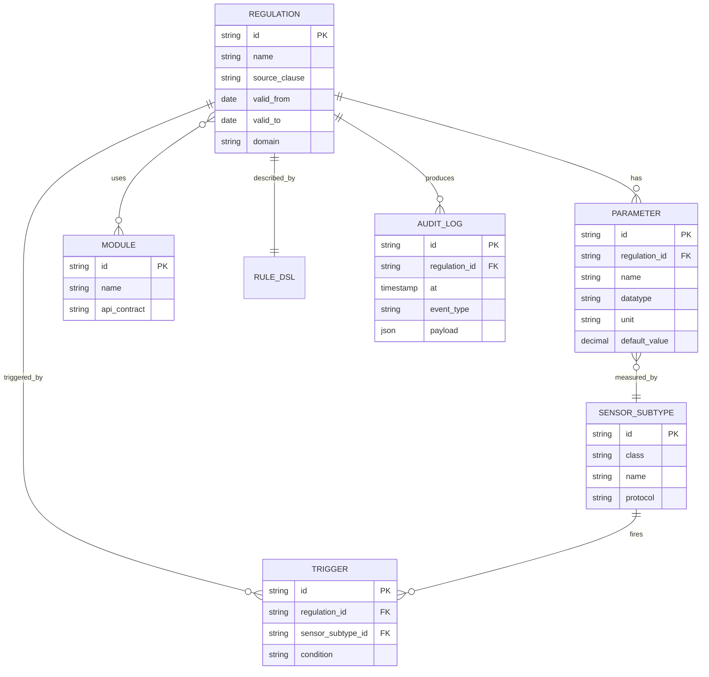

Прочитай эту диаграмму вслух: «У регламента может быть несколько параметров. У регламента может быть несколько триггеров. Один триггер привязан к одному подтипу датчика. Один регламент использует несколько модулей, и один модуль может использоваться в нескольких регламентах (M:N). У регламента ровно один Rule DSL (1:1). Регламент производит много записей audit_log».

Это и есть язык, на котором ты будешь говорить с разработчиком.

### Нормализация: 1NF, 2NF, 3NF, BCNF

Нормализация — это процедура «причёсывания» таблиц, чтобы данные не дублировались и не противоречили друг другу. Звучит сухо — но по сути это инструмент, который помогает не наступить на грабли.

**1NF (первая нормальная форма)** — в одной ячейке таблицы лежит **одно атомарное значение**. Никаких списков через запятую, никаких JSON-массивов «sensor_ids: 1,2,3» в одной колонке.

Плохо:
```
| regulation_id | parameter_names                      |
| reg-001       | "temperature, humidity, co2"         |
```

Хорошо (вынесли в отдельную таблицу):
```
| regulation_id | parameter_id | parameter_name |
| reg-001       | p-001        | temperature    |
| reg-001       | p-002        | humidity       |
| reg-001       | p-003        | co2            |
```

**2NF** — выполнена 1NF + у каждого неключевого атрибута есть полная функциональная зависимость от **всего** составного ключа. Это про случай, когда у тебя ключ из двух колонок и часть колонок зависит только от одной части ключа. Звучит мудрёно — на практике встречается редко, обычно прокатывает по умолчанию.

**3NF** — выполнена 2NF + нет транзитивных зависимостей. Самая важная норма для аналитика! Если в таблице `parameter` лежит `sensor_subtype_name` (а оно зависит от `sensor_subtype_id`) — нарушение. Имя подтипа надо хранить только в таблице `sensor_subtype`, а в `parameter` держать FK.

**BCNF (Boyce-Codd)** — усилённая 3NF. На бытовом уровне аналитика — «3NF, но строже». Встречается редко в реальных проектах. Можно знать, но без фанатизма.

### Где РАГРАФ нормализован, а где нет

| Таблица | Состояние | Почему |
|---|---|---|
| `parameter` | 3NF | Каждый параметр — отдельная строка, тип подтянут по FK |
| `regulation` | 3NF в колонках, но JSON в `flow.json` | Базовые поля норм, но граф хранится как JSON-блоб (читаем как файл) |
| `audit_log` | **Сознательная денормализация** | Поле `payload` — JSON. Не вытаскиваем оттуда в отдельные колонки, т.к. структура события зависит от типа события |
| `etl_snapshots` | **Сознательная денормализация** | Храним `sensor_type` и `sensor_subtype` строкой, чтобы при выборке не делать JOIN на каждый чих |

**Правило РАГРАФ**: нормализуем там, где нужен поиск и аналитика; денормализуем там, где главное — скорость чтения большого потока (телеметрия, аудит).

LEYKA примерно так же: `tasks` нормализованы (FK на column, project), а `feed_messages` денормализованы (имя автора пишется прямо в сообщение, чтобы не делать JOIN на 50 тысячах сообщений ленты).

### Словарь данных в РАГРАФ

Аналитик ведёт словарь параметров регламентов прямо в коде — каждое поле `Parameter` имеет описание:

| Поле | Тип | Обязательно | Что означает |
|---|---|---|---|
| `id` | string | да | Уникальный идентификатор параметра внутри регламента |
| `name` | string | да | Человекочитаемое имя («Температура серверной») |
| `datatype` | enum: `decimal/string/date/boolean` | да | Тип значения параметра |
| `unit` | string | нет | Единица измерения («°C», «mg/m³», «секунда») |
| `valid_from` | date | нет | С какой даты параметр действует |
| `valid_to` | date | нет | До какой даты параметр действует |
| `source_clause` | string | нет | Откуда взяли значение по нормативке: «СанПиН 1.2.3685-21, п. 7.2.3» |

`source_clause` — фишка РАГРАФ. Любое число в регламенте имеет ссылку на пункт нормативного документа. Это нужно, чтобы потом на вопрос депутата «почему 28, а не 30?» — показать пункт СанПиН.

### UML Class Diagram и Object Diagram

ER-диаграммы — это «вид сверху на БД». А UML Class Diagram — «вид сверху на программу». Разница в нюансах:

| | ER-диаграмма | UML Class Diagram |
|---|---|---|
| Что моделирует | Сущности и связи в БД | Классы и связи в коде |
| Есть ли методы | Нет | Да (`getName()`, `validate()`) |
| Видимость атрибутов | Нет | Да (`+ public`, `- private`) |
| Кардинальность | Crow's foot или Chen | `1`, `0..1`, `*`, `1..*` |
| Наследование | Нет (или костыли) | Есть (`extends`) |

В РАГРАФ Class Diagram нужен, когда ты описываешь поведение объекта (методы, состояния). Когда работаешь с чистой моделью данных — хватает ER.

**Object Diagram** — снимок конкретных объектов в конкретный момент времени. «Вот регламент reg-001 с параметрами p-001 (значение 28°C) и p-002 (значение 60%)». Используется редко — обычно для иллюстрации сложного состояния системы в баге.

### Семантический слой как ещё одна модель

Тут самое интересное и фирменное для РАГРАФ. **Один и тот же регламент** живёт в двух физических форматах одновременно: DuckDB-табличка (для скорости и API) **и** Turtle-файл с RDF-троиками (для семантической интероперабельности).

Зачем второй формат, если есть DuckDB? Три причины:

1. **Стандартизация**. Turtle/RDF — это W3C-стандарт. Любая система, понимающая RDF, прочитает наши регламенты без дополнительных адаптеров. DuckDB-схема — наша частная штука.
2. **Логический вывод (reasoning)**. Поверх RDF можно навешивать OWL-онтологию и получать вывод «если X класса A, то X класса B». В реляционке так не сделаешь.
3. **Валидация на уровне модели**. SHACL — это язык shapes, проверяющий, что RDF-граф соответствует ожидаемой структуре. Аналог CHECK constraints, но мощнее.

#### Turtle/RDF на пальцах

RDF (Resource Description Framework) — это формат данных в виде троек **«субъект — предикат — объект»**.

```turtle
@prefix r: <https://ragraf.ru/ontology#> .

r:reg-001 a r:Regulation ;
    r:name "Контроль температуры серверной" ;
    r:domain "it" ;
    r:hasParameter r:p-001, r:p-002 ;
    r:sourceClause "СанПиН 2.2.4.3359-16 п. 5.2" .

r:p-001 a r:Parameter ;
    r:name "Температура серверной" ;
    r:datatype "decimal" ;
    r:unit "°C" ;
    r:value 28 .
```

Читай так: «Регламент reg-001 имеет тип Regulation, имя «Контроль температуры серверной», домен it, два параметра, источник в СанПиН». То же самое, что в БД, но в формате троек.

#### SHACL — валидация модели

SHACL (Shapes Constraint Language) — это «JSON Schema для RDF». Описывает, что должно быть у объекта.

```turtle
r:RegulationShape a sh:NodeShape ;
    sh:targetClass r:Regulation ;
    sh:property [
        sh:path r:name ;
        sh:minCount 1 ;
        sh:datatype xsd:string
    ] ;
    sh:property [
        sh:path r:hasParameter ;
        sh:minCount 1
    ] .
```

Это значит: «У каждого объекта класса Regulation должно быть имя (одно и строкой) и хотя бы один параметр». Если в данных нашёлся регламент без параметра — валидатор кидает ошибку. То же самое, что `NOT NULL CHECK (param_count > 0)` в SQL, но в семантическом мире.

### OWL — пара слов, без глубокого ныряния

OWL (Web Ontology Language) — это над SHACL ещё один слой, описывающий **классы** и **их отношения**. Пример:

«Класс `CriticalRegulation` — это `Regulation`, у которого `priority` равен 3». Тогда любой регламент с priority=3 автоматически становится экземпляром `CriticalRegulation` — без явного приписывания.

OWL умеет ещё много чего (транзитивность, симметричность, обратные свойства), но для повседневной работы аналитика это **избыточно**. Главное — знать, что такое OWL существует, и при разговоре с семантиками не теряться.

В РАГРАФ OWL мы используем только в одном файле — `ontology.ttl` с описанием класса Regulation. Дальше всё держится на SHACL.

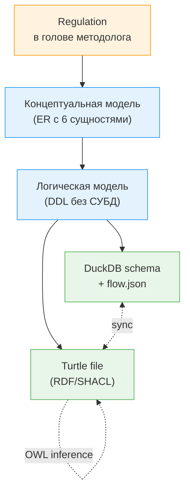

### Мини-практика (10 минут)

Возьми задачку из жизни: **онлайн-кинотеатр типа Кинопоиска**. Нарисуй ER-диаграмму с такими сущностями: Фильм, Актёр, Жанр, Пользователь, Просмотр, Рейтинг. Определи кардинальности. Напиши, какая связь M:N и почему.

Подсказка: фильм-актёр — точно M:N. Просмотр — это связь пользователь-фильм, но с дополнительным атрибутом (когда смотрел, докуда досмотрел) — поэтому это **отдельная сущность**, а не просто связь.

---

### Проект 2 (~18 ч): модель данных для системы записи в стоматологию

**Задача.** «СтомЛайн» — сеть из трёх клиник. Хотят заменить разрозненные таблички Excel единой системой записи на приём. Тебе как аналитику ставят задачу: спроектировать модель данных, написать словарь и сделать семантический слой одного класса.

#### Требования к продукту (вводные)

- Пациент записывается на приём через сайт или по телефону (через регистратора).
- Один приём = пациент + врач + кабинет + слот времени (30/60 минут) + клиника.
- У врача есть специализация (терапевт, ортодонт, хирург, гигиенист).
- У пациента может быть несколько контактных номеров (мобильный, рабочий, родственника).
- Каждый приём может породить медицинские записи (что делали, какие материалы использовали).
- Нужно различать: запись (намерение), приём (фактически состоялся), отмена (запись была, но отменили за N часов).
- Регистратор и пациент должны видеть, какие слоты у врача свободны.

#### Что сдаёшь

**Часть 1: ER-диаграмма (Crow's Foot).** Минимум 6 сущностей. Все связи с кардинальностями. Аргументируй, почему `Appointment` — отдельная сущность, а не связь.

**Часть 2: Словарь данных.** Таблица с колонками для каждого поля каждой сущности: `имя`, `тип`, `обязательно`, `описание`, `единица/формат`, `источник значения`.

**Часть 3: Turtle с базовыми классами.** Три класса минимум: `Patient`, `Appointment`, `Doctor`. По 2-3 свойства на каждый. Должна работать минимум одна связь между классами (например, `Appointment hasPatient Patient`).

```turtle
@prefix dent: <https://stomline.ru/ontology#> .
@prefix xsd:  <http://www.w3.org/2001/XMLSchema#> .

dent:Patient a owl:Class .
dent:Doctor a owl:Class .
dent:Appointment a owl:Class .

dent:hasPatient a owl:ObjectProperty ;
    rdfs:domain dent:Appointment ;
    rdfs:range  dent:Patient .

# далее уже твои данные ...
dent:pt-12345 a dent:Patient ;
    dent:firstName "Иван" ;
    dent:phone "+7-913-..." .
```

**Часть 4: SHACL-валидация одного класса.** Бери `Appointment` и опиши shape: должен быть пациент (1 шт.), врач (1 шт.), время начала (xsd:dateTime, обязательно), длительность (либо 30, либо 60 минут).

**Часть 5: Размышление на полстраницы.** Где ты сознательно нарушил нормальную форму и почему? Где сомневаешься в дизайне? Какие ещё сущности добавишь во второй итерации?

#### Критерии оценки

| Критерий | Вес |
|---|---|
| ER-диаграмма читается и аргументирована | 25% |
| Словарь данных полный и непротиворечивый | 25% |
| Turtle валиден синтаксически (запусти на rdflib) | 20% |
| SHACL покрывает минимум 4 ограничения класса | 20% |
| Рефлексия на полстраницы | 10% |

#### Подсказки

- Не бойся брать M:N связи. У врача — несколько специализаций. У пациента — несколько телефонов.
- `Appointment` — это **не связь** между пациентом и врачом. Это сущность со своими атрибутами (время, статус, материалы).
- `Doctor.specialization` лучше делать FK на отдельную таблицу `Specialization`, а не enum в колонке. Завтра добавится «детский стоматолог» — не придётся менять схему.
- Кабинет может быть отдельной сущностью (`Room`), особенно если в клинике их 10+ и нужно резервировать.

> В следующем спринте мы перейдём к **моделированию процессов** — это даст тебе возможность показывать не только «что хранится», но и «что происходит во времени»: BPMN, UML Activity, State Machine, DFD и наша фирменная Rule DSL Flow.

---

## Спринт 5: Моделирование процессов

### Главное за минуту

Представь Discord: ты бахнул пинг в канале — и вот уже в боте Тостера запустилась команда, она дернула API GitHub, забрала статус PR, перевела его на русский, отправила в канал. **Это процесс**. Цепочка событий, у каждого свой триггер, свой исполнитель, свой результат. Так же устроена городская диспетчерская: жительница позвонила на 112 — диспетчер классифицировал → отправил наряд → наряд приехал → закрыл инцидент → диспетчер отчитался. Если ты умеешь рисовать такие цепочки в формальной нотации — ты можешь автоматизировать их потом без потерь смысла. Если не умеешь — у разработчика будет SQL-запрос вместо процесса, и пользователи будут писать на тебя жалобы. В этом спринте — три классических нотации (BPMN, UML Activity, UML State Machine, DFD) и наша фирменная — Rule DSL Flow.

### О чём эта часть

Любая система — это «что-то происходящее во времени». Данные сами по себе мертвы; жизнь у них появляется в процессах. Аналитик, моделирующий процессы, отвечает на четыре вопроса: **кто** делает, **когда**, **в какой последовательности**, **что получается на выходе**. У каждой нотации свой акцент — одни хороши для бизнес-процессов с людьми, другие для технической логики, третьи — для потоков данных. Понимать когда что применять — навык, который сильно повышает твою стоимость на рынке.

### Ключевые термины

**Бизнес-процесс** — последовательность действий, выполняемых людьми и системами для достижения бизнес-цели. «Принять заявку от жителя», «оформить запись на приём», «выгнать машину со штрафстоянки». Здесь главные сущности — **люди и роли**.

**Технический процесс** — последовательность действий внутри системы. «Прочитать сенсор → распарсить JSON → записать в БД → проверить регламент → отправить алерт». Здесь главные сущности — **код, очереди, события**.

**Смешанный процесс** — самое жизненное. Человек дёргает кнопку — запускается код — потом ещё один человек что-то проверяет. 80% реальных процессов выглядят так.

**Событие** (event) — что-то произошло. Может быть стартовое («поступил звонок»), промежуточное («таймер истёк»), финальное («задача закрыта»).

**Задача** (task) — действие, которое кто-то выполняет. У задачи есть исполнитель (роль), вход, выход, длительность.

**Шлюз** (gateway) — точка ветвления процесса. «Если приоритет высокий — на бригаду; иначе — в очередь». Бывают исключительные (одна ветка) и параллельные (все ветки).

**Pool** (бассейн) — участник процесса верхнего уровня. Обычно — отдельная организация или система. ЕДДС — один пул, бригада спасения — другой.

**Lane** (дорожка) — роль внутри пула. В ЕДДС: «диспетчер 112», «старший смены», «оператор ЦУКС».

**Состояние** (state) — устойчивое положение, в котором находится сущность. Инцидент: «открыт», «назначен», «в работе», «закрыт». Не действия, а статусы.

**Поток данных** (data flow) — куда движутся данные между процессами и хранилищами. В отличие от потока управления (что после чего), здесь главное — что передаётся.

### Контекст в РАГРАФ/LEYKA

- В РАГРАФ моделирование процессов главенствует: **Rule DSL Flow** — это и есть наш фирменный язык. Когда методолог Анна собирает регламент — она рисует граф из 8 типов узлов, и этот граф потом исполняет flow_executor.
- В LEYKA процессы прячутся в жизненном цикле задачи: создана → в работе → review → done → archived. Это UML State Machine как есть.
- В сценарии «звонок жителя» РАГРАФ и LEYKA работают вместе: BPMN-процесс ЕДДС → триггер Rule DSL → REST-вызов в LEYKA → задача исполнителю → возврат отчёта обратно в audit_log РАГРАФ.

### BPMN: основы для аналитика

BPMN (Business Process Model and Notation) — индустриальный стандарт OMG. Главная нотация для **процессов с людьми**. Если у тебя в процессе есть как минимум один человек, который что-то решает — BPMN твой друг.

Минимальный набор элементов:

| Элемент | Как выглядит | Что значит |
|---|---|---|
| **Событие старта** | Тонкий круг | Сюда «зашёл» процесс. Может быть «поступил звонок», «истёк таймер» |
| **Задача** | Прямоугольник со скруглёнными углами | Действие. Подвиды: user task (человек), service task (система), script task (код) |
| **Шлюз эксклюзивный** | Ромб с X внутри | «Если/иначе» — выбирается одна ветка |
| **Шлюз параллельный** | Ромб с + внутри | «И, и» — выполняются все ветки одновременно |
| **Событие конца** | Жирный круг | Процесс завершён |
| **Стрелка управления** | Сплошная линия со стрелкой | Что идёт после чего |
| **Стрелка сообщения** | Пунктирная линия со стрелкой | Передача данных между пулами |
| **Pool** | Большой прямоугольник вокруг всего | Участник процесса (организация/система) |
| **Lane** | Горизонтальная полоса внутри pool | Роль внутри участника |

#### Пример: обработка заявки от жителя через ЕДДС

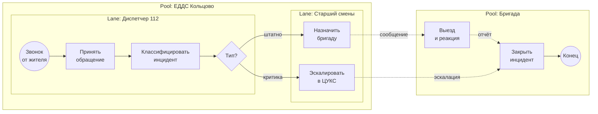

Прочитай вслух: «Жительница звонит → диспетчер принимает обращение → классифицирует → решает: критика или штатно. Если критика — эскалирует старшему смены, тот в ЦУКС. Если штатно — назначает бригаду. Бригада выезжает, реагирует, закрывает инцидент». Это **формальный пересказ** процесса, который раньше был только в голове у дежурных.

**Где BPMN выигрывает**: процессы с участием людей, передачами между ролями, шлюзами «если-иначе». Любой банковский процесс, любой HR-процесс, любая регистратура.

**Где BPMN проигрывает**: чисто технические процессы (потоки данных), реактивные системы (что-то приходит → что-то срабатывает), потоки правил. Там BPMN превращается в визуальный мусор.

### UML Activity Diagram — кузен BPMN

Activity Diagram — это «BPMN в стилистике UML». По смыслу почти одно и то же, но:

- Меньше элементов (нет pool/lane, есть «партиции»).
- Поведение объекта (можно показать состояние данных).
- Совместимость со всей семьёй UML — Sequence, Class и т.д.

**Когда выбирать Activity Diagram вместо BPMN**:

| Когда | Выбор |
|---|---|
| Процесс прежде всего с людьми, нужен заказчик-friendly формат | BPMN |
| Процесс внутри программы, нужна совместимость со всем UML | Activity Diagram |
| Уже есть UML-документация системы | Activity Diagram (единообразие) |
| Внешний аудит по ISO/госстандартам | BPMN (чаще требуют) |

### UML State Machine — для жизненного цикла объекта

Иногда не важна **последовательность действий**, важны **статусы** объекта. Тогда — State Machine.

#### Пример: жизненный цикл инцидента в audit_log РАГРАФ

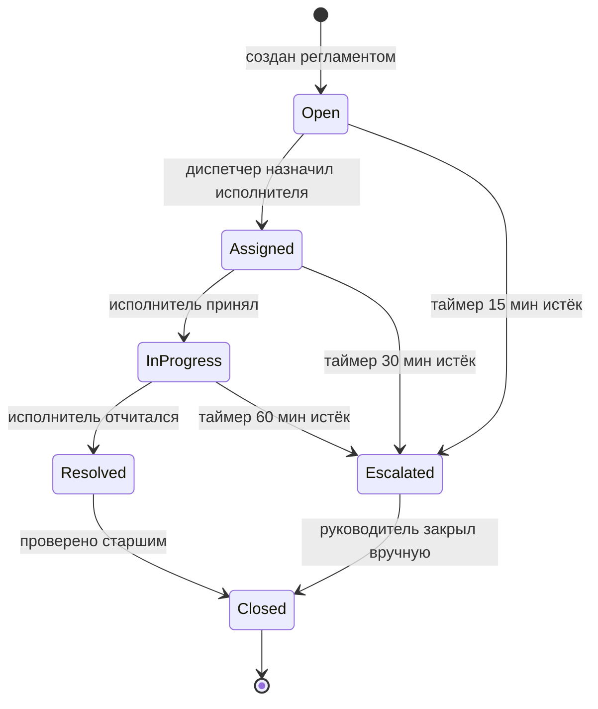

Тут видно: у инцидента 6 состояний и 9 переходов. Каждый переход — это **событие** (отчёт, истечение таймера, ручное действие). Состояния — взаимоисключающие: инцидент не может быть одновременно `Open` и `Resolved`.

State Machine хороша когда:

- объект имеет дискретный набор статусов;
- есть строгие правила переходов («из Resolved нельзя в Open, только в Closed»);
- нужно автоматически документировать enum-поле `status` в БД.

В LEYKA то же самое — у задачи (`Task`) есть конечный автомат: `todo → in_progress → review → done`. И есть запрещённые переходы (нельзя из `done` обратно в `todo` без перепрохождения review).

### DFD: Data Flow Diagram

DFD — самая старая из техник, ей лет 50. Когда не важен **поток управления**, а важно **что и куда передаётся** — DFD.

Нотация Гейна-Сарсона:

| Элемент | Как выглядит | Что значит |
|---|---|---|
| **Процесс** | Скруглённый прямоугольник | Обработчик данных |
| **Хранилище данных** | Открытый прямоугольник (две полосы) | БД, файл, кэш |
| **Внешняя сущность** | Квадрат | Источник или приёмник вне системы |
| **Поток данных** | Стрелка с подписью | Что передаётся |

#### Пример: поток данных в РАГРАФ

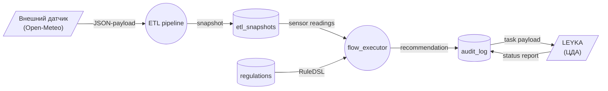

В этом виде:
- Open-Meteo и LEYKA — внешние сущности (вне РАГРАФ);
- ETL pipeline и flow_executor — процессы внутри РАГРАФ;
- etl_snapshots, regulations, audit_log — хранилища (таблицы DuckDB);
- стрелки — что передаётся, не **как** и не **когда**.

**Когда DFD незаменим**: при проектировании интеграций, ETL-пайплайнов, аналитике потоков данных. На него очень удобно показывать пальцем при разборе багов «откуда взялась эта цифра».

**Когда DFD не нужен**: для процессов с людьми и шлюзами «если-иначе» — там BPMN-Activity сильнее.

### Главная фишка спринта — Rule DSL Flow

А теперь самое интересное. У РАГРАФ есть **свой собственный язык моделирования процессов** — Rule DSL. Он специально заточен под предметную область «реактивные правила реагирования» — и в этой нише уделывает BPMN/Activity на голову.

#### Что такое DSL

DSL (Domain-Specific Language) — язык, специализированный под предметную область. SQL — DSL для запросов к БД. Regex — DSL для текста. **Rule DSL — DSL для правил реагирования**.

Узкая специализация — это и сила, и ограничение. Сила: проще, выразительнее в своей нише, меньше элементов. Ограничение: за пределами ниши непригоден.

#### 8 типов узлов Rule DSL с метафорами

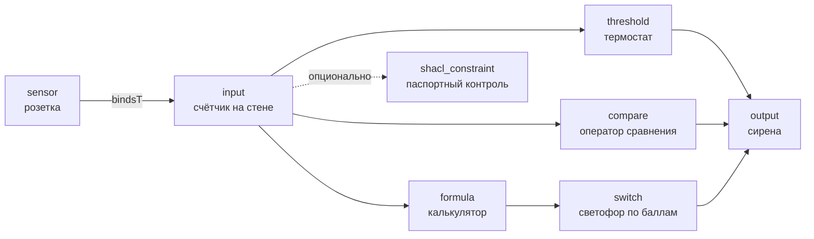

| Узел | Что делает | Метафора из жизни |
|---|---|---|
| **sensor** | Подцепляет конкретный канал данных | Розетка в стене — без неё прибор не включишь |
| **input** | Параметр регламента, на который кладётся значение | Счётчик электричества — показывает то, что нагрелось в розетке |
| **threshold** | Сравнивает с эталоном ± допуск | Термостат в холодильнике — выше 8°С пищит |
| **compare** | Просто оператор сравнения (>, <, =) | Калькулятор: `<`, `>`, `=` |
| **formula** | Вычисляет выражение | Калькулятор повеселее: `(a + b) / 2` |
| **switch** | Развилка по значению (до 6 кейсов) | Светофор: 0-2 балла зелёный, 3-5 жёлтый, 6+ красный |
| **output** | Действие при срабатывании | Сирена + текст рекомендации |
| **shacl_constraint** | Проверка соответствия онтологии | Паспортный контроль на границе — данные правильные? |

#### Чем Rule DSL отличается от BPMN

| | BPMN | Rule DSL Flow |
|---|---|---|
| Размер языка | ~50 элементов | 8 типов узлов |
| Главный пользователь | Аналитик-бизнес | Аналитик-методолог |
| Главный процесс | Бизнес-процесс с людьми | Реактивная реакция системы на сигнал |
| Поддержка ролей (lanes) | Есть | Нет |
| Поддержка таймеров | Есть | Нет (пока) |
| Логика «если-иначе» | Шлюзы | threshold + switch |
| Расчёт численных значений | Костыли | formula-узел |
| Семантическая проверка | Нет | shacl_constraint |
| Время освоения новичком | 1-2 недели | 1-2 дня |

Это компромисс. **Rule DSL уделывает BPMN в нише реактивных правил.** Меньше элементов = быстрее освоить. Узкая специализация = выразительнее в своей задаче.

Но в нише «как банк выдаёт кредит, где работают 5 человек на 3 этапах» — BPMN сильнее, потому что у него pool, lane, и подключение к человеческим ролям.

#### Когда Rule DSL выигрывает

- Реактивная логика: «событие → проверка → действие»;
- Численные пороги: температура, влажность, концентрация;
- Простые цепочки решений;
- Нужно объяснить непрограммисту: показал блоки на проекторе → понял.

#### Когда Rule DSL проигрывает

- Многошаговый процесс с участием 3+ людей;
- Нужно делегирование («если не отвечает 15 минут — передать другому»);
- Параллельные ветки с синхронизацией;
- Условная очерёдность (если A, то после B, иначе после C).

В таких случаях — BPMN или Activity. Rule DSL — про **точечную реакцию системы**, BPMN — про **процесс с людьми**.

#### Один и тот же сценарий в BPMN и Rule DSL

Возьмём задачу: **«Температура серверной выше 28 → SMS дежурному. Выше 30 → эскалация начальнику».**

**В BPMN:**

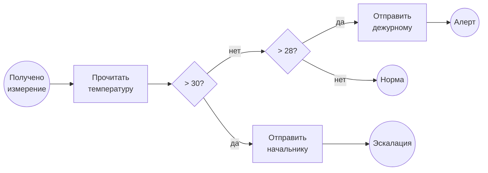

Слишком много элементов на простую задачу. И стрелки рисовать-перерисовывать.

**В Rule DSL Flow:**

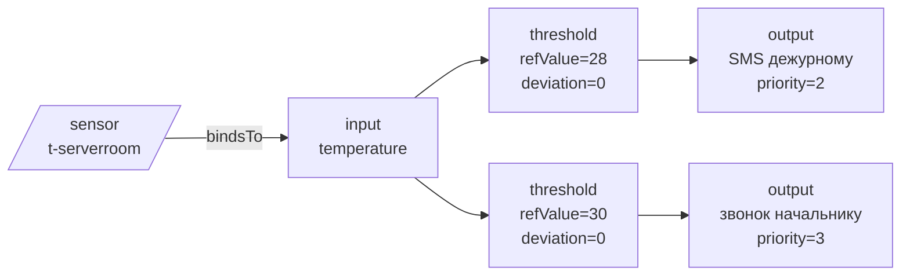

Те же 5 узлов, но без шлюзов и явных «если». Каждый threshold сам решает, сработать ему или нет. Когда вычислитель прогоняет flow, у выходов выставится priority — flow_executor возьмёт максимальный. Получается **одна и та же логика в двух разных абстракциях**.

Аналитик в РАГРАФ собрал это мышкой за 5 минут. В BPMN он бы потратил 20 — на ровном месте, потому что для такой задачи BPMN избыточен.

#### Где Rule DSL живёт в коде

| Что | Где |
|---|---|
| Описание узла | `backend/app/schemas/domain.py` (`FlowNode`) |
| Исполнитель | `backend/app/services/flow_executor.py` |
| UI-редактор | `frontend/src/components/flow/FlowEditorScreen.tsx` |
| JSON-хранилище | `data/flows/{regulation_id}.json` |

### Мини-практика (15 минут)

Возьми регламент **«Контроль температуры серверной»**. На листочке нарисуй Rule DSL:

1. Один sensor с типом `t` (температура), подтип `t-serverroom`, externalId `current.temp_c`;
2. Один input с paramRef `temperature`;
3. Два threshold:
   - Узел 1: refValue=28, deviation=0 (мягкое превышение)
   - Узел 2: refValue=30, deviation=0 (критика)
4. Два output:
   - Узел 1: action=`send_sms`, text="Температура серверной {temperature}°C, проверь систему охлаждения", priority=2
   - Узел 2: action=`escalate_call`, text="Критическое превышение в серверной", priority=3
5. shacl_constraint на input: значение temperature должно быть decimal в диапазоне -50..100 (физически осмысленное).

Нарисуй стрелки и проверь, что:
- sensor → input через bindsTo;
- input идёт в оба threshold;
- каждый threshold идёт в свой output;
- shacl-узел подвешен пунктиром на input.

Ответь себе: что произойдёт при температуре 27.5, при 28.5, при 30.1, при 999 (баг)?

> В следующем спринте мы перейдём к **пользовательским интерфейсам** — это даст тебе возможность сформулировать, что видит человек на экране, в каком порядке и почему: персоны, wireframes, journey maps, cockpit vs Telegram-style Лента.

---

## Спринт 6: Пользовательские интерфейсы

### Главное за минуту

Tinder — это интерфейс, который заставил миллионы людей принимать одно решение по 50 раз в день: свайп влево или вправо. У него ровно одна задача, ноль лишнего. Госуслуги — обратный полюс: уродливая форма ввода полиса, но это интерфейс для каждой бабушки, которая зашла оплатить штраф. Между ними — целая вселенная подходов. Системный аналитик в продуктах класса РАГРАФ/LEYKA не «дизайнит» (это работа дизайнера), но он **формулирует**, что пользователь делает в системе, в каком порядке, какие у него боли и какие данные ему нужны на экране. В этом спринте — персоны, сценарии, journey map, информационная архитектура, wireframes, и краем глаза заглянем в HTML/CSS/React — чтобы потом не теряться при общении с фронтенд-разработчиком.

### О чём эта часть

Базы данных и процессы — это «что внутри системы». А интерфейс — «что снаружи, на стороне человека». Аналитик-стажёр (junior) часто думает, что фронт — это дело дизайнера. На практике дизайнер рисует красоту, но **логику взаимодействия** придумывает аналитик: какие экраны, в каком порядке, что должно быть наверху, что внизу, какие данные показать. Если аналитик не делает эту работу — её сделает разработчик «по интуиции», и результат будет «работает, но никто не пользуется». Половина провалов внутренних корпоративных систем — это.

### Ключевые термины

**Персона** (persona) — собирательный портрет типичного пользователя системы с именем, возрастом, должностью, болью и целью. Не реальный человек, а архетип. Помогает команде договариваться: «эту фичу делаем не вообще, а конкретно для Виктора».

**Use Scenario** — пошаговое описание, как пользователь выполняет конкретную задачу в системе. От триггера («захотел купить кофе») до закрытия задачи («заплатил и забрал»). Без UI-деталей — только последовательность действий.

**User Journey Map (UJM)** — путь пользователя через систему **с эмоциями и точками боли**. Карта, где видно: вот тут он улыбается, тут хмурится, тут вообще бросает приложение и идёт ругаться в техподдержку. UJM показывает не только что человек делает, но и что чувствует.

**Use Case** — формальная нотация UML для описания взаимодействия пользователя (актора) с системой. Менее модный сейчас формат, в моде Use Scenario.

**Информационная архитектура (IA)** — структура контента и навигации в продукте. Site map для сайта, structure diagram для приложения. Отвечает на вопрос «что-где лежит».

**Wireframe** (lo-fi) — низкодетализированный чертёж экрана. Чёрно-белый, без шрифтов и цветов. Главное — расположение блоков и текст. Чтобы быстро согласовать структуру без споров «а почему синенький, я бы зелёненький».

**Mockup** (hi-fi) — высокодетализированный макет. Уже с цветами, шрифтами, иконками. Близок к финальному виду.

**Prototype** — кликабельный макет. Можно потыкать в Figma и проверить путь пользователя.

**Information density** (плотность информации) — сколько данных одновременно на экране. У TikTok — 1 видео = 0 плотности. У Bloomberg-терминала трейдера — 50 чисел на экране = максимум.

### Контекст в РАГРАФ/LEYKA

В РАГРАФ интерфейсы делятся на два класса:

- **«Cockpit»-интерфейсы** для оператора (Live ETL, дашборд диспетчера) — высокая плотность информации. Нужно много данных на экране одновременно. Стиль — Bloomberg-терминал.
- **«Editor»-интерфейсы** для методолога (Regulation Editor, Flow Editor) — фокус на одной задаче. Stиль — Figma, IDE.

В LEYKA интерфейс один — **«Telegram-style» Лента**. Потому что Telegram уже научил каждого взаимодействовать с лентой сообщений; нет смысла переизобретать.

### Персоны: три портрета РАГРАФ

#### Персона 1: Методолог Анна, 35 лет

**Должность**: Главный методолог-аналитик в Управлении ЕДДС Кольцово.

**История**: Закончила Управление и юр.факультет 12 лет назад. Раньше работала в Роспотребнадзоре, переписывала СанПиН в простые инструкции для дежурных. В РАГРАФ пришла за инструментом — нужно формализовать 30 регламентов реагирования к концу года.

**Боль**:
- «Регламенты сейчас в 4 разных Excel + 2 в Word. Никто не помнит, какой актуальный.»
- «Раньше я диктовала логику программисту, он писал код, который я не понимаю — и я не могла потом проверить.»
- «В прошлый раз СанПиН поменялся — я три месяца искала, где про PM2.5 у нас правило прописано.»

**Цель**: собрать все регламенты в один инструмент, отслеживать их версионность и иметь возможность показать любой пункт начальству с трассировкой до СанПиН.

**Что для неё в РАГРАФ**: Regulation Editor с трёхрежимной формой (YAML / Tree / Sliders), Flow Editor для логики, экраны RAG-поиска по нормативке.

#### Персона 2: Оператор Виктор, 50 лет

**Должность**: Дежурный оператор ЦУКС.

**История**: 28 лет в пожарной охране, переведён на ЦУКС год назад. Компьютер — да, базово; Excel — да; но «всё, что выше — пусть молодёжь делает». Главное — не пропустить инцидент.

**Боль**:
- «Слишком много окон. Сразу 8 систем открыты — пожарная, медицина, ЕДДС, видео — не успеваю переключаться.»
- «Когда система выдаёт алерт — я не понимаю, **почему** он сработал. Просто кнопка красная.»
- «Звонит начальник — спрашивает: что случилось? Я знаю что, но не могу объяснить почему именно сейчас.»

**Цель**: видеть в одном окне самое важное и быстро понимать ситуацию. Минимум кликов до результата.

**Что для него в РАГРАФ**: Live ETL экран, который мы как раз и проектируем; PROV-O трасса каждого алерта; кнопка «передать в LEYKA как задачу» в один клик.

#### Персона 3: Лариса, руководитель ЕДДС, 45 лет

**Должность**: Начальник Управления ЕДДС.

**История**: Закончила МВД, работала в ГИБДД, потом в МЧС, последние 5 лет руководит ЕДДС Кольцово. Управляет 15 сотрудниками. Лично код не пишет, но интегральную аналитику любит и понимает.

**Боль**:
- «На совещаниях у мэра меня спрашивают: сколько мы сэкономили времени? А я отвечаю интуицией.»
- «Депутаты приезжают раз в полгода — нужны цифры и графики. Где взять? У всех в Excel разное.»
- «Если уволятся 2 ключевых сотрудника — система рассыпется, потому что многое в головах.»

**Цель**: иметь дашборд с KPI ЕДДС, метриками реагирования и возможностью показать любому проверяющему «почему вот это решение».

**Что для неё в РАГРАФ**: дашборд руководителя со срезами по доменам, выгрузка отчётов в PDF, аудит-трасса любого инцидента.

### Use Scenario: Анна вечером настраивает регламент

Сценарий **«Создание нового регламента для управдома»**:

1. **17:30**. Анне приходит mail от начальника: «срочно — управдом из дома №5 жалуется, что не получает алерты о давлении в трубах. Нужен новый регламент к завтра.»
2. **17:35**. Анна открывает РАГРАФ. Идёт в раздел `/regulations`, нажимает «Создать новый».
3. **17:36**. Выбирает домен — `gkh` (ЖКХ). Появляется шаблон с параметрами по умолчанию.
4. **17:38**. Открывает Regulation Editor → вкладку `Parameters`. Добавляет два параметра: `pressure_water_hot` (давление горячей воды, минимум 0.3, максимум 0.6 МПа) и `pressure_water_cold` (холодной, 0.2-0.5 МПа). У каждого ставит `source_clause` со ссылкой на СНиП.
5. **17:42**. Идёт во вкладку `Triggers`. Добавляет два триггера на сенсор `p-water-hot` и `p-water-cold`.
6. **17:45**. Открывает Flow Editor. Перетаскивает мышкой:
   - 2 sensor-узла;
   - 2 input-узла;
   - 4 threshold-узла (по 2 на каждый параметр: «ниже минимума» и «выше максимума»);
   - 2 output-узла («SMS управдому» и «звонок аварийке»).
7. **17:53**. Соединяет рёбрами. Появляется красная подсказка валидации — забыла привязать sensor к input через bindsTo. Чинит.
8. **17:55**. Нажимает «Тест». Подставляет тестовое значение 0.25 — flow срабатывает на «ниже минимума» → output на управдома. Ок.
9. **17:58**. Сохраняет регламент. Нажимает «Опубликовать». Система помечает версию 1.0 в audit_log.
10. **18:00**. Анна закрывает ноут. Регламент готов к утреннему включению.

**Что мы видим из сценария**: 30 минут, 10 шагов, ноль кода. Это то, ради чего РАГРАФ существует.

### User Journey Map: Виктор утром

UJM для **«Утро оператора Виктора»**, от прихода на смену до закрытия первого инцидента:

```mermaid
journey
    title Виктор: утро дежурного
    section 07:50 заходит на работу
      Распечатать сводку: 3: Виктор
      Залогиниться в РАГРАФ: 4: Виктор
      Открыть Live ETL: 5: Виктор
    section 08:15 алерт по воздуху
      Звуковой сигнал: 3: Виктор
      Найти, что мигнуло: 2: Виктор
      Прочитать рекомендацию: 4: Виктор
      Понять, почему сработало: 3: Виктор
    section 08:25 действие
      Кликнуть "передать в LEYKA": 5: Виктор
      Дождаться подтверждения: 4: Виктор
      Записать в журнал: 4: Виктор
    section 08:35 завершение
      Получить отчёт от исполнителя: 5: Виктор
      Закрыть инцидент: 5: Виктор
```

Что важно: **в зоне «найти, что мигнуло» оценка 2 (низкая)**. Это болевая точка — Виктор должен в куче алертов найти конкретный, по которому пищит. Дизайн-задача: подсвечивать конкретный блок Live ETL, по которому пришёл алерт. Без UJM эту боль никто бы не описал.

UJM — основной инструмент **поиска точек боли**. По нему потом аналитик пишет требования: «при поступлении алерта — звуковой сигнал + автоскролл к строке + подсвечивание цветом».

### Информационная архитектура: как организовать РАГРАФ

Левый sidebar РАГРАФ — это видимая часть информационной архитектуры. Структура:

```
РАГРАФ
├── Регламенты
│   ├── /regulations (список всех)
│   ├── /regulations/{id} (карточка)
│   ├── /regulations/{id}/flow (Flow Editor)
│   └── /regulations/tree (иерархия)
├── Цифровые двойники
│   └── /twins (Twin Designer)
├── База знаний
│   ├── Параметры (/parameters)
│   ├── Датчики (/sensors)
│   ├── Модули (/modules)
│   └── Ограничения SHACL (/constraints)
├── Аналитика
│   ├── Live ETL (/live)
│   ├── Audit-log (/audit)
│   └── Coverage matrix (/coverage)
├── Граф знаний
│   ├── Граф (/graph)
│   └── SPARQL (/sandbox)
└── Документация
    ├── Глоссарий (/docs/glossary)
    └── Архитектура (/docs/arc)
```

Принципы организации:
- **Главные сущности — вверху**. Регламенты — главное.
- **Инфраструктура — в середине**. Параметры/датчики/модули — то, из чего собираются регламенты.
- **Аналитика — внизу, но видна**. Live ETL — для оператора, а оператор использует РАГРАФ редко.
- **Документация — в самом низу**. Открывают по необходимости.

В LEYKA архитектура иная — там центр это **Лента сообщений**, а проекты-задачи — справа. Потому что LEYKA — мессенджер по идее, и пользователь в первую очередь скроллит ленту, а во вторую — лезет в задачу.

### Wireframes vs Mockups

| | Wireframe (lo-fi) | Mockup (hi-fi) |
|---|---|---|
| Цвет | Чёрно-белый | Цветной |
| Шрифт | Системный, простой | Финальный |
| Иконки | Серые квадратики или «X», «O» | Финальные |
| Текст | Заглушки «Lorem ipsum» или плейсхолдеры | Финальные |
| Цель | Согласовать **структуру** | Согласовать **внешний вид** |
| Кто рисует | Аналитик/UX | UX-дизайнер |
| Время на штуку | 10 минут | 1-2 часа |
| Где жить | Excalidraw, Whimsical | Figma |

**Правило**: сначала всегда wireframe. Mockup имеет смысл только когда структура зафиксирована. Иначе перерисовывать в Figma по 5 раз — расходный материал для нервной системы дизайнера.

### Прототипирование: Figma vs Excalidraw

| Инструмент | Когда |
|---|---|
| **Excalidraw** | Быстрые наброски «прямо сейчас на созвоне». Минимум форматирования, максимум скорости. Хорошо для аналитика. |
| **Whimsical** | Wireframes с готовыми UI-компонентами, проще чем Figma. Промежуточный уровень. |
| **Figma** | Полноценные mockups + интерактивный prototype. Стандарт индустрии. |
| **Miro** | Когда нужно совместить wireframes + флоучарты + комментарии в одной доске. |

Аналитик 95% времени живёт в **Excalidraw/Whimsical**, иногда лазит в Figma посмотреть финальные макеты. Дизайнер живёт в Figma.

### UX для систем класса РАГРАФ/LEYKA

Тут есть несколько особенностей, которые отличают эти системы от типового стартапа:

#### 1. Пользователь должен видеть «почему»

Если LEYKA — ну, ОК, кнопка «отправить» отправила сообщение. Просто и понятно. **В РАГРАФ так нельзя**. Если система сказала «эскалация в ЦУКС» — оператор должен мочь нажать на алерт и увидеть **PROV-O трассу**: какой датчик, какое значение, какое правило, какой пункт СанПиН.

Это требование к UI: **у каждого результата должна быть ссылка «откуда».** Если её нет — система превращается в чёрный ящик, и оператор перестаёт ей верить.

#### 2. Минимум кликов до результата

У Виктора-оператора 8 систем открыто одновременно. Если в РАГРАФ от алерта до действия — 5 кликов, **он потеряет нить**. Цель — 1-2 клика. Кнопка «Передать в LEYKA как задачу» прямо в строке алерта.

#### 3. Информационная плотность как у Bloomberg-терминала

Live ETL экран РАГРАФ — это «cockpit». Плохой UX-дизайнер скажет «много данных, давайте уберём». Хороший аналитик скажет «много данных = так и надо, оператор привык, и ему так быстрее».

Нельзя путать **корпоративные cockpit-системы с consumer-приложениями**. У TikTok принцип «одно видео — один свайп», у Bloomberg-терминала — «50 чисел сразу видно». Live ETL — это второе.

#### 4. LEYKA-стиль: чат-Лента как Telegram

LEYKA выбрала интерфейс ленты-как-в-Telegram сознательно. Потому что:
- Каждый знает, как пользоваться чатом.
- 0 затрат на обучение.
- Видна история взаимодействий «снизу вверх», новое снизу.

**Принцип привычности паттернов**: если есть знакомый UX-паттерн (Telegram-лента, Tinder-свайп, IDE-три-панели) — используй его, не изобретай. Изобретать имеет смысл только если вы делаете что-то принципиально новое (тогда привет, Spotify в 2008).

### Введение в HTML/CSS/JS для аналитика

Аналитик не пишет фронтенд. Но **должен уметь читать** HTML и CSS, чтобы:
- понимать, что технически реально, а что нет;
- описывать требования в терминах, понятных разработчику;
- разбираться в багах «у меня кнопка не нажимается».

#### HTML за 5 минут

HTML — это **скелет страницы**. Размечает, где что лежит.

```html
<div class="card">
  <h2>Регламент: Контроль температуры</h2>
  <p>Если выше 28°C — отправить SMS дежурному.</p>
  <button>Открыть</button>
</div>
```

`<div>` — это контейнер. `<h2>` — заголовок второго уровня. `<p>` — параграф. `<button>` — кнопка. Атрибут `class="card"` — пометка, к которой потом CSS применяет стиль.

#### CSS за 5 минут

CSS — это **внешний вид**. Описывает, как HTML выглядит.

```css
.card {
  background-color: white;
  border-radius: 8px;
  padding: 16px;
  box-shadow: 0 2px 4px rgba(0,0,0,0.1);
}
```

Это значит: у всех элементов с `class="card"` — белый фон, скруглённые углы, отступ внутри 16 пикселей и лёгкая тень.

#### JS за 5 минут

JS (JavaScript) — это **поведение**. Что происходит, когда пользователь нажимает.

```javascript
document.querySelector('button').addEventListener('click', () => {
  alert('Открываем регламент');
});
```

«Возьми кнопку, повесь на неё обработчик клика, при клике покажи всплывашку».

Это всё. Дальше — глубже, но для аналитика этого хватит, чтобы говорить с фронтом на одном языке.

### Tailwind как design-system РАГРАФ

В РАГРАФ мы используем **Tailwind CSS** — это не дизайнерская библиотека, а **методология**: вместо описывать кучу классов в CSS-файле, ты пишешь стили прямо в HTML-классах.

```html
<div class="bg-white rounded-lg p-4 shadow-sm">
  <h2 class="text-lg font-bold">Регламент</h2>
  <p class="text-sm text-gray-600">Контроль температуры</p>
</div>
```

Где:
- `bg-white` — белый фон;
- `rounded-lg` — скругление 8px;
- `p-4` — отступ 16px;
- `shadow-sm` — лёгкая тень;
- `text-lg` — крупный шрифт;
- `font-bold` — жирный;
- `text-gray-600` — серый цвет.

**Зачем это аналитику**: когда дизайнер согласовывает с тобой макет в Figma, ты можешь говорить с разработчиком на одном языке: «здесь сделай отступ p-4, а цвет gray-600». Это резко сокращает циклы правок.

### React-компонент глазами аналитика

В РАГРАФ фронт написан на React + TypeScript. Аналитику нужно понимать, что такое **компонент** и **props**.

**Компонент** — переиспользуемый кусок UI. Например, `<Button>` или `<Modal>` (модальное окно). У него есть **props** — параметры, которые ему передают.

```tsx
<Button variant="primary" onClick={handleSave}>Сохранить</Button>
```

Аналитик в требованиях пишет так:
- Используем компонент `Button`;
- variant — `primary` (основной стиль);
- лейбл — «Сохранить»;
- по клику — вызвать функцию сохранения.

Если компонента не существует в дизайн-системе — это можно увидеть и обсудить с дизайнером **до** того, как разработчик потратит время на самописный.

Распространённые компоненты в РАГРАФ:
- `<Button>` — кнопка с variant: primary, secondary, danger;
- `<Modal>` — модальное окно;
- `<Form>` — обёртка формы с валидацией;
- `<Table>` — таблица с сортировкой и фильтрами;
- `<Card>` — карточка-контейнер;
- `<Tabs>` — переключатель вкладок (как в Regulation Editor: YAML / Tree / Sliders).

В требованиях не описывают «как нарисовать кнопку». Описывают **семантику**: «это primary-кнопка, она запускает сохранение». Дальше дизайн-система разрулит сама.

### Мини-практика: спроектируй экран Live ETL для управления котельной

**Задача**: в РАГРАФ добавляется новый сектор — **«Управление котельной микрорайона»**. Тебе как аналитику нужно описать новый экран Live ETL для оператора котельной.

**Контекст**:
- Котельная обслуживает 12 жилых домов.
- Параметры: температура подачи (`t-supply`), температура обратки (`t-return`), давление в системе (`pressure`), расход газа (`gas-flow`).
- На каждом параметре стоят датчики, шлющие данные раз в минуту.
- У оператора 4 регламента: «давление падает», «температура подачи ниже нормы», «расход газа выше нормативного», «дельта T (подача-обратка) меньше 30°C».

#### Что сдаёшь

**Часть 1: персона оператора котельной.** Имя, возраст, должность, история, боль, цель. Опиши на 5-7 предложений.

**Часть 2: Use Scenario.** «Оператор Иван заступает на смену в 7:00». 10-15 шагов от прихода до первого алерта.

**Часть 3: Wireframe в текстовом виде.** Опиши экран как набор блоков сверху вниз:

```
+----------------------------------------------------------+
| HEADER: Логотип РАГРАФ | Сектор: Котельная М-н-7 | Иван |
+----------------------------------------------------------+
| SIDEBAR  | MAIN AREA:                                    |
|          |                                               |
| - Live   | [Гридка из 4 карточек параметров с цифрами] |
| - Audit  | [Подсветка карточки красным если алерт]      |
|          |                                               |
|          | [График всех 4 параметров за последний час]  |
|          |                                               |
|          | [Лента алертов с кнопкой 'Передать в LEYKA'] |
+----------+-----------------------------------------------+
```

**Часть 4: Перечень React-компонент.** Какие компоненты задействуем? Какие нужно добавить новые? Например:
- `<KPICard>` для каждого параметра — есть? Можно ли переиспользовать?
- `<TimeSeriesChart>` для графика — есть?
- `<AlertFeed>` для ленты алертов — нет, надо добавить.

**Часть 5: Информационная плотность.** Сколько одновременно на экране элементов: 4 параметра + 1 график + 5 последних алертов = 10. Это много или мало для cockpit-режима? Аргументируй.

#### Критерии оценки

| Критерий | Вес |
|---|---|
| Персона раскрыта (есть боль и цель) | 15% |
| Use Scenario 10+ шагов и реалистичен | 20% |
| Wireframe читается без объяснений | 25% |
| Перечень компонент с обоснованием reuse | 25% |
| Аргументация плотности информации | 15% |

#### Подсказки

- На карточке параметра показывай: имя, текущее значение, единицу измерения, маленький trend-индикатор (↑↓→) и норматив (отдельно или как фон-зону).
- Если карточка в alert-состоянии — она должна быть **визуально другой**: красная рамка, мигание, иконка-восклицание.
- Для оператора котельной 4 параметра одновременно — норма. Можно даже 8, если это его привычная картина.
- Не забудь про **кнопку «PROV-O трасса»** на каждом алерте — это требование РАГРАФ.

---

> **Конец блока B.** Дальше в блоке C — следующие три спринта: Agile-практики для системного аналитика, архитектура системы и программные интерфейсы (API). До встречи.

## Блок C. Методологии и архитектура — как делать платформу

> Если первые два блока курса научили тебя видеть систему и описывать предметку, то этот блок — про то, как **строить**. Сначала про то, как организовать работу команды (Agile), потом про то, как разложить систему по полочкам (архитектура), и наконец про то, как куски системы говорят друг с другом (API). Этот блок — стык методологии и инженерии: дальше ты уже не аналитик-наблюдатель, а аналитик-проектировщик, который кидает свои user story в спринт, понимает, что архитектор имел в виду под «положим в Knowledge-слой», и читает OpenAPI без помощи разработчика.

---

## Спринт 7: Agile-практики для системного аналитика

### Главное за минуту

Agile — это не «у нас стендапы по утрам», а способ строить продукт так, чтобы не сжечь полгода на фичу, которая никому не нужна. Представь, что ты готовишь борщ впервые: можно прочитать книгу про борщ от корки до корки, всё купить, варить шесть часов и в конце узнать, что свекла была плохая (это Waterfall). А можно сварить минимальный борщ за час, дать попробовать, поправить соль и продолжать улучшать (это Agile). РАГРАФ так и родился — сначала один регламент, который работает целиком от датчика до уведомления, потом ещё один, потом редактор, потом интеграция с LEYKA. Если бы мы заранее расписали весь функционал «РАГРАФ 1.0», мы бы до сих пор писали ТЗ.

### О чём эта часть

Системный аналитик в Agile — это не «человек, который пишет ТЗ» (этой роли в Agile почти не осталось), а человек, который:

- превращает идеи бизнеса в **user stories** размером с спринт;
- следит, чтобы каждая история была понятна разработчику и тестировщику;
- защищает приоритеты и не даёт продакту впихнуть «ещё чуть-чуть» в текущий спринт;
- собирает обратную связь и пишет следующие истории на её основе.

В этом спринте ты научишься писать user stories, нарезать большие хотелки на маленькие куски, оценивать их без часов, и собирать карту историй для MVP.

### Ключевые термины

- **Спринт** — фиксированный отрезок времени (обычно 2 недели), за который команда выпускает работающий инкремент.
- **Бэклог** — отсортированный по приоритету список того, что ещё надо сделать.
- **User Story** — короткое описание ценности с точки зрения пользователя.
- **MVP** — минимальная версия продукта, которая уже приносит пользу.
- **Story Point** — единица оценки сложности задачи, не связанная с часами.

---

### 7.1. Agile vs Waterfall: на контрасте Σ Сигмы и РАГРАФ

Чтобы понять, зачем Agile, посмотрим, что бывает без него.

**Σ Сигма** в 2018 году разрабатывалась как госконтракт по полной Waterfall-методике:

1. Полгода писали ТЗ на 400 страниц.
2. Согласовывали ТЗ по всем заинтересованным ведомствам — ещё полгода.
3. Разработка — полтора года, по плану.
4. Приёмо-сдаточные испытания — ещё три месяца.
5. На приёмке выяснилось, что половина требований устарела: пожарники перешли на другую систему, в часть зданий поставили новые датчики с другим протоколом.

Это классический Waterfall: жёсткая последовательность фаз, изменения дорогие.

**РАГРАФ** в 2025 году делается стартап-стилем:

1. Двухнедельный спринт 1: один регламент, один датчик, ручное оповещение. **Работает целиком**.
2. Спринт 2: ещё один регламент + сохранение в DuckDB.
3. Спринт 3: REST API наружу.
4. Спринт 4: первый кусок UI — список регламентов.
5. Спринт 12: интеграция с LEYKA.

После каждого спринта можно показать пользователю что-то живое. Если на третьем спринте выяснится, что регламенты надо хранить не в DuckDB, а в чем-то ещё — мы потеряем максимум одну итерацию, а не полгода.

| Параметр | Waterfall | Agile |
|---|---|---|
| Когда фиксируется объём | Заранее | Постоянно пересматривается |
| Когда видно результат | В конце | После каждого спринта |
| Стоимость изменения | Растёт квадратично | Стабильна |
| Документация | Толстое ТЗ | Живой бэклог + код |
| Кто решает приоритеты | ТЗ | Product Owner |
| Подходит для | Госконтрактов, медицины, авиации | Продуктов с неясной предметкой |
| Пример | Σ Сигма 2018, Госуслуги 1.0 | РАГРАФ, LEYKA, любой стартап |

Это **не значит**, что Waterfall плохой. Если ты делаешь софт для томографа — лучше Waterfall, потому что цена бага — жизнь. А если ты делаешь TikTok — Agile, потому что вкус подростков меняется быстрее, чем ты успеваешь зарелизить.

**Прикинь**: представь, что Telegram делали бы по Waterfall. К моменту релиза «Telegram 1.0 с поддержкой стикеров» уже был бы Snapchat, Discord и ещё пять конкурентов с фишками, которых нет в твоём ТЗ.

---

### 7.2. User Story: «Как кто — хочу что — чтобы что»

User Story (US) — самый главный артефакт аналитика в Agile. Формула проста:

> **As a** *<роль>*, **I want** *<действие/возможность>*, **so that** *<выгода/цель>*.

По-русски:

> **Как** *<роль>*, **я хочу** *<что-то делать>*, **чтобы** *<получить выгоду>*.

Это не «требование», это **разговор о ценности**, упакованный в одно предложение. Главное — три части:

- кто хочет (роль);
- что хочет (действие);
- зачем (выгода — самая важная часть!).

Если не написал «зачем» — story неполная, потому что без этого нельзя понять, можно ли решить задачу иначе и проще.

**10 примеров реальных User Stories из бэклога РАГРАФ:**

1. **Как** оператор-аналитик, **я хочу** видеть список всех активных регламентов с фильтром по типу датчика, **чтобы** быстро находить нужный регламент при инциденте.
2. **Как** оператор, **я хочу** редактировать регламент в графическом редакторе вместо ручной правки Turtle, **чтобы** не учить новый язык разметки.
3. **Как** оператор, **я хочу** видеть в превью регламента, какая задача в LEYKA будет создана при срабатывании, **чтобы** не получать «сюрприз» в проде.
4. **Как** разработчик внешней системы, **я хочу** отправить показание датчика через REST API, **чтобы** мне не пришлось изучать внутренние очереди РАГРАФ.
5. **Как** руководитель отдела АХЧ, **я хочу** получать email при превышении температуры в серверной, **чтобы** успеть среагировать до того, как стойки выключатся.
6. **Как** аналитик, **я хочу** видеть историю всех изменений регламента, **чтобы** понимать, кто и когда сломал работающий процесс.
7. **Как** оператор, **я хочу** временно отключить регламент кнопкой «Пауза», **чтобы** провести профилактику без удаления настроек.
8. **Как** оператор, **я хочу** видеть граф связей «датчик → регламент → задача → исполнитель», **чтобы** понимать, как одно событие распространяется по системе.
9. **Как** оператор, **я хочу** тестировать регламент на исторических данных через кнопку «Симуляция», **чтобы** проверить, что он сработает правильно, не дожидаясь реального события.
10. **Как** разработчик, **я хочу** получать структурированный лог в JSON, **чтобы** собирать его в ELK без парсинга строк.

---

#### User Story vs Use Case: в чём разница

Use Case (вариант использования) — родом из UML и Waterfall. Это **подробный сценарий**: основной поток, альтернативные потоки, предусловия, постусловия, обработка ошибок. Объём — 1-2 страницы на каждый use case.

User Story — **тезис в одно предложение** + разговор + acceptance criteria. Объём — 5-10 строк.

| Параметр | Use Case | User Story |
|---|---|---|
| Объём | 1-3 страницы | 5-10 строк |
| Когда пишется | До разработки, полностью | Постепенно, по мере приоритизации |
| Кто пишет | Аналитик | Аналитик + PO + команда |
| Что главное | Сценарии и потоки | Ценность и разговор |
| Принцип | «Опишем всё заранее» | «3 C: Card, Conversation, Confirmation» |
| Пример | «UC-007. Создание регламента» с потоками A1, A2, E1, E2 | «Как оператор, я хочу создавать регламент в UI» |

В Agile сторонка US — это **приглашение к разговору**, а не самостоятельная спецификация. Если ты записал US на стикере — это нормально. Если ты записал её и больше не разговаривал с разработчиком — это плохо.

---

### 7.3. Job Story: альтернатива от Intercom

В 2013 году ребята из Intercom предложили альтернативный формат — **Job Story**. Идея: иногда роль не важна, важнее **ситуация**.

> **When** *<ситуация>*, **I want to** *<действие>*, **so I can** *<выгода>*.

По-русски:

> **Когда** *<контекст/триггер>*, **я хочу** *<действие>*, **чтобы я мог** *<выгоду>*.

Сравни две формулировки одной задачи:

| Формат | Текст |
|---|---|
| User Story | Как оператор, я хочу получать уведомление на email, чтобы не пропустить инцидент |
| Job Story | Когда срабатывает регламент с критическим уровнем, я хочу получать уведомление на email, чтобы среагировать в течение 15 минут |

Job Story лучше, когда:

- **триггер** важнее, чем роль (срабатывание регламента может задеть и оператора, и руководителя, и дежурного);
- ты проектируешь продукт «для всех», без чёткой персоны (например, заявка на Госуслугах);
- ситуация запускает поведение, а не сам пользователь.

User Story лучше, когда:

- роли разные и **видят разное** (оператор видит детали, руководитель — сводку);
- у тебя классический B2B-продукт с чёткими ролями.

В РАГРАФ мы используем оба формата: для UI-операций — User Story, для интеграционных сценариев («когда внешняя система прислала событие») — Job Story.

---

### 7.4. INVEST: критерии хорошей User Story

Билл Уэйк в 2003 предложил мнемонику **INVEST** — шесть критериев качественной US.

| Буква | Критерий | По-русски | Что значит |
|---|---|---|---|
| **I** | Independent | Независима | Можно сделать без других US |
| **N** | Negotiable | Договариваема | Детали обсуждаются |
| **V** | Valuable | Ценна | Приносит пользу пользователю |
| **E** | Estimable | Оценима | Команда понимает, сколько стоит |
| **S** | Small | Маленькая | Помещается в один спринт |
| **T** | Testable | Тестируема | Можно проверить, что сделано |

#### Плохая US из бэклога РАГРАФ

> Сделать редактор регламентов.

Чек по INVEST:

- I: непонятно, что от чего зависит.
- N: договариваться не о чем — нет деталей.
- V: для кого ценно? непонятно.
- E: оценить невозможно — может быть и день, и три месяца.
- S: однозначно не помещается в спринт.
- T: как проверить, что «сделан»?

Это **эпик**, а не US.

#### Хорошая US из бэклога РАГРАФ

> Как оператор, я хочу в редакторе регламента видеть список доступных типов датчиков из выпадающего списка, чтобы не запоминать их идентификаторы.
>
> **Критерии приёмки:**
> - Список содержит ≥ 5 типов из справочника `sensor_types`.
> - Поиск по списку работает по подстроке.
> - При выборе значение записывается в поле `sensorType` формы.

Чек:

- I: можно сделать отдельно от других частей редактора.
- N: можно обсудить, делаем ли поиск, что в списке.
- V: ценность для оператора понятна.
- E: команда оценит часов за 4-8.
- S: помещается в спринт легко.
- T: критерии приёмки чёткие.

---

### 7.5. DEEP: критерии хорошего бэклога

INVEST — про **одну** историю. **DEEP** (Майк Кон) — про **весь бэклог**.

- **D — Detailed appropriately** — детализирован соразмерно. Ближние истории — детальные, дальние — могут быть формулировкой «надо что-то с уведомлениями».
- **E — Estimated** — оценен. Хотя бы верхние 5-10 историй имеют story points.
- **E — Emergent** — изменчивый. Бэклог живёт: что-то падает в архив, что-то появляется новое, приоритеты пересматриваются.
- **P — Prioritized** — приоритизирован. Истории отсортированы по значимости, а не по дате добавления.

В РАГРАФ-бэклоге верхние 20 историй — детализированы и оценены, следующие 30-50 — заголовок + краткое описание, дальше — просто список идей.

**Мини-практика (5 мин):** возьми три приложения с телефона, которыми ты пользуешься. Для каждого напиши одну User Story и одну Job Story, по которой эту фичу могли разрабатывать.

---

### 7.6. Acceptance Criteria и Gherkin

User Story говорит **что** надо сделать. Acceptance Criteria (AC, критерии приёмки) — **когда** считаем, что сделано.

Без AC история — это пустой разговор. С AC — контракт.

#### Формат Gherkin (Given / When / Then)

Gherkin родился в BDD (Behavior Driven Development). Структура:

```
Given <предусловие>
When <действие>
Then <ожидаемый результат>
```

**Пример из РАГРАФ-бэклога:**

US: «Как оператор, я хочу подтвердить решение регламента вручную, чтобы система пересчитала задачу с моими параметрами.»

AC:

```gherkin
Scenario: Оператор одобряет предложенное решение
  Given открыта карточка решения с предложенными параметрами
    And статус решения = "pending"
  When оператор нажимает кнопку "Одобрить"
  Then статус решения становится "accepted"
    And в LEYKA создаётся задача с теми же параметрами
    And в журнале появляется запись с автором операции

Scenario: Оператор отклоняет решение
  Given открыта карточка решения с предложенными параметрами
  When оператор нажимает "Отклонить" и пишет причину
  Then статус решения становится "rejected"
    And задача в LEYKA НЕ создаётся
    And в журнале появляется запись с причиной отклонения
```

Gherkin читается и аналитиком, и тестировщиком, и (при использовании Cucumber/Behave) автоматически прогоняется как тест.

**Сколько AC на одну US?** Обычно 2-7. Если меньше — история, скорее всего, слишком мелкая. Если больше — слишком крупная, надо нарезать.

---

### 7.7. SPIDR: как нарезать большую историю

Часто у тебя в бэклоге сидит история, которая не лезет в спринт. Что делать? Не надо тащить её «как есть, авось влезет». Нарежь её по методике **SPIDR** Майка Кона.

- **S — Spike** — нарезка через техническое исследование. «Я не знаю, как это сделать, надо изучить». Делается отдельной маленькой задачей.
- **P — Path** — нарезка по альтернативным путям. Главный путь + обработка ошибок + edge cases.
- **I — Interface** — нарезка по типам интерфейсов. Сначала UI веб, потом мобильный, потом API.
- **D — Data** — нарезка по типам данных. Сначала простой случай, потом сложный.
- **R — Rules** — нарезка по бизнес-правилам. Сначала базовое правило, потом исключения.

#### Пример: «Импорт регламентов из внешних форматов»

Эпик. Слишком большой. Нарежем по SPIDR:

**По Spike:** US-001 — спайк «Изучить, какие форматы используются в Σ Сигме» (4 часа).

**По Path:**
- US-002 — успешный импорт корректного файла.
- US-003 — отображение ошибки парсинга.
- US-004 — обработка частично корректного файла.

**По Interface:**
- US-005 — импорт через UI «загрузить файл».
- US-006 — импорт через REST endpoint `POST /api/import`.
- US-007 — импорт из URL.

**По Data:**
- US-008 — импорт Turtle.
- US-009 — импорт RDF/XML.
- US-010 — импорт CSV с маппингом.

**По Rules:**
- US-011 — импорт без валидации.
- US-012 — импорт с SHACL-валидацией и отклонением невалидных.

Из эпика получилось 12 историй, каждая помещается в спринт.

---

### 7.8. User Story Map по Jeff Patton

Бэклог — это список. Список плохо показывает **картину целиком**. Чтобы видеть всю систему — Jeff Patton предложил **User Story Map**.

Это двумерная сетка:

- **По горизонтали** — последовательность шагов пользователя (timeline).
- **По вертикали** — приоритет историй внутри шага.

Сверху рисуем «магистраль» (backbone) — основные этапы того, как пользователь проходит через продукт. Под каждым этапом — стопка историй, отсортированных от must-have (вверху) до nice-to-have (внизу). Горизонтальные «срезы» этой карты — это релизы.

#### Пример: User Story Map для РАГРАФ-MVP «один регламент от данных до уведомления»

Магистраль (шаги оператора):

1. Создаёт регламент → 2. Подключает датчик → 3. Видит срабатывание → 4. Получает решение → 5. Уведомляет исполнителя.

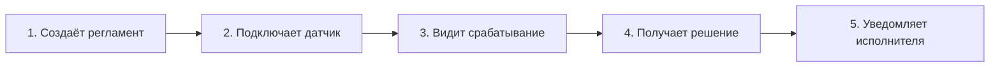

Под каждым шагом — стопка US, отсортированная сверху-вниз:

| 1. Создать регламент | 2. Подключить датчик | 3. Срабатывание | 4. Решение | 5. Уведомить |
|---|---|---|---|---|
| **MVP (release 1)** | | | | |
| Создать в Turtle через API | Принять показание через REST | Запустить регламент | Сгенерировать решение | Положить в LEYKA |
| **Release 2** | | | | |
| Создать в графическом редакторе | UI «список датчиков» | Real-time видимость | Превью решения | Уведомление в Telegram |
| **Release 3** | | | | |
| Импорт из CSV | Поллер MQTT | Симуляция на истории | Кастомные параметры | Эскалация если не отвечает |
| **Nice to have** | | | | |
| Шаблоны | Авто-обнаружение | ML-аномалии | A/B-тест решений | Голосовые уведомления |

Карта удобна тем, что:

- видно, что обязательно в MVP, а что нет;
- видно «провалы» — этапы, у которых пусто;
- видно, что нельзя убрать историю из MVP, не оставив дыру.

---

### 7.9. MVP: что это и зачем

MVP (Minimum Viable Product, минимально жизнеспособный продукт) — версия продукта, которая:

- **минимальна** (только самое нужное);
- **жизнеспособна** (приносит реальную пользу хоть кому-то).

MVP — не «прототип», не «макет», не «бета». Это **работающий продукт**, просто маленький.

Метафора Эрика Риса: MVP — это скейтборд, а не колесо. Колесо одно — это не продукт. А скейтборд маленький, но на нём уже можно ехать.

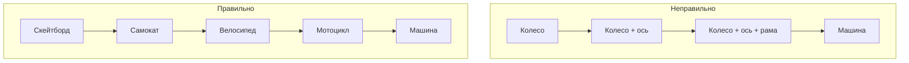

На каждом шаге «правильного» пути можно ехать. На «неправильном» — можно ехать только в конце.

#### История MVP РАГРАФ

- **MVP-0 (2 недели):** один регламент на температуру в серверной, захардкоженный в Python. Срабатывает — пишет в консоль. **Жизнеспособно?** Уже да: разработчик понимает, что концепция рабочая.
- **MVP-1 (4 недели):** регламент хранится в Turtle, читается из файла. Срабатывание шлёт email. **Жизнеспособно?** Да: можно показать заказчику первый сценарий.
- **MVP-2 (6 недель):** REST API + DuckDB. Можно создавать регламенты через API. **Жизнеспособно?** Да: внешняя система может слать данные.
- **MVP-3 (3 месяца):** React UI с CRUD регламентов. **Жизнеспособно?** Да: оператор работает без программиста.
- **MVP-4 (5 месяцев):** интеграция с LEYKA. Срабатывание → задача в LEYKA → исполнитель. **Жизнеспособно?** Это и есть «полный контур» — заявленная ценность.

Каждая итерация — работающий продукт. Если бы делали по Waterfall — мы бы только сейчас, через 6 месяцев, начали тестирование.

---

### 7.10. Story Points и Planning Poker

**Story Point (SP)** — единица оценки **сложности** задачи, а не времени.

Почему не часы?

- Разработчик А делает за 4 часа то, что разработчик Б делает за 12. Чьи часы писать?
- Оценка в часах превращается в обязательство («ты сказал 8, делай за 8»), а это убивает доверие.
- Время предсказать нельзя, сложность — можно.

SP — относительная шкала. «Эта задача в 3 раза сложнее той». Обычно используют **последовательность Фибоначчи**: 1, 2, 3, 5, 8, 13, 21. Числа растут нелинейно, потому что чем больше задача — тем больше неопределённость.

| SP | Что это значит |
|---|---|
| 1 | Тривиально, точно знаем, как делать |
| 2 | Просто, но есть нюансы |
| 3 | Средняя задача, всё понятно |
| 5 | Заметная задача, есть пара неизвестных |
| 8 | Крупная задача, надо подумать |
| 13 | Огромная, скорее всего, надо нарезать |
| 21 | Эпик, обязательно нарезать |

#### Planning Poker

Командная техника оценки.

1. Аналитик зачитывает US.
2. Команда задаёт вопросы.
3. Все одновременно показывают карточки с оценкой (1, 2, 3, 5, 8, 13, 21).
4. Если разброс большой — обсуждают, почему. Часто выясняется, что у кого-то есть знание, которое другие не учли.
5. Голосуют снова.
6. До консенсуса (обычно 2-3 раунда).

**Плюс**: оценка коллективная, никто не «сел в угол с ТЗ». Если разработчик молчун — карточка заставляет его высказаться. Если в команде доминирует тимлид — карточки уравнивают всех.

В РАГРАФ это делается через канал в Telegram: бот рассылает US, все жмут реакцию-цифру, бот считает медиану и разброс. Если разброс > 1 шаг по Фибоначчи — обсуждение в чате.

---

### 7.11. Бэклог продукта vs бэклог спринта

Бэклог не один. Их два.

**Product Backlog** — общий список того, что когда-нибудь надо сделать. Им владеет **Product Owner**. Может быть длинным (сотни историй). Меняется постоянно.

**Sprint Backlog** — то, что команда взяла в работу на текущий спринт. Им владеет **команда** (включая аналитика). Меняется минимально (если совсем надо).

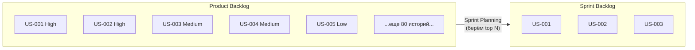

На Sprint Planning команда:

1. Смотрит на верх Product Backlog.
2. Оценивает свою capacity (сколько SP исторически делаем за спринт = velocity).
3. Берёт столько историй, сколько влезает.
4. Sprint Backlog зафиксирован — PO не может добавить туда новую историю без обсуждения.

Если в середине спринта PO приходит со словами «срочно надо это» — формальный ответ: «возьмём в следующий спринт». Если правда горит — можно вынуть из текущего что-то того же размера. Но это исключение.

---

### 7.12. Проектная работа 3: «Цифровой двойник школьной столовой»

**Задание:** разработай Agile-набор для приложения «Цифровой двойник школьной столовой».

**Контекст:** школа N. В столовой есть кассир, повар, заведующая. Дети едят. Родители платят. Завуч контролирует. СЭС проверяет. Хочется приложение, которое связывает всех этих участников.

**Что сделать (~15 часов):**

#### 1. Бэклог продукта (4 ч)

- Не менее 25 User Stories или Job Stories.
- Каждая в формате «As a — I want — So that» или «When — I want to — So I can».
- Покрытие ролей: ученик/родитель/кассир/повар/заведующая/завуч/СЭС.

#### 2. INVEST-чек (1 ч)

- Выбери 3 свои US.
- Для каждой пройди по чек-листу INVEST.
- Если какой-то критерий не выполняется — перепиши US.

#### 3. User Story Map (3 ч)

- Магистраль из 5-7 шагов (например: «зарегистрироваться → пополнить счёт → выбрать меню → получить блюдо → оценить»).
- Под каждым шагом — стопка US, отсортированная по приоритету.
- Выдели горизонтальные «срезы»: MVP, Release 2, Release 3.

#### 4. MVP (2 ч)

- Опиши MVP в 1 страницу:
  - Какие 5-7 историй входят?
  - Какую ценность приносит?
  - Какие истории осознанно отложены и почему?
  - Какие риски остаются?

#### 5. Acceptance Criteria в Gherkin (2 ч)

- Возьми 5 ключевых US из MVP.
- Для каждой напиши 2-4 сценария в Given/When/Then.

#### 6. Прототип main-экрана (3 ч)

- Wireframe или mockup в Figma/Excalidraw/на бумаге (сфотографируй).
- Покажи, как видится главный экран для ребёнка (например: остаток на счёте, меню дня, кнопка «купить»).

**Критерии оценки:**

- 25+ US/JS соблюдают формат: 20%
- INVEST применён, плохие US переписаны: 15%
- Карта историй понятна, релизы выделены: 20%
- MVP обоснован: 15%
- Gherkin-сценарии корректны: 15%
- Прототип отражает MVP: 15%

**Мини-практика к спринту (10 мин):** напиши 5 User Stories к мобильному приложению Госуслуг с точки зрения студента-первокурсника.

> В следующем спринте мы перейдём к **архитектуре системы** — это даст тебе возможность разложить любую платформу по слоям, выбрать стиль (монолит / микросервисы / event-driven) и фиксировать архитектурные решения в ADR.

---

## Спринт 8: Архитектура системы

### Главное за минуту

Архитектура — это про то, как **разложить систему на куски** так, чтобы её можно было строить, менять и масштабировать. Метафора простая: у дома есть план — где несущая стена, где можно сверлить, где стояк, где разводка электрики. Если ты строишь дом без плана — на третьем этаже выяснится, что стена под спальней не выдерживает. С софтом то же самое: без архитектуры на пятом спринте выяснится, что нельзя добавить мобильное приложение, потому что вся логика жёстко прописана в web-формах. РАГРАФ — это пять слоёв (Source / Storage / Processing / Knowledge / Presentation), и любую новую фичу мы кладём в нужный слой, а не размазываем по всему коду. Σ Сигма — это микросервисы, потому что нагрузка городская и один сервис её не вытянет. В этом спринте ты научишься видеть стиль архитектуры за каждой системой, читать UML Component/Deployment Diagram и фиксировать архитектурные решения в ADR.

### О чём эта часть

Аналитик не пишет код, но **архитектуру обязан понимать**. Без этого ты:

- не сможешь оценить, реально ли требование (а вдруг оно требует переделать половину системы);
- будешь предлагать решения, которые архитектурно противоречат стилю системы;
- не сможешь читать диаграммы, которые рисуют разработчики;
- не научишься фиксировать архитектурные ограничения в требованиях.

В этом спринте: 8 архитектурных стилей с примерами, масштабный куб, два типа UML-диаграмм, разбор РАГРАФ по слоям и понятие ADR.

### Ключевые термины

- **Архитектура ПО** — структура системы (компоненты, их связи, правила взаимодействия).
- **Архитектурный стиль** — типовой подход к структуре (монолит, микросервисы и т.д.).
- **Компонент** — модуль системы с чёткой ответственностью и интерфейсом.
- **Слой** — горизонтальная группировка компонентов по уровню абстракции.
- **ADR (Architecture Decision Record)** — короткий документ про значимое архитектурное решение и почему так.

---

### 8.1. Что такое архитектура и зачем она

Архитектура ПО — это **решения, которые дорого менять**.

- Сменить цвет кнопки — дёшево.
- Сменить базу данных с DuckDB на Postgres — дорого.
- Сменить монолит на микросервисы — очень дорого.

Архитектурные решения принимаются **рано** и живут **долго**. Поэтому к ним стоит подходить осознанно.

Метафора: представь, что ты планируешь квартиру.

- Поменять обои — текущая задача (фича).
- Подвинуть розетку на 10 см — рефакторинг.
- Снести несущую стену — архитектурное решение.

Архитектура отвечает на вопросы:

- Как куски системы общаются?
- Где живут данные?
- Где исполняется логика?
- Что можно менять независимо?
- Как система масштабируется при росте нагрузки?

---

### 8.2. Монолитная архитектура

**Монолит** — вся система в одном развёртываемом артефакте (один процесс, одна база, один деплой).

**Пример: РАГРАФ.** Один FastAPI-процесс, одна DuckDB-база, всё в одном репозитории. Поднял `uvicorn main:app` — система работает.

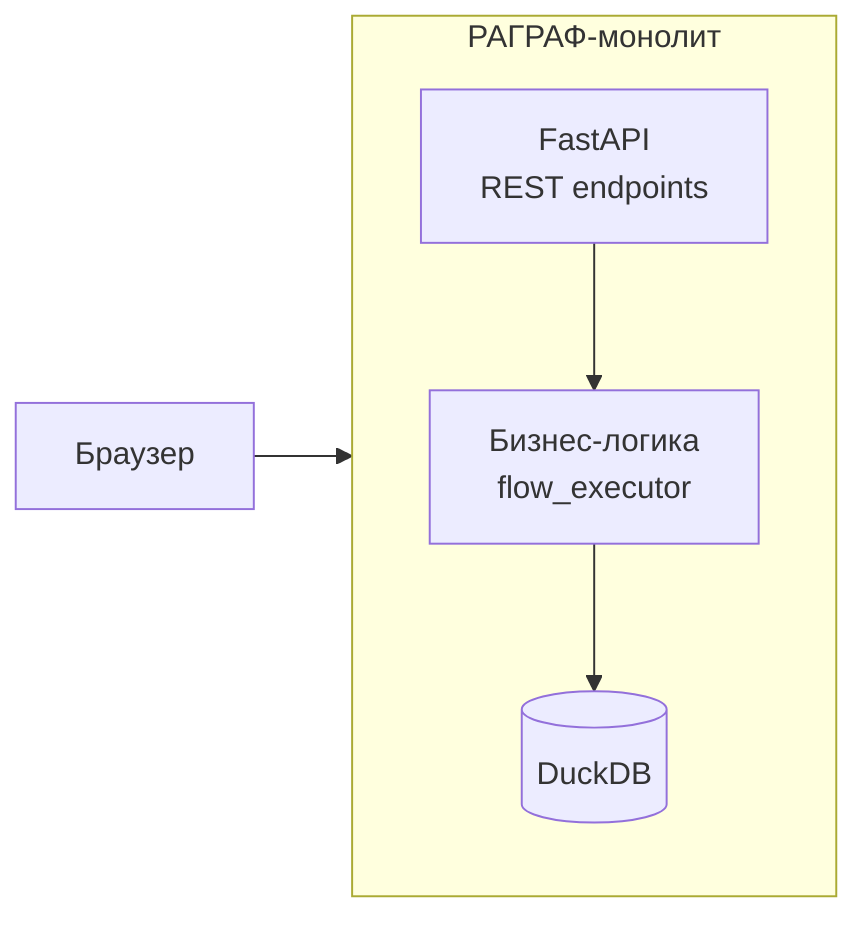

**Плюсы:**

- Просто начать (один репозиторий, один деплой).
- Просто отлаживать (один процесс, единые логи).
- Транзакции работают «из коробки» — всё в одной базе.
- Дёшево хостить.

**Минусы:**

- Невозможно горизонтально масштабировать **отдельные части**. Если ETL грузит — масштабируешь весь монолит.
- Сложно работать большой команде — все ходят по одному коду.
- Деплой = весь продукт целиком, поднять только новую фичу нельзя.
- Зависимости между модулями со временем превращаются в спагетти.

**Когда выбирать:**

- Стартап, пилот, MVP.
- Команда < 10 разработчиков.
- Нагрузка предсказуемая.
- РАГРАФ — здесь.

**Когда переходить на что-то другое:** когда монолит начинает мешать. До тех пор — не трогай.

---

### 8.3. Многослойная (Layered) архитектура

**Многослойная архитектура** — система разбита на горизонтальные слои, каждый слой обращается только к слою ниже.

Это, пожалуй, самый распространённый стиль. РАГРАФ — пятислойный.

```mermaid
flowchart TB
    P[Presentation Layer<br/>FastAPI + React UI]
    K[Knowledge Layer<br/>RDF Turtle store + SHACL]
    Pr[Processing Layer<br/>flow_executor + task_creator]
    St[Storage Layer<br/>DuckDB + flow.json]
    So[Source Layer<br/>ETL, sensors, manual]
    P --> K
    K --> Pr
    Pr --> St
    St --> So
```

**Правило:** слой обращается только к слою **ниже**. Presentation не лезет напрямую в Storage в обход Processing.

#### За что отвечает каждый слой РАГРАФ

| Слой | Ответственность | Технологии |
|---|---|---|
| **Source** | Источники данных: датчики, ручной ввод, ETL из внешних систем | NSK OpenData, MQTT, REST hooks |
| **Storage** | Хранение сырых данных и состояния | DuckDB (auth-store), flow.json (текущая модель), Turtle (исходящий снапшот) |
| **Processing** | Бизнес-логика: исполнение регламентов, создание задач, проверка приёмки | `flow_executor`, `leyka_task_creator`, `acceptance_resolver` |
| **Knowledge** | Семантика: онтология, валидация, граф знаний | rdflib, SHACL, PROV-O |
| **Presentation** | Интерфейсы наружу: REST API + Web UI | FastAPI, React 18, OpenAPI |

**Плюсы:**

- Понятно, где что лежит.
- Слой можно заменить отдельно (например, перейти с DuckDB на Postgres — меняется только Storage).
- Тестировать слои можно отдельно.

**Минусы:**

- Запрос проходит через все слои сверху-вниз — есть overhead.
- Соблазн «протащить логику через слои» (антипаттерн).
- Если слоёв много (7-10) — навигация утомляет.

#### Классическая 3-слойная архитектура

Самый частый вариант: **Presentation → Business Logic → Data Access**.

- **Presentation** — UI и контроллеры.
- **Business Logic** — основная логика, правила.
- **Data Access** — работа с БД.

LEYKA построена по 3-слойке + Auth-сбоку.

---

### 8.4. Клиент-серверная архитектура

**Клиент-серверная (Client-Server)** — есть клиент (запрашивает) и сервер (отвечает). Это **физическое** разделение: разные машины, общаются по сети.

**Пример: РАГРАФ.**

- **Клиент** — React-приложение в браузере (тяжёлый Flow Editor + лёгкие списки).
- **Сервер** — FastAPI на Railway.
- Между ними — REST API через HTTPS.

```mermaid
flowchart LR
    subgraph Browser[Клиент: браузер]
        UI[React 18 SPA]
    end
    subgraph Server[Сервер: Railway]
        BE[FastAPI]
        DB[(DuckDB)]
        BE --> DB
    end
    UI <-->|"REST /api/* JSON"| BE
```

**Разделение ответственностей:**

| Клиент отвечает за | Сервер отвечает за |
|---|---|
| Отображение | Бизнес-логику |
| UX/анимации | Хранение данных |
| Локальное состояние UI | Авторизацию |
| Валидацию формы (быстрая) | Валидацию данных (последняя инстанция) |
| Кэширование (для скорости) | Источник правды |

**Принцип:** никогда не верь клиенту. Если ты проверил пароль в браузере — проверь ещё раз на сервере. Любую логику, на которой держатся деньги/доступ/безопасность — держи на сервере.

---

### 8.5. Толстый клиент vs тонкий клиент

**Тонкий клиент (thin client)** — клиент почти ничего не делает, всё делает сервер. Например, веб-форма, которая отправляет POST и получает обратно готовую HTML-страницу. Старые ASP/PHP-сайты — типичный thin client.

**Толстый клиент (thick / fat client)** — клиент содержит много логики. Например, Adobe Photoshop: основная обработка на машине пользователя, сервер только для лицензий и облака.

**Middle-thick** — что-то посередине. Современные SPA на React, Vue, Angular — обычно middle-thick.

**РАГРАФ — middle-thick:**

- **Flow Editor** (визуальный редактор регламентов) — **толстый**: вся логика drag-and-drop, отрисовка узлов, валидация связей идёт на клиенте. Сервер только сохраняет результат.
- **Списки регламентов, журналы, дашборды** — **тонкие**: клиент рисует таблицу из JSON, всё остальное — на сервере.

| Часть РАГРАФ | Тип | Почему |
|---|---|---|
| Flow Editor | Толстый | Интерактивная работа с графом, отзывчивость важнее |
| Список регламентов | Тонкий | Простая таблица, можно перерендерить |
| Карточка регламента | Тонкий | Просмотр + лёгкое редактирование |
| Симуляция исполнения | Средний | UI рисует прогресс, расчёт на сервере |

**Когда выбирать толстого клиента:**

- Сложный интерактив (Photoshop, Figma, графический редактор).
- Работа оффлайн.
- Высокая отзывчивость (игры, IDE).

**Когда выбирать тонкого клиента:**

- Просмотр и формы.
- Безопасность важна (банк-клиент через web — лучше тонкий).
- Поддержка большого зоопарка устройств.

---

### 8.6. Сервис-ориентированная архитектура (SOA)

**SOA** — система разбита на крупные сервисы, общающиеся через единую шину (часто ESB — Enterprise Service Bus). Сервисы переиспользуются разными приложениями. Это «предшественник» микросервисов, расцвет — 2000-2010-е.

```mermaid
flowchart TB
    subgraph Apps[Приложения]
        A1[Приложение 1]
        A2[Приложение 2]
        A3[Приложение 3]
    end
    ESB[(Enterprise Service Bus)]
    Apps --> ESB
    subgraph Services[Сервисы]
        S1[Сервис Клиенты]
        S2[Сервис Документы]
        S3[Сервис Платежи]
    end
    ESB --> Services
```

**Когда выбирают:**

- Корпоративные интеграции (банки, страховые, нефтянка).
- Много legacy-систем, которые надо завязать в одну экосистему.
- Сильное разделение по отделам внутри компании.

**Современная альтернатива:** микросервисы (про них ниже). Микросервисы — это эволюция SOA с заходом на меньшие куски и отказ от тяжёлой ESB.

---

### 8.7. Микросервисная архитектура

**Микросервисы** — система разбита на множество мелких сервисов, каждый со своей зоной ответственности, своей базой данных и своим деплоем. Общаются через REST/gRPC/события.

**Пример: Σ Сигма** строится из микросервисов:

```mermaid
flowchart TB
    subgraph Sigma[Σ Сигма микросервисы]
        Parser[parser-service<br/>читает регламенты]
        Executor[executor-service<br/>исполняет логику]
        Notifier[notifier-service<br/>отправляет уведомления]
        Audit[audit-log-service<br/>пишет журнал]
        Gateway[api-gateway]
    end
    Client[Внешний клиент] --> Gateway
    Gateway --> Parser
    Gateway --> Executor
    Executor --> Notifier
    Executor --> Audit
    Parser --> Audit
    
    P1[(parser DB)] --- Parser
    P2[(executor DB)] --- Executor
    P3[(notifier DB)] --- Notifier
    P4[(audit DB)] --- Audit
```

**Принципы:**

1. **Single Responsibility** — каждый сервис решает одну задачу.
2. **Independent deployability** — каждый сервис деплоится отдельно.
3. **Database per service** — каждый сервис владеет своими данными, не лезет в чужую базу.
4. **Communication через сеть** — REST, gRPC, message queues.
5. **Failure isolation** — упал один сервис — остальные работают.

**Плюсы:**

- Можно масштабировать только нагруженные сервисы.
- Команды работают независимо.
- Разные сервисы — разные технологии (Python для ML, Go для API gateway, Node для real-time).
- Падение одного сервиса не убивает систему.

**Минусы:**

- **Сложность операций** в 10 раз выше. Нужны Kubernetes, service mesh, distributed tracing.
- Распределённые транзакции — боль (саги, eventual consistency).
- Сетевая задержка между сервисами.
- «Распределённый монолит» — типичная ошибка, когда сервисы нарезали, но они так друг от друга зависят, что деплоятся вместе.

**Когда выбирать:**

- Большая команда (50+ разработчиков).
- Высокая нагрузка с разной интенсивностью по компонентам.
- Зрелая инженерная культура.

**РАГРАФ — точно НЕ микросервисы.** Это монолит. И это правильное решение для текущего масштаба. Σ Сигма — микросервисы, потому что городская нагрузка и большая команда.

---

### 8.8. Бессерверная (Serverless) архитектура

**Serverless** — ты не управляешь серверами. Просто пишешь функции, провайдер их запускает по вызову, считает время выполнения и берёт деньги за миллисекунды.

**Примеры платформ:**

- AWS Lambda
- Vercel Functions
- Cloudflare Workers
- Yandex Cloud Functions

```mermaid
flowchart LR
    Trigger[HTTP-запрос<br/>или событие] --> Func[Функция]
    Func --> DB[(База/хранилище<br/>тоже managed)]
    Func --> Resp[Ответ]
```

**Принцип:** функция холодная — она не работает (и не стоит денег). Пришёл запрос — функция «просыпается», выполняется (50-500 мс), отдаёт ответ, засыпает.

**Плюсы:**

- Платишь только за выполнение.
- Автомасштабирование.
- Не думаешь о серверах.
- Идеально для редких событий.

**Минусы:**

- **Cold start** — первый запрос медленный (функция «просыпается» 200 мс - 2 сек).
- Ограничения по времени выполнения (обычно до 15 мин).
- Сложно с состоянием (нужны внешние БД).
- Лок-ин на провайдера.

**Где уместно:**

- Webhooks от внешних систем (редкие, быстрые).
- Cron-задачи (раз в день что-то посчитать).
- Лёгкие API с очень неравномерной нагрузкой.
- Прототипы.

**Гипотетический сценарий для РАГРАФ:** функция-обработчик webhook от LEYKA. Не нужно держать постоянный процесс — функция стартует при пуше, обновляет статус в DuckDB и засыпает.

---

### 8.9. Событийно-ориентированная архитектура (Event-Driven)

**Event-Driven Architecture (EDA)** — компоненты общаются через события, опубликованные в шину. Подписчики реагируют асинхронно.

Это подробно — в Спринте 12 курса. Пока запомни:

- Не «вызов функции», а «событие случилось, кому надо — подхватит».
- Шина: Kafka, RabbitMQ, Redis Streams, Amazon EventBridge.
- Сильная развязка компонентов.

**Минимальный пример из РАГРАФ:** срабатывание регламента публикует событие `RegulationTriggered`. Подписчики: `leyka_task_creator` (создаёт задачу), `audit_log` (пишет журнал), `notifier` (шлёт email). Никто из них не знает о других.

К этой теме вернёмся.

---

### 8.10. Масштабный куб (Scale Cube)

Книга Майкла Эбботта и Майкла Фишера «The Art of Scalability» вводит модель **масштабного куба** — три оси, по которым можно масштабировать систему.

```mermaid
flowchart TB
    O[Origin<br/>одна машина] -->|"X: репликация"| X[Несколько копий]
    O -->|"Y: функц. декомпозиция"| Y[Разные сервисы]
    O -->|"Z: партиционирование данных"| Z[Шардирование]
```

#### X-axis (Replication, репликация)

Делаем **много копий одной и той же системы**. Перед ними — балансировщик. Каждая копия обслуживает часть запросов.

- Просто.
- Работает с stateless-сервисами (где состояние не хранится в памяти).
- Лучшее средство против вертикального предела одной машины.

**РАГРАФ-сценарий:** запустить 3 копии FastAPI за nginx-балансировщиком. Каждая копия читает одну и ту же DuckDB-базу (если read-heavy) или Postgres (если write).

#### Y-axis (Functional decomposition, функциональная декомпозиция)

Разделяем систему **по функциональности**: сервис регламентов, сервис уведомлений, сервис аудита.

- Это, по сути, путь к микросервисам.
- Можно масштабировать только нагруженный кусок.

**РАГРАФ → Σ Сигма:** именно по этой оси Σ Сигма масштабируется. ETL — отдельный сервис, исполнитель — отдельный, парсер — отдельный.

#### Z-axis (Data partitioning, партиционирование данных)

Разделяем **данные по ключу**. Например: регламенты по школам — каждая школа хранится в своей базе.

- Шардирование по географии (Москва, Питер, Новосибирск).
- Шардирование по типу пользователя.
- Каждая копия системы видит свою «дольку» данных.

**Σ Сигма-сценарий:** в каждом районе города — своя БД. Запрос с роутером попадает в нужный шард.

#### Как РАГРАФ становится Σ Сигмой

| Стадия | Что на каких осях |
|---|---|
| РАГРАФ MVP | Одна копия, один процесс, одна БД. Точка начала координат |
| РАГРАФ Production | X-axis: 2-3 копии FastAPI + Postgres |
| Σ Сигма Pilot | + Y-axis: вынесли отдельно parser, notifier, audit |
| Σ Сигма Full City | + Z-axis: партиционирование по районам |

---

### 8.11. UML Component Diagram

**Component Diagram** — UML-диаграмма, которая показывает, **из каких компонентов** состоит система и **какие интерфейсы** они предоставляют.

Используется для того, чтобы:

- объяснить новому разработчику «что вообще из чего»;
- показать заказчику крупные блоки системы;
- проверить, что компоненты слабо связаны.

#### Component Diagram РАГРАФ

```mermaid
flowchart TB
    subgraph Frontend[Frontend Component]
        UI[React UI]
        Editor[Flow Editor]
    end
    subgraph Backend[Backend Components]
        API[REST API<br/>FastAPI]
        Exec[Flow Executor]
        Task[Task Creator]
        Poll[LEYKA Poller]
    end
    subgraph Knowledge[Knowledge Components]
        Onto[Ontology Store]
        SHACL[SHACL Validator]
    end
    subgraph Storage[Storage Components]
        DB[(DuckDB)]
        TTL[Turtle Files]
    end
    UI --> API
    Editor --> API
    API --> Exec
    API --> DB
    Exec --> Task
    Exec --> SHACL
    Task --> Poll
    Poll -.->|REST| LEYKA[LEYKA External]
    SHACL --> Onto
    Onto --> TTL
    Exec --> DB
```

#### Нотация

- **Прямоугольник** — компонент.
- **Стрелка** — направление зависимости (А зависит от Б).
- **Кружок-палочка** (lollipop) — провайдер интерфейса.
- **Полукруг-палочка** (socket) — потребитель интерфейса.

Чаще на практике (и в курсе) — упрощённая нотация через Mermaid, как выше.

---

### 8.12. UML Deployment Diagram

**Deployment Diagram** — показывает, **где физически развёрнуты** компоненты: на какой машине, в каком регионе, какие сетевые связи.

#### Deployment Diagram РАГРАФ + LEYKA

```mermaid
flowchart TB
    subgraph User[Устройство пользователя]
        Browser[Браузер Chrome/Safari]
    end
    
    subgraph Vercel[Vercel Edge]
        SPA[React SPA bundle<br/>статика + CDN]
    end
    
    subgraph RailwayRAGRAF[Railway: РАГРАФ контейнер]
        FastAPI[FastAPI process<br/>uvicorn]
        DuckDB[(DuckDB файл<br/>persistent volume)]
        FastAPI --- DuckDB
    end
    
    subgraph RailwayLEYKA[Railway: LEYKA контейнер]
        LeykaAPI[FastAPI process]
        LeykaDB[(LEYKA DuckDB)]
        LeykaAPI --- LeykaDB
    end
    
    subgraph Postgres[Managed PostgreSQL]
        PG[(audit, users)]
    end
    
    Browser -->|HTTPS| SPA
    Browser -->|HTTPS REST| FastAPI
    FastAPI -->|REST push| LeykaAPI
    FastAPI -.->|30s pull poller| LeykaAPI
    FastAPI --> PG
    LeykaAPI --> PG
```

#### Что обозначаем

- **Узел** (node, прямоугольник) — физическая или виртуальная машина / контейнер.
- **Артефакт** — то, что развёрнуто (бинарник, образ, файл).
- **Связь** — сетевая (с протоколом).

Deployment Diagram помогает аналитику:

- понять, какие данные где живут (важно для безопасности);
- увидеть точки отказа (если Railway упал — что работает?);
- понять задержки (если БД в другой стране — добавятся 100 мс).

---

### 8.13. Спецтема: Архитектура РАГРАФ от и до

Пройдём по слоям подробнее.

#### Source Layer — откуда приходят данные

**Что входит:**

- **ETL** — пакетная загрузка из внешних систем (например, NSK OpenData, погода с Open-Meteo).
- **Sensor inputs** — показания датчиков (температура, влажность, СО2).
- **Manual ingestion** — оператор вручную ввёл значение через UI.
- **External webhooks** — внешние системы (Plan-R, LEYKA) пушат события.

**Что НЕ входит:**

- Бизнес-логика обработки этих данных.
- Хранение надолго.

Source-слой — это «дверь». Получил данные — отдай дальше, не задерживай.

#### Storage Layer — где данные живут

В РАГРАФ — **три источника правды** по разным типам данных:

| Хранилище | Что хранит | Зачем |
|---|---|---|
| **DuckDB (authoritative)** | Регламенты, показания датчиков, решения, журнал | Транзакционность, SQL-запросы, индексы |
| **flow.json** | Текущая структура графа регламентов | Быстрая загрузка в UI, диф для git |
| **Turtle outbound** | Снапшоты для внешних систем (Σ Сигма) | Семантическая совместимость |

**Правило:** при создании регламента **источник правды — DuckDB**. flow.json и Turtle — производные, генерятся из DuckDB. Если они разъехались — DuckDB прав.

#### Processing Layer — где работает логика

Три ключевых процесса:

1. **flow_executor** — исполнитель регламента. Берёт текущие показания, проверяет условия, решает «надо что-то сделать или нет».
2. **leyka_task_creator** — генератор задач для LEYKA. На вход — решение flow_executor, на выход — задача в LEYKA через REST.
3. **acceptance_resolver** — приёмщик результатов. Сравнивает «что мы ожидали» с «что произошло» (исполнитель отметил выполнение), считает метрики.

```mermaid
flowchart LR
    Data[Показания<br/>датчиков] --> FE[flow_executor]
    Reg[Регламент] --> FE
    FE -->|"если триггер"| TC[leyka_task_creator]
    TC -->|REST| L[LEYKA]
    L -.->|"30s poller"| AR[acceptance_resolver]
    AR --> DB[(DuckDB)]
```

#### Knowledge Layer — семантический слой

Здесь живёт «понимание» предметки:

- **Онтология** — какие есть классы (`SensorReading`, `Regulation`, `Decision`, `Task`), какие свойства, какие связи.
- **SHACL-валидация** — формальные ограничения на данные. Например: «у каждой задачи должен быть исполнитель» — это SHACL-shape, нарушение поднимет ошибку при сохранении.
- **PROV-O** — стандарт W3C для отслеживания происхождения данных. Кто, когда, на основании чего создал эту запись.
- **rdflib** — Python-библиотека работы с RDF-графом.

Этот слой даёт **взаимопонимание с Σ Сигмой**. Если оба используют одну онтологию — можно обмениваться данными без преобразований.

#### Presentation Layer — наружу

- **REST API** — FastAPI с автогенерируемым OpenAPI (про это в Спринте 9).
- **Web UI** — React 18 + TypeScript + Vite.
- **Аутентификация** — JWT через интеграцию с LEYKA (LEYKA — провайдер OAuth).

---

### 8.14. ADR — Architecture Decision Records

**ADR** — короткий документ, который фиксирует **значимое архитектурное решение** и **почему так**.

#### Зачем?

Полгода назад вы выбрали DuckDB вместо Postgres. Сегодня к команде присоединился новый разработчик. Он смотрит и говорит: «А почему не Postgres? Postgres же стандарт.» Если ADR нет — вам приходится восстанавливать аргументы по памяти, теряя нюансы. Если ADR есть — открываете его и читаете.

#### Шаблон

```
# ADR-NNN: <решение>

## Status
proposed | accepted | superseded by ADR-XXX | deprecated

## Context
Что было до решения. Какая проблема. Что пробовали.

## Decision
Что решили. Конкретно.

## Consequences
Что станет лучше. Что станет хуже. Что станет невозможно.

## Alternatives considered
Что ещё рассматривали и почему отказались.
```

#### Пример: ADR-001 РАГРАФ «DuckDB вместо PostgreSQL для прототипа»

```
# ADR-001: DuckDB as authoritative store for the РАГРАФ prototype

## Status
accepted (2025-03-12)

## Context
Прототип РАГРАФ — embedded-сценарий: один процесс FastAPI,
никакой многопользовательской записи. Нужно SQL, JSON, время, индексы.
Развёртывание на Railway — нужно минимум зависимостей.

## Decision
Использовать DuckDB как единственное транзакционное хранилище 
прототипа. Postgres не подключаем.

## Consequences
+ Нулевая стоимость инфраструктуры (DuckDB embedded)
+ Простой бэкап — копия файла
+ Прекрасные analytics-возможности через SQL
- Не подходит для многопроцессной записи
- При переходе к multi-tenant потребуется миграция (см. ADR-021)

## Alternatives considered
- PostgreSQL: оверкилл для embedded-режима, требует managed-сервиса.
- SQLite: меньше SQL-возможностей чем DuckDB, особенно по JSON.
- Файлы Turtle: нет транзакций, нет произвольных запросов.
```

В РАГРАФ их **21**. Каждое крупное решение — отдельный файл в `docs/decisions/`. <!-- нужна проверка: путь docs/decisions/ в репозитории не найден -->


#### Когда писать ADR

- Меняешь базу данных.
- Меняешь архитектурный стиль.
- Выбираешь между двумя серьёзными подходами.
- Делаешь что-то, что отклоняется от привычного.
- Откатываешь предыдущее ADR.

#### Когда **НЕ** писать ADR

- Меняешь библиотеку UI.
- Рефакторишь модуль.
- Любое мелкое решение.

---

### 8.15. Практика: UML Component Diagram для школьной библиотеки

**Задание:** построй UML Component Diagram для мини-системы класса РАГРАФ для управления школьной библиотекой.

**Контекст:** школьная библиотека. Книги, ученики, выдача, возврат, штрафы за просрочку, уведомления через школьный мессенджер.

**Регламенты, которые надо поддержать:**

1. Если ученик не вернул книгу за 14 дней — уведомить классного руководителя.
2. Если в библиотеке осталось менее 3 экземпляров популярной книги — уведомить библиотекаря.
3. Если ученик регулярно сдаёт вовремя — начислить бонусные баллы.

**Что нужно нарисовать (1.5-2 ч):**

#### 1. Component Diagram (60 мин)

Минимум 6 компонентов:

- Компонент Web UI (для библиотекаря и ученика — можно объединить или разделить).
- Компонент REST API.
- Компонент Regulation Engine (исполнитель регламентов).
- Компонент Storage (БД).
- Компонент Notifier (уведомления в мессенджер).
- Один-два специфических компонента (например, Catalog, BorrowingManager).

Покажи зависимости и интерфейсы.

#### 2. Разложи компоненты по слоям (30 мин)

Используй пятислойную модель РАГРАФ:

- Какой компонент в каком слое?
- Какие данные в Storage?
- Что в Knowledge (онтология книги, читателя)?

#### 3. ADR на один выбор (30 мин)

Например: «PostgreSQL vs DuckDB для библиотеки» или «Полнотекстовый поиск: SQLite FTS vs ElasticSearch».

Напиши по шаблону Status/Context/Decision/Consequences/Alternatives.

**Сдача:** одна страница с диаграммой (Mermaid или картинка) + 0.5 страницы ADR.

**Критерии:**

- Не менее 6 компонентов: 30%
- Корректные зависимости: 20%
- Соответствие слоям РАГРАФ: 20%
- ADR полный по шаблону: 30%

**Мини-практика к спринту (10 мин):** возьми любое приложение с телефона. Прикинь его архитектуру: монолит или микросервисы? Толстый клиент или тонкий? По какой оси куба он масштабируется?

---

### 8.10. Двухполушарная архитектура гибридного ИИ в 5 слоях РАГРАФ

В этом блоке мы возвращаемся к идее из введения — «гибридный ИИ как двухполушарная архитектура» — и смотрим, **как именно она ложится на пятислойную модель РАГРАФ**. Это не косметика: понимание, где у платформы «левое полушарие», а где «правое» — главный навык архитектора гибридных систем.

#### Главное за минуту

Гибридный ИИ-агент устроен как человеческий мозг с двумя полушариями: **левое** (символьная логика, правила, объяснимость) и **правое** (нейросеть, паттерны, адаптивность). Между ними — **мозолистое тело** (оракульная вычислимость, обмен через формальные контракты). РАГРАФ — это **рабочий пример такой архитектуры**: его пять слоёв точно распределены между двумя полушариями, и нигде эти роли не размыты. Понимая раскладку, ты можешь спроектировать новую систему такого же класса для своей отрасли.

#### Раскладка по слоям

Пятислойная архитектура РАГРАФ из §8.6 теперь читается так:

| Слой | Что внутри | Полушарие | Почему именно так |
|---|---|---|---|
| **Source** | ETL-puller, sensor adapters, ручной ingest PDF/CSV | Левое (детерминированно), но **с правым на границе** (классификация типа документа через LLM) | Сбор данных — это валидация формата (логика). LLM подключается только когда формат заранее неизвестен |
| **Storage** | DuckDB (regulations, parameters, history), Turtle-фикстуры, flow.json | **Чисто левое** | Хранилище — это правда. Никакой нейросети, никаких «приблизительно». PROV-O трасса фиксирует кто-что-когда |
| **Processing** | `flow_executor`, `acceptance_resolver`, SHACL-валидация | **Чисто левое** | Исполнение регламента — детерминированный путь по узлам. Если ввести сюда LLM, систему нельзя будет верифицировать |
| **Knowledge** | `EmbeddingIndex` (bge-m3), SPARQL Workbench, Knowledge Studio | **Гибридное** — SPARQL это левое, retrieval это правое, оракульный мост между ними | Этот слой и есть «мозолистое тело». Аналитик задаёт семантический запрос → SPARQL находит точные триплеты, bge-m3 находит «похожее по смыслу», LLM формулирует ответ |
| **Presentation** | React UI (Flow Editor, Regulation Editor, Live ETL), REST API | **Левое** (с правым в Студии аналитика) | Интерфейс не должен «творчески интерпретировать» — что нажал, то и должно произойти. Творчество разрешено только в чате Студии |

```mermaid
flowchart TB
    subgraph LEFT["🧮 Левое полушарие — ИИ-1"]
        STO["💾 Storage<br/>DuckDB + Turtle"]
        PRO["⚙️ Processing<br/>flow_executor + SHACL"]
        PRE["🖥️ Presentation<br/>React + REST"]
    end

    subgraph BRIDGE["🔄 Мозолистое тело"]
        KNO["📚 Knowledge<br/>SPARQL + EmbeddingIndex<br/>+ LLM в Студии"]
    end

    subgraph RIGHT["🎨 Правое полушарие — ИИ-2"]
        SRC_R["🤖 Источники<br/>с LLM-классификацией"]
        SAN["💬 Sandbox<br/>chat + retrieval"]
    end

    subgraph SRC_L["📡 Source"]
        ETL["ETL-puller<br/>(детерминированный)"]
        PDF["LLM-классификация<br/>PDF/DOCX (по требованию)"]
    end

    ETL --> STO
    PDF -.->|опционально| KNO
    STO --> PRO
    PRO --> PRE
    KNO <-->|оракульный обмен| PRO
    KNO <-->|оракульный обмен| SAN
    SAN -->|правки регламентов| PRE
    PRE -->|опыт методолога| STO

    style LEFT fill:#DBEAFE,stroke:#1E40AF,color:#000
    style BRIDGE fill:#F3E8FF,stroke:#7E22CE,color:#000
    style RIGHT fill:#FEE2E2,stroke:#B91C1C,color:#000
```

#### Архитектурные правила раскладки

Прочитав эту схему, легко понять три **жёстких правила**, которые держат РАГРАФ от вырождения в «ещё одну LLM-обёртку»:

**Правило 1. Критический путь — только через левое полушарие.** Цикл «событие → регламент → задача исполнителю» **никогда не проходит через LLM**. Этот путь полностью детерминирован: `flow_executor` интерпретирует `flow.json`, применяет правила, возвращает `ExecutionResult` с PROV-O-трассой. Если завтра OpenAI отключит API — критический путь продолжает работать.

**Правило 2. Правое полушарие — только сбоку, для аналитика.** LLM и retrieval живут в **Студии аналитика** (`/sandbox`) и в опциональном LLM-классификаторе PDF на входе. Они помогают **человеку-методологу** искать, понимать, формулировать. Они **не принимают решений за систему**.

**Правило 3. Обмен только через формальные контракты.** Когда правое полушарие что-то «придумало» (нашло релевантный регламент, предложило формулировку, классифицировало документ) — это **гипотеза**, которая возвращается в левое полушарие на верификацию. Методолог-человек смотрит на гипотезу, принимает решение (правит регламент / отклоняет предложение), и **его действие** уже идёт через детерминированный путь хранения и исполнения.

#### Где у тебя на проекте может встретиться эта раскладка

В реальной системе ты будешь рисовать аналогичную схему **для каждого нового проекта**. Вопросы, которые надо задать заказчику до начала проектирования:

| Вопрос | Зачем нужен | Пример ответа |
|---|---|---|
| Какой путь должен работать **без интернета и без LLM-провайдера**? | Это критический путь левого полушария | «Контроль СИЗ на стройплощадке должен работать даже когда у нас отключили Cerebras-аккаунт» |
| Какой путь может использовать LLM, но **с проверкой человеком** перед применением? | Это правое полушарие | «Помощь методологу в формулировке нового регламента — да, но прежде чем он попадёт в production, его проверяет аналитик» |
| Где живёт «правда» системы — единственный источник истины? | Это Storage левого полушария | «DuckDB + версионированные Turtle-фикстуры. Никакой LLM не имеет права писать туда напрямую» |
| Кто и как **дообучает** систему опытом? | Это контур «человек-эксперт правит регламенты» | «Методолог через Flow Editor правит regulation, изменения попадают в `regulation_history`, метрики через 2 недели показывают эффект» |

Если на любой из этих вопросов заказчик отвечает «а пусть LLM сам решит» — это **красный флаг**. Значит, вы строите не гибридную систему, а очередной чёрный ящик, который через 3 месяца поедет на свалку как невозможный для аудита.

#### Связь с введением и 4 столпами сильного ИИ

Двухполушарная архитектура РАГРАФ — это конкретное архитектурное воплощение **3-го столпа** сильного ИИ (гибридность как архитектурный принцип) из введения этой книги. Остальные три столпа в РАГРАФ реализованы так:

- **Столп 1 (рассуждение):** Processing-слой левого полушария — `flow_executor` с PROV-O трассой
- **Столп 2 (непрерывное обучение):** обратная стрелка «опыт методолога → Storage» в схеме выше — методолог дообучает систему правкой регламентов, **без переобучения нейросети**
- **Столп 4 (вещественность):** Source-слой левого полушария — Sensor Library и output-узлы, через которые система слышит датчики и запускает физические действия

> 💡 **Главный takeaway этого блока.** Когда ты проектируешь следующую систему класса РАГРАФ — нарисуй похожую схему **прежде чем писать первую строку кода**. Каждый компонент проекта должен иметь однозначный ответ: «это левое полушарие» / «это правое полушарие» / «это мозолистое тело». Если на какой-то компонент ответ «не знаю, как-то так» — значит, у тебя не архитектура, а каша. Перерисовывай.

**Мини-практика (15 мин):** возьми любое известное тебе ИИ-приложение (Алиса, ChatGPT, GigaChat, Авито с AI-поиском, Яндекс Карты с пробками, Госуслуги с ИИ-помощником). Прикинь его раскладку по двум полушариям: что у него критический путь левого полушария, что — правое полушарие в роли подсказки, есть ли мозолистое тело и как оно устроено. Если приложение целиком в правом полушарии (всё через LLM) — оцени, безопасно ли это для его задач.

> В следующем спринте мы перейдём к **программным интерфейсам (API)** — это даст тебе возможность описать, как куски системы говорят друг с другом: HTTP, REST, GraphQL, gRPC, WebSocket, OpenAPI и Postman.

---

## Спринт 9: Программные интерфейсы — API

### Главное за минуту

API — это «меню в ресторане»: список того, что можно у системы заказать, без объяснения, как повар это готовит. Без API системы не общаются — они изолированы. Telegram, Spotify, Госуслуги, СберБанк — у всех есть API, и именно через них приложения третьих сторон создают чат-ботов, плеер для Discord, проверку статуса заявки, оплату подписки. РАГРАФ предоставляет REST API на FastAPI — через него LEYKA получает задачи, внешние системы отправляют показания датчиков, а UI разговаривает с бэком. В этом спринте: что такое API, какие стили (REST, GraphQL, gRPC, WebSocket, Webhooks), как читать OpenAPI/Swagger, как тестировать в Postman и как описать взаимодействие через UML Sequence Diagram.

### О чём эта часть

Системный аналитик, не понимающий API, — как переводчик, не знающий грамматики. Ты будешь:

- проектировать endpoints (какие нужны, что туда отправлять);
- читать OpenAPI/Swagger-документацию;
- тестировать API в Postman;
- описывать взаимодействия через Sequence Diagram;
- понимать, когда REST, а когда — что-то другое.

### Ключевые термины

- **API** — Application Programming Interface, контракт между двумя системами.
- **Endpoint** — конкретный адрес API, по которому отправляется запрос.
- **REST** — самый распространённый стиль API, через HTTP + JSON.
- **OpenAPI/Swagger** — формат описания REST API в YAML/JSON.
- **Idempotency** — свойство операции: повторный вызов даёт тот же результат.

---

### 9.1. Что такое API и зачем

**API (Application Programming Interface)** — формализованный способ, которым программы общаются между собой.

Метафора: ты в ресторане. У тебя есть **меню** — там написано, что можно заказать, по какой цене, и что входит в блюдо. Тебе не надо знать, как повар жарит котлету. Тебе достаточно сказать «номер 12, без лука» — и ты получишь блюдо. Меню — это API ресторана.

То же самое в софте. Когда мобильное приложение Telegram отправляет сообщение, оно не знает, как сервер Telegram хранит данные. Оно знает только API: «POST /sendMessage с такими параметрами».

#### Без API системы изолированы

Представь Госуслуги без API. У них есть данные о паспорте, СНИЛС, страховке. Но без API:

- банк не может проверить твою личность через Госуслуги при оформлении карты;
- работодатель не может проверить твой ИНН;
- приложение «штрафы» не может загрузить твою историю автомобильных штрафов.

С API всё это работает: банк делает запрос → Госуслуги отвечают → банк продолжает свою операцию.

#### Виды API

- **Внутреннее** — между компонентами одной системы (фронт → бэк).
- **Партнёрское** — для известных партнёров (LEYKA для РАГРАФ).
- **Публичное** — для всех (Telegram Bot API).

---

### 9.2. Сетевые протоколы и уровни OSI

Прежде чем говорить о REST/GraphQL/gRPC, надо понять, на чём всё это работает.

#### Модель OSI (упрощённо)

| Уровень | Что делает | Пример |
|---|---|---|
| **7. Прикладной** | Что хочет приложение | HTTP, FTP, SMTP |
| **6. Представления** | Кодирование данных | JSON, XML, TLS |
| **5. Сеансовый** | Управление сессией | (cookies, токены) |
| **4. Транспортный** | Доставка пакетов | TCP, UDP |
| **3. Сетевой** | Маршрутизация | IP |
| **2. Канальный** | Передача в сети | Ethernet, Wi-Fi |
| **1. Физический** | Электрика и провода | Кабель, радио |

Для аналитика главное:

- **HTTP/HTTPS** — основной протокол современного API (уровень 7).
- **TCP/IP** — то, поверх чего работает HTTP (уровни 4-3).
- **WebSocket** — двунаправленное постоянное соединение поверх TCP (уровень 7, альтернатива HTTP для real-time).

#### Ключевые протоколы прикладного уровня

| Протокол | Когда |
|---|---|
| **HTTP** | Запрос-ответ, без шифрования (только для разработки) |
| **HTTPS** | То же + TLS (обязательно в проде) |
| **WebSocket (ws/wss)** | Двунаправленное соединение для real-time (чаты, биржи, игры) |
| **gRPC** | Бинарный протокол поверх HTTP/2 для микросервисов |
| **MQTT** | Лёгкий протокол для IoT (датчики, мобильные) |
| **AMQP** | Брокеры сообщений (RabbitMQ) |

#### HTTP-запрос: из чего состоит

```
POST /api/sensor-readings HTTP/1.1
Host: ragraf.example.com
Content-Type: application/json
Authorization: Bearer eyJhbGc...

{
  "sensorId": "temp-01",
  "value": 27.5,
  "timestamp": "2026-05-29T18:42:00Z"
}
```

Структура:

1. **Метод** (POST) — что хотим сделать.
2. **Путь** (`/api/sensor-readings`) — куда.
3. **Версия HTTP** — обычно HTTP/1.1 или HTTP/2.
4. **Headers** — мета-информация (тип контента, авторизация, и т.д.).
5. **Тело** (body) — данные запроса (для POST/PUT/PATCH).

#### HTTP-ответ

```
HTTP/1.1 201 Created
Content-Type: application/json
Location: /api/sensor-readings/12345

{
  "id": "12345",
  "status": "stored"
}
```

Структура:

1. **Версия HTTP**.
2. **Status code** (201 Created) — что произошло.
3. **Reason phrase** ("Created") — текстовое описание.
4. **Headers**.
5. **Тело**.

#### Главные HTTP status codes

| Код | Что значит |
|---|---|
| 200 | OK — всё прошло |
| 201 | Created — создано |
| 204 | No Content — успешно, но без тела |
| 301/302 | Redirect |
| 400 | Bad Request — клиент прислал кривой запрос |
| 401 | Unauthorized — кто ты вообще такой |
| 403 | Forbidden — знаю кто ты, но не пущу |
| 404 | Not Found — нет такого ресурса |
| 409 | Conflict — конфликт (например, дубль) |
| 422 | Unprocessable Entity — формат правильный, но данные не валидны |
| 429 | Too Many Requests — притормози |
| 500 | Internal Server Error — у нас всё плохо |
| 502 | Bad Gateway — у нас upstream плохо |
| 503 | Service Unavailable — нас положили на ТО |

Аналитику важно различать **4xx** (виноват клиент) и **5xx** (виноват сервер).

---

### 9.3. Форматы передачи данных

#### JSON — де-факто стандарт

Простой текстовый формат. Объекты `{}`, массивы `[]`, строки `""`, числа, `true/false/null`.

```json
{
  "regulation": {
    "id": "reg-007",
    "name": "Превышение температуры в серверной",
    "sensors": ["temp-01", "temp-02"],
    "threshold": 28.5,
    "active": true
  }
}
```

**Когда:** в 95% современных API. Стандарт для REST.

#### XML — для legacy SOAP

```xml
<regulation>
  <id>reg-007</id>
  <name>Превышение температуры в серверной</name>
  <sensors>
    <sensor>temp-01</sensor>
    <sensor>temp-02</sensor>
  </sensors>
</regulation>
```

**Когда:** legacy-системы, SOAP-сервисы, корпоративные интеграции с банками и налоговой. XSD-схемы дают строгую типизацию.

#### YAML — для конфигов

```yaml
regulation:
  id: reg-007
  name: Превышение температуры в серверной
  sensors:
    - temp-01
    - temp-02
  threshold: 28.5
  active: true
```

**Когда:** конфиги, OpenAPI-спецификации, манифесты Kubernetes. Удобен человеку, но позиционно-чувствительный (отступы важны).

#### Turtle — для семантики

```turtle
@prefix ragraf: <https://ragraf.org/v1/> .

ragraf:reg-007 a ragraf:Regulation ;
  ragraf:name "Превышение температуры в серверной" ;
  ragraf:sensor ragraf:temp-01, ragraf:temp-02 ;
  ragraf:threshold 28.5 ;
  ragraf:active true .
```

**Когда:** семантический веб, RDF-данные. В РАГРАФ — для исходящих снапшотов в Σ Сигму.

#### Сравнение

| Формат | Читаемость | Размер | Поддержка |
|---|---|---|---|
| JSON | Высокая | Средний | Везде |
| XML | Средняя | Большой | Legacy |
| YAML | Высокая | Малый | Конфиги |
| Turtle | Низкая (для не-семантиков) | Малый | Семантический веб |
| Protocol Buffers (бинарный) | Нулевая | Минимальный | gRPC |

---

### 9.4. REST API

**REST (Representational State Transfer)** — архитектурный стиль, предложенный Роем Филдингом в 2000 году в диссертации.

#### Принципы REST

1. **Stateless** — сервер не хранит сессию между запросами. Каждый запрос самодостаточен.
2. **Resources** — система моделируется через ресурсы. Каждый ресурс имеет URI.
3. **Uniform Interface** — единые правила: HTTP-методы для действий, URI для адресации.
4. **Cacheable** — ответы можно кэшировать.
5. **Layered system** — клиент не знает, разговаривает ли он напрямую с сервером или через proxy/CDN.
6. **Client-Server** — клиент и сервер развиваются независимо.

#### HTTP-методы REST

| Метод | Назначение | Idempotent | Safe |
|---|---|---|---|
| **GET** | Прочитать ресурс | Да | Да |
| **POST** | Создать ресурс | Нет | Нет |
| **PUT** | Полностью заменить ресурс | Да | Нет |
| **PATCH** | Частично обновить ресурс | Не обязательно | Нет |
| **DELETE** | Удалить ресурс | Да | Нет |

- **Safe** — метод не меняет состояние сервера.
- **Idempotent** — повторный вызов даёт тот же результат.

**Idempotency** — крутая штука. Если интернет шумит и POST не дошёл — повторный POST может создать дубль. Если DELETE не дошёл — повторный DELETE безопасен (если уже удалили — статус "уже удалён"). Это причина, почему критичные операции часто делают через PUT с идентификатором клиента, а не POST.

#### Примеры из API РАГРАФ

```http
GET /api/regulations
GET /api/regulations/{id}
POST /api/regulations
PUT /api/regulations/{id}
PATCH /api/regulations/{id}
DELETE /api/regulations/{id}

POST /api/sensor-readings
GET /api/sensor-readings?sensorId=temp-01&from=2026-05-01

GET /api/decisions/{id}
POST /api/decisions/{id}/accept
POST /api/decisions/{id}/reject

GET /api/tasks
GET /api/audit?regulationId=reg-007
```

#### Хорошие практики именования

- Существительные во множественном числе для коллекций: `/regulations`, не `/regulation`.
- Существительные, не глаголы: `/regulations`, не `/getRegulations`.
- Подресурсы через слэш: `/regulations/{id}/sensors`.
- Действия — через под-endpoint: `/decisions/{id}/accept`.
- Параметры фильтрации — через query: `?sensorId=temp-01&from=2026-05-01`.
- Версионирование — в пути: `/api/v1/regulations` или в header.

#### Statelessness и авторизация

«Stateless» не значит «без авторизации». Это значит «состояние авторизации не хранится в сессии на сервере». Способы:

- **JWT (JSON Web Token)** — клиент носит токен, сервер декодирует. Так в РАГРАФ через интеграцию с LEYKA.
- **API Key** — простой ключ в заголовке `X-API-Key`. Так в Telegram Bot API.
- **OAuth 2.0** — продвинутый сценарий с access/refresh-токенами. Так у Google, Facebook.

---

### 9.5. GraphQL

**GraphQL** — альтернативный стиль API, придуманный в Facebook в 2012.

Главная идея: **один endpoint**, клиент сам описывает, что хочет получить.

```graphql
query {
  regulation(id: "reg-007") {
    id
    name
    sensors {
      id
      currentValue
    }
    lastDecision {
      status
      timestamp
    }
  }
}
```

В одном запросе клиент попросил регламент + его датчики + последнее решение. В REST это было бы 3 запроса (или один монструозный с кучей вложенностей).

#### Когда выбирают GraphQL

- Frontend сложный, разным экранам нужны разные срезы данных.
- Хочется уменьшить over-fetching (когда REST шлёт лишние поля) и under-fetching (когда не хватает данных, надо лезть в другой endpoint).
- Команда фронтенда имеет силу диктовать бэкенду.

#### Минусы

- Кэширование сложнее (нет единого URI для каждого ресурса).
- Сложно ограничивать нагрузку (один запрос может «потянуть» половину БД).
- Сложнее в наблюдении (один endpoint — сложно мониторить).
- Сложно в авторизации на уровне полей.

**В РАГРАФ — REST.** GraphQL был бы overengineering для текущего объёма данных.

---

### 9.6. gRPC

**gRPC (gRPC Remote Procedure Call)** — придуман в Google. Основан на:

- **HTTP/2** — для транспорта (мультиплексирование, server push).
- **Protocol Buffers** — для сериализации (бинарный формат, очень быстрый).
- **Strict schema** — описание сервиса через `.proto` файл.

Пример `.proto`:

```protobuf
service RegulationService {
  rpc GetRegulation (GetRegulationRequest) returns (Regulation);
  rpc ListRegulations (Empty) returns (stream Regulation);
  rpc CreateRegulation (Regulation) returns (Regulation);
}

message Regulation {
  string id = 1;
  string name = 2;
  repeated string sensor_ids = 3;
  double threshold = 4;
}
```

#### Когда выбирают gRPC

- Микросервисы внутри одной системы (Σ Сигма-style).
- Скорость важнее читаемости запроса.
- Нужны стримы (continuous push от сервера).

#### Минусы

- Сложно отлаживать (бинарный формат, не откроешь в браузере).
- Браузеры напрямую не поддерживают (нужен gRPC-Web с прокси).
- Меньше готовых инструментов, чем для REST.

---

### 9.7. WebSocket / SSE — для real-time

#### WebSocket

Двунаправленное постоянное соединение. После handshake клиент и сервер могут отправлять сообщения друг другу в любой момент.

```
Client → Server: подключаемся (HTTP Upgrade)
Server → Client: 101 Switching Protocols
Client ←→ Server: обмен сообщениями (любая сторона может первой)
```

**Когда:**

- Чаты (Telegram, Discord).
- Многопользовательские игры.
- Биржи в реальном времени.
- Live-обновления в дашбордах.

#### Server-Sent Events (SSE)

Однонаправленное: сервер пушит, клиент только слушает.

```
Client → Server: GET /events (header: Accept: text/event-stream)
Server → Client: data: {"type": "regulation_triggered"}\n\n
Server → Client: data: {"type": "task_created"}\n\n
...
```

**Когда SSE лучше WebSocket:**

- Поток только в одну сторону.
- Хочется автоматического переподключения (SSE это даёт из коробки).
- Хочется работать через стандартный HTTP (легче через proxy).

#### Пример: как LEYKA могла бы пушить новые сообщения через SSE

Сейчас РАГРАФ опрашивает LEYKA каждые 30 секунд (pull-поллер). Это работает, но есть задержка до 30 секунд и тратятся пустые запросы.

Через SSE могло бы быть так:

```mermaid
sequenceDiagram
    participant R as РАГРАФ
    participant L as LEYKA
    R->>L: GET /events/tasks (SSE)
    L-->>R: HTTP 200 + stream
    Note over R,L: соединение открыто
    Note over L: исполнитель пишет<br/>комментарий
    L-->>R: data: {"taskId":..., "comment":...}
    Note over R: обновили статус<br/>задачи в DuckDB
    Note over L: исполнитель отметил<br/>выполнение
    L-->>R: data: {"taskId":..., "status":"done"}
```

Преимущества: задержка < 1 сек, нет пустых запросов.

Почему не сделали? Pull-поллер проще в реализации, более устойчив к сбоям и обрывам соединения, не требует поддержки SSE на стороне LEYKA. Для текущего объёма задержка в 30 сек приемлема.

---

### 9.8. Webhooks — обратное направление

**Webhook** — это обратная схема: вместо того, чтобы ты дёргал API, **внешняя система дёргает твой endpoint** при наступлении события.

```mermaid
sequenceDiagram
    participant Y as Твоя система
    participant E as Внешняя система
    Y->>E: POST /subscribe<br/>{url: "https://my.app/hooks/payment"}
    Note over E: запомнила,<br/>что слать сюда
    Note over E: произошло событие<br/>(пользователь оплатил)
    E->>Y: POST https://my.app/hooks/payment<br/>{...данные события...}
    Y-->>E: 200 OK
```

**Примеры использования:**

- **Plan-R webhooks:** Plan-R дёргает endpoint в РАГРАФ, когда исполнитель отметил выполнение.
- **GitHub webhooks:** GitHub дёргает endpoint CI/CD, когда сделан push.
- **Stripe webhooks:** Stripe дёргает endpoint магазина, когда прошла оплата.
- **Telegram webhooks:** Telegram дёргает endpoint бота, когда пришло сообщение.

#### Как делать webhook'и правильно

1. **Уникальная подпись** — внешняя система подписывает payload секретом. Ты проверяешь подпись, чтобы убедиться, что это правда пришло от Stripe, а не от хакера.
2. **Idempotency** — payload содержит уникальный event_id. Если ты получил тот же event дважды — обработай один раз. Webhooks часто ретраятся.
3. **Быстрый ответ** — отвечай 200 OK сразу, обработку клади в фоновую очередь. Иначе внешняя система решит, что ты упал, и зашлёт ретрай.
4. **Логирование** — храни все входящие webhook'и в логе. Это сильно поможет, когда что-то пойдёт не так.

---

### 9.9. Синхронные vs асинхронные взаимодействия

#### Синхронное

Запросил → ждёшь → получил ответ. Классический REST.

```
Client → Server: GET /data
              [ждёт 200 мс]
Server → Client: 200 OK + data
```

**Плюсы:**

- Просто.
- Сразу знаешь результат.

**Минусы:**

- Клиент ждёт.
- Если сервер падает — клиент видит ошибку.
- Не масштабируется на тяжёлые операции.

#### Асинхронное

Запросил → получил подтверждение → потом узнал результат другим способом.

```
Client → Server: POST /jobs (запусти задачу)
Server → Client: 202 Accepted + {jobId: "abc"}

[через 10 минут]
Client → Server: GET /jobs/abc (готово?)
Server → Client: 200 OK + {status: "done", result: ...}
```

Или через webhook/SSE:

```
Client → Server: POST /jobs (запусти задачу)
Server → Client: 202 Accepted + {jobId: "abc"}

[через 10 минут, через webhook]
Server → Client: POST https://client/hooks/job-done {jobId: "abc"}
```

**Плюсы:**

- Можно делать долгие операции.
- Клиент не висит.
- Масштабируется.

**Минусы:**

- Сложнее в коде.
- Сложнее отлаживать.

#### Очереди сообщений

**RabbitMQ**, **Apache Kafka**, **Redis Streams** — брокеры сообщений. Используются для:

- Развязки между сервисами (отправитель не знает получателя).
- Сглаживания нагрузки (вали в очередь — обработаем по мере сил).
- Гарантии доставки (даже если получатель упал — сообщение сохранится).

```mermaid
flowchart LR
    P1[Сервис<br/>publisher] --> Q[(Очередь)]
    P2[Сервис<br/>publisher] --> Q
    Q --> C1[Сервис<br/>consumer]
    Q --> C2[Сервис<br/>consumer]
    Q --> C3[Сервис<br/>consumer]
```

**Когда нужны:** Σ Сигма-уровень. В РАГРАФ-монолите хватает прямых вызовов и кратких очередей в памяти.

#### Обмен базами данных как интеграция — антипаттерн

Иногда ленятся делать API и говорят: «Дайте нам прямой доступ к вашей БД, мы будем читать оттуда». Это **антипаттерн**:

- Жёсткая связь по схеме БД. Поменяли схему — все интегрированные системы сломались.
- Нет контракта. Нет идемпотентности. Нет валидации.
- Безопасность дырявая (давая SELECT, выдаёшь всю модель).
- Транзакции через системы не работают.

**Исключение:** read-only представление через VIEW для аналитики (BI-инструменты). И то, лучше через API.

---

### 9.10. UML Sequence Diagram

**Sequence Diagram** — UML-диаграмма, которая показывает **последовательность сообщений** между участниками во времени.

#### Пример: «срабатывание регламента → создание задачи в LEYKA → исполнитель пишет комментарий → РАГРАФ-поллер увидит и пересчитает»

```mermaid
sequenceDiagram
    autonumber
    participant S as Sensor
    participant R as РАГРАФ Backend
    participant DB as DuckDB
    participant L as LEYKA
    participant U as Исполнитель
    
    S->>R: POST /api/sensor-readings<br/>{value: 29.5}
    R->>DB: INSERT INTO readings
    R->>R: flow_executor.evaluate()
    Note right of R: threshold = 28.5,<br/>значение превышено
    R->>DB: INSERT INTO decisions<br/>(status='pending')
    R->>L: POST /api/tasks<br/>{title: "Перегрев в серверной"}
    L-->>R: 201 Created + {taskId: "T-42"}
    R->>DB: UPDATE decisions SET leyka_task_id='T-42'
    
    Note over U,L: ... 5 минут спустя ...
    U->>L: открывает задачу T-42
    U->>L: пишет комментарий<br/>"Включил кондиционер"
    L->>L: сохраняет комментарий
    
    Note over R,L: ... 30 секунд спустя ...
    R->>L: GET /api/tasks/T-42/comments<br/>(pull-поллер)
    L-->>R: 200 OK + [{text: "Включил кондиционер"}]
    R->>DB: INSERT INTO leyka_events
    R->>R: acceptance_resolver.check()
    Note right of R: задача исполняется,<br/>пересчитываем статус
    R->>DB: UPDATE decisions SET status='in_progress'
```

#### Нотация

- **Участники** (actors) сверху, в прямоугольниках.
- **Стрелки** вниз — сообщения между участниками. Сплошная — синхронный вызов, пунктирная — ответ.
- **Вертикальные линии** под участниками — время.
- **Активации** (узкие прямоугольники на линии) — когда участник занят.
- **Заметки** (Note) — пояснения.
- **Циклы и условия** — через `alt`, `loop`, `opt`.

Sequence Diagram особенно полезна, когда:

- Описываешь сложный сценарий с многими участниками.
- Отлаживаешь интеграцию (по диаграмме видно, где может сломаться).
- Объясняешь не-разработчику, что происходит.

---

### 9.11. Postman — инструмент тестирования API

**Postman** — программа для отправки HTTP-запросов вручную. Аналитику нужен для:

- Проверить, что endpoint работает.
- Воспроизвести баг (отправил конкретный запрос — получил конкретную ошибку).
- Подготовить коллекцию для команды (примеры запросов).
- Прогнать сценарий из нескольких запросов.

#### Базовые сценарии

**1. GET с авторизацией**

1. Создай новый запрос.
2. Method: **GET**.
3. URL: `https://api.ragraf.example.com/api/regulations`.
4. Tab **Authorization** → Type: **Bearer Token** → введи JWT.
5. Send.
6. Смотри в Response: status code и body.

**2. POST с JSON**

1. Method: **POST**.
2. URL: `https://api.ragraf.example.com/api/sensor-readings`.
3. Tab **Headers** → добавь `Content-Type: application/json`.
4. Tab **Body** → выбери **raw** → **JSON** → вставь:

```json
{
  "sensorId": "temp-01",
  "value": 27.5,
  "timestamp": "2026-05-29T18:42:00Z"
}
```

5. Tab **Authorization** → Bearer Token.
6. Send.

**3. Сохранение коллекций**

Запросы можно группировать в **коллекции**. Внутри коллекции — папки и запросы. Коллекцию можно экспортнуть в JSON и поделиться с командой.

Пример организации:

```
RAGRAF API Collection
├── 01-Auth
│   └── Login (POST /api/auth/login)
├── 02-Regulations
│   ├── List (GET /api/regulations)
│   ├── Get by ID (GET /api/regulations/{id})
│   ├── Create (POST /api/regulations)
│   └── Update (PUT /api/regulations/{id})
├── 03-Sensors
│   └── Send reading (POST /api/sensor-readings)
└── 04-Decisions
    ├── List pending (GET /api/decisions?status=pending)
    └── Accept (POST /api/decisions/{id}/accept)
```

**4. Переменные окружения**

Не хочешь прописывать `https://api.ragraf.example.com` в каждом запросе? Используй **environments**:

1. Создай environment "Local" со значениями:
   - `baseUrl` = `http://localhost:8000`
   - `token` = `eyJhbGc...`
2. Создай environment "Production":
   - `baseUrl` = `https://api.ragraf.example.com`
   - `token` = `другой токен`
3. В запросах пиши: `{{baseUrl}}/api/regulations` и `Bearer {{token}}`.
4. Переключай environments одной кнопкой.

**5. Тесты на ответы**

Postman позволяет писать тесты на JavaScript:

```javascript
pm.test("Status is 200", () => {
  pm.response.to.have.status(200);
});

pm.test("Response contains regulation array", () => {
  const json = pm.response.json();
  pm.expect(json.regulations).to.be.an('array');
  pm.expect(json.regulations.length).to.be.above(0);
});

pm.test("Each regulation has id and name", () => {
  const json = pm.response.json();
  json.regulations.forEach(r => {
    pm.expect(r.id).to.exist;
    pm.expect(r.name).to.be.a('string');
  });
});
```

Эти тесты прогоняются автоматически после каждого Send.

---

### 9.12. Документация API: Swagger / OpenAPI

**OpenAPI Specification** (OAS, в прошлом Swagger) — формат описания REST API в YAML или JSON. Это де-факто стандарт.

#### Пример OpenAPI 3.0 (фрагмент)

```yaml
openapi: 3.0.3
info:
  title: РАГРАФ API
  version: 1.0.0
  description: API для управления регламентами

paths:
  /api/regulations:
    get:
      summary: Получить список регламентов
      parameters:
        - name: active
          in: query
          schema:
            type: boolean
          description: Фильтр по активности
      responses:
        '200':
          description: Список регламентов
          content:
            application/json:
              schema:
                type: array
                items:
                  $ref: '#/components/schemas/Regulation'
    post:
      summary: Создать регламент
      requestBody:
        required: true
        content:
          application/json:
            schema:
              $ref: '#/components/schemas/RegulationInput'
      responses:
        '201':
          description: Создано
          content:
            application/json:
              schema:
                $ref: '#/components/schemas/Regulation'
        '422':
          description: Не прошёл валидацию

  /api/regulations/{id}:
    parameters:
      - name: id
        in: path
        required: true
        schema:
          type: string
    get:
      summary: Получить регламент
      responses:
        '200':
          description: Регламент
          content:
            application/json:
              schema:
                $ref: '#/components/schemas/Regulation'
        '404':
          description: Не найден

components:
  schemas:
    Regulation:
      type: object
      required: [id, name, active]
      properties:
        id:
          type: string
          example: "reg-007"
        name:
          type: string
          example: "Превышение температуры"
        sensors:
          type: array
          items:
            type: string
        threshold:
          type: number
        active:
          type: boolean

    RegulationInput:
      type: object
      required: [name]
      properties:
        name:
          type: string
        sensors:
          type: array
          items:
            type: string
        threshold:
          type: number
```

#### Как FastAPI генерирует Swagger автоматически

В РАГРАФ мы пишем endpoints на FastAPI:

```python
from fastapi import FastAPI
from pydantic import BaseModel

app = FastAPI(title="РАГРАФ API")

class Regulation(BaseModel):
    id: str
    name: str
    sensors: list[str] = []
    threshold: float | None = None
    active: bool = True

@app.get("/api/regulations", response_model=list[Regulation])
def list_regulations(active: bool | None = None):
    """Получить список регламентов"""
    ...

@app.post("/api/regulations", response_model=Regulation, status_code=201)
def create_regulation(reg: Regulation):
    """Создать регламент"""
    ...
```

FastAPI автоматически:

1. Анализирует типы Pydantic.
2. Генерирует OpenAPI-спецификацию.
3. Хостит её по `/openapi.json`.
4. Поднимает Swagger UI по `/docs`.
5. Поднимает ReDoc по `/redoc`.

Открываешь `/docs` в браузере — получаешь интерактивную документацию, в которой можно даже отправлять запросы.

Это огромный выигрыш: документация **никогда не устаревает**, потому что генерируется из кода.

---

### 9.13. Проектная работа 4: API для системы букинга времени в коворкинге

**Задание:** спроектируй API для системы букинга времени в коворкинге.

**Контекст:** коворкинг N. Есть переговорки, рабочие места, кофемашина (да-да, её тоже бронируют). Пользователи: резиденты (постоянные клиенты с подпиской), гости (разовые), администратор. Бронирование на час/день. Есть отмена, перенос. Есть тарифы.

**Что сделать (~15 ч):**

#### 1. 5-10 endpoints (3 ч)

Минимум:

- `POST /api/auth/login` — вход.
- `GET /api/rooms` — список переговорок.
- `GET /api/rooms/{id}/availability?date=` — доступные слоты.
- `POST /api/bookings` — забронировать.
- `GET /api/bookings` — мои бронирования.
- `PATCH /api/bookings/{id}` — перенести.
- `DELETE /api/bookings/{id}` — отменить.
- `GET /api/tariffs` — тарифы.
- (опционально) `POST /api/webhooks/payment` — webhook от платёжки.

Опиши каждый endpoint: метод, путь, параметры, тело запроса, формат ответа, status codes.

#### 2. OpenAPI YAML (5 ч)

Полная OAS 3.0 спецификация:

- Раздел `info`.
- Все endpoints в `paths`.
- Все модели в `components/schemas`.
- Авторизация в `components/securitySchemes`.
- Примеры запросов и ответов.

#### 3. Postman-коллекция (3 ч)

- Импортируй свой OpenAPI в Postman.
- Настрой environment (localhost + prod).
- Напиши 2-3 теста на каждый endpoint.
- Экспортируй коллекцию в JSON.

#### 4. Sequence Diagram для основного флоу (3 ч)

Сценарий: «гость заходит в систему → видит переговорки → бронирует на завтра → платит → получает email-подтверждение → в день бронирования проверяет статус».

Sequence Diagram должна включать:

- 4-6 участников (гость, frontend, backend, БД, платёжка, email-сервис).
- Минимум 10 сообщений.
- Альтернативный путь: что если оплата не прошла.

#### 5. README для API (1 ч)

Однотрахная страничка:

- Базовый URL.
- Как получить токен.
- Лимиты (rate limiting).
- Версионирование.
- Контакты поддержки.

**Сдача:** zip с OpenAPI YAML + Postman JSON + Mermaid-исходник + README.

**Критерии оценки:**

- 5-10 endpoints с корректной REST-семантикой: 25%
- OpenAPI валиден и полон: 25%
- Postman-коллекция работает с тестами: 20%
- Sequence Diagram отражает основной флоу + альтернативу: 20%
- README понятен новому разработчику: 10%

---

### 9.14. Мини-практика к спринту (15 мин)

Открой документацию любого публичного API:

- Telegram Bot API — https://core.telegram.org/bots/api
- GitHub API — https://docs.github.com/en/rest
- OpenWeatherMap — https://openweathermap.org/api

Найди:

1. Какой стиль API? (REST, GraphQL, gRPC?)
2. Какие методы используются?
3. Какие форматы?
4. Как авторизуются?
5. Есть ли webhooks?
6. Идемпотентны ли изменяющие операции?

Запиши ответы. Это будет твоё «чтение API дикой природы».

---

## Итоги блока C

Ты прошёл через три больших темы:

- **Спринт 7** научил тебя жить в Agile-мире: писать User Stories по INVEST, нарезать большие истории по SPIDR, строить карту историй и понимать, что такое MVP.
- **Спринт 8** дал тебе словарь архитектуры: 8 стилей, масштабный куб, UML Component и Deployment Diagram, разбор пятислойной модели РАГРАФ и понятие ADR.
- **Спринт 9** научил тебя видеть API: HTTP-протокол, REST со всеми его методами, альтернативы (GraphQL, gRPC, WebSocket, webhooks), UML Sequence Diagram, Postman и OpenAPI.

После этого блока ты способен:

- Спроектировать MVP нового продукта.
- Разложить систему по слоям и архитектурным стилям.
- Описать API в OpenAPI.
- Объяснить разработчику, чего хочешь, через User Story с Gherkin-сценариями.
- Прочитать чужую архитектуру и понять её.

Следующий блок D — про **реализацию, поддержку и выпуск**: Спринт 10 (CI/CD, тесты, чтение кода), Спринт 11 (ГОСТ-документация, ПМИИ, миграция, CR), Спринт 12 (расширенная архитектура: C4, DDD, микросервисные паттерны), плюс дипломный проект и послесловие. Готовься: там собираешь всё, что выучил, в одно.

## Блок D. Реализация, поддержка и выпуск

> Финальный блок курса. До этого ты учился думать как аналитик: ловить требования, рисовать процессы, проектировать данные и архитектуру. Теперь — про то, что происходит, когда твои спецификации встречаются с реальной разработкой, с боевым продакшеном и с жизнью системы на горизонте 3-5 лет. И ещё про твой дипломный проект — место, где всё собирается в одно.

---

## Спринт 10: Реализация системы

### Главное за минуту

Аналитик не «отдаёт документ и уходит пить кофе». Аналитик идёт вместе с командой в реализацию — отвечает на вопросы разработчиков, корректирует требования, ловит расхождения между «как написано» и «как поняли». Метафора: ты — режиссёр на съёмочной площадке, а не сценарист, который сдал сценарий и уехал в отпуск. Сценарий по ходу съёмок ВСЕГДА правится. И самое главное: чтобы говорить с командой на одном языке, ты обязан понимать, как устроен код, тесты и CI/CD — НЕ писать их, а ЧИТАТЬ.

### О чём эта часть

Большинство аналитиков ломается ровно тут. Спецификация прекрасна, BPMN-диаграммы цветные, API-контракт красив, а потом разработчики смотрят и говорят: «А как ты это себе представляешь технически?» И аналитик плывёт. Спринт 10 — про то, как не плыть. Минимум технических знаний, который аналитик ОБЯЗАН иметь, чтобы быть полезным в этапе реализации.

### Ключевые термины

- **CI/CD** — Continuous Integration / Continuous Delivery. Автоматическая сборка и деплой при каждом коммите. Как Spotify Wrapped — но вместо итогов года считается итог каждого pull request'а.
- **Пирамида тестирования** — снизу много unit-тестов, сверху мало e2e. Как пирамида питания: больше круп, меньше шоколада.
- **Code coverage** — процент строк кода, покрытый тестами. Не путать с качеством — 100% покрытия может означать «протестировано, но не то».
- **VCS (Git)** — система контроля версий. Машина времени для кода. Ctrl+Z, но на стероидах.
- **IDE** — Integrated Development Environment. Рабочее место разработчика, как студия для звукорежиссёра.

### Антипаттерн №1: «бросил через стену»

Это самый частый и самый дорогой провал аналитика на проекте.

**Как выглядит**:
1. Аналитик две недели пишет ТЗ.
2. ТЗ согласовано, подписано, выложено в Confluence.
3. Аналитик переключается на следующий проект.
4. Через месяц разработчики приносят демо — и это **не то**.
5. Аналитик кричит: «Я же написал!»
6. Разработчики кричат: «А мы поняли вот так!»
7. Заказчик считает деньги и хочет всех уволить.

**Почему так происходит**: спецификация — это всегда модель реальности, а не сама реальность. Любая модель упрощает. Разработчик читает её через свой опыт и **достраивает** недостающее так, как привык. Без диалога эти достроенные части у тебя и у разработчика будут разные.

**Хороший паттерн**: ежедневная синхронизация. 15-30 минут утром, где аналитик доступен команде. Это не «standup ради standup'а», это твоё рабочее место на этапе реализации.

### CI/CD: как код доезжает до продакшена

Когда разработчик закоммитил код в Git, в типичном проекте дальше происходит автоматически примерно вот это:

```mermaid
flowchart LR
    A[git push] --> B[Lint<br/>проверка стиля]
    B --> C[Test<br/>unit/integration]
    C --> D[Build<br/>сборка артефакта]
    D --> E[Deploy<br/>выкатка в среду]
    E --> F{Какая среда?}
    F -->|main branch| G[Production]
    F -->|dev branch| H[Staging]
    F -->|feature/*| I[Preview]
```

**Кейс РАГРАФ**. У РАГРАФ CI/CD устроен через GitHub Actions + Railway (для бэка) + Vercel (для фронта):

| Шаг | Что делает | Сколько занимает |
|-----|------------|------------------|
| 1. Lint | Запускает `ruff` и `eslint` — проверяют стиль кода | 30 сек |
| 2. Type check | Запускает `mypy` (Python) и `tsc --noEmit` (TS) | 1-2 мин |
| 3. Unit tests | Запускает `pytest backend/tests/unit/` | 2-3 мин |
| 4. Integration tests | Поднимает DuckDB-fixture и гоняет тесты API | 3-5 мин |
| 5. Build | Собирает Docker-образ бэка, бандл фронта | 2 мин |
| 6. Deploy | Railway деплоит бэк, Vercel — фронт | 1-2 мин |

Аналитик в этом процессе участвует на этапах **3-4**: именно тесты, которые он спроектировал в test plan, тут гоняются. Если что-то падает — аналитика дёргают первым.

### DevOps как культура: You build it, you run it

В классической схеме была разделена ответственность:
- Разработчик пишет код и забывает.
- Эксплуатация (Ops) поднимает в продакшен и страдает по ночам.

В DevOps-культуре эта стена снесена. Главный принцип: **«вы строите — вы и поддерживаете»**. Команда, которая сделала фичу, отвечает за её работу 24/7. Звучит жёстко, но это меняет мышление: разработчики начинают писать качественнее, потому что им же ночью разбирать падения.

Аналитик в DevOps-команде:
- Отвечает за то, что фича действительно решает задачу пользователя (а не «формально по ТЗ»).
- Помогает разобрать пост-мортемы инцидентов — что пошло не так в требованиях.
- Следит за бизнес-метриками после релиза.

### Языки программирования: уровень чтения

Аналитик НЕ обязан уметь писать продакшен-код. Но обязан читать его и понимать, что происходит. Минимум на 2026 год:

| Язык | Где встретишь | Что должен понять |
|------|---------------|-------------------|
| **Python** | Бэкенды, ETL, AI/ML | Что делает функция, какие аргументы принимает, что возвращает |
| **TypeScript / JavaScript** | Фронтенды, скрипты | Компоненты, props, state, async/await |
| **SQL** | Базы данных, аналитика | SELECT/JOIN, GROUP BY, WHERE — без этого ты не аналитик |
| **YAML / JSON** | Конфиги, API-спеки | Структура, отступы, типы значений |
| **Bash (опционально)** | DevOps-скрипты | Понять, что делает скрипт деплоя |

**Что значит «уровень чтения»**: возьми вот этот код из РАГРАФ:

```python
def compute_threshold_breach(value: float, threshold: float, mode: str) -> bool:
    """Сравнивает значение с порогом по выбранному режиму."""
    if mode == "gt":
        return value > threshold
    elif mode == "lt":
        return value < threshold
    elif mode == "eq":
        return value == threshold
    else:
        raise ValueError(f"Unknown mode: {mode}")
```

Аналитик уровня чтения скажет: «Функция принимает число `value`, порог `threshold` и строку `mode` (один из gt/lt/eq), возвращает True или False — пробит ли порог. Если режим непонятный — кидает ошибку». Этого достаточно.

Аналитик уровня **написания** мог бы взять и написать такой код с нуля — это уже не его работа.

### Парадигмы программирования (на 3 минуты)

Без догмы, на пальцах:

- **Процедурная** — «делай по шагам». Скрипт: открой файл → прочитай → запиши результат. Старый школьный Pascal.
- **Объектно-ориентированная (ООП)** — «всё это объекты». Класс `Регламент` с методами `активировать()`, `деактивировать()`. РАГРАФ написан в смешанном ООП+функциональном стиле.
- **Функциональная (FP)** — «функции без побочных эффектов». На входе данные → на выходе данные, и никаких глобальных состояний. Хорошо для аналитики и параллельных вычислений.
- **Декларативная** — «опиши ЧТО, а не КАК». SQL: «дай мне все регламенты, где порог пробит» — а уж как искать, СУБД сама решит.

В реальных проектах эти парадигмы смешаны. РАГРАФ использует:
- ООП для сервисных классов (`RegulationService`, `TaskQueueService`)
- FP для трансформаций данных в ETL (`pipe(load, validate, normalize, persist)`)
- SQL (декларативно) для запросов к DuckDB

### IDE как рабочее место аналитика

IDE — это не только для разработчиков. Современный аналитик в IDE:
- Читает код, чтобы понять реализацию
- Правит YAML-спецификации API
- Пишет SQL-запросы для аналитики
- Редактирует BPMN/PlantUML/Mermaid-диаграммы

**Топ-3 IDE на 2026 год**:

| IDE | Кому подходит | Особенности |
|-----|---------------|-------------|
| **VS Code** | Универсальный выбор | Бесплатный, миллион плагинов, лёгкий |
| **Cursor** | Тем, кто работает с AI | VS Code + встроенный Claude/GPT |
| **PyCharm** | Чисто Python-проекты | Тяжёлый, но мощный для рефакторинга |

JetBrains Toolbox в 2025 был удалён из стандартных сборок — но сами IDE (PyCharm, WebStorm) остались. Если работаешь с Python — попробуй PyCharm Community Edition (бесплатная).

**Минимум плагинов для аналитика в VS Code**:
- Markdown All in One — для документации
- Mermaid Preview — для диаграмм
- GitLens — чтобы видеть историю изменений
- YAML — для API-спек
- Docker — чтобы понимать `docker-compose.yml`

### Git: что аналитик ОБЯЗАН уметь

Минимальный набор команд, без которого тебя не возьмут даже на джуниора:

| Команда | Что делает | Аналог из жизни |
|---------|------------|------------------|
| `git clone` | Скачать репозиторий | Скачать папку с Google Drive |
| `git pull` | Подтянуть свежие изменения | Синхронизация Dropbox |
| `git branch feature/my-spec` | Создать новую ветку | Сохранить копию документа |
| `git checkout` | Переключиться между ветками | Открыть другую копию |
| `git add file.md` | Подготовить файл к коммиту | Положить в корзину «на отправку» |
| `git commit -m "Добавил спеку"` | Зафиксировать изменения | Сохранить версию с подписью |
| `git push` | Отправить на сервер | Загрузить на Google Drive |
| `git status` | Что у меня изменилось | Diff текущего состояния |
| `git log` | История коммитов | Лог изменений документа |

Чего тебе **не нужно** в начале: `rebase`, `cherry-pick`, `bisect`, `reflog`, `submodule`. Это git-fu — для разработчиков, которые работают с кодом ежедневно.

**Pull Request / Merge Request (PR/MR)** — это формальная процедура «прошу влить мои изменения в основную ветку». Аналитик создаёт PR, когда дописал свою спеку в ветке `feature/req-13`, и зовёт разработчика на ревью. Это стандартный workflow в LEYKA, РАГРАФ и любом современном проекте.

### Тестирование пирамидой

Главная картинка всего тестирования:

```mermaid
flowchart TB
    A[E2E tests<br/>~5%<br/>медленные, дорогие]
    B[Integration tests<br/>~20%]
    C[Unit tests<br/>~75%<br/>быстрые, дешёвые]
    A --- B
    B --- C
```

#### Unit tests — атомы

Тест для одной функции в изоляции. Самые быстрые (миллисекунды), самые дешёвые в поддержке.

**Пример из РАГРАФ** — тест для `compute_threshold_breach()`:

```python
def test_threshold_breach_gt():
    assert compute_threshold_breach(10.0, 5.0, "gt") is True
    assert compute_threshold_breach(3.0, 5.0, "gt") is False

def test_threshold_breach_invalid_mode():
    with pytest.raises(ValueError):
        compute_threshold_breach(10.0, 5.0, "xyz")
```

Аналитик такой тест **не пишет**, но проектирует — описывает в test plan: «функция должна выкидывать ошибку на неизвестный mode».

#### Integration tests — молекулы

Тест нескольких компонентов вместе. Долго (секунды-десятки секунд), дороже в поддержке.

**Пример из РАГРАФ** — тест что POST на `/api/regulations` действительно создаёт запись в DuckDB:

```python
async def test_create_regulation_persists_to_duckdb(client, db_session):
    response = await client.post("/api/regulations", json={
        "name": "Тест регламент",
        "domain": "education",
        "trigger": {"type": "schedule", "cron": "0 9 * * 1-5"},
    })
    assert response.status_code == 201
    reg_id = response.json()["id"]
    
    row = db_session.execute("SELECT * FROM regulations WHERE id = ?", [reg_id]).fetchone()
    assert row is not None
    assert row["name"] == "Тест регламент"
```

Тут уже два компонента: FastAPI-роут и слой персистентности DuckDB.

#### E2E tests — пользователь

Тест полного пользовательского сценария через UI. Долго (минуты), дорогие в поддержке (UI меняется и тесты ломаются).

**Пример из стенда РАГРАФ↔LEYKA**:
```
СЦЕНАРИЙ: «Регламент сработал → задача появилась в LEYKA»
1. Открыть РАГРАФ, активировать регламент «Температура в столовой > 25°»
2. Имитировать показание датчика 28°C
3. Подождать 30 секунд (pull-поллер LEYKA)
4. Открыть LEYKA → должна появиться задача «Проверить кондиционер столовой»
5. Закрыть задачу в LEYKA
6. Вернуться в РАГРАФ → метрика task_closed_within_sla должна вырасти
```

E2E пишутся в Playwright или Cypress. Аналитик — это владелец сценария, разработчик — реализация.

#### Acceptance tests (UAT) — заказчик

Это уже не код, а **проверка вместе с заказчиком**. Заказчик садится за систему и говорит «вот это работает как мы договаривались» или «не работает». В РАГРАФ это бывает на этапе сдачи учебного полигона ЦИИ НГУ — куратор НГУ проверяет, что система делает то, что было в ТЗ.

### Test Plan: как пишется

Шаблон test plan для микрофункционала:

```markdown
# Test Plan: Сохранение черновика регламента

## 1. Объект тестирования
Endpoint `POST /api/regulations/draft` и связанная UI-кнопка «Сохранить черновик».

## 2. Цели
- Убедиться, что черновик сохраняется в DuckDB со статусом draft
- Убедиться, что черновик не активирует триггеры
- Убедиться, что черновик виден только автору

## 3. Среда
- Стенд: dev.ragraf.local
- БД: DuckDB с фикстурами test_fixtures.sql
- Браузер: Chrome 130+

## 4. Test Cases
[список — см. ниже]

## 5. Критерии прохождения
Все P0/P1 тесты зелёные. P2-баги — backlog.
```

### Test Case: формат

```markdown
ID: TC-DRAFT-01
Название: Сохранение пустого черновика
Приоритет: P1
Предусловие: Пользователь авторизован, открыта форма регламента
Шаги:
  1. Открыть форму создания регламента
  2. Ввести только название «Черновик 1»
  3. Нажать «Сохранить черновик»
Ожидаемый результат:
  - Появляется уведомление «Черновик сохранён»
  - В списке регламентов появляется запись со статусом draft
  - В БД таблица regulations содержит строку с name='Черновик 1', status='draft'
Фактический результат: [заполняется при прогоне]
Статус: [Pass / Fail / Blocked]
```

### Code coverage: 75% — норма

Coverage — это процент строк кода, через которые прошёл хотя бы один тест.

| Coverage | Оценка |
|----------|--------|
| < 30% | Тестов фактически нет |
| 30-60% | Слабое покрытие, рискованно |
| **60-80%** | **Нормально для большинства проектов** |
| 80-95% | Хорошо, но дорого в поддержке |
| 100% | Обычно фикция — покрыли строки, но не сценарии |

**Главный обман coverage**: можно иметь 100% покрытия и при этом не тестировать ничего полезного. Тест `assert function() is not None` пройдёт код, но ничего не проверит. Поэтому coverage — это **метрика-индикатор**, а не цель.

В РАГРАФ целевой coverage — 75% для core-сервисов, 60% для UI-компонентов.

### Практика к спринту 10

**Задача**: напиши test plan для микрофункционала «сохранение черновика регламента» — 5-10 test cases с шагами.

Минимальный набор тестов, который должен у тебя получиться:

| ID | Название | Приоритет |
|----|----------|-----------|
| TC-01 | Сохранение пустого черновика (только name) | P1 |
| TC-02 | Сохранение черновика с полным содержанием | P0 |
| TC-03 | Сохранение черновика с триггером (но не активирует его) | P0 |
| TC-04 | Редактирование черновика | P1 |
| TC-05 | Удаление черновика | P2 |
| TC-06 | Просмотр черновика другим пользователем — должен не видеть | P0 |
| TC-07 | Сохранение черновика без авторизации — 401 | P1 |
| TC-08 | Сохранение с невалидным cron — 400 | P2 |
| TC-09 | Промоут черновика в active-регламент | P0 |
| TC-10 | Список черновиков отсортирован по дате | P3 |

Заполни шаги и ожидаемые результаты для TC-02, TC-03, TC-06 (P0 — самые критичные). Это 30-минутное упражнение, которое реально показывает, готов ли ты к работе.

> В следующем спринте мы перейдём к **поддержке, обслуживанию и оценке** — это даст тебе возможность увидеть жизнь системы после релиза: ГОСТ-документация, ПМИИ, миграция, обучение пользователей, Change Request и KPI.

---

## Спринт 11: Поддержка, обслуживание и оценка

### Главное за минуту

Дом построили — а кто крышу чинит? Большинство аналитиков думает, что проект заканчивается на релизе. На самом деле релиз — это только начало настоящей жизни системы. 80% денег и сил проект съест в течение следующих 3-5 лет: поддержка, инциденты, изменения, обучение новых пользователей. Метафора: разработка — это свадьба, поддержка — это брак. Свадьба длится день, брак — десятки лет. И вот ровно в этой «брачной» фазе работает огромная армия системных аналитиков — ваших будущих коллег.

### О чём эта часть

В РФ для гос-сектора (и для крупных корпораций) ваша работа аналитика на 60% — это **документация по ГОСТ 19 и ГОСТ 34**. Не потому что «бюрократы заставляют», а потому что без неё система через 3 года превратится в чёрный ящик, который никто не понимает, не может изменить и боится трогать. Спринт 11 — про долгую жизнь системы.

### Ключевые термины

- **ГОСТ 19** — серия стандартов на программное изделие (ЕСПД — Единая Система Программной Документации)
- **ГОСТ 34** — серия стандартов на автоматизированную систему. Шире, чем ГОСТ 19, охватывает весь жизненный цикл
- **ПМИИ** — Программа и Методика Испытаний. Документ, по которому заказчик принимает систему
- **Change Request (CR)** — формальный запрос на изменение системы
- **L1/L2/L3 поддержка** — уровни эскалации, от «оператор колл-центра» до «разработчик, который писал этот код»
- **ADR** — Architecture Decision Record. Запись «почему мы приняли вот это архитектурное решение»

### Что происходит после релиза

```mermaid
flowchart LR
    A[Релиз 1.0] --> B[Мониторинг]
    B --> C[Инциденты]
    C --> D[Hotfix]
    D --> E[Change Requests]
    E --> F[Релиз 1.1]
    F --> B
    
    B --> G[Бэкапы]
    B --> H[Обновления зависимостей]
    B --> I[Метрики, KPI]
```

Обычная жизнь продакшен-системы через год после релиза:
- 2-3 инцидента в неделю (что-то упало, тормозит, не работает)
- 5-10 change request'ов в месяц («хотим вот эту кнопку», «добавьте отчёт»)
- 1-2 минорных релиза в месяц
- 1 мажорный релиз в полгода-год
- Каждый день — мониторинг метрик

### ГОСТ 19 и ГОСТ 34: не формальность, а спасение

Многие думают, что ГОСТ — это «толстые тома никому не нужной воды». На самом деле, ГОСТ — это **проверенный временем чек-лист**, что в системе должно быть документировано, чтобы её можно было передать другой команде.

#### ГОСТ 19 — на программное изделие

Применяется, когда у тебя коробочное ПО или отдельная программа.

| Документ | Что внутри | Объём |
|----------|------------|-------|
| **ТЗ (ГОСТ 19.201)** | Требования к программе: что должна делать, ограничения, интерфейсы | 10-30 стр |
| **Спецификация (ГОСТ 19.202)** | Перечень модулей и компонентов | 2-5 стр |
| **Описание программы (ГОСТ 19.402)** | Логическая структура, алгоритмы | 15-40 стр |
| **Текст программы (ГОСТ 19.401)** | Исходный код (обычно опускается) | — |
| **Описание применения (ГОСТ 19.502)** | Назначение, область применения, классы решаемых задач | 5-10 стр |
| **Руководство пользователя (ГОСТ 19.505)** | Как пользоваться | 20-50 стр |
| **Руководство программиста (ГОСТ 19.504)** | Для тех, кто будет дорабатывать | 15-30 стр |

**Кейс LEYKA**: у LEYKA полный комплект из 7 документов по ГОСТ 19, в том числе руководство пользователя на 47 страниц, описание программы на 32 страницы. Это позволило передать систему в ЦИИ НГУ для эксплуатации без боли «а как тут вообще работает».

**Кейс РАГРАФ**: у РАГРАФ пока только UserManual по ГОСТ 19 (минимальный набор). На стадии сдачи учебного полигона будет дополнен.

#### ГОСТ 34 — на автоматизированную систему

Применяется, когда у тебя большая АС (автоматизированная система) — например, система управления городом. Σ Сигма — пример АС, и формально требует ГОСТ 34.

| Стадия | Документы |
|--------|-----------|
| **Формирование требований** | ТЗ на АС (ГОСТ 34.602) |
| **Эскизный проект** | Концепция АС, технические решения |
| **Технический проект** | Детальный проект всех подсистем, схемы данных, описание процессов |
| **Рабочая документация** | Инструкции пользователя, инструкции администратора, ПМИИ |
| **Ввод в действие** | Программа приёмочных испытаний |

ГОСТ 34 — это огромная серия (десятки стандартов). Для аналитика-стартующего — достаточно знать, что:
1. Стандарт существует
2. На крупных гос-проектах его применение обязательно
3. Когда столкнёшься — есть готовые шаблоны (например, на сайте itstandard.ru или в Минцифры)

### ПМИИ: как заказчик принимает систему

ПМИИ — Программа и Методика Испытаний. Это документ, по которому система формально принимается у разработчика.

**Структура типичной ПМИИ**:

```markdown
# ПМИИ системы РАГРАФ v1.0

## 1. Объект испытаний
Программный комплекс «РАГРАФ» в составе:
- Backend сервис на FastAPI (Python 3.13)
- Frontend SPA на React 18
- БД DuckDB
- ETL-pipeline для импорта Turtle-регламентов

## 2. Цель испытаний
Подтверждение соответствия функциональных и нефункциональных характеристик 
системы требованиям ТЗ от <дата>.

## 3. Программа испытаний
3.1. Проверка функций приёма регламентов в формате Turtle
3.2. Проверка функций активации регламентов
3.3. Проверка интеграции с LEYKA (push + pull)
3.4. Проверка функций мониторинга метрик
3.5. Нагрузочное тестирование (1000 регламентов одновременно)
3.6. Тестирование отказоустойчивости

## 4. Методика испытаний
[конкретные шаги для каждого пункта программы]

## 5. Критерии оценки
Система считается прошедшей испытания, если:
- Все P0/P1 функции работают согласно ТЗ
- Время отклика API < 200ms на 95-м перцентиле
- При имитации падения LEYKA РАГРАФ не теряет события

## 6. Состав комиссии
- Председатель: <ФИО>, представитель заказчика
- Член: <ФИО>, представитель исполнителя
- Член: <ФИО>, независимый эксперт ЦИИ НГУ
```

ПМИИ подписывают обе стороны после прогона. Это юридический документ — на него ссылаются в актах сдачи-приёмки.

### План миграции: переезд из старой системы

Когда РАГРАФ заменяет старую систему мониторинга регламентов, нужен план миграции. Три классические стратегии:

| Стратегия | Как работает | Когда подходит | Риски |
|-----------|--------------|----------------|-------|
| **Big Bang** | В выходные выключили старое, включили новое | Маленькие системы, выходные есть | Если упало — нет отката |
| **Parallel Run** | Месяц работают обе системы параллельно, сверяем результаты | Критичные системы (банки) | Дорого, удваивает нагрузку |
| **Phased (поэтапная)** | Переводим по подсистемам или по пользователям | Большие распределённые системы | Долго (полгода-год) |

**Кейс РАГРАФ**: миграция со скриптов «на коленке» в школьной столовой → на РАГРАФ. План:
- **Неделя 1**: parallel run на 5 регламентов («стартовый пул»). Сверяем алерты.
- **Неделя 2-3**: добавляем по 10 регламентов в неделю.
- **Неделя 4**: оставшиеся 6 регламентов + отключение старых скриптов.

### Обучение пользователей: это часть проекта

Самая дорогая ошибка проекта — «потом разберутся, документация есть». **Не разберутся.** Без обучения пользователи будут:
- использовать 10% возможностей
- бесконечно дёргать поддержку с базовыми вопросами
- начнут писать excel-костыли в обход системы

**Минимум для обучения**:
1. **Видео-туториалы** (3-5 минут каждый): как создать регламент, как посмотреть метрики, как настроить уведомления
2. **Quick start guide** (1 страница): «За 10 минут — твой первый регламент»
3. **Live-вебинар** при запуске (1 час)
4. **База знаний** (FAQ + how-to)
5. **Onboarding-флоу в самом продукте**: подсказки, туры по интерфейсу при первом входе

В LEYKA сделан onboarding-тур (5 шагов): «Создай первый проект» → «Пригласи коллегу» → «Создай задачу» → «Отметь как выполненную» → «Получи поздравление». Конверсия из регистрации в активного пользователя выросла на 35%.

### Уровни поддержки: L1 / L2 / L3

Когда пользователь жалуется, что что-то не работает, его проблема идёт по эскалации:

```mermaid
flowchart TB
    A[Пользователь: помогите] --> B[L1: первая линия]
    B -->|Знаю как решить| C[Закрыли]
    B -->|Не знаю| D[L2: вторая линия]
    D -->|Решил| C
    D -->|Это баг в коде| E[L3: разработчики]
    E --> C
```

| Уровень | Кто это | Что решает | Время ответа |
|---------|---------|------------|--------------|
| **L1** | Оператор поддержки, чат-бот | Простые вопросы: «забыл пароль», «не вижу кнопку» | < 5 минут |
| **L2** | Опытный администратор, аналитик | Конфигурации, бизнес-логика | < 4 часов |
| **L3** | Разработчики, архитекторы | Баги в коде, инфраструктурные сбои | < 24 часов |

**Кейс LEYKA в продакшен ЦИИ НГУ**:
- L1 — студенты-волонтёры на Telegram-боте поддержки
- L2 — куратор продукта (тимлид)
- L3 — разработчики LEYKA в РАГРАФ-команде

90% обращений решается на L1 (забытый пароль, как пригласить пользователя). 9% уходит в L2. 1% — реальные баги в L3.

### Change Request: формальная процедура изменений

Когда заказчик говорит «а давайте ещё добавим...», нельзя просто пойти и добавить. Нужно оформить **Change Request (CR)** — формальный запрос на изменение.

**Шаблон CR**:

```markdown
# CR-2026-014: Добавление роли «Наблюдатель» в LEYKA

## 1. Инициатор
Иванов И.И., менеджер проекта ЦИИ НГУ
Дата: 2026-05-28

## 2. Описание изменения
Добавить в систему новую роль «Наблюдатель» (observer) со следующими правами:
- Видит все проекты, к которым приглашён
- Видит все задачи и комментарии
- НЕ может создавать задачи
- НЕ может комментировать
- НЕ может изменять статусы

## 3. Бизнес-обоснование
Заказчику нужно дать доступ внешним аудиторам/инвесторам без права влияния 
на ход работ. Сейчас единственная альтернатива — роль «Гость», но она 
ограничена одним проектом.

## 4. Затронутые компоненты
- БД: добавить роль в таблицу `roles`
- Backend: правила доступа в `app/services/permissions.py`
- Frontend: отображение в селекторе ролей
- Документация: обновить руководство пользователя

## 5. Оценка трудозатрат
- Анализ и проектирование: 4 ч
- Разработка backend: 8 ч
- Разработка frontend: 4 ч
- Тестирование: 6 ч
- Документация: 2 ч
- **Итого: 24 ч (~3 рабочих дня)**

## 6. Влияние на сроки/бюджет
Сдвигает релиз 2.3 на 3 дня. В рамках текущего бюджета.

## 7. Риски
- Существующие интеграции, ожидающие фиксированный список ролей, могут сломаться
- Нужно обновить SDK для внешних потребителей

## 8. Согласовано
- [ ] Заказчик
- [ ] Технический архитектор
- [ ] Менеджер проекта

## 9. Решение
[Принято / Отклонено / Отложено]
[Дата, подпись]
```

CR — это **юридическая защита** обеих сторон. Без CR в крупных проектах изменения не принимаются.

### Оценка результатов внедрения: KPI и метрики

После внедрения нужно мерить, что система реально делает то, что обещала.

**Метрики РАГРАФ** (в `regulation_metrics`):

| Метрика | Что измеряет | Целевое значение |
|---------|--------------|------------------|
| `regulation_active_count` | Сколько регламентов сейчас активно | 30+ |
| `task_created_per_day` | Сколько задач создаётся через РАГРАФ | 50-200 |
| `task_closed_within_sla` | % задач, закрытых в срок | > 80% |
| `acceptance_resolver` | % задач, прошедших валидацию заказчиком | > 95% |
| `false_positive_rate` | % ложных срабатываний | < 5% |
| `mean_time_to_resolve` | Среднее время от срабатывания до закрытия | < 2 часа |

Эти метрики обсуждаются на ежемесячных meeting'ах с заказчиком. Если `task_closed_within_sla` падает ниже 80% — это сигнал, что либо порог триггера не тот, либо у исполнителей нет ресурсов.

### База знаний и FAQ

Документация бывает двух видов:
1. **Reference** — полная, формальная (ГОСТ 19, OpenAPI-спека). Для разбора.
2. **How-to / FAQ** — короткое, по делу. Для быстрого поиска ответа.

**Структура FAQ для РАГРАФ**:
```
1. Создание регламентов
   1.1. Как создать первый регламент?
   1.2. Какие триггеры поддерживаются?
   1.3. Как протестировать регламент без активации?
2. Интеграция с LEYKA
   2.1. Почему задача из РАГРАФ не появилась в LEYKA?
   2.2. Как настроить ассигни автоматически?
3. Метрики и мониторинг
   3.1. Где смотреть метрики?
   3.2. Как настроить алерт на падение?
...
```

Каждый FAQ — это 200-500 символов, с пошаговой инструкцией и скриншотом.

### Спецтема: как удерживать систему в форме годами

Через 3 года типичная корпоративная система выглядит так:
- Никто не помнит, почему API возвращает поле `legacy_status_id`
- В коде есть `if user_id == 12345: special_case()` — и никто не знает, кто этот юзер
- Документация устарела ещё в первый год

**Лекарство — documentation as code**:
- Документация живёт в Git вместе с кодом
- Каждое изменение требует обновления документации (проверяется в PR)
- Документация генерируется из кода где возможно (OpenAPI из FastAPI, ER из миграций)

**ADR (Architecture Decision Record)** — короткая запись по шаблону:

```markdown
# ADR-014: Выбор DuckDB как основной БД для РАГРАФ

## Дата
2026-01-15

## Статус
Принято

## Контекст
РАГРАФ — лёгкий прототип системы Σ Сигма. Нужна аналитическая БД, 
поддерживающая колоночное хранение и SQL-аналитику, но без overhead 
PostgreSQL или ClickHouse. Целевой деплой — single-binary на Railway.

## Решение
Используем DuckDB как основное хранилище.

## Альтернативы рассмотрены
- PostgreSQL — слишком тяжёлый для прототипа, нужен отдельный сервер
- SQLite — нет колоночного хранения, плохо для аналитики
- ClickHouse — overkill, сложный деплой

## Последствия
+ Простой деплой, всё в одном процессе
+ Отличная производительность аналитических запросов
- Не подходит для high-write нагрузок (compromise OK для прототипа)
- Меньше комьюнити, чем у PostgreSQL
```

ADR пишется в момент принятия решения. Через 3 года новый разработчик читает ADR-014 и понимает: «а, вот почему у нас DuckDB, а не Postgres».

**Лог изменений (CHANGELOG.md)** — короткая запись изменений по версиям:
```markdown
## [1.2.0] - 2026-05-15
### Добавлено
- Импорт регламентов из Turtle-файлов
- Метрика false_positive_rate

### Изменено
- Триггеры теперь поддерживают cron-выражения

### Исправлено
- #142: ETL падал на пустых SHACL-shapes
```

### Практика к спринту 11

**Задача**: напиши Change Request на добавление новой роли в LEYKA. Возьми шаблон выше, заполни все 9 пунктов. Главный фокус — пункты 3 (бизнес-обоснование), 5 (оценка), 7 (риски). Без них CR — это просто хотелка.

Пример наводящих вопросов для пункта «риски»:
- Кто из текущих пользователей может пострадать от изменения?
- Какие интеграции по API могут сломаться?
- Что произойдёт, если пользователь с новой ролью попробует выполнить запрещённое действие?
- Как откатить изменение, если что-то пойдёт не так?

> В следующем спринте мы перейдём к **расширенной архитектуре и API** — это даст тебе возможность говорить с архитекторами на одном языке: C4, DDD, Bounded Contexts, микросервисные паттерны (Gateway, Saga, Event Sourcing, CQRS) и AsyncAPI.

---

## Спринт 12: Расширенная архитектура и API

### Главное за минуту

Сейчас архитектура — это не «нарисуй прямоугольники со стрелками». Это набор паттернов, словарей и моделей, который команда из 50 человек должна понимать одинаково. Метафора: если архитектура — это город, то C4 — это карта (от глобуса до плана этажа), DDD — это градостроительный кодекс (как делим районы), микросервисы — это отдельные дома, EDA — это система метро между ними. Без этого набора паттернов команда строит хаос из бараков. Этот спринт самый длинный, потому что тут — то, что отличает специалиста (middle) от ведущего специалиста / архитектора (senior).

### О чём эта часть

К концу курса ты должен говорить с архитекторами на одном языке: «у нас тут Anti-Corruption Layer между двумя bounded contexts», «эта операция должна быть Saga, потому что распределённая», «давайте опишем через C4 на уровне Container». Звучит как магия — а на самом деле это словарь. Спринт 12 даёт этот словарь.

### Ключевые термины

- **Микросервис** — маленький независимый сервис, делающий одну задачу
- **API Gateway** — единая точка входа для клиентов
- **Saga** — паттерн распределённой транзакции
- **Event Sourcing** — хранение не текущего состояния, а истории всех событий
- **CQRS** — Command Query Responsibility Segregation, разделение чтения и записи
- **C4** — нотация описания архитектуры в 4 уровнях (Context/Container/Component/Code)
- **DDD** — Domain-Driven Design, проектирование вокруг бизнес-домена
- **Bounded Context** — изолированный кусок системы со своей моделью

### Шаблоны микросервисной архитектуры

Микросервисы — это когда вместо одного большого приложения (монолита) у тебя 10-100 маленьких. Каждый делает свою работу, общается с другими через API.

#### API Gateway

**Метафора**: ресепшен в отеле. Гости (клиенты) не идут напрямую к горничной или в ресторан — они приходят на ресепшен, который их направляет.

**Зачем**: 
- Клиент не должен знать про 50 микросервисов внутри
- Единая точка авторизации, rate limiting, логирования
- Можно менять внутреннюю структуру, не ломая клиентов

**Кейс из жизни**: Uber на старте имел один монолит. Сейчас за приложением скрывается 2200+ микросервисов, и клиенту с этим не разобраться. API Gateway — это единственный URL `api.uber.com`, который маршрутизирует запросы внутрь.

#### Service Mesh

**Метафора**: инфраструктура дорог в городе. Сами машины (микросервисы) друг с другом не «договариваются о трассе» — есть дороги, светофоры, GPS.

**Зачем**: когда у тебя 100+ микросервисов, нужно унифицированно решать: трафик-менеджмент, security, observability. Service Mesh (Istio, Linkerd) делает это вне кода — на уровне инфраструктуры.

#### Circuit Breaker

**Метафора**: электрический предохранитель. Если в одной розетке коротит — выбивает пробки, и весь дом не сгорает.

**Зачем**: если один микросервис упал, остальные не должны вечно его ждать. Circuit Breaker «выключает» сломанный сервис на минуту и быстро возвращает заглушку.

**Кейс**: Netflix — главные адепты Circuit Breaker (их библиотека Hystrix стала каноном). Если сервис рекомендаций упал, Netflix покажет тебе «топ-10 популярных», но не подвесит всё приложение.

#### Saga

**Метафора**: бронирование путёвки. Тебе нужно забронировать отель + перелёт + страховку. Если страховка отвалилась — нужно отменить отель и перелёт. Это распределённая транзакция через несколько систем.

**Зачем**: в монолите есть `BEGIN TRANSACTION ... COMMIT/ROLLBACK`. В микросервисах транзакция через границу сервиса невозможна (разные БД). Saga — это паттерн «делай шаги + умей откатывать».

**Два варианта Saga**:
1. **Choreography** — сервисы общаются через события, договариваются сами
2. **Orchestration** — есть «дирижёр», который командует

#### Event Sourcing

**Метафора**: вместо «текущий баланс счёта = 1000 рублей» хранится «1.05: +500, 1.06: -200, 1.07: +700». Текущий баланс восстанавливается прокруткой истории.

**Зачем**:
- Полный аудит — кто что когда сделал
- Возможность «перемотать назад» состояние
- Возможность переиграть события на новой логике

**Кейс**: банковские системы, Git, blockchain — всё на event sourcing. РАГРАФ потенциально мог бы использовать для регламентов: вместо «состояние регламента = активен» хранить «активирован 1.05, деактивирован 1.10, активирован снова 1.15».

#### CQRS — Command Query Responsibility Segregation

**Метафора**: в библиотеке разные двери для тех, кто сдаёт книги (write), и для тех, кто читает (read). Чтение можно ускорить кэшем, запись идёт через строгие проверки.

**Зачем**: чтение и запись часто имеют разные требования. Записываем редко и надёжно, читаем часто и быстро. Разделение позволяет оптимизировать обе стороны.

**Кейс**: Spotify. Когда ты слушаешь трек — read, миллиарды раз в день. Когда артист загружает альбом — write, тысячи раз в день. Разная инфраструктура.

### Событийно-ориентированная архитектура (EDA)

EDA — это парадигма, где система не «вызывает методы», а «реагирует на события». Метафора: вместо «начальник звонит подчинённому: сделай Х» — «начальник пишет в общий чат: случилось Х», и любой, кто подписан, реагирует.

```mermaid
flowchart LR
    A[Service A] -->|publish<br/>«Регламент активирован»| B[(Message Broker)]
    B -->|subscribe| C[Service B<br/>Уведомлятор]
    B -->|subscribe| D[Service C<br/>Аналитика]
    B -->|subscribe| E[Service D<br/>Логгер]
```

**Брокеры сообщений**:

| Брокер | Особенности | Когда выбирать |
|--------|-------------|----------------|
| **Kafka** | Высокая пропускная способность, persistent log, replay | Большие потоки данных, аналитика |
| **RabbitMQ** | Гибкая маршрутизация, queue-based | Бизнес-сообщения, надёжная доставка |
| **NATS** | Лёгкий, быстрый, простой | Микросервисы, edge-deploy |
| **Redis Streams** | Если уже есть Redis | Простые сценарии |

**Event Storming** — техника моделирования: команда собирается у стены, наклеивает стикеры с событиями («Пользователь зарегистрировался», «Регламент сработал»), и из этого выкристаллизовываются bounded contexts. Это методика DDD, изобретённая Альберто Брандолини.

**Кейс Σ Сигма**: использует Apache Kafka как центральную шину событий. Любое изменение в любой подсистеме города (датчик IoT, новая заявка от жителя, обновление регламента) — это событие в Kafka. Подписчики реагируют.

**Кейс РАГРАФ потенциально**: сейчас РАГРАФ — мини-монолит на FastAPI. Гипотетический rewrite с EDA выглядел бы так:
- ETL импортирует регламент → событие `RegulationImported`
- Validation-сервис подписан, проверяет SHACL → событие `RegulationValidated`
- Activator подписан, активирует → событие `RegulationActivated`
- Notification подписан, шлёт в LEYKA → событие `TaskCreated`
- Аналитика подписана на всё, считает метрики

### Архитектура потоковой обработки

Когда событий миллионы в секунду — нужны специальные инструменты:

| Инструмент | Что делает |
|------------|------------|
| **Kafka Streams** | Обработка прямо внутри Kafka, агрегации в реальном времени |
| **Apache Flink** | Сложные потоковые пайплайны, машинное обучение в потоке |
| **Apache Spark Streaming** | Микро-батчи, интеграция с экосистемой Spark |

Для аналитика-стартующего — достаточно знать, что эти инструменты существуют и применяются в Big Data сценариях (умные города, биржа, IoT). РАГРАФ-масштаба эти инструменты избыточны.

### Нотация C4 (Simon Brown)

Это **стандарт описания архитектуры на 2026 год**. Замена устаревшим UML-диаграммам. Идея: четыре уровня детализации, от карты мира до плана этажа.

#### Уровень 1: Context

«Что вообще делает наша система? С кем общается?»

```mermaid
flowchart TB
    User[Пользователь<br/>школьная столовая]
    Operator[Оператор<br/>столовой]
    
    subgraph Стенд
        RAGRAF[РАГРАФ<br/>управление регламентами]
    end
    
    LEYKA[LEYKA<br/>ЦДА, управление задачами]
    OpenMeteo[Open-Meteo<br/>погода]
    Yandex[Yandex.Traffic<br/>пробки]
    LLM[LLM-провайдер<br/>Claude API]
    
    User -->|использует| RAGRAF
    Operator -->|получает задачи| LEYKA
    RAGRAF -->|push задач| LEYKA
    LEYKA -->|pull проверок| RAGRAF
    RAGRAF <-->|pull данных| OpenMeteo
    RAGRAF <-->|pull данных| Yandex
    RAGRAF <-->|анализ текста| LLM
```

Это вид «с птичьего полёта». На таком уровне обсуждают со заказчиком, директором, инвестором.

#### Уровень 2: Container

«А что внутри нашей системы? Из каких процессов состоит?»

```mermaid
flowchart TB
    subgraph РАГРАФ
        FE[React 18 SPA<br/>фронтенд]
        BE[FastAPI<br/>бэкенд]
        DB[(DuckDB<br/>хранилище)]
        ETL[ETL Pipeline<br/>импорт Turtle]
    end
    
    User[Пользователь] -->|HTTPS| FE
    FE -->|REST API| BE
    BE -->|SQL| DB
    ETL -->|пишет| DB
    External[Внешние источники] -->|файлы Turtle| ETL
```

Этот уровень — для архитектора и тех-лида. Показывает технологии, протоколы, основные процессы.

#### Уровень 3: Component

«Что внутри одного контейнера? Какие service classes?»

```mermaid
flowchart TB
    subgraph FastAPI бэкенд
        Auth[AuthService<br/>JWT, OAuth]
        Reg[RegulationService<br/>CRUD регламентов]
        Trig[TriggerService<br/>обработка триггеров]
        Task[TaskQueueService<br/>отправка в LEYKA]
        Met[MetricsService<br/>сбор метрик]
        SHACL[SHACLValidator<br/>валидация Turtle]
    end
    
    API[API Routes] --> Auth
    API --> Reg
    Reg --> SHACL
    Trig --> Task
    Trig --> Met
```

Этот уровень — для разработчика, который реализует. Показывает основные классы и их связи.

#### Уровень 4: Code

UML-диаграммы классов, методы, поля. **Для аналитика обычно не нужно** — это территория разработчика.

C4 ценен тем, что разные уровни — для разной аудитории. Заказчику показываешь Context, тех-лиду — Container, разработчику — Component.

**Инструменты для C4**:
- **Structurizr** (от Simon Brown) — DSL для описания C4, генерация диаграмм
- **PlantUML** + плагин C4 — текстом описываешь архитектуру
- **draw.io / Lucidchart** — рисуешь руками

### Domain-Driven Design (DDD)

DDD — это методика проектирования сложных систем вокруг бизнес-домена. Изобретена Эриком Эвансом в книге «Domain-Driven Design» (2003), до сих пор актуальна.

Главная идея: **код должен говорить на языке бизнеса**. Если бухгалтер говорит «счёт-фактура», в коде должен быть класс `Invoice`, а не `Document`. Если регламент-аналитик говорит «триггер», в коде — `Trigger`, а не `Condition`.

#### Ubiquitous Language (Единый Язык)

В РАГРАФ-команде договорились, что мы говорим:
- «регламент» (regulation), а не «правило»
- «триггер» (trigger), а не «условие активации»
- «задача» (task), а не «job» или «assignment»
- «исполнитель» (resolver), а не «assignee» или «worker»
- «валидация» (acceptance), а не «verification»

Этот единый словарь:
- В коде (`class Regulation`)
- В БД (`table regulations`)
- В UI («Создать регламент»)
- В документации
- В разговорах с заказчиком

Если разработчик называет в коде поле `rule_name` вместо `regulation_name` — это нарушение Ubiquitous Language. Это критичный момент: путаница в словах = путаница в логике.

#### Bounded Context

Большая система ВСЕГДА разбивается на несколько контекстов, в каждом — свой словарь.

**Кейс РАГРАФ + LEYKA**:

| Контекст | Словарь |
|----------|---------|
| **РАГРАФ — Регулирование** | регламент, триггер, метрика, источник, валидация |
| **LEYKA — Управление задачами** | проект, задача, исполнитель, статус, проект-плейт |

Слово «задача» в этих контекстах значит разное!
- В РАГРАФ: задача = «надо что-то проверить или сделать в реальном мире»
- В LEYKA: задача = «карточка в канбане с дедлайном и assignee»

Это нормально. Главное — **граница чёткая**.

#### Anti-Corruption Layer (ACL)

На границе между bounded contexts стоит специальный слой — Anti-Corruption Layer. Он переводит понятия одного контекста в понятия другого, не давая им смешиваться.

```mermaid
flowchart LR
    subgraph РАГРАФ - контекст Регулирование
        R[Регламент сработал:<br/>«температура>25°»]
    end
    
    ACL[Anti-Corruption Layer<br/>«в LEYKA это будет задача<br/>с приоритетом High<br/>и tag=#температура»]
    
    subgraph LEYKA - контекст Задачи
        L[Карточка задачи:<br/>«Проверить кондиционер»<br/>priority=high<br/>tag=#температура]
    end
    
    R --> ACL --> L
```

Без ACL понятия из одного контекста начнут «протекать» в другой, и через год никто не разберёт, что значит «приоритет регламента» в LEYKA или «assignee триггера» в РАГРАФ.

#### Aggregates, Entities, Value Objects

Это базовые строительные блоки DDD:

| Концепт | Что это | Пример РАГРАФ |
|---------|---------|---------------|
| **Entity** | Объект с идентичностью, может меняться | `Regulation` (id=42, name меняется) |
| **Value Object** | Объект без идентичности, неизменяемый | `ThresholdValue(25.0, "celsius")` |
| **Aggregate** | Группа entity, связанных бизнес-инвариантом | Регламент + его триггеры + действия — один aggregate |
| **Aggregate Root** | Главный entity, через который идёт доступ | `Regulation` — root для всего aggregate |
| **Domain Event** | Факт «что-то случилось в домене» | `RegulationActivated` |

Правило aggregate: **внешний код всегда обращается только к root**, не лезет напрямую внутрь. Это сохраняет инварианты.

### Стили API углублённо

#### GraphQL (повторение из спринта 9 + углубление)

GraphQL даёт клиенту запрашивать ровно те поля, которые нужны:

```graphql
query {
  regulation(id: 42) {
    name
    triggers {
      type
      threshold
    }
    metrics {
      taskClosedWithinSla
    }
  }
}
```

Преимущества:
- Один запрос вместо 3 REST-запросов
- Клиент не зависит от бэкенд-схемы целиком
- Сильная типизация

Недостатки:
- Сложно кэшировать (URL уникальный, но запросы разные)
- Сложно security (нельзя ограничить по URL)
- N+1 проблема, если плохо реализован

В РАГРАФ GraphQL не используется (REST хватает), но у Σ Сигма — да.

#### AsyncAPI

Это **Swagger для event-driven систем**. Спецификация в YAML, описывающая, какие события публикуются и потребляются.

```yaml
asyncapi: 2.6.0
info:
  title: РАГРАФ Events API
  version: '1.0.0'
channels:
  regulation.activated:
    publish:
      summary: Регламент активирован
      message:
        payload:
          type: object
          properties:
            regulationId:
              type: string
              format: uuid
            activatedAt:
              type: string
              format: date-time
            activatedBy:
              type: string
```

AsyncAPI набирает популярность в 2025-2026, ожидаемый стандарт для EDA-систем.

#### HATEOAS — гипермедиа в REST

HATEOAS — Hypermedia as the Engine of Application State. Идея: ответ API содержит ссылки на следующие возможные действия:

```json
{
  "id": 42,
  "name": "Регламент температуры",
  "status": "active",
  "_links": {
    "self": { "href": "/api/regulations/42" },
    "deactivate": { "href": "/api/regulations/42/deactivate", "method": "POST" },
    "metrics": { "href": "/api/regulations/42/metrics" }
  }
}
```

Идея красивая (клиент «гуляет» по API как по сайту по ссылкам), но на практике редко используется. В РАГРАФ — нет.

### Swagger/OpenAPI глубже

Базовая структура OpenAPI 3.1 YAML:

```yaml
openapi: 3.1.0
info:
  title: РАГРАФ API
  version: 1.0.0
  description: API для управления регламентами

servers:
  - url: https://api.ragraf.example.com/v1

security:
  - BearerAuth: []

paths:
  /regulations:
    get:
      summary: Список регламентов
      parameters:
        - name: status
          in: query
          schema:
            type: string
            enum: [active, draft, archived]
      responses:
        '200':
          description: OK
          content:
            application/json:
              schema:
                type: array
                items:
                  $ref: '#/components/schemas/Regulation'
        '401':
          $ref: '#/components/responses/Unauthorized'
    
    post:
      summary: Создать регламент
      requestBody:
        required: true
        content:
          application/json:
            schema:
              $ref: '#/components/schemas/RegulationCreate'
      responses:
        '201':
          description: Создан
          content:
            application/json:
              schema:
                $ref: '#/components/schemas/Regulation'

components:
  securitySchemes:
    BearerAuth:
      type: http
      scheme: bearer
      bearerFormat: JWT
  
  schemas:
    Regulation:
      type: object
      required: [id, name, status]
      properties:
        id:
          type: string
          format: uuid
        name:
          type: string
          maxLength: 200
        status:
          type: string
          enum: [active, draft, archived]
        triggers:
          type: array
          items:
            $ref: '#/components/schemas/Trigger'
    
    RegulationCreate:
      type: object
      required: [name]
      properties:
        name:
          type: string
        triggers:
          type: array
          items:
            $ref: '#/components/schemas/Trigger'
    
    Trigger:
      type: object
      properties:
        type:
          type: string
          enum: [schedule, threshold, event]
        threshold:
          type: number
  
  responses:
    Unauthorized:
      description: Не авторизован
      content:
        application/json:
          schema:
            type: object
            properties:
              error:
                type: string
```

Ключевые элементы:
- `servers` — куда деплоится API
- `security` — какие схемы auth (Bearer, OAuth2, ApiKey)
- `paths` — endpoint'ы
- `components.schemas` — переиспользуемые типы
- `components.responses` — переиспользуемые ответы
- `$ref` — ссылки на компоненты (избегаем дублирования)

### Будущее API

**tRPC** (TypeScript RPC) — типизированный RPC между TS-фронтом и TS-бэком без отдельной OpenAPI. Если у тебя TypeScript на обоих концах — это сильно проще REST/GraphQL.

**gRPC-web** — gRPC из браузера. Бинарный протокол, очень быстрый. Используется в Google, Netflix.

**WebTransport** — новая замена WebSocket для bidirectional коммуникации в браузере.

Тренд: **типизация и end-to-end safety**. Чтобы изменение в бэкенде сразу ломало компиляцию во фронте — и ты ловил баг до деплоя, а не в проде.

### Практика к спринту 12

**Задача**: построй C4 model уровня Container для гипотетической системы «РАГРАФ + n8n + LangChain».

Контекст: представь, что РАГРАФ интегрирован с **n8n** (no-code оркестратор workflow) и **LangChain** (фреймворк для LLM-агентов). Бизнес-сценарий:
- В РАГРАФ срабатывает регламент
- РАГРАФ публикует событие в n8n
- n8n запускает LangChain-агента, который анализирует ситуацию через LLM
- LangChain-агент решает: создать ли задачу в LEYKA, или эскалировать, или закрыть как ложное срабатывание
- Результат возвращается в РАГРАФ для метрики

Минимум, который должен быть на твоей диаграмме:
- Контейнеры РАГРАФ (FastAPI, React, DuckDB)
- Контейнер n8n (с его БД)
- Контейнер LangChain Agent (Python service)
- Контейнер LLM Provider (внешний, Claude API)
- LEYKA как внешний контейнер
- Стрелки с протоколами: HTTPS/REST, WebHooks, gRPC и т.д.

Нарисуй в Mermaid или PlantUML или draw.io. Это упражнение — претензия на стажёра-архитектора (junior architect) уровня собеседования.

---

### 12.12. Оракульная вычислимость — паттерн интеграции LLM и символьной логики

Если в Спринте 8 (§8.10) мы посмотрели, **где** в архитектуре живут два полушария гибридного ИИ, то здесь — про то, **как именно** они общаются. Этот блок — самый «академический» в книге, но без него ты не сможешь объяснить разницу между «прикрутили GPT через API» и «спроектировали гибридную систему» на собеседовании на роль архитектора.

#### Главное за минуту

Оракульная вычислимость — это математическая идея Юрия Ершова 1980-х годов, согласно которой **в логическую формулу можно встроить вызов внешнего вычислителя (оракула), который вернёт значение, недоступное напрямую из правил**. Современное приложение: оракулом становится LLM или нейросеть, символьная система формулирует **точный запрос с контрактом**, LLM возвращает гипотезу, символьная система **верифицирует и интерпретирует** результат в своих терминах. Это не «прикрутить GPT» — это **формальный паттерн интеграции** с гарантиями полиномиальной сложности и объяснимости.

#### Зачем системному аналитику знать это слово

Для трёх вещей.

1. **Чтобы объяснять заказчику разницу между «гибридной системой» и «системой с LLM».** Когда заказчик из госсектора спрашивает «а у вас тут LLM не нагаллюционирует?» — ответ «у нас оракульный паттерн интеграции с верификацией результата символьным слоем» звучит гораздо убедительнее, чем «ну, мы как-то проверяем». И главное — это **правда**, а не маркетинг.
2. **Чтобы понимать научный задел проекта.** Это российская математическая школа (Ершов, Гончаров, Свириденко, Пальчунов) — за термином стоят 40 лет работ, диссертации, конференции. Σ Сигма и РАГРАФ напрямую опираются на эту базу. Когда ты идёшь в проект уровня enterprise или государственный — это даёт тебе теоретическую почву под ногами.
3. **Чтобы правильно проектировать LLM-интеграции.** Большинство «AI-стартапов» 2024–2026 годов делают одну и ту же ошибку: они **передают LLM полный контроль** над ответом, надеясь на лучшее. Оракульный паттерн заставляет тебя думать иначе: **LLM — это функция с контрактом**. Контракт описывает: что подаётся на вход, что ожидается на выходе, какие проверки выполняются.

#### Структура оракульного вызова

Любой оракульный вызов имеет 5 формальных частей:

```
┌─────────────────────────────────────────────────────────────┐
│            ОРАКУЛЬНЫЙ ВЫЗОВ В ГИБРИДНОЙ СИСТЕМЕ              │
├─────────────────────────────────────────────────────────────┤
│                                                              │
│  1. ПРЕДУСЛОВИЕ (символьная часть)                          │
│     ──────────────────────────                              │
│     Что должно быть истинно в системе ДО вызова             │
│     Пример: «параметр noise_level имеет тип xsd:decimal,    │
│     задан context = SCHOOL_NIGHT»                           │
│                                                              │
│  2. ЗАПРОС К ОРАКУЛУ (контракт)                             │
│     ────────────────                                         │
│     Точная формулировка вопроса + ограничения на форму      │
│     Пример: «найди в корпусе регламентов те, где есть       │
│     ограничения для контекста SCHOOL_NIGHT, верни top-3     │
│     с источниками»                                           │
│                                                              │
│  3. ОРАКУЛ (нейросетевая часть)                             │
│     ─────                                                    │
│     LLM / EmbeddingIndex / CV-модель / ML-classifier         │
│     Гипотеза: «вот эти 3 регламента похоже релевантны»      │
│                                                              │
│  4. ВЕРИФИКАЦИЯ (символьная часть)                          │
│     ───────────                                              │
│     Проверка возврата против формальных правил              │
│     - Соответствует ли контракту по форме?                  │
│     - Не нарушает ли SHACL-ограничения?                     │
│     - Не противоречит ли уже известным фактам?              │
│                                                              │
│  5. ИНТЕРПРЕТАЦИЯ (символьная часть)                        │
│     ─────────────                                            │
│     Применение результата с PROV-O-трассой                  │
│     «Использован регламент X на основании оракульного       │
│     вызова с confidence 0.87, источник bge-m3»              │
│                                                              │
└─────────────────────────────────────────────────────────────┘
```

Запоминай это как **5 этапов**: предусловие → контракт → оракул → верификация → интерпретация. Если хоть один пропущен — это **не оракульный паттерн**, а просто «LLM-вызов с надеждой на лучшее».

#### Конкретный пример: Студия аналитика в РАГРАФ

Покажем как это работает в коде, который ты уже знаешь.

Сценарий: методолог в Студии аналитика спрашивает «какие у нас регламенты про контроль шума ночью у школ?»

**1. Предусловие** (`/sandbox/chat` endpoint):
- В DuckDB лежит корпус из 31 регламента с известными доменами
- Корпус проиндексирован bge-m3 эмбеддингами в `EmbeddingIndex`
- Пользователь авторизован (HMAC-cookie)

**2. Запрос к оракулу** (формируется в `backend/app/services/sandbox.py`):
- К embedding-индексу: «дай top-5 регламентов по cosine similarity к запросу»
- К LLM (если доступен): «дано {top-5 регламентов + их Turtle}, ответь на естественном языке, цитируя источники»

**3. Оракул**:
- `EmbeddingIndex.search()` возвращает 5 ID + similarity scores
- LLM возвращает текст ответа со ссылками на конкретные regulation_id

**4. Верификация** (sandbox.py продолжает):
- Все ли упомянутые regulation_id реально существуют в DuckDB?
- Не «придумал» ли LLM несуществующий регламент?
- Подтверждается ли каждая цитата текстом из Turtle?

**5. Интерпретация**:
- В ответ пользователю прикрепляются **только верифицированные ссылки**
- В PROV-O пишется: оракул=bge-m3+ollama-qwen, similarity=[...], verification=pass
- Методолог видит ответ + кликабельные ссылки на исходные регламенты

```mermaid
sequenceDiagram
    participant U as 👤 Методолог
    participant L as 🧮 Sandbox (левое)
    participant E as 📚 EmbeddingIndex
    participant O as 🎨 LLM (оракул)

    U->>L: «регламенты про шум у школ ночью?»
    L->>L: 1. Предусловие проверено
    L->>E: 2. Контракт: top-5 by similarity
    E-->>L: 3a. ID списком + scores
    L->>O: 2'. Контракт: ответ с цитатами
    O-->>L: 3b. Текст + ссылки
    L->>L: 4. Верификация ID и цитат
    L->>U: 5. Ответ + PROV-O трасса
```

Заметь: **LLM никогда не пишет напрямую в БД, никогда не запускает регламент, никогда не отправляет задачу в LEYKA**. Он отвечает только на вопросы аналитика — и его ответ обязательно верифицируется. Это и есть оракульный паттерн в действии.

#### Антипаттерны: как НЕ надо

Чтобы понять оракульный паттерн глубже — посмотри на **типичные ошибки**, которые делают команды, услышавшие про «гибридный ИИ» и решившие «давайте просто прикрутим GPT».

| Антипаттерн | Что делают | Что не так | Как правильно |
|---|---|---|---|
| **LLM как первый класс** | LLM получает запрос пользователя напрямую без предусловия | Нет гарантии, что вопрос вообще в домене системы | Сначала классификатор / валидатор намерения, потом LLM |
| **Доверчивая интерпретация** | Ответ LLM показывается пользователю как есть | LLM может «придумать» факт, и пользователь поверит | Верифицируй каждое утверждение против БД / онтологии |
| **Действие через LLM** | LLM сам вызывает API записи в БД или отправки задачи | Невозможно проверить, что действие соответствовало намерению | LLM возвращает **предложение** действия, человек подтверждает, символьный слой исполняет |
| **«LLM знает всё»** | Доменные знания не выносятся в формальную онтологию | При обновлении модели меняется поведение всей системы непредсказуемо | Онтология + правила в Storage. LLM обращается к ним как к источнику, а не «помнит сам» |
| **Молчаливый оракул** | Вызовы LLM не логируются | Невозможен аудит, регулятор приходит и закрывает | Каждый оракульный вызов пишется в PROV-O: вход, выход, версия модели, время, latency |

#### Сравнение паттернов интеграции LLM

Чтобы поставить оракульный паттерн в контекст — вот таблица четырёх типичных способов интегрировать LLM в систему. Они **не равнозначны**.

| Паттерн | Где LLM в потоке | Кто верифицирует | Когда применять | Где встречается |
|---|---|---|---|---|
| **Pass-through** | LLM прямо в чате с пользователем | Никто (пользователь сам проверяет) | Развлекательные / творческие задачи | ChatGPT в чистом виде |
| **RAG (Retrieval-Augmented Generation)** | LLM получает контекст из корпуса, отвечает | Опционально — пост-проверка цитат | Q&A над документацией | Студия аналитика РАГРАФ |
| **Tool-using agent** | LLM вызывает функции системы (writes, actions) | Sandbox в окружении (часто слабый) | Автоматизация рутины | Cursor agent, n8n + LLM |
| **Оракульный паттерн (hybrid)** | LLM — функция с контрактом, ответ верифицирует символьный слой | Формальный — против онтологии и правил | Критические системы (медицина, право, инфраструктура) | РАГРАФ + LEYKA + Σ Сигма, IBM Watson Health |

Когда ты будешь защищать архитектуру системы перед заказчиком из госсектора — указание на «оракульный паттерн с верификацией» (а не «RAG» или «tool-using agent») мгновенно поднимает уровень разговора. Это не маркетинг — это другой класс системы.

#### Полиномиальная сложность как гарантия

В теории Ершова есть ещё одна тонкость, важная для критических систем: оракульные вычисления, ограниченные на так называемые **Δ₀-формулы** (формулы с ограниченными кванторами), гарантированно выполняются за полиномиальное время. Что это значит на практике?

- Чистая нейросеть **не даёт временных гарантий** — на сложном запросе может думать секунду, может минуту, может зависнуть.
- Чистая символьная логика тоже **не всегда полиномиальна** — наивное дерево SAT-решений может уйти в экспоненту.
- Оракульный паттерн с ограниченными кванторами даёт **жёсткие верхние границы по времени** — за столько-то операций оракул будет вызван не больше N раз, и каждый раз с известным контрактом.

Для критических систем (медицина, диспетчерская ЕДДС, торговый алгоритм) это **обязательное требование** — система не имеет права «задуматься» в момент, когда нужна реакция за 100 мс. И именно поэтому в РАГРАФ критический путь `flow_executor` **не содержит LLM-вызовов**: вся «творческая» часть отделена в Студию аналитика, где задержка 5 секунд приемлема.

#### Где это лежит у нас в коде

| Компонент | Файл / эндпоинт | Какая часть оракульного паттерна |
|---|---|---|
| Контракт запроса | `backend/app/services/sandbox.py` | Предусловие + формулировка запроса к оракулу |
| EmbeddingIndex | `backend/app/services/embedding_index.py` | Оракул (retrieval) |
| LLM-провайдер | OpenAI-compatible через `openai` SDK | Оракул (generation) |
| Верификация | проверка regulation_id против `regulation_store` | Верификация |
| PROV-O трасса | `audit_log_store` | Интерпретация (запись результата) |

Открой `backend/app/services/sandbox.py` параллельно с этим разделом — и ты увидишь, как абстрактные «5 этапов» проявляются в Python-коде.

#### Связь с введением

Оракульный паттерн — это **формальный язык, на котором сформулирована вся ваша книга**. Когда мы во введении писали «гибридный ИИ с дообучением через опыт человека = путь к сильному ИИ», под этим лежит ровно эта математика:

- **3-й столп сильного ИИ (гибридность)** = оракульный паттерн как архитектурный принцип
- **1-й столп (рассуждение)** = символьная часть до и после оракульного вызова
- **2-й столп (непрерывное обучение)** = эксперт правит правила и контракты, оракул заменяется на лучший без переписывания системы
- **4-й столп (вещественность)** = оракул может быть подключён к сенсорам и исполнительным механизмам через те же контракты

> 💡 **Главный takeaway этого блока.** «LLM с контрактом и верификацией» — это **другой класс системы**, чем «LLM с promptом и надеждой». В резюме и на собеседовании учись говорить именно так: «спроектирована как гибридная система с оракульным паттерном интеграции LLM, верификация результата через онтологию и SHACL, PROV-O-трасса каждого вызова». Это и есть язык архитектора 2026 года.

**Мини-практика (20 мин):** возьми один любой эндпоинт `/sandbox/*` из РАГРАФ и распиши его как **5 этапов оракульного паттерна**: предусловие → контракт → оракул → верификация → интерпретация. Если какой-то этап «не нашёлся» — это или баг в РАГРАФ (зафиксируй в issue), или ты не до конца понимаешь паттерн (перечитай раздел). И то и другое полезно.

> В следующем разделе — **дипломный проект**: это даст тебе возможность собрать всё, что выучил за 12 спринтов, в один полный набор артефактов «от и до» по одному выбранному домену.

---

## Дипломный проект

### Главное за минуту

Дипломный проект — это твоё **портфолио для собеседования**. Не код без багов, не идеальный дизайн — а **демонстрация, что ты умеешь вести проект от хаоса заказчика до готовой к реализации спеки**. Это 4 недели работы, ~30 часов, и в результате — папка из 10 артефактов, которую ты показываешь работодателю и говоришь: «Смотри, что я сделал». Это твоя визитка системного аналитика.

### О чём эта часть

Здесь нет домашних заданий, нет лекций, нет наставников, которые ведут за руку. Ты сам выбираешь домен, сам трактуешь хотелки заказчика, сам делаешь все артефакты. Перед защитой — встреча с куратором, который слушает презентацию и задаёт вопросы как реальный собеседующий. Цель — собрать всё, что выучил за курс, и применить.

### Постановка задачи

Тебе даётся **«неструктурированная постановка от заказчика»** в виде хаотичного email'а или транскрипта разговора. Твоя задача — превратить это в полный пакет спецификаций.

**Выбираешь один из пяти доменов**:

#### 1. Школьная столовая

> «Здравствуйте. У нас в школе 850 детей едят в столовой 3 раза в день. 
> Проблема — постоянно что-то не так: то еды не хватает, то продукты испортились, 
> то аллергики жалуются что им не то дали. Нужна система, которая бы 
> отслеживала меню, остатки продуктов, аллергии, и сигналила, если что-то 
> идёт не по плану. Бюджет — копеечный, мы школа. Желательно через телеграм-бот 
> для родителей. Срок — к 1 сентября».

#### 2. Коворкинг

> «Я открываю коворкинг на 100 рабочих мест в Новосибирске. Нужна система 
> бронирования рабочих мест, переговорок, выдачи кофе и печенек по абонементу. 
> Должна быть мобильная версия, оплата через СБП. И ещё нужна аналитика — 
> какие места популярные, когда пиковая загрузка. Может, ещё лояльность какую-то».

#### 3. Автомойка

> «Сеть автомоек, 8 точек по городу. Хочу, чтобы клиент мог записаться через 
> сайт или приложение, видел свободные слоты, оплачивал заранее. Чтобы 
> сотрудники получали задачи на смену через мобилку. И чтобы я как владелец 
> видел статистику — выручка по точкам, средний чек, повторные клиенты».

#### 4. Стоматологическая клиника

> «У меня сеть из 3 стоматологий. Хочется единую систему: запись пациентов, 
> карты пациентов (с медицинской историей!), напоминания о визитах, 
> рассылки с акциями. Особенно важно: учёт страховых случаев (ОМС, ДМС), 
> работа со страховыми по электронным реестрам».

#### 5. Автошкола

> «Веду автошколу, 200 учеников в год. Нужна система: запись на курс, 
> расписание занятий (теория + вождение), учёт оплат, выдача документов 
> (свидетельства об окончании), сдача внутренних экзаменов. И ещё чтобы 
> ученик в личном кабинете видел прогресс, домашки, оценки преподавателя».

### Полный цикл работы

Ты должен сделать **все 10 шагов** на твоём домене:

```mermaid
flowchart TB
    Start[Хаотичная постановка<br/>от заказчика] --> S1[1. Анализ требований<br/>Use Cases, спецификация]
    S1 --> S2[2. Моделирование данных<br/>ER + Turtle + SHACL]
    S2 --> S3[3. Моделирование процессов<br/>BPMN + Rule DSL]
    S3 --> S4[4. UI-прототип<br/>Figma / wireframes]
    S4 --> S5[5. Архитектура<br/>C4 model]
    S5 --> S6[6. API-проект<br/>Swagger YAML]
    S6 --> S7[7. Test Plan<br/>10 test cases]
    S7 --> S8[8. ПМИИ]
    S8 --> S9[9. Документация<br/>мини-ГОСТ 19]
    S9 --> S10[10. Презентация]
    S10 --> Defense[Защита перед<br/>наставником]
```

Подробно по каждому шагу:

#### Шаг 1. Анализ требований

- Распарси хаотичную постановку, выяви явные и неявные требования
- Составь список 5-10 Use Cases в формате Алистера Коберна
- Напиши функциональные требования (50-100 шт.) и нефункциональные (10-20 шт.)
- Identify actors (роли пользователей)
- Объём: ~5-10 страниц

#### Шаг 2. Моделирование данных

- ER-диаграмма основных сущностей (15-30 сущностей)
- Описание каждой сущности с полями
- Turtle/RDF онтология для ключевых концептов (как в РАГРАФ)
- SHACL-shapes для валидации (минимум 5 shape'ов)
- Объём: ~3-5 страниц + диаграмма

#### Шаг 3. Моделирование процессов

- 3-5 ключевых бизнес-процессов в BPMN
- 2-3 примера Rule DSL Flow для логики триггеров
- Описание роли каждого процесса
- Объём: ~5 страниц + диаграммы

#### Шаг 4. UI-прототип

- Wireframes для 5-7 ключевых экранов (Figma / Excalidraw / draw.io)
- НЕ нужен пиксель-идеальный дизайн — нужно показать структуру
- Сценарий «пользовательского пути» через 3-5 экранов
- Объём: ~10-15 экранов

#### Шаг 5. Архитектура C4

- Уровень Context — какие внешние системы интегрируются
- Уровень Container — какие процессы внутри твоего проекта
- Уровень Component для **одного** ключевого контейнера (бэкенд)
- ADR на 2-3 ключевых решения (выбор стека, выбор БД)
- Объём: 4 диаграммы + ADR

#### Шаг 6. API-проект

- OpenAPI 3.1 YAML на 10-20 endpoint'ов
- Все запросы и ответы с примерами
- Безопасность (Bearer Token)
- Импортируется в Swagger UI без ошибок
- Объём: ~300-500 строк YAML

#### Шаг 7. Test Plan + 10 test cases

- Структура test plan (как в спринте 10)
- 10 test cases на разных уровнях пирамиды (5 unit, 3 integration, 2 e2e)
- Минимум 3 теста на негативные сценарии (что если...)
- Объём: ~5-7 страниц

#### Шаг 8. ПМИИ

- Программа испытаний (что проверяем)
- Методика испытаний (как проверяем)
- Критерии приёмки
- Объём: ~5-10 страниц

#### Шаг 9. Документация (мини-комплект ГОСТ 19)

Минимальный набор:
- ТЗ (ГОСТ 19.201) — 5-10 стр.
- Описание программы (ГОСТ 19.402) — 5-10 стр.
- Руководство пользователя (ГОСТ 19.505) — 5-15 стр. с скриншотами/wireframes

#### Шаг 10. Презентация

10-15 слайдов, ~15-20 минут защиты.

### Шаблон презентации

```
Слайд 1: Титульный
- Название проекта, ваше имя, дата, наставник

Слайд 2: Проблема
- О чём заказчик жаловался
- 1-2 ключевые цитаты из постановки

Слайд 3: Анализ заинтересованных сторон
- Кто пользователи (3-5 ролей)
- Что им важно

Слайд 4: Use Cases (топ-5)
- Краткий список ключевых сценариев

Слайд 5: Архитектура C4 — Context
- Картинка верхнего уровня

Слайд 6: Архитектура C4 — Container
- Картинка контейнерного уровня

Слайд 7: Данные
- ER-диаграмма (топ-10 сущностей)

Слайд 8: Бизнес-процесс
- 1 ключевой BPMN

Слайд 9: UI
- 2-3 wireframe'а ключевых экранов

Слайд 10: API
- Скриншот Swagger UI с парой endpoint'ов

Слайд 11: Testing
- Топ-3 test cases (с шагами и ожидаемыми результатами)

Слайд 12: Документация
- Список произведённых документов с объёмом

Слайд 13: Сложности и решения
- 2-3 интересные сложности по ходу проекта и как решены

Слайд 14: Что бы добавил, если был бы продолжение
- Roadmap v2

Слайд 15: Спасибо / Q&A
```

### Критерии оценки

| Критерий | Вес | Что смотрят |
|----------|-----|-------------|
| **Полнота артефактов** | 20% | Все 10 шагов сделаны, ничего не пропущено |
| **Качество требований** | 15% | Use Cases полные, не противоречивые, реалистичные |
| **Качество моделей** | 15% | ER, BPMN, C4 — корректные, читаемые, без явных ошибок |
| **API-проектирование** | 10% | OpenAPI валидируется, эндпоинты логичные, безопасность |
| **Test Plan** | 10% | Покрывает основные сценарии, есть негативные |
| **Документация ГОСТ** | 10% | Соответствует структуре, читабельная |
| **Презентация** | 10% | Логичная, в срок, отвечает на вопросы |
| **Глубина мышления** | 10% | Видны trade-off'ы, обоснованные решения, ADR |

**Итог**: 90-100 — отлично, 75-89 — хорошо, 60-74 — удовлетворительно, < 60 — на доработку.

### Главный критерий

Не идеальный код. Не идеальные диаграммы. **ДЕМОНСТРАЦИЯ, что ты можешь вести проект как системный аналитик**. Это значит:

- Услышать заказчика (даже когда он говорит непонятно)
- Превратить хаос в структуру
- Выбрать инструменты под задачу (не из моды, а по делу)
- Принять решения и обосновать их
- Сделать комплект артефактов, по которому другая команда (разработчики) сможет реально начать кодить

Если ты можешь это — у тебя есть профессия. Без багов в коде, без идеальных Figma-макетов, без знаний всего на свете. Просто **умение вести проект**.

### Особенности дипломного проекта

- **Без домашних заданий** — самостоятельная работа в течение 4 недель
- **Без лекций** — все знания должны быть из спринтов 1-12
- **Чек-ин с наставником раз в неделю** — 15 минут, спрашиваешь то, что застряло
- **Защита** — 30 минут (15-20 презентации + 10 Q&A)
- **Артефакты** — в git-репозитории на GitHub, чтобы можно было показать работодателю

**Рекомендуемый трек по неделям**:
- Неделя 1: Шаги 1-3 (требования, данные, процессы)
- Неделя 2: Шаги 4-6 (UI, архитектура, API)
- Неделя 3: Шаги 7-9 (тестирование, ПМИИ, документация)
- Неделя 4: Шаг 10 (презентация), полировка, репетиция защиты

### Совет от наставников

1. **Не пытайся сделать всё идеально**. Лучше посредственный комплект из 10 артефактов, чем идеальный из 3.

2. **Не выбирай домен, который ты не понимаешь**. Если ты не водил машину — не бери автошколу. Если не был в коворкинге — не бери коворкинг. Чем ближе домен к твоему опыту, тем легче будет.

3. **Веди дневник проекта**. Каждый день — 5 минут записать «что сделал сегодня, что планирую завтра, что застряло». На защите такой дневник — золото.

4. **Используй РАГРАФ и LEYKA как референсы**. Не бойся «копировать паттерны». Хороший аналитик — это тот, кто умеет переиспользовать удачные решения.

5. **Прорепетируй защиту вслух**. Хотя бы один раз. Лучше — два, перед зеркалом или сокурсником.

---

## Послесловие: куда дальше?

### От наставника — выпускнику

Если ты дочитал до этой страницы — поздравляю. Серьёзно. Это был длинный курс, и ты прошёл его. Не каждый доходит. У тебя в руках — реальный набор скиллов системного аналитика 2026 года. Не магических, не идеальных, но рабочих.

А теперь — самое важное. **Этот курс не финал, а старт.** Профессия системного аналитика — это пожизненное обучение. Технологии меняются каждые 2-3 года. Семантические платформы 2026-го — это будут не те же, что в 2030-м. Но **способ мышления** — превращать хаос в структуру, слышать заказчика, моделировать реальность — это навсегда.

### Карьерные траектории

Куда движется твоя карьера после курса:

```mermaid
flowchart LR
    Start["Стажёр (junior)<br/>1-2 года"] --> Mid["Специалист (middle)<br/>2-4 года"]
    Mid --> Sen["Ведущий специалист (senior)<br/>4-7 лет"]
    Sen --> Branch{Развилка}
    Branch -->|архитектура| SA[Архитектор<br/>Solution Architect]
    Branch -->|менеджмент| PO[Product Owner / PM]
    Branch -->|консалтинг| Cons[Independent Consultant]
    SA --> EA[Enterprise Architect]
    EA --> CTO[CTO / Chief Architect]
```

**Стажёр-аналитик (junior, 0-2 года)**:
- Зарплата (РФ, удалёнка): 80-150к ₽
- Работа: парные спецификации, готовые шаблоны, supervised work
- Skills: пирамида тестирования, Use Cases, BPMN basics, чтение кода

**Специалист-аналитик (middle, 2-4 года)**:
- Зарплата: 150-280к ₽
- Работа: самостоятельные модули, ведение клиента, ревью стажёров
- Skills: DDD, C4, OpenAPI, ГОСТ-документация

**Ведущий специалист (senior, 4-7 лет)**:
- Зарплата: 280-450к ₽
- Работа: архитектурные решения, ведение крупных проектов, наставничество
- Skills: EDA, микросервисы, ADR, leadership

**Архитектор / Solution Architect (7+ лет)**:
- Зарплата: 400-700к ₽
- Работа: проектирование систем целиком, выбор стека, технические решения
- Skills: глубокие знания нескольких доменов, индустриальная сертификация

**Enterprise Architect (10+ лет)**:
- Зарплата: 600к+ ₽
- Работа: архитектура всей компании, согласование между системами, IT-стратегия
- Skills: TOGAF, бизнес-стратегия, портфельное мышление

### Σ-сертификации

Реальные сертификации, которые ценятся работодателями (на 2026 год):

| Сертификация | Кто выдаёт | Уровень | Стоимость |
|--------------|------------|---------|-----------|
| **ECBA** (Entry Certificate in Business Analysis) | IIBA | Начальный | $260 (экзамен) |
| **CCBA** (Certification of Capability in Business Analysis) | IIBA | Средний | $250-405 |
| **CBAP** (Certified Business Analysis Professional) | IIBA | Старший | $325-505 |
| **PSPO I/II/III** (Professional Scrum Product Owner) | Scrum.org | Различные | $200/$250/$500 |
| **PSM I/II/III** (Professional Scrum Master) | Scrum.org | Различные | $200/$250/$500 |
| **TOGAF Certified** | The Open Group | Архитектор | $360-550 |
| **ИКАН** (Институт Корпоративных Архитекторов и Аналитиков) | РФ | Различные | по программе |

**Совет**: не гонись за сертификацией сразу. Сначала получи 1-2 года опыта, потом ECBA или PSPO I как первая сертификация — это уже усиливает CV.

### Книжная полка системного аналитика

Книги, которые **реально** читают и обсуждают в индустрии:

| Книга | Автор | О чём | Когда читать |
|-------|-------|-------|--------------|
| **Разработка требований к программному обеспечению** | Карл Вигерс | Библия требований, всё про требования | После курса, год опыта |
| **Domain-Driven Design** | Эрик Эванс | Классика DDD, сложно, но обязательно | Middle SA, 2+ года |
| **Создание микросервисов** | Сэм Ньюман | Микросервисы на практике | Middle/Senior |
| **Designing Data-Intensive Applications** | Мартин Клеппман | Как устроены большие data-системы | Senior, перед собеседованием в FAANG |
| **User Story Mapping** | Уолтерс / Левин | Как мапить пользовательские истории | После курса, для product-фокусных проектов |
| **Современные методы описания функциональных требований к системам (Use Cases)** | Алистер Коберн | Use Cases от автора методики | Сразу, дополнение к курсу |
| **Чистый код** | Роберт Мартин | Программирование, но полезно аналитику для словаря | Junior |
| **Феникс** / **Юникорн** | Джин Ким | DevOps в виде романа | Любой уровень |
| **Building Evolutionary Architectures** | Нил Форд | Архитектура, которая меняется со временем | Senior |
| **Software Architecture: The Hard Parts** | Нил Форд | Trade-offs в архитектуре | Senior |

### Конференции и сообщества

**Российские**:
- **Системный Аналитик MeetUp** (Москва, Питер, Новосибирск, онлайн) — 1-2 раза в год
- **ArchitectureCraft** — Telegram-канал + ежеквартальные митапы
- **HighLoad++** — большая инженерная конференция, есть треки для аналитиков
- **YaTalks** (Яндекс) — техническая конференция, треки про архитектуру
- **РИТ++** — серия инженерных конференций

**Международные**:
- **DevOpsDays** (в разных городах мира)
- **O'Reilly Software Architecture Conference**
- **DDD Europe**
- **API Days**

### Каналы для подписки

**Telegram-каналы (на русском)**:
- @systems_analyst — комьюнити системных аналитиков
- @ddd_ru — Domain-Driven Design на русском
- @arch_community — архитектурное сообщество
- @backendsecret — про бэкенд, полезно для понимания технологий

**YouTube**:
- **Computer Science Center** — фундамент
- **Yandex.School of Data Analysis** — на современном уровне
- **Habr** — официальный канал, выступления с конференций

**Английские**:
- **Mark Richards (DeveloperToArchitect)** — практическая архитектура
- **Confluent** — про Kafka и event streaming
- **InfoQ** — статьи и видео про новые подходы

### Книжная цитата на прощание

«Хороший системный аналитик — это переводчик. Он переводит с языка бизнеса на язык кода, и обратно. Когда обе стороны его понимают — проект движется. Когда не понимают — проект тонет.»

— *условный учитель, который существует в любом успешном проекте*

### Финальное слово

Системный аналитик это не «должность», это **способ видеть мир**. Когда ты идёшь в кафе и автоматически замечаешь, как у них устроен процесс приёма заказа, какие там роли, где узкие места — ты аналитик. Когда смотришь на любое приложение и думаешь «а почему они сделали так, а не иначе» — ты аналитик. Когда читаешь новость про новый IT-провал и сразу понимаешь, **где** в требованиях был промах — ты аналитик.

Этот навык не пропьёшь. Не устареет с очередной волной AI. Не потеряется при переезде в другую страну. Он — твой навсегда.

Курс — это твой первый «свой» инструмент. РАГРАФ — твой первый «свой» полигон. Дальше — мир Σ Сигмы, городских платформ, Enterprise-Architecture, IT-стратегий городов и стран. Дальше — твои собственные системы, твои собственные команды, твои собственные проекты.

Удачи. Идём строить семантические платформы будущего.

С уважением,

Команда курса «Системный аналитик в эпоху гибридного ИИ»

ЦИИ НГУ, 2026

---

> *P.S.* Если зайдёшь к нам через год и расскажешь, как применил знания курса в реальном проекте — мы будем безумно рады. Связь — через Telegram-комьюнити выпускников. Не теряйся.
