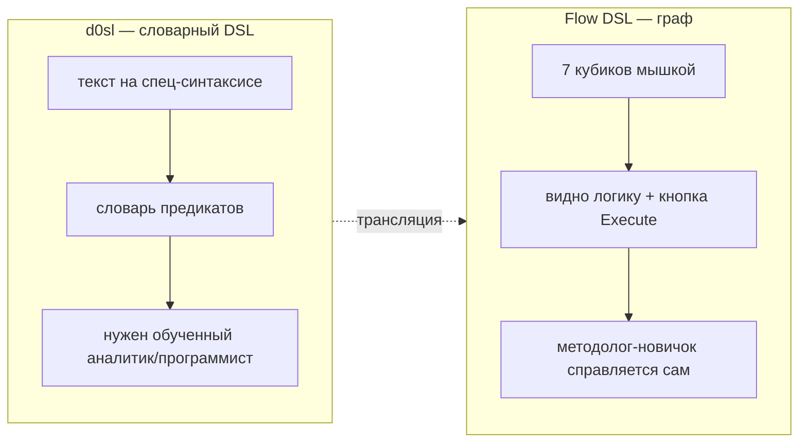
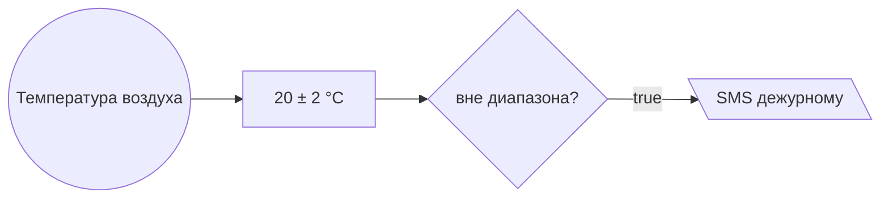
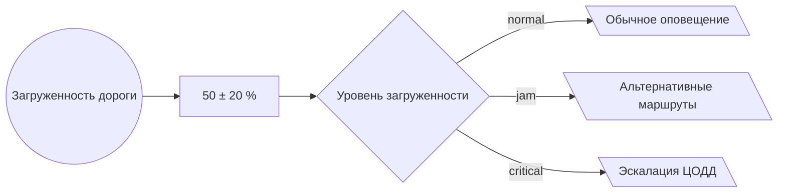
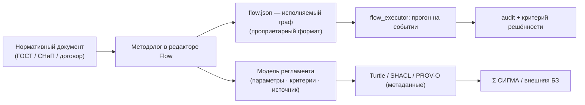
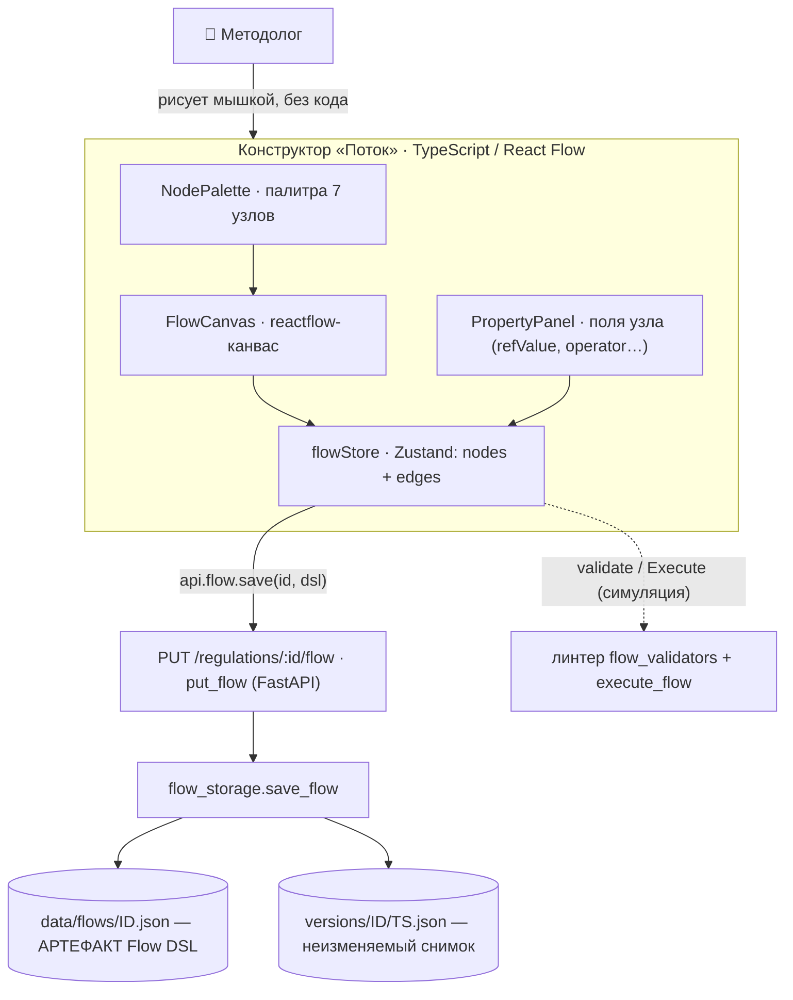
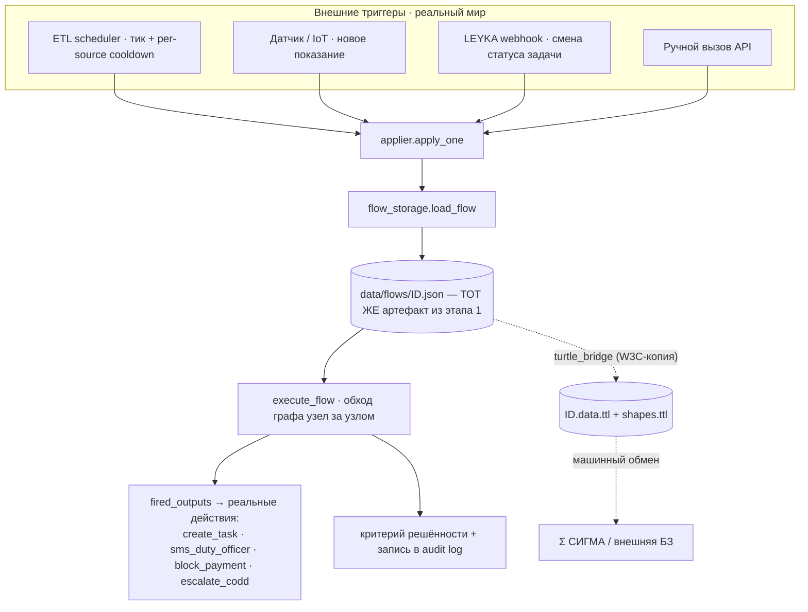

# Flow DSL — питч для команды

> **Для кого:** вся команда РАГРАФ, включая тех, кто не писал ни строки d0sl.
> **Зачем читать:** понять, что такое Flow DSL, почему это не «ещё один редактор схем»,
> и как он заменяет словарный `d0sl` и становится **основным инструментом сборки регламентов** —
> цифровых двойников процессов реагирования (ЦДР).
> **Время чтения:** ~7 минут. Все примеры — из реальных fixtures проекта.

---

## 1. Определение в одну фразу

**Flow DSL — это язык регламентов в виде исполняемого графа из 7 кубиков (узлов графа).**

Ты не пишешь код и не учишь словарь предикатов. Ты соединяешь узлы:
«откуда значение» → «какая норма» → «как сравнить» → «что сделать».
Граф **одновременно** является:

1. **исполняемой моделью** — её гоняет `flow_executor.py` на каждом событии;
2. **визуализацией** — её рисует `flow_to_mermaid.py` сама;
3. **документацией** — то, что видит методолог, и есть то, что выполняет машина.

Это и есть «single source of truth»: нет разрыва между «как нарисовано» и «как работает».

---

## 2. Назначение

Регламент в РАГРАФ — это формализованная **и-задача** субъекта управления (диспетчера, прораба, ГИП):
> «при таком событии, при таком условии — сделать вот это, и вот так проверить, что сработало».

Flow DSL — инструмент, которым эту задачу **собирают руками методолога, без программиста**:

- описать реакцию на событие с датчика / из таск-трекера / из системы заказчика;
- задать пороги, ветвления, вычисления, SHACL-проверки;
- назначить действие (наряд, SMS, блокировка оплаты, эскалация);
- задать **критерий решённости** — как машина поймёт, что инцидент закрыт.

Результат сохраняется как простой `flow.json` (см. `backend/data/fixtures/*.flow.json`) и версионируется.

---

## 3. Философия (что отличает от «редактора блок-схем»)

| Принцип | Что значит на практике |
|---|---|
| **Декларативность** | Описываешь *что* проверить, а не *как* (никаких циклов/переменных вручную). |
| **Граф = модель = документация** | Одна сущность. Нарисовал — оно и исполняется, и документируется. |
| **Без `eval`** | Формулы считает AST-вычислитель `formula_eval.py` — безопасно и формально проверяемо. |
| **Объяснимость по построению** | Каждый прогон — это явный путь по узлам, он пишется в audit. Решение всегда трассируется до узла и до пункта норматива. |
| **Защита от ошибок** | Линтер `flow_validators.py` ловит типовое: `threshold` без `refValue`, `output` с неизвестным action, `switch` без `cases`. |
| **Замкнутость контура** | Граф не заканчивается на «уведомили». Есть критерий решённости — машина сама проверяет исход. |



---

## 4. Элементы (все 7 узлов)

Канон — `backend/app/schemas/domain.py` (тип узла). Формы в mermaid — те же, что рисует сам продукт
(`flow_to_mermaid.py`), поэтому твои схемы будут выглядеть как в интерфейсе.

| Узел | Форма в mermaid | Что делает | Ключевые поля |
|---|---|---|---|
| **input** | `((круг))` | точка входа значения (датчик, задача, REST) | `paramRef` |
| **threshold** | `[прямоуг.]` | эталон/норма параметра | `refValue`, `deviation`, `unit` |
| **compare** | `{ромб}` | сравнение → `true` / `false` | `operator` |
| **formula** | `[прямоуг.]` | вычисление по выражению (AST, без eval) | `expr` |
| **switch** | `{ромб}` | многоветочный выбор | `cases: [{label, value}]` |
| **output** | `[\трапеция\]` | действие / исход | `action`, `text`, `priority`, `severity` |
| **shacl_constraint** | `[прямоуг.]` | проверка SHACL-формой | `shape` |

**Рёбра (edges):** `source → target`, с необязательным `condition` (`true`/`false` для compare,
значение `value` кейса — для switch).

**Операторы compare:** `gt`/`greater`, `lt`/`less`, `ge`, `le`, `eq`/`equal`, `ne`, `outside_range`.

**Серьёзность (severity):** `info` · `warning` · `violation`.

**Действия (action) output** — из реестра `KNOWN_OUTPUT_ACTIONS` (`flow_validators.py`):
`create_task`, `notify_dispatcher`, `sms_duty_officer`, `block_payment`, `block_access`,
`stop_work`/`stop_construction`, `escalate_codd`, `schedule_meeting`, `reset_violation_counter` и др.

---

## 5. Пример «для новичка» — порог температуры

Реальный регламент `tutorial-01-basic-threshold`: серверная должна держать 18…22 °C, иначе — SMS дежурному.



А вот как это лежит в `flow.json` — это и есть весь артефакт, больше ничего писать не нужно:

```json
{
  "nodes": [
    { "id": "in",  "type": "input",     "label": "Температура воздуха", "paramRef": "airTemperature" },
    { "id": "thr", "type": "threshold", "label": "20 ± 2 °C", "refValue": 20.0, "deviation": 2.0, "unit": "°C" },
    { "id": "cmp", "type": "compare",   "label": "вне диапазона?", "operator": "outside_range" },
    { "id": "out", "type": "output",    "label": "SMS дежурному", "action": "sms_duty_officer", "priority": 2 }
  ],
  "edges": [
    { "source": "in",  "target": "thr" },
    { "source": "thr", "target": "cmp" },
    { "source": "cmp", "target": "out", "condition": "true" }
  ]
}
```

**Читается как фраза:** взять температуру → сравнить с нормой 20 ± 2 °C → если вне диапазона → отправить SMS дежурному.

---

## 6. Пример с ветвлением — `switch`

Реальный `tutorial-03-three-level-switch`: загруженность дороги → три разных действия.



Один граф — три исхода. Добавить четвёртую ветку = добавить `case` и ребро, без релиза и без программиста.

---

## 7. Замыкание контура — критерий решённости

`output` — это ещё не конец. У регламента есть **критерий решённости** (acceptance criterion),
по которому машина сама проверяет исход. Пять видов:

| Критерий | Когда инцидент считается закрытым |
|---|---|
| `no_violation` | при следующем прогоне нарушения нет |
| `specific_output` | сработал именно нужный output |
| `task_closed_within_sla` | задача в таск-трекере закрыта в срок |
| `sensor_returned_normal` | датчик вернулся в норму |
| `custom` | произвольное условие на Flow DSL |

Поэтому Flow DSL описывает не «уведомление», а **полный цикл реагирования** — это и делает регламент
**цифровым двойником процесса**, а не просто триггером.

---

## 8. Почему Flow DSL заменяет словарный d0sl

| | `d0sl` (словарный) | **Flow DSL** (граф) |
|---|---|---|
| Форма записи | текст на спец-синтаксисе | граф из 7 кубиков |
| Порог входа | нужен обученный аналитик/программист | методолог-новичок, мышкой |
| Видно ли логику | нет, читаешь текст | да, граф = картина логики |
| Проверка на лету | отдельный прогон | кнопка **Execute** прямо в редакторе |
| Документация | пишется отдельно | генерится сама (`flow_to_mermaid`) |
| Безопасность вычислений | зависит от движка | AST без `eval` |
| Защита от ошибок | ручная | линтер (`flow_validators`) |
| Обмен с Σ СИГМА | свой формат | экспорт в **Turtle/SHACL/PROV-O** (W3C) |

**Совместимость, а не разрыв:** d0sl-правила можно транслировать в Flow-граф (на уровне концепции),
а метаданные регламента Flow DSL отдаёт наружу в стандартном W3C-стеке (`turtle_bridge.py`) —
машинный обмен с городской Σ СИГМА сохраняется.
Тот же класс выразительности (пороги, ветвления, формулы, SHACL), но **zero-code**.



> **Точность:** в Σ СИГМА выгружаются **метаданные** регламента (параметры, SHACL-границы,
> критерии, PROV-O-источник) — это `turtle_bridge.py`. Сам исполняемый граф `flow.json` —
> **проприетарный формат РАГРАФ** и в СИГМУ не отдаётся (`sigma_export.py`: «ragraf_only_files»).
> Это не минус, а актив: ядро логики остаётся нашим (см. § 12 про защиту).

---

## 9. Почему это «основной инструмент» сборки ЦДР (цифровых двойников процессов реагирования)

Регламент в РАГРАФ = формализованная задача субъекта управления. Flow DSL — единственный инструмент,
где эта задача собирается **целиком, в одном артефакте**:

- **вход** (input) — что слушаем,
- **норма** (threshold/formula/shacl) — с чем сверяем,
- **решение** (compare/switch) — как ветвимся,
- **действие** (output) — что делаем,
- **критерий решённости** — как закрываем контур.

Это пять компонентов и-задачи в одном графе. Поэтому Flow DSL — не «фича редактора», а **ядро продукта**:
любой новый домен (стройка, ЖКХ, транспорт, охрана труда) = новый набор Flow-графов, которые собирает
методолог, а не код, который реализуют в спринте разработки.

---

## 10. Архитектура модуля Visual Rule DSL — от мышки до бизнес-процесса

Модуль «Поток» (Visual Rule DSL) живёт **на двух берегах** и связан одним артефактом — `flow.json`.
Это и есть ключ к пониманию: методолог работает **без кода**, но результат его работы — не «картинка»,
а **исполняемый артефакт, который реально переключает ход процесса**. Удобная метафора —
**железнодорожная стрелка**: методолог переводит её мышкой один раз, а дальше каждый «поезд» (событие
из реального мира) едет по тому пути, на который она выставлена.

### Этап 1 · Создание (no-code, фронтенд на TypeScript)

Методолог (оператор конструктора) рисует диаграмму в визуальном конструкторе. Никакого кода — drag-and-drop узлов,
заполнение полей в панели. На выходе TypeScript-слой сериализует канвас в `RuleDSL` и отправляет на бэкенд,
где Python-эндпоинт сохраняет его как `flow.json` + неизменяемый снимок версии.



**Что здесь важно:** граница TS↔Python проходит ровно по `PUT /regulations/:id/flow`. Слева — интерфейс
(`FlowEditorScreen` → `FlowCanvas`/`NodePalette`/`PropertyPanel`, состояние в `flowStore`). Справа —
Python принимает уже готовый `RuleDSL` и кладёт на диск. Кнопка **Execute** даёт методологу прогнать
правило на тестовых показаниях **до** сохранения — это и есть «no-code, но с мгновенной обратной связью».

### Этап 2 · Применение (runtime, бэкенд на Python)

Тот же `flow.json` (или его TTL-копия для машинного обмена) — это «стрелка», через которую проходят
**внешние триггеры реального мира**. Методолог в код не лезет, но его артефакт **физически определяет**,
какое действие выполнит система: создать наряд, отправить SMS, заблокировать оплату, эскалировать.



**Что здесь важно:** `execute_flow` не «интерпретирует текст» — он буквально идёт по узлам и рёбрам того
графа, что нарисовал методолог. Сменил методолог порог в этапе 1 → следующий же триггер в этапе 2 поедет
по новому пути. Артефакт один и тот же на обоих этапах; TTL — это его второй, машиночитаемый «слепок»
для Σ СИГМА, синхронный по содержанию.

### Почему это «реально влияет на код», хотя кода нет

| | Обычная «настройка в UI» | Артефакт Flow DSL |
|---|---|---|
| Что создаётся | строка в конфиге | граф-программа реакции |
| Кто исполняет | прячется в логике приложения | отдельный движок `execute_flow` идёт ровно по графу |
| Влияние на процесс | косвенное | **прямое**: узел `output` = реальное действие (наряд, SMS, блок оплаты) |
| Аналогия | галочка в форме | **стрелка на путях**: переводишь — меняется маршрут поезда-события |
| След | обычно нет | каждый прогон в audit + версия артефакта |

Поэтому Visual Rule DSL — это **программирование без программирования**: методолог не пишет код,
но создаёт исполняемый артефакт, который оркеструет реальный бизнес-процесс. В этом и состоит замена
словарного d0sl: тот же уровень влияния на систему, но порог входа — «нарисовать», а не «написать».

---

## 11. Куда смотреть в коде и в продукте

| Что | Где |
|---|---|
| **Конструктор (этап 1, TS)** | `frontend/src/components/flow/` — `FlowEditorScreen`, `FlowCanvas`, `NodePalette`, `PropertyPanel`, `ExecutePanel` |
| Состояние канваса | `frontend/src/store/flowStore.ts` (Zustand) |
| API-эндпоинты Flow | `backend/app/api/flow.py` — `GET/PUT /regulations/{id}/flow`, `POST …/execute` |
| Хранение + версии артефакта | `backend/app/services/flow_storage.py` → `data/flows/`, `data/versions/` |
| **Применение (этап 2)** | `backend/app/services/etl/applier.py` (`apply_one`) + `etl/scheduler.py` (триггеры) |
| Исполнитель графа | `backend/app/services/flow_executor.py` (`execute_flow`) |
| Триггер от LEYKA/датчиков | `backend/app/services/leyka_task_poller.py` |
| Канон типов узлов | `backend/app/schemas/domain.py` |
| Авто-рендер в mermaid | `backend/app/services/flow_to_mermaid.py` |
| Линтер ошибок | `backend/app/services/flow_validators.py` |
| Безопасные формулы | `backend/app/services/formula_eval.py` |
| TTL-копия (обмен с Σ СИГМА) | `backend/app/services/turtle_bridge.py` |
| Готовые примеры | `backend/data/fixtures/*.flow.json` (старт — `tutorial-01..06`) |
| Визуальный редактор | `https://ragraf.up.railway.app/regulations/<id>/flow` |
| Архитектурный контекст | `docs/ARCHITECTURE.md` § 1.3 «Три проекции регламента» |


---

**TL;DR для команды:** Flow DSL — это регламент как исполняемый граф из 7 кубиков. Его собирает методолог
без кода, он сам себя документирует, безопасно считается, трассируется в audit и замыкает контур критерием
решённости. Он заменяет словарный d0sl по порогу входа и наглядности, сохраняя совместимость через W3C-стек, —
и потому становится основным инструментом сборки цифровых двойников процессов реагирования.
