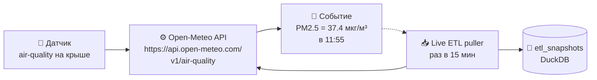
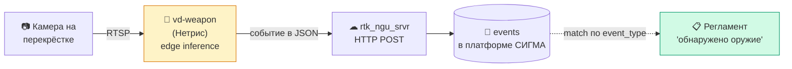
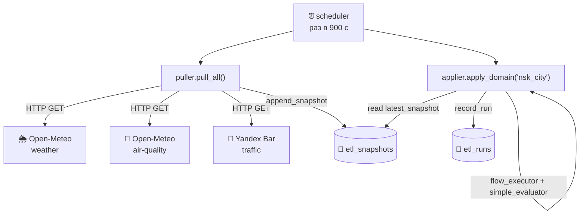
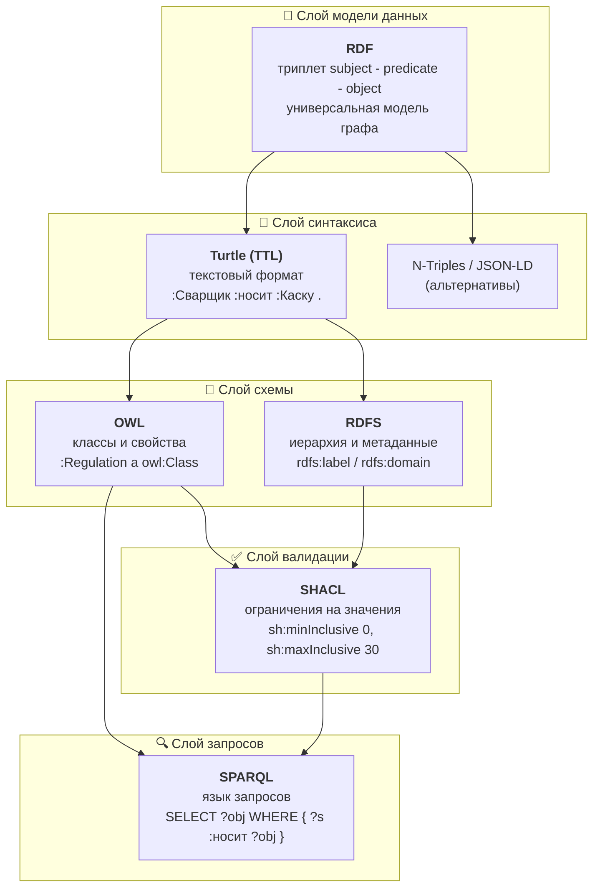
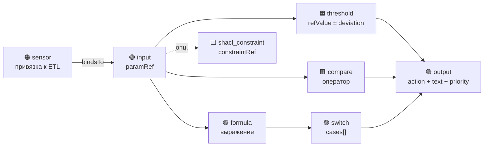
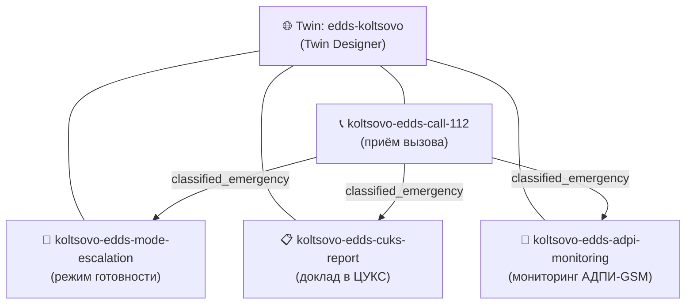
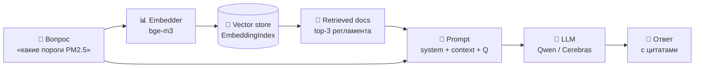
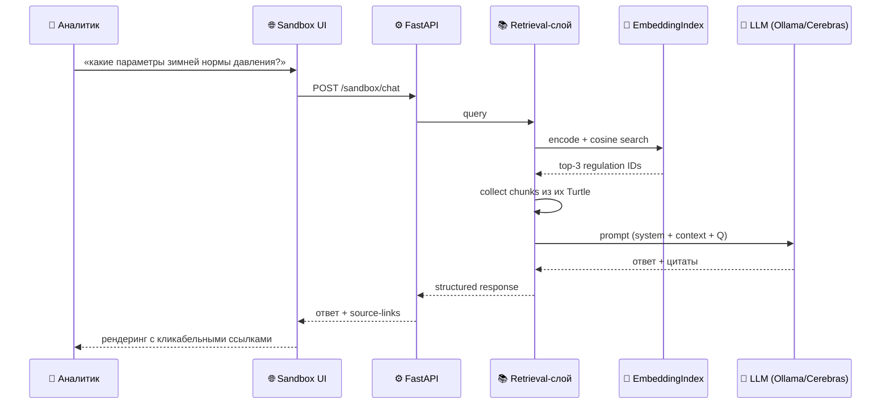

# Учебное пособие: терминология умного города на примере РАГРАФ

> **Кому.** Новый сотрудник мэрии, аналитик экомониторинга, методолог службы ЕДДС, разработчик-новичок, инвестор-куратор, который хочет понять что такое «умный город» и где здесь РАГРАФ. Документ построен как **поэтапное введение**: каждая следующая часть опирается на термины предыдущей.
>
> **Зачем.** В предметной области ~200 терминов из 5-7 разных дисциплин (электроника, сети, базы данных, семантика, ИИ, госуправление). Без единого глоссария люди говорят словами на разных языках и думают, что договорились. Этот файл — общий словарь команды.
>
> **Как читать.** Подряд от Части I (что такое умный город) до Части XII (как мэру показывают дашборд). Если уже знаете часть — переходите по содержанию.
>
> **Связь с РАГРАФ.** Каждый термин снабжён ссылкой «где в РАГРАФ это используется» — конкретный экран, файл, эндпоинт. Не абстрактный словарь, а карта проекта через словарь.

---

## Содержание

- [Часть I. Умный город как идея](#часть-i-умный-город-как-идея)
- [Часть II. IoT — датчики, события и физический мир](#часть-ii-iot--датчики-события-и-физический-мир)
- [Часть III. Видеоаналитика и геопространственные данные](#часть-iii-видеоаналитика-и-геопространственные-данные)
- [Часть IV. ETL и потоки данных](#часть-iv-etl-и-потоки-данных)
- [Часть V. Хранение данных](#часть-v-хранение-данных)
- [Часть VI. Форматы и контракты обмена](#часть-vi-форматы-и-контракты-обмена)
- [Часть VII. Семантический веб — представление знаний](#часть-vii-семантический-веб--представление-знаний)
- [Часть VIII. Цифровые регламенты](#часть-viii-цифровые-регламенты)
- [Часть IX. Rule DSL и Flow Editor](#часть-ix-rule-dsl-и-flow-editor)
- [Часть X. Цифровой двойник процесса](#часть-x-цифровой-двойник-процесса)
- [Часть XI. ИИ-расширение — LLM и RAG](#часть-xi-ии-расширение--llm-и-rag)
- [Часть XII. Принятие решений (DSS) и дашборды для ЛПР](#часть-xii-принятие-решений-dss-и-дашборды-для-лпр)
- [Часть XIII. Архитектура РАГРАФ под капотом](#часть-xiii-архитектура-раграф-под-капотом)
- [Часть XIV. Эксплуатация, безопасность, стандарты](#часть-xiv-эксплуатация-безопасность-стандарты)
- [Часть XV. Управление процессами — киллер-фича РАГРАФ](#часть-xv-управление-процессами--киллер-фича-раграф)
- [Часть XVI. Семантический ИИ — технологический фундамент](#часть-xvi-семантический-ии--технологический-фундамент)
- [Часть XVII. DSL — язык описания процессов (углубление)](#часть-xvii-dsl--язык-описания-процессов-углубление)
- [Часть XVIII. Задачный подход — теоретическая база РАГРАФ](#часть-xviii-задачный-подход--теоретическая-база-раграф)
  - [4-уровневая онтологическая модель Д.Е. Пальчунова](#4-уровневая-онтологическая-модель-де-пальчунова) — онтологический / теоретический / прецедентный / вероятностный слои знаний
  - [Связь с терминологией новых ГОСТов по ИИ](#связь-с-терминологией-новых-гостов-по-ии) — как термины ГОСТ Р 71484.1-2024 и ГОСТ Р 59898-2021 ложатся на 4 уровня модели Пальчунова
- [Что читать дальше](#что-читать-дальше)

---

## Часть I. Умный город как идея

### Главное за минуту

Если на столе уже три коммерческих предложения «умный город под ключ» и от каждого болит голова — мы вас понимаем. РАГРАФ — не очередная платформа, которая ломает регламенты муниципалитета. Это **редактор регламентов**: ваш аналитик-методолог садится за инструмент, формализует процедуры, которые уже работают в ЕДДС, Роспотребнадзоре, транспортном департаменте — и выгружает их в действующий контур СИГМЫ. Никаких параллельных процессов, никаких «датчиков ради датчиков», никаких пафосных дашбордов «для красоты». Каждое автоматическое решение системы прослеживается до конкретного пункта СанПиН/ГОСТ — есть что показать контролёру, депутату, журналисту. Внедрение начинается с пилота на одном районе за 3 месяца. ROI измеряется минутами, сэкономленными при реагировании на инцидент, и временем дежурных, освобождённым от рутины.

### О чём эта часть

Прежде чем погружаться в датчики, базы данных и онтологии — стоит понять **зачем всё это**. Умный город — не самоцель, а способ решить конкретные проблемы городского управления: реакция за минуты вместо часов, объяснимость решений, аудит, экономия на лишних выездах техники.

### Ключевые термины

**Умный город** (smart city) — концепция организации городской инфраструктуры, в которой решения принимаются на основе **данных**, собираемых в реальном времени, и **алгоритмов**, формализующих опыт лучших оперативных дежурных. Цель — сократить время от события (прорвало трубу, превышение PM2.5, ДТП) до реакции с десятков минут до секунд.

**Цифровой регламент** — машинно-исполняемое описание правила реагирования: «если ___, то проверь ___, и вырабтай рекомендацию ___ с приоритетом ___». В РАГРАФ это центральная сущность — см. [Часть VIII](#часть-viii-цифровые-регламенты).

**ЛПР — лицо, принимающее решения**. В контексте умного города это **три уровня**: оперативный дежурный (минуты), руководитель службы (часы), мэр/руководитель департамента (дни-недели). Каждому уровню — свой интерфейс данных. См. [Часть XII](#часть-xii-принятие-решений-dss-и-дашборды-для-лпр).

**Operational Digital Twin of Governance** (операционный цифровой двойник управления) — авторский термин, описывающий класс систем, к которому относится РАГРАФ. Не workflow automation (как Zapier), не BPMN-оркестрация (как Camunda), не digital twin физического актива (как Siemens MindSphere). Это система, фиксирующая **нормативно обоснованное поведение** управленческого аппарата в верифицируемой форме.

**Среда разработки vs платформенный контур** — два дополняющих компонента «фреймворка СИГМА»:
- **Среда разработки** (РАГРАФ) — рабочая станция аналитика, где регламенты создаются и редактируются;
- **Платформенный контур** (ядро СИГМЫ) — production-сервер, который принимает события из города и применяет регламенты в реальном времени.

**Пилотная площадка** — место первого реального внедрения системы. Для РАГРАФ/СИГМА — наукоград Кольцово Новосибирской области, кампус НГУ, мэрия Новосибирска.

### Контекст: что РАГРАФ НЕ делает

| Не наша задача | Кто это делает |
|---|---|
| Принимать события из городских ИС | ETL-модуль платформенного контура СИГМЫ |
| Отправлять SMS / Telegram-уведомления | Notification-шлюз СИГМЫ |
| Показывать дашборд диспетчеру | UI диспетчера в СИГМЕ |
| Хранить runtime-метрики и время реакции | observability-стек СИГМЫ |

РАГРАФ — **только среда проектирования** регламентов и их выгрузки в СИГМУ. Демо-инструмент Live ETL (см. [Часть IV](#часть-iv-etl-и-потоки-данных)) — это валидационный harness, а не production-ETL.

---

## Часть II. IoT — датчики, события и физический мир

### Главное за минуту

«Закупили IoT-датчики, они отдают данные — но никто не использует» — самая частая боль муниципалитета. Классический пример: датчики наполненности мусорных баков бесполезны, если график вывоза фиксирован нормативом. РАГРАФ закрывает эту боль с другой стороны: мы **не торгуем датчиками**. Платформа работает с любым существующим парком — камеры Нетрис и Войслинк, датчики ЖКХ, открытые данные Open-Meteo, Яндекс-пробки, ваши ведомственные сенсоры. Аналитик-методолог добавляет паспорт нового сенсора в Sensor Library за 10 минут — **без программистов**, без интеграционных подрядчиков и допзатрат. Если у вас уже закуплены датчики — РАГРАФ заставит их работать на реальный процесс реагирования. Если только планируете — даст словарь требований к ТЗ закупки, чтобы поставщик не «всучил» бессмысленные коробки.

### О чём эта часть

Здесь рождается **сырьё** для всего умного города — единичное измерение или единичное событие. Понимание этого уровня критично: дальше всё это превращается в потоки, нормализуется, сохраняется, валидируется и анализируется. Но в основе — конкретный физический феномен и устройство, которое его регистрирует.

### Ключевые термины

**IoT — Internet of Things** (Интернет вещей). Концепция, в которой физические объекты (датчики, камеры, исполнительные устройства) подключены к сети и обмениваются данными без участия человека. Термин ввёл Кевин Эштон в 1999 году.

**IIoT — Industrial IoT** (промышленный IoT). Подмножество IoT для промышленных и инфраструктурных применений: теплосети, водоканал, электросети. Отличается требованиями к надёжности (uptime 99.99%), безопасности (отдельные сети без интернета) и стандартам (OPC-UA вместо MQTT).

**Датчик** (sensor) — устройство, преобразующее физическую величину (температура, давление, концентрация газа, освещённость, шум) в электрический сигнал, а затем в цифровое значение. В контексте РАГРАФ — источник единичного **показания** (measurement).

**Актуатор** (actuator) — устройство, выполняющее физическое действие в ответ на сигнал: открыть клапан, включить вентилятор, переключить светофор, разблокировать турникет. В РАГРАФ актуаторов **нет** — это уже задача платформенного контура СИГМЫ.

**Подтип датчика** (sensor subtype) — конкретная модель сенсора внутри класса. Например, в классе «качество воздуха» (`air`) подтипы: `air-co2` (СО2), `air-pm` (взвешенные частицы), `om-air-quality` (Open-Meteo как источник). См. экран [/sensors](#) Sensor Library в РАГРАФ.

**Класс датчика** (sensor type) — широкая категория. В РАГРАФ 9 классов: `p` (давление), `t` (температура), `flow` (расход), `noise` (шум), `detector` (видеодетектор), `fiber` (DAS-оптоволокно), `air` (воздух), `weather` (погода), `traffic` (пробки).

**Telemetry** — поток регулярных численных измерений от датчика (раз в минуту, раз в секунду). В отличие от alert-событий, telemetry **штатна** и не требует немедленной реакции. На этом потоке строится статистика, тренды, прогнозы.

**Событие** (event) — структурированное сообщение от датчика/системы, требующее обработки. Содержит:
- `timestamp` — когда произошло (Unix epoch в миллисекундах);
- `source_id` — кто отправил (ID модуля + ID конкретного устройства);
- `event_type` — тип («telemetry», «alert.smoke», «detection.weapon»);
- `payload` — содержимое (JSON с полями, специфичными для типа).

**Payload** — собственно данные события. Например, для PM2.5: `{"current.pm2_5": 37.4, "unit": "мкг/м³"}`. Для детектора лиц: `{"camera_id": "Camera-3", "confidence": 0.93, "bbox": "412,256,698,521"}`.

**Timestamp** — отметка времени события. Стандарты: ISO 8601 (`2026-05-21T14:30:00Z`), Unix epoch в секундах или миллисекундах (`1748428200000`). В РАГРАФ Unix-ms — основной формат, потому что им оперируют ORM видеодетекторов.

**Edge computing** — обработка данных непосредственно на устройстве или рядом с ним, без отправки в облако. Видеодетектор Нетрис самостоятельно распознаёт лицо и отправляет уже структурированное событие (а не сырое видео) — это edge inference.

**Sampling rate** (частота опроса) — как часто датчик возвращает значение. Для метео — раз в 5-15 минут, для трафика — раз в час, для PM2.5 от Open-Meteo — раз в час, для видеодетектора — событийный режим (только при срабатывании).

**Mesh network** / **LoRaWAN** / **NB-IoT** — типы беспроводных сетей для IoT с разной дальностью и энергопотреблением. Не используются в РАГРАФ напрямую (мы получаем данные уже через HTTP), но важно понимать что между датчиком на улице и нашим API может быть 2-3 уровня сетевых посредников.

### Протоколы передачи

**HTTP / HTTPS** — REST API, самый универсальный способ. Open-Meteo и Yandex Bar XML отдают данные через HTTP. РАГРАФ-puller использует `httpx.AsyncClient`.

**MQTT** (Message Queuing Telemetry Transport) — pub/sub-протокол для IoT, спроектирован для медленных нестабильных сетей. Брокер (Mosquitto, EMQX) хранит сообщения, клиенты подписываются на топики (`sensors/heating/temp/+`). РАГРАФ напрямую с MQTT не работает — это уровень платформенного ETL СИГМЫ.

**OPC-UA** — промышленный стандарт для SCADA-систем. Используется в теплосетях, на водоканале. РАГРАФ не подключается, но регламенты ЦИИ НГУ (`heating-network`) описывают такие источники.

**WebSocket** — двунаправленный канал поверх HTTP. Применяется для real-time UI (push событий в браузер). В РАГРАФ не используем (поллим через TanStack Query); возможный backlog-пункт.

### Пример события в РАГРАФ

Live ETL пуллит Open-Meteo:

```json
{
  "timestamp": "2026-05-21T11:55:24Z",
  "source_id": "open-meteo-air",
  "subtype": "om-air-quality",
  "field": "current.pm2_5",
  "value": 37.4,
  "region": "moscow",
  "raw_payload": "{\"endpoint\": \"air-quality\", \"city\": \"Москва\", ...}"
}
```

Это — одна **строка в таблице `etl_snapshots`**, один атомарный факт. Из таких строк строится всё остальное.

### Сценарий «один датчик в РАГРАФ»



Дальше эти snapshots обрабатывает applier — см. [Часть IV](#часть-iv-etl-и-потоки-данных) и [Часть IX](#часть-ix-rule-dsl-и-flow-editor).

---

## Часть III. Видеоаналитика и геопространственные данные

### Главное за минуту

Городское видеонаблюдение — самый большой источник событий и одновременно самая частая боль с интеграцией: разные вендоры, разные форматы, vendor lock-in. РАГРАФ говорит на языке **российских вендоров «из коробки»**: паспорта моделей Нетрис (распознавание лица, оружия, дыма) и Войслинк (марка авто, ДТП, остановки в полосе) уже встроены в Sensor Library. Аналитику не нужно разбираться в RTSP/ONVIF и пакетах OpenCV — он перетаскивает блок «обнаружено оружие» в схему регламента и подключает к ответному действию. Привязка к геокоординатам и слою OpenStreetMap — встроенная: на дашборде инцидент мгновенно появляется на карте без отдельной интеграции с ГИС. Для руководителя это закрывает страх «зависнуть на одном поставщике видеоаналитики на годы» — замена детектора не ломает регламенты.

### О чём эта часть

Огромная доля городских событий приходит от камер. Это отдельная сложная область с собственной терминологией. Параллельно — пространственный аспект: события без координат бесполезны, **где** случилось не менее важно чем **что**.

### Ключевые термины (видеоаналитика)

**CCTV** (Closed-Circuit Television) — система видеонаблюдения. В умном городе CCTV-камеры — крупнейший поставщик событий: ANPR (распознавание номеров), лица, инциденты, толпа, оставленные предметы.

**Видеодетектор** (video detector, vd) — это **не камера**, а программа, обрабатывающая поток с камеры и формирующая структурированные события. Может работать на edge (внутри камеры или соседнего box'а) или на сервере (вычислительный кластер).

**ANPR** (Automatic Number Plate Recognition) — распознавание автомобильных госномеров. ГОСТ Р 50577-2018. В РАГРАФ — подтип `vd-anpr`, ORM-модель `EventNumberPlate` (см. `event-data-examples/videodetectors/grz_postgresql.py`).

**Re-ID** (Re-Identification) — повторная идентификация одного и того же объекта (человек, ТС) на нескольких камерах. Не используем напрямую в регламентах, но в `EventPerson` есть `track_id` именно для этого.

**Bounding box** (bbox) — прямоугольная область в кадре, ограничивающая распознанный объект. Формат в РАГРАФ: `"x1,y1,x2,y2"` в пикселях, например `"412,256,698,521"`.

**Confidence** (доверие) — оценка модели, насколько она уверена в детекции. Диапазон 0..1, обычно от 0.85 считается «уверенно». Поле `confidence` есть у всех vd-подтипов.

**False positive / false negative** — ложное срабатывание (модель сказала «есть» когда нет) и пропуск (модель сказала «нет» когда есть). Балансируются настройкой confidence threshold.

**Класс объекта** (`class_id`) — что распознала модель: 0 = person, 1 = car, 2 = bus, 3 = motorcycle и т.д. Числовые ID без явной семантики; нужна таблица соответствия от вендора.

**Edge inference** — выполнение модели машинного обучения непосредственно на камере или соседнем устройстве (Jetson, NPU). Снижает нагрузку на сеть, ускоряет реакцию.

**RTSP / ONVIF** — стандарты потокового видео и управления CCTV-камерами. РАГРАФ напрямую с ними не работает (получает уже распознанные события), но в Module Library есть паспорта `rtk_ngu_srvr` и `rtk_ngu_sa` Нетриса — это и есть RTSP-кластеры.

**Нетрис, Войслинк** — российские вендоры видеоаналитических систем. В РАГРАФ Sensor Library есть подтипы для их детекторов: `vd-face`, `vd-person`, `vd-anpr`, `vd-fall`, `vd-smoke`, `vd-fire`, `vd-weapon` (Нетрис, 2024 PDF #13) и `vd-vehicle-brand`, `vd-accident`, `vd-stop-in-lane`, `vd-pedestrian` (Войслинк, 2024 PDF #14).

**DAS — Distributed Acoustic Sensing** (распределённое акустическое чувствование). Оптоволокно как датчик: один кабель длиной до 50 км ловит вибрации вдоль всей длины. Подтипы в РАГРАФ: `fiber-vibration`, `fiber-temperature`. Применение: охрана трубопроводов, периметра охраняемой зоны.

### Ключевые термины (геопространство)

**GIS** (Geographic Information System) — система работы с географическими данными. Векторные слои (точки, линии, полигоны), растровые карты, операции (буфер, пересечение, в полигоне ли точка).

**Географическая система координат** — способ задать точку на Земле:
- **WGS-84** (World Geodetic System 1984) — глобальный стандарт, используется GPS, OpenStreetMap, Google Maps. Координаты: широта (`lat` ∈ [-90, 90]), долгота (`lon` ∈ [-180, 180]).
- **Локальные системы** — для городов часто используются проектные СК (например, СК-95 для России). В РАГРАФ только WGS-84.

**lat / lon** — широта/долгота. Для Москвы: lat=55.7558, lon=37.6173. В РАГРАФ хранится в `cities.py` для 20 городов России (используется Live ETL для пуллинга Open-Meteo).

**Geohash** — короткая строка-идентификатор географической ячейки. Например, `ucfv` — это весь центр Москвы. Полезен для индексации и кластеризации точек, но в РАГРАФ не используется (только lat/lon).

**Geofence** — виртуальная граница на карте. Событие «объект пересёк geofence» — типичный триггер для умного города. В РАГРАФ напрямую не реализован, но регламенты Войслинк (`vd-stop-in-lane`, `vd-dropped-cargo`) подразумевают конфигурацию geofence на стороне детектора.

**POI** (Point of Interest) — значимая точка на карте: больница, школа, остановка ОТ. Используется в дашбордах для контекста.

**OSM** (OpenStreetMap) — открытая глобальная карта, заменяет коммерческие Google Maps в open-source проектах. РАГРАФ напрямую не интегрируется, но если когда-нибудь будем рисовать карту инцидентов — это первый кандидат.

### Сценарий «детектор Нетрис → регламент»



В РАГРАФ мы **проектируем сам регламент** `R` и **схему события** (что Нетрис должен прислать). Само распознавание происходит вне РАГРАФ.

---

## Часть IV. ETL и потоки данных

### Главное за минуту

Главная претензия руководителя экомониторинга к существующим системам — **задержка от нескольких часов до суток**. К моменту, когда видно превышение ПДК, выброс уже размазался по району, и реагировать поздно. РАГРАФ демонстрирует обратное на встроенном Live ETL: открытые данные Open-Meteo и Яндекс-пробок превращаются в применённое правило регламента **за <60 секунд**. Это валидационная площадка — production-СИГМА работает по той же логике, но в промышленном масштабе. Аналитик собирает поток мышкой в редакторе: «источник → нормализация → правило → команда». Никакого Apache NiFi, Kafka-кластера или Kubernetes-сертификатов: команды `docker compose up` достаточно, чтобы методолог начал работать. На уровне муниципалитета это снижает порог входа: проект не требует «закупать инфраструктуру под ETL» — он работает на одной виртуалке.

### О чём эта часть

Один датчик отдаёт одно число. Тысячи датчиков отдают миллионы чисел в день. Чтобы это стало управляемым потоком, нужны паттерны: сбор, нормализация, буферизация, доставка. Этим занимается ETL-слой.

### Ключевые термины

**ETL — Extract, Transform, Load**:
- **Extract** (извлечение) — забрать данные из источника (HTTP, Kafka, БД, файл);
- **Transform** (трансформация) — привести к единой схеме, посчитать производные;
- **Load** (загрузка) — записать в целевое хранилище (БД, data warehouse, файлы).

В РАГРАФ свой мини-ETL (см. `services/etl/`) делает все три шага: `puller.py` (E), `applier.py` (T), `live_data_store.py` (L).

**ELT** (Extract, Load, Transform) — современная альтернатива: грузим сырьё в хранилище, трансформируем уже там (SQL-запросами). Подход modern data warehouse (Snowflake, BigQuery, DuckDB).

**Pull vs Push**:
- **Pull** — потребитель сам идёт за данными по расписанию (HTTP GET раз в 15 мин). Простота, но задержка. РАГРАФ Live ETL — pull.
- **Push** — источник сам отправляет данные потребителю по факту события (webhook, MQTT publish). Быстрее, но требует чтобы потребитель был online.

**Batch vs Stream**:
- **Batch processing** — накопить пачку (за минуту, час, день) и обработать одним заходом. Дёшево, но с задержкой.
- **Stream processing** — обрабатывать каждое событие сразу как пришло. Технологии: Apache Flink, Kafka Streams, ksqlDB.

РАГРАФ Live ETL — это mini-batch (раз в 15 мин). Production-ETL СИГМЫ будет stream.

**Idempotency** (идемпотентность) — свойство операции, при котором повторное применение даёт тот же результат, что и однократное. Критично для распределённых систем, где сообщения могут дублироваться. Например, INSERT регламента в seed должен быть идемпотентен — повторный запуск не создаёт дубль.

**Dead Letter Queue (DLQ)** — отдельная очередь для сообщений, которые не удалось обработать (битый JSON, неизвестная схема). Позволяет не терять данные и разбираться постфактум.

**Apache Kafka** — самый популярный распределённый брокер сообщений для streams. Очереди тут называются «топики», сообщения хранятся X дней (можно reread). Не используем напрямую в РАГРАФ.

**RabbitMQ** — альтернатива Kafka, проще для запуска, классическая queue-семантика. Тоже не используем.

**Scheduler** — компонент, запускающий задачи по расписанию. В РАГРАФ — `asyncio.create_task(run_scheduler())` из FastAPI lifespan, интервал 15 минут (`ETL_INTERVAL_SECONDS`).

**Backpressure** — механизм замедления отправителя, когда получатель не успевает. Без backpressure быстрый продьюсер + медленный консьюмер = переполнение буфера → потеря данных.

**Data pipeline** — последовательность шагов обработки от источника до целевого хранилища. РАГРАФ Live ETL pipeline: `puller.pull_all()` → `live_data_store.append_snapshot()` → `applier.apply_domain()` → `live_data_store.record_run()`.

**Schema evolution** — управление изменением схемы события во времени. Новые поля добавляются, старые помечаются deprecated. Avro/Protobuf поддерживают forward/backward compatibility из коробки.

**Normalization** (нормализация) — приведение разных источников к единой форме. Например: Open-Meteo даёт температуру в °C, другой источник в °F — нормализуем к °C перед записью.

**Snapshot** (снимок) — состояние одного датчика в один момент. В РАГРАФ таблица `etl_snapshots` — log из таких снимков; `latest_snapshot()` берёт последнюю запись для (subtype, field, region).

**Replay** — повторное проигрывание потока событий из истории. Полезно для отладки регламентов и backfill метрик.

**Watermark** — отметка времени в потоке: «все события до этого момента уже обработаны». Нужна для late-arriving data (когда событие за 11:55 пришло в 12:03 из-за сетевой задержки).

### Сценарий «Live ETL tick в РАГРАФ»



Один такой цикл (tick) занимает <5 секунд при здоровых внешних API.

### Реальный взгляд: что бывает не так

| Проблема | Причина | Что делает РАГРАФ |
|---|---|---|
| Yandex 403 на 38% запросов | Yandex блокирует data-center IP | health-индикатор по `freshness_seconds` вместо `last_status` — см. фикс 2026-05-21 |
| Внешний API вернул 500 | Сервер источника упал | `record_health(source_id, "error")`, продолжаем со следующим источником через `asyncio.gather(return_exceptions=False)` |
| pull прошёл, apply нашёл 0 sensors | Stale Volume-flow для регламента | Safety net в `applier._resolve_flow`: если Volume имеет 0 sensors, а fixture богатая → берём fixture |

---

## Часть V. Хранение данных

### Главное за минуту

«Какая база данных? Импортозамещение? Лицензии? 152-ФЗ?» — это первые вопросы службы информационной безопасности любого муниципалитета. РАГРАФ хранит регламенты и состояние двойников в **DuckDB** — embedded-СУБД на свободной лицензии MIT, без иностранных вендоров и санкционных рисков. Регламенты — это **файлы**: их можно положить в git, разрешить правки только через pull request, держать аудит-лог изменений. Если завтра придёт ФСТЭК с проверкой — каждое поле каждого регламента открывается в plain-text. On-premise развёртывание без облаков и зависимостей от внешних API. Аналитик-методолог работает с базой через UI; администратору достаточно скопировать директорию `data/` в резервную копию — это и есть бэкап. Никаких лицензионных платежей, никаких годовых подписок «за пользователя».

### О чём эта часть

Снапшоты, события, регламенты, версии — всё это надо где-то хранить. Класс БД зависит от того, что важно: скорость чтения или записи, аналитика или транзакции, гибкость схемы или строгость.

### Ключевые термины

**База данных** (database, БД) — система для организованного хранения и быстрого поиска структурированных данных. От `JSON`-файла отличается: индексами, транзакциями, конкурентным доступом, гарантиями целостности.

**СУБД** — система управления базами данных (DBMS). Программа, реализующая БД: PostgreSQL, MySQL, SQLite, DuckDB, MongoDB.

**SQL** (Structured Query Language) — стандартный язык запросов для реляционных БД. `SELECT name FROM regulations WHERE status = 'active'`. Появился в 1970-х (IBM).

**NoSQL** — собирательное название не-реляционных БД. Включает: документные (MongoDB), колоночные (Cassandra), графовые (Neo4j), key-value (Redis).

**Реляционная БД** — данные в таблицах с фиксированной схемой, связи через foreign key. Примеры: PostgreSQL, MySQL, SQLite, MariaDB. Лучшая модель для большинства бизнес-задач.

**Схема** (schema) — описание таблиц, колонок, типов, индексов, связей. Изменяется через миграции.

**Транзакция** (transaction) — атомарная группа операций: либо все применились, либо ни одна (rollback). Защита от частично применённых изменений при сбое.

**ACID** — свойства транзакций:
- **Atomicity** — атомарность (всё или ничего);
- **Consistency** — целостность (до и после транзакции БД в валидном состоянии);
- **Isolation** — изоляция (параллельные транзакции не видят промежуточных состояний друг друга);
- **Durability** — устойчивость (после commit данные не потеряются даже при crash).

**OLTP vs OLAP**:
- **OLTP** (Online Transaction Processing) — миллионы коротких транзакций (заказ в магазине, перевод денег). Оптимизация: PostgreSQL, MySQL, SQLite.
- **OLAP** (Online Analytical Processing) — аналитика, агрегаты по большому объёму (отчёты, дашборды). Оптимизация: ClickHouse, DuckDB, Snowflake, BigQuery.

**Колоночная БД** — хранит данные по колонкам, не по строкам. Для запросов `SELECT AVG(price) FROM sales` читает только колонку `price`, не все строки целиком. Резко ускоряет аналитику на больших таблицах.

**DuckDB** — embedded колоночная аналитическая БД. Файл-БД (как SQLite), но колоночная (как ClickHouse). Лучший выбор для одиночного embedded analytics. **В РАГРАФ DuckDB — основное хранилище**: `regulations.duckdb` (CRUD регламентов) и `live_etl.duckdb` (поток событий).

**SQLite** — embedded реляционная БД, файл-БД. Самая распространённая СУБД в мире (в каждом телефоне, браузере, навигаторе). В РАГРАФ не используется напрямую (выбрали DuckDB), но используется в LEYKA — соседнем проекте.

**Документная БД** (document DB) — хранит JSON-документы без жёсткой схемы. Пример: MongoDB, CouchDB. Гибко, но без джойнов. В РАГРАФ не используется.

**Time-series БД** — оптимизирована для потоков событий с timestamp: InfluxDB, TimescaleDB, VictoriaMetrics. Автоматическое прореживание истории, downsampling, retention policies. В РАГРАФ live_etl.duckdb работает как простой time-series store (`etl_snapshots`).

**Graph DB** — графовая БД (Neo4j, Amazon Neptune). Узлы и рёбра как first-class. Для запросов «кто-то-кого-знает» и подобных. В РАГРАФ не используется напрямую — RDF-граф живёт в rdflib in-memory, не в persistent graph DB.

**Triple store** — специализированное хранилище RDF-триплетов: Apache Jena Fuseki, Oxigraph, GraphDB. **СИГМА** использует Jena. РАГРАФ не использует — экспортирует Turtle-файлы.

**WAL — Write-Ahead Log** — журнал упреждающей записи. Перед изменением данных в основном файле БД, запись попадает в WAL. При crash восстановление идёт по WAL. У DuckDB и SQLite есть собственные WAL (`*.duckdb.wal`).

**Checkpoint** — операция флаша WAL в основной файл и очистки WAL. В РАГРАФ выполняется в `lifespan`-shutdown FastAPI — критично для Railway, чтобы SIGTERM не повредил БД.

**Индекс** (index) — структура данных для ускорения поиска. Обычно B-tree. У DuckDB также есть zone-maps (мин/макс на каждом блоке колонки).

**Foreign key (FK)** — ссылка из одной таблицы в другую: `regulation_history.regulation_id → regulations.id`. Гарантирует, что ссылка указывает на существующую запись.

**Миграция** (migration) — версионируемое изменение схемы БД. Каждая миграция — это пара `upgrade()`/`downgrade()`. В Python — Alembic; в Django — встроенные migrations; в Ruby — ActiveRecord. **В РАГРАФ миграций нет** — DuckDB schema создаётся идемпотентно через `ALTER TABLE ADD COLUMN IF NOT EXISTS` в `_init_schema()`.

**Volume** (постоянный том) — изолированное хранилище в облаке/контейнере, переживающее перезапуск инстанса. На Railway `/data` — Volume. Без него БД пересоздавалась бы при каждом deploy.

### Что хранится в РАГРАФ — карта

| Файл/таблица | СУБД | Что внутри |
|---|---|---|
| `${DATA_DIR}/regulations.duckdb` | DuckDB | `regulations`, `parameters`, `processes`, `sensor_subtypes`, `modules`, `audit_log_entries`, `regulation_history`, `flow_versions` и др. (12+ таблиц) |
| `${DATA_DIR}/live_etl.duckdb` | DuckDB | `etl_snapshots`, `etl_runs`, `etl_health` |
| `${DATA_DIR}/flows/{id}.json` | Файл | Текущий Rule DSL Flow для одного регламента |
| `${DATA_DIR}/versions/{id}/{uuid}.json` | Файл | Immutable snapshots Flow |
| `${DATA_DIR}/source_documents/{id}/` | Папка | PDF/DOCX документов-оснований + Turtle с PROV-O |
| `${DATA_DIR}/embedding_cache/` | Файлы | Кэш bge-m3 эмбеддингов корпуса регламентов (для retrieval-слоя в Студии аналитика) |
| `${DATA_DIR}/knowledge/{domain}/{id}.ttl` | Файл | Knowledge Studio датасеты (RDF Turtle) |

### Почему мы выбрали DuckDB

| Альтернатива | Почему не она |
|---|---|
| PostgreSQL | Single-user РАГРАФ, OLAP-нагрузка (граф связей, агрегаты). Postgres overkill, требует сервер БД. |
| SQLite | Row-oriented; на агрегатах графа корпуса проигрывает DuckDB в 5-20 раз. |
| MongoDB | Документная — потеряли бы джойны и SHACL-валидацию через rdflib. |
| Triple store (Fuseki) | JVM-сервис, отдельный процесс, ~500 МБ RAM. Overkill для 10-100 регламентов. |

См. ADR-002 в [ARC.md §15](ARC.md#15-adr--принятые-архитектурные-решения).

---

## Часть VI. Форматы и контракты обмена

### Главное за минуту

Каждый муниципалитет — это **15 разнородных систем**, которые «не разговаривают» друг с другом: ЕИСЖС, ГИС ЖКХ, СМЭВ, Госуслуги, ведомственные АРМ Роспотребнадзора и Росгидромета, медицинские ИС. Боль интеграции — то, что заставляет руководителя цифровизации откладывать запуск проектов на годы. РАГРАФ принципиально использует **только открытые текстовые форматы**: JSON для API, Turtle (RDF) для регламентов, CSV для экспорта в Excel и отчётов в надзорные органы. Никаких проприетарных бинарников — любой инспектор открывает регламент в Notepad++ и проверяет содержимое. Это закрывает классическое возражение про vendor lock-in: если завтра решите сменить поставщика, все ваши регламенты выгрузятся в стандартный Turtle, который читает любая семантическая платформа в мире. Готовые коннекторы — без допзатрат на интеграционных подрядчиков.

### О чём эта часть

Сервисы должны понимать друг друга. Для этого нужны общие форматы (JSON, YAML) и контракты (OpenAPI, JSON Schema). Без них любое API через год превращается в чёрный ящик, который никто не помнит как звать.

### Ключевые термины

**JSON** (JavaScript Object Notation) — текстовый формат данных, де-факто стандарт обмена в вебе. Простой: объекты `{}`, массивы `[]`, числа, строки, `true/false/null`.

```json
{
  "id": "nsk-ecology",
  "name": "Регламент NSK · Пороги экологических рисков",
  "parameters": [{"name": "pm25", "ref": 35.0}]
}
```

**JSON Schema** — стандарт для описания структуры JSON-документов. Аналог XSD для XML. РАГРАФ использует Pydantic (генерирует JSON Schema под капотом) для валидации API-запросов.

**YAML** — альтернатива JSON с фокусом на читаемость (отступы вместо скобок). Используется для конфигурации (Docker, Kubernetes, GitHub Actions, NSK_OpenData_Bot YAML регламенты).

**XML** (eXtensible Markup Language) — древний формат, родитель JSON. Тяжеловесный, но всё ещё используется в legacy-системах. РАГРАФ парсит XML от Yandex Bar (`reginfo.xml`).

**CSV** (Comma-Separated Values) — табличный формат, один столбец на колонку, запятая (или `;`) как разделитель. Knowledge Studio импортирует CSV → RDF.

**Protocol Buffers (Protobuf)** — бинарный формат от Google. Быстрее JSON, требует схему. Используется в gRPC. В РАГРАФ не применяется.

**Avro** — бинарный формат с схемой и forward/backward compatibility. Стандарт для Apache Kafka. В РАГРАФ не применяется.

**MessagePack** — бинарная альтернатива JSON. Компактнее, но без схемы.

### Контракты API

**API** (Application Programming Interface) — интерфейс для программного обмена. В контексте веба обычно подразумевается REST API через HTTP.

**REST** (Representational State Transfer) — архитектурный стиль API: ресурсы по URL, действия через HTTP-методы (`GET`, `POST`, `PUT`, `DELETE`), статус через HTTP-коды (`200`, `404`, `500`). РАГРАФ — REST API, 19 routers, 70+ эндпоинтов.

**HTTP-методы**:
- **GET** — получить ресурс, идемпотентно;
- **POST** — создать новый, не идемпотентно;
- **PUT** — заменить целиком, идемпотентно;
- **PATCH** — частично обновить, идемпотентно;
- **DELETE** — удалить, идемпотентно.

**HTTP-коды**:
- `2xx` — успех (`200 OK`, `201 Created`, `204 No Content`);
- `3xx` — редирект;
- `4xx` — ошибка клиента (`400 Bad Request`, `401 Unauthorized`, `403 Forbidden`, `404 Not Found`, `409 Conflict`, `422 Unprocessable Entity`);
- `5xx` — ошибка сервера (`500 Internal Server Error`, `503 Service Unavailable`).

**OpenAPI** (Swagger) — стандарт описания REST API. YAML/JSON-документ с перечислением всех эндпоинтов, параметров, схем запросов/ответов, кодов. FastAPI **автоматически генерирует** OpenAPI 3.1 из аннотаций Python — это видно на `https://ragraf.up.railway.app/docs`.

**Swagger UI** — интерактивный веб-просмотрщик OpenAPI. Можно дёргать эндпоинты прямо из браузера. РАГРАФ предоставляет на `/docs`.

**Endpoint** (эндпойнт) — конкретный адрес API: `GET /api/regulations/{id}`. В РАГРАФ их около 70.

**Идемпотентность HTTP-метода** — `GET`, `PUT`, `DELETE` идемпотентны (повторный вызов даёт тот же результат), `POST` — нет. На уровне semantic, не реализации.

**Idempotency-key** — заголовок HTTP-запроса, позволяющий клиенту указать «это тот же запрос что и в прошлый раз». Сервер проверяет ключ и возвращает кэшированный результат. Не применяется в РАГРАФ (single-user, риск дублей низкий), но стандарт для платёжных API.

**Версионирование API**:
- **URI-versioning** — `/api/v1/regulations`, `/api/v2/regulations`. Самый простой и явный.
- **Header-versioning** — `Accept: application/vnd.api+json; version=2`. Чище URL, но скрыто.
- **Параметр** — `?api_version=2`. Самый плохой, мешает кешу.

РАГРАФ использует URI-versioning: `/api/...` без явной версии (de facto v1). Когда выйдет v2 — добавим `/api/v2/`.

**CORS** (Cross-Origin Resource Sharing) — механизм безопасности браузера. Браузер по умолчанию запрещает запросы с одного origin на другой (например, с `vercel.app` на `railway.app`). CORS-заголовки (`Access-Control-Allow-Origin`) разрешают это явно. РАГРАФ настроен через `CORSMiddleware` в `main.py`.

**HATEOAS** — Hypermedia As The Engine Of Application State. Принцип REST, по которому ответ API содержит ссылки на возможные следующие действия. РАГРАФ не строгий HATEOAS, но в дашборде Live ETL карточка регламента содержит ссылку на редактор.

**RPC** (Remote Procedure Call) — альтернатива REST, более «функциональная» (вызов удалённой процедуры). Реализации: gRPC, JSON-RPC. Не применяется в РАГРАФ.

**GraphQL** — альтернатива REST от Facebook. Один эндпоинт, клиент сам говорит какие поля ему нужны. Хорошо для frontend с разными screens, требует backend-усилий. Не применяется в РАГРАФ.

### Где это в РАГРАФ

| Сущность | Формат |
|---|---|
| API-контракт | OpenAPI 3.1 (автоматически из FastAPI + Pydantic) |
| Запросы/ответы API | JSON |
| Импорт регламентов из NSK | YAML → fixtures |
| Knowledge Studio импорт | CSV |
| Yandex Bar pull | XML |
| Хранение регламента | DuckDB row + Turtle при экспорте |
| Описание flow | JSON (`{id}.json`) |
| SIGMA bundle | ZIP с TTL + JSON manifest |

---

## Часть VII. Семантический веб — представление знаний

### Главное за минуту

«Зачем нам какие-то онтологии? Дайте обычную базу!» — типичная реакция на термин RDF. На самом деле семантический веб решает ровно ту проблему, которая болит у руководителя: **объяснимость каждого решения системы**. Когда РАГРАФ говорит «PM2.5 превышен в 1.4 раза за окно 30 минут, рекомендуется ограничить движение на участке N», под этим выводом — формальная цепочка: датчик → норматив СанПиН 1.2.3685-21 → правило регламента → команда. Каждый шаг показывается инспектору, депутату, журналисту, суду — **никакого «чёрного ящика ИИ»**, защититься от критики не сложнее, чем показать конкретный пункт нормативного документа. Это и есть XAI-by-design, который требуют от поставщиков муниципальных систем при проверках Минцифры и Роспотребнадзора. Аналитику-методологу не нужно писать SPARQL руками — РАГРАФ предлагает редактор через формы и шаблоны.

> Эта часть — основа документа, существующая исторически. Здесь самое сложное концептуально: переход от «таблицы строк в БД» к «граф знаний». Если читали с начала — все термины из Частей II-VI здесь пригодятся.

### TL;DR — в одной таблице

| Аббрев. | Что это | Зачем |
|---|---|---|
| **RDF** | Модель данных «субъект-предикат-объект» (триплет) | Универсальный способ описать любые факты как граф |
| **Turtle (TTL)** | Текстовый формат для записи RDF | Чтобы триплеты выглядели читаемо, как `:Сварщик :носит :Каску .` |
| **SPARQL** | Язык запросов к RDF-графу | «SELECT ?obj WHERE { ?s :носит ?obj }» — как SQL, но к графу |
| **OWL** | Язык описания **схемы** (что такое «Регламент», какие у него поля) | Чтобы граф знал «Регламент — это класс, у него есть свойство name» |
| **SHACL** | Язык **ограничений** (валидации значений) | «давление ≥ 0», «дата обязательна», «температура ≤ 150» |

**Аналогия с обычной БД:**
- RDF + Turtle = **строки данных** в файле
- OWL = **DDL** (CREATE TABLE Regulations(name TEXT, ...))
- SHACL = **CHECK-ограничения** (CHECK (pressure >= 0))
- SPARQL = **SELECT-запросы**

### Семантический стек — слои Lego



**Как читать:** RDF — фундамент (одна модель данных). Turtle — её текстовая запись. OWL и RDFS — словарь схемы поверх RDF. SHACL добавляет правила валидации на основе схемы. SPARQL — язык вопросов ко всему этому.

### 1. RDF — модель данных

**RDF (Resource Description Framework)** — стандарт W3C, говорит: любой факт можно записать как **триплет**:

```
Субъект    →   Предикат      →    Объект
─────────────────────────────────────────
:Сварщик   :должен_носить       :Защитная_маска
:Сварщик   :подвержен_риску     "Ожог глаз"
:Сварщик   rdfs:label           "Сварщик"
```

Из триплетов строится **граф**: один субъект может иметь много предикатов, один и тот же объект может встречаться у разных субъектов. Это **именованный направленный граф**.

**Триплет** (triple, statement) — единица RDF. Три позиции: субъект (что), предикат (какое отношение), объект (с чем). Один факт — один триплет.

**IRI / URI** (Internationalized / Uniform Resource Identifier) — идентификатор сущности или предиката. Похож на URL, но не обязательно «адрес ресурса в сети». В RDF полные IRI всегда в `<...>`, например `<http://regulations.local/ontology#name>`. В Turtle используется сокращение через `prefix:` — `:name`.

**Namespace** — URI-префикс для группы родственных IRI. Например, `<http://regulations.local/ontology#>` — namespace всех свойств РАГРАФ-онтологии.

**Prefix** — короткое имя для namespace. Декларируется через `@prefix kn: <urn:ragraf:knowledge:construction#>` (Turtle) или `PREFIX kn: <...>` (SPARQL).

**Blank node** — анонимный узел графа, у которого нет IRI. Записывается как `_:b1` или через `[ ... ]` в Turtle. Используется для группировки свойств.

**Literal** — значение-литерал: строка, число, дата, boolean. Записывается в `"..."` с опциональным `^^xsd:тип` или `@язык`:
- `"35.0"^^xsd:decimal` — десятичное число
- `"Регламент NSK"@ru` — строка на русском
- `"2026-05-21"^^xsd:date` — дата

**Named graph** — RDF-граф с собственным IRI-именем. Полезно когда в одном triple store лежит несколько графов. РАГРАФ в Knowledge Studio использует — каждый датасет = один named graph.

### 2. Turtle (TTL)

**Turtle** — самый человекочитаемый текстовый формат для RDF. Альтернативы: RDF/XML (тяжеловесный), JSON-LD (для веб-разработчиков), N-Triples (одна тройка на строку, для машин). Turtle — **дефолт для людей**.

Базовый синтаксис:
```turtle
@prefix : <http://regulations.local/ontology#> .

:Сварщик :должен_носить "Защитная маска" .
:Сварщик :подвержен_риску "Ожог глаз" .
```

Объекты группируются по субъекту через `;` для краткости:
```turtle
:Сварщик
    :должен_носить    "Защитная маска", "Спецодежда", "Респиратор" ;
    :подвержен_риску  "Ожог глаз" ;
    rdfs:label        "Сварщик" .
```

**Альтернативы Turtle:**
- **N-Triples** — каждая тройка на отдельной строке с полным IRI. Машинный формат для больших дампов.
- **JSON-LD** — JSON-обёртка вокруг RDF. Удобно для JavaScript-фронтендов и SEO (Google Search использует JSON-LD).
- **RDF/XML** — XML-сериализация. Тяжеловесный, читать руками невозможно.

**Где у нас:**
- `backend/data/fixtures/*.data.ttl` — все seed-регламенты
- `${DATA_DIR}/knowledge/*/*.ttl` — knowledge-датасеты (генерятся из CSV)
- `${DATA_DIR}/source_documents/*.ttl` — PROV-O привязки документов

### 3. SPARQL

**SPARQL** = «SQL для графов». Те же `SELECT / WHERE / FILTER / GROUP BY / ORDER BY`, но вместо таблиц — паттерны триплетов.

Простейший запрос — «дай все триплеты»:
```sparql
SELECT ?s ?p ?o WHERE { ?s ?p ?o } LIMIT 50
```

Более полезный — «что должен носить Сварщик»:
```sparql
PREFIX rdfs: <http://www.w3.org/2000/01/rdf-schema#>
PREFIX kn:   <urn:ragraf:knowledge:construction#>

SELECT ?obj WHERE {
  ?s rdfs:label "Сварщик" .
  ?s kn:должен_носить ?obj
}
```

**Поддерживаемые формы:**
- `SELECT` — таблица результатов (как в SQL);
- `ASK` — `TRUE/FALSE`: «существует ли такой паттерн?»;
- `CONSTRUCT` — построить новый граф из найденного;
- `DESCRIBE` — выдать всё, что знаем про данный субъект.

**Triple pattern** — шаблон тройки в запросе, где субъект/предикат/объект могут быть переменными (`?x`).

**FILTER** — фильтр по значениям переменных: `FILTER(?value > 35)`, `FILTER(CONTAINS(?text, "регламент"))`.

**Federated query** — запрос к нескольким SPARQL endpoint одновременно через `SERVICE`. РАГРАФ не использует.

**Где у нас:**
- `/api/knowledge/sparql` — Knowledge Studio Workbench
- Реализован через `rdflib` in-memory (без отдельного triple-store)
- 3 пресет-запроса в UI

### 4. OWL — описание классов и свойств

**OWL (Web Ontology Language)** — слой над RDF, добавляющий **онтологические понятия**: «это класс», «это свойство», «у этого свойства домен X», «эти два класса непересекающиеся».

**Класс** (class, `owl:Class`) — категория сущностей. Например, `:Regulation` — класс «Регламент».

**Instance / Individual** — конкретный экземпляр класса. `:DormitoryFloodRegulation a :Regulation` — это один регламент класса Regulation.

**DatatypeProperty** — свойство, у которого объект — литерал (`xsd:string`, `xsd:decimal`). Например, `:name`.

**ObjectProperty** — свойство, у которого объект — другой класс или индивидуал. Например, `:hasTrigger`.

**Domain / Range**:
- `rdfs:domain` — у каких классов это свойство применимо;
- `rdfs:range` — какого типа должны быть значения.

```turtle
:Regulation a owl:Class .

:name           a owl:DatatypeProperty ;
                rdfs:domain :Regulation ;
                rdfs:range xsd:string .

:waterLevel     a owl:DatatypeProperty ;
                rdfs:domain :Regulation ;
                rdfs:range xsd:decimal .

:DormitoryFloodRegulation
    a               :Regulation ;
    :name           "Регламент при ночной протечке…" ;
    :waterLevel     0.0 .
```

**Inference / Reasoning** — машинный вывод новых фактов из существующих. Если `:A rdfs:subClassOf :B` и `:x a :A`, ризонер выведет `:x a :B`. В РАГРАФ **НЕ применяется** — нам это не нужно, бизнес-логика детерминирована в Rule DSL.

**Подклассы** (`rdfs:subClassOf`) — иерархия классов: `:КрановщикБашенный rdfs:subClassOf :Крановщик`. В РАГРАФ используется минимально.

**Inverse property** (`owl:inverseOf`) — обратное свойство. Если есть `:hasChild`, можно объявить `:hasParent owl:inverseOf :hasChild`, и ризонер автоматически выведет родительские связи.

**Cardinality** (`owl:minCardinality`, `owl:maxCardinality`) — ограничение на количество значений свойства. У OWL свои механизмы, у SHACL — свои (более распространены).

**В РАГРАФ OWL используется ограниченно:**
- Минимально: объявляем `:Regulation a owl:Class` и каждое свойство как `owl:DatatypeProperty` с `rdfs:range` — это нужно для **СИГМЫ**, у которой Apache Jena ожидает «OWL-инстанс» в data.ttl;
- НЕ используем reasoning (вывод новых фактов);
- НЕ объявляем сложные подклассы / inverse properties.

### 5. SHACL — ограничения и валидация

**SHACL (Shapes Constraint Language)** — стандарт W3C для **валидации** графов. Отвечает на вопрос «соответствует ли этот RDF-граф правилам?».

Аналогия: если OWL это **CREATE TABLE** (структура), то SHACL это **CHECK constraint** (значения).

**Shape / NodeShape** — описание ограничений для одного класса. Применяется ко всем экземплярам через `sh:targetClass`.

**PropertyShape** — описание ограничений для одного свойства внутри Shape.

```turtle
@prefix sh:  <http://www.w3.org/ns/shacl#> .

:KoltsovoEddsCall112Shape
    a sh:NodeShape ;
    sh:targetClass :Regulation ;

    sh:property [
        sh:path     :name ;
        sh:datatype xsd:string ;
        sh:minCount 1 ;
        sh:message  "Регламент должен содержать имя"@ru
    ] ;

    sh:property [
        sh:path         :answerTimeSeconds ;
        sh:datatype     xsd:decimal ;
        sh:minCount     1 ;
        sh:minInclusive 0.5 ;
        sh:maxInclusive 60.0 ;
        sh:message      "Время ответа оператора, сек (0.5–60)"@ru
    ] .
```

**SHACL-валидатор** (у нас `pyshacl`) на вход берёт два графа — **данные** (`*.data.ttl`) и **форму** (`*.shapes.ttl`) — и на выход выдаёт отчёт: violation/warning/info с сообщением и ссылкой на проблемное свойство.

**Виды ограничений SHACL:**

| Предикат | Что валидирует |
|---|---|
| `sh:datatype` | Тип значения (`xsd:decimal`, `xsd:string` и т.д.) |
| `sh:minCount` | Обязательность (1 = обязательно, 0 = опционально) |
| `sh:maxCount` | Максимум значений |
| `sh:minInclusive` / `sh:maxInclusive` | Числовые границы |
| `sh:pattern` | Regex для строк |
| `sh:message` | Текст ошибки с языковой меткой |
| `sh:severity` | `Violation` / `Warning` / `Info` |

**SHACL Advanced Features** — расширения: `sh:and`, `sh:or`, `sh:not`, SPARQL-based constraints. В РАГРАФ не используем.

### Кто что задаёт в РАГРАФ

| Что | Кто задаёт | Где |
|---|---|---|
| **Структура регламента** (классы, свойства) | Разработчик | `turtle_bridge.py` → `regulation_to_shacl_shapes()` |
| **Семейство SHACL-ограничений** | Разработчик | `turtle_bridge.py` |
| **Конкретные значения границ** | **Аналитик** | UI: Constraint Editor `/regulations/{id}/constraints` |
| **Сообщения ошибок на русском** | **Аналитик** | UI: Constraint Editor → колонка `Message` |
| **Severity** | **Аналитик** | UI: chip-выбор |
| **OWL-схема** | Разработчик (один раз) | автогенерится в `regulation_to_turtle()` |
| **Триплеты в Knowledge Studio** | **Аналитик** | UI: CSV-дроп или inline-редактор |

### Где это в коде РАГРАФ

| Технология | Backend | Frontend | Тесты |
|---|---|---|---|
| **RDF + Turtle** | [turtle_bridge.py](../backend/app/services/turtle_bridge.py) | [Regulation Editor → Turtle tab](../frontend/src/components/regulations/RegulationEditorScreen.tsx) | [test_turtle_bridge.py](../backend/tests/test_turtle_bridge.py) |
| **SPARQL** | [sparql_runner.py](../backend/app/services/sparql_runner.py) | [SparqlWorkbench](../frontend/src/components/knowledge/KnowledgeIngestScreen.tsx) | — |
| **OWL (минимально)** | [turtle_bridge.py](../backend/app/services/turtle_bridge.py) | — | — |
| **SHACL** | [turtle_bridge.py:341](../backend/app/services/turtle_bridge.py#L341) | [ConstraintEditorScreen](../frontend/src/components/constraints/ConstraintEditorScreen.tsx) | [test_sigma_export.py](../backend/tests/test_sigma_export.py) |

---

## Часть VIII. Цифровые регламенты

### Главное за минуту

Главная проблема муниципалитета — **знания в головах**. Уходит начальник смены ЕДДС или опытный санврач — за ним уходит понимание, как реагировать на конкретные инциденты. Новички тратят полгода на «вкатывание». Цифровой регламент в РАГРАФ — это машинно-исполняемый замен «Excel + папка вордовских инструкций + чата в WhatsApp». Аналитик-методолог формализует процедуру **один раз**, валидирует на симуляторе — и она работает 24/7 для всего города. Текучка кадров перестаёт ронять качество реагирования. При проверке Роспотребнадзора, прокуратуры или ФСТЭК можно мгновенно показать актуальную действующую процедуру с временной меткой и автором последней правки — это снимает риски персональной ответственности руководителя за «не оформленные процедуры». Каждый регламент привязан к нормативу — это и есть доказательная база для отчётов в надзорные органы.

### О чём эта часть

Здесь центральная сущность РАГРАФ. Регламент — это **формализованное правило реагирования**: при каких условиях вырабатывать какие рекомендации с какими приоритетами, с привязкой к нормативному документу.

### Ключевые термины

**Цифровой регламент** (digital regulation) — машинно-исполняемое описание правила. В РАГРАФ — главная сущность, представленная Python-моделью `Regulation` (`backend/app/schemas/domain.py`).

**Domain** (домен) — широкая категория регламентов: `heating` (теплоснабжение), `housing` (ЖКХ), `safety` (безопасность), `environment` (экология), `nsk_city` (импортированные из NSK_OpenData_Bot) и др. Каждый домен имеет свой цвет, иконку, описание.

**Source ID** — уникальный идентификатор регламента в kebab-case: `nsk-traffic`, `pressure-diameter`. Используется в URL (`/regulations/nsk-traffic/edit`), в фикстурах (`nsk-traffic.data.ttl`), в SIGMA bundle.

**Метаданные регламента** — мета-поля: `name` (название), `domain` (домен), `date` (дата принятия), `version` (версия), `status` (черновик/активный/архив).

**Status / статус регламента**:
- `draft` (черновик) — в работе;
- `active` (активный) — применяется в продакшене;
- `archived` (архив) — выведен из эксплуатации, остаётся для истории.

См. диаграмму перехода в [RAGRAF_UserManual_GOST19.md §3.4](RAGRAF_UserManual_GOST19.md#34-управление-статусом-регламента).

**Нормативное основание** (SIGMA-compliance, §4.1.3 ТЗ СИГМА) — ссылка регламента на закон:
- `source_document` — название нормативного документа (например, «СП 124.13330.2012»);
- `source_clause` — пункт или раздел (например, «§5.10»);
- `valid_from` / `valid_to` — период действия.

Сериализуется в Turtle как `:sourceDocument`, `:sourceClause`, `:validFrom`, `:validTo`.

**Документ-основание** (PROV-O attachment) — реальный файл нормативного документа (PDF/DOCX), загруженный аналитиком. Содержит:
- `source_url` — внешний URL источника;
- `source_excerpt` — цитата-обоснование;
- `source_file_path` — путь к локальной копии;
- `source_checksum` — SHA-256 для проверки целостности;
- `source_mime_type` — MIME-тип файла.

**PROV-O** (Provenance Ontology) — W3C-онтология для описания происхождения данных. Кто создал, когда, на основе чего. В РАГРАФ используется для PROV-O attachment.

**Параметр** (`Parameter`) — числовое или строковое поле регламента. Например, у регламента «прорыв теплового ввода»:
- `pressure` (давление, decimal, атм) — эталон 20.5, отклонение 1.5;
- `temperature` (температура, decimal, °C) — эталон 65.0;
- `pipeDiameter` (диаметр трубы, integer, мм) — эталон 50.

**Эталон** / `reference` — нормативное «правильное» значение параметра.

**Отклонение** / `deviation` — допустимый разброс. Если `reference=20.5` и `deviation=1.5`, то норма — [19.0, 22.0].

**SHACL-ограничения параметра** — дополнительные границы: `minInclusive`, `maxInclusive`, `pattern`, `severity`, `message`. См. [Часть VII](#часть-vii-семантический-веб--представление-знаний).

**Триггер** (`RegulationTrigger`) — декларативная сцепка «параметр регламента ↔ датчик/событие». Поля:
- `param_ref` — на какой параметр ссылается;
- `sensor_subtype` — какой подтип датчика подаёт значение (см. [Часть II](#часть-ii-iot--датчики-события-и-физический-мир));
- `event_type` — тип события в ETL-шине (например, `telemetry.pressure`).

**Регламент-источник** (composition) — output одного регламента может стать триггером для другого. `source_regulation` + `source_output` в триггере замыкают цепочку реагирования: датчик → регламент A → output → триггер регламента B.

**Рекомендация** (`Recommendation`) — действие, которое выдаёт регламент при срабатывании. Поля: `text` (текст для оператора), `action` (slug действия), `priority` (1-3, где 1 — критично).

**Action** — slug действия (kebab-case): `alert_pm25_exceeded`, `dispatch_emergency_brigade`, `notify_residents`. Используется ETL-приёмником СИГМЫ для маршрутизации на конкретный notification-канал.

**Priority** (приоритет) — 1, 2, 3. Где 1 — наивысший («критическая ситуация, реакция за минуты»), 3 — низший («информационная сводка»). Используется UI диспетчера для сортировки инцидентов.

**Fixture** (фикстура) — seed-данные регламента, лежащие в `backend/data/fixtures/`. Каждый seed-регламент — это 3 файла: `{id}.data.ttl` (содержимое), `{id}.flow.json` (визуальный flow), `{id}.shapes.ttl` (SHACL).

**Seed** — процесс заполнения БД фикстурами при первом запуске. В РАГРАФ — `regulation_store.init_db()` в lifespan FastAPI.

**Импорт регламента** (pull-импорт, фикс 081) — конверсия внешних YAML/JSON-форматов (например, NSK_OpenData_Bot) в канонический 3-файловый формат РАГРАФ. Скрипт `yaml_regulations_importer.py`.

### История версий и diff

**Regulation history** — DuckDB-таблица `regulation_history`, где сохраняется immutable snapshot полного Pydantic `Regulation` при каждом save. Версии не редактируются — только добавляются.

**Diff** (различия) — структурное сравнение двух snapshot'ов: какие поля изменились (`changed`), добавились (`added`), удалились (`removed`). Считается на лету через `regulation_diff.py`.

**Restore** — восстановление регламента к указанной версии. Текущее состояние тоже сохраняется в истории, перед заменой.

**Flow versions** — аналогично для Rule DSL Flow: `flow_versions` таблица + JSON-snapshots в `${DATA_DIR}/versions/{id}/`.

### Где это в РАГРАФ

| Что | Где |
|---|---|
| Pydantic-модель `Regulation` | [`backend/app/schemas/domain.py`](../backend/app/schemas/domain.py) |
| DuckDB-таблицы | `regulation_store.py`, `_init_schema()` |
| Fixtures (seed) | `backend/data/fixtures/*.{data,flow,shapes}.{ttl,json}` |
| UI Regulation Editor | `frontend/src/components/regulations/RegulationEditorScreen.tsx` |
| API CRUD | `backend/app/api/regulations.py` |
| Diff между версиями | `backend/app/services/regulation_diff.py` |

---

## Часть IX. Rule DSL и Flow Editor

### Главное за минуту

«Никто, кроме программистов, не понимает, как у нас работает автоматика» — это **vendor lock-in на ИТ-департамент**, который годами тормозит изменения регламентов. Flow Editor РАГРАФ устраняет проблему: это **Node-RED для регламентов**. Аналитик-методолог собирает блок-схему **мышкой**: датчик → условие → правило → команда. Без единой строчки кода. Можно показать главе города на проекторе и спросить «это правильно?» — он увидит блоки на русском языке и поймёт логику. Эта же визуальность защищает проект перед депутатами и СМИ: «как работает» — видно, а не зашито в недоступный исходник. Дефицит ИТ-кадров перестаёт быть препятствием: на эту роль нанимается методолог с экспертизой в предметной области, а не сеньор-разработчик за 400 тыс./мес. Освободившийся бюджет ИТ-департамента можно направить на интеграцию или обучение операторов.

### О чём эта часть

Логика срабатывания регламента описывается как **граф из узлов** в визуальном редакторе Node-RED-стиля. Это самая «инженерная» часть РАГРАФ: вместо текста с if-then аналитик собирает блок-схему.

### Ключевые термины

**DSL** (Domain-Specific Language) — язык, специализированный под предметную область. SQL — DSL для БД. Regex — DSL для текста. Rule DSL РАГРАФ — DSL для правил реагирования.

**Rule DSL Flow** — графовое представление логики регламента: узлы (8 типов) и направленные рёбра между ними. Хранится как `flow.json` в `${DATA_DIR}/flows/{id}.json`.

**Node-RED** — opensource-инструмент визуального программирования (изначально для IoT). Источник стиля «узлы-pills с иконкой слева, parameter panel справа». РАГРАФ переиспользует визуальный паттерн.

**React Flow** — JavaScript-библиотека для визуальных редакторов графа в React. Используется в РАГРАФ для канваса Flow Editor (`/regulations/{id}/flow`).

**Canvas** — рабочая область с графом. Поддерживает zoom, pan, drag-and-drop.

**Узел** (node) — атомарный элемент flow. 8 типов в РАГРАФ.

**Ребро** (edge) — направленная связь между узлами. Передаёт значение от одного к другому.

**Handle** — точка подключения ребра на узле (вход/выход). Левая сторона — input, правая — output (в типичном flow).

**Property Panel** — правая часть Flow Editor, где редактируются параметры выбранного узла.

### 8 типов узлов



| Тип | Назначение |
|---|---|
| **input** | Точка входа параметра в граф. Соответствует `Parameter`. |
| **threshold** | Сравнение значения с эталоном ± отклонением. |
| **compare** | Оператор: `outside_range`, `inside_range`, `greater`, `less`, `equal`. |
| **formula** | Произвольное выражение, например `(a + b) / 2`. |
| **switch** | Развилка по значению, до 6 кейсов. |
| **output** | Действие: action + text + priority. |
| **shacl_constraint** | Привязка SHACL-ограничения. |
| **sensor** | Точка привязки к внешнему сигналу (ETL). |

**Sensor node** — особый узел, представляющий датчик. Поля:
- `sensorType` — класс датчика (см. [Часть II](#часть-ii-iot--датчики-события-и-физический-мир));
- `sensorSubtype` — конкретный подтип (`om-air-quality`, `vd-anpr`);
- `externalId` — имя поля во входящем JSON (например, `current.pm2_5`);
- `bindsTo` — ID input-узла, в который sensor инжектит значение.

**bindsTo** — связь sensor → input. При перетягивании ребра от sensor к input автоматически заполняется. Без `bindsTo` sensor — «висячий» (есть на канвасе, но не подключён).

**paramRef** — ссылка input-узла на параметр регламента (по имени параметра). Без paramRef input не знает, какое значение принимать.

**External ID** — имя поля во входящем JSON-payload или в `etl_snapshots.field`. Это тот самый ключ, по которому applier найдёт snapshot для sensor-узла.

### Исполнение flow

**Evaluation** (вычисление) — процесс прогона flow с конкретными значениями параметров. Реализован в `flow_executor.execute_flow()`.

**ExecutionResult** — объект-результат прогона:
- `level` — уровень срабатывания (0-3, где 0 — норма, 3 — критика);
- `fired_outputs` — список output-узлов, которые сработали;
- `recommendation` — комбинированный текст рекомендации;
- `trace` — журнал того, какие узлы прошли вычисление.

**Fired output** — output-узел, который сработал по условию (для threshold — значение вышло за норму; для switch — значение попало в кейс).

**Pass-through** — особенность РАГРАФ flow_executor: formula-узлы не выполняются как выражения, а пропускают входное значение дальше. Это упрощение, документированное в ARC.md.

**Synthetic evaluator** (`simple_evaluator.py`) — параллельный hand-coded оценщик YAML-порогов на стороне applier. Гарантирует осмысленный текст рекомендации для regламентов `nsk_city`, даже когда flow_executor с pass-through formula-нодами даёт пустые `fired_outputs`.

**Trace** — журнал прохождения flow с указанием значений на каждом узле. Полезно для отладки.

**Symbolic execution** — не используется в РАГРАФ. Это техника проверки flow на корректность без реальных значений (статический анализ). Возможный backlog-пункт.

### Где это в РАГРАФ

| Что | Где |
|---|---|
| Тип `FlowNode` | [`backend/app/schemas/domain.py`](../backend/app/schemas/domain.py) |
| Flow Executor | [`backend/app/services/flow_executor.py`](../backend/app/services/flow_executor.py) |
| Synthetic evaluator | [`backend/app/services/etl/simple_evaluator.py`](../backend/app/services/etl/simple_evaluator.py) |
| UI Flow Editor | [`frontend/src/components/flow/FlowEditorScreen.tsx`](../frontend/src/components/flow/FlowEditorScreen.tsx) |
| Validation flow | [`backend/app/services/validator.py`](../backend/app/services/validator.py) |
| Тесты | [`backend/tests/test_flow_executor.py`](../backend/tests/test_flow_executor.py) |

---

## Часть X. Цифровой двойник процесса

### Главное за минуту

Главный страх руководителя — **внедрить дорогостоящую систему, которая не работает в боевых условиях**, и потом объясняться перед мэром и депутатами. Цифровой двойник в РАГРАФ закрывает этот страх. Прежде чем запустить регламент в production-СИГМУ, аналитик собирает действующую модель — реальный объект (ЕДДС Кольцово, склад логистики, район мониторинга воздуха), его регламенты и поток событий. На этом двойнике можно **проиграть сценарий пилотного запуска**: что произойдёт, если PM2.5 превысит ПДК; как сработает регламент в час пик; не подавит ли система оператора шквалом алертов. Финансово-обоснованное решение перед закупкой, а не «вера в презентацию вендора». Двойник также — материал для обучения новых дежурных без риска что-то поломать в реальной СИГМЕ. Это и есть та «доказательная база эффективности», которой требует федеральный контроль расходов на цифровые проекты.

### О чём эта часть

Один регламент — атом нормативного знания. Управленческий процесс почти всегда состоит из нескольких регламентов, образующих цепочку: вызов 112 → классификация → отправка наряда → доклад в ЦУКС. Это и есть **цифровой двойник процесса**.

### Ключевые термины

**Digital Twin** (цифровой двойник) — термин из инженерии, обозначающий цифровую копию физического объекта или процесса. Классический пример: Siemens MindSphere для турбины. В контексте РАГРАФ — «процессный» twin, не физический.

**Operational Digital Twin of Governance** — авторский термин РАГРАФ, описывающий двойник **управленческого процесса**. Не workflow automation, не BPMN, не physical twin — отдельный класс.

**Process** (в коде — `Process`) — first-class сущность в РАГРАФ. Хранится в DuckDB-таблице `processes`. Содержит: `id`, `name`, `description`, список `regulation_ids` участников, список `wiring` связей.

**Twin** — синоним Process в UI-терминологии. Маршрут `/twins`, экран Twin Designer.

**Wiring** — связь output одного регламента с input другого. Структура:
- `source_regulation` — регламент-источник;
- `source_output` — action из output-узла;
- `target_regulation` — регламент-приёмник;
- `target_param_ref` — параметр приёмника.

При сохранении Twin'а wiring проецируется в `flow.json` целевых регламентов через sensor-ноды с `sourceKind='regulation'` — это переиспользует существующую инфраструктуру `regulation_triggers`.

**Состав twin'а** — список `regulation_ids`. Один регламент может быть в нескольких Twin'ах (M:N).

**Cross-reference** — обратная навигация: в Regulation Editor отображается плашка «В каких Twin'ах состоит», через `GET /api/regulations/{id}/in-twins`.

**Корпус регламентов** — все регламенты, имеющиеся в РАГРАФ-инсталляции. На момент 2026-05-21 — 31 регламент в 5 доменах: теплоснабжение, экология, общежития, ЕДДС Кольцово, кампус НГУ, NSK_OpenData (4 nsk_city).

### Экспорт цифрового двойника

**SIGMA bundle** — ZIP-архив для передачи в платформенный контур СИГМЫ. Структура:

```
twin-id/
├── twin_manifest.json   — метадата Twin'а: участники, wiring
├── regulation-1/
│   ├── data.ttl
│   ├── shapes.ttl
│   └── manifest.json
├── regulation-2/
│   └── ...
└── ...
```

**Объединённый Turtle** (`/api/processes/{id}/turtle`) — единый `.ttl`-файл со всеми регламентами-членами + Twin-блок с wiring. Используется для импорта в Apache Jena FUSEKI (триплет-стор СИГМЫ) или ручной проверки rdflib'ом.

**Verify Turtle** (`/api/processes/{id}/verify-turtle`) — endpoint для CI-проверки: rdflib-парсинг + статистика (количество триплетов, классов, объектов). Возвращает PASS/FAIL.

### Пример: ЕДДС р.п. Кольцово



4 регламента, связанные wiring'ом. Когда поступает вызов в 112 (срабатывает регламент `call-112`), его output `classified_emergency` автоматически становится триггером для трёх параллельных регламентов: режим готовности, доклад, мониторинг.

Без Twin'а аналитик читал бы 4 регламента по очереди и пытался понять цепочку «по памяти». С Twin'ом — видит граф за 10 секунд.

### Где это в РАГРАФ

| Что | Где |
|---|---|
| Модель `Process` | [`backend/app/schemas/domain.py`](../backend/app/schemas/domain.py) |
| Store | [`backend/app/services/process_store.py`](../backend/app/services/process_store.py) |
| UI Twin Designer | [`frontend/src/components/twins/TwinDesignerScreen.tsx`](../frontend/src/components/twins/TwinDesignerScreen.tsx) |
| API | [`backend/app/api/processes.py`](../backend/app/api/processes.py) |
| Экспорт SIGMA bundle | [`backend/app/services/sigma_export.py`](../backend/app/services/sigma_export.py) |

---

## Часть XI. ИИ-расширение — LLM и RAG

### Главное за минуту

«Недоверие к чёрным ящикам» и страх «галлюцинаций» — главная причина, почему руководители саботируют внедрение ИИ-систем в надзорных доменах. РАГРАФ ставит ИИ в **строго ассистентскую роль**: LLM не принимает решения за город. Аналитик-методолог использует ИИ, чтобы извлечь параметры из текста СанПиН или подсказать формулировку SHACL-проверки — а сам регламент создаёт **руками через визуальный редактор**. Каждый ответ ИИ привязан к источнику (RAG) и может быть проверен вручную. Импортонезависимость встроена: если завтра отключат лицензию OpenAI, РАГРАФ переключается на локальную модель Ollama без потери функциональности и без отправки данных за периметр. ИИ в РАГРАФ — это **усилитель аналитика**, а не «автономный агент, который пугает депутатов на думской комиссии». Объяснимость каждого шага сохраняется и для ИИ-функций.

### О чём эта часть

Аналитику нужно навигироваться по сотням регламентов, отвечать на вопросы «у какого регламента есть параметр давления», извлекать параметры из новых нормативных PDF. Раньше это требовало внимательного чтения экспертом. Сейчас — LLM + векторный поиск.

### Ключевые термины

**AI / ИИ** (Artificial Intelligence) — широкий термин. В контексте РАГРАФ — узко: применение LLM и embedding-моделей для help-функций аналитика.

**ML** (Machine Learning) — машинное обучение. Подмножество ИИ, где модель обучается на данных. РАГРАФ ML-моделей **не обучает**, использует готовые.

**LLM** (Large Language Model) — большая языковая модель. GPT-4, Claude, Llama, Qwen, GigaChat, YandexGPT. Генерирует текст по prompt'у. Размер от 1B до 1T+ параметров.

**Параметр модели** — обучаемое число. У Qwen2.5:7B-instruct ~7 миллиардов параметров. У GPT-4 — оценочно >1 триллиона. Чем больше — тем умнее, но дороже инференция.

**Quantization** (квантизация) — сжатие модели за счёт снижения точности весов (с float16 до int8/int4). Qwen2.5:7B-instruct-**q4_K_M** — квантизированная версия (~4.4 ГБ вместо 14 ГБ для full precision).

**Inference** (инференция, ввывод) — процесс получения ответа от обученной модели. Бывает локальной (Ollama) или облачной (API провайдера).

**Ollama** — opensource-сервер локальной инференции LLM. Запускает модели на ноутбуке (Apple M-серии или x86 с GPU). REST API совместимое с OpenAI. В РАГРАФ — `LLM_MODEL=qwen2.5:7b-instruct-q4_K_M`, `OPENAI_BASE_URL=http://localhost:11434/v1`, `LLM_PROVIDER=ollama`. Опционален: для большинства кейсов РАГРАФ работает в mock-режиме или с облачным провайдером.

**Cerebras** — облачный inference-провайдер с очень быстрыми ASIC (~1500 токенов/сек). Используется на боевом инстансе РАГРАФ как chat-провайдер. Модель `qwen-3-235b-a22b-instruct-2507`.

**Groq** — аналогично Cerebras, альтернатива. Free-tier для тестов.

**OpenAI-compatible API** — REST-протокол, изначально от OpenAI (`POST /v1/chat/completions`). Стал de-facto стандартом: Ollama, Cerebras, Groq, OpenRouter — все его реализуют. В РАГРАФ это позволило одним `LLM_PROVIDER` переключаться между всеми.

**Multi-provider** — паттерн: один code-path, разные провайдеры за переменными окружения. РАГРАФ переключается между `ollama / cerebras / groq / openrouter / openai / mock` через `LLM_PROVIDER`.

**Mock-provider** — заглушка для разработки и CI. Возвращает детерминированные ответы по ключевым словам, не дёргает реальную модель.

**Context window** — максимальная длина prompt'а + ответа, который модель может обработать за раз. Qwen2.5:7B-instruct — 128K токенов. GPT-4 Turbo — 128K. Claude Opus 4.7 — 1M (Claude Code как пример).

**Token** (токен) — единица текста для LLM. Английские слова — 1-2 токена; русские — 2-5. Цены провайдеров обычно «за миллион токенов».

**Temperature** — параметр генерации. 0 — детерминированно (всегда один ответ), 1 — креативно (разные ответы). В РАГРАФ для extract-задач используем 0.1, для chat — 0.7.

**Top-k / Top-p / nucleus sampling** — продвинутые параметры генерации, ограничивающие словарь модели. Обычно дефолты OK.

**Max tokens** — лимит на длину ответа. Защита от runaway-генерации.

**Hallucination** (галлюцинация) — модель уверенно выдаёт неверную информацию. Основная проблема LLM. Защита — RAG (см. ниже): не давать модели «придумывать», а заставлять цитировать источники.

**System prompt** — инструкция модели «кто ты, как себя ведёшь». В РАГРАФ — в [`backend/app/services/sandbox.py`](../backend/app/services/sandbox.py) и [`frontend/src/components/sandbox/systemPromptPresets.ts`](../frontend/src/components/sandbox/systemPromptPresets.ts), отдельные пресеты для chat / extract / summarize.

**Fine-tuning** — донастройка готовой модели под конкретную задачу на собственных данных. Сложно, дорого. В РАГРАФ не делаем.

### Embedding и векторный поиск

**Embedding** (эмбеддинг) — представление текста или объекта как вектор чисел фиксированной длины. Близкие по смыслу тексты — близкие векторы. Размерность вектора: 384, 768, 1024 (зависит от модели).

**Embedding model** (эмбеддер) — модель, превращающая текст в вектор. РАГРАФ использует **bge-m3** (мультиязычный, 1024-dim, ~1.2 ГБ).

**bge-m3** — opensource эмбеддер от BAAI, хорош для русского. Используется через Ollama или Cerebras.

**Vector store** (векторное хранилище) — БД, оптимизированная для поиска ближайших векторов. Примеры: Qdrant, Weaviate, Pinecone, ChromaDB. В РАГРАФ используется `EmbeddingIndex` — собственная in-memory структура поверх numpy.

**Semantic search** (семантический поиск) — поиск по смыслу, а не по точному совпадению слов. Запрос «давление в трубе» найдёт регламент про «гидравлический режим теплосети».

**Cosine similarity** — мера близости двух векторов: `cos(угла между ними)`. Диапазон [-1, 1], где 1 — идентичные направления. Стандартная метрика для семантического поиска.

**TF-IDF** (Term Frequency — Inverse Document Frequency) — классический алгоритм текстового поиска (без эмбеддингов). Считает «важные» слова на основе частоты в документе и редкости в корпусе. В РАГРАФ — fallback, когда эмбеддинги отключены.

**Retrieval** — этап поиска релевантных документов. В РАГРАФ — `EmbeddingIndex` (in-memory numpy-структура с cosine similarity по bge-m3 эмбеддингам корпуса регламентов).

### RAG — Retrieval Augmented Generation

**RAG** — техника: вместо того чтобы спрашивать LLM «что ты знаешь о X», сначала находим релевантные документы из корпуса (retrieval), затем подаём их в prompt как контекст. LLM отвечает **на основе предоставленных данных**, а не «по памяти». Резко снижает галлюцинации.



**GraphRAG** — продвинутая версия RAG, где retrieval идёт не только по векторам, но и по графу связей. Понимает «семья» сущностей: если ищешь про регламент, забирает и связанные с ним параметры, триггеры, документы-основания.

**Статус GraphRAG в РАГРАФ.** GraphRAG **не реализован**. В ранних версиях платформы прорабатывалась интеграция с open-source библиотекой **RAGU** (graph_ragu 0.0.2) — от неё отказались в пользу более лёгкого классического RAG: внешняя зависимость требовала локальной Ollama с фиксированными моделями, что плохо переносилось между Mac/Windows и не давало ROI на корпусе из 31 регламента (масштаб GraphRAG разумен от ~500+ единиц с богатой межрегламентной семантикой). Графовая семантика сохранена в W3C-стеке (RDF/SHACL/PROV-O) и в Knowledge Studio через SPARQL Workbench — это **символьная** работа с графом, без LLM. Документ [`RAGU_SURFACE.md`](RAGU_SURFACE.md) оставлен как историческая справка о потенциальной интеграции.

**Прайминг контекста** — добавление в system prompt описания формата ответа, языка (русский), стиля цитирования. В РАГРАФ — в пресетах системного промпта Студии аналитика.

### Сценарий «Q&A в студии аналитика»



### Где это в РАГРАФ

| Что | Где |
|---|---|
| Sandbox-сервис (retrieval + chat) | [`backend/app/services/sandbox.py`](../backend/app/services/sandbox.py) |
| Пресеты системного промпта | [`frontend/src/components/sandbox/systemPromptPresets.ts`](../frontend/src/components/sandbox/systemPromptPresets.ts) |
| Embedding index | [`backend/app/services/embedding_index.py`](../backend/app/services/embedding_index.py) |
| Sandbox API | [`backend/app/api/sandbox.py`](../backend/app/api/sandbox.py) |
| Mock-provider | в `sandbox.py` (graceful fallback) |
| UI Sandbox | [`frontend/src/components/sandbox/SandboxScreen.tsx`](../frontend/src/components/sandbox/SandboxScreen.tsx) |

---

## Часть XII. Принятие решений (DSS) и дашборды для ЛПР

### Главное за минуту

«Дашборды красивые, но никто не использует» — классический провал муниципальных проектов цифровизации, который высасывает бюджет и подрывает доверие к ИТ-отделу. РАГРАФ строит дашборды по другой логике: показывает не «график ради графика», а **карту покрытия города регламентами**. На одном экране — какие события обработаны автоматически, какие выпали в ручную обработку, где «слепые зоны» по реагированию. Это и есть **материал для отчёта в Минцифру и Роспотребнадзор**: измеримое снижение времени реагирования, конкретное количество обработанных алертов, ссылки на действующие регламенты с привязкой к нормативам. Объяснимость каждого автоматического решения встроенная: один тап по карточке инцидента раскрывает цепочку «событие → правило → команда» с ссылкой на пункт СанПиН/ГОСТ. Дашборд работает на трёх уровнях: оперативный дежурный, руководитель службы, мэр — каждому своя сводка.

### О чём эта часть

Финал умного города — **доведение информации до лица, принимающего решение**, в форме, которая позволяет действовать. Сырые данные → метрики → визуализация → решение → действие → аудит.

Этот слой РАГРАФ **не реализует напрямую** — он за платформенным контуром СИГМЫ. Но проектировщик регламентов должен понимать, в какой UI его регламент попадёт.

### Ключевые термины

**DSS** (Decision Support System) — система поддержки принятия решений. Не «принимает решения за человека», а **снабжает данными и рекомендациями**. Финальное решение — за ЛПР.

**Дашборд** (dashboard) — экран с агрегированными метриками и индикаторами. Принцип: одна страница, основная информация видна без скролла, цветовая индикация состояний (зелёный/жёлтый/красный).

**Тайл** (tile, card) — отдельный блок дашборда. Например, hero-метрика «PM2.5: 37.4 мкг/м³» в Live ETL Dashboard РАГРАФ.

**Drill-down** — переход от агрегата к деталям. Клик по карточке домена → список регламентов; клик по регламенту → редактор. В РАГРАФ Live ETL Dashboard каждая карточка регламента кликабельна.

**KPI** (Key Performance Indicator) — ключевой показатель эффективности. Целевое значение + текущее значение + тренд. В контексте умного города: «доля событий с автоматически присвоенной критичностью ≥ 80%», «среднее время реакции на критический инцидент ≤ 30 секунд».

**Уровень** (level, severity) — оценка важности инцидента. В РАГРАФ — 0 (норма) до 3 (критика). Соответствует светофору: зелёный/жёлтый/оранжевый/красный.

**Alerting** — отправка уведомлений при срабатывании регламента (push-notification, SMS, Telegram, email). В РАГРАФ не реализован (он за СИГМОЙ), но `action` поля output-узлов готовят данные для этого слоя.

**Эскалация** (escalation) — автоматическое повышение уровня внимания, если инцидент не обработан в нормативный срок. Пример: критический инцидент без реакции 5 минут → уведомление руководителю службы.

**Нормативный срок** — время, за которое инцидент должен быть взят в работу. Из ТЗ СИГМА: ≤ 30 секунд от события до доставки уведомления для критики, ≤ 5 минут для предупреждения.

**Service Level Agreement (SLA)** — формализованное соглашение об уровне сервиса. Включает: время реакции, доступность, MTTR. Для РАГРАФ как dev-инструмента SLA не критично; для production-СИГМЫ — определяет архитектуру.

**Service Level Objective (SLO)** — внутренняя цель команды, обычно жёстче SLA. Например, SLA = 99.9% uptime, SLO = 99.95%.

### Объяснимость и аудит

**Explainability** (объяснимость) — способность системы объяснить решение. Для классического ML — Lime, SHAP. Для регламентов РАГРАФ — детерминистичная цепочка: датчик → значение → правило → рекомендация. Каждый шаг логируется.

**Audit trail** (журнал аудита) — хронология всех изменений в системе с указанием кто/когда/что. В РАГРАФ — `audit_log_entries` таблица + экран `/audit-log`.

**Incident** — единичное срабатывание регламента. Имеет уникальный `incident_id`, цепочку записей в audit log: получено событие → сработал регламент → выдана рекомендация → диспетчер принял → отправлен наряд → инцидент закрыт.

**Traceability** — возможность проследить от управленческого решения обратно к нормативному документу. Цепочка: приказ → инцидент → регламент → нормативное основание → PROV-O attachment → исходный PDF документа.

**PROV-O** (Provenance Ontology) — W3C-онтология для traceability. См. [Часть VIII](#часть-viii-цифровые-регламенты).

**Контекст решения** (§4.2.2 ТЗ СИГМА) — snapshot применённых правил при срабатывании. Хранит: версию регламента, параметры события, цепочку вычислений. Используется для post-mortem анализа и аудита.

**Замкнутая петля** (closed loop) — модель, в которой решение системы (отправка наряда) приводит к новому событию (наряд приехал, починил), которое тоже фиксируется. Метрики времени реакции, успешности.

### Три уровня ЛПР

В умном городе обычно три роли:

| Уровень | Роль | Временной горизонт | Интерфейс |
|---|---|---|---|
| **Оперативный** | Диспетчер ЕДДС / оператор экомониторинга | Секунды-минуты | Лента инцидентов с push-уведомлениями, карта города |
| **Тактический** | Руководитель службы | Часы-дни | Сводный дашборд за смену/неделю, отчёты по подразделениям |
| **Стратегический** | Мэр / глава департамента | Недели-кварталы | Трендовые графики, KPI центра, аналитика «с вмешательством vs без» |

РАГРАФ — **только для проектирования регламентов**, которые потом отображаются в интерфейсах всех трёх уровней.

### Live ETL Dashboard в РАГРАФ — упрощённый пример DSS

Демо-стенд `/live` (см. README §15) — это **минимальный DSS** для аналитика:

| Элемент | Что показывает | Назначение |
|---|---|---|
| Hero-метрики | PM2.5, T, ветер, пробки | Текущее состояние ключевых параметров |
| Карточки регламентов | Уровень + рекомендация по каждому из 4 nsk-* | Что СИГМА бы посоветовала диспетчеру |
| Health-индикаторы | Зелёный/жёлтый/красный по 3 источникам | Доступность данных |
| Timeline | 20 последних прогонов | Аудит-trail в миниатюре |
| Прогноз на 7 дней | Triggered regulations | Предупреждающий слой |

Это **прототип** для калибровки UX. Боевой дашборд диспетчера/руководителя — за СИГМОЙ.

---

## Часть XIII. Архитектура РАГРАФ под капотом

### Главное за минуту

«А кто это будет поддерживать?» — главный вопрос руководителя ИТ-департамента, когда речь заходит о новой системе. Ответ простой: **любой junior разработчик из РФ**. РАГРАФ собран на самом мейнстримном стеке: FastAPI (Python) + React (TypeScript) + DuckDB. Эти технологии преподают в НГУ, МФТИ, ИТМО — кадров на рынке избыточно, нанимать узких специалистов не нужно. Развёртывание — одна команда `docker compose up`, никаких облачных зависимостей, никаких иностранных лицензий, никаких kubernetes-кластеров «потому что модно». Если ваш ИТ-отдел уже поддерживает GitLab или Jenkins — он справится с РАГРАФ. Архитектура раскрыта в публичной документации, нет «секретных» бинарников: можно пройти аудит ФСТЭК по исходникам без обращения к вендору. Это снимает классическое возражение «зависим от поставщика на десять лет» — отказа от РАГРАФ ничто не блокирует.

### О чём эта часть

Краткое введение в техническое устройство РАГРАФ. Чтобы не быть полным «чёрным ящиком» — что внутри, на каких языках, какие основные библиотеки. Не учебник по программированию, а словарь для разговора с разработчиком.

### Ключевые термины

**Backend** — серверная часть приложения. Python 3.12, FastAPI 0.115, DuckDB. Запускается как один процесс `uvicorn app.main:app`.

**Frontend** — клиентская часть, выполняется в браузере. React 18, TypeScript 5.6 (strict), Vite 5.4, Tailwind CSS 3.4.

**FastAPI** — современный Python web-framework. Главные фичи: async/await, автоматическая генерация OpenAPI из типов, Pydantic-валидация. РАГРАФ использует везде.

**Pydantic** — Python-библиотека для валидации данных через классы. Pydantic v2 в РАГРАФ. Один и тот же класс — и схема API, и валидация, и сериализация в JSON.

**SQLAlchemy** — Python ORM (Object-Relational Mapping). В РАГРАФ **не используется** — DuckDB работает напрямую через `duckdb.connect()`. SQLAlchemy полезен для PostgreSQL/MySQL.

**Uvicorn** — ASGI-сервер. Запускает FastAPI-приложение. Поддерживает async из коробки.

**ASGI** (Asynchronous Server Gateway Interface) — стандарт async-веб-серверов в Python. Преемник WSGI (синхронного). FastAPI и Starlette — ASGI-приложения.

**React** — JavaScript-библиотека для построения UI. Компонентный подход: интерфейс = функция от состояния. В РАГРАФ — 18+ экранов, ~60 .tsx-файлов.

**TypeScript** — JavaScript с типами. Ловит ошибки до запуска, помогает IDE с автокомплитом. РАГРАФ — strict mode, 0 ошибок типов.

**Vite** — фронтенд-сборщик и dev-сервер. Замена webpack. Очень быстрый dev-старт (~1 секунда).

**Tailwind CSS** — utility-first CSS-фреймворк. Вместо «name: button-primary» — классы прямо в JSX: `className="bg-blue-500 hover:bg-blue-700 text-white px-4 py-2 rounded"`. Привычка специфическая, но скорость разработки высокая.

**TanStack Query** (раньше React Query) — клиентский кэш для HTTP-запросов в React. Автоматический refetch, optimistic updates, deduplication. В РАГРАФ — критичный для Live ETL Dashboard (refetch каждые 15 секунд).

**Zustand** — простой state manager для React. Альтернатива Redux. В РАГРАФ — для глобального состояния sidebar, текущего города ETL.

**Async / await** — конструкция языка для асинхронного программирования. Не блокирует event loop при I/O (HTTP, БД). РАГРАФ почти весь async — каждый эндпоинт `async def`, каждый HTTP-вызов `await httpx.get(...)`.

**Event loop** — основной механизм async в Python и JavaScript. Один поток, переключается между задачами на await. Дёшево по сравнению с тредами.

**REST router** — модуль с группой эндпоинтов одного домена. У РАГРАФ 19 routers в `backend/app/api/`: `regulations.py`, `flow.py`, `live.py` и т.д.

**Dependency injection** — паттерн, при котором функция объявляет «мне нужно X», а framework сам подставляет. У FastAPI через `Depends()`. РАГРАФ использует для current_user (когда появится auth), get_db (когда будет SQLAlchemy).

**Lifespan** — функция startup/shutdown FastAPI. В РАГРАФ — `lifespan()` в `main.py`: init_db, запуск scheduler, регистрация demo-документов, CHECKPOINT на shutdown.

**CORS middleware** — слой, добавляющий CORS-заголовки к ответам. В РАГРАФ — для разрешения cross-origin запросов от Vercel-фронта (если когда-нибудь будет такая раздельная инсталляция).

**Mount static** — раздача статических файлов через FastAPI. РАГРАФ так раздаёт фронтенд из `/srv/frontend_dist` на проде.

### Где какие файлы в РАГРАФ

```
RAGRAF/
├── backend/
│   ├── app/
│   │   ├── main.py              # FastAPI app, lifespan, mount static
│   │   ├── config.py            # Pydantic Settings
│   │   ├── api/                 # 19 routers
│   │   ├── schemas/domain.py    # Pydantic-модели (Regulation, FlowNode, ...)
│   │   ├── services/            # 33 service + etl/ subpackage
│   │   └── adapters/            # cytoscape_adapter, ...
│   ├── data/
│   │   ├── fixtures/            # 31 seed-регламент (data.ttl + flow.json + shapes.ttl)
│   │   ├── demo_documents/      # PDF для онбординга
│   │   └── knowledge_seed/      # CSV для Knowledge Studio
│   ├── migrations/              # пустая папка (DuckDB не использует Alembic)
│   ├── tests/                   # pytest, 208 тестов
│   └── requirements.txt         # Python deps
├── frontend/
│   ├── src/
│   │   ├── App.tsx              # React Router, 22 routes
│   │   ├── components/          # 60+ .tsx файлов
│   │   ├── lib/                 # api.ts, helpers
│   │   └── store/               # Zustand stores
│   ├── public/                  # static assets
│   └── package.json
├── installer/                    # инсталляторы для Mac/Windows
├── docs/                         # документация (вы здесь)
├── Dockerfile                    # multi-stage build
├── railway.json                  # Railway config
└── README.md
```

---

## Часть XIV. Эксплуатация, безопасность, стандарты

### Главное за минуту

ФСТЭК, 152-ФЗ, ГОСТы по информационной безопасности — это не препятствие, а **вход на муниципальный рынок**. Поставщик, который этого не понимает, не дойдёт до пилота. РАГРАФ изначально проектируется по этим требованиям: 100% российская разработка, on-premise развёртывание, журнал аудита фиксирует каждое изменение регламента (кто, когда, что — как в git, всегда можно откатить и доказать «что было на момент инцидента»). Версионирование регламентов с цифровой подписью — встроенное. При проверке прокуратурой, Роспотребнадзором или вышестоящей инстанцией можно мгновенно показать актуальную процедуру и историю её правок — это снимает риски персональной ответственности руководителя за «неоформленные изменения». Аналитик-методолог работает со штатной ролью; администратор СИБ — отдельной с урезанными правами. Никаких облачных API, на которые могут наложить санкции, никаких иностранных подрядчиков, которым нужно открывать периметр.

### О чём эта часть

Финальные термины — для понимания контекста эксплуатации production-системы. Не углубляемся, но важно знать что эти концепты существуют и где их искать.

### Эксплуатация (DevOps)

**DevOps** — культура и набор практик, объединяющие разработку (Dev) и эксплуатацию (Ops). Цели: быстрее доставлять изменения в production, меньше падений, быстрее восстанавливаться.

**CI** (Continuous Integration) — автоматический прогон тестов и сборки при каждом git push. В РАГРАФ нет настроенного CI (одиночная разработка); типичные инструменты — GitHub Actions, GitLab CI.

**CD** (Continuous Deployment / Delivery) — автоматический деплой после успешного CI. У РАГРАФ есть: push в main → Railway auto-deploy (~2-3 минуты).

**Docker** — технология контейнеризации. Приложение упаковывается в контейнер с зависимостями, изолированно от хоста. РАГРАФ — multi-stage Dockerfile: stage 1 собирает фронт, stage 2 запускает Python+статику.

**Container** — экземпляр запущенного Docker-образа. Легче VM, но изолированнее процесса.

**Kubernetes (k8s)** — оркестратор контейнеров. РАГРАФ **не использует** — один контейнер на Railway, k8s overkill.

**Railway** — managed-платформа для деплоя. Получает git push → собирает Docker → запускает контейнер → даёт публичный URL. Включает Volume для persistent хранения.

**Vercel** — managed-платформа для frontend (SPA, Next.js). РАГРАФ может деплоиться раздельно (фронт на Vercel, бэк на Railway) или единообразно (всё на Railway через FastAPI StaticFiles).

**Health check** — endpoint для проверки «жив ли сервис». В РАГРАФ — `GET /health` и `GET /api/health`. Railway пингает каждые 30 секунд.

**Liveness vs Readiness probe** — два типа проверок Kubernetes:
- **Liveness** — «процесс жив?» Если нет — перезапустить;
- **Readiness** — «готов принимать запросы?» Если нет — не направлять трафик.

**Rollback** — откат деплоя к предыдущей версии при проблеме. В Railway — кнопка «Redeploy» на старом деплое.

**Blue-green deployment** — два идентичных production-окружения, переключение трафика между ними при деплое. Zero-downtime. РАГРАФ не использует (single-instance).

**Canary release** — постепенный rollout новой версии (сначала 10%, потом 50%, потом 100%). РАГРАФ не использует.

**Observability** — способность понять, что происходит внутри запущенной системы. 3 столпа:
- **Logs** — текстовые сообщения о событиях;
- **Metrics** — числовые показатели (RPS, latency, error rate);
- **Traces** — цепочки вызовов через сервисы.

**Logging** — запись логов. В РАГРАФ — Python `logging`, формат: `WARNING leyka.users: ... [request_id=abc123]`.

**Request ID** — уникальный идентификатор HTTP-запроса. Помогает связать клиентскую ошибку с серверным логом. В РАГРАФ — 12-символьный hex в заголовке `X-Request-Id` и поле `request_id` в JSON-ответе ошибок.

**MTTR** (Mean Time To Recovery) — среднее время от инцидента до восстановления. KPI команды эксплуатации.

**Backup** — резервная копия данных. В РАГРАФ — Volume на Railway автоматически реплицируется; явный CHECKPOINT WAL на shutdown.

**Restore** — восстановление из бэкапа. См. AdminGuide §9.2 (для LEYKA; для РАГРАФ аналогично, но без отдельного UI на момент 2026-05-21).

### Безопасность

**Authentication (authn)** — подтверждение «кто ты». Пароль, OAuth, JWT.

**Authorization (authz)** — проверка «что тебе разрешено». RBAC, ACL.

**RBAC** (Role-Based Access Control) — модель доступа через роли. У пользователя одна или несколько ролей; роль имеет набор разрешений. В РАГРАФ пока **не реализован** (single-user, доступ открыт). Будущая фича — для multi-user деплоя.

**OAuth 2.0** — стандарт делегированной авторизации. Позволяет войти в РАГРАФ через Mail.ru / Google / Yandex без передачи пароля. В РАГРАФ не реализован напрямую (наследуется из LEYKA как образец).

**JWT** (JSON Web Token) — формат токена авторизации. Содержит payload (user_id, expiry) и подпись HS256/RS256. Сервер при каждом запросе проверяет подпись.

**HttpOnly cookie** — cookie, недоступная для JavaScript (защита от XSS-кражи). JWT-сессии хранятся именно так.

**CSRF** (Cross-Site Request Forgery) — атака, при которой пользователя на чужом сайте заставляют сделать запрос на наш API. Защита — SameSite cookies, CSRF-токен.

**XSS** (Cross-Site Scripting) — внедрение JavaScript в страницу. Защита — экранирование вывода, Content Security Policy.

**Rate limiting** — ограничение количества запросов с одного IP за период. Защита от brute-force.

**HTTPS / TLS** — шифрованный HTTP. Обязательно для любого production. Railway даёт бесплатно через Let's Encrypt.

**Secrets management** — хранение паролей, API-ключей, JWT_SECRET вне кода. В РАГРАФ — переменные окружения Railway / `/etc/leyka/.env` для self-hosted.

**Encryption at rest** — шифрование данных на диске. Volume Railway шифруется на уровне облака; на self-hosted — на усмотрение администратора (LUKS для Linux).

**Encryption in transit** — шифрование при передаче. HTTPS/TLS обязательно. Для internal traffic в k8s — mTLS.

**152-ФЗ** — российский закон «О персональных данных». Регулирует обработку данных российских граждан. В РАГРАФ ПДн пока не обрабатываются (single-user dev tool); в production-СИГМА это важно.

**GDPR** — европейский аналог 152-ФЗ. Не релевантно для российской мэрии.

### Стандарты

**ГОСТ 19.*** — серия советских/российских стандартов на программную документацию:
- 19.201 — ТЗ;
- 19.502 — описание применения;
- 19.503 — руководство системного программиста;
- 19.505 — руководство оператора;
- 19.301 — программа испытаний.

См. [SKILL-GOST-19.md](SKILL-GOST-19.md) для конвенций РАГРАФ.

**ГОСТ 34.*** — серия на автоматизированные системы (АС). Чаще применяется в крупных госконтрактах.

**W3C** (World Wide Web Consortium) — организация, разрабатывающая web-стандарты. RDF, Turtle, SPARQL, OWL, SHACL, JSON-LD — всё W3C.

**ISO** (International Organization for Standardization) — глобальная организация стандартизации. Многие ISO имеют российские эквиваленты ГОСТ-ISO.

**OpenAPI Specification** — стандарт описания REST API. Принадлежит OpenAPI Initiative (бывший Swagger).

**СанПиН** — санитарные правила и нормы. Содержат ПДК (предельно допустимые концентрации) для вредных веществ. Источник для регламентов экологии РАГРАФ (`nsk-ecology`).

**ПДК** — предельно допустимая концентрация. PM2.5 ВОЗ ≤ 35 мкг/м³ среднесуточно. PM10 СанПиН ≤ 50.

**СИГМА (Σ)** — программно-аппаратный комплекс для разработки и эксплуатации систем умного города. Состоит из:
- **Среды разработки** — РАГРАФ;
- **Платформенного контура** — ETL, ядро CORE, дашборды.

**КАППА** — другой проект ЦИИ НГУ, упоминается на лендинге РАГРАФ.

**Apache Jena Fuseki** — Java-сервер RDF/SPARQL. Хранилище триплетов для СИГМЫ. РАГРАФ экспортирует Turtle, который потом грузится в Jena.

**Apache Cassandra / Kafka / Flink** — обычные компоненты production-DSS для умного города. В РАГРАФ не используются (мы среда разработки, не production).

### Открытые данные

**Open data** — данные, опубликованные без ограничений на использование. В РАГРАФ Live ETL используются:
- **Open-Meteo** (open-meteo.com) — погода и качество воздуха бесплатно, без auth;
- **Yandex Bar XML** (export.yandex.ru/bar) — индекс пробок Яндекса.

**Open Data Portal** — государственный портал открытых данных (data.gov.ru). Источник для расширения корпуса регламентов в будущем.

**Лицензия открытых данных**: CC-BY, ODbL, CC0. Определяет что можно делать с данными.

---

## Часть XV. Управление процессами — киллер-фича РАГРАФ

### Главное за минуту

РАГРАФ — **не** цифровой двойник объектов, **не** тасктрекер и **не** PMS. Это **интеллектуальная платформа управления процессами**, в которых одновременно живут IoT-события (датчики, видеоаналитика, ETL-фиды) и люди-исполнители (наряды, согласования, проверки). Регламент в РАГРАФ — это **исполнимый контракт процесса**: «при таком-то событии → такие-то задачи людям → такие-то ожидания результата». Этого нет ни у цифровых двойников (они описывают **объекты**, не процессы), ни у Jira/LEYKA (описывают **задачи людей**, не реакцию на физический мир), ни у MS Project / Primavera (описывают **календарные планы**, не реактивные правила).

### О чём эта часть

Объясняем, как РАГРАФ позиционируется относительно соседних классов систем. Вводим понятие «процесс с IoT + людьми», показываем, как регламент склеивает физический и социальный контур, и почему это та самая киллер-фича.

### Ключевые термины

**Процесс (в РАГРАФ)**: повторяющаяся последовательность шагов, в которой участвуют и автоматические агенты (датчики, ETL, видеоаналитика, LLM), и люди (диспетчер, бригадир, оператор, инспектор). Пример: «утечка тепла → обходчик идёт по маршруту → фото повреждения → наряд бригаде → акт закрытия» — это процесс. «Тепловая сеть» сама по себе — не процесс, а объект.

**Управление процессом**: не календарное планирование (как в Project Management Software), а **реактивно-итеративное** ведение процесса от триггера до закрытия. Каждый шаг может породить новый IoT-сигнал или новую задачу человеку — петля замыкается в РАГРАФ.

**Регламент как контракт процесса**: декларативное описание «что должно произойти, когда произошло X». Контракт фиксирует входы (триггер-события, параметры), выходы (наряды, уведомления, отчёты), сроки и SLA, ответственных. Этим он отличается от:
- **сценария** (имп. инструкция «делай 1, потом 2, потом 3»),
- **гайдлайна** (бумажная инструкция),
- **CRM-воркфлоу** (только люди, нет IoT-триггеров).

**IoT-человек петля (cyber-physical loop)**: цикл «физический мир → датчик → событие → правило → задача человеку → действие → новое состояние мира → датчик…». РАГРАФ оркеструет именно эту петлю. Без неё это либо чистый SCADA (только сенсоры, без людей), либо чистый тасктрекер (только люди, без сенсоров).

**Killer feature — формальная формулировка**: РАГРАФ — единственная платформа в стеке умного города, где **один регламент** одновременно: (а) подписан на физические события (IoT/CV/ETL); (б) порождает задачи для людей с дедлайнами; (в) контролирует возврат факта выполнения через датчик/протокол; (г) ведёт аудит-трейл и метрики DSS. Цифровые двойники делают (а), тасктрекеры — (б), DSS-дашборды — (г), но никто не делает все четыре одновременно с декларативным регламентом как первоисточником.

**СУП — Система Управления Проектами**: программная система для ведения портфеля проектов с учётом задач, сроков, ответственных, бюджетов и документации. Классические представители — MS Project, Primavera, Jira, Asana, Bitrix24. В контуре РАГРАФ-стенда роль СУП выполняет **LEYKA** — собственная веб-СУП ЦИИ НГУ (см. [LEYKA_UserManual_GOST19](../../LEYKA/docs/LEYKA_UserManual_GOST19.md), [LEYKA_TZ_GOST19](../../LEYKA/docs/LEYKA_TZ_GOST19.md)). Особенность LEYKA — **встроенная мессенджер-Лента в стиле Telegram** (короткие сообщения в чате задачи, упоминания `@имя`, двойные галочки прочтения), которая делает её одновременно СУП и каналом доведения сообщений. Связка «СУП + Лента» внутри одного веб-приложения заменяет классическую связку «Jira + Slack/Telegram».

**ЦДА — Цифровой Диалоговый Ассистент**: компонент архитектуры АРХИ (§4.3.4 ТЗ Платформы АРХИ) и стенда Σ Сигма / РАГРАФ — **СУП со встроенной мессенджер-Лентой**, через которую система ведёт диалог с человеком-исполнителем: ставит задачу, принимает ответы и комментарии в стиле Telegram-сообщений, отслеживает изменение статусов, эскалирует руководителю. В стендовой реализации РАГРАФ роль ЦДА играет **LEYKA**; её чат-Лента воспроизводит логику чата Telegram, что делает интерфейс привычным для российских пользователей без обучения и без VPN-зависимости от зарубежных мессенджеров. ЦДА — это сторона, которая «разговаривает с человеком».

**ЦДО — Цифровой Двойник Объекта управления**: цифровая модель управляемого физического или организационного объекта (теплосеть, инженерная подсистема, стройплощадка, ИТ-команда). В терминологии НИР Σ Сигма 2025 — внешний по отношению к ЦДСУ источник событий и состояний. В РАГРАФ — внешний Оракул, поставляющий сенсорные сигналы через ETL-источники (Open-Meteo, NSK OpenData, Plan-R, видеоаналитика и т.д.). ЦДО — это сторона, которая «разговаривает датчиками».

**ЦДСУ — Цифровой Двойник Субъекта Управления**: набор исполняемых спецификаций на машинно-исполняемом языке, отражающих логику действий субъекта в рамках управления объектом в определённом задачном пространстве (определение НИР Σ Сигма 2025; см. ТЗ ИИ01-01-01-ЛУ от 17.06.2024). В РАГРАФ роль ЦДСУ выполняет сама платформа: регламенты-`Regulation` в `flow.json` + Turtle + SHACL — это и есть исполняемые спецификации, а пятислойная архитектура РАГРАФ — постоянная инфраструктура их исполнения. ЦДСУ — это сторона, которая «разговаривает с регламентом».

**Σ Сигма** (родительский фреймворк): промышленный фреймворк ЦИИ НГУ масштаба городской платформы, в концепции которого РАГРАФ позиционируется как **испытательный стенд на упрощённом стеке**. Σ Сигма работает на тяжёлом стеке (Python + FastAPI + **Apache Jena + PostgreSQL** + очередь сообщений + JVM-окружение); РАГРАФ — на лёгком (Python + FastAPI + **DuckDB**, один процесс). Совместимы по открытым форматам W3C — регламент, отлаженный в РАГРАФ, переносится в Σ Сигма файлами. См. [docs/NIR-2024.md](NIR-2024.md), [docs/NIR-2025.md](NIR-2025.md), Часть XVIII «4 платформы Сибирской школы» и ОТЧЁТ НИР РАГРАФ 2026 §2.4 и §5.4.

**ИИ-модератор** (позиционирование РАГРАФ): экспериментально установленная (см. ОТЧЁТ НИР РАГРАФ 2026 §6.2, находка 3) терминологическая позиция РАГРАФ. РАГРАФ — это **ИИ-модератор над полем «задачи + датчики + действия людей»**: следит за полем коллективной работы, эскалирует, объясняет, учится — **но не замещает** ни человека, ни эксперта. Это **существенно отличается** от двух классических позиционирований ИИ-систем:
- **«ИИ-помощник» (generic copilot)** — пассивная роль, выполняет то, что попросит пользователь.
- **«ИИ-агент» (autonomous agent)** — активная роль с автономным принятием решений, замещает работу человека.
- **«ИИ-модератор» (РАГРАФ)** — третий вариант: не замещает, а **усиливает** модерацию коллектива. Над тремя полюсами одновременно — задачи (СУП-сторона: LEYKA), датчики (ЦДО-сторона: IoT + видеоаналитика + ETL), действия людей (статусы и комментарии в Ленте + acceptance_resolver на стороне РАГРАФ).

### Связка ЦДО + ЦДА + ЦДСУ — комплекс цифровых двойников в цикле управления

Концепция Σ Сигма ([NIR-2025](NIR-2025.md) §4) разделяет цифровой двойник на **три взаимодополняющих компонента**, образующих полный цикл управления. РАГРАФ-стенд реализует все три:

```
┌────────────────────────────────────────────────────────────────────┐
│                       ЦИКЛ УПРАВЛЕНИЯ                              │
│                                                                    │
│   ┌─────────────────┐                       ┌─────────────────┐    │
│   │   ЦДО           │                       │   ЦДА           │    │
│   │ («разговаривает │                       │ («разговаривает │    │
│   │   датчиками»)   │                       │   с человеком») │    │
│   │                 │                       │                 │    │
│   │ Open-Meteo      │  ─────событие──────▶  │ LEYKA: задача   │    │
│   │ NSK OpenData    │                       │   + Лента       │    │
│   │ Plan-R          │  ◀───статус,факт────  │   + комменты    │    │
│   │ Видеоаналитика  │                       │                 │    │
│   └─────────┬───────┘                       └────────┬────────┘    │
│             │                                        │             │
│             │           ┌─────────────────┐          │             │
│             │           │   ЦДСУ          │          │             │
│             └─────────▶ │ («разговаривает │ ◀────────┘             │
│                         │  с регламентом»)│                        │
│                         │                 │                        │
│                         │  РАГРАФ:        │                        │
│                         │  • Regulation   │                        │
│                         │  • Rule DSL Flow│                        │
│                         │  • SHACL        │                        │
│                         │  • acceptance_  │                        │
│                         │    resolver     │                        │
│                         │  • forecast     │                        │
│                         └─────────────────┘                        │
│                                                                    │
│   РАГРАФ как ИИ-модератор замыкает цикл между тремя полюсами       │
│   (датчики ↔ регламенты ↔ люди-исполнители)                        │
└────────────────────────────────────────────────────────────────────┘
```

**Роль каждого компонента:**

| Компонент | Что делает | В стенде РАГРАФ |
|---|---|---|
| **ЦДО** (цифровой двойник объекта) | Поставляет события, состояния, измерения из физического или организационного мира | ETL-источники: Open-Meteo, NSK OpenData, Plan-R-mock, LEYKA-pull (входящие изменения статусов задач как сигналы от ЦДО), видеоаналитика. См. [DATA-FLOW-AUDIT.md](DATA-FLOW-AUDIT.md) |
| **ЦДА** (цифровой диалоговый ассистент) | Ведёт диалог с человеком: ставит задачи, принимает ответы и комментарии, отслеживает статусы, эскалирует руководителю | **LEYKA** — СУП с встроенной мессенджер-Лентой; РАГРАФ создаёт в LEYKA задачи через REST API и через 30-секундный поллер забирает обратно статусы и комментарии. Сервисный пользователь `ragraf-bot@leyka.app` в проекте «Платформа АРХИ» |
| **ЦДСУ** (цифровой двойник субъекта управления) | Хранит и исполняет регламенты (исполняемые спецификации) — логику управленческих действий | **РАГРАФ** — `Regulation` в DuckDB + Turtle/SHACL + Rule DSL Flow + acceptance_resolver. См. ОТЧЁТ НИР РАГРАФ 2026 §4 |

**Роль LEYKA в цикле управления (раскрытие).** LEYKA — не просто канал доставки сообщений, а **наблюдаемая площадка коллективной работы**, на которой РАГРАФ ведёт измерения. Без LEYKA РАГРАФ — это сервер с правилами, исход срабатывания которых неизвестен. С подключённой LEYKA каждое срабатывание регламента превращается в **задачу с трассируемой судьбой**: кто получил, в каком сроке закрыл, какой комментарий написал, какие связанные задачи появились. Это превращает РАГРАФ из «исполнителя правил» в **измеряемый ИИ-модератор** — позиционирование, возникшее как результат экспериментальной находки на стенде, а не как маркетинговый ход (см. ОТЧЁТ НИР РАГРАФ 2026 §6.2, находка 3). Симметрично без РАГРАФ LEYKA — обычный канбан, в котором проблемы видны только при ручном просмотре; с подключённым РАГРАФ каждая задача автоматически связана с регламентом, и через метрики РАГРАФ (`task_closed_within_sla`, `specific_output`, `acceptance_resolver`) видно, как **коллектив систематически взаимодействует с регламентом** — где исполнители его соблюдают, а где нет. Это даёт методологу обратную связь, недоступную в чистой связке «канбан + люди».

**Архитектурное основание выбора LEYKA как ЦДА.** Стек LEYKA (Python 3.12 + FastAPI 0.115 + SQLAlchemy 2.0 async + SQLite WAL; фронт — React 18 + TS strict + Vite + Tailwind + TanStack Query + Zustand + dnd-kit; деплой Railway+Vercel) практически идентичен стеку РАГРАФ; интеграция требует только бизнес-логики моста, а не отдельной инфраструктуры подключения. См. ОТЧЁТ НИР РАГРАФ 2026 §5.5 «LEYKA как ЦДА — характеристика, стек и обоснование выбора».

### Чем РАГРАФ отличается — по соседям

| Класс системы | Что описывает | Что **не** делает | РАГРАФ добавляет |
|---|---|---|---|
| **Цифровой двойник объекта** (BIM, City Information Model, OGC SensorThings) | Геометрия, паспорта объектов, текущее состояние сенсоров | Регламент реакции, задачи людям, SLA | Реактивная петля «событие → наряд» |
| **Тасктрекер** (Jira, LEYKA, YouTrack, Trello) | Задачи людей, доски, статусы | Триггер из физического мира, IoT-датчики, видеоаналитика | IoT-источники как первокласс триггеров |
| **PMS / project management software** (MS Project, Primavera, Asana) | Календарный план, Gantt, зависимости задач, ресурсы | Реактивные правила, событийная модель, IoT | Регламент вместо плана; событие вместо вехи |
| **SCADA / АСУ ТП** | Низкоуровневый контроль оборудования, телеметрия | Управление работой людей, бизнес-процессы | Слой над SCADA: правила бизнес-уровня, наряды |
| **CRM workflow** (Bitrix24, Salesforce) | Воронки продаж, обращения клиентов | Физические датчики, IoT-события | Тот же воркфлоу-движок, но с IoT-триггерами |
| **BPMS / Camunda / Workflow engines** | Декларативные BPMN-процессы, токены | Семантический слой над данными, IoT-нативность | RDF-онтология поверх процесса + IoT-триггеры |

### Как регламент связан с управлением проектами

В классическом проджект-менеджменте есть **проект** (уникальное мероприятие со сроками) и **процесс** (повторяющееся). Тасктрекеры обслуживают **задачи** внутри обоих. РАГРАФ выбирает другой ракурс: **управляемая единица — регламент, а задачи людям — это его побочный эффект.**

Иначе говоря:
- В PMS аналитик пишет план «к 1 июня сделать ремонт ЦТП».
- В тасктрекере он создаёт 12 задач исполнителям.
- В РАГРАФ он публикует **регламент** «при превышении температуры обратки на ЦТП → создать наряд бригаде, контрольная проверка через 24ч, эскалация на ЕДДС при невыполнении SLA». Регламент работает **сам**, без участия аналитика, и порождает столько задач, сколько нужно — а **проектное измерение** появляется как агрегат: «сколько регламентов сработало, сколько задач закрыто в срок, какой средний SLA по бригадам».

Это даёт классу PM-задач принципиально другое свойство: задачи **порождаются миром, а не списком из плана**. Управление проектами в РАГРАФ — это управление **парком регламентов** и реакцией на потоки событий, а не управление списком ручных тикетов.

### Сценарий «один регламент, два мира»

```
[Физический мир]  vd-fall детектор (видеоаналитика) → событие "fall в кампусе"
       │
       ▼
[РАГРАФ]  Регламент "Реагирование на падение человека" срабатывает:
       │  • входы: cameraId, confidence>0.8, timestamp
       │  • выходы: уведомление охране, наряд медбригаде, лог в ЕДДС
       │
       ▼
[Социальный мир]  Охранник получает таск в LEYKA с фото-вложением
       │  Медбригада — задача с SLA 5 минут
       │  Диспетчер ЕДДС — карточка инцидента
       │
       ▼
[Возврат факта] Бригада закрывает таск → событие "Инцидент устранён"
       │
       ▼
[РАГРАФ]  Аудит-лог, метрика "среднее время реагирования", обновление KPI
```

Этот цикл не описывается ни тасктрекером (нет vd-fall), ни цифровым двойником (нет бригад), ни PMS (нет реактивности). Только в РАГРАФ один регламент держит все четыре участка.

### Управление парком регламентов

Регламенты сами становятся объектом управления — у них есть жизненный цикл:

- **Черновик → ревью → опубликован → отозван** (модерация по типу git PR).
- **Версии и diff**: история изменений каждого регламента (`regulation_history` в DuckDB).
- **Метрики работы**: сколько раз сработал, какой средний SLA закрытия, доля ложных срабатываний (формируется по runtime-логам).
- **Cross-regulation analysis**: какие регламенты пересекаются по параметрам (например, оба читают `temperature` с ЦТП-12), нет ли конфликтов реакций.

Это превращает «список регламентов» в **проект** в классическом смысле — со своим owner'ом, дедлайнами публикации, KPI и аудитом. Получается **двойная вложенность**: РАГРАФ управляет процессами через регламенты, и одновременно управляет жизненным циклом самих регламентов — как проект.

### Где это в РАГРАФ

- **Экран «Регламенты»** ([frontend/src/components/regulations/](../frontend/src/components/regulations/)) — каталог регламентов как первоклассных сущностей.
- **Экран «Исполнение»** ([frontend/src/components/execute/ExecuteScreen.tsx](../frontend/src/components/execute/ExecuteScreen.tsx)) — runtime замкнутой петли: входы → flow → выходы.
- **Интеграция с LEYKA** ([backend/app/services/leyka_client.py](../backend/app/services/leyka_client.py)) — мост между регламентом и тасктрекером людей. Регламент рождает задачу → LEYKA её несёт → факт возвращается обратно через `leyka-task-*` сенсоры.
- **Live ETL** ([backend/app/services/etl/puller.py](../backend/app/services/etl/puller.py)) — мост между регламентом и внешним миром. Open-Meteo / Яндекс.Пробки / LEYKA-задачи приходят как сенсорные snapshots и инжектятся в регламенты.
- **Метрики работы регламентов** — `regulation_history` + audit-log в DuckDB.

---

## Часть XVI. Семантический ИИ — технологический фундамент

### Главное за минуту

Под капотом РАГРАФ — два слоя ИИ: **символьный** (semantic AI: онтологии, графы знаний, SPARQL, SHACL) и **векторно-нейросетевой** (LLM, embeddings, retrieval). Это не альтернативы, а **взаимодополнение**. Символьный слой даёт точность и объяснимость («это поле — `temperature`, оно ограничено диапазоном 60..90 °C по SHACL»). Нейросетевой — мягкое понимание текста и поиск похожего («найди регламенты, похожие на этот СНиП»). РАГРАФ намеренно ставит **семантический слой как первичный**, а нейросетевой — как ускоритель работы аналитика.

### О чём эта часть

Объясняем, почему «семантический ИИ» — не маркетинг и не синоним «ИИ вообще», а конкретный класс технологий со своей сорокалетней историей. Показываем, какие из этих технологий живут в РАГРАФ и в каких ролях.

### Ключевые термины

**Семантический ИИ (Semantic AI, GOFAI, Symbolic AI)**: класс методов, оперирующих **смысловыми сущностями и явными правилами**, а не статистическими паттернами. Корни — экспертные системы 1970-х, OWL/RDF-стандарты 2000-х, knowledge graphs 2010-х. Свойства: точность, объяснимость, отсутствие галлюцинаций, требует явной формализации.

**Нейросетевой ИИ (Neural AI, Statistical AI)**: класс методов на машинном обучении и нейронных сетях. От перцептрона до GPT-5. Свойства: мягкое понимание, обучается из данных, плохо объясним, склонен к галлюцинациям.

**Гибридный ИИ (Neuro-Symbolic AI)**: связка двух слоёв. Современные примеры: GraphRAG (граф знаний → подкормка LLM), self-correcting agents (LLM генерирует, символьный валидатор проверяет), RAG over ontology (поиск идёт по семантически размеченному корпусу). РАГРАФ — гибридная система: символьное хранилище, опциональный LLM-слой сверху.

**Граф знаний (Knowledge Graph)**: данные представлены как граф из триплетов «субъект → предикат → объект», где сущности и связи именованы и типизированы. В РАГРАФ KG живёт в DuckDB + Turtle-файлах; экран Knowledge Studio — это редактор графа знаний.

**Онтология (Ontology)**: формальное определение, какие сущности и связи **бывают** в предметной области, плюс их свойства и ограничения. Граф знаний — это **экземпляры** онтологии. В РАГРАФ онтологии хранятся в SHACL (что должно соблюдаться) + Turtle (что есть).

**RDF / OWL / SHACL / SPARQL** — стек W3C для семантических данных (подробно — Часть VII). Это не один язык, а четыре уровня: модель данных (RDF), словарь онтологий (OWL), валидация (SHACL), запросы (SPARQL).

**Embeddings**: представление текста/изображения/любого объекта как вектора в высокоразмерном пространстве, где близкие по смыслу объекты — рядом. В РАГРАФ — `bge-m3` для текстов регламентов и документов в Студии аналитика.

**LLM (Large Language Model)**: большая языковая модель — Qwen, LLaMA, GPT, Claude. В РАГРАФ — необязательная, опциональная компонента поверх семантического слоя. Можно работать вообще без LLM.

**GraphRAG**: retrieval-augmented generation поверх графа знаний, а не поверх плоского корпуса. Для каждого вопроса достаются не «top-5 чанков по cosine similarity», а **семантически связные подграфы**.

### Как РАГРАФ опирается на семантический ИИ

- **Регламент — это семантическая сущность**, а не текст: он сериализуется в Turtle (RDF), его поля типизированы (`xsd:decimal`, `xsd:string`), валидируется через SHACL (`sh:minInclusive`, `sh:maxInclusive`). Поэтому регламент **исполним** — машина понимает, что в нём указано.
- **Граф связей** между регламентами строится не текстовым поиском, а **JOIN'ом по общим параметрам**: «оба регламента используют `pressure` на участке ЦТП-12 → у них общая зависимость от датчика».
- **Knowledge Studio** ([frontend/src/components/knowledge/KnowledgeIngestScreen.tsx](../frontend/src/components/knowledge/KnowledgeIngestScreen.tsx)) — это CRUD-редактор графа знаний с SPARQL-помощником: пресет-запросы, кириллические предикаты (через `ENCODE_FOR_URI`), `optgroup` по тематикам.
- **Поиск регламентов** — гибрид: SPARQL-фильтр (точное «домен = тепловая сеть») + TF-IDF/embedding (мягкое «похоже на этот текст»).
- **Студия аналитика** ([frontend/src/components/sandbox/SandboxScreen.tsx](../frontend/src/components/sandbox/SandboxScreen.tsx)) — нейросетевой слой (чат с LLM + embeddings), но **поверх** семантически размеченного корпуса.

### Почему именно семантический, а не «просто ИИ»

Если бы РАГРАФ строился на чистой нейросети, он:
- галлюцинировал бы значения параметров («давление 17 атм» вместо реального),
- не объяснял бы свои решения («так решила модель»),
- требовал бы переобучения при изменении предметной области,
- не давал бы аудит-трейл для надзорных органов.

Семантический слой даёт **обратное**: каждое поле имеет тип, каждое правило — явное условие, каждый граф — известную онтологию. LLM работает не вместо этого, а **сверху**: помогает аналитику быстрее составить регламент, найти похожие, объяснить пользователю — но не подменяет источник истины.

### Где это в коде

- **Семантический слой**: [backend/app/services/csv_to_rdf.py](../backend/app/services/csv_to_rdf.py), [backend/app/services/sparql_runner.py](../backend/app/services/sparql_runner.py), `*.ttl` файлы в [backend/data/knowledge/](../backend/data/knowledge/).
- **Валидация**: [backend/app/api/shacl.py](../backend/app/api/shacl.py), [backend/app/api/validate.py](../backend/app/api/validate.py).
- **Нейросетевой слой (опциональный)**: [backend/app/services/embedding_index.py](../backend/app/services/embedding_index.py), [backend/app/services/sandbox.py](../backend/app/services/sandbox.py) (чат через OpenAI-совместимый API).
- **Гуманитарная экспертиза ИИ**: датасет `gumexpert` (346 триплетов по стандарту ПНСТ) — про оценку рисков ИИ-систем в городских практиках. Тоже семантический объект.

---

## Часть XVII. DSL — язык описания процессов (углубление)

### Главное за минуту

**DSL (Domain Specific Language) — это не одна штука, а целое семейство языков**, каждый заточенный под узкую предметную область. SQL — это DSL для баз данных. Regex — DSL для текстовых паттернов. SPARQL — DSL для графов знаний. SHACL — DSL для валидации онтологий. В РАГРАФ есть **собственный Rule DSL** (Часть IX) — визуальный язык описания реактивных регламентов, и одновременно мы используем **другие DSL** в разных слоях системы.

### О чём эта часть

Расширяем разговор про Rule DSL из Части IX до общего понимания, что такое DSL вообще и почему РАГРАФ построен на стеке из нескольких DSL вместо одного общего «языка системы».

### Ключевые термины

**DSL — Domain Specific Language**: язык, заточенный под одну предметную область. Противоположность — **GPL (general-purpose language)** типа Python/Java/Rust, который может выразить что угодно ценой многословности. DSL короче, понятнее, но решает только свою задачу.

**Внешний DSL (external DSL)**: имеет собственный синтаксис и парсер. Примеры: SQL, regex, SPARQL, YAML-pipeline. Преимущество — компактность. Недостаток — нужно учить новый язык.

**Внутренний / embedded DSL**: реализован внутри обычного языка программирования как набор функций/классов. Примеры: rspec в Ruby, Django ORM в Python, jOOQ в Java. Преимущество — IDE-поддержка из коробки. Недостаток — синтаксис ограничен host-языком.

**Визуальный DSL**: вместо текста — диаграмма. Примеры: BPMN, Simulink, React Flow с узлами. Преимущество — порог входа для неразработчика. Недостаток — медленнее писать, сложнее diff'ить. **Rule DSL в РАГРАФ — визуальный**.

**Декларативный vs императивный DSL**: декларативный говорит «что должно быть» (SQL «select * from users where age > 18»), императивный — «как сделать» (Python `for u in users: if u.age > 18: yield u`). Регламент в РАГРАФ — **декларативен**: «при таком событии — такая реакция», без указания «как именно».

**Парсер DSL**: программа, которая читает текст DSL и строит из него внутреннюю структуру (AST — abstract syntax tree). Для Rule DSL РАГРАФ парсер не нужен — flow редактируется и хранится сразу как JSON-граф узлов.

**Метамодель DSL**: формальное описание, какие узлы и связи существуют в языке. Для Rule DSL — это 8 типов узлов (см. Часть IX) + JSON-схема `RuleDSL`. Для SHACL — это сама OWL-онтология shapes.

### Какие DSL мы реально используем

| DSL | Где в РАГРАФ | Зачем |
|---|---|---|
| **Rule DSL** (свой) | Flow Editor, [backend/app/services/flow_executor.py](../backend/app/services/flow_executor.py) | Описание реактивных регламентов как графа узлов |
| **SPARQL** | Knowledge Studio, [backend/app/services/sparql_runner.py](../backend/app/services/sparql_runner.py) | Запросы к графу знаний |
| **SHACL** | [backend/app/api/shacl.py](../backend/app/api/shacl.py) | Валидация структуры регламентов |
| **Turtle / RDF** | [backend/data/knowledge/](../backend/data/knowledge/), [backend/app/services/csv_to_rdf.py](../backend/app/services/csv_to_rdf.py) | Сериализация графа знаний |
| **Jinja2** | [backend/app/services/sandbox.py](../backend/app/services/sandbox.py) (system prompts) | Шаблоны промптов и текстов |
| **YAML** | [backend/.env.example](../backend/.env.example), регламенты NSK-OpenData | Конфигурация |
| **JSON Schema / Pydantic** | [backend/app/schemas/](../backend/app/schemas/) | Контракты API |
| **Регулярные выражения** | [backend/app/services/sandbox.py](../backend/app/services/sandbox.py) (extract_parameters) | Извлечение параметров из текста |
| **SQL (DuckDB-диалект)** | [backend/app/services/regulation_store.py](../backend/app/services/regulation_store.py) | Хранилище и запросы |

### Почему именно DSL, а не «универсальный язык»

Альтернатива — описывать всё на Python. Тогда:
- регламент пришлось бы кодить (а его пишут аналитики и методологи),
- валидацию пришлось бы программировать (вместо декларативного SHACL),
- запросы к графу пришлось бы строить руками (вместо SPARQL).

DSL **снижает порог входа** для конкретной аудитории. Rule DSL предназначен для аналитика, который понимает предметную область, но не умеет программировать. SPARQL — для аналитика данных. SHACL — для методолога стандартов. И каждый из этих языков **существенно проще**, чем универсальный.

При этом DSL **не претендуют на полноту**. Если Rule DSL не может что-то выразить — есть escape hatch в `service`-узел, который вызывает Python-функцию из [backend/app/services/](../backend/app/services/). Это компромисс «80% задач на DSL, 20% — на коде».

### Как Rule DSL РАГРАФ выглядит «изнутри»

Из Части IX мы знаем 8 типов узлов. Чтобы это было DSL, а не просто граф, нужны три вещи:
1. **Грамматика** — какие узлы с какими можно связывать (sensor → input ok, output → trigger нет). Описана в [`backend/app/services/flow_executor.py`](../backend/app/services/flow_executor.py).
2. **Семантика** — что значит каждый узел при исполнении. Описана там же + в Части IX.
3. **Сериализация** — как это сохранить. JSON-граф с `nodes[]` и `edges[]`, схема — `RuleDSL` ([backend/app/schemas/flow.py](../backend/app/schemas/flow.py)).

Это и делает Rule DSL полноценным DSL: его можно разбирать, валидировать, исполнять, версионировать, diff'ить — всё это работает машинно, потому что язык формален.

### Где это в РАГРАФ

- **Rule DSL** — Часть IX, файлы выше.
- **SPARQL-помощник** — `/knowledge` экран, выпадающий список пресетов с группировкой `optgroup` по тематикам.
- **SHACL-редактор** — экран `/shacl` (CRUD-таблица + Turtle import/export).
- **Композиция DSL'ей**: регламент использует Rule DSL для логики реакции, SPARQL для запросов к контексту, SHACL для валидации входов — все три встроены в один runtime.

---

## Часть XVIII. Задачный подход — теоретическая база РАГРАФ

### Главное за минуту

**Задачный подход** — это формальная теория ИИ из Сибирской научной школы (С.С. Гончаров, академик РАН; Д.И. Свириденко, Е.Е. Витяев — ИМ СО РАН + НГУ). Главная идея: **искусственный интеллект — это система, которая решает явно сформулированные задачи**, а не «агент, который что-то делает в среде» (классика Russell & Norvig) и не нейросеть, которая «угадала ответ из весов». «Задача» в задачном подходе имеет 4 обязательных компонента — без любого из них она бессмысленна.

РАГРАФ — практическая реализация задачного подхода: каждый цифровой регламент — это задача с явной предметной областью, явным запросом (входным событием), явным критерием решенности и явным контекстом цели. См. [docs/STRATEGY-POSITIONING.md](STRATEGY-POSITIONING.md), [docs/TASK-APPROACH.pdf](TASK-APPROACH.pdf).

### О чём эта часть

Вводим терминологию задачного подхода так, как она звучит в работах Гончарова-Свириденко, объясняем «на пальцах» что значит каждый компонент и каждая стадия Теории Функциональных Систем П.К. Анохина, показываем где это уже работает в РАГРАФ и где Phase 2 расширения.

### Ключевые термины

**Задача (по Гончарову-Свириденко 2023)**: полностью формализованная формулировка, имеющая ровно 4 компонента:

1. **Предметная область** — формальная модель: сигнатура (какие сущности существуют), онтология (как они связаны), знания (факты, гипотезы). В РАГРАФ — DuckDB + Turtle/OWL/SHACL + Knowledge Studio.
2. **Запрос (вопрос)** — конкретный вопрос к предметной области. В РАГРАФ — входное событие от датчика/ETL/LEYKA через триггер регламента.
3. **Критерий решенности** — точное условие, при котором задача считается решённой. **Ключевая мысль:** без критерия задача бессмысленна — всегда можно сказать «уже решено». В РАГРАФ — поле `acceptance_criterion` на регламенте (3 kind'а в Phase 1).
4. **Контекст** — цель решения, ожидаемые результаты, последствия, действия при отрицательном результате. В РАГРАФ — поле `expected_result` (акцептор результата) + Recommendation тексты + регламент-граф связей.

**Σ-определимость (Sigma-определимость)**: математический фундамент задачного подхода (Гончаров-Свириденко, *Σ-Programming*, 1989). Задача задаётся как Δ₀-формула на многосортной конструктивной модели. Истинность Δ₀-формулы → задача решена. Преимущество — полиномиальная вычислимость на полиномиально-вычислимых моделях.

**ТФС (Теория Функциональных Систем П.К. Анохина)**: физиологическая модель целенаправленной деятельности человека. Любой целенаправленный поведенческий акт имеет 6 стадий:

1. **Афферентный синтез** — мотивация + память (как делали раньше) + обстановка + пусковая афферентация (триггер действовать).
2. **Принятие решения** — выбор одного плана из извлечённых из памяти.
3. **Акцептор результата** — модель ожидаемого исхода (что должно случиться).
4. **Исполнение действий** — реализация плана.
5. **Оценка результата** — сравнение факта с акцептором.
6. **Подкрепление** — если совпало → запоминаем, что план работает. Учимся.

Задачный подход формализует ТФС: каждая стадия становится узлом в графе максимально специфических причинных связей (MC-правил). В РАГРАФ это превращается в Rule DSL + acceptance_criterion + regulation_metrics (feedback-loop).

**Антропоморфность задачного подхода**: в отличие от AGI (который «оптимизирует функцию награды»), задачный подход моделирует **именно человеческий способ решать задачи** — отсюда явная декомпозиция «цель → план → исполнение → оценка → обучение». Поэтому система получается **объяснимой по построению** — каждое решение можно представить как «вот задача, вот критерий, вот как мы его проверили».

**Семантическое моделирование**: математическая теория задачного подхода. Решение задач происходит **в терминах предметной области**, а не «в терминах кода». Аналитик описывает предметную модель (онтологию), а решатель работает поверх неё, сохраняя семантику. В РАГРАФ — регламент описан в Turtle/RDF + Rule DSL, исполняется через flow_executor, который оперирует именно семантическими понятиями («давление», «температура»), а не сырыми числами.

**Сильнейший вероятностный закон (СВЗ)**: правило вида `A₁ & ... & Aₙ → A₀`, которое максимально специфично (содержит максимум релевантной информации) и имеет строго бóльшую условную вероятность, чем любые его подправила. Метод платформы Discovery (Витяев). В РАГРАФ Phase 1 не используется (детерминированный flow), Phase 2 рассматриваем для подкрепления.

**Семантический вероятностный вывод**: автоматически обнаруживает иерархию признаков и формирует «образ мира» как непротиворечивую систему предсказаний. Метод bSystem (Свириденко). В РАГРАФ нет (наши выводы детерминированы); добавление — Phase 3+.

**Объяснимый ИИ (XAI, Explainable AI)**: способность системы дать причинно-следственное обоснование своего решения. Задачный подход даёт XAI «бесплатно»: формализованный критерий + явная цепочка вывода = объяснение. В РАГРАФ — каждый прогон регламента возвращает `trace` (последовательность сработавших узлов flow) + `acceptance_criterion` (что проверили) + `level` (уровень критичности). См. ГОСТ Р 59276-2020 — стандарт XAI.

### Сравнение: задачный подход vs альтернативы (упрощённо)

| Аспект | Традиционное программирование | Нейронные сети | **Задачный подход** |
|---|---|---|---|
| Где живёт модель | В голове программиста + код | В весах сети | **В явной формальной онтологии** |
| Как «учится» | Программист переписывает код | Обучение на данных | **Модельер уточняет онтологию** |
| Объяснимость | Через комментарии в коде | Чёрный ящик | **Прозрачная — через правила вывода** |
| Критерий «готово» | Неявный | Отсутствует (сеть просто выдаёт) | **Явный, формальный, проверяемый** |
| Кто пишет | Программист | Data scientist | **Эксперт-предметник + модельер** |

### Семья платформ и фреймворков Сибирской математической школы (теоретические родственники РАГРАФ)

Согласно сводкам в НИР Σ Сигма 2024 (этап 1, [docs/NIR-2024.md](NIR-2024.md)) и НИР Σ Сигма 2025 (этап 2, [docs/NIR-2025.md](NIR-2025.md)) — научное поле, в которое встроен РАГРАФ:

| Платформа / фреймворк | Чем занимается | Где используется |
|---|---|---|
| **D0SL / d0VM / d0SDK** | Domain-Specific Language + Business Rules Engine на формальной семантике; виртуальная машина и SDK для исполнения семантических спецификаций | USSD-сервисы МТС/Альфа-Банка/Билайн, Парковка Москвы; референсная DSL-сторона Σ Сигма |
| **bSystem** | Платформа цифровых двойников организаций (3 уровня: логико-вероятностный / онтологический / операционный) — Свириденко | Цифровая трансформация предприятий |
| **Discovery** | Индуктивный вывод знаний из данных через СВЗ — Витяев | Финансы, биоинформатика, медицина, фрод-анализ |
| **Delta** | Блокчейн + семантическое моделирование, децентрализованный объяснимый ИИ | Распределённые системы оценки риска |
| **ABML / CML** | Методология семантического моделирования и языки концептуального уровня (Argumentation-Based ML, Concept Modeling Language) | Прикладные онтологии, юридические системы |
| **ГОРОД-ОМ-ИИ** | Прикладной фреймворк управления городскими подсистемами на семантическом стеке | Городская инфраструктура, пилоты муниципалитетов |
| **ШУМ-ИИ** | Семантическая обработка шумозагрязнения в городском масштабе | Экомониторинг, ЕДДС |
| **ВОЗДУХ-ОМ** | Семантическая обработка качества воздуха с прецедентным выводом | Качество воздуха, экомониторинг |
| **Σ Сигма** ([NIR-2024](NIR-2024.md), [NIR-2025](NIR-2025.md)) | Промышленный фреймворк ЦИИ НГУ масштаба городской платформы; стек Python + FastAPI + **Apache Jena + PostgreSQL** + очередь сообщений; РИД № 2025692937 от 25.11.2025 | НГУ-кампус, городская инфраструктура (пилоты Новосибирск) |
| **РАГРАФ** | **Испытательный стенд для проверки концепции Σ Сигма на упрощённом стеке** (Python + FastAPI + **DuckDB**); ИИ-модератор над полем «задачи + датчики + действия людей» (см. Часть XV) | Стенды у индустриальных партнёров; быстрая проверка гипотезы замкнутого контура у заказчика без выделенной службы ИТ |

**Что такое Σ Сигма (для контекста РАГРАФ):** родственный фреймворк, к которому РАГРАФ относится **как стенд к продукту**. Σ Сигма — городской масштаб с тяжёлым стеком (Apache Jena triplet store + PostgreSQL + очередь сообщений + JVM-окружение). РАГРАФ — лёгкий стенд (DuckDB + один Python-процесс) для (а) быстрой проверки гипотез замкнутого контура за рабочий день, а не за неделю, (б) старта у заказчика без обращения в его службу ИТ. Совместимость по форматам — открытые стандарты W3C (Turtle / SHACL / PROV-O): регламент, отлаженный в РАГРАФ, переносится в Σ Сигма файлами без переписывания. См. ОТЧЁТ НИР РАГРАФ 2026 §2.4 (соотношение технологических стеков) и §5.4 (стендовое развёртывание).

РАГРАФ — **младший родственник этого ряда**, заточенный на стык «IoT + люди» с современным web-стеком и открытой архитектурой; концептуально опирается на тот же задачный подход и семантическое моделирование.

### Словарь: конструкции d0sl / Σ-программирования ↔ узлы Flow DSL РАГРАФ

Практическое соответствие терминов школы Гончарова–Свириденко (по `docs/Методичка d0sl.pdf`,
`docs/SKILL-D0SL.md`) нашим элементам редактора. Подробный аудит — [AUDIT-FLOW-DSL-MINIMAL.md](AUDIT-FLOW-DSL-MINIMAL.md);
логика и кванторы с примерами — [FLOW-DSL-LOGIC-AND-QUANTIFIERS.md](FLOW-DSL-LOGIC-AND-QUANTIFIERS.md);
частые вопросы — [FAQ-FLOW-DSL.md](FAQ-FLOW-DSL.md).

| Σ-термин (теория / d0sl) | Что это | РАГРАФ (узел / элемент) |
|---|---|---|
| **Семантическая модель** | определения предикатов через логические правила | **Поток** регламента (`датчик→вход→формула→развилка→выход`) |
| **Предикат / правило** | именованная логическая формула | регламент как предикат «нужно ли действие?»; узлы формула/развилка |
| **Доменная модель (сигнатура)** | типы объектов + доменные функции = драйверы к внешнему миру (БД, нейросети, **датчики**) | Sensor Library + `data.ttl` (параметры) + `shapes.ttl` (SHACL-контракт) |
| **Доменная функция / драйвер** | интеграция с внешним миром; **перебор по коллекции** (квантор) | **сенсор/коллектор** (ETL/датчик/нейросеть); агрегат `for all/exists`→`max/count` |
| **Трёхзначная логика** (true/false/**none**) | none = нет данных/таймаут | уровни вердикта + Kleene-unknown |
| **Предусловие** | условие запуска предиката | **событие / триггер** (sensor) |
| **Постусловие / критерий достижения результата** | как понять, что результат достигнут | **критерий решённости** (`acceptance_criterion`) — компонент №3 задачи |
| **`and / or / not / if-then`** | базовая логика | узел **Формула** (`pressure>6 and temperature>90`; тернарка); многоветочный if-then = **Развилка** |
| **`for all` / `exists`** (квантор по коллекции) | перебор по конечному списку | **агрегат в доменном слое** → один скаляр-вход (`maxValue<50`, `countAbove>0`); по времени — `count_above`, `max_over` в формуле |
| **`check all`** (сахар для `and`) | упрощение синтаксиса | чипы **Порог/Сравнение** как сахар над `формула+развилка` |
| **Композиция предикатов** (`use`) → рост абстракции, sDSL | предикат поверх предикатов | `sourceKind='regulation'` (вердикт регламента = вход другого) |
| **Имитационное моделирование** (`USE`→тест) | прогон на тестовых данных | **«Запуск»** в редакторе (execute + пресеты + `/test-scenarios`) |
| **Стадии ТФС** (оценка ТФС-5, подкрепление ТФС-6) | замыкание контура + дообучение | `record_metric` + `acceptance_resolver` + `metric_analyzer` (success-rate, подсказки) |

**Замкнутый контур одной строкой:** `предусловие → семантическая модель (формула→развилка) → действие → постусловие (критерий) → обратная связь (оценка/подкрепление)`. На схеме Потока виден чипом «◇ Критерий решённости» и пунктирной петлёй обратной связи.

### 4-уровневая онтологическая модель Д.Е. Пальчунова

**Источник.** Пальчунов Д.Е., Яхъяева Г.Е. *Fuzzy logics and fuzzy model theory* // Algebra and Logic. 2015. Vol.54, №1. P.74–80; Galieva A.G., Palchunov D.E. *Logical Methods for Smart Contract Development* // SIBIRCON 2019. См. также НИР Σ Сигма 2025 §4.1 и НИР РАГРАФ 2026 §3.3.

**Идея.** Знания о предметной области естественно распадаются на **четыре независимых уровня**, каждый со своим математическим аппаратом, своими носителями и своей ролью в выводе. Хранение и обработка знаний на всех четырёх уровнях одновременно — необходимое условие для **прозрачной поддержки управленческих решений** в условиях частичной информации.

| Уровень | Что хранит | Математический аппарат | Где живёт в РАГРАФ |
|---|---|---|---|
| **1. Онтологический** | Понятия предметной области, классы, отношения, общие схемы | Дескриптивные логики, OWL, RDF/RDFS | `fixtures/<domain>/data.ttl` (OWL/Turtle); каталог `sensor_subtype` в `sensor_schema_store`; модель `Domain` |
| **2. Теоретический** | Общие законы, аксиомы, теоремы предметной области, ограничения, нормы | Формальная логика первого порядка, SHACL, теоремы | `Regulation` (цифровые регламенты); `shapes.ttl` (SHACL-ограничения как теоремы); таксономия `acceptance_criterion.kind` |
| **3. Прецедентный** | Конкретные факты, истории прогонов, наблюдения, фактические исходы | База прецедентов (case base), факты-инстансы | `regulation_metrics` (история прогонов); `recent_runs`; `acceptance_resolver`; подкрепление ТФС-6 |
| **4. Вероятностный** | Нечёткие оценочные утверждения, эмпирические законы, прогнозы | Нечёткая логика, эмпирически-байесовский вывод, бета-распределение | `forecast.py` — эмпирически-байесовское апостериорное распределение для доли успешных срабатываний; активируется при ≥ 10 наблюдений |

**Зачем все четыре уровня вместе.** Уровни не подменяют друг друга, а **дополняют**:
- На **онтологическом** уровне фиксируется, какие сущности вообще существуют (без него нельзя сказать, что за параметр «давление»).
- На **теоретическом** уровне фиксируется, какие законы и нормы действуют на этих сущностях (например, «допустимое давление лежит в диапазоне 20.5 ± 1.5 атм»).
- На **прецедентном** уровне накапливаются конкретные случаи срабатывания регламентов и их фактические исходы (что произошло в реальности).
- На **вероятностном** уровне на основе прецедентов формируется прогноз: насколько вероятно, что этот регламент сработает успешно в следующий раз; какие у него слабые места.

**Практическое значение для пользователя РАГРАФ.** Хранение регламента сразу на всех четырёх уровнях позволяет **прогнозировать поведение регламента до запуска**: при достаточной истории исполнений эмпирически-байесовский прогноз показывает, где у регламента слабые места и что меняется со временем. Это **прямая помощь методологу процессов управления** — он видит проблемы заранее, а не по факту инцидента. См. также [REQ-FORECAST-FEATURE.md](REQ-FORECAST-FEATURE.md).

**Связь с задачным подходом.** Палчуновская модель — не альтернатива задачному подходу, а его **детализация по слоям знаний**. Компонент задачи «предметная область» в задачном подходе раскрывается через 4-уровневую модель Пальчунова. Компоненты «запрос», «критерий решенности» и «контекст» опираются на разные уровни:
- запрос идёт **в терминах онтологии** (уровень 1);
- критерий решенности формулируется **через теоретические нормы** (уровень 2);
- предыстория задачи поднимается с **прецедентного слоя** (уровень 3);
- прогноз и оценка риска срыва — с **вероятностного слоя** (уровень 4).

### Связь с терминологией новых ГОСТов по ИИ

В 2022–2025 годах в РФ ввели два действующих стандарта по ИИ, которые регулируют качество данных и оценку систем ИИ:

- **ГОСТ Р 71484.1-2024** (ИСО/МЭК 5259-1:2024) — «Качество данных для аналитики и машинного обучения. Часть 1: обзор, терминология, жизненный цикл данных, управление качеством» (введён 2025-01-01).
- **ГОСТ Р 59898-2021** — «Системы искусственного интеллекта. Оценка качества. 8 групп характеристик, метрики, требования к тестовым наборам данных» (введён 2022-03-01).

На первый взгляд они описывают совсем другой мир — «жизненный цикл данных», «характеристики качества», «модель качества» — без отсылок к академическим моделям знаний. Но **по сути они опираются ровно на ту же четырёхуровневую логику**, что и Пальчунов. Только в более формальной и регуляторной обёртке.

Сопоставление терминов ГОСТ ↔ 4 уровня модели Пальчунова:

| Термин из ГОСТ | Где определён | На какой уровень Пальчунова ложится |
|---|---|---|
| **Метаданные** | ГОСТ 71484.1 §3.23 | **1. Онтологический** — определяют, что вообще есть в данных (классы, атрибуты, типы). В РАГРАФ — `rdfs:label`, `_manifest.json` knowledge-seed, header регламента. |
| **Жизненный цикл данных** (6 стадий) | ГОСТ 71484.1 §3.1, §5.3 | **1+2+3** — стадии «формирование требований» и «планирование» работают на онтологическом уровне; «комплектование», «подготовка», «предоставление» — на прецедентном; «вывод из эксплуатации» — переход прецедентов в архив. |
| **Качество данных** | ГОСТ 71484.1 §3.5 | **2. Теоретический** — формулирование, какие свойства данных считаются «нормой» (точность, полнота, согласованность). |
| **Характеристика качества данных** | ГОСТ 71484.1 §3.6 | **2. Теоретический** — конкретная норма (например, «точность ≥ 95%»). Прямо в коде РАГРАФ — `Parameter.deviationAllowed`, SHACL `sh:minInclusive`. |
| **Модель качества данных** | ГОСТ 71484.1 §3.7, §5.2.2.1 | **2. Теоретический** — заданный набор характеристик и отношений между ними. В РАГРАФ — формальный документ [DATA-QUALITY-MODEL.md](DATA-QUALITY-MODEL.md) с 7 характеристиками. |
| **Показатель качества данных** | ГОСТ 71484.1 §3.8 | **3. Прецедентный** — фактически измеренное значение характеристики на конкретных данных (например, «точность 93.2% на корпусе X»). В РАГРАФ — `regulation_metrics.success_rate`. |
| **Измерение** | ГОСТ 71484.1 §3.10 | **3. Прецедентный** — акт получения фактического значения показателя. В РАГРАФ — каждое срабатывание регламента → строка в `regulation_metrics`. |
| **Происхождение данных (PROV-O)** | ГОСТ 71484.1 §3.17, §5.2.4 | **3. Прецедентный** — фактическая история «откуда взялись данные», цепочка прецедентов (документ → регламент → срабатывание). В РАГРАФ — `audit_log`, `prov:wasDerivedFrom` в Turtle. |
| **Управление качеством данных** | ГОСТ 71484.1 §3.15 | **2+3** — теоретический уровень задаёт цели, прецедентный измеряет их достижение, и петля обратной связи между ними. |
| **Стратегическое управление** | ГОСТ 71484.1 §3.16, §5.2.3 | **2. Теоретический** — политики и принципы (общие законы). В РАГРАФ — ARCHITECTURE.md, GLOSSARY.md §XIV, разделение ролей через `ADMIN_PASS`. |
| **Модель качества системы ИИ** (8 групп характеристик) | ГОСТ 59898 §5 | **2. Теоретический** — структурированное множество характеристик, субхарактеристик, метрик и отношений (формула 1). В РАГРАФ — таблица в [COMPLIANCE-GOSTS-AI.md §4.1](COMPLIANCE-GOSTS-AI.md). |
| **Функциональная корректность** | ГОСТ 59898 §8.2 | **2+3** — теоретический уровень задаёт «что значит корректно» (нормы), прецедентный измеряет реальные accuracy / precision / recall на данных. |
| **Робастность (устойчивость к выбросам)** | ГОСТ 59898 §8.8 | **4. Вероятностный** — способность системы выдавать осмысленный ответ при «плохих» входных данных, которые не предусматривались правилами. В РАГРАФ — Kleene UNKNOWN при offline-датчиках, fallback в `forecast.py` при недостатке наблюдений. |
| **Понятность результатов** (explainability) | ГОСТ 59898 §8.6 | **все 4 уровня** — нельзя объяснить решение, не показав онтологию задачи, теоретические нормы, прецеденты в анамнезе и вероятностную оценку. В РАГРАФ — [EXPLAINABILITY.md](EXPLAINABILITY.md) с 5 каналами объяснения. |
| **5 типов тестовых наборов данных** (базовый, дополнительный, полный, обучающий, тестовый) | ГОСТ 59898 §9 | **3. Прецедентный** — корпус прецедентов, явно разделённый по назначению (учебный / отраслевой / для сертификации). В РАГРАФ — маркировка `dataset_type` в [INDEX.md](../backend/data/fixtures/INDEX.md). |

**Главная мысль.** ГОСТы по ИИ требуют не «придумать что-то новое», а **явно отделять четыре слоя знаний в системе** — онтологию (что есть), теорию (что считается нормой), прецеденты (что было), вероятностный прогноз (что будет). Та же четвёрка, что у Пальчунова, только в обёртке регуляторных формулировок. Модель Пальчунова — это **академический язык**, ГОСТы — **регуляторный**, а РАГРАФ реализует и то, и другое одновременно: один и тот же `regulation_metrics` одновременно «прецедентный уровень» и «показатель качества §3.8»; один и тот же `data.ttl` одновременно «онтологический уровень» и «метаданные §3.23».

Это даёт **прозрачный путь сертификации**: при подготовке к экспертизе аудитор видит не «у вас стандарт ГОСТа не соблюдён, а вместо него какая-то теоретическая модель», а «вы реализовали ровно то, что ГОСТ требует, причём через теоретически обоснованную модель». Подробная матрица соответствия по пунктам ГОСТ — в [COMPLIANCE-GOSTS-AI.md](COMPLIANCE-GOSTS-AI.md) (~82% базового покрытия / ~92% с учётом архитектурных мер на 2026-05-30).

### Теория на пальцах: как РАГРАФ реализует задачный подход

Представим, что аналитик ЕДДС создаёт регламент «реакция на падение давления в теплосети». Распишем по компонентам задачи:

**1. Предметная область** — что вообще существует в этой задаче:
- Объект: участок теплосети (ЦТП-12).
- Параметры: давление на входе, температура обратки, время суток.
- Связи: датчик `p-ctp12-inlet` → параметр `pressure`; параметр привязан к участку.
- Где в РАГРАФ: Knowledge Studio (онтология `heating-network` 49 триплетов) + Sensor Library (vd-prefix датчики) + Parameter в Regulation.

**2. Запрос** — какой именно вопрос задаётся:
- «Когда давление упало ниже 18 атм при норме 20.5 ± 1.5 — какие действия предпринять?»
- Где в РАГРАФ: RegulationTrigger декларирует «слушаю датчик X на событие Y».

**3. Критерий решенности** — как поймём что задача решена:
- LEYKA-уровень (человек): «обходчик подтвердил факт визуально».
- РАГРАФ-уровень (машина): датчик через 30 минут показывает давление в норме (`acceptance_criterion.kind = "sensor_returned_normal"` — Phase 2). В Phase 1 — `kind = "no_violation"` (после прогона flow level=0) или `"specific_output"` (сработала правильная ветка).
- Где в РАГРАФ: поле `acceptance_criterion` на Regulation + проверка в applier.py после flow_executor.

**4. Контекст** — зачем это вообще делаем:
- Цель: безопасность жителей + сокращение аварий.
- Ожидаемый результат: «давление вернулось в норму, наряд закрыт, акт оформлен».
- Действия при отрицательном результате: эскалация на ЕДДС.
- Где в РАГРАФ: поле `expected_result.description` + Recommendation тексты + связки регламентов через `source_regulation` (композиция: если этот регламент не сработал — слушает другой).

И стадии ТФС на этом же примере:

1. **Афферентный синтез**: «давление упало → надо реагировать → знаем что обычно помогает (бригада + проверка задвижки) → датчик подтвердил время и место». — RegulationTrigger + ETL-payload в РАГРАФ.
2. **Принятие решения**: «выбираем план A — наряд бригаде, не план B — звонок диспетчеру». — Switch-нода в Rule DSL.
3. **Акцептор результата**: «ожидаем что давление через 30 мин в норме, наряд закрыт в 1 час». — Поле `expected_result` (Phase 1) + `acceptance_criterion` с гибридным kind (Phase 2).
4. **Исполнение**: «бригада выехала, проверила, починила». — Output-нода + LEYKA-задача.
5. **Оценка результата**: «давление 20.3 — в норме, задача закрыта». — Проверка acceptance_criterion в applier.py + запись в regulation_metrics.
6. **Подкрепление**: «регламент сработал успешно → повышаем его вес в каталоге, помечаем как „надёжный“». — Агрегаты в regulation_metrics → UI бадж `success_rate` + сортировка каталога регламентов.

В сумме: один регламент в РАГРАФ — это полноценная функциональная система Анохина, реализованная как декларативный объект с runtime-валидацией.

### Где это в коде РАГРАФ (Phase 1 + Phase 2, на 2026-05-23)

**Pydantic схемы и модель данных:**
- `AcceptanceCriterion`, `ExpectedResult` в [backend/app/schemas/domain.py](../backend/app/schemas/domain.py).
- `Regulation.acceptance_criterion`, `Regulation.expected_result` (там же).

**DuckDB:**
- 4 синхронных колонки на `regulations`: `acceptance_criterion_kind`, `acceptance_criterion_text`, `acceptance_expected_output_id`, `expected_result_description`.
- 5 гибридных колонок: `acceptance_sla_seconds`, `acceptance_sensor_subtype`, `acceptance_sensor_field`, `acceptance_normal_threshold`, `acceptance_followup_seconds`.
- Таблица `regulation_metrics` (run_id PK, ts, triggered, level, criterion_kind, criterion_passed tri-state, latency_ms, feedback_source).
- См. [backend/app/services/regulation_store.py](../backend/app/services/regulation_store.py).

**Runtime:**
- Хук в [backend/app/services/etl/applier.py](../backend/app/services/etl/applier.py) после `execute_flow` — `_evaluate_acceptance(reg, level, fired_outputs) → (kind, passed)`, далее `regulation_store.record_metric(...)`.
- Синхронные kind'ы (`no_violation` / `specific_output` / `custom`) проверяются сразу.
- Гибридные kind'ы (`sensor_returned_normal` / `task_closed_within_sla`) записываются как pending (passed=NULL), резолвятся отложенно в [backend/app/services/etl/acceptance_resolver.py](../backend/app/services/etl/acceptance_resolver.py) на каждом ETL-тике. Per-criterion TTL: `max(7 дней, sla×2, followup×5)`.
- Дефолтный критерий по домену проставляется в [backend/app/services/default_criteria.py](../backend/app/services/default_criteria.py) при создании регламента (через `templates._apply_default_criterion`) и одноразовой миграцией `apply_default_acceptance_criteria_v1` для существующих.

**API:**
- `GET /api/regulations/{id}/metrics` — агрегаты (success_rate, p50/p95 latency, last_run_ts).
- `GET /api/regulations/metrics-batch` — один запрос на каталог (для бейджа в списке, без N+1).
- `GET /api/regulations/{id}/metrics/history?days=30` — спарклайн success_rate по суткам.
- `GET /api/regulations/{id}/metrics/recent?limit=20` — таблица последних прогонов.

**UI:**
- Секция «Критерий решенности» в [RegulationEditorScreen.tsx](../frontend/src/components/regulations/RegulationEditorScreen.tsx): select с группами `Синхронные` / `Гибридные`, поля sla/sensor/threshold/followup, предупреждение про незаконфигурированный `specific_output`.
- Inline-блок «Метрики прогонов» с 30-day spark-line + раскрываемая таблица последних 10 прогонов.
- Бадж `success_rate` в [RegulationList.tsx](../frontend/src/components/regulations/RegulationList.tsx) с цветовой кодировкой (emerald ≥80% / amber 50-80% / rose <50% / stone — pending).
- Вкладка «Требуют ревизии» в каталоге — фильтр регламентов с ≥3 срабатываний и success_rate <50%.
- Публичная страница [/methodology](../frontend/src/components/methodology/MethodologyScreen.tsx) — маппинг «фича РАГРАФ ↔ концепция задачного подхода ↔ Сибирская школа».

### Что в Phase 3+

- **`list[AcceptanceCriterion]`** вместо одиночного поля — методология допускает несколько ожидаемых исходов (давление в норме И наряд закрыт).
- **СВЗ-вероятностный вывод** (по образцу Discovery Витяева) — поверх детерминированного flow для регламентов в условиях неопределённости.
- **«Память прошлых попыток»** как явная фича стадии афферентного синтеза — не просто history, а influence-веса успешных регламентов.
- **Σ-определимость / Δ₀-формулы в runtime** (сейчас декларация без исполнения) — mini-language для пользовательского critterion'а в формате формальной логики.
- **`failure_actions`** как первоклассное поле Regulation (а не текст в Recommendation).
- **Полная корреляция «output-нода → конкретная LEYKA-task ID»** (сейчас heuristic по `overdue_count`).

### Что читать у первоисточников

- **Vityaev, Goncharov, Sviridenko (2023).** *Task-driven approach to artificial intelligence.* Cognitive Systems Research, V.81, P.50-56 — каноническая статья.
- **Гончаров, Свириденко (1989).** *Σ-Programming.* Amer. Math. Soc. Transl., V.142 — математический фундамент.
- **Витяев Е.Е. (2006).** *Извлечение знаний из данных. Компьютерное познание. Модели когнитивных процессов.* Изд-во НГУ — теоретическая база Discovery.
- **Анохин П.К. (1975).** *Очерки по физиологии функциональных систем.* — оригинальная ТФС.
- **[TASK-APPROACH.pdf](TASK-APPROACH.pdf)** — компактный обзор на 16 страниц.

### Формальный аппарат: Σ-программирование и логика Клини (термины статьи SFP-2026)

Формальное ядро задачного подхода из статьи «Семантическое потоковое программирование»
(Приложение А). Объяснения намеренно бытовые; сквозной пример — **поликлиника** (очередь пациентов,
дежурные врачи, датчики). Соседние термины уже определены в других частях: W3C-стек
(RDF/Turtle/OWL/SHACL/PROV-O/SPARQL) — Части VII и XVI; **нейро-символический ИИ** — Часть XVI
(«Гибридный ИИ»: ИИ-2 — модель-оракул восприятия, ИИ-1 — символьный регламент управления);
регламент, Flow DSL, DAG, оконные функции, событийность, замкнутый контур, критерий решённости —
Части XVII–XVIII; задачный подход и ТФС — выше в этой части.

**Семантическое (Σ-) программирование** — модельно-теоретический подход: задачу описывают тем, *что*
является решением (логической формулой над моделью), а не *как* его вычислить. Разработан в ИМ СО РАН
(Ершов, Гончаров, Свириденко, 1980-е) — теоретический фундамент РАГРАФ.

**Σ-формула (сигма-формула) — «СУЩЕСТВУЕТ ли такой объект?»** Спрашивает, существует ли что-то с
заданным свойством, и если да — это «что-то» можно **найти** перебором. Σ исторически указывает на
квантор существования **∃**. 🏥 *Пример:* «есть ли пациент, ждущий дольше 40 минут?»
(`∃ пациент: время_ожидания > 40`) — система либо предъявляет свидетеля, либо отвечает «нет». Девиз
школы: «правильно поставленная задача — наполовину решённая».

**Σ-терм — то же, но вычисляет ЗНАЧЕНИЕ, а не «да/нет».** 🏥 *Пример:* Σ-формула «есть ли
просроченный пациент?» → да/нет; Σ-терм «сколько просрочено?» / «максимальное ожидание» → число.

**Δ₀-формула (дельта-ноль) — «существует ли СРЕДИ ЭТИХ, в конечных пределах?»** Σ-формула, где все
кванторы ограничены конечным множеством. 🏥 *Пример:* не Δ₀ — «есть ли вообще в стране нужный врач?»
(перебор необозрим); Δ₀ — «есть ли среди этих 12 дежурных свободный?» (12 проверок, гарантированный
ответ). **Зачем нам:** Δ₀ всегда вычисляется быстро и проверяемо — на этом стоит Flow DSL (конечный
граф, оконные функции). `mean_over(p, "5m")` — ограниченный квантор по конечному набору показаний,
Δ₀ на практике.

**Лесенка сложности:**

| Уровень | Что разрешено | Житейски | Свойство |
|---|---|---|---|
| **Δ₀** | только ограниченные кванторы | «среди 12 дежурных есть свободный?» | всегда быстро и **разрешимо** |
| **Σ (Σ₁)** | Δ₀ + неограниченное «существует» (∃) | «где-то существует свободный врач?» | свидетеля найдём, если есть (полуразрешимо) |
| **Π (Π₁)** | неограниченное «для всех» (∀) | «у **всех** врачей нет очереди?» | труднее: бесконечную проверку не завершить |

**Конструктивная (вычислимая) модель** — «мир», где все объекты, функции и предикаты реально
вычислимы (никаких неосязаемых бесконечностей). 🏥 *Пример:* список пациентов, функция «время
ожидания», предикат «свободен ли врач».

**Списочная надстройка** — из базовых элементов разрешено строить конечные списки, списки списков
и т.д. 🏥 *Пример:* из пациентов — очередь; из очередей — список очередей по кабинетам (вложенный JSON).

**Оракул** — предикат/функция, значение которой логика **не вычисляет сама, а спрашивает у внешнего
источника** («справочное окошко»). 🏥 *Пример:* «патология ли на снимке?» — спрашиваем у
нейросети-оракула, а над её ответом строим правила. Датчик, БД, внешний сервис — тоже оракулы.

**Теоретико-модельный vs аксиоматический подход** — *проверить истинность формулы на конкретной
модели* («сверить с реальной картиной мира») против *вывести теорему из аксиом*. Семантическое
моделирование — про первое.

**Декларативное vs императивное программирование** — описываешь *что* считается правильным
результатом (декларативно; напр. SQL «дай пациентов с ожиданием > 40 мин»), а не пошаговый рецепт
*как* его получить (императивно; цикл по списку).

**Объясняющий ИИ (XAI)** — ИИ, который не только выдаёт ответ, но и **объясняет/обосновывает** его;
цель школы Гончарова–Свириденко в противовес «чёрному ящику» нейросетей. (Слои — Часть XVI.)

**Трёхзначная логика Клини (K3)** — логика с тремя значениями: **истина / ложь / неизвестно**.
Операционная семантика вычисления условий в Flow DSL РАГРАФ при недоступных датчиках.

**`u` (unknown)** — третье значение «неизвестно» (данных нет / датчик офлайн).

**Сильная (strong) семантика Клини** — при неизвестном считаем то, что можно: если результат
определён **независимо** от `u`, выдаём его; иначе — `u`. 🏥 *Пример:* `ложь И неизвестно` = **ложь**
(одного «ложь» достаточно), `истина И неизвестно` = **неизвестно**.

**Короткое замыкание (short-circuit)** — прекращаем вычисление, как только результат уже ясен:
«`ложь И что-угодно = ложь`» — дальше не смотрим.

**Консервативность вывода** — система **никогда не говорит «всё в норме», если данных не хватает**:
честно отвечает «неизвестно» и инициирует диагностику. 🏥 *Пример:* нет показаний давления → вывод
не «норма», а «неизвестно: датчик давления офлайн».

---

## Часть XIX. «Сима», голосовой компас и пилот (2026-06)

**Главное за минуту.** Поверх корпуса регламентов вырос голосовой ассистент **«Сима»**: оператор/руководитель спрашивает словами, а система отвечает, опираясь на регламенты и нормативы (RAG-компас), и при явной просьбе показывает живой прогон. Ниже — термины этого слоя. Это продолжение Части IX (Rule DSL / Flow Editor) и Части XVIII (задачный подход): язык и теория те же, здесь — их голосовой и гибридный слой.

**«Сима»** — голосовая персона и имя ассистента РАГРАФ (созвучно «Сигма», единое имя для всей системы). Это **ИИ-модератор**, а не «автономный агент»: находит, объясняет, считает — но действие (наряд) подтверждает человек. *Где в РАГРАФ:* Студия аналитика `/sandbox`, кнопка 🎙 в строке чата.

**Голосовой ввод (STT, Web Speech API)** — распознавание речи прямо в браузере (Chrome/Edge), язык `ru-RU`, без серверной инфраструктуры. Срезает wake-word «Сима» («Сима, какой регламент…»). *Где:* `frontend/src/components/sandbox/SandboxScreen.tsx` (`toggleVoice`).

**Голосовой компас по регламентам** — сценарий «голос → текст → поиск по корпусу → ответ с цитатами». «Сима» отвечает **по регламентам**, а не из общих знаний LLM, и показывает источник (регламент + пункт норматива). *Где:* `POST /api/sandbox/chat`; план — [REQ-VOICE-COMPASS-PILOT.md](REQ-VOICE-COMPASS-PILOT.md), пилот на доменах «городская среда» и «строительство».

**Гибридный (нейро-символьный) поиск** — символьное сужение по фасету (домен / класс датчика; метаданные регламента, SPARQL по онтологии) ⨉ векторное ранжирование эмбеддингами (bge-m3). Вектора дают смысловую близость («наводнение» ≈ «протечка»), контур регламента (граф + критерий + норматив) — заземление и проверяемость. *Где:* `embedding_index.py` (фасет `domain`), `/api/knowledge/sparql`.

**Нормативная цитата** — поля `source_document` / `source_clause` регламента, попадающие в контекст ответа: «Сима» называет не только регламент, но и документ + пункт (ГОСТ / Приказ / ФЗ), на котором стоит правило. Объяснимость по построению (PROV-O). *Где:* `_build_regulation_context` (sandbox), TTL-предикаты `:sourceDocument` / `:sourceClause`.

**Живой прогон в чат («ПРОГОН сейчас»)** — по явному запросу («что сейчас по датчику», «прогони регламент») «Сима» вставляет вердикт последнего ETL-прогона регламента (уровень + рекомендация) либо честную пометку «нет live-данных, можно прогнать на тестовом значении». *Где:* `etl_runs`, `sandbox._live_verdict_block`.

**Создание регламента из текста** — по интенту «собери / создай регламент: …» система извлекает числовые параметры с единицами и предсказывает домен, отдавая **стартовый черновик** (линейный поток). Многоуровневую развилку, эскалацию и привязку к нормативу аналитик доводит в Flow Editor. *Где:* `extract_parameters`, путь «+ Из текста».

**Оракульный паттерн** — дисциплина встраивания нейросети в строгий контур: LLM как **функция-предикат с контрактом** — *предусловие → контракт (точный запрос) → оракул (LLM) → верификация (сверка с корпусом / SHACL) → интерпретация (с трассой)*. «LLM с контрактом ≠ LLM с надеждой». Узел-оракул в самом потоке — направление развития (роадмап). *Теория:* оракульная вычислимость (Тьюринг, 1939); учебник Flow DSL, Часть 5.

**ШУМ-ИИ** — push-источник сейсмоакустики и шумового загрязнения (подсистема ГОРОД-ОМ-ИИ): 3-осевые датчики (амплитуда x/y/z) и измерители уровня шума (дБ). Внешняя система пушит JSON на `POST /api/ingest/noise`; идемпотентный приём в `noise_events`. *Где:* `api/noise.py`, `live_data_store.append_noise_events`; контракт — [REQ-PUSH-NOISE-SEISMIC.md](REQ-PUSH-NOISE-SEISMIC.md).

---

## Что читать дальше

| Источник | Когда читать |
|---|---|
| [README.md](../README.md) | Запуск РАГРАФ локально, типовые сценарии |
| [TZ_RAGRAF.md](TZ_RAGRAF.md) | Формальные требования к системе |
| [ARC.md](ARC.md) | Архитектура: 18 разделов, mermaid-диаграммы, ADR |
| [RAGRAF_UserManual_GOST19.md](RAGRAF_UserManual_GOST19.md) | Пошаговое руководство для аналитика |
| [BACKLOG.md](BACKLOG.md) | Куда движется проект, что в работе |
| [SKILL-GOST-19.md](SKILL-GOST-19.md) | Конвенции оформления документации |
| W3C RDF 1.1 Primer | Если вторая часть VII (RDF) показалась интересной |
| W3C SHACL Specification | Полный референс по shapes |
| Документация `rdflib` | Python-библиотека для всех 5 семантических технологий |
| [Rules-Management.pdf](Rules-Management.pdf) | ТЗ СИГМА — глава про OWL+SHACL формат регламентов |
| Книга «Designing Data-Intensive Applications» (M. Kleppmann) | Глубокое введение в БД, ETL, distributed systems |
| Книга «Building a GraphRAG System» / RAG documentation | Современный подход к LLM + retrieval |
| Кодекс СИГМА (Σ) — внутренний документ ЦИИ НГУ | Полная картина платформенного контура |

---

> *Документ создан 2026-05-21. Последнее обновление: 2026-06-10 (Часть XIX — «Сима», голосовой компас).*
> *Поддерживается параллельно с кодом. При добавлении новых терминов в код / новых частей в систему — обновляется одновременно с PR.*
> *Принципы оформления — [SKILL-GOST-19.md](SKILL-GOST-19.md). Не дублирует README — даёт ссылки.*
