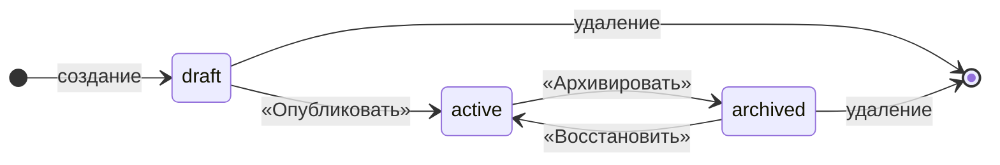
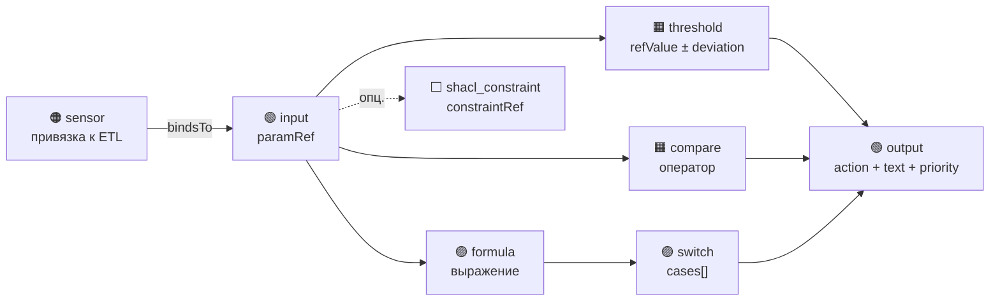
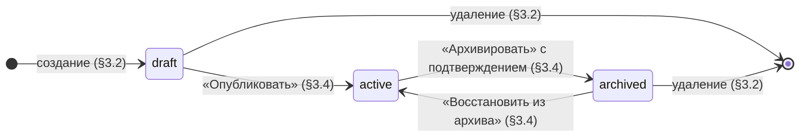

# РУКОВОДСТВО ОПЕРАТОРА
## программы «РАГРАФ — визуализатор и редактор цифровых регламентов»

---

> **Обозначение документа:** РАГРАФ.РО.001-2026
> **Версия:** 1.0
> **Дата составления:** 2026-05-21
> **Версия программы:** 0.1.0
> **Статус:** действующий
> **Разработано в соответствии с:** ГОСТ 19.505-79 «Руководство оператора. Требования к содержанию и оформлению»
> **Основание:** ТЗ РАГРАФ от 2026-05-15 ([docs/TZ_RAGRAF.md](TZ_RAGRAF.md))

---

## Лист согласования

| Должность | ФИО | Подпись | Дата |
|---|---|---|---|
| Разработчик и владелец продукта | Олег Барбашин (banksnab@gmail.com) | | |

---

## Содержание

1. [Назначение программы](#1-назначение-программы)
2. [Условия выполнения программы](#2-условия-выполнения-программы)
3. [Выполнение программы](#3-выполнение-программы)
   - 3.1 [Запуск и главный экран](#31-запуск-и-главный-экран)
   - 3.2 [Список регламентов](#32-список-регламентов)
   - 3.3 [Редактор регламента (Поля, Слайдеры, Turtle)](#33-редактор-регламента)
   - 3.4 [Управление статусом регламента (публикация и архив)](#34-управление-статусом-регламента)
   - 3.5 [Rule Flow Editor — визуальный редактор логики](#35-rule-flow-editor)
   - 3.6 [Constraint Editor — редактор SHACL-ограничений](#36-constraint-editor)
   - 3.7 [Sensor Library — библиотека датчиков и событий](#37-sensor-library)
   - 3.8 [Извлечение параметров из текста](#38-извлечение-параметров-из-текста)
   - 3.9 [Студия аналитика — поиск, чат, Q&A](#39-студия-аналитика)
   - 3.10 [Knowledge Ingest Studio — графы знаний](#310-knowledge-ingest-studio)
   - 3.11 [Twin Designer — цифровой двойник процесса](#311-twin-designer)
   - 3.12 [Live ETL Dashboard — оперативная панель](#312-live-etl-dashboard)
   - 3.13 [Audit Log — журнал прогонов](#313-audit-log)
   - 3.14 [Coverage Screen — структурный pre-flight](#314-coverage-screen)
   - 3.15 [Версионирование и история правок](#315-версионирование-и-история-правок)
   - 3.16 [Экспорт в СИГМУ](#316-экспорт-в-сигму)
4. [Сообщения оператору](#4-сообщения-оператору)
5. [Приложения](#5-приложения)

---

## 1. Назначение программы

**Наименование:** РАГРАФ — визуализатор и редактор цифровых регламентов.

**Полное определение:** РАГРАФ — среда проектирования операционного цифрового двойника управленческих процессов (operational digital twin of governance) на базе фреймворка Σ Сигма. Программа предназначена для аналитика-методолога и обеспечивает полный цикл от загрузки нормативного акта до выгрузки готового артефакта (одного регламента или цифрового двойника) в платформенный контур СИГМЫ.

**Основные функции, доступные пользователю:**

1. Оцифровка нормативного текста (извлечение параметров, единиц измерения, пороговых значений).
2. Структурное редактирование регламента (мета-данные, параметры, рекомендации, SHACL-ограничения, триггеры).
3. Визуальная сборка логики реагирования в Rule DSL Flow (Node-RED-style редактор из 8 типов узлов).
4. Управление библиотекой датчиков и шаблонами событий.
5. Композиция нескольких регламентов в цифровой двойник процесса (Twin Designer).
6. Запуск регламентов на реальных данных (Live ETL Dashboard, демо-стенд).
7. Семантический поиск и Q&A по корпусу через retrieval-слой Студии аналитика (bge-m3 эмбеддинги + опциональная LLM-генерация).
8. Построение графа знаний предметной области (Knowledge Ingest Studio).
9. Структурный аудит покрытия платформы (Coverage Screen).
10. Версионирование и автоматическое сравнение правок.
11. Экспорт SIGMA-bundle (data.ttl + shapes.ttl + manifest.json) для загрузки в исполнительный движок СИГМЫ.

**Не входит в функциональность** (out of scope, обеспечивается платформенным контуром СИГМЫ):

- Многопользовательская одновременная работа с правами доступа;
- Production-приём событий от городских ИС с авторизацией и очередями;
- Отправка SMS/Telegram/email уведомлений;
- Дашборды диспетчера и руководителя.

**Целевая аудитория настоящего руководства** — аналитик-методолог (соответствует роли «разработчики и аналитики», §4.3.1 ТЗ СИГМА).

---

## 2. Условия выполнения программы

### 2.1 Технические требования к рабочему месту

| Компонент | Минимально | Рекомендуется |
|---|---|---|
| Браузер | Chrome 120, Firefox 120, Safari 17, Edge 120 | Последняя версия Chrome или Firefox |
| Разрешение экрана | 1280 × 720 | 1920 × 1080 и выше |
| Интернет-соединение | 1 Мбит/с | 5 Мбит/с (для загрузки документов) |
| JavaScript | включён | включён |
| Cookies | разрешены для домена приложения | разрешены |

Дополнительное программное обеспечение на рабочее место не устанавливается.

### 2.2 Учётная запись и доступ

**Текущая инсталляция (версия 0.1.0)** — single-user локальный режим, дополнительная аутентификация не требуется. При открытии адреса приложения интерфейс доступен сразу.

**Способы доступа:**

| Способ | Адрес |
|---|---|
| Боевой инстанс (Railway) | `https://ragraf.up.railway.app/` |
| Локальный запуск (для разработки) | `http://localhost:5173/` (Vite dev-сервер) или `http://localhost:8000/` (production-сборка через FastAPI) |

Установка локального инстанса описана в [`README.md`](../README.md) и в инсталляционных пакетах для macOS/Windows ([`installer/INSTALL-MACOS.md`](../installer/INSTALL-MACOS.md), [`installer/INSTALL-WINDOWS.md`](../installer/INSTALL-WINDOWS.md)). Настоящее руководство предполагает, что инсталляция выполнена и адрес доступен.

---

## 3. Выполнение программы

> **Условные обозначения в этом разделе:**
> - Названия экранов и кнопок — в кавычках: **«Сохранить»**.
> - Маршруты URL — в моноширинном шрифте: `/regulations`.
> - Иконки lucide — обозначаются текстовым описанием в скобках: «иконка дискеты».
> - Последовательность шагов — нумерованный список.

### 3.1 Запуск и главный экран

При открытии адреса приложения отображается **посадочная страница** (маршрут `/`):

- Логотип и наименование «РАГРАФ»;
- Краткое описание системы;
- Ссылки на основные разделы: Регламенты, Граф связей, Студия аналитика, Twin Designer, Live ETL, Knowledge Studio;
- Внешние ссылки: тренажёр операторов СИГМЫ, фреймворк КАППА, GitHub-репозиторий, открытые данные.

**Левая боковая панель (sidebar)** доступна на всех экранах и содержит навигацию по 11 основным разделам. Сверху вниз:

| Иконка | Раздел | Маршрут |
|---|---|---|
| Σ | Посадочная страница | `/` |
| База данных | Регламенты | `/regulations` |
| Список | Domains overview | `/domains/:id` |
| Радар | Sensor Library | `/sensors` |
| Розетка | Module Library | `/modules` |
| Сетка | Coverage Screen | `/coverage` |
| Документ | Audit Log | `/audit-log` |
| Activity | Execute Simulator | `/execute` |
| Бранч | Граф связей | `/graph` |
| Play (с бейджем «B») | Студия аналитика | `/sandbox` |
| Радиоприёмник (с бейджем «B») | Live ETL Dashboard | `/live` |

Внизу — кнопки «Раскрыть/свернуть» (стрелка) и «Документация» (книга, ведёт на README репозитория).

Полный список из 18 маршрутов приведён в [Приложении Б](#приложение-б-маршруты-ui).

### 3.2 Список регламентов

Маршрут: `/regulations`.

**Содержимое экрана:**

- Шапка с тремя элементами: счётчик регламентов, переключатель плотности (карточки / компакт), поле поиска.
- Tab-фильтры по верхнему ряду: **«Все»**, **«⭐ Мои»** (избранные, хранятся в локальном хранилище браузера).
- Горизонтальные «домен-заголовки» (теплоснабжение, ЖКХ, безопасность и т. д.) — кликабельны, ведут на `/domains/:id`.
- Карточки регламентов, сгруппированные по доменам.

**Карточка регламента содержит:**

- Звезду «избранное» (клик — добавить/убрать);
- Иконку домена и его наименование;
- ID регламента (kebab-case, например `nsk-traffic`);
- Полное название регламента;
- Дату принятия и версию;
- Бейдж статуса (черновик / активный / архив);
- При наведении курсора — кнопки быстрого доступа: «Редактор», «Поток», «Ограничения», «Граф», «Дублировать», «Удалить».

**Создание нового регламента:**

1. Нажмите кнопку **«+ Создать»** в шапке (или альтернативно — **«+ Из текста»** для извлечения из готового документа, см. §3.8).
2. В появившемся диалоге укажите:
   - ID регламента (kebab-case, латиница);
   - Название (на русском, полное);
   - Домен (из выпадающего списка существующих или создать новый);
   - Краткое описание (опционально).
3. Нажмите **«Создать»**. Произойдёт переход в Редактор регламента (§3.3).

**Дублирование:**

1. Наведите курсор на карточку нужного регламента.
2. Нажмите иконку «Копировать» (две страницы).
3. Программа создаст копию с новым ID (с постфиксом `-kopiya`), статусом «черновик» и автоматическим переходом в редактор копии.

**Удаление:**

1. Иконка «Корзина» на карточке.
2. Подтвердите удаление в нативном диалоге браузера.
3. **Внимание:** удаление каскадное — стираются также все версии регламента, связанные триггеры и flow.

Полное описание сценариев UX списка регламентов — README §4 «Управление регламентами по доменам».

### 3.3 Редактор регламента

Маршрут: `/regulations/{id}/edit`.

**Шапка экрана:**

- Хлебные крошки: «Регламенты» → «Домен» → «ID регламента»;
- Название регламента крупным шрифтом + ID + дата принятия + версия;
- Бейдж статуса (черновик / активный / архив);
- Счётчик параметров;
- Группа кнопок переключения экранов того же регламента: **«Редактировать»** (текущий), **«Поток»** (§3.5), **«Ограничения»** (§3.6), **«Граф»** (отдельный экран Cytoscape графа корпуса).
- Кнопки управления (справа):
  - **«Архивировать»** / **«Восстановить из архива»** — см. §3.4;
  - **«Экспорт в СИГМУ»** — см. §3.16;
  - **«История»** — см. §3.15;
  - **«Отменить»** — откатить несохранённые правки;
  - **«Сохранить»** — зафиксировать правки.

**Под шапкой — переключатель трёх вкладок:**

| Вкладка | Описание | Когда использовать |
|---|---|---|
| **Поля** | Структурированные поля для всех мета-данных, параметров, рекомендаций, триггеров | Основной режим работы |
| **Слайдеры** | Графическое представление параметров с числовыми порогами (мин/опт/макс) | Когда параметров с порогами много и нужно быстро их откалибровать «на глаз» |
| **Turtle** | Сырое Turtle/RDF представление регламента | Для технической проверки сериализации, разовых ручных правок |

#### 3.3.1 Вкладка «Поля»

**Подразделы экрана:**

1. **Атомарный регламент / Цифровой двойник** — плашка-индикатор. Если регламент входит в один или несколько Twin'ов, отображаются ссылки на них. Иначе — кнопка «Создать Twin».
2. **Метаданные** — название, дата принятия, версия, статус (через бейджи).
3. **Нормативное основание** (раздел из ТЗ СИГМА §4.1.3) — нормативный документ, пункт/раздел, действует с / по. Используется для объяснимости решений.
4. **Документ-основание** (PROV-O attachment) — загрузка PDF или DOCX. После загрузки отображается: имя файла, размер, SHA-256, цитата-обоснование, ссылка на оригинал. Доступна кнопка «Скачать».
5. **Параметры** — список параметров регламента. Каждая строка содержит:
   - Имя параметра (kebab-case);
   - Тип (decimal / integer / string / boolean);
   - Единица измерения (для числовых);
   - Эталонное значение (reference);
   - Отклонение (deviation);
   - SHACL-ограничения (min/max, кратко);
   - Кнопки правки и удаления.
6. **Триггеры** — связь параметров с датчиками. Каждый триггер: имя, ссылка на параметр, sensor_subtype из библиотеки датчиков, тип события (telemetry/alert), описание.
7. **Рекомендации** — действия, которые предлагает регламент при выходе параметра за норму. Поля: текст, приоритет (1/2/3), действие.

**Типовая последовательность работы с новым регламентом:**

1. Заполните **Метаданные** (название, дата).
2. Заполните **Нормативное основание** (документ + пункт).
3. При наличии PDF документа-основания — загрузите его (раздел «Документ-основание»).
4. Добавьте **Параметры** через кнопку **«+ Параметр»**. Минимум для рабочего регламента — 1 параметр с эталонным значением и отклонением.
5. Добавьте **Триггеры** (если регламент управляется по событию от датчика) через кнопку **«+ Триггер»**. Триггер связывает параметр с конкретным подтипом датчика из библиотеки (см. §3.7).
6. Добавьте **Рекомендации** через **«+ Рекомендация»**.
7. Нажмите **«Сохранить»** в шапке.

**Отображение несохранённых правок:** на кнопке «Сохранить» появляется маркер (точка-индикатор), кнопка «Отменить» становится активной.

#### 3.3.2 Вкладка «Слайдеры»

Графическое представление параметров. Каждый параметр — горизонтальный слайдер с тремя метками (минимум, эталон, максимум). Перетягивание ползунка изменяет эталонное значение, удержание двух краёв — отклонение.

**Когда использовать:**
- Быстрая калибровка порогов «на глаз» после загрузки нормативного документа.
- Демонстрация заказчику на встрече.

**Когда НЕ использовать:**
- При вводе значений, требующих точности (вводите числами на вкладке «Поля»).

#### 3.3.3 Вкладка «Turtle»

Сырое Turtle/RDF представление регламента — то, что отдаёт API `GET /api/regulations/{id}/raw`.

**Доступные действия:**

- Просмотр (read-only по умолчанию);
- Ручное редактирование Turtle (для опытных пользователей с знанием RDF/Turtle);
- Загрузка из файла `.ttl` (кнопка «Импорт»);
- Скачивание текущего Turtle (кнопка «Экспорт»).

**Важно:** при ручной правке Turtle и сохранении программа выполняет валидацию rdflib + pyshacl. Ошибки отображаются над редактором, сохранение не происходит до их исправления.

### 3.4 Управление статусом регламента

Статусы регламента и переходы между ними:



**Описание статусов:**

| Статус | Бейдж | Что означает |
|---|---|---|
| `draft` | жёлтый «черновик» | Регламент создан, редактируется, ещё не введён в эксплуатацию |
| `active` | зелёный «активный» | Регламент опубликован, применяется в Live ETL, экспортируется в SIGMA-bundle |
| `archived` | серый «архив» | Регламент выведен из эксплуатации, остаётся для истории |

**Публикация регламента (draft → active):**

1. Перейдите в редактор регламента (§3.3).
2. Убедитесь, что нет несохранённых правок.
3. В шапке нажмите кнопку **«Опубликовать»** (с иконкой бумажного самолётика).
4. Статус сменится на «активный».

**Архивирование регламента (active → archived):**

1. В шапке нажмите кнопку **«Архивировать»** (с иконкой коробки).
2. Появится встроенная панель подтверждения с предупреждениями:
   - Если регламент состоит в одном или нескольких Twin'ах — отображается список с кликабельными ссылками. После архивации wiring в Twin'ах станет «висячим» (Coverage Screen покажет как битый импорт).
   - Если регламент в домене `nsk_city` (используется Live ETL) — отображается пояснение, что applier продолжит пытаться выполнить регламент и писать «no_snapshots» в timeline.
   - Если оба условия не выполняются — серое сообщение «регламент атомарный, архивация безопасна».
3. Нажмите **«Подтвердить и архивировать»** (красная кнопка) или **«Отмена»**.

**Восстановление из архива (archived → active):**

1. Над содержимым редактора отображается жёлтый банер «Регламент в архиве» с пояснением.
2. Нажмите кнопку **«Восстановить»** в банере или **«Восстановить из архива»** в шапке.
3. Статус вернётся в «активный».

### 3.5 Rule Flow Editor

Маршрут: `/regulations/{id}/flow`.

Визуальный редактор логики реагирования по принципу Node-RED. Холст-канвас с возможностью добавлять, связывать и настраивать узлы графа.

**Структура экрана:**

- **Левая палитра** (свернёт/раскрывается) — 8 типов узлов;
- **Центральный канвас** — основная рабочая область, поддерживает зум (колесо мыши), панорамирование (зажатие пробела или средняя кнопка);
- **Правая Property Panel** (свернётся / раскрывается) — параметры выбранного узла.

#### 3.5.1 Восемь типов узлов

| Тип | Иконка/цвет | Назначение |
|---|---|---|
| **input** | синий | Точка входа параметра в граф. Соответствует `Parameter` из вкладки «Поля». |
| **threshold** | оранжевый | Сравнение значения с эталоном ± отклонением. Поля: `refValue`, `deviation`. |
| **compare** | оранжевый | Оператор сравнения с диапазоном: `outside_range`, `inside_range`, `greater`, `less`, `equal`. |
| **formula** | фиолетовый | Произвольное выражение (например, `(a + b) / 2`). |
| **switch** | фиолетовый | Развилка по значению предыдущего узла, до 6 кейсов. |
| **output** | зелёный | Действие при срабатывании ветки. Поля: `action` (slug), `text` (рекомендация), `priority` (1-3). |
| **shacl_constraint** | белый/серый | Привязка SHACL-ограничения (ссылка на ID в Constraint Editor, §3.6). |
| **sensor** | оранжевый кружок | Точка привязки к внешнему сигналу. Поля: `sensorType` (класс), `sensorSubtype` (конкретный подтип), `externalId` (имя поля во входящем JSON), `bindsTo` (ID input-узла). |

#### 3.5.2 Типовой сценарий — создание flow с нуля

**Пример: «при превышении PM2.5 > 35 мкг/м³ — выводить рекомендацию».**

1. Откройте Flow Editor для регламента (`/regulations/your-id/flow`).
2. Перетащите из палитры на канвас:
   - Узел **sensor**;
   - Узел **input**;
   - Узел **threshold**;
   - Узел **output**.
3. Кликните на узел `sensor`. В правой Property Panel:
   - **Класс датчика:** выберите «Качество воздуха» из выпадающего списка;
   - **Подтип:** выберите `om-air-quality` (Open-Meteo Air Quality);
   - **External ID (ETL):** введите `current.pm2_5`.
4. Соедините `sensor` → `input`: наведите курсор на правый бортик `sensor`, появится точка-handle, перетащите её на левый бортик `input`. Это автоматически проставит у `sensor` поле `bindsTo` = ID input-узла.
5. Кликните `input` → Property Panel → **paramRef:** выберите параметр `pm25Concentration` из выпадающего списка (он должен быть предварительно создан на вкладке «Поля»).
6. Кликните `threshold` → **refValue:** 35, **deviation:** 0.
7. Соедините `input` → `threshold` (от правого бортика к левому).
8. Соедините `threshold` → `output` (помечает срабатывание, когда значение превышает порог).
9. Кликните `output` → **action:** `alert_pm25_exceeded`, **text:** «Превышение ПДК PM2.5 — выпустите рекомендацию: ограничить движение тяжёлого транспорта и выехать на замеры»., **priority:** 1.
10. Нажмите **«Сохранить»** в шапке экрана.

**Симулятор (опционально):**

Кнопка **«⚙ Симулировать»** в шапке открывает Execute Panel. В нём можно подать тестовое значение параметра (например, `pm2_5 = 80`) и увидеть подсветку сработавшего пути на канвасе (узлы окрашиваются, рёбра выделяются).

#### 3.5.3 Sensor-узлы и Live ETL

Если регламент входит в домен `nsk_city`, его sensor-узлы автоматически подхватываются Live ETL Dashboard (§3.12). Каждые 15 минут scheduler:

1. Получает свежие данные от Open-Meteo / Yandex Traffic.
2. Для каждого sensor-узла регламента находит snapshot по `subtype` + `externalId` + текущий город.
3. Запускает flow_executor, фиксирует результат в `etl_runs`.
4. Отображает результат на карточке регламента в Live ETL.

Для регламентов других доменов sensor-узлы используются Execute Simulator'ом (`/execute`), но автоматический pull данных не выполняется.

#### 3.5.4 Сохранение и история flow

При нажатии **«Сохранить»** программа:

1. Валидирует граф (нет ли висячих узлов, циклов, неизвестных paramRef);
2. Сохраняет JSON в `${DATA_DIR}/flows/{regulation_id}.json` (текущая версия);
3. Создаёт immutable snapshot в `${DATA_DIR}/versions/{regulation_id}/{uuid}.json`.

**Просмотр истории:**

1. Кнопка **«История»** в шапке.
2. Откроется панель с timeline снимков (дата, автор, комментарий).
3. Кнопка **«Восстановить»** на любом снимке вернёт flow к этому состоянию (текущее тоже сохранится в истории).

### 3.6 Constraint Editor

Маршрут: `/regulations/{id}/constraints`.

Редактирование SHACL-ограничений в табличном виде.

**Структура таблицы:**

| Колонка | Содержимое |
|---|---|
| Путь | URI свойства (например, `:pm25Concentration`) |
| Тип данных | xsd:decimal / xsd:integer / xsd:string / xsd:boolean |
| Min (включ.) | `sh:minInclusive` |
| Max (включ.) | `sh:maxInclusive` |
| minCount | Минимальное количество значений |
| Шаблон | `sh:pattern` (regex для строк) |
| Severity | violation (красный) / warning (амбер) / info (небесный) |
| Сообщение | `sh:message@ru` |

**Действия:**

- **«+ Ограничение»** — добавить строку.
- **«Импорт SHACL Turtle»** — загрузить `.ttl` файл, ограничения парсятся и добавляются.
- **«Экспорт SHACL Turtle»** — скачать текущие ограничения как файл.

### 3.7 Sensor Library

Маршрут: `/sensors`.

Каталог типов датчиков и шаблонов их событий. Двухуровневая модель: класс датчика → подтип → поля payload.

**Структура экрана:**

- **Левая колонка** — дерево классов:
  - p (Давление)
  - t (Температура)
  - flow (Расход)
  - noise (Шум)
  - detector (Видеодетектор)
  - fiber (Волокно DAS)
  - air (Качество воздуха)
  - weather (Погода)
  - traffic (Пробки)
- Под каждым классом — список подтипов (например, для `air` — `air-co2`, `air-pm`, `air-no2`, `om-air-quality`).
- **Правая колонка** — поля выбранного подтипа: имя поля, тип, единица, описание, обязательное/опциональное, пример значения.

**Действия:**

- **«+ Подтип»** на классе — создать новый подтип внутри класса (например, новый детектор Нетрис);
- **«+ Поле»** на подтипе — добавить новое поле в JSON-схему payload;
- **Кнопка «Перезагрузить из seed»** — восстановить дефолтные подтипы (с предупреждением, что user-добавленные подтипы сохранятся).

**В Sensor Library уже есть встроенные подтипы для интеграции с Live ETL** (см. §3.12):

- `om-weather-current` — текущая погода (Open-Meteo);
- `om-weather-daily` — суточный прогноз (Open-Meteo);
- `om-air-quality` — качество воздуха (Open-Meteo);
- `yandex-traffic-xml` — индекс пробок Яндекса.

### 3.8 Извлечение параметров из текста

Маршрут: `/regulations/new-from-text`.

Создание нового регламента путём извлечения параметров из готового нормативного документа.

**Последовательность шагов:**

1. Откройте экран через кнопку **«+ Из текста»** в списке регламентов или через прямой переход по маршруту.
2. В большое поле ввода вставьте текст нормативного документа (фрагмент из ГОСТ, СП, СанПиН, регламента и т. п.).
3. Нажмите кнопку **«Извлечь параметры»**.
4. Программа выполняет:
   - Regex-pass — поиск паттернов «число [± отклонение] единица»;
   - 3-tier поиск имени параметра по словарю `extraction_terms` (70+ стартовых терминов);
   - Domain prediction — голосование терминов за свой домен;
   - Confidence-оценка каждого параметра (0..1).
5. Под полем ввода отображается таблица найденных параметров:
   - Сырая подстрока из текста;
   - Предложенное имя параметра (kebab-case);
   - Значение и единица;
   - Отклонение (если симметричное);
   - Confidence (0.85 — высокая, 0.4 — низкая, требует ручной правки);
   - Кнопки «Переименовать» и «Удалить» (для лишних).
6. Над таблицей — бейдж «словарь голосует: <домен> · <confidence>%». При высокой уверенности (≥ 50%) домен автоматически проставляется в форме нового регламента.
7. Кнопка **«Создать регламент»** — открывает диалог создания (как в §3.2) с предзаполненными параметрами.

**Расширение словаря:** перейдите на экран Sandbox (§3.9), вкладка «Словарь». Можно добавлять новые термины с указанием parameter_name и domain. Изменения применяются на следующий extract без перезапуска.

### 3.9 Студия аналитика

Маршрут: `/sandbox`.

Студия аналитика — рабочая площадка с инструментами на базе ИИ (Ollama локально / Cerebras в облаке).

**Вкладки:**

| Вкладка | Назначение |
|---|---|
| **Search** | Семантический поиск по корпусу регламентов через bge-m3 эмбеддинги (или TF-IDF fallback при отключённых эмбеддингах). |
| **Chat** | Q&A над корпусом. `EmbeddingIndex` извлекает top-k релевантных регламентов и подаёт LLM как контекст. Ответ цитирует источники. |
| **Extract** | Альтернативный вход к экрану извлечения параметров (§3.8). |
| **LLM-настройки** | Управление LLM-провайдером: выбор модели, переключение между Ollama / Cerebras / Groq / OpenAI / mock, прогрев/выгрузка модели (для Ollama), пресеты системного промпта. |

#### 3.9.1 Поиск

1. Введите запрос в поле поиска (на русском).
2. Программа отдаёт топ-5 наиболее релевантных регламентов с фрагментами-цитатами.
3. Клик по результату — переход на редактор соответствующего регламента.

#### 3.9.2 Чат

1. Введите вопрос в поле чата (например, «какие параметры зимней нормы давления»).
2. `EmbeddingIndex` выполняет retrieval по корпусу через bge-m3, формирует промпт для LLM.
3. Ответ появляется в ленте с пометкой источников (ссылки на регламенты).
4. История диалога сохраняется в текущей сессии браузера. При обновлении страницы сбрасывается.

**Управление LLM-провайдером:**

Текущий статус (Ollama локально / Cerebras / Groq / OpenAI / OpenRouter / mock) отображается в `LLMStatusBar` в шапке студии. Переключение провайдера — через переменные окружения (см. README §«Multi-provider LLM»).

### 3.10 Knowledge Ingest Studio

Маршрут: `/knowledge`.

Конструктор графа знаний над корпусом регламентов. CSV → RDF (Turtle) → SPARQL → визуализация.

Подробное описание UX, формат данных, seed-датасетов — README §11.

**Кратко:**

1. Из выпадающего списка выберите один из 13 seed-датасетов (10 доменов Smart-City + 3 legacy: строительная ТБ, кибербезопасность, риски).
2. Программа отображает таблицу первых 200 триплетов вида `subject — predicate — object`.
3. Клик по субъекту — открывается карточка со всеми триплетами этой сущности.
4. Кнопка **«Граф»** — Cytoscape-визуализация: жёлтые субъекты в центре, серые объекты по периметру, рёбра-предикаты.
5. Кнопка **«SPARQL Workbench»** — выполнение произвольных SPARQL-запросов (SELECT / ASK / CONSTRUCT / DESCRIBE) к загруженному графу. Доступны 3 пресета.

**Импорт собственного CSV:** drag-and-drop файла в зону загрузки. Программа автоматически определяет разделитель (`,` / `;`) и кодировку (UTF-8 / CP1251). Первые 3 колонки воспринимаются как subject / predicate / object. Хедер автодетектится.

**Inline-редактирование:** кнопка **«Редактировать»** переключает таблицу в Excel-подобный режим. Изменения сохраняются единым PUT-запросом.

### 3.11 Twin Designer

Маршрут: `/twins` (список) и `/twins/:id` (редактор конкретного Twin'а).

Цифровой двойник процесса — именованная композиция нескольких регламентов с описанием связей между ними.

**Создание Twin'а:**

1. На странице `/twins` нажмите **«+ Создать»**.
2. Введите название (например, «ЕДДС Кольцово — полная цепочка реагирования») и описание.
3. Из списка регламентов выберите 2-N регламентов-членов.
4. Сохраните — программа создаст Twin и откроет его редактор.

**Wiring (связи между регламентами):**

На экране Twin'а — таблица wiring-связей. Каждая запись:

- `source_regulation` — регламент-источник;
- `source_output` — действие на выходе (slug из output-узлов flow);
- `target_regulation` — регламент-приёмник;
- `target_param_ref` — параметр приёмника, в который инжектится значение.

**Визуализация:** автоматически генерируется Cytoscape-граф fish-bone style:

- Центральная фиолетовая нода — сам Twin;
- Регламенты-члены вокруг неё;
- Пунктирные рёбра-`wiring` с лейблами `action`.

**Экспорт:**

- **«Скачать SIGMA bundle»** — ZIP с данными всех регламентов-членов + manifest.json;
- **«Скачать объединённый Turtle»** — единый .ttl со всеми регламентами и Twin-блоком с wiring;
- **«Verify Turtle»** — программа выполняет rdflib-парсинг и отдаёт статистику (количество триплетов, классов, объектов).

**Cross-reference:** на экране редактирования любого регламента (§3.3) в плашке «Цифровой двойник» отображается список Twin'ов, в которые он входит, с кликабельными ссылками.

### 3.12 Live ETL Dashboard

Маршрут: `/live`.

Демонстрационный operational layer поверх 4 регламентов домена `nsk_city`. Каждые 15 минут программа автоматически:

1. Тянет данные из Open-Meteo (погода + воздух) и Yandex Traffic для активного города;
2. Применяет 4 регламента через `flow_executor` + параллельный hand-coded `simple_evaluator`;
3. Отображает на дашборде hero-метрики, статусы регламентов, временную ленту прогонов.

**Структура экрана:**

| Блок | Содержимое |
|---|---|
| Шапка | Активный город, dropdown выбора города (20 городов России), кнопки «Pull сейчас» / «Применить» / «Полный цикл» |
| Hero-метрики | 4 тайла: PM2.5, температура, ветер, индекс пробок Yandex |
| Прогноз погоды | Раскрывающаяся секция с прогнозом на 7 дней + предсказанные срабатывания регламентов |
| Карточки регламентов | 4 карточки (nsk-traffic, nsk-ecology, nsk-mobile-index, nsk-life-indices). Каждая: ID, название, текущий уровень (level 0..3), текст рекомендации, время последнего прогона, кнопка «Настроить» (→ редактор регламента) |
| Состояние ETL | Health 3 источников (open-meteo-weather, open-meteo-air, yandex-traffic). Цвет индикатора — по свежести данных: зелёный <30 мин, жёлтый <3 ч, красный >3 ч |
| Timeline прогонов | Последние 20 прогонов с action-бейджами и текстом рекомендаций |

**Смена активного города:**

1. В шапке нажмите на dropdown «Город».
2. Выберите из списка (Москва, СПб, Новосибирск, Екатеринбург, Казань и др. — всего 20).
3. Программа сохраняет выбор в `${DATA_DIR}/active_city.json` и автоматически запускает свежий pull данных.

**Принудительный запуск:**

- **«Pull сейчас»** — запрашивает свежие данные у внешних источников (применение регламентов НЕ выполняется автоматически).
- **«Применить»** — запускает регламенты на уже сохранённых данных.
- **«Полный цикл»** — последовательно Pull + Применить.

**Кликабельность карточек регламентов:** каждая карточка кликабельна, переход → `/regulations/{id}/edit`. Это позволяет аналитику быстро открыть редактор и подкорректировать пороги.

### 3.13 Audit Log

Маршрут: `/audit-log`.

Журнал прогонов регламентов с фильтрами и timeline.

**Структура экрана:**

- Сводка наверху: всего инцидентов / критичных / в работе / сегодня;
- Лента инцидентов с раскрывающейся timeline для каждого;
- Фильтры по уровню (critical / elevated / warning / info) и статусу инцидента.

**Каждая запись содержит:**

- `incident_id` (UUID);
- Время;
- Тип события (если поступил извне) или источник прогона (если Live ETL);
- ID регламента + его версия;
- Уровень (level);
- Текст рекомендации;
- `evidence_level` (strong / medium / weak);
- ID пользователя (при ручном вводе);
- Действие пользователя;
- Outcome status (success / failure / partial).

**Использование:**

- Демонстрация заказчику: «вот реальная хронология за 24 часа».
- Дебаг: если регламент не сработал, найдите запись и посмотрите `evidence_level=weak` — значит проблема с триггером.
- PROV-O привязка: к каждой записи можно прикрутить ссылку на исходный документ через `regulation_id` → `source_document_url`.

### 3.14 Coverage Screen

Маршрут: `/coverage`.

Static-check матрица «дыр» в setup'е платформы.

**Пять видов структурных пробелов:**

| # | Что | Источник данных |
|---|---|---|
| 1 | Датчики без регламентов | `/api/sensor-subtypes/usage` |
| 2 | Модули без датчиков (`sensor_count=0`) | `/api/modules` |
| 3 | Домены без модулей | пересечение `/api/domains` + `/api/modules` |
| 4 | Регламенты в доменах без модулей | пересечение случаев 1 и 3 |
| 5 | Twin'ы с висячим wiring | `/api/processes` + проверка регламентов |

**Использование:**

- Перед демонстрацией заказчику пройдите Coverage Screen → исправьте обнаруженные «дыры».
- Например: датчик `vd-weapon` в Sensor Library, но ни один регламент его не слушает → либо удалите датчик из библиотеки, либо создайте регламент.
- Twin с висячим wiring (произошло после архивации регламента) → откройте Twin Designer и поправьте wiring.

Cross-reference: каждая строка матрицы кликабельна, ведёт в соответствующий экран для исправления.

### 3.15 Версионирование и история правок

Каждое сохранение регламента автоматически создаёт snapshot в `regulation_history`. Аналогично для Rule DSL Flow в `flow_versions`.

**Просмотр истории регламента:**

1. На редакторе регламента (§3.3) нажмите кнопку **«История»** в шапке.
2. Откроется панель справа со списком версий: дата, автор, размер diff'а (added / removed / changed полей).
3. Клик по версии раскрывает детальный diff (графический с цветовыми бейджами):
   - Зелёный — поле добавлено;
   - Розовый — поле удалено;
   - Синий — поле изменено (показывается `до → после`).
4. Кнопка **«Восстановить эту версию»** на любой записи — возвращает регламент к выбранному снимку. Текущее состояние тоже попадает в историю.

**Просмотр истории Flow:** аналогично, кнопка «История» в Flow Editor (§3.5.4).

### 3.16 Экспорт в СИГМУ

**Экспорт одного регламента:**

1. На редакторе регламента (§3.3) нажмите кнопку **«Экспорт в СИГМУ»** в шапке.
2. Браузер скачает ZIP-файл `<regulation_id>.zip` со структурой:

```text
<regulation_id>/
├── data.ttl       — OWL-инстанс регламента
├── shapes.ttl     — SHACL-форма валидации
└── manifest.json  — метаданные RAGRAF
```

**Экспорт корпуса:**

1. На списке регламентов (§3.2) в toolbar нажмите **«Экспорт корпуса в СИГМУ»**.
2. Опционально укажите домен (если нужен срез, а не весь корпус).
3. Браузер скачает ZIP со всеми регламентами + `corpus_manifest.json` с сводным списком и регистрацией ошибок выгрузки (если какой-то регламент не сериализовался).

**Экспорт цифрового двойника:**

1. В Twin Designer (§3.11) откройте нужный Twin.
2. Нажмите **«Скачать SIGMA bundle»**.
3. Браузер скачает ZIP со всеми регламентами-членами + manifest Twin'а.

**Содержимое bundle:**

| Файл | Содержит |
|---|---|
| `data.ttl` | OWL-инстанс регламента: декларация `:Regulation`, DatatypeProperty объявления, значения свойств, включая SIGMA-compliance поля `:sourceDocument`, `:sourceClause`, `:validFrom`, `:validTo` |
| `shapes.ttl` | SHACL-форма валидации: `sh:NodeShape` с `sh:targetClass :Regulation`, обязательные поля и типы, `sh:minInclusive 0.0` для всех числовых параметров и парных `*Deviation` |
| `manifest.json` | format_version, exported_at, parameter_count, regulation_history_versions, sigma_compliance-блок, идентификация источника для round-trip импорта |

**Совместимость:** при загрузке `data.ttl` в Apache Jena платформенного контура СИГМЫ с подключением `shapes.ttl` должна выполниться автоматическая SHACL-валидация без ошибок. RAGRAF гарантирует это для регламентов, прошедших валидацию в Constraint Editor (§3.6).

---

## 4. Сообщения оператору

### 4.1 Сообщения об ошибках

| Сообщение / индикатор | Причина | Действие |
|---|---|---|
| «Ошибка валидации (422)» при сохранении | Не заполнено обязательное поле или нарушен формат | Прочитайте текст в красной плашке над формой, исправьте указанное поле |
| «Регламент не найден (404)» | URL некорректен или регламент удалён | Вернитесь на список регламентов (`/regulations`), найдите нужный |
| «Сервер временно недоступен (503/502)» | Боевой инстанс перезапускается или внешний источник Live ETL не отвечает | Подождите 30-60 секунд, обновите страницу |
| «Источник недоступен» (Live ETL, красный индикатор) | Open-Meteo или Yandex Traffic не ответил | Yandex Traffic flaky на дата-центровых IP (~38% success rate с Railway) — нормально. Если 3 часа подряд — проверьте состояние внешних API |
| «no live snapshots for any sensor in flow» в Timeline Live ETL | Регламент в `nsk_city` имеет 0 sensor-нод в flow ИЛИ snapshots отсутствуют для активного города | Откройте `/api/live/debug` (Swagger UI) для диагностики; см. ARC.md §12.5 |
| «Конфликт версий» при сохранении | Кто-то параллельно правил регламент (для single-user не случается) | Обновите страницу и повторите правки |
| «Ошибка SHACL» во вкладке Turtle | Введённый Turtle не проходит валидацию | Прочитайте детали ошибки над редактором, исправьте Turtle |
| «Граф невалиден» в Flow Editor | Висячие узлы / циклы / неизвестные paramRef | Найдите подсвеченные красным узлы, проверьте Property Panel |

### 4.2 Информационные сообщения

| Сообщение / индикатор | Значение |
|---|---|
| ⭐ Звезда в карточке регламента | Регламент в избранном (фильтр «⭐ Мои») |
| Маркер на кнопке «Сохранить» | Есть несохранённые правки |
| 🟢 / 🟡 / 🔴 кружок в Live ETL | Свежесть данных источника: зелёный <30 мин, жёлтый <3 ч, красный >3 ч |
| Бейдж «📎 источник прикреплён» в редакторе регламента | Загружен Документ-основание (PROV-O) |
| Бейдж «архив» (серый) | Регламент в архиве |
| Бейдж «активный» (зелёный) | Регламент опубликован |
| Бейдж «черновик» (жёлтый) | Регламент в работе |
| «Обновление доступно — нажмите F5» | Загружена новая версия фронтенда; рекомендуется обновить страницу |

---

## 5. Приложения

### Приложение А. Глоссарий

| Термин | Расшифровка |
|---|---|
| **Регламент** (цифровой регламент) | Машинно-исполняемое описание правила реагирования с параметрами, порогами, триггерами, рекомендациями. Соответствует `:Regulation` в Turtle |
| **Параметр** | Числовое или строковое поле регламента с эталоном и отклонением (`:Parameter`) |
| **Триггер** | Декларативная сцепка «датчик → параметр». Используется ETL-приёмником СИГМЫ для маршрутизации событий |
| **Sensor subtype** | Конкретная модель датчика внутри класса (например, `vd-anpr`, `om-air-quality`) |
| **Flow** (Rule DSL Flow) | Визуальный граф логики регламента из 8 типов узлов (input/threshold/compare/formula/switch/output/shacl_constraint/sensor) |
| **Twin** (цифровой двойник) | Именованная композиция 2-N регламентов с wiring (output → input) между ними |
| **Wiring** | Связь в Twin'е: output одного регламента → input-параметр другого |
| **SHACL** | Shape Constraints Language — стандарт W3C для валидации RDF. В РАГРАФ используется для проверки регламентов |
| **PROV-O** | W3C-онтология происхождения данных (Provenance). В РАГРАФ — для привязки регламента к нормативному документу |
| **Live ETL** | Демонстрационный operational-стенд поверх 4 регламентов `nsk_city` с реальными данными Open-Meteo и Yandex Traffic |
| **Synthetic evaluator** | Параллельный hand-coded оценщик YAML-порогов на стороне applier. Гарантирует осмысленные рекомендации, даже когда flow_executor не вычисляет formula-узлы |
| **Retrieval-слой Студии аналитика** | `EmbeddingIndex` (bge-m3 эмбеддинги + cosine similarity) для семантического поиска по корпусу регламентов + опциональная LLM-генерация поверх найденного через OpenAI-compatible API (Ollama / Cerebras / Groq / OpenAI / mock). Раньше планировался GraphRAG через библиотеку RAGU — выпилен 22.05.2026 как избыточная зависимость. |
| **SIGMA-bundle** | ZIP-архив с `data.ttl + shapes.ttl + manifest.json` для импорта в платформенный контур СИГМЫ |
| **Coverage** | Структурный аудит «дыр» в платформе: датчики без регламентов, модули без датчиков и т. д. |
| **Audit Log** | Журнал прогонов регламентов с трассировкой PROV-O |

### Приложение Б. Маршруты UI

Полный список (на момент составления документа):

| Маршрут | Экран | Раздел руководства |
|---|---|---|
| `/` | Посадочная страница | §3.1 |
| `/regulations` | Список регламентов | §3.2 |
| `/regulations/new-from-text` | Извлечение из текста | §3.8 |
| `/regulations/:id/edit` | Редактор регламента (Поля / Слайдеры / Turtle) | §3.3 |
| `/regulations/:id/flow` | Rule Flow Editor | §3.5 |
| `/regulations/:id/constraints` | Constraint Editor | §3.6 |
| `/sensors` | Sensor Library | §3.7 |
| `/modules` | Module Library | (не описан подробно; аналогично Sensor Library, но для модулей-источников событий) |
| `/audit-log` | Audit Log | §3.13 |
| `/coverage` | Coverage Screen | §3.14 |
| `/execute` | Execute Simulator | (упомянут в §3.5.2; запуск регламента с тестовыми значениями) |
| `/graph` | Граф связей корпуса (Cytoscape) | (упомянут в §3.1; визуализация всех регламентов) |
| `/domains/:id` | Domain Detail | (карточка домена с регламентами/модулями/датчиками) |
| `/twins`, `/twins/:id` | Twin Designer | §3.11 |
| `/knowledge` | Knowledge Ingest Studio | §3.10 |
| `/sandbox` | Студия аналитика | §3.9 |
| `/live` | Live ETL Dashboard | §3.12 |
| `/sandbox/backlog` | Sandbox Backlog (roadmap для аналитика) | — |

### Приложение В. Типы узлов Rule DSL Flow



| Тип | Обязательные поля Property Panel |
|---|---|
| `sensor` | `sensorType`, `sensorSubtype`, `externalId`, `bindsTo` (автоматически при перетягивании ребра) |
| `input` | `paramRef` (из параметров регламента) |
| `threshold` | `refValue`, `deviation` |
| `compare` | `operator` (один из 5), `refValue` |
| `formula` | `expression` (строковое выражение) |
| `switch` | `cases[]` (до 6 кейсов) |
| `output` | `action` (slug), `text` (русский), `priority` (1-3) |
| `shacl_constraint` | `constraintRef` (ID из Constraint Editor) |

### Приложение Г. Стадии жизненного цикла регламента



| Статус | Цвет бейджа | Применяется в Live ETL | Включается в SIGMA bundle |
|---|---|---|---|
| `draft` | жёлтый | нет | да, со `status=draft` |
| `active` | зелёный | да (если домен `nsk_city`) | да, со `status=active` |
| `archived` | серый | нет (но в timeline остаются записи) | да, со `status=archived` |

---

*Документ составлен 2026-05-21 в соответствии с ГОСТ 19.505-79 «Руководство оператора. Требования к содержанию и оформлению». Поддерживается параллельно с кодом РАГРАФ. При значимых изменениях UI — обновляется одновременно с PR, изменяющим интерфейс.*

*Сопутствующие документы: [TZ_RAGRAF.md](TZ_RAGRAF.md) (требования), [ARC.md](ARC.md) (архитектура), [README.md](../README.md) (запуск и пользовательские сценарии для разработчика), [SKILL-GOST-19.md](SKILL-GOST-19.md) (конвенции оформления).*

---

**Конец документа РАГРАФ.РО.001-2026.**
