# Регламент NSK · ecology

**source_id:** `nsk-ecology`  
**Дата редакции регламента:** 2026-05-20  
**Домен:** Города и районы (NSK OpenData) (`city`)

## Граф регламента (Rule DSL Flow)

```mermaid
---
title: nsk-ecology
---
flowchart LR
  n_sensor_0(("📡 Open-Meteo · weather (current) · wind_speed_10m"))
  n_in_0(("🌫 Штиль: порог ветра (м/с)"))
  n_thr_0["1.5 [0.5…5]"]
  n_shacl_0[["SHACL: wind_threshold_ms"]]
  n_cmp_0{"превышен?"}
  n_sensor_1(("📡 Open-Meteo · air-quality · pm2_5"))
  n_in_1(("🌫 Штиль: PM2.5 предупреждение"))
  n_thr_1["20 [5…50]"]
  n_shacl_1[["SHACL: pm25_warning_threshold"]]
  n_cmp_1{"превышен?"}
  n_sensor_2(("📡 Open-Meteo · air-quality · pm2_5"))
  n_in_2(("🌫 Штиль: PM2.5 критично"))
  n_thr_2["35 [15…80]"]
  n_shacl_2[["SHACL: pm25_critical_threshold"]]
  n_cmp_2{"превышен?"}
  n_sensor_3(("📡 Open-Meteo · air-quality · pm2_5"))
  n_in_3(("☢️ Норма ВОЗ PM2.5 (мкг/м³)"))
  n_thr_3["35 [10…75]"]
  n_shacl_3[["SHACL: threshold"]]
  n_cmp_3{"превышен?"}
  n_sensor_4(("📡 Open-Meteo · weather (current) · temperature_2m"))
  n_in_4(("🧊 Гололёд: мин. (°C)"))
  n_thr_4["-3 [-10…0]"]
  n_shacl_4[["SHACL: temp_min"]]
  n_cmp_4{"ниже?"}
  n_sensor_5(("📡 Open-Meteo · weather (current) · temperature_2m"))
  n_in_5(("🧊 Гололёд: макс. (°C)"))
  n_thr_5["2 [-2…5]"]
  n_shacl_5[["SHACL: temp_max"]]
  n_cmp_5{"превышен?"}
  n_sensor_6(("📡 Open-Meteo · weather (daily) · temperature_2m_min[0]"))
  n_in_6(("🌡 Термошок: перепад за 24ч (°C)"))
  n_thr_6["-15 [-30…-5]"]
  n_shacl_6[["SHACL: delta_threshold"]]
  n_cmp_6{"превышен?"}
  n_sensor_7(("📡 Open-Meteo · weather (current) · temperature_2m"))
  n_in_7(("❄ Мороз: предупреждение (°C)"))
  n_thr_7["-20 [-35…-10]"]
  n_shacl_7[["SHACL: warning_threshold"]]
  n_cmp_7{"превышен?"}
  n_sensor_8(("📡 Open-Meteo · weather (current) · temperature_2m"))
  n_in_8(("❄ Мороз: критично (°C)"))
  n_thr_8["-30 [-50…-20]"]
  n_shacl_8[["SHACL: critical_threshold"]]
  n_cmp_8{"превышен?"}
  n_formula[/"5 правил риска"/]
  n_output[\"Применить регламент · P1"\]
  n_in_0 --> n_thr_0
  n_in_0 --> n_shacl_0
  n_thr_0 --> n_cmp_0
  n_in_1 --> n_thr_1
  n_in_1 --> n_shacl_1
  n_thr_1 --> n_cmp_1
  n_in_2 --> n_thr_2
  n_in_2 --> n_shacl_2
  n_thr_2 --> n_cmp_2
  n_in_3 --> n_thr_3
  n_in_3 --> n_shacl_3
  n_thr_3 --> n_cmp_3
  n_in_4 --> n_thr_4
  n_in_4 --> n_shacl_4
  n_thr_4 --> n_cmp_4
  n_in_5 --> n_thr_5
  n_in_5 --> n_shacl_5
  n_thr_5 --> n_cmp_5
  n_in_6 --> n_thr_6
  n_in_6 --> n_shacl_6
  n_thr_6 --> n_cmp_6
  n_in_7 --> n_thr_7
  n_in_7 --> n_shacl_7
  n_thr_7 --> n_cmp_7
  n_in_8 --> n_thr_8
  n_in_8 --> n_shacl_8
  n_thr_8 --> n_cmp_8
  n_cmp_0 --> n_formula
  n_cmp_1 --> n_formula
  n_cmp_2 --> n_formula
  n_cmp_3 --> n_formula
  n_cmp_4 --> n_formula
  n_cmp_5 --> n_formula
  n_cmp_6 --> n_formula
  n_cmp_7 --> n_formula
  n_cmp_8 --> n_formula
  n_formula --> n_output

  classDef sensor   fill:#dbeafe,stroke:#2563eb,color:#1e3a8a;
  classDef param    fill:#f1f5f9,stroke:#475569,color:#0f172a;
  classDef decision fill:#fef3c7,stroke:#d97706,color:#78350f;
  classDef formula  fill:#ede9fe,stroke:#7c3aed,color:#4c1d95;
  classDef shacl    fill:#fee2e2,stroke:#dc2626,color:#7f1d1d;
  classDef action   fill:#dcfce7,stroke:#16a34a,color:#14532d;
  class n_sensor_0,n_in_0,n_sensor_1,n_in_1,n_sensor_2,n_in_2,n_sensor_3,n_in_3,n_sensor_4,n_in_4,n_sensor_5,n_in_5,n_sensor_6,n_in_6,n_sensor_7,n_in_7,n_sensor_8,n_in_8 sensor;
  class n_thr_0,n_thr_1,n_thr_2,n_thr_3,n_thr_4,n_thr_5,n_thr_6,n_thr_7,n_thr_8 param;
  class n_shacl_0,n_shacl_1,n_shacl_2,n_shacl_3,n_shacl_4,n_shacl_5,n_shacl_6,n_shacl_7,n_shacl_8 shacl;
  class n_cmp_0,n_cmp_1,n_cmp_2,n_cmp_3,n_cmp_4,n_cmp_5,n_cmp_6,n_cmp_7,n_cmp_8 decision;
  class n_formula formula;
  class n_output action;
```

## Исходные файлы

- [nsk-ecology.flow.json](../../../backend/data/fixtures/nsk-ecology.flow.json) — визуальный граф регламента (Rule DSL).
- [nsk-ecology.data.ttl](../../../backend/data/fixtures/nsk-ecology.data.ttl) — Turtle: параметры и метаданные регламента.
- [nsk-ecology.shapes.ttl](../../../backend/data/fixtures/nsk-ecology.shapes.ttl) — SHACL-ограничения.

---

Эта страница сгенерирована автоматически из `*.flow.json` скриптом 
[`scripts/export_flows_to_mermaid.py`](../../../scripts/export_flows_to_mermaid.py). 
Регенерируется при изменении регламента. Возврат к индексу — [`../README.md`](../README.md).
