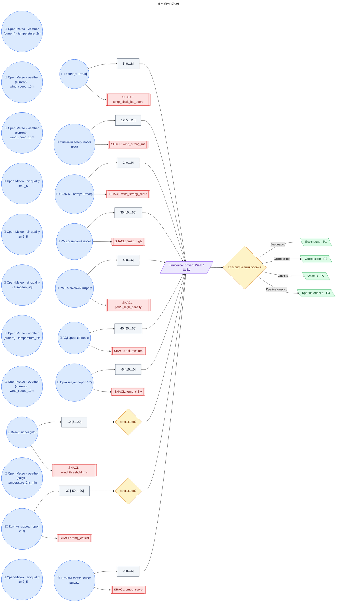

# Регламент NSK · life indices

**source_id:** `nsk-life-indices`  
**Дата редакции регламента:** 2026-05-20  
**Домен:** Города и районы (NSK OpenData) (`city`)

## Граф регламента (Rule DSL Flow)

## Исходные файлы

- [nsk-life-indices.flow.json](../../../backend/data/fixtures/nsk-life-indices.flow.json) — визуальный граф регламента (Rule DSL).
- [nsk-life-indices.data.ttl](../../../backend/data/fixtures/nsk-life-indices.data.ttl) — Turtle: параметры и метаданные регламента.
- [nsk-life-indices.shapes.ttl](../../../backend/data/fixtures/nsk-life-indices.shapes.ttl) — SHACL-ограничения.

---

Эта страница сгенерирована автоматически из `*.flow.json` скриптом 
[`scripts/export_flows_to_mermaid.py`](../../../scripts/export_flows_to_mermaid.py). 
Регенерируется при изменении регламента. Возврат к индексу — [`../README.md`](../README.md).
