# Регламент NSK · traffic

**source_id:** `nsk-traffic`  
**Дата редакции регламента:** 2026-05-20  
**Домен:** Города и районы (NSK OpenData) (`city`)

## Граф регламента (Rule DSL Flow)

```mermaid
---
title: nsk-traffic
---
flowchart LR
  n_in_0(("Масштаб выходного дня"))
  n_thr_0["0.45 [0…1]"]
  n_shacl_0[["SHACL: weekend_scale"]]
  n_in_1(("⊕ Понедельник (Δ)"))
  n_thr_1["0.8 [0…3]"]
  n_shacl_1[["SHACL: delta"]]
  n_in_2(("⊕ Пятница (Δ)"))
  n_thr_2["0.7 [0…3]"]
  n_shacl_2[["SHACL: delta"]]
  n_in_3(("⊕ Пост-праздник (Δ)"))
  n_thr_3["1.2 [0…3]"]
  n_shacl_3[["SHACL: delta"]]
  n_sensor_4(("📡 Open-Meteo · weather (current) · precipitation"))
  n_in_4(("❄ Сильный снег (Δ)"))
  n_thr_4["2.5 [0…5]"]
  n_shacl_4[["SHACL: heavy_delta"]]
  n_sensor_5(("📡 Open-Meteo · weather (current) · precipitation"))
  n_in_5(("❄ Снег (Δ)"))
  n_thr_5["1.5 [0…5]"]
  n_shacl_5[["SHACL: normal_delta"]]
  n_sensor_6(("📡 Open-Meteo · weather (current) · precipitation"))
  n_in_6(("🌧 Ливень (Δ)"))
  n_thr_6["1.5 [0…5]"]
  n_shacl_6[["SHACL: heavy_delta"]]
  n_sensor_7(("📡 Open-Meteo · weather (current) · temperature_2m"))
  n_in_7(("🧊 Гололёд (Δ)"))
  n_thr_7["2.5 [0…5]"]
  n_shacl_7[["SHACL: delta"]]
  n_formula[/"Индекс дорожной нагрузки"/]
  n_switch{"Классификация уровня"}
  n_out_0[\"🟢 Свободно · P1"\]
  n_out_1[\"🟡 Умеренно · P2"\]
  n_out_2[\"🟠 Затруднено · P3"\]
  n_out_3[\"🔴 Сложно · P4"\]
  n_out_4[\"🔴 Очень сложно · P5"\]
  n_out_5[\"❌ Коллапс · P6"\]
  n_sensor_yandex_level(("📡 Yandex Traffic · level (0–10)"))
  n_in_activation(("Порог активации детекторов"))
  n_thr_activation["≥ 4 — включить детекторы"]
  n_shacl_trafficIndexActivationThreshold[["SHACL: trafficIndexActivationThreshold"]]
  n_sensor_detector_a(("📷 Видеодетектор A · Красный пр. (плотность %)"))
  n_in_detector_a(("Плотность дороги A, %"))
  n_sensor_detector_b(("📷 Видеодетектор B · Б. Хмельницкого (плотность %)"))
  n_in_detector_b(("Плотность дороги B, %"))
  n_formula_imbalance[/"imbalance = A − B"/]
  n_in_imbalance_thr(("Порог перекоса A/B, %"))
  n_thr_imbalance["20 [0…100]"]
  n_shacl_densityImbalanceThresholdPercent[["SHACL: densityImbalanceThresholdPercent"]]
  n_in_green_ext(("Шаг расширения зелёного, сек"))
  n_shacl_greenLightExtensionSeconds[["SHACL: greenLightExtensionSeconds"]]
  n_in_green_max(("Максимум зелёного, сек"))
  n_shacl_greenLightMaxSeconds[["SHACL: greenLightMaxSeconds"]]
  n_switch_balance{"Стратегия балансировки"}
  n_out_balanced[\"🟢 Сбалансировано — без действий · P1"\]
  n_out_extend_a[\"🚦 Продлить зелёный на дороге A · P2"\]
  n_out_extend_b[\"🚦 Продлить зелёный на дороге B · P2"\]
  n_in_0 --> n_thr_0
  n_in_0 --> n_shacl_0
  n_in_1 --> n_thr_1
  n_in_1 --> n_shacl_1
  n_in_2 --> n_thr_2
  n_in_2 --> n_shacl_2
  n_in_3 --> n_thr_3
  n_in_3 --> n_shacl_3
  n_in_4 --> n_thr_4
  n_in_4 --> n_shacl_4
  n_in_5 --> n_thr_5
  n_in_5 --> n_shacl_5
  n_in_6 --> n_thr_6
  n_in_6 --> n_shacl_6
  n_in_7 --> n_thr_7
  n_in_7 --> n_shacl_7
  n_thr_0 --> n_formula
  n_thr_1 --> n_formula
  n_thr_2 --> n_formula
  n_thr_3 --> n_formula
  n_thr_4 --> n_formula
  n_thr_5 --> n_formula
  n_thr_6 --> n_formula
  n_thr_7 --> n_formula
  n_formula --> n_switch
  n_switch -->|Свободно| n_out_0
  n_switch -->|Умеренно| n_out_1
  n_switch -->|Затруднено| n_out_2
  n_switch -->|Сложно| n_out_3
  n_switch -->|Очень сложно| n_out_4
  n_switch -->|Коллапс| n_out_5
  n_sensor_yandex_level --> n_in_activation
  n_sensor_detector_a --> n_in_detector_a
  n_sensor_detector_b --> n_in_detector_b
  n_in_activation --> n_thr_activation
  n_in_detector_a --> n_formula_imbalance
  n_in_detector_b --> n_formula_imbalance
  n_in_imbalance_thr --> n_thr_imbalance
  n_thr_activation --> n_switch_balance
  n_formula_imbalance --> n_switch_balance
  n_thr_imbalance --> n_switch_balance
  n_in_green_ext --> n_out_extend_a
  n_in_green_ext --> n_out_extend_b
  n_in_green_max --> n_out_extend_a
  n_in_green_max --> n_out_extend_b
  n_switch_balance -->|balanced| n_out_balanced
  n_switch_balance -->|extend_a| n_out_extend_a
  n_switch_balance -->|extend_b| n_out_extend_b

  classDef sensor   fill:#dbeafe,stroke:#2563eb,color:#1e3a8a;
  classDef param    fill:#f1f5f9,stroke:#475569,color:#0f172a;
  classDef decision fill:#fef3c7,stroke:#d97706,color:#78350f;
  classDef formula  fill:#ede9fe,stroke:#7c3aed,color:#4c1d95;
  classDef shacl    fill:#fee2e2,stroke:#dc2626,color:#7f1d1d;
  classDef action   fill:#dcfce7,stroke:#16a34a,color:#14532d;
  class n_in_0,n_in_1,n_in_2,n_in_3,n_sensor_4,n_in_4,n_sensor_5,n_in_5,n_sensor_6,n_in_6,n_sensor_7,n_in_7,n_sensor_yandex_level,n_in_activation,n_sensor_detector_a,n_in_detector_a,n_sensor_detector_b,n_in_detector_b,n_in_imbalance_thr,n_in_green_ext,n_in_green_max sensor;
  class n_thr_0,n_thr_1,n_thr_2,n_thr_3,n_thr_4,n_thr_5,n_thr_6,n_thr_7,n_thr_activation,n_thr_imbalance param;
  class n_shacl_0,n_shacl_1,n_shacl_2,n_shacl_3,n_shacl_4,n_shacl_5,n_shacl_6,n_shacl_7,n_shacl_trafficIndexActivationThreshold,n_shacl_densityImbalanceThresholdPercent,n_shacl_greenLightExtensionSeconds,n_shacl_greenLightMaxSeconds shacl;
  class n_formula,n_formula_imbalance formula;
  class n_switch,n_switch_balance decision;
  class n_out_0,n_out_1,n_out_2,n_out_3,n_out_4,n_out_5,n_out_balanced,n_out_extend_a,n_out_extend_b action;
```

## Исходные файлы

- [nsk-traffic.flow.json](../../../backend/data/fixtures/nsk-traffic.flow.json) — визуальный граф регламента (Rule DSL).
- [nsk-traffic.data.ttl](../../../backend/data/fixtures/nsk-traffic.data.ttl) — Turtle: параметры и метаданные регламента.
- [nsk-traffic.shapes.ttl](../../../backend/data/fixtures/nsk-traffic.shapes.ttl) — SHACL-ограничения.

---

Эта страница сгенерирована автоматически из `*.flow.json` скриптом 
[`scripts/export_flows_to_mermaid.py`](../../../scripts/export_flows_to_mermaid.py). 
Регенерируется при изменении регламента. Возврат к индексу — [`../README.md`](../README.md).
