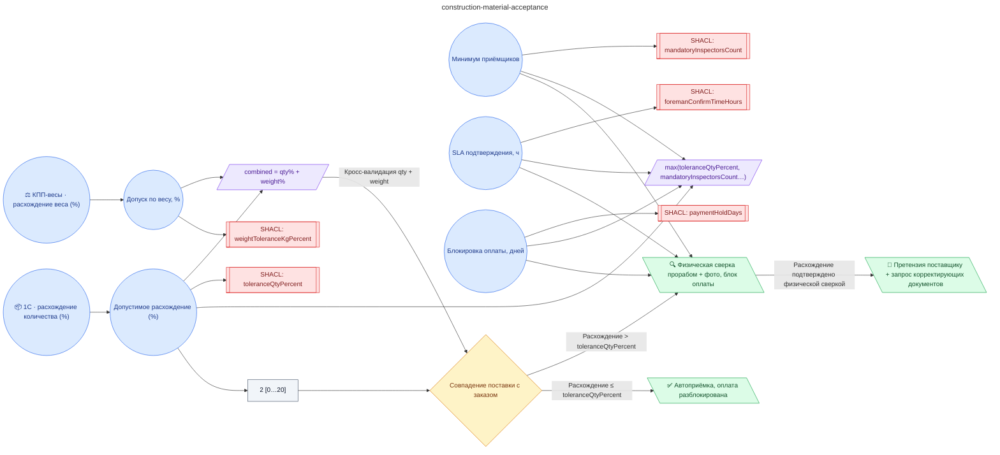

# Регламент входного контроля материалов на стройплощадке (сверка накладной 1С, блок оплаты при расхождении, корректирующий акт)

**source_id:** `construction-material-acceptance`  
**Дата редакции регламента:** 2026-05-25  
**Домен:** Строительство (`construction`)

> При поступлении накладной из 1С: 1) Сверить позицию накладной с заказом (номенклатура, количество, партия).

## Граф регламента (Rule DSL Flow)

## Исходные файлы

- [construction-material-acceptance.flow.json](../../../backend/data/fixtures/construction-material-acceptance.flow.json) — визуальный граф регламента (Rule DSL).
- [construction-material-acceptance.data.ttl](../../../backend/data/fixtures/construction-material-acceptance.data.ttl) — Turtle: параметры и метаданные регламента.
- [construction-material-acceptance.shapes.ttl](../../../backend/data/fixtures/construction-material-acceptance.shapes.ttl) — SHACL-ограничения.

---

Эта страница сгенерирована автоматически из `*.flow.json` скриптом 
[`scripts/export_flows_to_mermaid.py`](../../../scripts/export_flows_to_mermaid.py). 
Регенерируется при изменении регламента. Возврат к индексу — [`../README.md`](../README.md).
