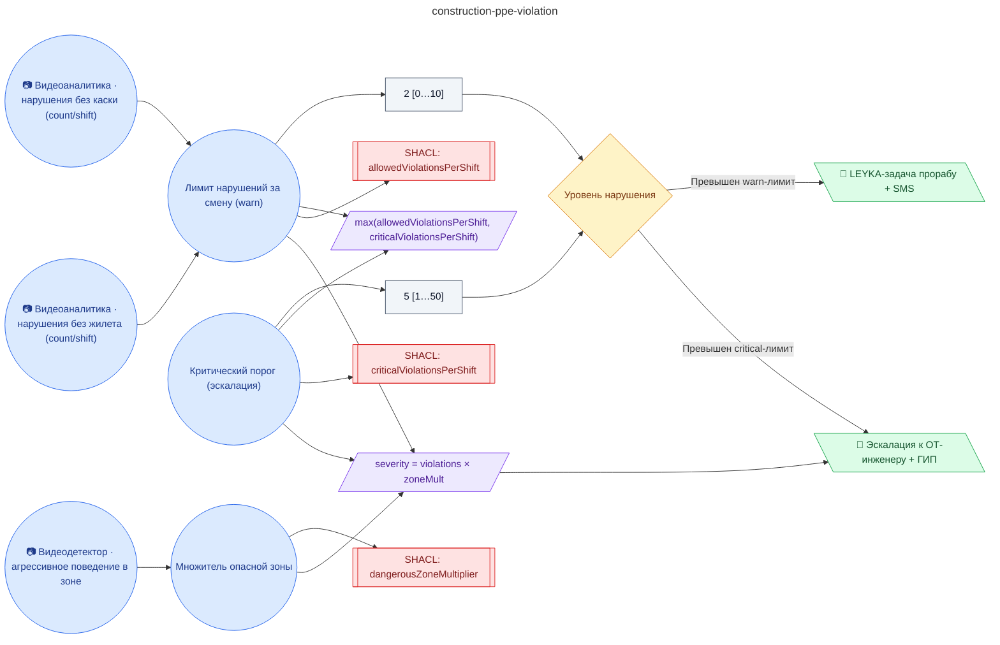

# Регламент контроля средств индивидуальной защиты (СИЗ) на стройплощадке (видеоаналитика касок и сигнальных жилетов)

**source_id:** `construction-ppe-violation`  
**Дата редакции регламента:** 2026-05-25  
**Домен:** Строительство (`construction`)

> При фиксации работника без СИЗ на стройплощадке: 1) Зафиксировать кадр с нарушением (frame_image_base64) и зону (violation_zone).

## Граф регламента (Rule DSL Flow)

## Исходные файлы

- [construction-ppe-violation.flow.json](../../../backend/data/fixtures/construction-ppe-violation.flow.json) — визуальный граф регламента (Rule DSL).
- [construction-ppe-violation.data.ttl](../../../backend/data/fixtures/construction-ppe-violation.data.ttl) — Turtle: параметры и метаданные регламента.
- [construction-ppe-violation.shapes.ttl](../../../backend/data/fixtures/construction-ppe-violation.shapes.ttl) — SHACL-ограничения.

---

Эта страница сгенерирована автоматически из `*.flow.json` скриптом 
[`scripts/export_flows_to_mermaid.py`](../../../scripts/export_flows_to_mermaid.py). 
Регенерируется при изменении регламента. Возврат к индексу — [`../README.md`](../README.md).
