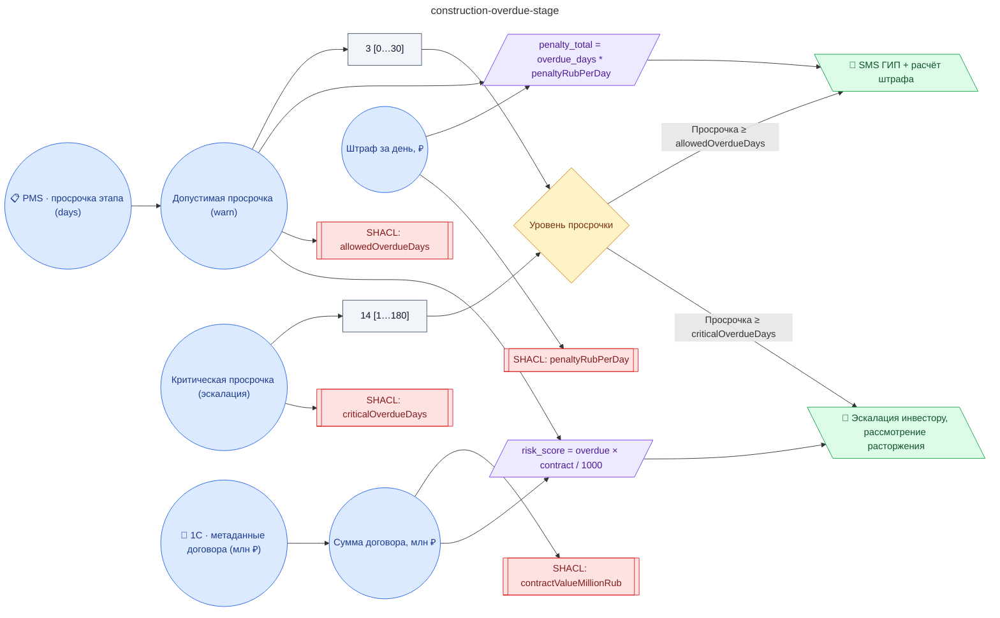

# Регламент контроля сроков выполнения этапов строительного проекта (план/факт PMS, штраф подрядчику, эскалация инвестору)

**source_id:** `construction-overdue-stage`  
**Дата редакции регламента:** 2026-05-25  
**Домен:** Строительство (`construction`)

> При обнаружении просрочки этапа в PMS: 1) Зафиксировать разрыв (план vs факт).

## Граф регламента (Rule DSL Flow)

## Исходные файлы

- [construction-overdue-stage.flow.json](../../../backend/data/fixtures/construction-overdue-stage.flow.json) — визуальный граф регламента (Rule DSL).
- [construction-overdue-stage.data.ttl](../../../backend/data/fixtures/construction-overdue-stage.data.ttl) — Turtle: параметры и метаданные регламента.
- [construction-overdue-stage.shapes.ttl](../../../backend/data/fixtures/construction-overdue-stage.shapes.ttl) — SHACL-ограничения.

---

Эта страница сгенерирована автоматически из `*.flow.json` скриптом 
[`scripts/export_flows_to_mermaid.py`](../../../scripts/export_flows_to_mermaid.py). 
Регенерируется при изменении регламента. Возврат к индексу — [`../README.md`](../README.md).
