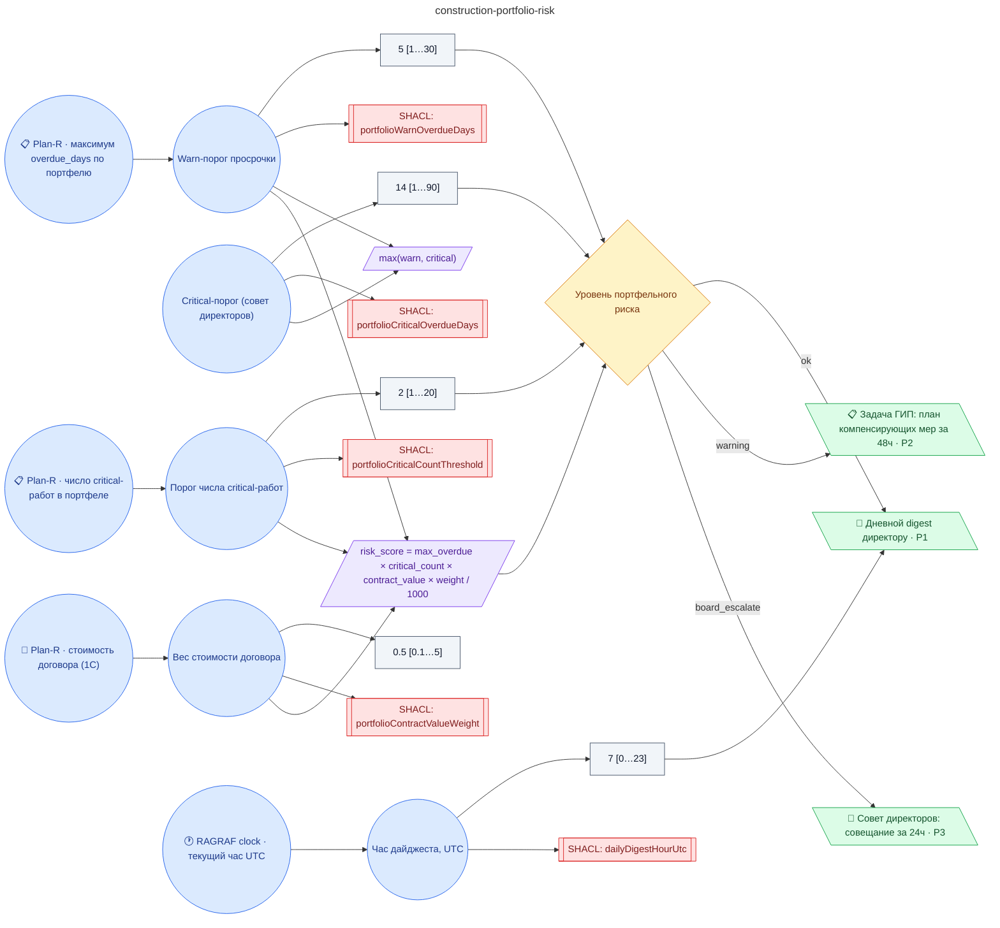

# Регламент портфельного риск-скоринга строительных проектов (агрегаты Plan-R: max просрочка + critical-count × стоимость договора, эскалация инвестору и совету директоров)

**source_id:** `construction-portfolio-risk`  
**Дата редакции регламента:** 2026-05-25  
**Домен:** Строительство (`construction`)

> Регламент срабатывает каждые 5 минут после pull_planr из Plan-R Public API.

## Граф регламента (Rule DSL Flow)

## Исходные файлы

- [construction-portfolio-risk.flow.json](../../../backend/data/fixtures/construction-portfolio-risk.flow.json) — визуальный граф регламента (Rule DSL).
- [construction-portfolio-risk.data.ttl](../../../backend/data/fixtures/construction-portfolio-risk.data.ttl) — Turtle: параметры и метаданные регламента.
- [construction-portfolio-risk.shapes.ttl](../../../backend/data/fixtures/construction-portfolio-risk.shapes.ttl) — SHACL-ограничения.

---

Эта страница сгенерирована автоматически из `*.flow.json` скриптом 
[`scripts/export_flows_to_mermaid.py`](../../../scripts/export_flows_to_mermaid.py). 
Регенерируется при изменении регламента. Возврат к индексу — [`../README.md`](../README.md).
