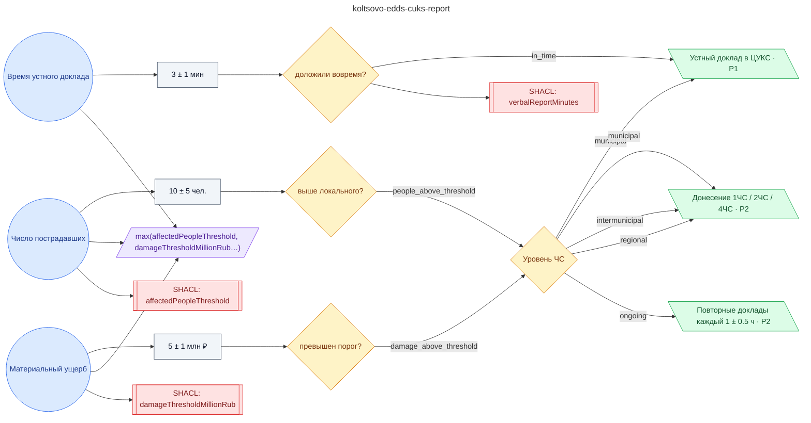

# Регламент доклада в ЦУКС ГУ МЧС России по НСО при ЧС выше локального характера

**source_id:** `koltsovo-edds-cuks-report`  
**Дата редакции регламента:** 2020-12-04  
**Домен:** Ситуационный центр / ЕДДС (`emergency_response`)

> Доклад в ЦУКС ГУ МЧС России по НСО при ЧС выше локального (на основе § 5.4.1, § 5.6.4, § 6.4 Положения о ЕДДС МКУ «СВЕТОЧ» №15 от 04.12.2020 и ПП РФ № 304-2007 о классификации ЧС): \n\n1.

## Граф регламента (Rule DSL Flow)

## Исходные файлы

- [koltsovo-edds-cuks-report.flow.json](../../../backend/data/fixtures/koltsovo-edds-cuks-report.flow.json) — визуальный граф регламента (Rule DSL).
- [koltsovo-edds-cuks-report.data.ttl](../../../backend/data/fixtures/koltsovo-edds-cuks-report.data.ttl) — Turtle: параметры и метаданные регламента.
- [koltsovo-edds-cuks-report.shapes.ttl](../../../backend/data/fixtures/koltsovo-edds-cuks-report.shapes.ttl) — SHACL-ограничения.

---

Эта страница сгенерирована автоматически из `*.flow.json` скриптом 
[`scripts/export_flows_to_mermaid.py`](../../../scripts/export_flows_to_mermaid.py). 
Регенерируется при изменении регламента. Возврат к индексу — [`../README.md`](../README.md).
