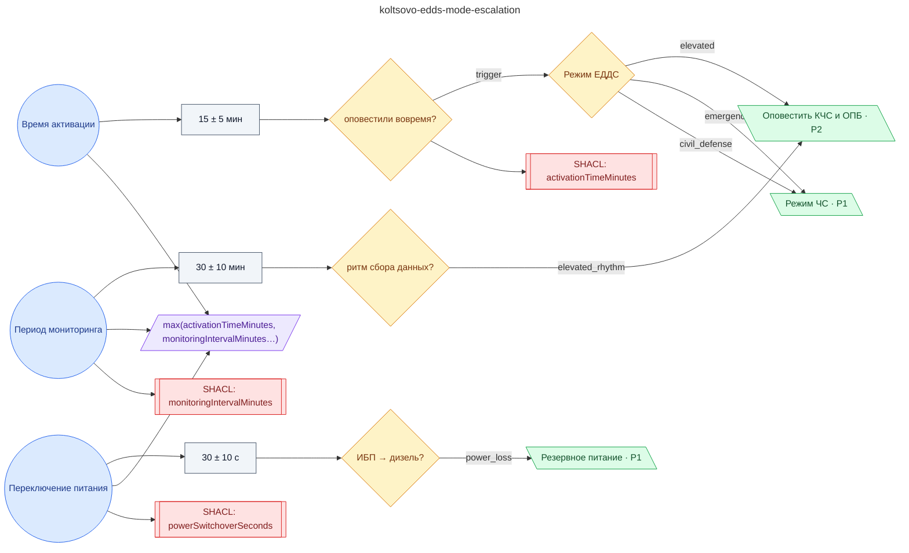

# Регламент перевода ЕДДС р.п. Кольцово в режимы повышенной готовности и чрезвычайной ситуации

**source_id:** `koltsovo-edds-mode-escalation`  
**Дата редакции регламента:** 2020-12-04  
**Домен:** Ситуационный центр / ЕДДС (`emergency_response`)

> Переход ЕДДС р.п.

## Граф регламента (Rule DSL Flow)

## Исходные файлы

- [koltsovo-edds-mode-escalation.flow.json](../../../backend/data/fixtures/koltsovo-edds-mode-escalation.flow.json) — визуальный граф регламента (Rule DSL).
- [koltsovo-edds-mode-escalation.data.ttl](../../../backend/data/fixtures/koltsovo-edds-mode-escalation.data.ttl) — Turtle: параметры и метаданные регламента.
- [koltsovo-edds-mode-escalation.shapes.ttl](../../../backend/data/fixtures/koltsovo-edds-mode-escalation.shapes.ttl) — SHACL-ограничения.

---

Эта страница сгенерирована автоматически из `*.flow.json` скриптом 
[`scripts/export_flows_to_mermaid.py`](../../../scripts/export_flows_to_mermaid.py). 
Регенерируется при изменении регламента. Возврат к индексу — [`../README.md`](../README.md).
