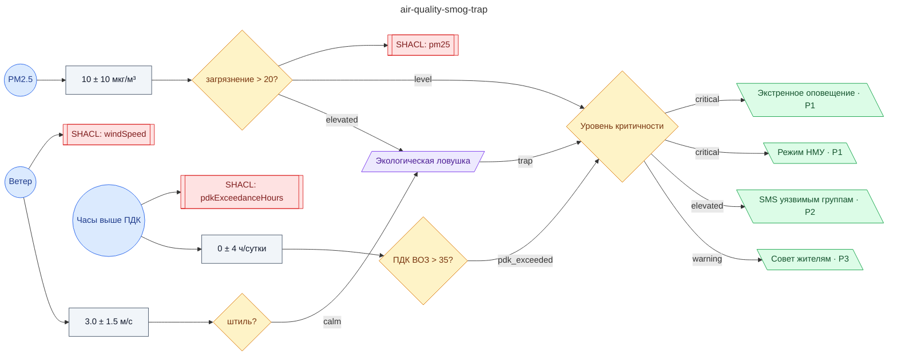

# Регламент при экологической ловушке: безветрие + загрязнение PM2.5 (НМУ, оповещение уязвимых групп, предписания предприятиям)

**source_id:** `air-quality-smog-trap`  
**Дата редакции регламента:** 2024-11-30  
**Домен:** Городская экология (`environment`)

> При безветрии (ветер < 1.5 м/с) и росте PM2.5 формируется экологическая ловушка.

## Граф регламента (Rule DSL Flow)

## Исходные файлы

- [air-quality-smog-trap.flow.json](../../../backend/data/fixtures/air-quality-smog-trap.flow.json) — визуальный граф регламента (Rule DSL).
- [air-quality-smog-trap.data.ttl](../../../backend/data/fixtures/air-quality-smog-trap.data.ttl) — Turtle: параметры и метаданные регламента.
- [air-quality-smog-trap.shapes.ttl](../../../backend/data/fixtures/air-quality-smog-trap.shapes.ttl) — SHACL-ограничения.

---

Эта страница сгенерирована автоматически из `*.flow.json` скриптом 
[`scripts/export_flows_to_mermaid.py`](../../../scripts/export_flows_to_mermaid.py). 
Регенерируется при изменении регламента. Возврат к индексу — [`../README.md`](../README.md).
