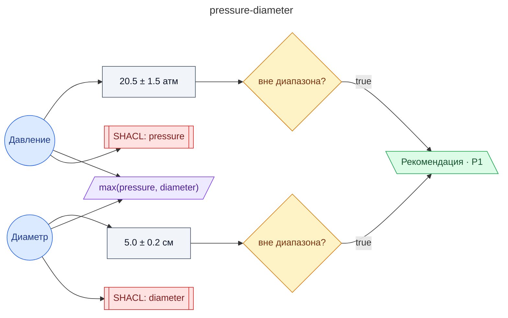

# Регламент на допустимые параметры давления и диаметра для трубопроводов водоснабжения

**source_id:** `pressure-diameter`  
**Дата редакции регламента:** 2023-10-01  
**Домен:** Теплоснабжение (`heating`)

> Остановите систему, проверьте герметичность трубопровода на наличие утечек и проведите необходимый ремонт.

## Граф регламента (Rule DSL Flow)

## Исходные файлы

- [pressure-diameter.flow.json](../../../backend/data/fixtures/pressure-diameter.flow.json) — визуальный граф регламента (Rule DSL).
- [pressure-diameter.data.ttl](../../../backend/data/fixtures/pressure-diameter.data.ttl) — Turtle: параметры и метаданные регламента.
- [pressure-diameter.shapes.ttl](../../../backend/data/fixtures/pressure-diameter.shapes.ttl) — SHACL-ограничения.

---

Эта страница сгенерирована автоматически из `*.flow.json` скриптом 
[`scripts/export_flows_to_mermaid.py`](../../../scripts/export_flows_to_mermaid.py). 
Регенерируется при изменении регламента. Возврат к индексу — [`../README.md`](../README.md).
