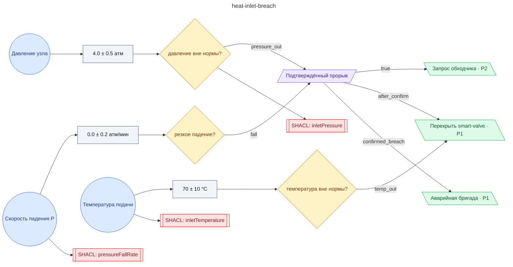

# Регламент при прорыве теплового ввода (smart-valve, обходчик, оповещение медблока)

**source_id:** `heat-inlet-breach`  
**Дата редакции регламента:** 2024-09-10  
**Домен:** Теплоснабжение (`heating`)

> При подтверждении утечки в тепловом узле: 1) Уведомить инженерную службу объекта и городские теплосети.

## Граф регламента (Rule DSL Flow)

## Исходные файлы

- [heat-inlet-breach.flow.json](../../../backend/data/fixtures/heat-inlet-breach.flow.json) — визуальный граф регламента (Rule DSL).
- [heat-inlet-breach.data.ttl](../../../backend/data/fixtures/heat-inlet-breach.data.ttl) — Turtle: параметры и метаданные регламента.
- [heat-inlet-breach.shapes.ttl](../../../backend/data/fixtures/heat-inlet-breach.shapes.ttl) — SHACL-ограничения.

---

Эта страница сгенерирована автоматически из `*.flow.json` скриптом 
[`scripts/export_flows_to_mermaid.py`](../../../scripts/export_flows_to_mermaid.py). 
Регенерируется при изменении регламента. Возврат к индексу — [`../README.md`](../README.md).
