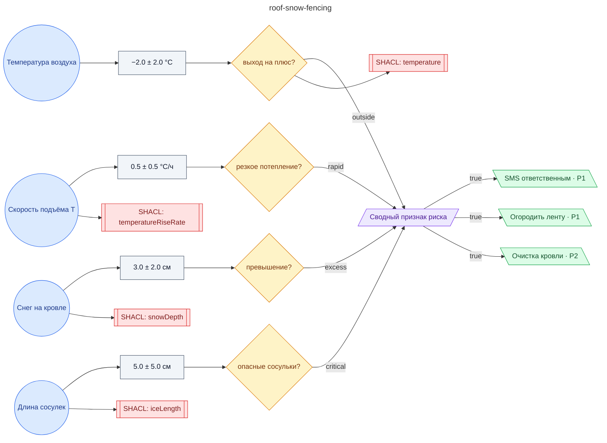

# Регламент огораживания придомовой территории и оповещения ответственных при риске падения сосулек и схода снега с кровли (ТСЖ)

**source_id:** `roof-snow-fencing`  
**Дата редакции регламента:** 2024-11-15  
**Домен:** Управление ЖКХ (`housing`)

> Огородить придомовую территорию сигнальной лентой по периметру свесов кровли; за 4 ± 1 часа до прогнозируемого риска направить SMS-уведомления всем ответственным лицам подрядчика по эксплуатации кровли и управляющему ТСЖ; обеспечить контро…

## Граф регламента (Rule DSL Flow)

## Исходные файлы

- [roof-snow-fencing.flow.json](../../../backend/data/fixtures/roof-snow-fencing.flow.json) — визуальный граф регламента (Rule DSL).
- [roof-snow-fencing.data.ttl](../../../backend/data/fixtures/roof-snow-fencing.data.ttl) — Turtle: параметры и метаданные регламента.
- [roof-snow-fencing.shapes.ttl](../../../backend/data/fixtures/roof-snow-fencing.shapes.ttl) — SHACL-ограничения.

---

Эта страница сгенерирована автоматически из `*.flow.json` скриптом 
[`scripts/export_flows_to_mermaid.py`](../../../scripts/export_flows_to_mermaid.py). 
Регенерируется при изменении регламента. Возврат к индексу — [`../README.md`](../README.md).
