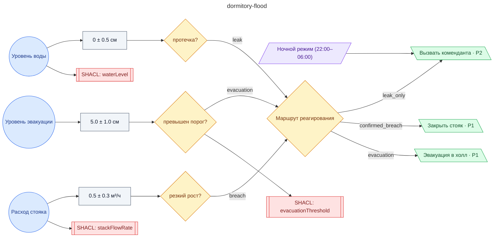

# Регламент при ночной протечке в жилом блоке общежития (отсекатель стояка, комендант, эвакуация в холл)

**source_id:** `dormitory-flood`  
**Дата редакции регламента:** 2024-09-25  
**Домен:** Управление ЖКХ (`housing`)

> Ночная протечка — специфика режима: 1) Минимизировать контакт с жильцами, эвакуация только при выходе воды на этаж.

## Граф регламента (Rule DSL Flow)

## Исходные файлы

- [dormitory-flood.flow.json](../../../backend/data/fixtures/dormitory-flood.flow.json) — визуальный граф регламента (Rule DSL).
- [dormitory-flood.data.ttl](../../../backend/data/fixtures/dormitory-flood.data.ttl) — Turtle: параметры и метаданные регламента.
- [dormitory-flood.shapes.ttl](../../../backend/data/fixtures/dormitory-flood.shapes.ttl) — SHACL-ограничения.

---

Эта страница сгенерирована автоматически из `*.flow.json` скриптом 
[`scripts/export_flows_to_mermaid.py`](../../../scripts/export_flows_to_mermaid.py). 
Регенерируется при изменении регламента. Возврат к индексу — [`../README.md`](../README.md).
