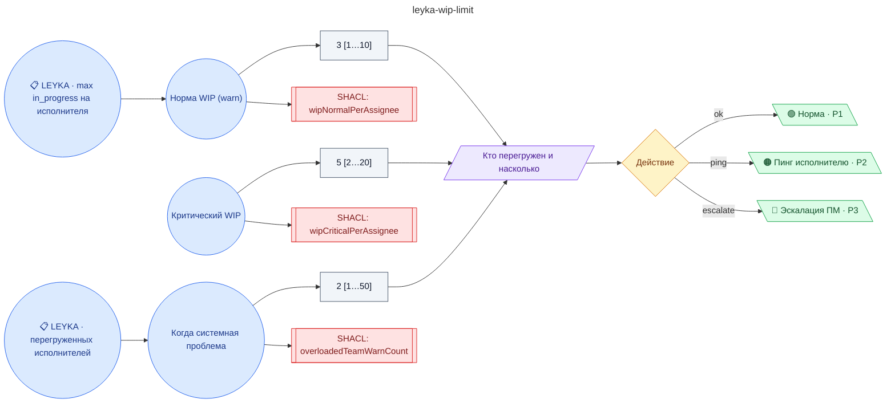

# Kanban WIP-limit: не больше N задач в работе на исполнителя

**source_id:** `leyka-wip-limit`  
**Дата редакции регламента:** 2026-05-22  
**Домен:** ИТ-поддержка (`it-support`)

> Узкое горлышко: исполнитель набрал больше задач, чем способен закрыть параллельно.

## Граф регламента (Rule DSL Flow)

## Исходные файлы

- [leyka-wip-limit.flow.json](../../../backend/data/fixtures/leyka-wip-limit.flow.json) — визуальный граф регламента (Rule DSL).
- [leyka-wip-limit.data.ttl](../../../backend/data/fixtures/leyka-wip-limit.data.ttl) — Turtle: параметры и метаданные регламента.
- [leyka-wip-limit.shapes.ttl](../../../backend/data/fixtures/leyka-wip-limit.shapes.ttl) — SHACL-ограничения.

---

Эта страница сгенерирована автоматически из `*.flow.json` скриптом 
[`scripts/export_flows_to_mermaid.py`](../../../scripts/export_flows_to_mermaid.py). 
Регенерируется при изменении регламента. Возврат к индексу — [`../README.md`](../README.md).
