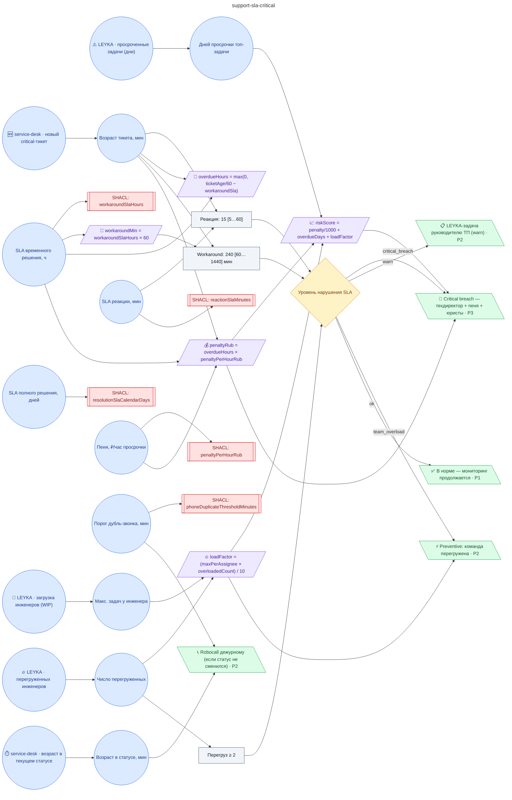

# Регламент SLA критических заявок ТП (реакция 15 ± 5 мин, временное решение 4 ± 1 ч, полное решение 20 ± 5 календарных дней, эскалация руководителю при дрейфе SLA, дублирование критики звонком, пени по договору)

**source_id:** `support-sla-critical`  
**Дата редакции регламента:** 2026-05-26  
**Домен:** ИТ-поддержка (`it-support`)

> Регламент применяется к каждому новому тикету priority='critical'.

## Граф регламента (Rule DSL Flow)

## Исходные файлы

- [support-sla-critical.flow.json](../../../backend/data/fixtures/support-sla-critical.flow.json) — визуальный граф регламента (Rule DSL).
- [support-sla-critical.data.ttl](../../../backend/data/fixtures/support-sla-critical.data.ttl) — Turtle: параметры и метаданные регламента.
- [support-sla-critical.shapes.ttl](../../../backend/data/fixtures/support-sla-critical.shapes.ttl) — SHACL-ограничения.

---

Эта страница сгенерирована автоматически из `*.flow.json` скриптом 
[`scripts/export_flows_to_mermaid.py`](../../../scripts/export_flows_to_mermaid.py). 
Регенерируется при изменении регламента. Возврат к индексу — [`../README.md`](../README.md).
