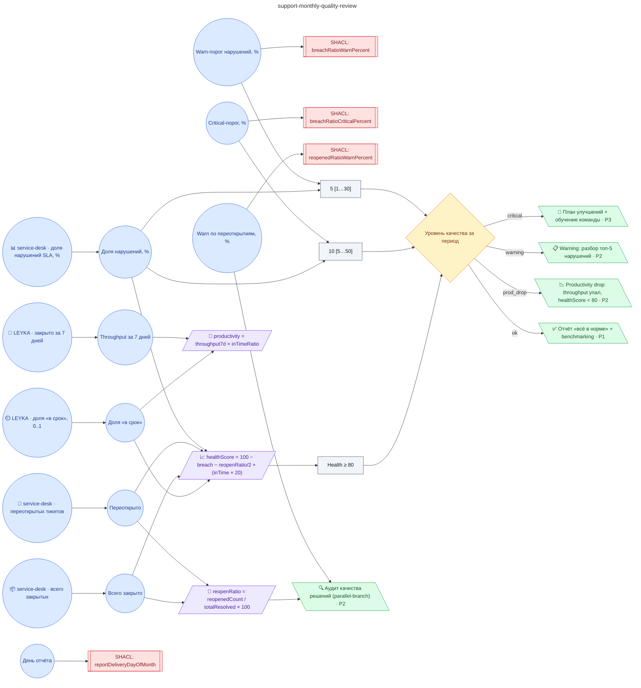

# Регламент ежемесячного анализа качества обработки заявок (warn-порог нарушений SLA 5±2%, critical-порог 10±3%, warn по переоткрытиям 8±3%, отчёт руководителю 1±0 числа)

**source_id:** `support-monthly-quality-review`  
**Дата редакции регламента:** 2026-05-26  
**Домен:** ИТ-поддержка (`it-support`)

> Применяется на каждом snapshot support-sla-violation с period='month' (формируется в полночь 1-го числа).

## Граф регламента (Rule DSL Flow)

## Исходные файлы

- [support-monthly-quality-review.flow.json](../../../backend/data/fixtures/support-monthly-quality-review.flow.json) — визуальный граф регламента (Rule DSL).
- [support-monthly-quality-review.data.ttl](../../../backend/data/fixtures/support-monthly-quality-review.data.ttl) — Turtle: параметры и метаданные регламента.
- [support-monthly-quality-review.shapes.ttl](../../../backend/data/fixtures/support-monthly-quality-review.shapes.ttl) — SHACL-ограничения.

---

Эта страница сгенерирована автоматически из `*.flow.json` скриптом 
[`scripts/export_flows_to_mermaid.py`](../../../scripts/export_flows_to_mermaid.py). 
Регенерируется при изменении регламента. Возврат к индексу — [`../README.md`](../README.md).
