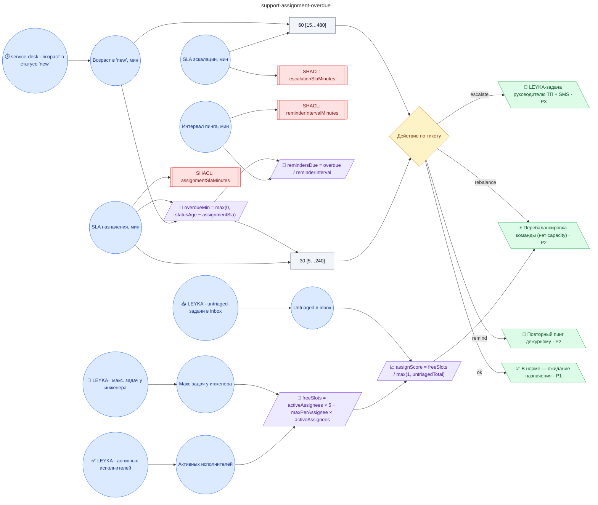

# Регламент назначения исполнителя на новую заявку (assignment 30±10 мин, эскалация руководителю 60±15 мин, повторные уведомления каждые 15±5 мин)

**source_id:** `support-assignment-overdue`  
**Дата редакции регламента:** 2026-05-26  
**Домен:** ИТ-поддержка (`it-support`)

> Регламент применяется к каждому тикету в статусе 'new' старше assignmentSlaMinutes.

## Граф регламента (Rule DSL Flow)

## Исходные файлы

- [support-assignment-overdue.flow.json](../../../backend/data/fixtures/support-assignment-overdue.flow.json) — визуальный граф регламента (Rule DSL).
- [support-assignment-overdue.data.ttl](../../../backend/data/fixtures/support-assignment-overdue.data.ttl) — Turtle: параметры и метаданные регламента.
- [support-assignment-overdue.shapes.ttl](../../../backend/data/fixtures/support-assignment-overdue.shapes.ttl) — SHACL-ограничения.

---

Эта страница сгенерирована автоматически из `*.flow.json` скриптом 
[`scripts/export_flows_to_mermaid.py`](../../../scripts/export_flows_to_mermaid.py). 
Регенерируется при изменении регламента. Возврат к индексу — [`../README.md`](../README.md).
