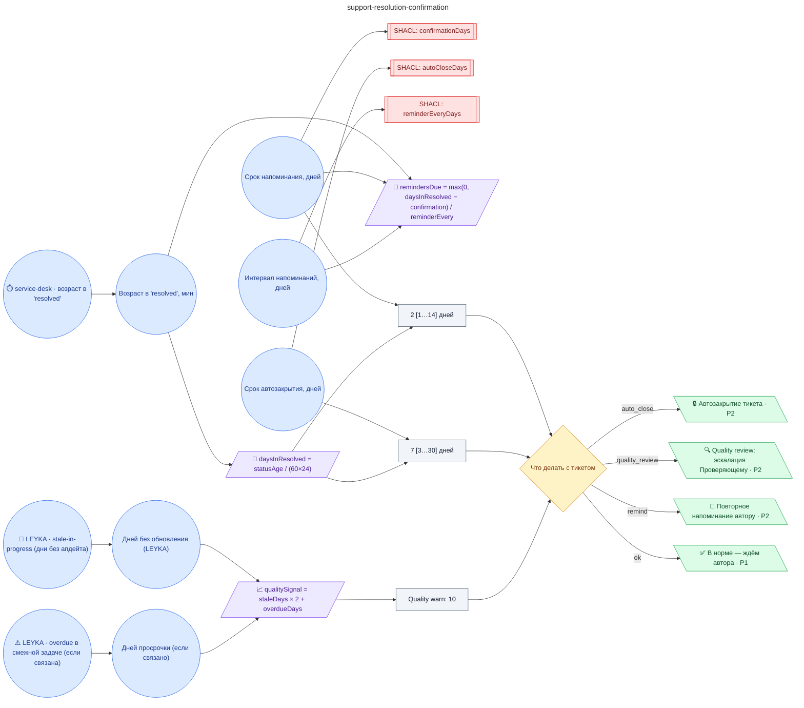

# Регламент подтверждения решения заявки автором (2 ± 1 дня на подтверждение, повторное уведомление каждые 2 ± 1 дня, автозакрытие через 7 ± 2 дня без ответа)

**source_id:** `support-resolution-confirmation`  
**Дата редакции регламента:** 2026-05-26  
**Домен:** ИТ-поддержка (`it-support`)

> Применяется к тикетам в статусе 'resolved'.

## Граф регламента (Rule DSL Flow)

## Исходные файлы

- [support-resolution-confirmation.flow.json](../../../backend/data/fixtures/support-resolution-confirmation.flow.json) — визуальный граф регламента (Rule DSL).
- [support-resolution-confirmation.data.ttl](../../../backend/data/fixtures/support-resolution-confirmation.data.ttl) — Turtle: параметры и метаданные регламента.
- [support-resolution-confirmation.shapes.ttl](../../../backend/data/fixtures/support-resolution-confirmation.shapes.ttl) — SHACL-ограничения.

---

Эта страница сгенерирована автоматически из `*.flow.json` скриптом 
[`scripts/export_flows_to_mermaid.py`](../../../scripts/export_flows_to_mermaid.py). 
Регенерируется при изменении регламента. Возврат к индексу — [`../README.md`](../README.md).
