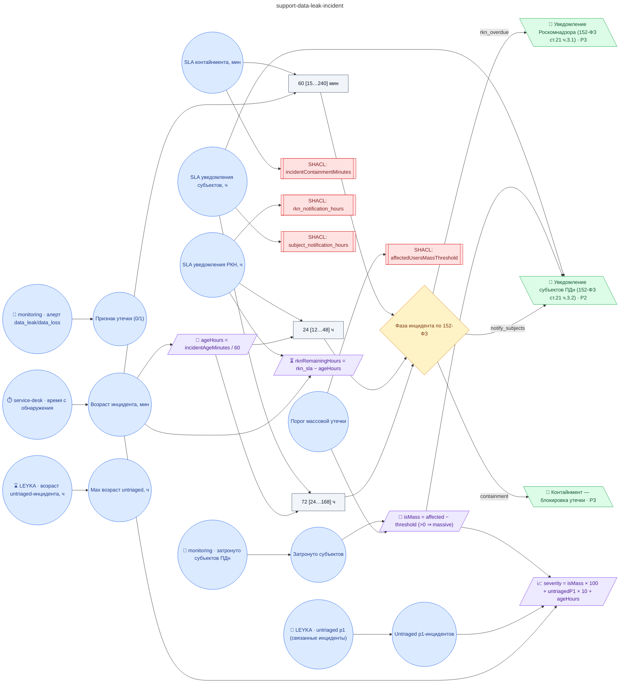

# Регламент при инциденте утечки или потери данных (контайнмент 60±15 мин, уведомление Роскомнадзора 24±2 ч, уведомление субъектов 72±6 ч, мобилизация DPO + юристов, кросс-регистрация в cybersecurity-домене, audit_log с PROV-O)

**source_id:** `support-data-leak-incident`  
**Дата редакции регламента:** 2026-05-26  
**Домен:** ИТ-поддержка (`it-support`)

> Регламент применяется при двух триггерах: 1) автоматический — алерт от системы мониторинга (ops-monitoring-alert с data_leak_indicator=1 или data_loss_indicator=1); 2) ручной — тикет с приоритетом critical и тегом 'data_leak'/'data_loss'.

## Граф регламента (Rule DSL Flow)

## Исходные файлы

- [support-data-leak-incident.flow.json](../../../backend/data/fixtures/support-data-leak-incident.flow.json) — визуальный граф регламента (Rule DSL).
- [support-data-leak-incident.data.ttl](../../../backend/data/fixtures/support-data-leak-incident.data.ttl) — Turtle: параметры и метаданные регламента.
- [support-data-leak-incident.shapes.ttl](../../../backend/data/fixtures/support-data-leak-incident.shapes.ttl) — SHACL-ограничения.

---

Эта страница сгенерирована автоматически из `*.flow.json` скриптом 
[`scripts/export_flows_to_mermaid.py`](../../../scripts/export_flows_to_mermaid.py). 
Регенерируется при изменении регламента. Возврат к индексу — [`../README.md`](../README.md).
