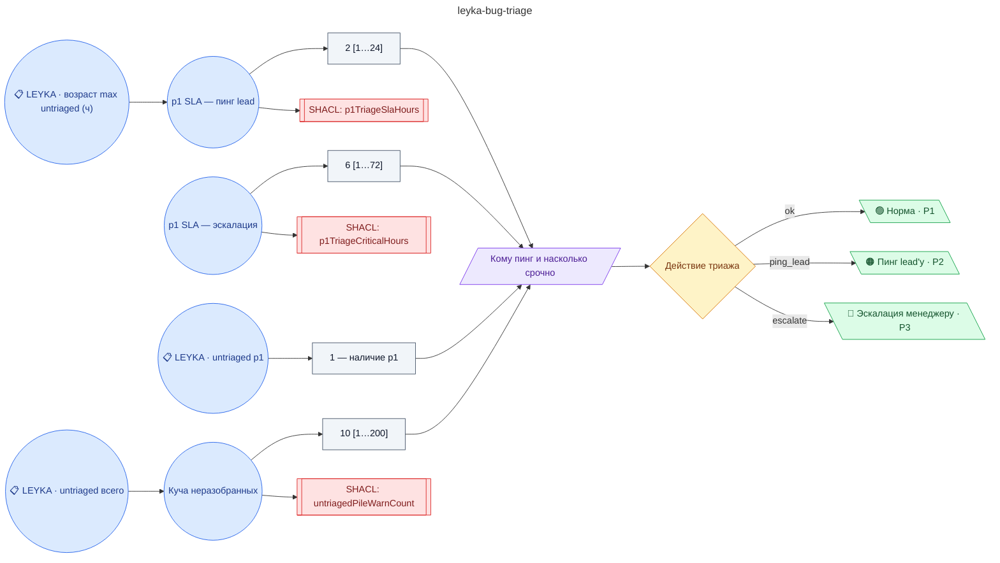

# Триаж критичных задач (баг-репорты p1, инциденты): SLA на назначение исполнителя

**source_id:** `leyka-bug-triage`  
**Дата редакции регламента:** 2026-05-22  
**Домен:** ИТ-поддержка (`it-support`)

> Триаж — это первая защита от паники.

## Граф регламента (Rule DSL Flow)

## Исходные файлы

- [leyka-bug-triage.flow.json](../../../backend/data/fixtures/leyka-bug-triage.flow.json) — визуальный граф регламента (Rule DSL).
- [leyka-bug-triage.data.ttl](../../../backend/data/fixtures/leyka-bug-triage.data.ttl) — Turtle: параметры и метаданные регламента.
- [leyka-bug-triage.shapes.ttl](../../../backend/data/fixtures/leyka-bug-triage.shapes.ttl) — SHACL-ограничения.

---

Эта страница сгенерирована автоматически из `*.flow.json` скриптом 
[`scripts/export_flows_to_mermaid.py`](../../../scripts/export_flows_to_mermaid.py). 
Регенерируется при изменении регламента. Возврат к индексу — [`../README.md`](../README.md).
