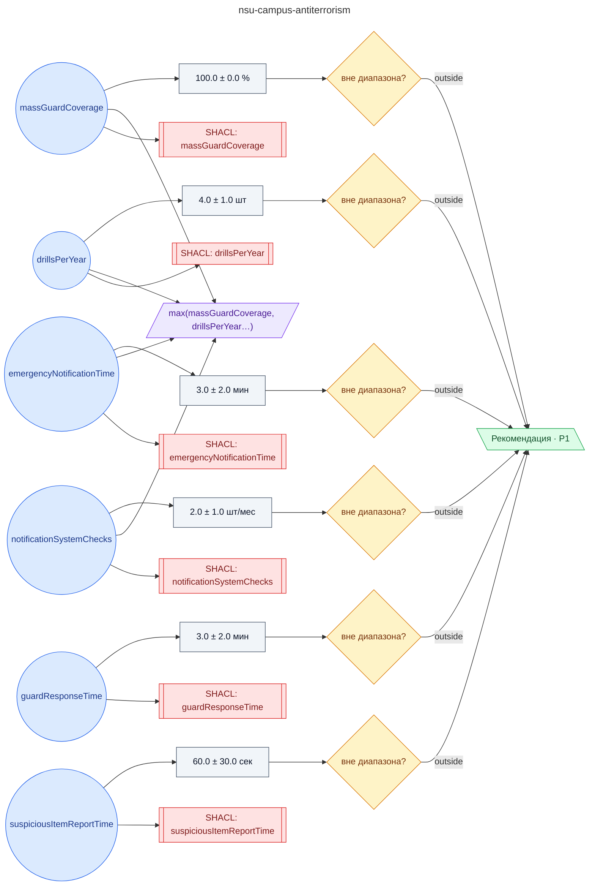

# Регламент антитеррористической защищённости кампуса НГУ

**source_id:** `nsu-campus-antiterrorism`  
**Дата редакции регламента:** 2024-03-26  
**Домен:** Кампус НГУ (`nsu-campus`)

> Регламент антитеррористической защищённости кампуса НГУ (на основе Инструкции НГУ № 0721-3 Приложение № 6 от 26.03.20**, Стандарта Минобрнауки 28.02.2024 разд.

## Граф регламента (Rule DSL Flow)

## Исходные файлы

- [nsu-campus-antiterrorism.flow.json](../../../backend/data/fixtures/nsu-campus-antiterrorism.flow.json) — визуальный граф регламента (Rule DSL).
- [nsu-campus-antiterrorism.data.ttl](../../../backend/data/fixtures/nsu-campus-antiterrorism.data.ttl) — Turtle: параметры и метаданные регламента.
- [nsu-campus-antiterrorism.shapes.ttl](../../../backend/data/fixtures/nsu-campus-antiterrorism.shapes.ttl) — SHACL-ограничения.

---

Эта страница сгенерирована автоматически из `*.flow.json` скриптом 
[`scripts/export_flows_to_mermaid.py`](../../../scripts/export_flows_to_mermaid.py). 
Регенерируется при изменении регламента. Возврат к индексу — [`../README.md`](../README.md).
