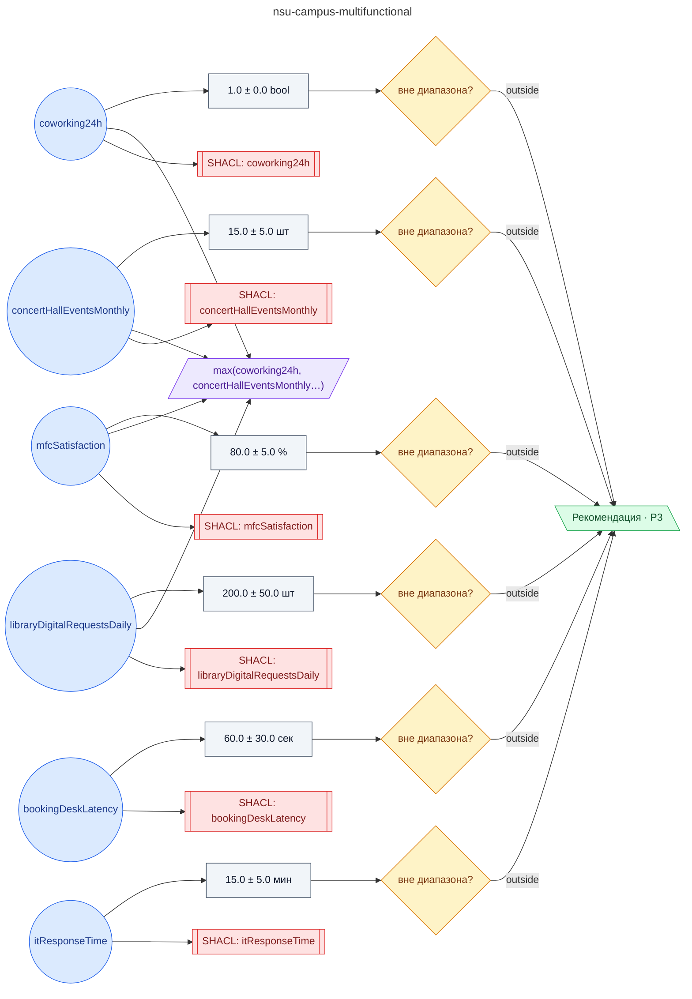

# Регламент многофункционального комплекса (МФК) кампуса НГУ

**source_id:** `nsu-campus-multifunctional`  
**Дата редакции регламента:** 2024-02-28  
**Домен:** Кампус НГУ (`nsu-campus`)

> Регламент МФК кампуса НГУ (разд.

## Граф регламента (Rule DSL Flow)

## Исходные файлы

- [nsu-campus-multifunctional.flow.json](../../../backend/data/fixtures/nsu-campus-multifunctional.flow.json) — визуальный граф регламента (Rule DSL).
- [nsu-campus-multifunctional.data.ttl](../../../backend/data/fixtures/nsu-campus-multifunctional.data.ttl) — Turtle: параметры и метаданные регламента.
- [nsu-campus-multifunctional.shapes.ttl](../../../backend/data/fixtures/nsu-campus-multifunctional.shapes.ttl) — SHACL-ограничения.

---

Эта страница сгенерирована автоматически из `*.flow.json` скриптом 
[`scripts/export_flows_to_mermaid.py`](../../../scripts/export_flows_to_mermaid.py). 
Регенерируется при изменении регламента. Возврат к индексу — [`../README.md`](../README.md).
