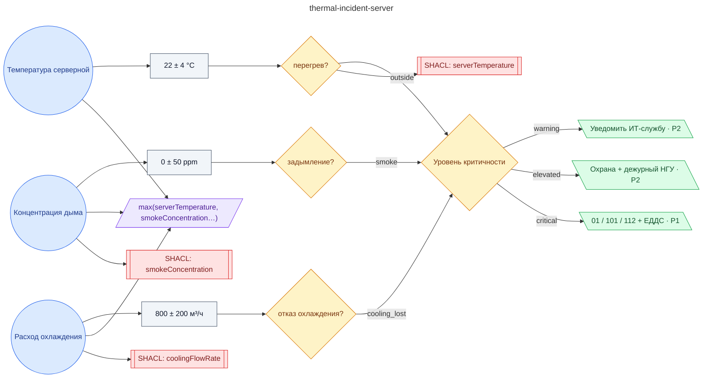

# Регламент при термическом инциденте в серверной НГУ (перегрев / задымление, эскалация в ЕДДС и 01/101/112)

**source_id:** `thermal-incident-server`  
**Дата редакции регламента:** 2024-03-26  
**Домен:** Безопасность кампуса (`safety`)

> При подтверждении перегрева или дыма в серверной: 1) Немедленно оповестить ИТ-службу НГУ и дежурного инженера.

## Граф регламента (Rule DSL Flow)

## Исходные файлы

- [thermal-incident-server.flow.json](../../../backend/data/fixtures/thermal-incident-server.flow.json) — визуальный граф регламента (Rule DSL).
- [thermal-incident-server.data.ttl](../../../backend/data/fixtures/thermal-incident-server.data.ttl) — Turtle: параметры и метаданные регламента.
- [thermal-incident-server.shapes.ttl](../../../backend/data/fixtures/thermal-incident-server.shapes.ttl) — SHACL-ограничения.

---

Эта страница сгенерирована автоматически из `*.flow.json` скриптом 
[`scripts/export_flows_to_mermaid.py`](../../../scripts/export_flows_to_mermaid.py). 
Регенерируется при изменении регламента. Возврат к индексу — [`../README.md`](../README.md).
