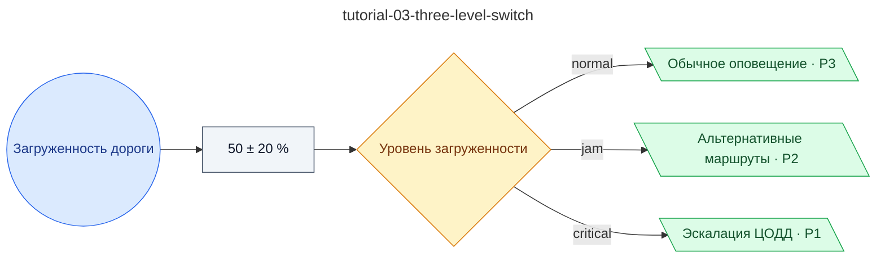

# Учебный 03: Развилка по уровням — загруженность дороги (нормально / затор / критическая пробка)

**source_id:** `tutorial-03-three-level-switch`  
**Дата редакции регламента:** 2026-05-28  
**Домен:** Учебный набор регламентов (`tutorial`)

> ТРЕТИЙ УЧЕБНЫЙ ШАГ.

## Граф регламента (Rule DSL Flow)

## Исходные файлы

- [tutorial-03-three-level-switch.flow.json](../../../backend/data/fixtures/tutorial-03-three-level-switch.flow.json) — визуальный граф регламента (Rule DSL).
- [tutorial-03-three-level-switch.data.ttl](../../../backend/data/fixtures/tutorial-03-three-level-switch.data.ttl) — Turtle: параметры и метаданные регламента.
- [tutorial-03-three-level-switch.shapes.ttl](../../../backend/data/fixtures/tutorial-03-three-level-switch.shapes.ttl) — SHACL-ограничения.

---

Эта страница сгенерирована автоматически из `*.flow.json` скриптом 
[`scripts/export_flows_to_mermaid.py`](../../../scripts/export_flows_to_mermaid.py). 
Регенерируется при изменении регламента. Возврат к индексу — [`../README.md`](../README.md).
