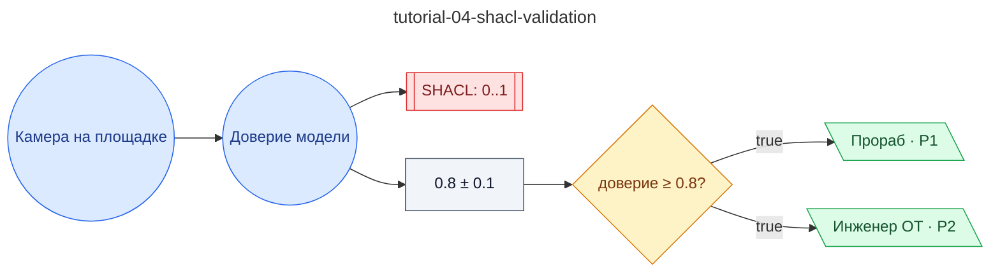

# Учебный 04: Видеоаналитика + SHACL — обнаружение работника без каски с проверкой доверия модели

**source_id:** `tutorial-04-shacl-validation`  
**Дата редакции регламента:** 2026-05-28  
**Домен:** Учебный набор регламентов (`tutorial`)

> ЧЕТВЁРТЫЙ УЧЕБНЫЙ ШАГ.

## Граф регламента (Rule DSL Flow)

## Исходные файлы

- [tutorial-04-shacl-validation.flow.json](../../../backend/data/fixtures/tutorial-04-shacl-validation.flow.json) — визуальный граф регламента (Rule DSL).
- [tutorial-04-shacl-validation.data.ttl](../../../backend/data/fixtures/tutorial-04-shacl-validation.data.ttl) — Turtle: параметры и метаданные регламента.
- [tutorial-04-shacl-validation.shapes.ttl](../../../backend/data/fixtures/tutorial-04-shacl-validation.shapes.ttl) — SHACL-ограничения.

---

Эта страница сгенерирована автоматически из `*.flow.json` скриптом 
[`scripts/export_flows_to_mermaid.py`](../../../scripts/export_flows_to_mermaid.py). 
Регенерируется при изменении регламента. Возврат к индексу — [`../README.md`](../README.md).
