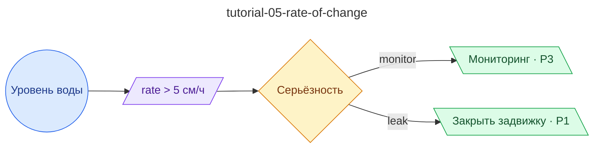

# Учебный 05: Скорость изменения — уровень воды в подвале растёт быстрее 5 см/час

**source_id:** `tutorial-05-rate-of-change`  
**Дата редакции регламента:** 2026-05-28  
**Домен:** Учебный набор регламентов (`tutorial`)

> ПЯТЫЙ УЧЕБНЫЙ ШАГ.

## Граф регламента (Rule DSL Flow)

## Исходные файлы

- [tutorial-05-rate-of-change.flow.json](../../../backend/data/fixtures/tutorial-05-rate-of-change.flow.json) — визуальный граф регламента (Rule DSL).
- [tutorial-05-rate-of-change.data.ttl](../../../backend/data/fixtures/tutorial-05-rate-of-change.data.ttl) — Turtle: параметры и метаданные регламента.
- [tutorial-05-rate-of-change.shapes.ttl](../../../backend/data/fixtures/tutorial-05-rate-of-change.shapes.ttl) — SHACL-ограничения.

---

Эта страница сгенерирована автоматически из `*.flow.json` скриптом 
[`scripts/export_flows_to_mermaid.py`](../../../scripts/export_flows_to_mermaid.py). 
Регенерируется при изменении регламента. Возврат к индексу — [`../README.md`](../README.md).
