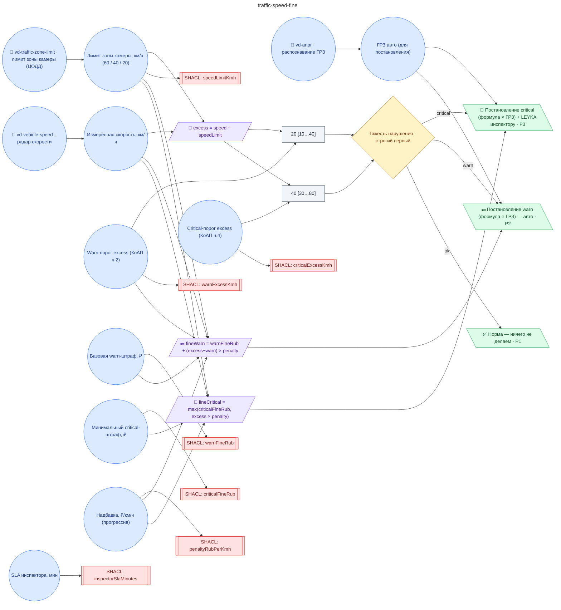

# Регламент автоматического штрафования за превышение скорости на ANPR-камерах ЦОДД (ст. 12.9 КоАП РФ, ступенчатая шкала 500₽/5000₽ с прогрессивной надбавкой, постановление через ГИБДД-API, LEYKA-задача инспектору)

**source_id:** `traffic-speed-fine`  
**Дата редакции регламента:** 2026-05-26  
**Домен:** Городской транспорт (`urban-transport`)

> Регламент запускается на каждое событие от двух физически независимых детекторов одной ANPR-камеры ЦОДД: vd-anpr (распознавание ГРЗ) + vd-vehicle-speed (радар/laser измеритель скорости), связанных общим track_id.

## Граф регламента (Rule DSL Flow)

## Исходные файлы

- [traffic-speed-fine.flow.json](../../../backend/data/fixtures/traffic-speed-fine.flow.json) — визуальный граф регламента (Rule DSL).
- [traffic-speed-fine.data.ttl](../../../backend/data/fixtures/traffic-speed-fine.data.ttl) — Turtle: параметры и метаданные регламента.
- [traffic-speed-fine.shapes.ttl](../../../backend/data/fixtures/traffic-speed-fine.shapes.ttl) — SHACL-ограничения.

---

Эта страница сгенерирована автоматически из `*.flow.json` скриптом 
[`scripts/export_flows_to_mermaid.py`](../../../scripts/export_flows_to_mermaid.py). 
Регенерируется при изменении регламента. Возврат к индексу — [`../README.md`](../README.md).
