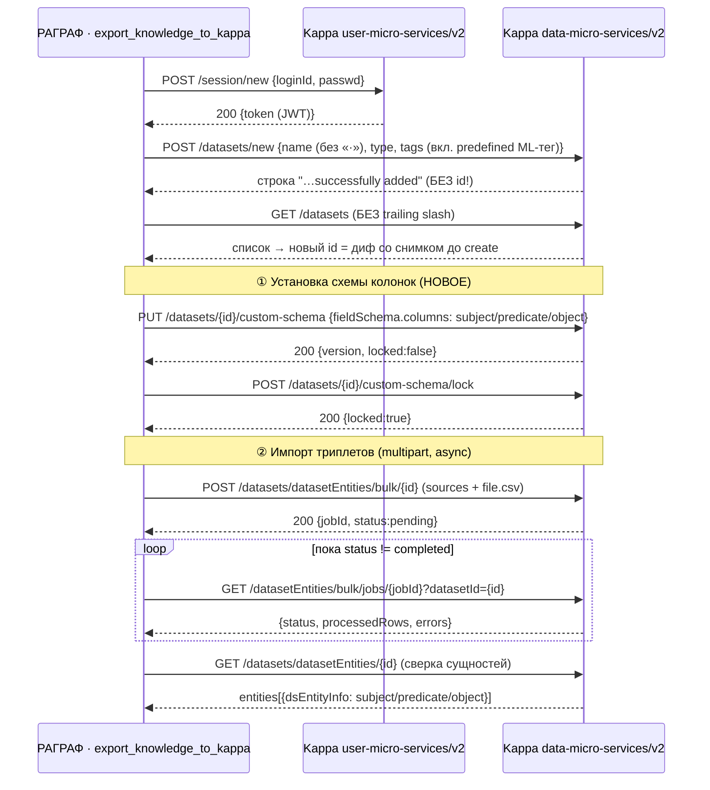

# Требование к интеграции RAGRAF ↔ Каппа (NSU Dataset Services)

**Адресат:** команда RAGRAF (для имплементации экспорта) + команда Каппы НГУ (для сверки контрактов).
**Автор:** RAGRAF.
**Статус:** v1.1 — добавлен §11 по итогам боевой отладки экспорта (раунд 2): резолв id, trailing-slash, валидация имени/тегов, нормализация CSV, удаление, авторство.
**Дата:** 2026-06-13.

> **Что такое REQ-документ.** `REQ-*` (от *requirement*) — внутренняя конвенция RAGRAF для
> кратких технических заданий/бриферов на интеграцию или фичу: фиксируем целевой контракт,
> что меняется, что делает наша сторона, открытые вопросы. Один файл = одна интеграция/фича.
> Соседи: [REQ-SIGMA-INTEGRATION.md](REQ-SIGMA-INTEGRATION.md), [REQ-STUDIA-STEPWISE-REASONING.md](REQ-STUDIA-STEPWISE-REASONING.md),
> [REQ-MED-FLOW-INTEGRATION.md](REQ-MED-FLOW-INTEGRATION.md) и др. Документ — живой: правится по мере созревания API.

> **Контекст.** Каппа — платформа датасетов/ML НГУ (`kappa.nsu.ru:8061`), куда RAGRAF выгружает
> граф знаний (триплеты `subject/predicate/object`) как табличный датасет. Ранее экспорт упирался
> в баг: bulk-импорт отвечал `422 "Schema is necessary"`, потому что схему колонок негде было
> задать программно (`POST /datasets/labels/{id}` ставил **аннотационные лейблы**, а не схему
> колонок — мы путали два понятия). Мы сформулировали запрос команде Каппы — и они реализовали
> **отдельную подсистему `custom-schema`** (даже шире запрошенного). Этот документ фиксирует, как
> теперь всё работает, по итогам **живого прогона 2026-06-13** учётной записью RAGRAF.

---

## 0. Коротко

| Шаг | Метод/эндпоинт | Сервис | Примечание |
|---|---|---|---|
| **Логин** | `POST /session/new` `{loginId, passwd, ipAddress?, deviceInfo?}` | user-micro-services/v2 | JWT в поле `token` (≈1.3 КБ). Поле пароля — **`passwd`**, не `password` |
| **Проверка** | `GET /users/me` (Bearer) | user-micro-services/v2 | — |
| **Создать датасет** | `POST /datasets/new` `{datasetName, datasetType(int), datasetShortInfo, datasetTags, datasetVerificationType?}` | data-micro-services/v2 | ⚠️ возвращает **строку** `"Dataset X successfully added"`, **БЕЗ id** — id резолвим через список (см. §11.1) |
| **Список датасетов** | `GET /datasets` (Bearer) | data-micro-services/v2 | ⚠️ **БЕЗ trailing slash** — со слэшем `/datasets/` отдаёт 307 на битый http-URL → пустой ответ (см. §11.2) |
| **① Задать схему** | `PUT /datasets/{id}/custom-schema` `{schemaKind:"tabular", fieldSchema, metadata?}` | data-micro-services/v2 | **НОВОЕ — решение проблемы** |
| **② Зафиксировать** | `POST /datasets/{id}/custom-schema/lock` | data-micro-services/v2 | `locked:true` |
| **③ Импорт** | `POST /datasets/datasetEntities/bulk/{id}` — **multipart** `sources`+`file` | data-micro-services/v2 | **асинхронный** → `{jobId}` |
| **④ Статус job** | `GET /datasets/datasetEntities/bulk/jobs/{jobId}?datasetId={id}` | data-micro-services/v2 | `status:"completed"`, `errors:[]` |

**Главное изменение:** схема колонок датасета теперь ставится отдельным контрактом
`custom-schema` (а не через labels), и **bulk стал multipart + асинхронный** (файл + дескриптор,
ответ — job-id). После установки и **lock** схемы `422 "Schema is necessary"` исчезает.

---

## 1. Доступ и аутентификация

- **База:** `https://kappa.nsu.ru:8061/user-micro-services/v2` (auth/users), `…/data-micro-services/v2` (datasets). TLS валиден (GlobalSign).
- **Логин:** `POST /session/new`, тело `NewSession`: `loginId*`, `passwd*`, `ipAddress?`, `deviceInfo?`.
  - Ответ 200: профиль + `token` (JWT) + `tokenExpiryDate`. Токен → заголовок `Authorization: Bearer <token>`.
  - ⚠️ Поле пароля называется **`passwd`** (не `password`). Наш `backend/app/api/kappa.py` (стр. ~129) **уже шлёт `passwd`** — вход на нашей стороне не сломан.
- **Проверка/refresh:** `GET /users/me`, `POST /session/refresh_token`, `DELETE /session` (logout).
- **Проверено вживую (2026-06-13):** логин 200, `GET /users/me` 200 (userId 33, Олег Барбашин, banksnab@mail.ru).

## 2. Что было сломано и что починили

**Было (баг):**
- `POST /datasets/datasetEntities/bulk/{id}` → `422 "Schema is necessary."` для всех гипотез формата `sources.dataset_schema`.
- `POST /datasets/labels/{id}` → SUCCESS, но `GET /datasets/fields/{id}` → `entityFieldsSchema: {}`. **Labels не материализуются в схему колонок** — это разные концепции (labels = метки разметки/аннотации; схема = колонки entity).

**Стало (фикс команды Каппы):** добавлена подсистема **`custom-schema`** — программная установка схемы колонок датасета, ровно как мы просили. `entityFieldsSchema` депрекейтнут (пустой); схема теперь живёт в `customSchema`.

## 3. Новая схема датасета — `custom-schema`

| Метод | Назначение | Тело / ответ |
|---|---|---|
| `PUT /datasets/{id}/custom-schema` | создать/обновить схему | `{schemaKind:"tabular"(def), fieldSchema*, metadata?}` → `{schemaKind, version, locked, fieldSchema, metadata}` |
| `POST /datasets/{id}/custom-schema/infer` | вывести схему из CSV | `{csvContent*, sampleRows?}` → `{fieldSchema, excludedColumns, sampledRows, warnings}` |
| `POST /datasets/{id}/custom-schema/columns` | добавить колонку | `{name*, type*, nullable?, default?}` |
| `POST /datasets/{id}/custom-schema/lock` | зафиксировать (без тела) | → `{…, locked:true}` |
| `POST /datasets/{id}/custom-schema/unlock-for-upgrade` | разблокировать для апгрейда | — |
| `GET /datasets/{id}/custom-schema` | текущая схема | `404 "Custom schema not found."` если не задана |
| `GET /datasets/fields/{id}` | поля датасета | теперь отдаёт `customSchema` (+ legacy `entityFieldsSchema:{}`) |

**Формат `fieldSchema`** (каноничный, подтверждён `infer`):
```json
{
  "columns": {
    "subject":   { "type": "str", "nullable": false },
    "predicate": { "type": "str", "nullable": false },
    "object":    { "type": "str", "nullable": false }
  }
}
```
Для нашего графа знаний — ровно 3 строковые колонки `subject / predicate / object`.

## 4. Bulk-импорт (контракт изменился)

`POST /datasets/datasetEntities/bulk/{id}` — теперь **`multipart/form-data`**, оба поля обязательны:
- `sources` — `BulkModel` (JSON-строка): `{uploadType, dataset_schema, source?, labelingAlgo?, bulkSplit?}`.
- `file` — бинарный файл данных (CSV: заголовок `subject,predicate,object` + строки).

Ответ 200 — **асинхронный**: `{ "message": "Data upload is in process.", "jobId": "<uuid>", "status": "pending" }`.
Статус: `GET /datasets/datasetEntities/bulk/jobs/{jobId}?datasetId={id}` → `{status: "completed", totalRows, processedRows, errors:[], filename, …}`.
Также: `GET …/bulk/jobs` (список), `DELETE …/bulk/jobs/{jobId}` (отмена), `DELETE …/bulk/jobs/stale`.

## 5. E2E-проверка (живой прогон, 2026-06-13, датасет 173)

1. `POST …/custom-schema/infer` с CSV `subject,predicate,object` → каноничный `fieldSchema` (3 × `str`).
2. `PUT …/custom-schema` → 200, `version:1`, `locked:false`.
3. `POST …/custom-schema/lock` → 200, `locked:true`.
4. `GET /datasets/fields/173` → `customSchema` **материализовалась** (была `null`).
5. `POST …/bulk/173` (multipart `sources`+`file` с 2 триплетами) → 200, `jobId`, **без 422**.
6. `GET …/bulk/jobs/{jobId}?datasetId=173` → `status:"completed"`, `2/2 строк`, `errors:[]`.
7. `GET …/datasetEntities/173` → 2 сущности; пример: `dsEntityInfo {subject:"Тепломагистраль", predicate:"имеет_свойство", object:"Диаметр"}`, статус **"Labeled"**.

**Вывод:** интеграционный баг устранён — полный путь «схема → lock → bulk → entities» работает.
(Счётчик «Количество записей: 0» в карточке датасета — это опубликованная/версионированная выборка; реальные сущности видны как «N записей готовы к проверке» в блоке верификации.)

## 6. Дельты для нашего кода — `backend/app/api/kappa.py`

Метод `export_knowledge_to_kappa` (и связанная логика) переписать под новый флоу:

1. **Схема:** убрать попытку через `POST /datasets/labels/{id}`; вместо неё
   `PUT /datasets/{id}/custom-schema` с `fieldSchema.columns = {subject,predicate,object: str}` → `POST …/custom-schema/lock`.
   *(Опция: предварительный `infer` по CSV-образцу, если колонки динамические.)*
2. **Bulk:** перейти на `multipart/form-data` (`sources` = BulkModel JSON + `file` = CSV-байты) вместо JSON-only; после ответа **опрашивать job** по `jobId` до `completed`.
3. **Проверка готовности:** читать `customSchema` из `GET /datasets/fields/{id}`, а не `entityFieldsSchema` (он теперь всегда `{}`).
4. **Логин:** без изменений — уже `passwd`.

## 7. Схема интеграции



## 8. Дополнительные возможности API (на будущее)

Команда Каппы заметно расширила data-сервис (83 эндпоинта). Потенциально полезно для RAGRAF:
- **Верификация:** self/expert/batch/auto-verify, конфиг и статистика верификации (`/datasets/verification/*`) — мог бы лечь под наш «аудитор/проверку триплетов».
- **Версии:** `/datasets/versions/*` — publish, archive, download-requests, refresh (версионирование экспортов графа знаний).
- **Шаринг:** `/datasets/{id}/shares`, публичные share-ссылки (`/shares/link/{code}`) — обмен датасетами между учениками/командами.
- **entitySchemaMappings:** маппинг стандартных ML-полей → пути в источнике (для labeling-алгоритмов).
- **training-feedback:** репорты по обучению + флаги сущностей.
- **infer:** авто-вывод схемы из CSV — можно использовать вместо ручного `fieldSchema`.

## 9. Открытые вопросы к команде Каппы

1. Нужен ли `dataset_schema` внутри `BulkModel`, если `custom-schema` уже задана и залочена? (в прогоне слали — прошло; вероятно избыточно.)
2. Допустимые значения `uploadType` в `BulkModel` (использовали `"csv"` — приняло) и `labelingAlgo` (сущность получила `"default"`).
3. Требуется ли определённое состояние датасета для `PUT custom-schema` / условия `unlock-for-upgrade` после lock.
4. Лимиты bulk (размер файла/строк, `CUSTOM_SCHEMA_*` константы из описания `infer`).

## 10. Feature request команде Каппы — порядок колонок (`fieldSchema` / `dsEntityInfo`)

**Проблема.** Порядок колонок, заданный в `PUT /datasets/{id}/custom-schema`, не сохраняется:
мы шлём `fieldSchema.columns` в порядке `subject, predicate, object`, а `GET /custom-schema`,
`GET /datasets/fields/{id}` и `dsEntityInfo` сущностей возвращают `object, subject, predicate`.

**Это НЕ алфавит** (алфавит дал бы `object, predicate, subject`). Порядок строго **по длине ключа**:
`object`(6) < `subject`(7) < `predicate`(9). Похоже, `fieldSchema` хранится в Postgres **JSONB**,
который пересортировывает ключи (сначала по длине, затем побайтово) и теряет порядок определения.

**Почему важно.** Для RDF-троек логичный порядок — `subject → predicate → object`; для табличных
датасетов порядок колонок семантически значим вообще. Сейчас пользователь видит entity как
`{object, subject, predicate}` — читается нелогично. Клиентский обход (нумерованные префиксы
`01_/02_/03_`) **не помогает**: length-first ставит самый короткий ключ первым; выравнивание длины — костыль.

**Просьба (любой из вариантов):**
1. Сохранять **порядок определения** колонок — хранить `columns` как упорядоченный список
   `[{name, type, nullable}, …]`, а не как JSON-объект; **или**
2. Добавить в определение колонки целочисленное `order`/`position` и сортировать по нему при отдаче
   (`GET custom-schema`, `GET fields`) и при сериализации `dsEntityInfo`; **или**
3. Не прогонять `fieldSchema` через JSONB (хранить как text / ordered map), чтобы порядок ключей сохранялся.

Главное — чтобы порядок из `PUT` отражался и в `GET`, и в `dsEntityInfo` сущностей.
**Репро:** tabular-датасет → `PUT custom-schema {columns: subject, predicate, object}` → `lock` →
bulk CSV → `GET datasetEntities/{id}` → `dsEntityInfo` в порядке `object/subject/predicate`.

### 10.1. Временный обход на нашей стороне (2026-09-02)

> **Решение временное и целиком зависит от того, как Каппа реализует схему.**
> Оно не исправляет причину, а подстраивается под текущее поведение их хранилища —
> сортировку ключей по длине имени. Это поведение нигде не задокументировано и не
> является частью их контракта, поэтому Каппа вправе изменить его в любой момент и
> без предупреждения. Обход рассчитан на период до выполнения запроса §10; как
> только порядок колонок станет управляемым, имя колонки возвращается к `object`.
> Ниже — что именно придётся сделать при каждом варианте развития (см. «Что делать
> при изменениях на стороне Каппы»).

**Статус запроса: не выполнен.** Проверка их OpenAPI (`GET /data-micro-services/v2/openapi.json`,
доступен без авторизации) показывает, что `PutCustomSchemaRequest.fieldSchema.columns` — по-прежнему
**словарь** «имя → `{type, nullable, default}`», а не упорядоченный список. Полей `order`/`position`
нет ни в одной модели; все вхождения `order` в спецификации относятся к сортировке и пагинации
**строк** (`orderBy`, `afterOrderValue`), не колонок. Задать порядок через API невозможно.

**Подтверждение length-first на четырёх колонках.** После правок на их стороне сущность выглядит так:

```json
{ "split": "train", "object": "Распределительные щиты", "subject": "Электрик", "predicate": "работает_с" }
```

`split`(5) → `object`(6) → `subject`(7) → `predicate`(9) — строго по возрастанию длины имени.
Случайное совпадение такого порядка — 1 из 24. `split` добавляет сама Каппа (train/test), он
короче всех и встаёт первым; на нас это не влияет.

**Что сделано.** Третья колонка переименована `object` → **`object_value`** (`KAPPA_OBJECT_COLUMN`
в `backend/app/api/kappa.py`). Длины подобраны так, чтобы сортировка по длине давала нужный порядок:

| Колонка | Длина | Позиция |
|---|---|---|
| `subject` | 7 | 1 |
| `predicate` | 9 | 2 |
| `object_value` | 12 | 3 |

Заголовок выгружаемого CSV собирается из ключей схемы, а не пишется литералом, — заголовок обязан
совпадать со схемой, иначе bulk падает с «CSV is missing required columns».

**Что делать при изменениях на стороне Каппы.** Решение привязано к их реализации, поэтому
заранее фиксируем реакцию на каждый вариант:

| Что сделает Каппа | Что произойдёт у нас | Что делать |
|---|---|---|
| Выполнит §10: упорядоченный список колонок либо поле `order`/`position` | Обход становится ненужным | Вернуть имя `object`, задавать порядок явно, удалить `KAPPA_OBJECT_COLUMN` |
| Сменит правило сортировки на алфавитное | Порядок станет `object_value, predicate, subject` — снова неверный | Обход не спасает: подобрать имена под алфавит либо ждать §10 |
| Сохранит порядок определения (уберёт пересортировку) | Порядок станет верным сам по себе | Вернуть имя `object` |
| Начнёт нормализовать или укорачивать имена колонок | Длины перестанут быть управляемыми | Обход неприменим, только §10 |
| Ничего не изменит | Порядок остаётся верным | Ничего; периодически перепроверять |

Отсюда практическое требование: **после каждого обновления Каппы сверять фактический порядок
полей в `dsEntityInfo`**, а не считать его гарантированным. Признак поломки — `object_value`
перестал быть последним.

**Ограничения обхода — важно.**

1. Это **подпорка под чужой дефект**, а не решение. Запрос из §10 остаётся в силе; когда Каппа
   починит порядок, имя нужно вернуть к `object`.
2. Схема датасета **лочится**, поэтому переименование действует только на **новых** датасетах.
   У ранее созданных остаётся старая схема, пока их не пересоздать или не разлочить через
   `POST /datasets/{id}/custom-schema/unlock-for-upgrade`.
3. Обход держится на недокументированном поведении их хранилища. Любая правка на их стороне —
   смена СУБД, переход на упорядоченный список, нормализация имён — сломает порядок снова, причём
   молча.

---

---

## 11. Боевая отладка экспорта — раунд 2 (2026-06-13)

После §5 экспорт «из кнопки» в проде всё равно падал. Длинная отладка прямыми
запросами к живому API учётной записью RAGRAF вскрыла **ещё пять подводных
камней** (часть — баги/ограничения Каппы, часть — наши). Зафиксировано здесь,
чтобы не наступить снова. Конвейер **перепроверен E2E** на реальном датасете
(см. §11.7).

### 11.1. `POST /datasets/new` возвращает СТРОКУ, не id
Ответ 200 — это JSON-**строка** `"Dataset <name> successfully added"`, **без числового id**
(в §0/§7 ранее было ошибочно «возвращает id»). Поэтому id нужно **доставать из списка**
датасетов после создания.
- Наша сторона: снимаем `set` id-датасетов **до** create → после create берём **новый**
  id (диф). Диф надёжен при любой перезаписи имени Каппой. Если нового id нет (повтор) —
  матч по нормализованному имени. Реализация: `_resolve_created_dataset_id` в `kappa.py`.

### 11.2. `GET /datasets/` (со слэшем) → 307 на битый URL — **корень «не вернула ID»**
`GET …/data-micro-services/v2/datasets/` отвечает **307 Redirect** на
`http://kappa.nsu.ru/data-micro-services/v2/datasets` (без порта `:8061`, http вместо https) →
404 dev-сервера. httpx (и любой клиент без слепого follow) получает пустой ответ → список
пуст → id не находится → UI «Каппа создала датасет, но не вернула ID».
- **Решение:** звать **`GET /datasets` БЕЗ trailing slash** → 200 со списком. Одна правка,
  но именно она чинила весь «no ID». (Эндпоинты с сегментом после id — `/datasets/{id}/…` —
  слэшем не страдают.)
- **Feature request Каппе:** починить редирект `/datasets/` → он должен вести на тот же
  хост/порт/https, а не на `http://…` без порта.

### 11.3. Имя датасета: «·» (U+00B7) ломает создание
Каппа отвергает в **названии** датасета типографскую пунктуацию — конкретно
middle-dot **«·» (U+00B7)**. Наш прежний дефолт `РАГРАФ · <slug>` падал именно из-за «·».
- Что **допустимо** в имени: буквы (в т.ч. **кириллица** — она для валидатора не отличается
  от латиницы), цифры, пробел, дефис, подчёркивание. Что **ломает**: «·» и подобная
  не-буквенная пунктуация/декоративные разделители.
- **Решение у нас:** дефолтное имя в окне экспорта = **чистый slug** датасета
  (`gumexpert`, `dialog-vocabulary`), без префикса `РАГРАФ ·`. Кириллица остаётся в
  *описании* и *данных* (там она работает).
- **Feature request Каппе:** в ошибке валидации имени возвращать причину/недопустимый символ
  (сейчас — generic `400 "Something went wrong. Please try again."`).

### 11.4. Теги: обязателен предустановленный ML-тег
Без хотя бы одного **предустановленного** ML-тега create падает:
`400 "Dataset tags must include at least one predefined ML tag."`.
- **Решение у нас:** в дефолтные теги первым добавлен **`general tabular`** (предустановленный
  тег для типа Tabular), есть подсказка в UI.

### 11.5. CSV: заголовок строго `subject,predicate,object` (+ без BOM)
Bulk мапит колонки на схему **по имени заголовка**. Наши seed-CSV неоднородны: часть с
`subject,predicate,object`, часть с русским `Кто/Что,Отношение,К чему/С чем`, местами с BOM.
Русский/нестандартный заголовок → `400 "CSV is missing required columns: object, predicate, subject"`.
- **Решение у нас:** перед bulk нормализуем CSV — срезаем BOM (utf-8-sig) и **перезаписываем
  строку заголовка** на `subject,predicate,object` (колонки троек всегда в порядке S/P/O);
  строки данных не трогаем, кириллица сохраняется. Реализация: `_normalize_triples_csv`.

### 11.6. Удаление датасета через API недоступно
`DELETE /datasets/{id}` → **405 Method Not Allowed**; со слэшем `/datasets/{id}/` → тот же
307 на битый URL. Программно удалить датасет нельзя — только через UI Каппы.
- **Feature request Каппе:** дать `DELETE /datasets/{id}` (или `…/archive`) для очистки
  тестовых/ошибочных датасетов из интеграции.

### 11.7. E2E раунд-2 — подтверждение на реальном датасете
Полный путь из кнопки «Выгрузить в Каппу» подтверждён вживую:
- create (чистое имя) → 200 (строка) → id резолвится диффом по списку (без слэша);
- `custom-schema` PUT + lock → `subject/predicate/object`, `locked:true`;
- bulk (нормализованный CSV) → async job → `status:"completed"`, `errors:[]`;
- **датасет `dialog-vocabulary` (id 190): 158 сущностей**, кириллица сохранена
  (`Аэропорт / остановка / Метро`), маппинг S/P/O верный.

### 11.8. Идентичность/авторство (побочно подтверждено)
`POST /session/new` и `GET /users/me` отдают полный профиль: `userId`, `firstName`,
`middleName`, `lastName`, `email`, `orgDetails.orgName`. RAGRAF использует Каппу как
**identity provider**: автор регламента берётся из этого профиля (верифицированно, через
токен → `/users/me`), а не из «придуманного» email. См. отдельную фичу авторства.

### 11.9. Сводка правок на нашей стороне (`backend/app/api/kappa.py`, фронт)
1. `GET /datasets` — **без trailing slash** (`_kappa_list_datasets`, `list_my_kappa_datasets`).
2. Резолв id через **диф по новому id** + идемпотентность на «already exists»
   (`_resolve_created_dataset_id`, окно опроса 12×1.5 с под лаг списка).
3. **`_normalize_triples_csv`** — заголовок → `subject,predicate,object` + срез BOM (в `export_…`).
4. Дефолт имени в окне = чистый slug (фронт `KappaExportModal`), без `РАГРАФ ·`.
5. Дефолтные теги с `general tabular`.
6. (внутренний баг) убран **дублированный декоратор** `@router.post(".../export")` — он
   привязывал роут к `_normalize_triples_csv(raw: bytes)` → FastAPI требовал query-параметр
   `raw` → `422` на каждый экспорт. Теперь роут один → `export_knowledge_to_kappa`.
7. `kappaFetch` — читаемое форматирование ошибок (422-список/объект Каппы вместо «[object Object]»).

### 11.10. Открытые feature-requests команде Каппы (раунд 2)
1. **Редирект `/datasets/`** → битый `http://…` без порта (§11.2) — починить на same-origin https.
2. **`POST /datasets/new`** → возвращать `datasetId` в ответе (сейчас только строка, §11.1).
3. **Валидация имени** → внятная ошибка с указанием недопустимого символа (§11.3).
4. **`DELETE /datasets/{id}`** → дать удаление через API (§11.6).
5. (из §10) порядок колонок `subject/predicate/object`.
