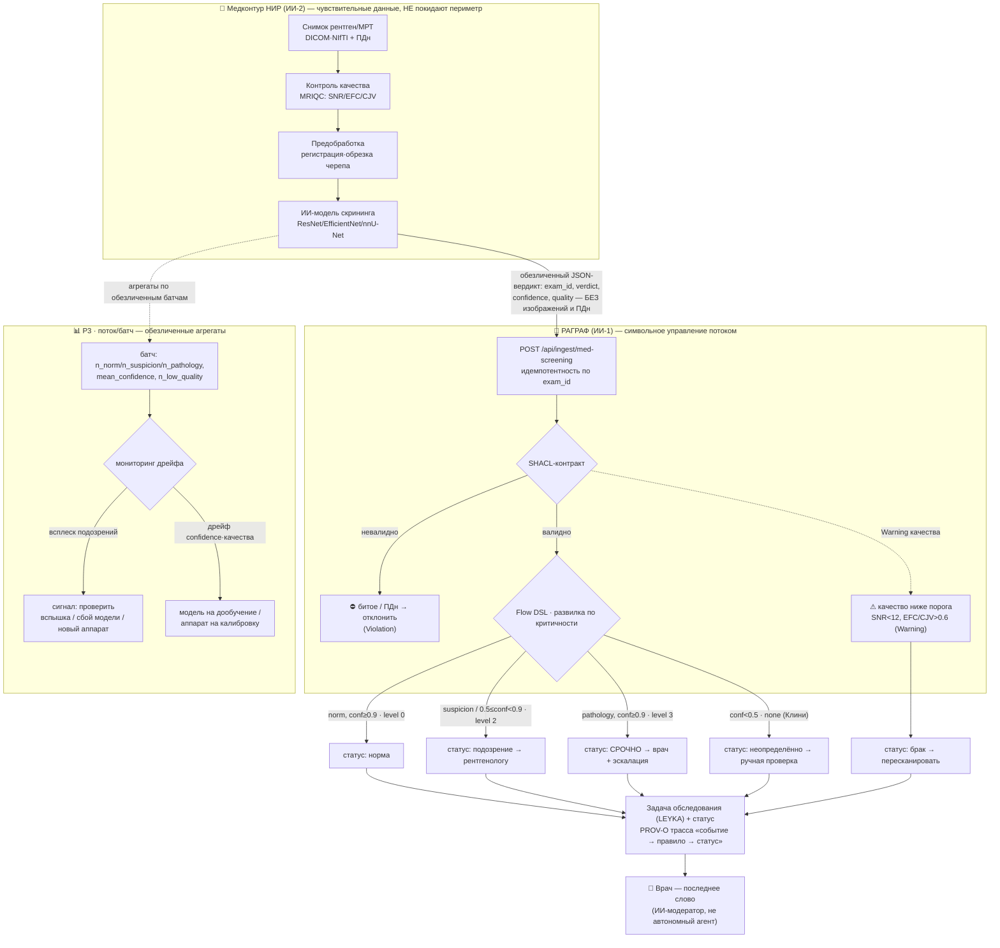

# РАГРАФ × медицинский скрининг: управление потоком обследований (без ПДн)

> Гипотеза интеграции НИР «ИИ-система дистанционной диагностики соцзначимых заболеваний»
> (ТБ на рентгене, метастазы на МРТ) с РАГРАФ. **Граница ответственности:** тяжёлый ИИ
> (изображения, сегментация, ПДн) живёт в медконтуре НИР; РАГРАФ — **символьный слой
> управления процессом**, видит только **обезличенный JSON-вердикт**. Дата: 2026-06-11. Статус:
> черновик-гипотеза (к обсуждению), не сбор требований.
>
> **Сверено с первичным ТЗ проекта** (НГУ, ЦИИ НГУ, 2024, «Компьютерное зрение для медицинских
> задач», грант Минэкономразвития № 70-2023-001318). Проект — **модуль городской СППР
> «Интеллектуальный цифровой двойник городского хозяйства»** (Умный город). ТЗ прямо требует
> **деперсонализации всех входных данных** и **распределения потока пациентов** — это не просто
> допускает, а *обосновывает* гипотезы ниже (см. «Якоря в первичном ТЗ»).

## 1. Суть проекта (как им пользуются)

НИР строит ИИ-сервис скрининга по медизображениям с тремя режимами: **клинический** (врач
получает маску/класс/отчёт), **обучения** (эксперты-разметчики + консенсус), **потоковый**
(непрерывный поток МРТ из клиник). Пайплайн: снимок → контроль качества (MRIQC: SNR/EFC/CJV)
→ предобработка → ИИ-разметка (классификация/сегментация + оценка уверенности) →
экспертная правка → диагностический отчёт. Уже есть БД с сущностями `Tasks`, `is_correct`,
метрики качества, `model verdict`, статусы — то есть **процесс уже мыслится как поток задач со
статусами**.

## 2. Где РАГРАФ, и почему без чувствительных данных

Медицинский ИИ — это «правое полушарие» (ИИ-2): распознаёт, но не управляет процессом и не
объясняет маршрут. РАГРАФ — «левое полушарие» (ИИ-1): берёт **итог** работы модели как
структурное событие и **по строгим правилам** решает, что делать дальше (куда направить, какой
приоритет, кого звать). РАГРАФ **никогда не видит изображение и ПДн** — только:

```json
{ "exam_id": "<псевдоним>", "modality": "xray|mri|us",
  "verdict": "norm|suspicion|pathology", "confidence": 0.0..1.0,
  "quality": { "snr": ..., "efc": ..., "cjv": ... },
  "consistent": true, "body_part_ok": true }
```

Это снимает 152-ФЗ-риск, позволяет работать на **пакетах обезличенных тестовых данных** и точно
ложится на готовый паттерн приёма событий РАГРАФ (`vd-anpr`, `ШУМ-ИИ`) и seed-модуль
`medical-imaging-diagnostics` (уже есть в Module Library). Финальное слово — за врачом
(ИИ-модератор, не автономный агент).

## 3. Регламенты-гипотезы (Flow DSL, без ПДн)

> Р1–Р3 выведены из сути НИР; **Р4–Р5 — прямо из первичного ТЗ** (две стратегические группы работ,
> стр. 7). См. «Якоря в первичном ТЗ» ниже.

**Р1 · ИИ-менеджер потока обследований (маршрутизация по критичности).** Главный кейс.
- Вход: `verdict`, `confidence`. Развилка по уровням → статус задаче обследования:
  - `norm` ∧ `confidence ≥ 0.9` → **«норма»**, низкий приоритет (0);
  - `suspicion` ∨ `0.5 ≤ confidence < 0.9` → **«подозрение → рентгенологу»**, приоритет 2;
  - `pathology` ∧ `confidence ≥ 0.9` → **«срочно к врачу»**, приоритет 3, эскалация;
  - `confidence < 0.5` → **«неопределённо → ручная проверка»** (трёхзначность Клини: `none`,
    а не ложная «норма»).
- Критерий решённости: каждое обследование получило финальный статус; подозрения закрыты врачом в SLA.
- Норматив: порядок профосмотров/диспансеризации (Приказ Минздрава). Данные: только вердикт+уверенность.

**Р2 · ИИ-аудитор качества снимка (брак / пересканирование).** Прямо на метриках MRIQC, которые
НИР уже считает.
- Вход: `snr`, `efc`, `cjv`, `consistent`, `body_part_ok`. Развилка:
  - метрики выше порога → пропустить в анализ;
  - `snr < порог` ∨ артефакты движения (`cjv/efc` выше порога) → **«брак → пересканировать»**, уведомить лаборанта;
  - `body_part_ok = false` (ждали мозг — пришла грудная клетка) → **«ошибка укладки/протокола»**.
- Критерий: доля снимков, ушедших в анализ с качеством выше порога. Бонус: дрейф по аппарату →
  подсказка инженеру, какой томограф чаще даёт брак (петля обратной связи). Данные: только числовые метрики.

**Р3 · Учёт результатов потока (агрегаты, эпид-мониторинг).** На пакетах обезличенных данных.
- Вход: агрегаты батча `{ n_total, n_norm, n_suspicion, n_pathology, mean_confidence, n_low_quality }`.
- Развилка: аномальный рост доли подозрений выше исторической нормы → **«всплеск — проверить»**
  (вспышка ТБ? сбой модели? новый аппарат?); дрейф `mean_confidence`/качества → **«модель на
  дообучение / аппарат на калибровку»**.
- Критерий: success-rate стабилен, всплески обработаны. Связь с СППР мэра/Минздрава —
  эпидемиологическая сводка по соцзначимым заболеваниям (только агрегаты, без ПДн).

**Р4 · Гейт допуска данных: деперсонализация, формат, целостность.** *(ТЗ-направление 1 —
цифровизация бизнес-процессов ЛПУ + приём и централизация датасетов в рамках ЭПР).* Регламент-привратник
**перед** Р1/Р2 — это SHACL-контракт C1, «поднятый» в полноправное правило процесса приёма.
- Вход: `has_pii`, `format_ok`, `checksum_ok`, `fields_complete`, `schema_version`, `epr_scope`
  (источник в контуре экспериментального правового режима). Развилка:
  - `has_pii = true` → **«обнаружены ПДн → карантин, не принимать»** (нарушение контракта деперсонализации);
  - `format_ok=false` ∨ `fields_complete=false` ∨ checksum-mismatch → **«битый/неполный пакет → вернуть отправителю»**;
  - `epr_scope=false` → **«источник вне ЭПР → отклонить»**;
  - всё ок → **«допустить + зарегистрировать в реестре датасетов»** (централизация, PROV-O: кто/когда/какой батч сдал).
- Критерий: ПДн-нарушений = 0; 100% принятых батчей валидны и зарегистрированы.
- Норматив: 152-ФЗ; ЭПР (цифровая песочница систем ИИ для городского хозяйства); п.1 «Контроль
  входной информации» + «Все данные деперсонализированы» из ТЗ. Данные: только булевы флаги контроля — без контента.

**Р5 · Планировщик обслуживания, профосмотров и диспансеризации (диспетчер потока).**
*(ТЗ-направление 2 — планирование медобслуживания, профосмотров и диспансеризации).* Отличается от
Р1: Р1 маршрутизирует по **критичности результата**, Р5 — по **загрузке ресурса и календарю**.
- Вход (обезличенные операционные счётчики + когортные признаки, без ПДн): `queue_len` (очередь
  дочтения), `scanner_util` (загрузка аппарата), `free_staff` (свободные рентгенологи), `cohort_id`
  (возрастная/профессиональная группа риска, напр. строители), `cohort_due` (когорта подошла к сроку
  осмотра), `recent_norm_exam`. Развилка:
  - перегруз (`scanner_util`→100% ∧ `queue_len`>порога) + есть свободный пункт → **«перенаправить поток / открыть доп. слот»**;
  - `cohort_due = true` → **«сформировать план приглашений на профосмотр/диспансеризацию»** (по когорте, не по лицам);
  - `recent_norm_exam = true` для планового → **«исключить избыточное обследование»** (экономия, прямая цель ТЗ);
  - норма → плановый порядок.
- Критерий: загрузка персонала/аппаратов в целевом коридоре; охват диспансеризации по плану; время до
  дочтения срочных в SLA; доля избыточных обследований снижается (цель ТЗ — «до 10 раз» по времени).
- Норматив: порядок профосмотров/диспансеризации (Приказ Минздрава); внутренние SLA загрузки. Связь:
  СППР городского цифрового двойника + распределение задач LEYKA-WBS.

**Р6 (опционально) · Динамическое диспансерное наблюдение / группа здоровья.** ТЗ требует
«скрининговое наблюдение в динамике… ретроспективный анализ» и «определение группы диспансерного
наблюдения». По серии обезличенных вердиктов одного псевдо-ID во времени → присвоить группу
наблюдения и срок следующего осмотра (ложится на «динамическую картину» Пальчунова, ось t).
⚠ Граница: продольная серия по одному псевдо-ID чувствительнее разовых событий — брать только при
явном решении по приватности; по умолчанию ограничиться **когортной** динамикой (это уже покрывает Р3).

### Якоря в первичном ТЗ (2024)

Регламенты — не «выдумка»: это **собственные цели ТЗ**, выраженные на Flow DSL. Две стратегические
группы работ из ТЗ (стр. 7) дают прямые якоря:

> 1. «…цифровизация бизнес-процессов лечебных учреждений, централизация и облегчение обработки
>    датасетов и обучение моделей… в рамках **экспериментального правового режима** пилотной зоны
>    систем ИИ для городского хозяйства» → **Р4**.
> 2. «…планирование медицинского обслуживания, профосмотров и диспансеризации» → **Р5** (и Р6).

| Регламент | Требование первичного ТЗ (НГУ, ЦИИ НГУ, 2024) |
|---|---|
| **Р1** ИИ-менеджер потока | «интеллектуальная маршрутизация пациентов»; скрининг = «быстрая сортировка… на тех, кто не страдает… и тех, кто предположительно имеет заболевание и/или факторы риска» (Прил. 2) |
| **Р2** Аудитор качества | «Контроль входной информации: проверка корректности формата, состава и целостности»; «очистка от ошибок, шумов»; «нахождение области низкой достоверности результатов» |
| **Р3** Учёт потока (агрегаты) | «поиск аномалий… в данных»; «скрининговое наблюдение в динамике… ретроспективный анализ»; «мониторинг социально значимых заболеваний у жителей города» |
| **Р4** Гейт допуска данных | «Все данные должны быть деперсонализированы»; «базовые методы для проверки на наличие персональных данных»; цифровизация ЛПУ + централизация датасетов в рамках ЭПР (группа 1) |
| **Р5** Планировщик/диспетчер | «более равномерного распределения потока пациентов… оптимальной загрузки медперсонала и оборудования»; «исключения избыточных обследований»; планирование профосмотров и диспансеризации (группа 2) |

Существенно: ТЗ ставит проект в состав **городской СППР «Интеллектуальный цифровой двойник
городского хозяйства»** (грант Минэкономразвития № 70-2023-001318) — поэтому Р3/Р5 напрямую
стыкуются с роадмапом «СППР для мэра», а РАГРАФ выступает её процессно-регламентным слоем.

## 4. Точки интеграции с РАГРАФ

- **Приёмник событий** — `POST /api/ingest/med-screening` по образцу `ingest/anpr` и `ingest/noise`
  (идемпотентность по `exam_id`, защита `X-Ingest-Token`). Медицинский сервис пушит обезличенный вердикт.
- **Исполнение** — `flow_executor` гоняет Р1–Р3, возвращает `{level, recommendation, trace}`.
- **Статус в задачу** — вердикт прокидывается статусом в задачу обследования через **двустороннюю
  LEYKA-интеграцию** (уже есть): «норма/подозрение/срочно» → нужному исполнителю, deep-link обратно.
- **Батч-режим** — пакет обезличенных тестовых данных → прогон через регламент → агрегаты + аудит
  (соответствует «потоковому» режиму НИР и работе на тестовых наборах).
- **Объяснимость** — PROV-O трасса «событие → правило → статус» к пункту норматива: критично для
  доверенного ИИ в медицине (ГОСТ Р 59276/59898).

### Схема интеграции



## 5. Что РАГРАФ НЕ берёт (остаётся в медконтуре НИР)

Изображения, DICOM/NIfTI, сегментация/маски, веса моделей, ПДн пациента, экспертная разметка,
консенсус. РАГРАФ работает **строго за обезличенным JSON-контрактом события** — это и есть способ
получить пользу от управления процессом, не касаясь чувствительных данных.

## 6. Вывод

Пять регламентов покрывают весь жизненный путь обследования без касания чувствительных данных:
**Р4** (гейт допуска и деперсонализации) → **Р2** (качество снимка) → **Р1** (маршрутизация по
критичности) → **Р5** (загрузка/планирование) → **Р3** (учёт и эпид-мониторинг по агрегатам).

Самый сильный и быстрый старт — **Р1 + Р2**: оба питаются данными, которые медицинский ИИ уже
производит (вердикт, уверенность, MRIQC-метрики). **Р4 и Р5 — не «довесок», а прямые требования
первичного ТЗ** (деперсонализация + входной контроль; распределение потока пациентов и планирование
профосмотров/диспансеризации), поэтому особенно убедительны для руководства ЦИИ НГУ. Всё это
превращает медицинский скрининг из «модели, выдающей маску» в **управляемый процесс реагирования** с
приоритетами, маршрутизацией, планированием и аудитом — ровно ниша РАГРАФ, и ровно процессно-
регламентный слой городской СППР, в состав которой ТЗ и ставит этот проект. Связано:
ARC-STUDIA-ANALITIKA.md, REQ-PUSH-NOISE-SEISMIC.md (паттерн приёма), SPEC-FLOW-DSL.md (язык регламентов).

---

## Приложение: контракт события (JSON + примеры + SHACL-пороги)

### A. JSON-контракт одиночного события

```json
{
  "exam_id":    "EXM-XR-2026-004210",      // псевдоним, НЕ ПДн
  "ts":         "2026-06-11T08:30:00Z",
  "modality":   "xray|mri|us|ct",
  "study_type": "chest_tb_screening|brain_mets_mri|...",
  "source_id":  "scanner-nii-tb-02",        // обезличенный ид аппарата (для дрейфа Р3)
  "ai": {
    "model_id": "tb-resnet50", "model_version": "1.3.0",
    "verdict":  "norm|suspicion|pathology",
    "confidence": 0.0,                       // 0..1
    "lesion_count": 0                         // опц.: число очагов (агрегат, без локализации)
  },
  "quality": {                               // набор зависит от модальности
    "snr": 0.0, "efc": 0.0, "cjv": 0.0, "wm2max": 0.0,   // МРТ (MRIQC)
    "sharpness": 0.0, "projection": "PA",                // рентген
    "consistent": true, "body_part_ok": true
  }
}
```
Батч/поток (Р3) — конверт `{ "batch_id", "modality", "events": [ ... ] }` ИЛИ агрегат
`{ "batch_id", "modality", "n_total", "n_norm", "n_suspicion", "n_pathology", "mean_confidence", "n_low_quality" }`.

### B. Три примера по вердиктам

**B1 · Норма** (рентген, ТБ-скрининг) → level 0, статус «норма», низкий приоритет.
```json
{ "exam_id": "EXM-XR-2026-004210", "ts": "2026-06-11T08:30:00Z", "modality": "xray",
  "study_type": "chest_tb_screening", "source_id": "scanner-nii-tb-02",
  "ai": { "model_id": "tb-resnet50", "model_version": "1.3.0", "verdict": "norm", "confidence": 0.96 },
  "quality": { "snr": 24.1, "sharpness": 0.81, "projection": "PA", "consistent": true, "body_part_ok": true } }
```

**B2 · Подозрение** (рентген, ТБ-скрининг) → level 2, статус «подозрение → рентгенологу».
```json
{ "exam_id": "EXM-XR-2026-004211", "ts": "2026-06-11T08:31:00Z", "modality": "xray",
  "study_type": "chest_tb_screening", "source_id": "scanner-nii-tb-02",
  "ai": { "model_id": "tb-efficientnet-b7", "model_version": "1.3.0", "verdict": "suspicion", "confidence": 0.71 },
  "quality": { "snr": 19.7, "sharpness": 0.66, "projection": "PA", "consistent": true, "body_part_ok": true } }
```

**B3 · Патология** (МРТ, метастазы) → level 3, статус «срочно к врачу», эскалация.
```json
{ "exam_id": "EXM-MR-2026-000877", "ts": "2026-06-11T09:05:00Z", "modality": "mri",
  "study_type": "brain_mets_mri", "source_id": "scanner-fnc-3t-philips-01",
  "ai": { "model_id": "nnunet-tverskybce", "model_version": "2.1.0", "verdict": "pathology", "confidence": 0.93, "lesion_count": 3 },
  "quality": { "snr": 21.3, "efc": 0.41, "cjv": 0.38, "wm2max": 2.4, "sequence": "T1C", "consistent": true, "body_part_ok": true } }
```

> *Вариант для Р2 (демонстрация порога качества):* то же подозрение, но `"snr": 8.5, "cjv": 0.74`
> → SHACL-Warning срабатывает → статус «брак → пересканировать», в анализ не уходит.

### C. SHACL: валидность (жёстко) + пороги (как флаги)

Принцип: структурная **валидность** — `sh:Violation` (битое событие отклоняется); **пороги
качества и уверенности** — `sh:Warning`/`sh:Info` (событие валидно, но помечается и
маршрутизируется, а не отбраковывается как «битое»). Многоуровневая маршрутизация по уровням —
развилка Flow DSL по этим же параметрам.

```turtle
@prefix sh:  <http://www.w3.org/ns/shacl#> .
@prefix xsd: <http://www.w3.org/2001/XMLSchema#> .
@prefix med: <https://ragraf.local/med#> .

# C1 — контракт валидности (Violation): типы, перечисления, диапазоны, ЗАПРЕТ ПДн
med:ScreeningEventShape a sh:NodeShape ;
  sh:targetClass med:ScreeningEvent ;
  sh:property [ sh:path med:examId ; sh:datatype xsd:string ; sh:minCount 1 ; sh:maxCount 1 ;
                sh:pattern "^[A-Za-z0-9_-]{4,64}$" ;
                sh:message "exam_id обязателен; псевдоним, без ПДн" ] ;
  sh:property [ sh:path med:modality ;   sh:in ( "xray" "mri" "us" "ct" ) ; sh:minCount 1 ] ;
  sh:property [ sh:path med:verdict ;    sh:in ( "norm" "suspicion" "pathology" ) ; sh:minCount 1 ] ;
  sh:property [ sh:path med:confidence ; sh:datatype xsd:decimal ;
                sh:minInclusive 0.0 ; sh:maxInclusive 1.0 ; sh:minCount 1 ] ;
  sh:property [ sh:path med:patientName ; sh:maxCount 0 ; sh:message "ПДн запрещены в событии" ] ;
  sh:property [ sh:path med:birthDate ;   sh:maxCount 0 ; sh:message "ПДн запрещены в событии" ] .

# C2 — пороги качества (Warning → Р2 «брак → пересканировать»)
med:QualityGateShape a sh:NodeShape ;
  sh:targetClass med:ScreeningEvent ;
  sh:property [ sh:path ( med:quality med:snr ) ; sh:minInclusive 12.0 ; sh:severity sh:Warning ;
                sh:message "SNR < 12 → брак, рекомендовать пересканирование" ] ;
  sh:property [ sh:path ( med:quality med:efc ) ; sh:maxInclusive 0.60 ; sh:severity sh:Warning ;
                sh:message "EFC > 0.60: артефакты движения → брак" ] ;
  sh:property [ sh:path ( med:quality med:cjv ) ; sh:maxInclusive 0.60 ; sh:severity sh:Warning ;
                sh:message "CJV > 0.60: артефакты движения → брак" ] ;
  sh:property [ sh:path ( med:quality med:bodyPartOk ) ; sh:hasValue true ; sh:severity sh:Warning ;
                sh:message "Часть тела не по протоколу → ошибка укладки" ] ;
  sh:property [ sh:path ( med:quality med:consistent ) ; sh:hasValue true ; sh:severity sh:Warning ;
                sh:message "Изображение неконсистентно" ] .

# C3 — порог уверенности (Info → Р1 «неопределённо → ручная проверка», трёхзначность Клини)
med:ConfidenceShape a sh:NodeShape ;
  sh:targetClass med:ScreeningEvent ;
  sh:property [ sh:path med:confidence ; sh:minInclusive 0.5 ; sh:severity sh:Info ;
                sh:message "confidence < 0.5 → неопределённо (none): ручная проверка" ] .
```

### D. Пороги маршрутизации (развилка Flow DSL, Р1)

Многоуровневая классификация (не pass/fail) — `switch` по тем же параметрам:

| verdict | confidence | level | статус / действие |
|---|---|---|---|
| norm | ≥ 0.9 | 0 | норма (низкий приоритет) |
| suspicion, либо любой при 0.5 ≤ conf < 0.9 | — | 2 | подозрение → рентгенологу |
| pathology | ≥ 0.9 | 3 | срочно → врач + эскалация |
| любой | < 0.5 | none | неопределённо → ручная проверка |

Пороги (`0.5`, `0.9`, `snr 12`, `efc/cjv 0.60`) — параметры регламента; их границы и есть SHACL
выше (деривируются из параметров, см. SPEC-FLOW-DSL.md §7). Их легко править без кода — это и есть
«живой» регламент.
