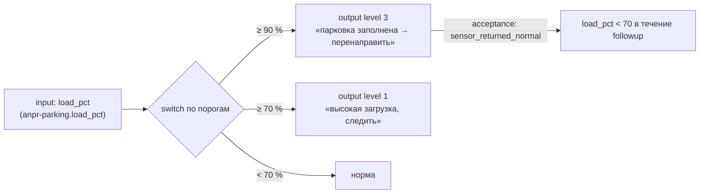

# PUSH-интеграция «видеодетектор → РАГРАФ»: парковка ВКИ НГУ (образец)

> **Эталонный пример сквозной интеграции PUSH-источника** в РАГРАФ: приём событий
> по HTTP, хранение в DuckDB, идемпотентность, контроль живости, аналитика и
> приватность ПДн. На этом кейсе можно подключать любой push-источник
> (видеоаналитика, IoT-шлюз, СКУД). Контракт для интегратора —
> [`INTEGRATION-ANPR-PUSH.md`](INTEGRATION-ANPR-PUSH.md). Архитектура pull/push —
> [`ARCHITECTURE.md` §3.6](ARCHITECTURE.md); НИР — [`OTCHET-NIR-RAGRAF-2026.md` §5.12](OTCHET-NIR-RAGRAF-2026.md).

**Статус:** этап 1 (приём + аналитика на правилах) — **в проде**. Этап 2
(регламент-аудитор на Flow DSL + LLM) — **в плане** (§7).

---

## 1. Контекст и задача

Видеодетектор на шлагбауме парковки Высшего колледжа информатики НГУ распознаёт
ТС (номер, марка/модель, категория, направление, пересечение линии) и **сам шлёт**
нам пачку последних записей раз в ~10 секунд. Нужно: принять данные, копить,
показывать заполняемость и со временем — стать **аудитором парковки** (выявлять
проблемы и паттерны).

## 2. Два паттерна приёма событий

| | **PULL** (тянем сами) | **PUSH** (шлют нам) |
|---|---|---|
| Инициатор | `etl_scheduler`, цикл 30 c | внешняя система, HTTP POST |
| Источники | Open-Meteo, Yandex, LEYKA, Plan-R, Clock | видеодетектор ANPR (этот кейс) |
| Точка входа | `puller.pull_*()` | `POST /api/ingest/anpr` |
| Хранилище | `etl_snapshots` | `anpr_events` |

Оба паттерна пишут в **`live_etl.duckdb`** (отдельно от authoritative
`regulations.duckdb`): один процесс, один `RLock`, WAL, CHECKPOINT на остановке.

## 3. Что реализовано (этап 1, в проде)

### 3.1. Эндпоинты ([api/ingest.py](../backend/app/api/ingest.py))

| Метод | Эндпоинт | Назначение | Доступ |
|---|---|---|---|
| POST | `/api/ingest/anpr` | приём событий (массив ≤2000, конверт `{events}`, одиночный) | `X-Ingest-Token` |
| DELETE | `/api/ingest/anpr` | сброс ВСЕХ событий | токен |
| DELETE | `/api/ingest/anpr/mocks` | удалить **только** тестовые моки (реальные не трогать) | токен |
| GET | `/api/ingest/anpr/health` | светофор приёма: `last_push_at`, heartbeat, счётчики | открыто |
| GET | `/api/ingest/anpr/occupancy` | заполняемость: занято/свободно/загрузка/въезды | открыто |
| GET | `/api/ingest/anpr/by-category` | гистограмма по категориям ТС за период | открыто |
| GET | `/api/ingest/anpr/stats` | агрегаты заполняемости | открыто |
| GET | `/api/ingest/anpr/report` | журнал по номерам за период; **ГРЗ маскируются без админа** | открыто (PII под админом) |
| GET | `/api/ingest/anpr/recent` | сырые последние события (с ГРЗ) | админ |

### 3.2. Ключевые решения

- **Та же DuckDB-связь, что и ETL.** Таблица `anpr_events` живёт в `live_data_store`
  (один `_conn`, один `RLock`). Второй `duckdb.connect()` к файлу ломал бы WAL-flush
  (в проекте уже была эта боль) — поэтому без нового стора/соединения.
- **Идемпотентность.** `event_id = sha1(camera|plate|timestamp_ms)`, PRIMARY KEY.
  Детектор шлёт перекрывающиеся окна и держит `line=true`, пока ТС в кадре → одна
  запись приходит много раз; повтор гасится (счётчик `duplicates` в ответе — штатный).
  Проверка существования и вставка — под одним `_LOCK`.
- **Heartbeat-светофор.** На каждый POST пишется `record_health("anpr-push")` →
  `last_push_at`. Светофор красится по **живости соединения** (🟢 < 90 c · 🟡 < 10 мин
  · 🔴 остановлен), а не по новизне событий: редкие новые машины — норма, тишина
  канала — проблема.
- **Сырьё целиком, с лимитом.** Полный JSON в `raw_payload` (лимит 8 КБ, защита от
  раздувания), ключевые поля — в колонки.
- **Приватность (152-ФЗ).** `/report` открыт всем, но ГРЗ **маскируются `•••`** для
  не-админов (`is_admin` soft-check); агрегаты/категории/заполняемость — открыты;
  сырой `/recent` — только админ.
- **Категория ТС.** Канонический справочник — **категория** (1=UNDEFINED … 12=CIVIL),
  решение 2026-06-05.

### 3.3. UI — единое сводное табло

На странице **«Ситуационный центр»** (бывш. Live ETL) — одна карточка
**«Парковка ВКИ · сводное табло»** ([LiveDashboardScreen.tsx](../frontend/src/components/live/LiveDashboardScreen.tsx)):
светофор приёма → 5 чипов заполняемости (На парковке / Свободно / Всего мест **12** /
Загрузка % / Въездов сегодня) → журнал по номерам (тумблер Сегодня/Вчера/Неделя,
номера маскируются без админа) → гистограмма категорий ТС за месяц.

## 4. Хватит ли одного контейнера? — ДА, с запасом

| Сценарий | Записей/сутки | Строк/год | Объём/год (~300 Б) |
|---|---|---|---|
| Реалистичный (≈500 въездов, ~10 кадров) | ~5 000 | ~1.8 млн | ~0.5 ГБ |
| Пессимистичный (1 запись/сек) | ~86 400 | ~31 млн | ~9 ГБ |

Запись (1 POST/10 c, один writer под `RLock`) — пренебрежимая нагрузка; чтение —
DuckDB колоночный, агрегаты по млн строк за миллисекунды. Контейнер 2 CPU / 4 ГБ +
Railway Volume справляется с запасом. Ограничения — только на городском масштабе
(сотни камер) → уровень Σ СИГМА.

## 5. Хранилище

`live_etl.duckdb` → `anpr_events`:
```
event_id PK, ts, received_at, camera_name, number_plate, color, brand, model,
direction, vehicle_type_id, confidence, crossed_line, region, raw_payload
```
индексы: `(ts)`, `(camera_name, ts)`, `(number_plate, ts)`. Это **сырой журнал** —
источник правды; производные метрики считаются поверх него.

## 6. Аналитика СЕЙЧАС — на правилах, без регламента

> Важно: на этапе 1 вся «ИИ-аналитика» — это **детерминированные SQL-правила**
> прямо в `live_data_store`, **без Flow-регламента и без LLM**. Это сознательно:
> сначала надёжный фундамент данных и метрик, затем — регламент-аудитор поверх.

Что считается на правилах:

- **Заполняемость** (`anpr_occupancy`): «внутри» = ТС, у которого последнее за
  24 ч событие — въезд (`direction=1`) без последующего выезда. Свободно =
  `capacity − занято` (capacity = 12). Загрузка = занято / capacity.
- **Въезды/выезды за день** — distinct-номера по направлению в границах локальных суток.
- **Категории** (`anpr_category_breakdown`): число уникальных ТС по категории за 30 дн.
- **Живость канала** (`anpr_health`): heartbeat по `last_push_at`.

Чего **ещё нет** (и почему нужен регламент, §7): сопоставление въезд↔выезд по ГРЗ
для точного времени стоянки; обнаружение «зомби-ТС» (въехал, не выехал > N ч);
всплесков; въездов в нерабочее время; авто-задачи в LEYKA по порогам; нарратив/LLM.

## 7. ПЛАН (этап 2): регламент-аудитор парковки на Flow DSL

Идея — **не писать отдельный аналитический код**, а переиспользовать существующий
движок регламентов (`flow_executor` + `acceptance_criterion` + LEYKA + метрики),
как для pull-источников. Тогда правила парковки редактирует методолог визуально в
Flow Editor, а не разработчик в Python.

### 7.1. Мост: derived-метрики → `etl_snapshots`

Завести периодический шаг (в `applier`/scheduler), который из `anpr_events`
вычисляет производные метрики и публикует их как обычные snapshots подтипа
**`anpr-parking`** (region = `nsu-vki`):

| field | смысл |
|---|---|
| `load_pct` | загрузка парковки, % |
| `occupied` / `free` | занято / свободно мест |
| `entries_1h` / `exits_1h` | поток за час |
| `zombie_count` | ТС с въездом без выезда > 12 ч |
| `unrecognized_ratio` | доля нераспознанных (качество камеры) |
| `rare_category_1h` | въезды редких категорий (скорая/полиция/спец) за час |

После этого `anpr-parking` — равноправный источник для регламентов (как
`om-weather-current`), и push окончательно встаёт в один ряд с pull.

### 7.2. Регламент `parking-occupancy-audit` (аудит заполняемости)



- **Узлы Flow DSL:** `input` (load_pct) → `switch` (пороги 70/90) → `output`
  (рекомендация / `action=leyka_create_task`).
- **Критерий решенности:** `sensor_returned_normal` (load_pct вернулся < 70) или
  `task_closed_within_sla` (диспетчер отработал).

### 7.3. Регламент `parking-anomaly-patterns` (паттерны)

Один регламент с несколькими ветками `switch` (или набор атомарных регламентов):

| Паттерн | Вход | Условие | Выход |
|---|---|---|---|
| «Зомби-ТС» | `zombie_count` | `> 0` | проверить брошенное/эвакуацию |
| Всплеск въездов | `entries_1h` | `> baseline × 2` (formula) | мероприятие/нагрузка |
| Въезд в нерабочее время | `entries_1h` + `clock-context.hour` | вход ночью (compare hour∈[0..6]) | сигнал охране |
| Редкая категория | `rare_category_1h` | `> 0` (скорая/полиция/спец) | лог особого ТС |
| Деградация камеры | `unrecognized_ratio` | `> 0.3` | проверить детектор |

Это демонстрирует **кросс-источник**: push-метрики парковки + pull-источник
`clock-context` в одном flow (ночной въезд). Логику порогов и baseline методолог
правит в редакторе, без кода.

### 7.4. LLM-нарратив (поверх правил, опционально)

Периодический обзор локальной LLM (`llm_model`/`llm_provider`) по образцу
`sandbox`-чата: «занятость аномальна для вторника», «всплеск въездов в 14:00»,
текстовая рекомендация. Запуск по расписанию, не на каждое событие.

### 7.5. Что нужно реализовать для этапа 2 (чек-лист)

- [ ] derived-агрегатор `anpr_events → etl_snapshots(anpr-parking)` (шаг в applier);
- [ ] сопоставление въезд↔выезд по ГРЗ (точное время стоянки, `zombie_count`);
- [ ] fixtures-регламенты `parking-occupancy-audit`, `parking-anomaly-patterns` (Turtle + flow.json);
- [ ] регистрация `anpr-vki` в `etl_sources` kind=`push` (единый health/UI);
- [ ] `cleanup_old_anpr_events(keep_days)` (ретеншн сырья);
- [ ] (опц.) LLM-обзор по расписанию.

## 8. Открытые вопросы / решения

| # | Вопрос | Статус |
|---|---|---|
| 1 | `vehicleTypeId` — какой справочник | **решено:** категория (1…12), подтвердить у видеокоманды что детектор шлёт её |
| 2 | Вместимость парковки | **решено: 12 мест** (параметр `capacity`) |
| 3 | Токен приёма | **решено:** `INGEST_TOKEN` ротируется, передаётся команде |
| 4 | ГРЗ и 152-ФЗ | **решено:** маскировка `•••` без админа на `/report`, сырьё под админом |
| 5 | Ретеншн сырья | открыто (предложено 90 дн., `cleanup_old_anpr_events`) |
| 6 | Точность выездов | открыто: если детектор пропускает выезды — занятость завышается; сузить окно / эвристика ночного сброса |
| 7 | Мультикамерность | открыто: сейчас разделение по `camera_name`; нужен ли отдельный `region`/`site` |
| 8 | Персистентность | открыто: Railway **Volume + `DATA_DIR`**, иначе БД сбрасывается на редеплое |
| 9 | Доступность детектора | **рекомендация команде:** детектор СОБЫТИЙНЫЙ (пушит при детекции) → тишину «нет машин» и «детектор выключен» надёжно различить нельзя. Для точной доступности нужен периодический **heartbeat** (пустой пинг каждые N сек даже без машин). Пока: считаем только длинные дневные провалы (≥2 ч в активные часы 08–20), ночь/вечер не тревожим |

## 9. Проверка

```bash
cd backend && .venv/bin/python -m pytest tests/test_anpr_ingest.py -q   # 20 passed
```
Покрыто: приём (массив/конверт/одиночный), идемпотентность, перекрытие окон,
лимит пачки 413, future-skip, heartbeat на дублях, stats/health/occupancy/by-category,
отчёт по периодам, маскировка ГРЗ без админа, целевое удаление моков. Фронт собран (vite build, EXIT=0).

---

*Статус: этап 1 (приём + аналитика на правилах + сводное табло) — в проде.
Этап 2 (регламент-аудитор на Flow DSL + LLM) — план §7.*
