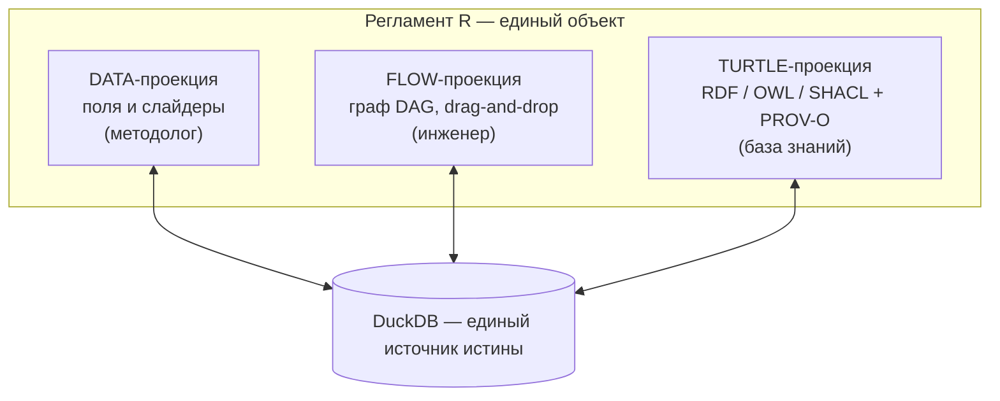
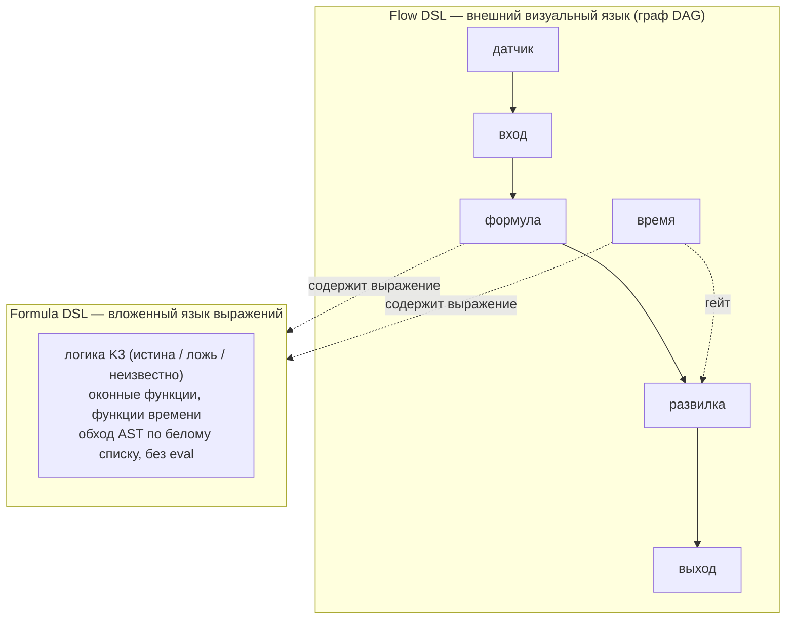
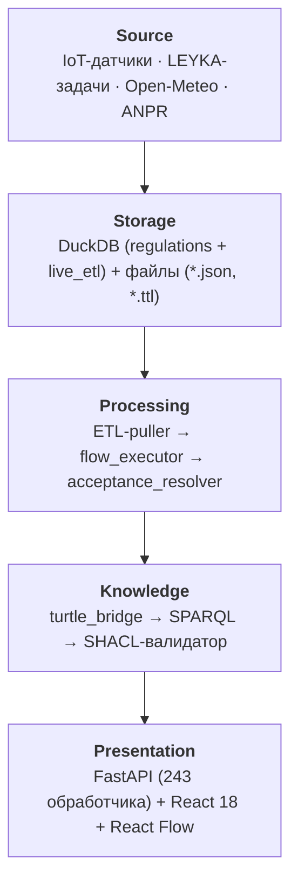
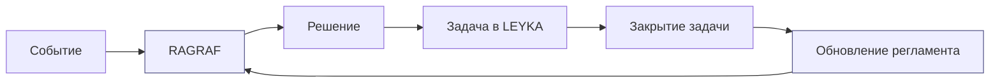

# Семантическое потоковое программирование: формальные основания и реализация в системах поддержки принятия решений
### Semantic Flow Programming: Formal Foundations and Implementation in Decision Support Systems

**О. В. Барбашин¹, Д. И. Свириденко²**  
¹ Центр искусственного интеллекта НГУ, ул. Пирогова 1, Новосибирск, 630090, Российская Федерация  
² Институт математики им. С. Л. Соболева СО РАН, пр. Акад. Коптюга 4, Новосибирск, 630090, Российская Федерация  
`o.barbashin@nsu.ru` · `dsviridenko47@gmail.com`

> 📰 **Редакционная памятка (удалить перед подачей).** Целевой журнал — *Software and Systems Modeling*
> (Springer, Q1); тип — **Regular Paper**; рецензирование **single-blind**; **язык только английский**
> (нужен полный перевод; русскую аннотацию убрать, английскую оставить как основную, ≤ 250 слов).
> Ссылки — **нумерованный стиль Springer Basic** `[1]` (квадратные скобки, нумерация по порядку появления;
> вёрстка в шаблоне `sn-jnl`). Обязателен раздел **Declarations** перед списком литературы (Funding,
> Competing interests, Data/Code availability, Authors' contributions, Ethics) — без него рукопись
> возвращают. Структура — стандартная Springer: Title page → Abstract → Keywords → текст → Declarations →
> References. ⛔ **Не выкладывать в открытый доступ (препринт/arXiv/доклад) до подачи патентной заявки на
> способ** — публикация раскрывает метод (см. [RID-PROTECTION-PACKAGE.md](GOTOMARKET/RID-PROTECTION-PACKAGE.md) §0.3).

---

## Аннотация (РУ)

В работе рассматривается задача формального описания регламентов управления сложными системами в условиях неполных данных. Анализируются преимущества и ограничения существующих подходов — потокового программирования (Flow-Based Programming, FBP), декларативных языков описания бизнес-процессов (BPMN, DMN), онтологических языков (OWL, SHACL) и языков поддержки принятия решений (d0sl). Предложена новая архитектурная концепция — **семантическое потоковое программирование** (Semantic Flow Programming, SFP) — объединяющая преимущества перечисленных парадигм в единой исполняемой модели. Ключевой особенностью SFP является применение **сильной логики Клини (K3)** как операционной семантики вычисления условий при неизвестных входных значениях сенсоров, а также использование стека W3C (OWL/SHACL/PROV-O/Turtle) в качестве первоклассного формата хранения регламентов. Предложена трёхпроекционная модель регламента (Data / Flow / Turtle), обеспечивающая одновременную читаемость для методолога-предметника, визуальную верификацию для инженера и машинную интерпретируемость для базы знаний. Описана реализация концепции в РАГРАФ — доменно-нейтральном фреймворке исполнения регламентов с замкнутым контуром обратной связи через систему управления задачами LEYKA. Показано главное практическое следствие подхода: **отраслевая вертикаль на SFP-фреймворке является артефактом настройки, а не артефактом кода**. Утверждение подтверждено измерением на промышленной платформе управления строительным проектом, собранной на том же ядре: отраслевая часть составила 4 % объёма исходного текста (≈3 700 строк против ≈89 800 строк доменно-нейтрального ядра) при корпусе из 59 регламентов в 15 предметных областях, исполняемых одним движком. Обсуждаются область применимости, ограничения подхода и перспективы развития.

**Ключевые слова:** семантическое программирование, потоковое программирование, логика Клини, SHACL, OWL, PROV-O, регламент управления, поддержка принятия решений, цифровой двойник, DSL.

---

## Abstract (EN)

The paper addresses the problem of formally specifying governance regulations for complex management systems under incomplete data conditions. Advantages and limitations of existing approaches are analyzed: Flow-Based Programming (FBP), declarative business-process languages (BPMN, DMN), ontological languages (OWL, SHACL), and decision-support DSLs (d0sl). A new architectural concept is proposed — **Semantic Flow Programming** (SFP) — synthesizing the advantages of the listed paradigms into a unified executable model. The key feature of SFP is the use of **Kleene's strong three-valued logic (K3)** as the operational semantics for evaluating conditions with unknown sensor input values, along with the W3C stack (OWL/SHACL/PROV-O/Turtle) as a first-class regulation storage format. A three-projection regulation model (Data / Flow / Turtle) is introduced, ensuring simultaneous human readability for domain methodologists, visual verifiability for engineers, and machine interpretability for knowledge bases. The realization of the concept is described in RAGRAF — a domain-neutral regulation execution framework with a closed feedback loop via the LEYKA task management system. The principal practical consequence of the approach is demonstrated: on an SFP framework, **a domain vertical is a configuration artifact rather than a code artifact**. The claim is substantiated by measurement on an industrial construction-project management platform built on the same core: the domain-specific part accounts for 4 % of the source (≈3,700 lines against ≈89,800 lines of domain-neutral core), while a corpus of 59 regulations across 15 domains is executed by a single engine. Applicability scope, current limitations, and development prospects are discussed.

**Keywords:** semantic programming, flow-based programming, Kleene logic, SHACL, OWL, PROV-O, governance regulation, decision support, digital twin, DSL.

---

## 1. Введение

Задача формального описания регламентов управления — нормативных правил, предписывающих, когда и какое действие следует предпринять при определённых измеримых условиях, — возникает в самых разных областях: управление инфраструктурой, промышленный мониторинг, медицинские протоколы, административные процедуры, ESG-отчётность. Общая черта всех этих областей — присутствие человека в контуре принятия решений (human-in-the-loop), необходимость доказуемости корректности регламента и неизбежность частичной неопределённости во входных данных: датчики выходят из строя, коммуникационные каналы прерываются, агрегированные показатели поступают с задержкой.

Существующие подходы решают эту задачу частично. Языки потокового программирования — Node-RED, NoFlo — предоставляют удобный визуальный редактор для соединения источников событий в цепочки обработки, однако лишены формальной семантики: граф потока не верифицируем, не аудитируем, не экспортируем в машиночитаемый онтологический формат. Языки бизнес-процессов (BPMN) ориентированы на долгоживущие человеческие задачи и не имеют встроенного слоя IoT-событий и арифметики временных рядов. Движки бизнес-правил (Drools, Rete) мощны, но требуют Java-экспертизы и не предоставляют визуального редактора уровня, доступного методологу без программистской подготовки. Онтологические языки (OWL, SHACL) обеспечивают формальную верификацию, однако остаются академическими инструментами без event-driven исполнения.

Отдельный класс — языки поддержки принятия решений с формальной логикой. В частности, d0sl (Eyeline Communications) реализует трёхзначную логику для описания условий достижения решения, однако ориентирован на текстовое описание в специализированной IDE и не интегрирован с IoT-слоем, временными рядами и онтологическим экспортом.

В настоящей работе описывается концепция **семантического потокового программирования** (Semantic Flow Programming, SFP) — архитектурного подхода, восполняющего указанные пробелы путём их совместного устранения в единой исполняемой модели. Концепция реализована в РАГРАФ — **доменно-нейтральном фреймворке исполнения регламентов** (визуальный конструктор, интерпретатор, шлюз событий, онтологический слой), развёрнутом в промышленной среде.

Существенно, что реализация не является отраслевым продуктом. Ядро не содержит понятий предметной области: отрасль задаётся **набором регламентов и датасетов графа знаний**, а не изменением кода. Это свойство — не архитектурное удобство, а прямое следствие того, что регламент в SFP есть данные (три согласованные проекции), а не программа на языке общего назначения. Из него вытекает измеримое утверждение, проверяемое эмпирически: **стоимость новой отраслевой вертикали определяется объёмом настройки, а не объёмом разработки**. В разделе 6.2 это утверждение проверено на промышленной платформе управления строительным проектом, собранной на том же ядре и доведённой до сдачи по полному комплекту программной документации.

Вклад работы состоит в следующем: (i) концепция SFP и трёхпроекционная модель регламента; (ii) операционная семантика с сильной логикой Клини для неполных сенсорных данных; (iii) использование стека W3C как первоклассного формата хранения и исполнения; (iv) замкнутый контур через проверку исхода, а не факта действия; (v) эмпирическая оценка стоимости отраслевой вертикали на SFP-фреймворке.

Концепция вписана в более широкую исследовательскую программу — представление **субъекта управления** (ведомства, предприятия, города) как **цифрового двойника** на основе задачного подхода и теории функциональных систем [Vityaev et al., 2025]. В этой работе показано, что цифровой двойник субъекта управления следует строить не вокруг ресурсов или рисков, а вокруг **решаемых задач** с проверяемыми критериями; отсюда следует, что элементарной единицей такого двойника выступает именно **исполнимый регламент** — задача вида «при условии → действие → проверка исхода». SFP/RAGRAF реализует эту единицу, а интеграция с системой управления задачами LEYKA доводит её до замкнутого контура управления (раздел 6).

Структура работы: в разделе 2 рассматриваются теоретические основания — семантическое программирование, задачный подход и логика Клини; в разделе 3 формулируется концепция SFP и вводится трёхпроекционная модель; в разделе 4 описывается операционная семантика Formula AST с логикой K3; в разделе 5 рассматривается интеграция стека W3C; в разделе 6 описывается реализация в RAGRAF; в разделе 7 проводится сравнение с аналогами; в разделе 8 обсуждаются ограничения и направления развития.

---

## 2. Теоретические основания

### 2.1 Семантическое программирование и Σ-программирование

Традиционный подход к задаче принятия решения состоит в написании алгоритма — последовательности шагов, результат которых интерпретируется как решение. Альтернативный, **модельно-теоретический подход** состоит в описании того, *что* является решением, а не *как* его вычислить [Goncharov, Sviridenko, 1986; Ershov, Goncharov, Sviridenko, 1987].

Основу этого подхода составляет понятие **Σ-программирования**, разработанное в ИМ СО РАН (Ю. Л. Ершов, С. С. Гончаров, Д. И. Свириденко) в 1980-е годы [Гончаров, Свириденко, 2018a]. Задача описывается **Σ-формулой** над списочной надстройкой базовой конструктивной модели, а вычисление трактуется как **проверка истинности этой формулы на модели** (либо вычисление Σ-терма). На практике ограничиваются классом **Δ₀-формул** — с ограниченными кванторами, — что гарантирует эффективную (полиномиальную или автоматную) вычислимость [Оспичев, Пономарёв, 2018]. Принципиально важно, что:

- вычисление происходит по самому описанию, а не по отдельно написанной программе;
- корректность описания проверяется формальными методами;
- неполнота данных естественным образом отражается в семантике формулы.

Отдельные предикаты базовой модели могут интерпретироваться как **оракулы** — внешние вычислители, чьи значения подаются в логическую надстройку извне. Именно этот механизм связывает теорию с практикой систем управления: в разделе 6 показания датчиков и вердикты внешних моделей выступают такими оракулами, над которыми исполняется регламент.

Это отличает Σ-подход как от функционального программирования (LISP, Haskell), где описание остаётся алгоритмическим, так и от логического программирования (Prolog), где поиск ответа процедурен и не предусматривает явного значения «неизвестно». Семантическое программирование применимо там, где сам вопрос «известен ли ответ» требует логического оформления, — это свойство критично для систем управления с частичной наблюдаемостью.

Современное развитие этой школы — **задачный подход** к построению доверенного (объясняющего) ИИ [Nechesov et al., 2025]. В этой работе показано, что надёжность достигается не «дообучением» свободной модели, а **привязкой решения к строго поставленной задаче** — с явными аксиомами, ограничениями и критерием решения, — что и снимает проблему «галлюцинаций». Отсюда следует ключевой архитектурный принцип SFP: регламент трактуется не как свободный вывод, а как **решение конкретной задачи**, обязательно снабжённой проверяемым критерием решённости (этап «подтверждение» в замкнутом контуре, разделы 3.1 и 6.2); система действует строго в границах поставленной задачи и способна машинно подтвердить, что задача решена.

### 2.2 Сильная логика Клини (K3) и неопределённость входных данных

Двузначная классическая логика неприменима в системах, где часть входных значений в момент вычисления неизвестна: при `p AND q`, если `p = unknown`, интерпретация `false` (оптимистичная) создаёт риск ложного «всё в норме», а интерпретация `true` — риск ложной тревоги.

Сильная логика Клини K3 [Kleene, 1952] вводит третье истинностное значение `u` (unknown/undefined), семантика которого определяется параллельным вычислением: если результат определим независимо от значения `u` — он определяется; если нет — сохраняется неопределённость. Формально:

```
¬u = u

u ∧ false = false    (short-circuit: независимо от u)
u ∧ true  = u
u ∧ u     = u

u ∨ true  = true     (short-circuit)
u ∨ false = u
u ∨ u     = u
```

Эта семантика обеспечивает **консервативность вывода**: система никогда не утверждает «ситуация нормальна», если хотя бы один необходимый датчик недоступен, и сигнализирует `unknown`, инициируя диагностику [Fitting, 1985].

---

## 3. Семантическое потоковое программирование: концепция и трёхпроекционная модель

### 3.1 Определение SFP

**Определение 1.** *Семантическое потоковое программирование (Semantic Flow Programming, SFP)* — парадигма разработки исполняемых регламентов управления, в которой:

1. регламент представлен **ориентированным ациклическим графом (DAG)** типизированных узлов с семантически определёнными видами соединений;
2. **операционная семантика вычисления условий** основана на сильной логике Клини K3;
3. каждый регламент **синхронно существует в трёх проекциях**: human-readable форма (Data), визуальный редактор графа (Flow), машиночитаемый онтологический формат (Turtle/RDF);
4. исполнение регламента **событийно-ориентированно**: триггер — показание сенсора или изменение состояния задачи — запускает обход DAG;
5. выходные сигналы **порождают задачи** в связанной системе управления, создавая замкнутый контур «событие → решение → действие → подтверждение → обновление регламента».

Эпитет «семантическое» отражает наследование от семантического моделирования (раздел 2): узлы и рёбра графа несут не просто поток данных (как в FBP), но и проверяемую семантику предметной области — типы, контракты данных и условия, выраженные в формальном виде.

### 3.2 Трёхпроекционная модель регламента



### 3.3 Типизация узлов DAG

Граф регламента строится из семи типизированных узлов:

| Тип | Семантика | Выход |
|---|---|---|
| `sensor` | Наличие показания от привязанного источника | `true / false / unknown` |
| `input` | Значение из SensorReading | числовое или `null` |
| `threshold` | `abs(value − ref) > deviation` | `true / false / unknown` |
| `compare` | Сравнение: `outside_range`, `gt`, `lt`, `eq`, `ne` | `true / false / unknown` |
| `formula` | AST-вычислитель с K3-семантикой и оконными функциями | `true / false / unknown` |
| `switch` | Маршрутизатор по `condition → case.value` с fallback | активный выход |
| `output` | Выходной сигнал уровня `normal/warning/critical` | событие системы |

---

## 4. Операционная семантика Formula DSL

SFP — **двухуровневый язык**: внешний визуальный **Flow DSL** (граф из типизированных узлов) и вложенный текстовый **Formula DSL** — безопасный язык выражений, живущий внутри узлов `формула` и `время`. Именно операционную семантику Formula DSL (с логикой K3) описывает данный раздел; макроструктуру задаёт Flow DSL (раздел 3).



### 4.1 Синтаксис и безопасность

Узел `formula` принимает строку выражения на подъязыке Formula DSL и вычисляет её с K3-семантикой. Синтаксис — подмножество Python expression syntax, разбираемое через `ast.parse(mode="eval")`. Исполнение через `eval()`/`exec()` исключено: вычисление реализовано через AST-walker с белым списком допустимых узлов. Любой узел вне белого списка вызывает `FormulaSyntaxError` на этапе валидации — до сохранения регламента.

### 4.2 Встроенные функции временных рядов

Formula DSL предоставляет шесть встроенных агрегатных функций:

```
rate(p, window)          — (last − first) / Δt  [ед./сек]
delta(p, window)         — last − first
mean_over(p, window)     — среднее по окну
max_over(p, window)      — максимум по окну
min_over(p, window)      — минимум по окну
count_above(p, v, window)— количество показаний > v
```

Форматы окна: `"5m"`, `"30m"`, `"1h"`, `"24h"`, `"3d"`. Функция возвращает `None` (≡ `u` в K3) если в окне нет ни одного показания.

### 4.3 Реализация K3 в AST-walker

```python
def eval_and(values):
    result = True
    for v in values:
        if v is False: return False      # short-circuit
        if v is None:  result = None     # propagate unknown
    return result

def eval_or(values):
    result = False
    for v in values:
        if v is True: return True        # short-circuit
        if v is None: result = None
    return result

def eval_not(v):
    if v is None: return None
    return not v
```

Критически важное свойство: выражение `pressure > 20 and temperature > 50` при офлайн-датчике `pressure` возвращает `None`, не `False`. Система фиксирует в trace: `"unknown: pressure offline"` — оператор видит не «всё нормально», а «недостаточно данных для вывода».

---

## 5. Интеграция стека W3C

### 5.1 SHACL как контракт на параметрах

В архитектуре SFP SHACL выполняет **роль контракта на параметры регламента**, а не узла исполнения. При сохранении регламента автогенерируется `shapes.ttl` с `sh:NodeShape` для допустимых диапазонов и `sh:sparql` для кросс-шейп зависимостей. Валидация при создании и изменении обеспечивает инвариантность данных до исполнения.

### 5.2 OWL-онтология регламента

```turtle
:regulation_R42 a :Regulation ;
    rdfs:label "Контроль давления теплоносителя" ;
    :hasSubject :HeatingSystemNGU ;
    :hasCriterionKind "pressure_monitoring" ;
    :hasTrigger :sensor_pressure_main ;
    :hasOutput :output_R42_critical ;
    owl:versionInfo "2026-05-15" .
```

### 5.3 PROV-O: аудит каждого решения

```turtle
:episode_E901 a prov:Activity ;
    prov:startedAtTime "2026-05-15T14:22:01Z"^^xsd:dateTime ;
    prov:wasAssociatedWith :regulation_R42 ;
    :hadInputValue [ :parameter "pressure" ; :value 1.8 ] ;
    :hadInputValue [ :parameter "temperature" ; :value "unknown" ] ;
    :producedOutput :signal_warning ;
    :traceNote "temperature unknown: sensor T-02 offline" ;
    prov:wasDerivedFrom :reading_sensor_pressure_main_1234 .
```

---

## 6. Реализация: фреймворк RAGRAF и платформа на нём

### 6.1 Архитектура доменно-нейтрального ядра



Ни один из пяти слоёв не содержит понятий предметной области.

### 6.2 Фреймворк и платформа: вертикаль как артефакт настройки

Утверждение раздела 1 — что на SFP-фреймворке отраслевая вертикаль является артефактом настройки, а не кода, — допускает прямую эмпирическую проверку: собрать на ядре полноценный отраслевой продукт и измерить, сколько кода на него потребовалось.

Такая проверка выполнена. На описанном ядре собрана платформа управления строительным проектом («АРХИ»): промышленная интеграция с системой управления строительными проектами по программному интерфейсу, детекторы риска проекта, регламенты строительной площадки, подтипы событий датчиков площадки и два раздела интерфейса. Платформа доведена до состояния сдаваемого изделия — с собственным техническим заданием, комплектом программных документов по ЕСПД и приёмочными испытаниями.

**Таблица 6.1.** Распределение объёма исходного текста между ядром и отраслевой частью

| Часть | Объём, строк | Доля |
|---|---|---|
| Доменно-нейтральное ядро фреймворка | ≈ 89 800 | 96 % |
| Отраслевая часть платформы | ≈ 3 700 | 4 % |

Отраслевые 4 % распределены по четырём категориям: клиент внешней отраслевой системы, детекторы риска предметной области, разделы интерфейса и подтипы событий. Ни одна из них не затрагивает интерпретатор, шлюз событий, хранилище, онтологический слой и редактор.

Второе свидетельство доменной нейтральности — состав корпуса. Один и тот же интерпретатор исполняет **59 регламентов в 15 предметных областях**: строительство, теплоснабжение, жилищно-коммунальное хозяйство, экология, дорожный трафик, диспетчерское реагирование, кампусная инфраструктура, распределённое оптоволокно, видеоаналитика, техническая поддержка, проектное управление, финансовый скоринг, медицинский скрининг. Семантический контекст задаётся **22 датасетами графа знаний** (3 563 триплета), подключаемыми к домену без изменения кода.

Методологическое замечание. Приведённое соотношение не следует читать как утверждение «разработка вертикали дешевле в 25 раз»: содержательная работа при построении вертикали приходится не на код, а на оцифровку норм — извлечение параметров, согласование порогов с предметными службами, привязку к документам-основаниям. Утверждение состоит в другом и в этом виде проверяемо: **эта работа не требует программирования и потому выполняется методологом предметной области, а не разработчиком фреймворка**. Именно это и является практическим содержанием SFP.

### 6.3 Замкнутый контур через LEYKA



Сигнал `output(level="critical")` порождает задачу в LEYKA с дедупликацией по открытым эпизодам. Изменение статуса задачи (→ `done`) регистрируется как `SensorReading` типа `task_status`, замыкая контур управления.

Архитектурно этот контур воспроизводит **теорию функциональных систем** П. К. Анохина: действие сопровождается *акцептором результата* — проверкой достигнутого исхода. В [Vityaev et al., 2025] такой контур положен в основу цифрового двойника субъекта управления; отсюда следует, что и в RAGRAF замыкание должно идти через **проверку исхода**, а не через факт выполнения действия — критерий решённости порождает оценку success-rate и подсказку методологу об изменении нормы.

### 6.4 Источники данных и площадки (состояние на сентябрь 2026)

**Действующие источники.** Фреймворк питается семью источниками в двух режимах — опрос по расписанию и приём событий по HTTP: видеодетектор государственных регистрационных знаков на шлагбауме парковки (приём событий), датчик на распределённом оптоволокне, промышленная система управления строительными проектами (боевой экземпляр партнёра, интеграция по программному интерфейсу), система управления задачами, открытые метеорологические и транспортные данные, системные часы.

**Развёрнутые контуры.** (i) Мониторинг парковки: видеодетектор → регламенты занятости и времени стоянки → задачи; (ii) охрана подземной кабельной трассы: события копки и шага вдоль трассы → регламент несанкционированных земляных работ; (iii) портфельный контроль строительных проектов: агрегаты плана-факта → детекторы риска срыва срока, перерасхода и устаревания графика.

**Площадки, намеченные к внедрению.** Университетский кампус и муниципалитет. Существенно различие их готовности, и оно иллюстрирует разделение «ядро — настройка». Для кампуса оцифрованы одиннадцать регламентов из отраслевого стандарта, но подключений к его информационным системам нет; при этом на его территории уже работают два боевых канала данных (видеодетектор и оптоволоконный датчик). Для муниципалитета обратная картина: четыре регламента диспетчерской службы оцифрованы из подлинного нормативного документа с сохранением его временны́х нормативов, но подключений нет ни одного. В обоих случаях недостающее — данные и согласование порогов, а не разработка.

### 6.5 Эмпирическая оценка

**Покрытие предметных областей.** Корпус — 59 регламентов в 15 предметных областях (раздел 6.2), исполняемых одним интерпретатором. Учебный поднабор из шести регламентов минимально достаточно покрывает все восемь активных типов узлов SFP — свидетельство выразительной полноты ядра языка при компактности набора примитивов.

**Стоимость отраслевой вертикали.** Отраслевая часть промышленной платформы, собранной на ядре, составила 4 % объёма исходного текста (таблица 6.1). Показатель следует трактовать осторожно (раздел 8.2), однако порядок величины устойчив и согласуется со вторым, независимым от подсчёта строк, наблюдением: ни один из пяти архитектурных слоёв не потребовал изменения при добавлении отрасли.

**Регрессионное покрытие.** Автоматических проверок серверной части — 753 в 72 наборах; каждый набор сопоставлен пункту требований, что делает прогон формой приёмки, а не только регрессионным контролем.

**Опыт, подтверждающий необходимость привязки к документу-основанию.** В ходе сопровождения корпуса обнаружено 47 записей графа знаний с утраченным окончанием (повреждение при выгрузке источника). Предпринята попытка восстановить их по действующим нормам средствами больших языковых моделей с последующей независимой состязательной проверкой каждого предложения. Из 27 предложенных восстановлений принято 4 — **15 %**. Существенно распределение причин отклонения: «дописаны детали, которых в норме нет» — 18 случаев, «документ отменён либо заменён» — 17, «формулировка искажает норму» — 7. Отклонённые предложения не были бессмысленными: они выглядели как нормы, ссылались на существующие приказы и читались убедительно, а ошибка скрывалась в утратившей силу редакции или смещённом пороге. Наблюдение имеет прямое отношение к предмету работы: оно показывает, что для регламента, порождающего юридически значимое действие, **правдоподобие содержания не может служить критерием его допустимости**, и оправдывает конструктивное решение SFP — привязывать параметры регламента к документу-основанию с контролем целостности, а не к знаниям модели. Эксперимент носит наблюдательный характер, выборка мала, и результат приводится как аргумент в пользу проектного решения, а не как измерение качества моделей.

**Абляция: вклад онтологического слоя.** Чтобы проверить, что семантическая (триплетная) проекция даёт измеримую пользу, а не только потоковая модель, проведён абляционный эксперимент на доменном тест-сете уточнения границ регламентов. Вариант с триплетной опорой против варианта без неё на *конфузных* пограничных парах: точность **96 % против 78 %** (+18 п.п.); отбор кандидатов — top-k с порогом по score-margin. Результат показывает, что онтологический слой SFP улучшает разрешение пограничных случаев по сравнению с чисто потоковым представлением (предварительная оценка, см. угрозы валидности в разделе 8.2).

**Корректность по построению.** Встроенный валидатор статически проверяет границы интервалов: нахлёст и «дыры» между зонами развилки и между интервалами узлов времени фиксируются как ошибки **до сохранения** (полуоткрытая конвенция `[min, max)`). Тем самым класс ошибок «момент попадает в две ветки» / «не попадает ни в одну» исключается на этапе редактирования, а не исполнения.

**Сложность исполнения.** Обход DAG — `O(V+E)` на событие; конечность вычисления гарантирована по построению (ацикличность графа + ограниченные операции, Δ₀-вычислимость, раздел 2.1).

---

## 7. Сравнение с аналогами

| Характеристика | Node-RED / FBP | BPMN / Camunda | Drools / Rete | d0sl | **SFP / RAGRAF** |
|---|---|---|---|---|---|
| Визуальный редактор | ✅ | ✅ | ❌ | ❌ текстовый | ✅ |
| Трёхзначная логика | ❌ | ❌ | ❌ | ✅ | **✅ K3 в runtime** |
| Онтологический слой | ❌ | ❌ | ❌ | ❌ | **✅ OWL/SHACL** |
| Аудит-трейл (PROV-O) | ❌ | частично | ❌ | ❌ | **✅** |
| IoT / временные ряды | ✅ | ❌ | ❌ | ❌ | **✅** |
| Задачный feedback-loop | ❌ | ✅ | ❌ | ❌ | **✅ LEYKA** |
| Три проекции регламента | ❌ | ❌ | ❌ | ❌ | **✅** |
| Edge-deployment | ✅ | ❌ | ❌ | ❌ | ⚠️ cloud-first |
| Экосистема коннекторов | ✅ 5000+ | ✅ | ✅ | — | ⚠️ встроенные |
| Вертикаль как настройка **с прослеживаемостью до нормы** | ❌ | ⚠️ частично | ❌ | ⚠️ частично | **✅ измерено: 4 %** |

Последняя строка требует пояснения, поскольку в наивном прочтении она несправедлива к аналогам: потоки Node-RED и схемы BPMN тоже суть конфигурация, а не код. Различие не в форме артефакта, а в том, что этой конфигурацией **удостоверяется**. Поток Node-RED задаёт обработку событий, но не связан с нормативным документом, не несёт формальных ограничений на входные значения и не порождает трассы, по которой вердикт возводится к пункту нормы. Схема BPMN описывает процесс, но не числовые условия его ветвления и не контракт данных. В SFP отраслевая вертикаль — это регламенты, каждый из которых имеет документ-основание с контролем целостности, формальные ограничения параметров и трассу вердикта; поэтому настройкой задаётся не только поведение, но и **доказуемость соответствия норме**. Именно совокупность «конфигурация + прослеживаемость» и составляет предмет измерения в разделе 6.2.

Ближайший концептуальный аналог — Boldachev (2025), «исполняемые онтологии с event-семантикой и dataflow-архитектурой» — не реализует трёхзначную логику, не имеет SHACL-контрактов и задачного feedback-loop. Независимое пересечение двух разработок на близкой идее (2025–2026) указывает на своевременность SFP.

---

## 8. Ограничения и направления развития

### 8.1 Текущие ограничения

- **Масштабируемость**: DuckDB, по предварительным наблюдениям (без нагрузочного бенчмарка), комфортен до ~10 000 регламентов / ~100 000 эпизодов в сутки; далее — PostgreSQL с columnar extension.
- **Edge-deployment**: архитектура cloud-first, неприменима при периодически недоступной сети.
- **Экосистема узлов**: новый тип узла требует Python-кода в `flow_executor.py`; plugin-API отсутствует.
- **Темпоральная логика**: реализован декларативный *узел времени* («чип времени») — условия «время суток / рабочие часы / день недели / окно» вычисляются на функциях часов (`is_night`, `hour`, `day_of_week`, `between`) как узел-источник без отдельного входного ребра. Открытым остаётся следующий уровень — LTL/CTL-операторы (`eventually`, `always`, `until`) над историей эпизодов.
- **Верификация DAG**: SHACL не обнаруживает недостижимые ветви, тавтологии условий, межрегламентные противоречия.
- **Единственная построенная вертикаль**: соотношение «ядро — отрасль» (раздел 6.2) получено на одной платформе. Пока не построена вторая вертикаль в существенно иной предметной области, устойчивость показателя не установлена; вероятно, доля отраслевой части выше там, где отрасль требует собственных типов узлов или собственного протокола обмена.
- **Граница фреймворка и платформы поддерживается соглашением, а не средствами языка**: принадлежность сведения ядру или отрасли определяется решением разработчика и фиксируется в документации; технического механизма, запрещающего внести отраслевое понятие в ядро, нет.

### 8.2 Угрозы валидности

- **Внутренняя.** Абляционный результат (раздел 6.4) получен на ограниченном доменном тест-сете уточнения границ; величина эффекта может зависеть от состава корпуса и требует расширенного набора с независимой разметкой.
- **Внешняя (обобщаемость).** Пилоты развёрнуты в одной организации и узком наборе доменов; перенос на иные предметные области и масштабы — предмет дальнейшей проверки.
- **Конструктная валидность показателя стоимости вертикали.** Доля 4 % измерена по объёму исходного текста — грубой мере, не учитывающей ни трудоёмкости, ни сложности написанного. Она не измеряет главную часть работы по вертикали — оцифровку норм и согласование порогов, — а лишь показывает, что эта работа выполняется вне кода. Кроме того, показатель зависит от границы, проведённой между ядром и отраслью самим автором; независимой процедуры отнесения модуля к ядру или к отрасли не применялось. Убедительной проверкой утверждения была бы вторая вертикаль, построенная сторонней командой без изменения ядра, — такой проверки пока не проводилось.
- **Конструктная.** Метрики «точность на конфузных парах» и «покрытие типов узлов» отражают лишь часть качества; продуктивность методолога и сопровождаемость регламентов не измерялись.
- **Надёжность реализации.** Остаточный недетерминизм (fallback-ветви `switch`/`compare`) ещё подлежит устранению в коде (раздел 8.1) — до этого заявления о полной детерминированности следует ограничивать.

### 8.3 Перспективные направления

- **Медицинский вектор** (REQ-MED-FLOW-INTEGRATION): FHIR R4/R5 как онтологический слой источника событий; PROV-O-трассируемые клинические решения; задачи медицинского персонала.
- **Формальная верификация DAG**: интеграция с SMT-решателями (Z3) для статической проверки реализуемости путей.
- **Темпоральные операторы LTL над историей событий**: узел времени уже закрывает условия время-суток и расписания; следующий шаг — операторы `G` (always), `F` (eventually), `U` (until) для свойств над последовательностью эпизодов.
- **Открытая спецификация формата**: публикация Turtle-схемы как открытого стандарта для экосистемной совместимости.

---

## 9. Заключение

Предложена концепция семантического потокового программирования (SFP). Ключевые вклады:

1. **Трёхпроекционная модель регламента** (Data / Flow / Turtle) — одновременная доступность для трёх классов пользователей без ручной синхронизации.
2. **K3-семантика в runtime** — консервативность вывода при деградации сенсорных данных.
3. **W3C-стек как первоклассный гражданин** — OWL/SHACL/PROV-O/Turtle как живые компоненты исполнения, не постфактум-документация.
4. **Замкнутый контур через систему задач** — событийная цепочка доведена до подтверждения исполнения с дедупликацией.
5. **Отраслевая вертикаль как артефакт настройки** — эмпирически показано, что на SFP-фреймворке отрасль задаётся регламентами и датасетами, а не кодом: отраслевая часть промышленной платформы составила 4 % объёма исходного текста при корпусе из 59 регламентов в 15 предметных областях на одном интерпретаторе.

Концепция реализована в РАГРАФ — доменно-нейтральном фреймворке исполнения регламентов (2026), на котором собрана и доведена до сдачи промышленная платформа управления строительным проектом. Практическое значение подхода состоит в перемещении отраслевой работы из области разработки в область методологии: правило меняет предметный специалист, а не программист, и каждое изменение сохраняет прослеживаемость до документа-основания.

Узел времени уже закрывает условия время-суток и расписания. Дальнейшие направления: вторая вертикаль в существенно иной предметной области как проверка обобщаемости результата раздела 6.2, темпоральные операторы LTL над историей эпизодов, формальная верификация DAG, edge-deployment, медицинский домен.

---

## Declarations / Декларации

> Обязательный раздел Springer (перед списком литературы). Без него рукопись возвращают. Заполнить перед подачей.

- **Funding / Финансирование.** [ЗАПОЛНИТЬ: источники финансирования либо «The authors received no specific funding for this work».]
- **Competing interests / Конфликт интересов.** [ЗАПОЛНИТЬ: «The authors declare no competing interests» либо раскрыть.]
- **Data and code availability / Доступность данных и кода.** Учебный корпус регламентов и спецификация Flow DSL открыты в составе документации проекта; исходный код движка — проприетарный, предоставляется по запросу в рамках лицензии (репозиторий кода приватный — см. [RID-PROTECTION-PACKAGE.md](GOTOMARKET/RID-PROTECTION-PACKAGE.md) §0.3).
- **Authors' contributions / Вклад авторов.** О. В. Барбашин — концепция SFP, архитектура и реализация RAGRAF, эксперименты, текст; Д. И. Свириденко — теоретические основания (семантическое / Σ-программирование), научное руководство, редактирование.
- **Ethics approval / Этика.** Не применимо (исследование не включает экспериментов с участием людей или животных).

---

## Список литературы

> При подаче оформить **нумерованным стилем Springer Basic** (`[1]` в тексте по порядку появления; вёрстка
> через шаблон `sn-jnl`, нумерацию проставит `.bst`). Ниже — рабочий алфавитный список. Пример целевого
> формата записи: `1. Author A.A.: Title. Journal Name vol(no), 100–110 (year). https://doi.org/...`.
> Добавить DOI/URL ко всем источникам, где есть.

Boldachev A. Executable Ontologies: Synthesizing Event Semantics with Dataflow Architecture. *arXiv:2509.09775*, 2025.

Borzi A., Pailos F., Toranzo Calderón J. T. Strong Kleene Logics as a Tool for Modelling Formal Epistemic Norms. *Logic and Logical Philosophy*, 2024, vol. 33, no. 4, p. 615–648.

Ershov Yu. L., Goncharov S. S., Sviridenko D. I. Semantic foundations of programming. *Lecture Notes in Computer Science*, 1987, vol. 278, p. 116–122.

Ershov Yu. L., Goncharov S. S., Sviridenko D. I. Semantic programming. *Proc. IFIP 10-th World Comput. Congress*, Dublin, 1986, vol. 10, p. 1113–1120.

Fitting M. A Kripke–Kleene semantics for logic programs. *Journal of Logic Programming*, 1985, vol. 2, no. 4, p. 295–312.

Goncharov S. S., Sviridenko D. I. Theoretical aspects of Σ-programming. *Lecture Notes in Computer Science*, 1986, vol. 215, p. 169–179.

Goncharov S. S., Sviridenko D. I. Σ-programming. *Transl., II. Ser., Am. Math. Soc.*, 1989, vol. 142, p. 101–121.

Goncharov S. S., Sviridenko D. I. Recursive terms in semantic programming. *Siberian Mathematical Journal*, 2018b, vol. 59, no. 6, p. 1279–1290.

Гончаров С. С., Свириденко Д. И. Семантическое моделирование и искусственный интеллект // Сибирский философский журнал. 2018a. Т. 16, № 4. С. 5–25. DOI 10.25205/2541-7517-2018-16-4-5-25.

Kleene S. C. *Introduction to Metamathematics*. Amsterdam: North-Holland, 1952.

Morrison J. P. *Flow-Based Programming: A New Approach to Application Development*. 2nd ed. CreateSpace, 2010.

Nechesov A. V., Vityaev E. E., Goncharov S. S., Sviridenko D. I. The Task-Based Approach: A New Paradigm for Building Trustworthy Artificial Intelligence. *The Bulletin of Irkutsk State University. Series Mathematics*, 2025, vol. 54, p. 96–112. DOI 10.26516/1997-7670.2025.54.96.

Ospichev S., Ponomarev D. On the Complexity of Formulas in Semantic Programming. *Сибирские электронные математические известия*, 2018, vol. 15, p. 987–995.

Vityaev E. E., Sviridenko D. I., Rofe A. R. Task-Based Approach to Digital Transformations. *The Bulletin of Irkutsk State University. Series Mathematics*, 2025, vol. 54, p. 78–95. DOI 10.26516/1997-7670.2025.54.78.

W3C. Shapes Constraint Language (SHACL). W3C Recommendation, 2017. https://www.w3.org/TR/shacl/

W3C. SHACL 1.2 Core. W3C Working Draft, June 2026. https://www.w3.org/TR/shacl12-core/

W3C. PROV-O: The PROV Ontology. W3C Recommendation, 2013. https://www.w3.org/TR/prov-o/

---

*Статья поступила в редакцию: июнь 2026 г.*

**Барбашин Олег Владимирович** — Центр искусственного интеллекта Новосибирского государственного университета, Новосибирск, Россия.

**Свириденко Дмитрий Иванович** — доктор физико-математических наук, Институт математики им. С. Л. Соболева СО РАН, Новосибирск, Россия; один из авторов концепции семантического моделирования (Σ-программирование).

---

## Приложение А. Учебный глоссарий

> ⚠️ **Временное приложение** — для изучения темы, **удалить перед подачей в журнал**. Объяснения
> намеренно бытовые и упрощённые: цель — интуиция, а не строгость. Сквозной житейский пример —
> **поликлиника**: очередь пациентов, дежурные врачи, датчики, погода.

### А.0. Два самых трудных понятия — на пальцах

Это ядро всей теории, поэтому разберём подробно и с примерами.

**Σ-формула (сигма-формула) — «СУЩЕСТВУЕТ ли такой объект?»**
Формула, которая спрашивает: *существует ли что-то с заданным свойством* — и, если да, это «что-то»
можно **найти** перебором/вычислением. Греческая Σ исторически указывает на квантор существования
**∃** («существует»).
- 🏥 *Пример:* «Есть ли в очереди пациент, который ждёт дольше 40 минут?» Формально:
  `∃ пациент: время_ожидания(пациент) > 40`. Система проходит по очереди и либо **предъявляет
  свидетеля** (конкретного пациента), либо отвечает «нет».
- 💡 *Зачем это в основе:* решить задачу — часто значит **найти нужный объект**. Если вы описали
  решение как Σ-формулу, машина сама ищет ответ-свидетель. Отсюда девиз школы: «правильно
  поставленная задача — наполовину решённая».

**Σ-терм — то же, но вычисляет ЗНАЧЕНИЕ, а не «да/нет».**
Формула отвечает *истина/ложь/кто*; **терм** считает *число/объект*.
- 🏥 *Пример:* Σ-формула «есть ли просроченный пациент?» → да/нет. Σ-**терм** «сколько пациентов
  просрочено?» или «максимальное время ожидания в очереди» → конкретное число.

**Δ₀-формула (дельта-ноль) — «существует ли СРЕДИ ЭТИХ, в конечных пределах?»**
Это Σ-формула, в которой **все кванторы ограничены**: перебор идёт только по заранее очерченному
**конечному** множеству, а не «по всему миру».
- ❌ *Неограниченный квантор:* «`∃x`: …» — ищи где угодно; поиск теоретически может не закончиться.
- ✅ *Ограниченный (Δ₀):* «`∃x ∈ {12 дежурных}`: …» или «`∃x < 100`: …» — проверь конечный список,
  **гарантированно** дай ответ.
- 🏥 *Пример-контраст:*
  - **не Δ₀:** «Существует ли вообще в стране врач, который…?» — перебор необозрим.
  - **Δ₀:** «Существует ли **среди этих 12 дежурных** свободный врач?» — 12 проверок, быстрый и
    гарантированный ответ.
- 💡 *Зачем это нам:* Δ₀ = «считаем только в конечных, известных границах» ⇒ вычисление всегда
  **завершается быстро** (полиномиально) и его можно **проверить/проаудировать**. На этом стоит Flow
  DSL: конечный граф, ограниченные операции, **временны́е окна**. Функция `mean_over(p, "5m")` —
  усреднение **по окну 5 минут** — это и есть ограниченный квантор по конечному набору показаний,
  то есть Δ₀ на практике.

**Лесенка сложности (для общей картины):**

| Уровень | Что разрешено | Житейски | Свойство |
|---|---|---|---|
| **Δ₀** | только ограниченные кванторы | «среди 12 дежурных есть свободный?» | всегда быстро и **разрешимо** |
| **Σ (Σ₁)** | Δ₀ + неограниченное «существует» (`∃`) | «где-то существует свободный врач?» | **свидетеля найдём, если он есть** (полуразрешимо) |
| **Π (Π₁)** | неограниченное «для всех» (`∀`) | «у **всех** врачей нет очереди?» | труднее: бесконечную проверку не завершить |

Решение задач удобно описывать на уровне **Σ** (ищем свидетеля); сужение до **Δ₀** — плата за
скорость и гарантию ответа. В статье: `formula` и оконные функции — Δ₀-вычисления; событие и
нейросеть — оракулы; «критерий решённости» — Σ-вопрос «существует ли исход, удовлетворяющий условию?».

### А.1. Логические основания (семантическое программирование)

- **Конструктивная (вычислимая) модель** — «мир», в котором все объекты, функции и предикаты можно
  реально вычислить (никаких неосязаемых бесконечностей). 🏥 *Пример:* список пациентов, функция
  «время ожидания», предикат «свободен ли врач» — всё считается на компьютере.
- **Списочная надстройка** — из базовых элементов разрешено строить конечные списки, списки списков
  и т. п. 🏥 *Пример:* из пациентов — список очереди; из очередей — список очередей по кабинетам
  (как вложенные структуры данных / JSON).
- **Оракул** — предикат или функция, значение которой логика **не вычисляет сама, а спрашивает у
  внешнего источника** («справочное окошко»). 🏥 *Пример:* «патология ли на снимке?» логика не
  считает — **спрашивает у нейросети-оракула**, а уже над её ответом строит правила. Датчик, БД,
  внешний сервис — тоже оракулы.
- **Теоретико-модельный подход** vs **аксиоматический** — *проверить истинность формулы на конкретной
  модели* («сверить с реальной картиной мира») против *вывести теорему из аксиом* («доказать из
  правил»). Семантическое моделирование — про первое.
- **Декларативное программирование** — описываешь *что* считается правильным результатом, а *как*
  его получить — забота системы. 🏥 *Пример:* SQL-запрос «дай пациентов с ожиданием > 40 мин» (что),
  а не цикл по списку (как). Противоположность — **императивное** (пошаговый рецепт «как»).
- **Объясняющий ИИ (XAI)** — ИИ, который не только выдаёт ответ, но и **объясняет/обосновывает** его.
  Цель школы Гончарова–Свириденко в противовес «чёрному ящику» нейросетей.

### А.2. Логика неопределённости (Клини)

- **Трёхзначная логика Клини (K3)** — логика с тремя значениями: **истина / ложь / неизвестно**.
- **`u` (unknown)** — третье значение «неизвестно» (данных нет / датчик офлайн).
- **Сильная (strong) семантика Клини** — при неизвестном считаем то, что можно: если результат
  определён **независимо** от `u`, выдаём его; иначе — `u`. 🏥 *Пример:* `ложь И (неизвестно)` = **ложь**
  (одного «ложь» достаточно), а `истина И (неизвестно)` = **неизвестно**.
- **Короткое замыкание (short-circuit)** — прекращаем вычисление, как только результат уже ясен.
  «`ложь И что-угодно = ложь`» — дальше не смотрим.
- **Консервативность вывода** — система **никогда не говорит «всё в норме», если данных не хватает**;
  она честно отвечает «неизвестно» и инициирует диагностику. 🏥 *Пример:* нет показаний давления →
  вывод не «норма», а «неизвестно: датчик давления офлайн».

### А.3. Стек знаний (W3C)

- **RDF / триплет** — факт в форме «подлежащее — сказуемое — дополнение». 🏥 *Пример:*
  `(датчик_5, измеряет, давление)`; `(регламент_42, относится_к, система_отопления)`.
- **Turtle** — компактный текстовый способ записывать такие триплеты (формат файлов `.ttl`).
- **OWL (онтология)** — словарь понятий предметной области и связей между ними (классы: «Регламент»,
  «Датчик»; отношения: «имеет триггер»). Как глоссарий, но машиночитаемый.
- **SHACL (контракт данных)** — правила-«техпаспорт»: какие поля обязательны и в каких пределах.
  🏥 *Пример:* давление ∈ [0, 16] бар, иначе данные бракуются **до** исполнения регламента. В SFP
  SHACL — контракт на входе, **не узел потока**.
- **PROV-O (происхождение, трасса)** — «история решения»: из какого показания и по какому правилу
  получен вывод (как цепочка ответственности). 🏥 *Пример:* «сигнал тревоги получен из показания
  датчика P-1 по регламенту 42, температура была неизвестна».
- **SPARQL** — язык запросов к графу знаний (по сути «SQL для триплетов»).

### А.4. Архитектура SFP / RAGRAF

- **Регламент** — формальное правило «при таком-то измеримом условии — такое-то действие».
- **Flow DSL / Поток** — визуальный язык, на котором регламент собирается мышью как граф.
- **DAG (ориентированный ациклический граф)** — схема со стрелками **без петель назад**; сигнал
  течёт от входов к выходам и не зацикливается.
- **Узлы потока** — кирпичики графа: `датчик → вход → формула → развилка → выход` (ядро) плюс
  «сахарные» `порог`/`сравнение` (см. §3.3).
- **Событийно-ориентированность (event-driven)** — регламент запускается **событием** (показание
  датчика, смена статуса задачи), а не постоянным опросом.
- **Оконные функции / временной ряд** — агрегаты по интервалу времени (`mean_over`, `rate`, …);
  «окно» = конечный отрезок (это и есть Δ₀-ограничение, см. А.0).
- **Критерий решённости (постусловие)** — машинно-проверяемое условие «**регламент отработал**».
  🏥 *Пример:* «подозрение закрыто врачом в течение часа» или «датчик вернулся в норму».
- **Замкнутый контур (feedback loop)** — цепочка «событие → решение → задача → подтверждение →
  правка нормы»; не «сработал и забыл», а цикл с обучением методолога.
- **Задачный подход** — задача = 4 компонента (предусловие, объекты, действие, **критерий**), причём
  критерий обязателен. Идея: без критерия нельзя проверить, решена ли задача. Современное изложение как основа доверенного ИИ — [Nechesov et al., 2025].
- **ТФС (теория функциональных систем П. К. Анохина)** — биологическая метафора замкнутого контура
  с самопроверкой результата (акцептор результата действия) — основа петли обратной связи; применение к цифровым двойникам субъекта управления — [Vityaev et al., 2025].
- **Нейро-символический ИИ** — связка «нейросеть (распознаёт) + символьная логика (рассуждает и
  объясняет)». В терминах статьи: **ИИ-2** — модель-оракул (восприятие), **ИИ-1** — символьный
  регламент (управление и объяснение).

### А.5. Куда смотреть дальше

Первоисточник теории — Гончаров, Свириденко (2018); реализация и архитектура — `sigma-programming-ragraf.md`
и `SPEC-FLOW-DSL.md`; прикладной кейс — `REQ-MED-FLOW-INTEGRATION.md`.
