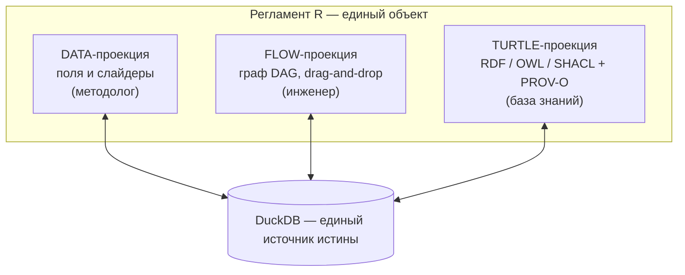
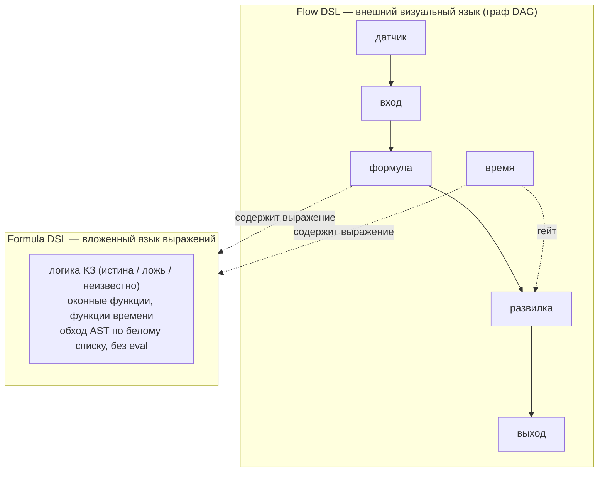
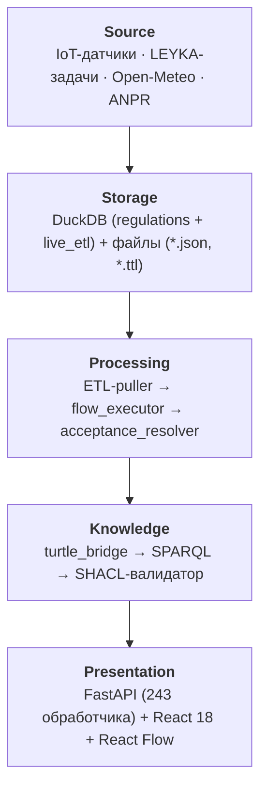
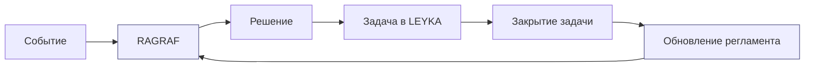

# Семантическое потоковое программирование: формальные основания и реализация в системах поддержки принятия решений
### Semantic Flow Programming: Formal Foundations and Implementation in Decision Support Systems

**О. В. Барбашин¹, Д. И. Свириденко²**  
¹ Центр искусственного интеллекта НГУ, ул. Пирогова 1, Новосибирск, 630090, Российская Федерация  
² Институт математики им. С. Л. Соболева СО РАН, пр. Акад. Коптюга 4, Новосибирск, 630090, Российская Федерация  
`o.barbashin@nsu.ru` · `dsviridenko47@gmail.com`

> 📰 **Редакционная памятка (удалить перед подачей).** Целевой журнал — *Software and Systems Modeling*
> (Springer, Q1); тип — **Regular Paper**; рецензирование **single-blind**; **язык только английский**
> (нужен полный перевод; русскую аннотацию убрать, английскую оставить как основную, ≤ 250 слов).
> Ссылки — **нумерованный стиль Springer Basic** `[1]` (квадратные скобки, нумерация по порядку появления;
> вёрстка в шаблоне `sn-jnl`). Обязателен раздел **Declarations** перед списком литературы (Funding,
> Competing interests, Data/Code availability, Authors' contributions, Ethics) — без него рукопись
> возвращают. Структура — стандартная Springer: Title page → Abstract → Keywords → текст → Declarations →
> References. ⛔ **Не выкладывать в открытый доступ (препринт/arXiv/доклад) до подачи патентной заявки на
> способ** — публикация раскрывает метод (см. [RID-PROTECTION-PACKAGE.md](GOTOMARKET/RID-PROTECTION-PACKAGE.md) §0.3).

---

## Аннотация (РУ)

В работе рассматривается задача формального описания регламентов управления сложными системами в условиях неполных данных. Анализируются преимущества и ограничения существующих подходов — потокового программирования (Flow-Based Programming, FBP), декларативных языков описания бизнес-процессов (BPMN, DMN), онтологических языков (OWL, SHACL) и языков поддержки принятия решений (d0sl). Предложена новая архитектурная концепция — **семантическое потоковое программирование** (Semantic Flow Programming, SFP) — объединяющая преимущества перечисленных парадигм в единой исполняемой модели. Ключевой особенностью SFP является применение **сильной логики Клини (K3)** как операционной семантики вычисления условий при неизвестных входных значениях сенсоров, а также использование стека W3C (OWL/SHACL/PROV-O/Turtle) в качестве первоклассного формата хранения регламентов. Предложена трёхпроекционная модель регламента (Data / Flow / Turtle), обеспечивающая одновременную читаемость для методолога-предметника, визуальную верификацию для инженера и машинную интерпретируемость для базы знаний. Описана реализация концепции в РАГРАФ — доменно-нейтральном фреймворке исполнения регламентов с замкнутым контуром обратной связи через систему управления задачами LEYKA. Показано главное практическое следствие подхода: **отраслевая вертикаль на SFP-фреймворке является артефактом настройки, а не артефактом кода**. Утверждение подтверждено измерением на промышленной платформе управления строительным проектом, собранной на том же ядре: отраслевая часть составила 4 % объёма исходного текста (≈5 000 строк из ≈117 400; только исходный текст программ — 3,6 %) при корпусе из 65 регламентов в 16 предметных областях, исполняемых одним движком. Оценка выполнена по трём вопросам на корпусе из 65 регламентов, написанных предметными специалистами: статический анализ обнаружил дефекты в 29 % корпуса, причём в 15 % регламентов отсутствовала ветвь на случай отсутствия данных — класс дефекта, не определимый в двузначной семантике. Опора на граф знаний предметной области даёт при отнесении запроса к области 96 % точности на конфузных парах против 78 % без неё. Отдельно показано, что формальное представление делает разрешимой задачу поиска **противоречий между разными регламентами** — класс дефекта, отсутствующий у отдельной нормы и становящийся определяющим при своде в сотни правил, где ручная проверка невозможна из-за квадратичного роста числа пар.

**Ключевые слова:** семантическое программирование, потоковое программирование, логика Клини, SHACL, OWL, PROV-O, регламент управления, поддержка принятия решений, цифровой двойник, DSL.

---

## Abstract (EN)

The paper addresses the problem of formally specifying governance regulations for complex management systems under incomplete data conditions. Advantages and limitations of existing approaches are analyzed: Flow-Based Programming (FBP), declarative business-process languages (BPMN, DMN), ontological languages (OWL, SHACL), and decision-support DSLs (d0sl). A new architectural concept is proposed — **Semantic Flow Programming** (SFP) — synthesizing the advantages of the listed paradigms into a unified executable model. The key feature of SFP is the use of **Kleene's strong three-valued logic (K3)** as the operational semantics for evaluating conditions with unknown sensor input values, along with the W3C stack (OWL/SHACL/PROV-O/Turtle) as a first-class regulation storage format. A three-projection regulation model (Data / Flow / Turtle) is introduced, ensuring simultaneous human readability for domain methodologists, visual verifiability for engineers, and machine interpretability for knowledge bases. The realization of the concept is described in RAGRAF — a domain-neutral regulation execution framework with a closed feedback loop via the LEYKA task management system. The principal practical consequence of the approach is demonstrated: on an SFP framework, **a domain vertical is a configuration artifact rather than a code artifact**. The claim is substantiated by measurement on an industrial construction-project management platform built on the same core: the domain-specific part accounts for 4 % of the source (≈3,700 lines against ≈89,800 lines of domain-neutral core), while a corpus of 65 regulations across 16 domains is executed by a single engine. Evaluation addresses three research questions on a corpus of 65 expert-authored regulations: static analysis detected defects in 29 % of the corpus, and 15 % of regulations lacked a branch for the missing-data case — a defect class undefinable under two-valued semantics. Grounding in the domain knowledge graph yields 96 % accuracy in assigning a query to its domain on confusable pairs, against 78 % without it. The formal representation is further shown to make tractable the detection of **conflicts between distinct regulations** — a defect class that does not arise for a single rule and becomes decisive for corpora of hundreds, where manual review is infeasible due to the quadratic growth in the number of pairs.

**Keywords:** semantic programming, flow-based programming, Kleene logic, SHACL, OWL, PROV-O, governance regulation, decision support, digital twin, DSL.

---

## 1. Введение

Задача формального описания регламентов управления — нормативных правил, предписывающих, когда и какое действие следует предпринять при определённых измеримых условиях, — возникает в самых разных областях: управление инфраструктурой, промышленный мониторинг, медицинские протоколы, административные процедуры, ESG-отчётность. Общая черта всех этих областей — присутствие человека в контуре принятия решений (human-in-the-loop), необходимость доказуемости корректности регламента и неизбежность частичной неопределённости во входных данных: датчики выходят из строя, коммуникационные каналы прерываются, агрегированные показатели поступают с задержкой.

Начнём с примера, к которому будем возвращаться. В своде правил по охране труда записано: работы на высоте более 1,3 метра относятся к высотным и требуют наряда-допуска. Правило простое, измеримое и обязательное. Теперь проследим его судьбу в типичной организации: оно лежит в PDF, о нём знает инженер по охране труда, а система управления проектами о нём не знает ничего. Датчик высоты, если он есть, пишет показания в свою базу. Между нормой и данными — человек, который должен помнить и сопоставлять.

Допустим, организация решает автоматизировать проверку. Правило попадает в код: `if height > 1.3: alert()`. С этого момента начинаются три неприятности. Изменение нормы требует выпуска новой версии программы. Доказать, что программа делает ровно то, что написано в своде правил, можно только чтением исходного текста. И самое коварное: когда датчик замолкает, `height` приходит пустым, сравнение даёт «ложь», тревога не возникает — система рапортует, что всё в порядке, хотя она просто ничего не знает. Мы обнаружили, что именно этот дефект встречается в каждом седьмом регламенте реального корпуса (раздел 7.2).

> 🖼 **Рис. 1. Мотивирующий пример в системе.** Регламент «работы на высоте» в разделе «Регламенты»: наименование, предметная область, документ-основание с контрольной суммой и пункт свода правил, из которого взято правило.
> *Что должно быть в кадре:* карточка регламента целиком, с видимой ссылкой на документ-основание — это и есть визуальный ответ на «на каком основании».
> *Где снять:* `/regulations/:id/edit`, вкладка «Поля».

Ни один из существующих подходов не закрывает все три неприятности разом. Языки потокового программирования — Node-RED, NoFlo — предоставляют удобный визуальный редактор для соединения источников событий в цепочки обработки, однако лишены формальной семантики: граф потока не верифицируем, не аудитируем, не экспортируем в машиночитаемый онтологический формат. Языки бизнес-процессов (BPMN) ориентированы на долгоживущие человеческие задачи и не имеют встроенного слоя IoT-событий и арифметики временных рядов. Движки бизнес-правил (Drools, Rete) мощны, но требуют Java-экспертизы и не предоставляют визуального редактора уровня, доступного методологу без программистской подготовки. Онтологические языки (OWL, SHACL) обеспечивают формальную верификацию, однако остаются академическими инструментами без event-driven исполнения.

Отдельный класс — языки поддержки принятия решений с формальной логикой. В частности, d0sl (Eyeline Communications) реализует трёхзначную логику для описания условий достижения решения, однако ориентирован на текстовое описание в специализированной IDE и не интегрирован с IoT-слоем, временными рядами и онтологическим экспортом.

В настоящей работе описывается концепция **семантического потокового программирования** (Semantic Flow Programming, SFP) — архитектурного подхода, восполняющего указанные пробелы путём их совместного устранения в единой исполняемой модели. Концепция реализована в РАГРАФ — **доменно-нейтральном фреймворке исполнения регламентов** (визуальный конструктор, интерпретатор, шлюз событий, онтологический слой), развёрнутом в промышленной среде.

Существенно, что реализация не является отраслевым продуктом. Ядро не содержит понятий предметной области: отрасль задаётся **набором регламентов и датасетов графа знаний**, а не изменением кода. Это свойство — не архитектурное удобство, а прямое следствие того, что регламент в SFP есть данные (три согласованные проекции), а не программа на языке общего назначения. Из него вытекает измеримое утверждение, проверяемое эмпирически: **стоимость новой отраслевой вертикали определяется объёмом настройки, а не объёмом разработки**. В разделе 6.2 это утверждение проверено на промышленной платформе управления строительным проектом, собранной на том же ядре и доведённой до сдачи по полному комплекту программной документации.

### 1.1. Исследовательские вопросы

Работа проверяется тремя вопросами. Каждый вырастает из положения, знакомого всякому, кто сопровождал регламенты в работающей организации, и каждый допускает ответ измерением, а не рассуждением.

#### ИВ1. Становятся ли дефекты правила видимыми до того, как оно понадобится

*Представьте инженера по охране труда.* Он описал правило про высотные работы, выверил пороги по своду правил, показал коллегам, получил согласование. Полгода система исправно показывает «норма». Затем происходит инцидент, и при разборе выясняется, что датчик высоты молчал третью неделю: контроллер перезагрузился, канал не восстановился. Правило всё это время честно отвечало «нарушений нет» — потому что сравнение с пустым значением давало «ложь».

Никто не ошибся. Инженер описал правило верно, программист реализовал верно, испытания прошли. Просто вопрос «а что, если данных не будет?» не пришёл в голову никому, а спросить его было не у кого: правило существовало как текст в документе и как строка в коде, и ни то, ни другое на вопросы не отвечает.

**Вопрос:** делает ли представление регламента *данными*, а не программой, такие дефекты обнаружимыми до исполнения — и, что важнее для практики, находятся ли они в регламентах, написанных предметными специалистами и прошедших согласование?

#### ИВ2. Понимает ли система, о какой области идёт речь

*Представьте диспетчера,* который спрашивает у системы: «какой допуск на вводе?» Слово «ввод» в этой организации означает тепловой ввод здания, и правило лежит в регламентах теплоснабжения. Но «допуск» есть и в охране труда — наряд-допуск, и в контроле качества — допустимое отклонение размера. Языковая модель, не знающая внутренних сущностей организации, выберет по общему смыслу слов и уйдёт искать ответ не в тех регламентах. Диспетчер получит уверенный ответ не по своей задаче — и это хуже, чем отсутствие ответа.

Различить области здесь можно только одним способом: зная, что «тепловой ввод» в этой организации есть сущность теплоснабжения, а не общего языка. Такое знание не выводится из формулировки вопроса; оно должно быть где-то записано.

**Вопрос:** даёт ли опора на граф знаний предметной области измеримый выигрыш при отнесении запроса к области — по сравнению с работой языковой модели без такой опоры, на парах близких областей, которые именно и путаются?

#### ИВ3. Во что обходится следующая отрасль

*Представьте разговор,* который повторяется при каждом новом заказчике. Ему показали работающую систему контроля строительных проектов; он говорит: «у нас не стройка, у нас сеть медицинских лабораторий, но задача та же — правила есть, соблюдение никто не проверяет». И спрашивает, сколько будет стоить такое же для него.

Привычный ответ отрасли — «заново, это другой продукт». Ответ определяет всё остальное: скорость выхода в новую нишу, цену пилота, устойчивость бизнес-модели. Между тем часть системы — приём событий, исполнение правил, хранение версий, доставка вердиктов — к отрасли отношения не имеет вовсе. Вопрос в том, какова эта часть на самом деле, а не по ощущению разработчика.

**Вопрос:** во что обходится новая отраслевая вертикаль на таком фреймворке — в разработку или в настройку, и можно ли назвать долю в измеримых единицах?

### 1.2. Вклад работы

1. Концепция SFP и трёхпроекционная модель регламента, делающая один и тот же артефакт читаемым предметником, верифицируемым инженером и интерпретируемым машиной.
2. Операционная семантика на сильной логике Клини, вводящая **класс дефекта, не существующий в двузначной семантике**: отсутствие ветви на случай «данных нет».
3. Стек W3C как первоклассный формат хранения и исполнения, а не постфактум-документация.
4. Замыкание контура через проверку исхода, а не факта действия.
5. Перенос статического анализа с отдельного регламента на **свод норм**: постановка задачи поиска противоречий между регламентами как сравнения областей определения вердиктов, доказательство её вычислимости на формальной модели и работающая реализация с честно заявленной границей охвата (раздел 7.2.1). Задача не имеет смысла для одного правила и становится главной при сотнях.
6. Эмпирическая оценка по трём вопросам на корпусе из 65 регламентов и промышленной платформе (раздел 7).

Концепция вписана в более широкую исследовательскую программу — представление **субъекта управления** (ведомства, предприятия, города) как **цифрового двойника** на основе задачного подхода и теории функциональных систем [Vityaev et al., 2025]. В этой работе показано, что цифровой двойник субъекта управления следует строить не вокруг ресурсов или рисков, а вокруг **решаемых задач** с проверяемыми критериями; отсюда следует, что элементарной единицей такого двойника выступает именно **исполнимый регламент** — задача вида «при условии → действие → проверка исхода». SFP/RAGRAF реализует эту единицу, а интеграция с системой управления задачами LEYKA доводит её до замкнутого контура управления (раздел 6).

Отдельно, в разделе 8.1, работа проверяется на устойчивость к простейшему возражению: зачем формальная модель, если правило пишется одной строкой кода, а оповещение настраивается за час. Ответ дан с признанием случаев, в которых возражение справедливо.

Структура работы: в разделе 2 рассматриваются теоретические основания — семантическое программирование, задачный подход и логика Клини; в разделе 3 формулируется концепция SFP и вводится трёхпроекционная модель; в разделе 4 описывается операционная семантика Formula AST с логикой K3; в разделе 5 рассматривается интеграция стека W3C; в разделе 6 описывается реализация в RAGRAF; в разделе 7 излагается методика и результаты оценки; в разделе 8 работа сопоставляется с аналогами и проверяется на устойчивость к возражению «достаточно жёсткой записи»; в разделе 9 обсуждаются ограничения.

---

## 2. Теоретические основания

### 2.1 Семантическое программирование и Σ-программирование

Традиционный подход к задаче принятия решения состоит в написании алгоритма — последовательности шагов, результат которых интерпретируется как решение. Альтернативный, **модельно-теоретический подход** состоит в описании того, *что* является решением, а не *как* его вычислить [Goncharov, Sviridenko, 1986; Ershov, Goncharov, Sviridenko, 1987].

Основу этого подхода составляет понятие **Σ-программирования**, разработанное в ИМ СО РАН (Ю. Л. Ершов, С. С. Гончаров, Д. И. Свириденко) в 1980-е годы [Гончаров, Свириденко, 2018a]. Задача описывается **Σ-формулой** над списочной надстройкой базовой конструктивной модели, а вычисление трактуется как **проверка истинности этой формулы на модели** (либо вычисление Σ-терма). На практике ограничиваются классом **Δ₀-формул** — с ограниченными кванторами, — что гарантирует эффективную (полиномиальную или автоматную) вычислимость [Оспичев, Пономарёв, 2018]. Принципиально важно, что:

- вычисление происходит по самому описанию, а не по отдельно написанной программе;
- корректность описания проверяется формальными методами;
- неполнота данных естественным образом отражается в семантике формулы.

Отдельные предикаты базовой модели могут интерпретироваться как **оракулы** — внешние вычислители, чьи значения подаются в логическую надстройку извне. Именно этот механизм связывает теорию с практикой систем управления: в разделе 6 показания датчиков и вердикты внешних моделей выступают такими оракулами, над которыми исполняется регламент.

Это отличает Σ-подход как от функционального программирования (LISP, Haskell), где описание остаётся алгоритмическим, так и от логического программирования (Prolog), где поиск ответа процедурен и не предусматривает явного значения «неизвестно». Семантическое программирование применимо там, где сам вопрос «известен ли ответ» требует логического оформления, — это свойство критично для систем управления с частичной наблюдаемостью.

Современное развитие этой школы — **задачный подход** к построению доверенного (объясняющего) ИИ [Nechesov et al., 2025]. В этой работе показано, что надёжность достигается не «дообучением» свободной модели, а **привязкой решения к строго поставленной задаче** — с явными аксиомами, ограничениями и критерием решения, — что и снимает проблему «галлюцинаций». Отсюда следует ключевой архитектурный принцип SFP: регламент трактуется не как свободный вывод, а как **решение конкретной задачи**, обязательно снабжённой проверяемым критерием решённости (этап «подтверждение» в замкнутом контуре, разделы 3.1 и 6.2); система действует строго в границах поставленной задачи и способна машинно подтвердить, что задача решена.

### 2.2 Сильная логика Клини (K3) и неопределённость входных данных

Двузначная классическая логика неприменима в системах, где часть входных значений в момент вычисления неизвестна: при `p AND q`, если `p = unknown`, интерпретация `false` (оптимистичная) создаёт риск ложного «всё в норме», а интерпретация `true` — риск ложной тревоги.

Сильная логика Клини K3 [Kleene, 1952] вводит третье истинностное значение `u` (unknown/undefined), семантика которого определяется параллельным вычислением: если результат определим независимо от значения `u` — он определяется; если нет — сохраняется неопределённость. Формально:

```
¬u = u

u ∧ false = false    (short-circuit: независимо от u)
u ∧ true  = u
u ∧ u     = u

u ∨ true  = true     (short-circuit)
u ∨ false = u
u ∨ u     = u
```

Эта семантика обеспечивает **консервативность вывода**: система никогда не утверждает «ситуация нормальна», если хотя бы один необходимый датчик недоступен, и сигнализирует `unknown`, инициируя диагностику [Fitting, 1985].

---

## 3. Семантическое потоковое программирование: концепция и трёхпроекционная модель

### 3.1 Определение SFP

**Определение 1.** *Семантическое потоковое программирование (Semantic Flow Programming, SFP)* — парадигма разработки исполняемых регламентов управления, в которой:

1. регламент представлен **ориентированным ациклическим графом (DAG)** типизированных узлов с семантически определёнными видами соединений;
2. **операционная семантика вычисления условий** основана на сильной логике Клини K3;
3. каждый регламент **синхронно существует в трёх проекциях**: human-readable форма (Data), визуальный редактор графа (Flow), машиночитаемый онтологический формат (Turtle/RDF);
4. исполнение регламента **событийно-ориентированно**: триггер — показание сенсора или изменение состояния задачи — запускает обход DAG;
5. выходные сигналы **порождают задачи** в связанной системе управления, создавая замкнутый контур «событие → решение → действие → подтверждение → обновление регламента».

Эпитет «семантическое» отражает наследование от семантического моделирования (раздел 2): узлы и рёбра графа несут не просто поток данных (как в FBP), но и проверяемую семантику предметной области — типы, контракты данных и условия, выраженные в формальном виде.

### 3.2 Трёхпроекционная модель регламента



> 🖼 **Рис. 2. Один регламент в трёх проекциях.** Главная иллюстрация работы: три снимка одного и того же регламента рядом — форма с параметрами и допусками (DATA), граф исполнения (FLOW), фрагмент RDF/Turtle с ограничениями SHACL (TURTLE).
> *Что должно быть в кадре:* одинаковое числовое значение, узнаваемое во всех трёх видах, — читатель должен увидеть, что это один объект, а не три документа.
> *Где снять:* вкладка «Поля», экран `/regulations/:id/flow`, вкладка «Turtle».

### 3.3 Типизация узлов DAG

Граф регламента строится из семи типизированных узлов:

| Тип | Семантика | Выход |
|---|---|---|
| `sensor` | Наличие показания от привязанного источника | `true / false / unknown` |
| `input` | Значение из SensorReading | числовое или `null` |
| `threshold` | `abs(value − ref) > deviation` | `true / false / unknown` |
| `compare` | Сравнение: `outside_range`, `gt`, `lt`, `eq`, `ne` | `true / false / unknown` |
| `formula` | AST-вычислитель с K3-семантикой и оконными функциями | `true / false / unknown` |
| `switch` | Маршрутизатор по `condition → case.value` с fallback | активный выход |
| `output` | Выходной сигнал уровня `normal/warning/critical` | событие системы |

### 3.4 Ввод в модель: от текста нормы к исполняемой заготовке

Три проекции описывают регламент, уже находящийся в системе. Но откуда он там берётся? Норма живёт в приказе, своде правил или условии договора — в тексте, написанном для человека. Между этим текстом и исполняемым графом лежит шаг, который обычно замалчивают: кто-то должен прочитать документ и перевести правило в формальную запись. Если этот шаг остаётся ручным и требует программиста, все преимущества модели теряются на входе.

SFP закрывает его **правилами, а не порождающей моделью**. Решение выглядит консервативным, и мы на нём настаиваем: извлечение обязано быть детерминированным и объяснимым, потому что его результат становится основанием юридически значимого действия. Модель, дописавшая правдоподобную деталь, здесь опаснее модели, не нашедшей ничего (см. наблюдение в разделе 7.6).

**Что извлекается.** Текст просматривается регулярным выражением вида «*число* [± *отклонение*] *единица*»: `«давление 20,5 ± 1,5 атм»`, `«работы на высоте более 1,3 м»`. Отклонение распознаётся либо по знаку «±», либо по языковым маркерам — «допустимое отклонение», «отклонение не более», — иначе соседнее число ошибочно принималось бы за самостоятельный параметр.

**Как параметр получает имя.** Числу нужно имя, и оно ищется тремя уровнями, от точного к грубому: окно в 80 символов слева от числа, затем предложение целиком, затем предыдущее предложение. Найденные слова приводятся к основам и сопоставляются со словарём терминов: «давлен» → *pressure*, «высот» → *height*. Словарь **редактируется пользователем через интерфейс и перечитывается при каждом разборе** — новый термин вводится методологом, а не разработчиком.

**Как определяется предметная область.** Каждый термин словаря несёт метку области; сработавшие термины голосуют, и система возвращает ранжированный список кандидатов с оценкой уверенности. Методолог подтверждает или меняет выбор — решение остаётся за ним.

**Что получается на выходе.** По каждому подтверждённому параметру собирается цепочка «вход → порог → сравнение», все они сводятся к одному выходу, и регламент сохраняется как **черновик версии 0.1**. Допуск, не заданный в тексте явно, принимается равным единице — заведомо неверное значение, которое методолог обязан поправить; молчаливое отсутствие допуска было бы хуже.

**Пример.** Из фрагмента «*работы на высоте более 1,3 м относятся к высотным и требуют оформления наряда-допуска*» извлекается параметр «высота работ» = 1,3 м; предметная область предсказывается как охрана труда; собирается заготовка «вход → порог(1,3) → сравнение → выход». Логика — что делать при превышении, кого извещать, чем закрывать — **не извлекается**: её достраивает методолог в редакторе.

> 🖼 **Рис. 3. Извлечение параметров из текста нормы.** Слева вставленный фрагмент документа, справа — найденные числовые величины с единицами и предсказанная предметная область с оценкой уверенности; отмеченные методологом параметры попадают в заготовку.
> *Что должно быть в кадре:* подсвеченное в тексте число и соответствующая ему строка параметра — связь «откуда взялось» должна читаться без подписи.
> *Где снять:* «Регламенты» → «Создать из текста».

**Границы метода названы честно.** Извлекаются только числовые величины при известной единице измерения. Условия, зоны развилки, действия и сроки из текста не извлекаются; заготовка всегда линейна. Метод не заменяет методолога, а снимает с него механическую часть — перепечатывание чисел из документа, — и оставляет содержательную. Именно поэтому мы называем результат заготовкой, а не регламентом.

---

## 4. Операционная семантика Formula DSL

SFP — **двухуровневый язык**: внешний визуальный **Flow DSL** (граф из типизированных узлов) и вложенный текстовый **Formula DSL** — безопасный язык выражений, живущий внутри узлов `формула` и `время`. Именно операционную семантику Formula DSL (с логикой K3) описывает данный раздел; макроструктуру задаёт Flow DSL (раздел 3).



### 4.1 Синтаксис и безопасность

Узел `formula` принимает строку выражения на подъязыке Formula DSL и вычисляет её с K3-семантикой. Синтаксис — подмножество Python expression syntax, разбираемое через `ast.parse(mode="eval")`. Исполнение через `eval()`/`exec()` исключено: вычисление реализовано через AST-walker с белым списком допустимых узлов. Любой узел вне белого списка вызывает `FormulaSyntaxError` на этапе валидации — до сохранения регламента.

### 4.2 Встроенные функции временных рядов

Formula DSL предоставляет шесть встроенных агрегатных функций:

```
rate(p, window)          — (last − first) / Δt  [ед./сек]
delta(p, window)         — last − first
mean_over(p, window)     — среднее по окну
max_over(p, window)      — максимум по окну
min_over(p, window)      — минимум по окну
count_above(p, v, window)— количество показаний > v
```

Форматы окна: `"5m"`, `"30m"`, `"1h"`, `"24h"`, `"3d"`. Функция возвращает `None` (≡ `u` в K3) если в окне нет ни одного показания.

### 4.3 Реализация K3 в AST-walker

```python
def eval_and(values):
    result = True
    for v in values:
        if v is False: return False      # short-circuit
        if v is None:  result = None     # propagate unknown
    return result

def eval_or(values):
    result = False
    for v in values:
        if v is True: return True        # short-circuit
        if v is None: result = None
    return result

def eval_not(v):
    if v is None: return None
    return not v
```

Критически важное свойство: выражение `pressure > 20 and temperature > 50` при офлайн-датчике `pressure` возвращает `None`, не `False`. Система фиксирует в trace: `"unknown: pressure offline"` — оператор видит не «всё нормально», а «недостаточно данных для вывода».

---

## 5. Интеграция стека W3C

### 5.1 SHACL как контракт на параметрах

В архитектуре SFP SHACL выполняет **роль контракта на параметры регламента**, а не узла исполнения. При сохранении регламента автогенерируется `shapes.ttl` с `sh:NodeShape` для допустимых диапазонов и `sh:sparql` для кросс-шейп зависимостей. Валидация при создании и изменении обеспечивает инвариантность данных до исполнения.

### 5.2 OWL-онтология регламента

```turtle
:regulation_R42 a :Regulation ;
    rdfs:label "Контроль давления теплоносителя" ;
    :hasSubject :HeatingSystemNGU ;
    :hasCriterionKind "pressure_monitoring" ;
    :hasTrigger :sensor_pressure_main ;
    :hasOutput :output_R42_critical ;
    owl:versionInfo "2026-05-15" .
```

### 5.3 PROV-O: аудит каждого решения

```turtle
:episode_E901 a prov:Activity ;
    prov:startedAtTime "2026-05-15T14:22:01Z"^^xsd:dateTime ;
    prov:wasAssociatedWith :regulation_R42 ;
    :hadInputValue [ :parameter "pressure" ; :value 1.8 ] ;
    :hadInputValue [ :parameter "temperature" ; :value "unknown" ] ;
    :producedOutput :signal_warning ;
    :traceNote "temperature unknown: sensor T-02 offline" ;
    prov:wasDerivedFrom :reading_sensor_pressure_main_1234 .
```

---

## 6. Реализация: фреймворк RAGRAF и платформа на нём

### 6.1 Архитектура доменно-нейтрального ядра



Ни один из пяти слоёв не содержит понятий предметной области.

### 6.2 Фреймворк и платформа: вертикаль как артефакт настройки

Утверждение раздела 1 — что на SFP-фреймворке отраслевая вертикаль является артефактом настройки, а не кода, — допускает прямую эмпирическую проверку: собрать на ядре полноценный отраслевой продукт и измерить, сколько кода на него потребовалось.

Такая проверка выполнена. На описанном ядре собрана платформа управления строительным проектом («АРХИ»): промышленная интеграция с системой управления строительными проектами по программному интерфейсу, детекторы риска проекта, регламенты строительной площадки, подтипы событий датчиков площадки и два раздела интерфейса. Платформа доведена до состояния сдаваемого изделия — с собственным техническим заданием, комплектом программных документов по ЕСПД и приёмочными испытаниями.

**Таблица 6.1.** Распределение объёма исходного текста между ядром и отраслевой частью

| Часть | Объём, строк | Доля |
|---|---|---|
| Доменно-нейтральное ядро фреймворка | ≈ 112 450 | 95,8 % |
| Отраслевая часть платформы | ≈ 5 000 | **4,2 %** |

Замер выполнен по двум мерам, чтобы результат не зависел от того, что считать «исходным текстом». Узкая мера — только программы (`.py`, `.ts`, `.tsx`): 3 395 строк из 94 499, **3,6 %**. Полная мера включает артефакты настройки — регламенты и датасеты графа знаний: 4 985 из 117 439, **4,2 %**. Обе дают один порядок величины, и в дальнейшем изложении используется полная.

**Таблица 6.2.** Состав отраслевой части (полная мера)

| Составляющая | Строк | Доля отраслевой части |
|---|---|---|
| Клиент внешней системы, сидер, детекторы риска, привязки | 1 792 | 36 % |
| Два раздела интерфейса и их модели данных | 1 603 | 32 % |
| Пять регламентов предметной области (граф, онтология, ограничения) | 917 | 18 % |
| Датасеты графа знаний предметной области | 673 | 14 % |

Состав говорит больше самой доли: **треть отраслевой части — не программы, а данные**. Регламенты и датасеты заводит предметный специалист без участия разработчика. То есть даже внутри отраслевых 4 % работа, требующая программиста, составляет две трети, а остальное — предметная.

Отраслевые 4 % распределены по четырём категориям: клиент внешней отраслевой системы, детекторы риска предметной области, разделы интерфейса и подтипы событий. Ни одна из них не затрагивает интерпретатор, шлюз событий, хранилище, онтологический слой и редактор.

Второе свидетельство доменной нейтральности — состав корпуса. Один и тот же интерпретатор исполняет **65 регламентов в 16 предметных областях**: строительство, теплоснабжение, жилищно-коммунальное хозяйство, экология, дорожный трафик, диспетчерское реагирование, кампусная инфраструктура, распределённое оптоволокно, видеоаналитика, техническая поддержка, проектное управление, финансовый скоринг, медицинский скрининг. Семантический контекст задаётся **22 датасетами графа знаний** (3 563 триплета), подключаемыми к домену без изменения кода.

Методологическое замечание. Приведённое соотношение не следует читать как утверждение «разработка вертикали дешевле в 25 раз»: содержательная работа при построении вертикали приходится не на код, а на оцифровку норм — извлечение параметров, согласование порогов с предметными службами, привязку к документам-основаниям. Утверждение состоит в другом и в этом виде проверяемо: **эта работа не требует программирования и потому выполняется методологом предметной области, а не разработчиком фреймворка**. Именно это и является практическим содержанием SFP.

### 6.3 Замкнутый контур через LEYKA



> 🖼 **Рис. 4. Трасса вердикта.** Результат прогона: уровень критичности, рекомендация с ролью-адресатом и пошаговый расчёт — какие данные пришли, какие узлы сработали, по какой ветви пошло вычисление.
> *Что должно быть в кадре:* строка со значением «неизвестно» у молчащего входа — она делает зримым различие между «нарушения нет» и «данных нет».
> *Где снять:* раздел «Исполнение», панель «Запуск» → «Шаги исполнения».

Сигнал `output(level="critical")` порождает задачу в LEYKA с дедупликацией по открытым эпизодам. Изменение статуса задачи (→ `done`) регистрируется как `SensorReading` типа `task_status`, замыкая контур управления.

Архитектурно этот контур воспроизводит **теорию функциональных систем** П. К. Анохина: действие сопровождается *акцептором результата* — проверкой достигнутого исхода. В [Vityaev et al., 2025] такой контур положен в основу цифрового двойника субъекта управления; отсюда следует, что и в RAGRAF замыкание должно идти через **проверку исхода**, а не через факт выполнения действия — критерий решённости порождает оценку success-rate и подсказку методологу об изменении нормы.

### 6.4 Источники данных и площадки (состояние на сентябрь 2026)

**Действующие источники.** Фреймворк питается семью источниками в двух режимах — опрос по расписанию и приём событий по HTTP: видеодетектор государственных регистрационных знаков на шлагбауме парковки (приём событий), датчик на распределённом оптоволокне, промышленная система управления строительными проектами (боевой экземпляр партнёра, интеграция по программному интерфейсу), система управления задачами, открытые метеорологические и транспортные данные, системные часы.

**Развёрнутые контуры.** (i) Мониторинг парковки: видеодетектор → регламенты занятости и времени стоянки → задачи; (ii) охрана подземной кабельной трассы: события копки и шага вдоль трассы → регламент несанкционированных земляных работ; (iii) портфельный контроль строительных проектов: агрегаты плана-факта → детекторы риска срыва срока, перерасхода и устаревания графика.

**Площадки, намеченные к внедрению.** Университетский кампус и муниципалитет. Существенно различие их готовности, и оно иллюстрирует разделение «ядро — настройка». Для кампуса оцифрованы одиннадцать регламентов из отраслевого стандарта, но подключений к его информационным системам нет; при этом на его территории уже работают два боевых канала данных (видеодетектор и оптоволоконный датчик). Для муниципалитета обратная картина: четыре регламента диспетчерской службы оцифрованы из подлинного нормативного документа с сохранением его временны́х нормативов, но подключений нет ни одного. В обоих случаях недостающее — данные и согласование порогов, а не разработка.

---

## 7. Оценка

### 7.1 Исследовательские вопросы и методика

Работа проверяется тремя вопросами. Каждый сформулирован так, чтобы на него можно было ответить измерением, а не рассуждением.

**ИВ1. Делает ли трёхпроекционная модель дефекты регламента обнаружимыми до исполнения?** Регламент в SFP есть данные, а не программа на языке общего назначения, поэтому над ним применим статический анализ. Вопрос в том, находит ли этот анализ дефекты в регламентах, написанных предметными специалистами, — то есть существует ли измеряемая польза, а не только теоретическая возможность.

**ИВ2. Даёт ли опора на граф знаний предметной области измеримый выигрыш?** Семантический слой SFP состоит из двух разных вещей, и смешивать их нельзя: TURTLE-проекция самого регламента и отдельный **граф знаний предметной области** — наборы триплетов о сущностях отрасли, не относящиеся ни к одному конкретному регламенту. Настоящий вопрос — о втором.

**ИВ3. Во что обходится новая отраслевая вертикаль на SFP-фреймворке?** Утверждение «вертикаль есть артефакт настройки» проверяется построением полноценного отраслевого продукта и измерением затраченного кода.

Материал оценки — корпус из **65 регламентов в 16 предметных областях**, написанных для реальных задач (теплоснабжение, ЖКХ, экология, дорожный трафик, диспетчерское реагирование, строительство, кампусная инфраструктура, техническая поддержка, кредитный скоринг, медицинский скрининг), и промышленная платформа, собранная на том же ядре.

### 7.2 ИВ1: обнаружимость дефектов статическим анализом

> 🖼 **Рис. 5. Отчёт статического анализа.** Вкладка «Проверка регламента» с найденным замечанием «нет ветви на случай неизвестного»: формулировка, код и указание узла.
> *Что должно быть в кадре:* реальный регламент из корпуса с настоящим замечанием, а не сконструированный пример — это подтверждает результат раздела 7.2.
> *Где снять:* карточка регламента → вкладка «Проверка регламента».

Здесь мы возвращаемся к примеру из введения. Вопрос стоит так: если правило про 1,3 метра записано в модели SFP, увидит ли машина, что автор забыл предусмотреть случай молчащего датчика? И, что важнее для практики, — часто ли авторы это забывают?

Над корпусом целиком выполнен статический анализ регламента как графа: с загруженными параметрами и формальными ограничениями каждого регламента вычислялись непротиворечивость (способность выдать два взаимоисключающих вердикта на одном входе) и пробелы (входы, при которых не сработает ни одна ветвь).

**Таблица 7.1.** Результат анализа корпуса (замер 05.09.2026)

| Показатель | Значение |
|---|---|
| Регламентов проанализировано | 65 |
| Регламентов без замечаний | 46 (71 %) |
| Регламентов с замечаниями | **19 (29 %)** |
| Замечаний всего | 28 |
| Классов замечаний | 5 |

**Таблица 7.2.** Распределение по классам

| Класс | Число | Что означает |
|---|---|---|
| Отсутствие ветви на случай «неизвестно» | **10** | при молчащем источнике данных регламент не выдаст вердикта вовсе: ни нормы, ни тревоги |
| Недостижимый узел | 6 | часть логики не может быть выполнена ни при каком входе |
| Выход без достижимого пути | 5 | вердикт описан, но вынести его нельзя ни при каком входе |
| Отсутствие входного узла | 4 | регламенту нечего подать на вход |
| Отсутствие выходного узла | 3 | регламент не может ничем закончиться |

Первый класс — прямое следствие трёхзначной семантики и главный содержательный результат оценки. В двузначной семантике такого дефекта **не существует как понятия**: отсутствующее значение приводится к «ложно», ветвь «норма» срабатывает, и регламент отвечает «всё в порядке» на молчащий датчик. Класс становится определимым только тогда, когда «неизвестно» есть самостоятельное значение, и лишь после этого — обнаружимым автоматически.

Существенно, что дефект найден в **десяти регламентах из шестидесяти пяти (15 %)**, написанных предметными специалистами и прошедших ручную проверку. Это не ошибки новичков: пропуск ветви «данных нет» не виден при чтении графа, потому что глазом читается сценарий, в котором данные есть.

Отдельно отметим устойчивость этой доли. Предыдущий замер, выполненный на корпусе из 59 регламентов, дал 9 случаев — те же 15 %. Корпус за это время вырос на шесть регламентов, написанных другими авторами и для других предметных областей, а доля не сдвинулась. Для наблюдения такого рода это скорее свойство задачи, чем совпадение выборки.

Остальные четыре класса обнаружимы и в двузначной семантике, но требуют представления регламента как графа с прослеживаемыми путями, то есть той же проекции.

Все двадцать восемь замечаний имеют степень «предупреждение»: регламенты работоспособны, но в перечисленных условиях ведут себя не так, как ожидает автор. Ни одно из них не было обнаружено ни исполнением, ни тестированием — только анализом.

Нас удивила не столько доля, сколько её устойчивость. Дефект «нет ветви на случай неизвестного» встречается в регламентах, написанных разными людьми для разных областей, и не коррелирует со сложностью графа: простой регламент из четырёх узлов подвержен ему ровно так же, как разветвлённый. Это признак не небрежности, а свойства задачи: **человек, описывая правило, мыслит сценарием, в котором данные есть**. Отсутствие данных — не частный случай сценария, а выход за его рамки, и в голове он просто не возникает. Инструмент здесь не исправляет ошибку внимания, а достраивает то, о чём думать не свойственно.

#### 7.2.1 Переход от регламента к своду: противоречия между нормами

Всё сказанное выше касается одного регламента. Но у организации, ради которой такие системы и строят, регламентов не один. В крупной инженерной или строительной компании их сотни: отраслевые нормы, ведомственные приказы, условия договоров подряда, внутренние положения, распоряжения по конкретному объекту. Они пишутся в разное время, разными подразделениями, и никто никогда не читал их подряд.

Отсюда класс дефектов, которого на уровне отдельного правила просто нет: **два регламента, каждый из которых безупречен сам по себе, требуют на одном и том же значении противоположного**. Одна норма разрешает шум до 55 дБ, другая предписывает меры начиная с 50 дБ. На диапазоне [50; 55) исполнитель получает два взаимоисключающих предписания — и выбирает по обстоятельствам, а ответственность за выбор остаётся на нём.

Ручная проверка здесь не работает по арифметической причине. Пар регламентов растёт квадратично: для 65 норм это 2080 пар, для 300 — почти 45 тысяч. Прочитать столько сочетаний нельзя, а выборочная проверка находит противоречие только случайно.

Над трёхпроекционной моделью задача становится разрешимой. Для каждого регламента строится карта «интервал значения параметра → класс вердикта», затем ищутся пары, у которых на пересекающемся интервале одного и того же параметра классы вердиктов несовместимы (разрешить ↔ запретить). Это тот же приём, что и в 7.2, поднятый на уровень свода: сравниваются не тексты и не имена, а области определения вердиктов.

**Таблица 7.3.** Кросс-регламентный анализ корпуса (замер 05.09.2026)

| Показатель | Значение |
|---|---|
| Регламентов в корпусе | 65 |
| Из них сравнимых | **3 (5 %)** |
| Проверено пар | 1 |
| Найдено противоречий | 1 |

Найденное противоречие — приведённый выше случай с шумом: диапазон [50; 55), вердикты «разрешено» и «мера/запрет», с указанием зон обеих норм.

Результат надо читать вместе с ограничением, и оно существеннее самой находки. **Сравнимыми оказались лишь 3 регламента из 65.** Метод требует, чтобы вердикт задавался развилкой по числовому параметру с явными границами; регламенты, где решение принимается порогом или формулой, в анализ не попадают, а таких в нашем корпусе подавляющее большинство. Кроме того, найденная пара — специально заведённый демонстрационный пример, а не обнаружение на «естественных» нормах.

Мы приводим этот результат не как эмпирическое подтверждение, а как **демонстрацию разрешимости**: показано, что при формальном представлении регламентов задача поиска противоречий в своде вычислима и решается за приемлемое время, и построена работающая реализация. Величина 5 % — честная граница текущего охвата, а не свойство метода: расширение на пороговые и формульные регламенты требует вычисления области определения вердикта через формулу, что для монотонных выражений выполнимо, а в общем случае упирается на разрешимость арифметики. Это направление мы считаем более перспективным, чем любое из перечисленных в 9.3, — именно потому, что ценность найденного противоречия для организации со сводом в сотни норм несопоставимо выше стоимости его поиска.

Практическое следствие уже сейчас: система честно печатает воронку («сравнивались 3 из 65 — только классифицируемые развилкой») в самой сводке и в интерфейсе. Инструмент, сообщающий, чего он не проверял, пригоден для работы; инструмент, молча проверивший 5 % и отрапортовавший «противоречий не найдено», опаснее его отсутствия.

### 7.3 ИВ2: вклад графа знаний предметной области

**Что именно измерялось.** Задача — отнесение заданного человеком вопроса к предметной области, чтобы дальше искать ответ в её регламентах. Три условия: **A** — без отдельного шага отнесения; **C** — шаг выполняет языковая модель без опоры на граф знаний; **B** — шаг опирается на триплеты графа знаний. Доказательством пользы графа служит превышение B над C, а не над A.

Тест-набор размечен по категориям, из которых существенны две: **проектно-специфичные** вопросы, где для отнесения нужна внутренняя сущность организации, и **конфузные** пары близких областей. Общемировые вопросы включены как контроль: на них разрыв ожидается малым, поскольку модель знает ответ из собственных знаний.

**Результат.** На конфузных парах: **96 % против 78 %** (+18 процентных пунктов); отбор кандидатов — top-k с порогом по запасу оценки.

> **Оговорка о предмете измерения.** Результат относится к **графу знаний предметной области** — отдельным наборам триплетов о сущностях отрасли, — а не к TURTLE-проекции регламента. Это разные слои: проекция описывает один регламент, граф знаний описывает область, в которой регламенты действуют. Приписывать этот выигрыш трёхпроекционной модели было бы подменой предмета.

**Чем подтверждается сама трёхпроекционная модель.** Количественного измерения её вклада в настоящей работе нет, и это ограничение названо прямо (раздел 9.2). Косвенно она подтверждается двумя наблюдениями. Во-первых, преобразование между проекциями происходит без потерь: регламент сериализуется в RDF/Turtle и разбирается обратно, сохраняя параметры, ограничения и граф. Во-вторых — и это существеннее — именно FLOW-проекция делает возможным результат ИВ1: статический анализ применим потому, что регламент представлен графом с прослеживаемыми путями, а не текстом и не кодом.

Оценка предварительная; ограничения — раздел 9.2.

### 7.4 ИВ3: стоимость отраслевой вертикали

Отраслевая часть промышленной платформы, собранной на ядре, составила **4 % объёма исходного текста** (таблица 6.1). Показатель следует трактовать осторожно (раздел 9.2), однако порядок величины устойчив и согласуется со вторым, независимым от подсчёта строк, наблюдением: **ни один из пяти архитектурных слоёв не потребовал изменения** при добавлении отрасли.

> 🖼 **Рис. 6. Одно ядро, разные области.** Ситуационный центр с вкладками предметных областей: городская среда, парковка, проектное управление, оптоволокно — все на одном интерпретаторе.
> *Что должно быть в кадре:* несколько вкладок с отметками уровня одновременно; подпись должна пояснять, что ветвлений по отрасли в коде ядра нет.
> *Где снять:* раздел «Ситуационный центр».

Второе свидетельство того же — состав корпуса: один интерпретатор исполняет регламенты пятнадцати предметных областей без ветвлений по отрасли в коде ядра.

### 7.5 Сопутствующие наблюдения

**Выразительная полнота ядра языка.** Учебный поднабор из шести регламентов минимально достаточно покрывает все восемь активных типов узлов — свидетельство того, что компактность набора примитивов не куплена ценой выразительности.

**Корректность по построению.** Нахлёст и разрыв между зонами развилки и между интервалами узлов времени фиксируются как ошибки **до сохранения** (полуоткрытая конвенция `[min, max)`). Класс ошибок «момент попадает в две ветви» либо «не попадает ни в одну» исключается на этапе редактирования, а не исполнения.

**Сложность исполнения.** Обход ориентированного ациклического графа — `O(V+E)` на событие; конечность вычисления гарантирована по построению (ацикличность плюс ограниченные операции, Δ₀-вычислимость, раздел 2.1).

**Регрессионное покрытие реализации.** 772 автоматические проверки в 74 наборах; каждый набор сопоставлен пункту требований, что делает прогон формой приёмки, а не только регрессионным контролем.

### 7.6 Наблюдение о границе применимости порождающих моделей

Наблюдение получено попутно и приводится потому, что оправдывает одно из конструктивных решений SFP — привязку параметров регламента к документу-основанию, а не к знаниям модели.

В корпусе обнаружено 47 записей графа знаний с утраченным окончанием (повреждение при выгрузке источника). Предпринята попытка восстановить их по действующим нормам средствами больших языковых моделей с последующей независимой состязательной проверкой каждого предложения. Из 27 предложенных восстановлений принято **4 (15 %)**. Распределение причин отклонения: «дописаны детали, которых в норме нет» — 18, «документ отменён либо заменён» — 17, «формулировка искажает норму» — 7.

Отклонённые предложения не были бессмысленными: они выглядели как нормы, ссылались на существующие приказы и читались убедительно, а ошибка скрывалась в утратившей силу редакции или смещённом пороге. Для регламента, порождающего юридически значимое действие, отсюда следует: **правдоподобие содержания не может служить критерием его допустимости**. Эксперимент носит наблюдательный характер, выборка мала, и результат приводится как аргумент в пользу проектного решения, а не как измерение качества моделей.

---

## 8. Сравнение с аналогами и связанные работы

| Характеристика | Node-RED / FBP | BPMN / Camunda | Drools / Rete | d0sl | **SFP / RAGRAF** |
|---|---|---|---|---|---|
| Визуальный редактор | ✅ | ✅ | ❌ | ❌ текстовый | ✅ |
| Трёхзначная логика | ❌ | ❌ | ❌ | ✅ | **✅ K3 в runtime** |
| Онтологический слой | ❌ | ❌ | ❌ | ❌ | **✅ OWL/SHACL** |
| Аудит-трейл (PROV-O) | ❌ | частично | ❌ | ❌ | **✅** |
| IoT / временные ряды | ✅ | ❌ | ❌ | ❌ | **✅** |
| Задачный feedback-loop | ❌ | ✅ | ❌ | ❌ | **✅ LEYKA** |
| Три проекции регламента | ❌ | ❌ | ❌ | ❌ | **✅** |
| Edge-deployment | ✅ | ❌ | ❌ | ❌ | ⚠️ cloud-first |
| Экосистема коннекторов | ✅ 5000+ | ✅ | ✅ | — | ⚠️ встроенные |
| Вертикаль как настройка **с прослеживаемостью до нормы** | ❌ | ⚠️ частично | ❌ | ⚠️ частично | **✅ измерено: 4 %** |

Последняя строка требует пояснения, поскольку в наивном прочтении она несправедлива к аналогам: потоки Node-RED и схемы BPMN тоже суть конфигурация, а не код. Различие не в форме артефакта, а в том, что этой конфигурацией **удостоверяется**. Поток Node-RED задаёт обработку событий, но не связан с нормативным документом, не несёт формальных ограничений на входные значения и не порождает трассы, по которой вердикт возводится к пункту нормы. Схема BPMN описывает процесс, но не числовые условия его ветвления и не контракт данных. В SFP отраслевая вертикаль — это регламенты, каждый из которых имеет документ-основание с контролем целостности, формальные ограничения параметров и трассу вердикта; поэтому настройкой задаётся не только поведение, но и **доказуемость соответствия норме**. Именно совокупность «конфигурация + прослеживаемость» и составляет предмет измерения в разделе 6.2.

Ближайший концептуальный аналог — Boldachev (2025), «исполняемые онтологии с event-семантикой и dataflow-архитектурой» — не реализует трёхзначную логику, не имеет SHACL-контрактов и задачного feedback-loop. Независимое пересечение двух разработок на близкой идее (2025–2026) указывает на своевременность SFP.

### 8.1 Простейшая альтернатива: почему не захардкодить правила

Сравнение с исследовательскими аналогами оставляет без ответа возражение, которое на практике возникает первым и звучит убедительно:

> «У нас регламенты уже есть — в приказах и инструкциях. Нужно всего лишь настроить оповещения. Зачем разворачивать платформу и рисовать графы, если правило пишется одной строкой `if height > 1.3: notify()`, а рассылка настраивается за час?»

Возражение сильное, и начать следует с того, что **в существенной доле случаев оно верно**.

#### Когда жёсткая запись правильнее

Если правил единицы, они не менялись годами, автор и сопровождающий — один человек, отчитываться перед внешней стороной не требуется, а последствие ошибки ограничено, — то условный оператор в скрипте с рассылкой честнее любой платформы. Он дешевле в установке, понятнее в отладке и не требует изучать язык. Утверждать обратное значило бы продавать инструмент вместо решения задачи.

Наша позиция иная и уже́е: **существует граница, за которой жёсткая запись перестаёт работать, и проходит она раньше, чем принято думать**. Ниже — четыре вопроса, на которых она обнаруживается. Все они разобраны на сквозном примере из введения: «работы на высоте более 1,3 м требуют наряда-допуска».

#### Вопрос первый: кто меняет правило

Норму пересмотрели — порог стал 1,8 м. При жёсткой записи это правка исходного текста, сборка, проверка и выпуск версии: цикл, в котором участвует разработчик, а инженер по охране труда — только как заказчик. Изменение занимает недели не из-за сложности правки, а из-за длины цепочки согласований вокруг неё.

В SFP порог — значение параметра. Его меняет тот, кто отвечает за содержание нормы, и изменение вступает в силу со следующего события. Разработчик в цепочке не участвует вовсе.

Возражение «вынесем пороги в конфигурационный файл» верно ровно наполовину: оно решает первый вопрос и не затрагивает три следующих.

#### Вопрос второй: чем доказывается соответствие норме

Проверяющий спрашивает: на каком основании система решила, что нарушение есть? При жёсткой записи ответ — «так написано в коде», и проверить его можно единственным способом: прочитав исходный текст. Это исключает из проверки самого проверяющего.

В SFP параметр связан с **документом-основанием**, у которого подсчитана контрольная сумма, и с пунктом этого документа; вердикт несёт версию правила и пошаговый расчёт. Ответ на вопрос «на каком основании» — не пояснение, а прослеживаемая цепочка, воспроизводимая человеком без доступа к исходным текстам.

Различие существенно там, где решение имеет правовые последствия: доказывать приходится не то, что программа работает, а то, что она делает **именно то, что предписано**.

#### Вопрос третий: что происходит, когда данных нет

Здесь возражение проигрывает не по удобству, а по существу, и это главный аргумент раздела.

Запись `if height > 1.3` при молчащем датчике даёт `false`. Тревоги нет, и наблюдатель заключает, что нарушения нет. Между тем система не знает ничего — различие между «нарушения нет» и «данных нет» в двузначной логике **невыразимо**, а потому и необнаружимо: не существует проверки, которую можно было бы написать, чтобы этот случай отловить, поскольку в модели он не отличается от нормы.

Трёхзначная семантика делает это различие выразимым, а статический анализ — обнаружимым. Измерение на корпусе из 65 регламентов, написанных предметными специалистами (раздел 7.2), показало, что ветвь на случай отсутствия данных **не предусмотрена в каждом седьмом**. Это не гипотетический риск: в жёстко записанном виде те же десять правил давали бы ложное «в норме» при потере сигнала, и никто бы об этом не узнал.

#### Вопрос четвёртый: что происходит, когда правил становится много

Одно правило проверяется прочтением. Пятьдесят девять правил в пятнадцати областях, написанных разными людьми в разное время, прочтением не проверяются: человек не удерживает в голове их совместное поведение. Возникают вопросы, которые в жёсткой записи некому адресовать: не противоречат ли два правила друг другу на одном входе, есть ли значения, при которых не срабатывает ни одно, остались ли ветви, недостижимые ни при каких данных.

В SFP это запросы к модели, и они дали ответ: шесть недостижимых узлов в корпусе (раздел 7.2). Каждый — фрагмент логики, который автор написал, считал работающим, и который не выполнялся ни разу.

#### Вопрос пятый: чем заканчивается оповещение

Рассылка сообщает, что правило сработало. Она не сообщает, что проблема устранена. Различие между «оповестили» и «решено» — не тонкость: именно на нём держится управляемость процесса. В SFP регламент несёт **критерий решённости**, по которому система сама проверяет исход и накапливает долю успешных срабатываний; падение этой доли обнаруживает, что правило перестало работать, — раньше, чем это заметит человек.

#### Где проходит граница

Обобщая: жёсткая запись остаётся разумной, пока правил мало, они стабильны, автор один и отчитываться не перед кем. Она перестаёт быть разумной, когда выполняется **хотя бы одно** из условий: правило меняет не тот, кто пишет код; соответствие норме требуется доказывать внешней стороне; источник данных может замолчать; правил становится больше десятка; требуется знать не только о срабатывании, но и об исходе.

Отметим честно и обратное. SFP не бесплатен: язык надо изучить, корпус — сопровождать, а сама реализация содержит дефекты, часть которых описана в разделе 9.1. Утверждение работы не в том, что платформа лучше условного оператора вообще, а в том, что **перечисленные пять вопросов в жёсткой записи не имеют ответа — не потому, что его трудно дать, а потому, что задать вопрос не к чему**.

### 8.2 Уроки, извлечённые из построения и эксплуатации

Часть наблюдений не укладывается в исследовательские вопросы, но представляется полезной тем, кто возьмётся за похожую систему.

**Формальная модель ценна не проверками, а тем, что делает вопрос задаваемым.** Мы начинали с намерения проверять регламенты. Оказалось, что важнее другое: пока правило записано текстом или кодом, вопрос «что будет, если данных нет?» некому адресовать. Как только правило стало графом с типизированными узлами, вопрос стал техническим и получил ответ. Полезность формализации измеряется не числом найденных ошибок, а числом вопросов, которые стало возможно задать машине.

**Молчаливое расхождение дороже явной ошибки.** Самые дорогие дефекты, найденные за время работы, объединяет одно свойство: система не сообщала о них никак. Оператор выбирал в интерфейсе действие, которого исполнитель не понимал; регламент считался активным и не исполнялся; узел сравнения срабатывал всегда независимо от значения. Каждый выглядел работающим. Отсюда практическое правило, к которому мы пришли: **любое расхождение между тем, что предлагает интерфейс, и тем, что умеет ядро, должно быть либо устранено, либо произнесено вслух** — молчание здесь худший из вариантов.

**Документация расходится с кодом быстрее, чем кажется.** При приведении технического задания к фактическому состоянию сверка построчно обнаружила 74 расхождения между заявленным и реализованным. Вывод, который мы сделали: утверждение о поведении системы имеет ценность только со ссылкой на место в исходном тексте. Документ, который нельзя проверить построчно, накапливает расхождения молча — и придаёт им вид утверждённого требования.

**Правдоподобие — плохой критерий допустимости.** Опыт с восстановлением утраченных норм (раздел 7.6) дал результат, который стоит помнить за пределами настоящей работы: из предложенных языковой моделью восстановлений выдержала независимую проверку одна шестая, а отклонённые были не бессмысленны, а **убедительны**. В областях, где запись правила порождает юридически значимое действие, порождающая модель применима для черновика и неприменима для источника.

---

## 9. Ограничения и направления развития

### 9.1 Текущие ограничения

- **Масштабируемость**: DuckDB, по предварительным наблюдениям (без нагрузочного бенчмарка), комфортен до ~10 000 регламентов / ~100 000 эпизодов в сутки; далее — PostgreSQL с columnar extension.
- **Edge-deployment**: архитектура cloud-first, неприменима при периодически недоступной сети.
- **Экосистема узлов**: новый тип узла требует Python-кода в `flow_executor.py`; plugin-API отсутствует.
- **Темпоральная логика**: реализован декларативный *узел времени* («чип времени») — условия «время суток / рабочие часы / день недели / окно» вычисляются на функциях часов (`is_night`, `hour`, `day_of_week`, `between`) как узел-источник без отдельного входного ребра. Открытым остаётся следующий уровень — LTL/CTL-операторы (`eventually`, `always`, `until`) над историей эпизодов.
- **Верификация DAG**: SHACL не обнаруживает недостижимые ветви, тавтологии условий, межрегламентные противоречия.
- **Единственная построенная вертикаль**: соотношение «ядро — отрасль» (раздел 6.2) получено на одной платформе. Пока не построена вторая вертикаль в существенно иной предметной области, устойчивость показателя не установлена; вероятно, доля отраслевой части выше там, где отрасль требует собственных типов узлов или собственного протокола обмена.
- **Граница фреймворка и платформы поддерживается соглашением, а не средствами языка**: принадлежность сведения ядру или отрасли определяется решением разработчика и фиксируется в документации; технического механизма, запрещающего внести отраслевое понятие в ядро, нет.

### 9.2 Угрозы валидности

- **Внутренняя.** Абляционный результат (раздел 6.4) получен на ограниченном доменном тест-сете уточнения границ; величина эффекта может зависеть от состава корпуса и требует расширенного набора с независимой разметкой.
- **Внешняя (обобщаемость).** Пилоты развёрнуты в одной организации и узком наборе доменов; перенос на иные предметные области и масштабы — предмет дальнейшей проверки.
- **Вклад трёхпроекционной модели не измерен.** Абляционный эксперимент (раздел 7.3) относится к графу знаний предметной области, а не к проекциям регламента; отдельного измерения того, что три проекции лучше двух, работа не содержит. Утверждение о пользе трёхпроекционной модели остаётся конструктивным аргументом, а не эмпирическим результатом.
- **Конструктная валидность показателя стоимости вертикали.** Доля 4 % измерена по объёму исходного текста — грубой мере, не учитывающей ни трудоёмкости, ни сложности написанного. Она не измеряет главную часть работы по вертикали — оцифровку норм и согласование порогов, — а лишь показывает, что эта работа выполняется вне кода. Кроме того, показатель зависит от границы, проведённой между ядром и отраслью самим автором; независимой процедуры отнесения модуля к ядру или к отрасли не применялось. Убедительной проверкой утверждения была бы вторая вертикаль, построенная сторонней командой без изменения ядра, — такой проверки пока не проводилось.
- **Конструктная.** Метрики «точность на конфузных парах» и «покрытие типов узлов» отражают лишь часть качества; продуктивность методолога и сопровождаемость регламентов не измерялись.
- **Надёжность реализации.** Остаточный недетерминизм (fallback-ветви `switch`/`compare`) ещё подлежит устранению в коде (раздел 9.1) — до этого заявления о полной детерминированности следует ограничивать.

### 9.3 Перспективные направления

- **Медицинский вектор** (REQ-MED-FLOW-INTEGRATION): FHIR R4/R5 как онтологический слой источника событий; PROV-O-трассируемые клинические решения; задачи медицинского персонала.
- **Расширение кросс-регламентного анализа на пороговые и формульные правила** (раздел 7.2.1): сейчас сравнимы только регламенты, где вердикт задаётся развилкой по числовому параметру, — 3 из 65. Для монотонных выражений область определения вердикта вычислима через формулу; в общем случае задача упирается в разрешимость арифметики. Направление приоритетное: ценность найденного противоречия для организации со сводом в сотни норм несопоставима со стоимостью его поиска.
- **Формальная верификация DAG**: интеграция с SMT-решателями (Z3) для статической проверки реализуемости путей.
- **Темпоральные операторы LTL над историей событий**: узел времени уже закрывает условия время-суток и расписания; следующий шаг — операторы `G` (always), `F` (eventually), `U` (until) для свойств над последовательностью эпизодов.
- **Открытая спецификация формата**: публикация Turtle-схемы как открытого стандарта для экосистемной совместимости.

---

## 10. Заключение

Работа отвечает на три поставленных вопроса.

**Трёхпроекционная модель делает дефекты регламента обнаружимыми до исполнения (ИВ1).** Поскольку регламент в SFP есть данные, а не программа на языке общего назначения, над ним применим статический анализ. На корпусе из 65 регламентов, написанных предметными специалистами для реальных задач, анализ нашёл **28 дефектов в 19 регламентах (29 % корпуса)**, ни один из которых не был выявлен ни исполнением, ни тестированием. Практическое следствие: ошибка в правиле обнаруживается на этапе редактирования, а не при первом отказе на объекте.

**Трёхзначная семантика превращает молчание источника из скрытого риска в обнаружимый дефект (ИВ2 в части K3).** Главный результат — не сама по себе логика Клини, а класс дефекта, который она делает определимым: **отсутствие ветви на случай «неизвестно»**. В двузначной семантике такого класса не существует: пустое значение приводится к «ложно», ветвь «норма» срабатывает, и система отвечает «всё в порядке» на молчащий датчик. В корпусе этот дефект нашёлся в **десяти регламентах из шестидесяти пяти (15 %)** — то есть каждый седьмой регламент, будь он исполнен в двузначной семантике, дал бы ложное «в норме» при потере данных. Для областей, где регламент предписывает действие по охране труда или медицинскому протоколу, различие между «нарушения нет» и «данных нет» и составляет разницу между работающим контролем и его видимостью.

**Опора на граф знаний предметной области окупается при отнесении запроса к области (ИВ2).** На конфузных парах близких областей точность составила **96 % против 78 %** без такой опоры — **+18 процентных пунктов**. Практическое следствие: без внутренних сущностей организации языковая модель не различает соседние области, и вопрос уходит искать ответ не в тех регламентах.

Результат относится к **графу знаний области**, а не к TURTLE-проекции регламента: это разные слои, и приписывать выигрыш трёхпроекционной модели было бы подменой предмета. Количественной оценки вклада самой трёхпроекционной модели работа не даёт; косвенно она подтверждается преобразованием между проекциями без потерь и тем, что результат ИВ1 достигается благодаря FLOW-проекции — статический анализ применим к графу, но не к тексту и не к коду.

**Отраслевая вертикаль на SFP-фреймворке есть артефакт настройки, а не кода (ИВ3).** Промышленная платформа управления строительным проектом, собранная на том же ядре и доведённая до сдачи по комплекту программной документации, потребовала **4 % объёма исходного текста** (≈5 000 строк из ≈117 400); ни один из пяти архитектурных слоёв не изменялся. Практическое следствие важнее числа: содержательная работа по вертикали — оцифровка норм и согласование порогов — **выполняется предметным специалистом, а не разработчиком фреймворка**, и потому не упирается в его пропускную способность.

**Замыкание контура через проверку исхода, а не факта действия**, доводит событийную цепочку до подтверждения результата с дедупликацией по открытым эпизодам; из пяти видов критерия решённости два проверяют исход отложенно.

**Формальная модель делает разрешимой задачу, которая на уровне одного правила не ставится (раздел 7.2.1).** Когда регламентов сотни, появляется класс дефекта, отсутствующий у отдельной нормы: два безупречных по отдельности регламента требуют на одном значении противоположного. Ручная проверка здесь бессильна арифметически — число пар растёт квадратично, для 300 норм это около 45 тысяч сочетаний. При представлении регламента областями определения вердиктов задача сводится к пересечению интервалов и решается автоматически; реализация находит противоречие с указанием спорного диапазона и зон обеих норм. Охват текущей реализации ограничен регламентами, где вердикт задаётся развилкой по числовому параметру, — на нашем корпусе это 3 нормы из 65, и мы приводим результат как демонстрацию разрешимости, а не как эмпирическое подтверждение. Именно это направление мы считаем наиболее ценным для организаций с большим сводом норм и первоочередным для развития.

Сказанное ограничено следующим. Вертикаль построена **одна**, поэтому устойчивость показателя 4 % не установлена; строки кода — грубая мера, не учитывающая трудоёмкость; граница между ядром и отраслью проведена авторами, независимой процедуры отнесения не применялось. Абляционная оценка получена на ограниченном тест-наборе. Полный перечень ограничений и угроз валидности — раздел 9.

Дальнейшая работа определяется этими ограничениями: вторая вертикаль в существенно иной предметной области силами сторонней команды как проверка обобщаемости; расширение корпуса для абляционной оценки с независимой разметкой; темпоральные операторы над историей эпизодов; формальная верификация графа средствами решателей.

---

## Declarations / Декларации

> Обязательный раздел Springer (перед списком литературы). Без него рукопись возвращают. Заполнить перед подачей.

- **Funding / Финансирование.** [ЗАПОЛНИТЬ: источники финансирования либо «The authors received no specific funding for this work».]
- **Competing interests / Конфликт интересов.** [ЗАПОЛНИТЬ: «The authors declare no competing interests» либо раскрыть.]
- **Data and code availability / Доступность данных и кода.** Учебный корпус регламентов и спецификация Flow DSL открыты в составе документации проекта; исходный код движка — проприетарный, предоставляется по запросу в рамках лицензии (репозиторий кода приватный — см. [RID-PROTECTION-PACKAGE.md](GOTOMARKET/RID-PROTECTION-PACKAGE.md) §0.3).
- **Authors' contributions / Вклад авторов.** О. В. Барбашин — концепция SFP, архитектура и реализация RAGRAF, эксперименты, текст; Д. И. Свириденко — теоретические основания (семантическое / Σ-программирование), научное руководство, редактирование.
- **Ethics approval / Этика.** Не применимо (исследование не включает экспериментов с участием людей или животных).

---

## Список литературы

> При подаче оформить **нумерованным стилем Springer Basic** (`[1]` в тексте по порядку появления; вёрстка
> через шаблон `sn-jnl`, нумерацию проставит `.bst`). Ниже — рабочий алфавитный список. Пример целевого
> формата записи: `1. Author A.A.: Title. Journal Name vol(no), 100–110 (year). https://doi.org/...`.
> Добавить DOI/URL ко всем источникам, где есть.

Boldachev A. Executable Ontologies: Synthesizing Event Semantics with Dataflow Architecture. *arXiv:2509.09775*, 2025.

Borzi A., Pailos F., Toranzo Calderón J. T. Strong Kleene Logics as a Tool for Modelling Formal Epistemic Norms. *Logic and Logical Philosophy*, 2024, vol. 33, no. 4, p. 615–648.

Ershov Yu. L., Goncharov S. S., Sviridenko D. I. Semantic foundations of programming. *Lecture Notes in Computer Science*, 1987, vol. 278, p. 116–122.

Ershov Yu. L., Goncharov S. S., Sviridenko D. I. Semantic programming. *Proc. IFIP 10-th World Comput. Congress*, Dublin, 1986, vol. 10, p. 1113–1120.

Fitting M. A Kripke–Kleene semantics for logic programs. *Journal of Logic Programming*, 1985, vol. 2, no. 4, p. 295–312.

Goncharov S. S., Sviridenko D. I. Theoretical aspects of Σ-programming. *Lecture Notes in Computer Science*, 1986, vol. 215, p. 169–179.

Goncharov S. S., Sviridenko D. I. Σ-programming. *Transl., II. Ser., Am. Math. Soc.*, 1989, vol. 142, p. 101–121.

Goncharov S. S., Sviridenko D. I. Recursive terms in semantic programming. *Siberian Mathematical Journal*, 2018b, vol. 59, no. 6, p. 1279–1290.

Гончаров С. С., Свириденко Д. И. Семантическое моделирование и искусственный интеллект // Сибирский философский журнал. 2018a. Т. 16, № 4. С. 5–25. DOI 10.25205/2541-7517-2018-16-4-5-25.

Kleene S. C. *Introduction to Metamathematics*. Amsterdam: North-Holland, 1952.

Morrison J. P. *Flow-Based Programming: A New Approach to Application Development*. 2nd ed. CreateSpace, 2010.

Nechesov A. V., Vityaev E. E., Goncharov S. S., Sviridenko D. I. The Task-Based Approach: A New Paradigm for Building Trustworthy Artificial Intelligence. *The Bulletin of Irkutsk State University. Series Mathematics*, 2025, vol. 54, p. 96–112. DOI 10.26516/1997-7670.2025.54.96.

Ospichev S., Ponomarev D. On the Complexity of Formulas in Semantic Programming. *Сибирские электронные математические известия*, 2018, vol. 15, p. 987–995.

Vityaev E. E., Sviridenko D. I., Rofe A. R. Task-Based Approach to Digital Transformations. *The Bulletin of Irkutsk State University. Series Mathematics*, 2025, vol. 54, p. 78–95. DOI 10.26516/1997-7670.2025.54.78.

W3C. Shapes Constraint Language (SHACL). W3C Recommendation, 2017. https://www.w3.org/TR/shacl/

W3C. SHACL 1.2 Core. W3C Working Draft, June 2026. https://www.w3.org/TR/shacl12-core/

W3C. PROV-O: The PROV Ontology. W3C Recommendation, 2013. https://www.w3.org/TR/prov-o/

---

*Статья поступила в редакцию: июнь 2026 г.*

**Барбашин Олег Владимирович** — Центр искусственного интеллекта Новосибирского государственного университета, Новосибирск, Россия.

**Свириденко Дмитрий Иванович** — доктор физико-математических наук, Институт математики им. С. Л. Соболева СО РАН, Новосибирск, Россия; один из авторов концепции семантического моделирования (Σ-программирование).

---

## Приложение А. Учебный глоссарий

> ⚠️ **Временное приложение** — для изучения темы, **удалить перед подачей в журнал**. Объяснения
> намеренно бытовые и упрощённые: цель — интуиция, а не строгость. Сквозной житейский пример —
> **поликлиника**: очередь пациентов, дежурные врачи, датчики, погода.

### А.0. Два самых трудных понятия — на пальцах

Это ядро всей теории, поэтому разберём подробно и с примерами.

**Σ-формула (сигма-формула) — «СУЩЕСТВУЕТ ли такой объект?»**
Формула, которая спрашивает: *существует ли что-то с заданным свойством* — и, если да, это «что-то»
можно **найти** перебором/вычислением. Греческая Σ исторически указывает на квантор существования
**∃** («существует»).
- 🏥 *Пример:* «Есть ли в очереди пациент, который ждёт дольше 40 минут?» Формально:
  `∃ пациент: время_ожидания(пациент) > 40`. Система проходит по очереди и либо **предъявляет
  свидетеля** (конкретного пациента), либо отвечает «нет».
- 💡 *Зачем это в основе:* решить задачу — часто значит **найти нужный объект**. Если вы описали
  решение как Σ-формулу, машина сама ищет ответ-свидетель. Отсюда девиз школы: «правильно
  поставленная задача — наполовину решённая».

**Σ-терм — то же, но вычисляет ЗНАЧЕНИЕ, а не «да/нет».**
Формула отвечает *истина/ложь/кто*; **терм** считает *число/объект*.
- 🏥 *Пример:* Σ-формула «есть ли просроченный пациент?» → да/нет. Σ-**терм** «сколько пациентов
  просрочено?» или «максимальное время ожидания в очереди» → конкретное число.

**Δ₀-формула (дельта-ноль) — «существует ли СРЕДИ ЭТИХ, в конечных пределах?»**
Это Σ-формула, в которой **все кванторы ограничены**: перебор идёт только по заранее очерченному
**конечному** множеству, а не «по всему миру».
- ❌ *Неограниченный квантор:* «`∃x`: …» — ищи где угодно; поиск теоретически может не закончиться.
- ✅ *Ограниченный (Δ₀):* «`∃x ∈ {12 дежурных}`: …» или «`∃x < 100`: …» — проверь конечный список,
  **гарантированно** дай ответ.
- 🏥 *Пример-контраст:*
  - **не Δ₀:** «Существует ли вообще в стране врач, который…?» — перебор необозрим.
  - **Δ₀:** «Существует ли **среди этих 12 дежурных** свободный врач?» — 12 проверок, быстрый и
    гарантированный ответ.
- 💡 *Зачем это нам:* Δ₀ = «считаем только в конечных, известных границах» ⇒ вычисление всегда
  **завершается быстро** (полиномиально) и его можно **проверить/проаудировать**. На этом стоит Flow
  DSL: конечный граф, ограниченные операции, **временны́е окна**. Функция `mean_over(p, "5m")` —
  усреднение **по окну 5 минут** — это и есть ограниченный квантор по конечному набору показаний,
  то есть Δ₀ на практике.

**Лесенка сложности (для общей картины):**

| Уровень | Что разрешено | Житейски | Свойство |
|---|---|---|---|
| **Δ₀** | только ограниченные кванторы | «среди 12 дежурных есть свободный?» | всегда быстро и **разрешимо** |
| **Σ (Σ₁)** | Δ₀ + неограниченное «существует» (`∃`) | «где-то существует свободный врач?» | **свидетеля найдём, если он есть** (полуразрешимо) |
| **Π (Π₁)** | неограниченное «для всех» (`∀`) | «у **всех** врачей нет очереди?» | труднее: бесконечную проверку не завершить |

Решение задач удобно описывать на уровне **Σ** (ищем свидетеля); сужение до **Δ₀** — плата за
скорость и гарантию ответа. В статье: `formula` и оконные функции — Δ₀-вычисления; событие и
нейросеть — оракулы; «критерий решённости» — Σ-вопрос «существует ли исход, удовлетворяющий условию?».

### А.1. Логические основания (семантическое программирование)

- **Конструктивная (вычислимая) модель** — «мир», в котором все объекты, функции и предикаты можно
  реально вычислить (никаких неосязаемых бесконечностей). 🏥 *Пример:* список пациентов, функция
  «время ожидания», предикат «свободен ли врач» — всё считается на компьютере.
- **Списочная надстройка** — из базовых элементов разрешено строить конечные списки, списки списков
  и т. п. 🏥 *Пример:* из пациентов — список очереди; из очередей — список очередей по кабинетам
  (как вложенные структуры данных / JSON).
- **Оракул** — предикат или функция, значение которой логика **не вычисляет сама, а спрашивает у
  внешнего источника** («справочное окошко»). 🏥 *Пример:* «патология ли на снимке?» логика не
  считает — **спрашивает у нейросети-оракула**, а уже над её ответом строит правила. Датчик, БД,
  внешний сервис — тоже оракулы.
- **Теоретико-модельный подход** vs **аксиоматический** — *проверить истинность формулы на конкретной
  модели* («сверить с реальной картиной мира») против *вывести теорему из аксиом* («доказать из
  правил»). Семантическое моделирование — про первое.
- **Декларативное программирование** — описываешь *что* считается правильным результатом, а *как*
  его получить — забота системы. 🏥 *Пример:* SQL-запрос «дай пациентов с ожиданием > 40 мин» (что),
  а не цикл по списку (как). Противоположность — **императивное** (пошаговый рецепт «как»).
- **Объясняющий ИИ (XAI)** — ИИ, который не только выдаёт ответ, но и **объясняет/обосновывает** его.
  Цель школы Гончарова–Свириденко в противовес «чёрному ящику» нейросетей.

### А.2. Логика неопределённости (Клини)

- **Трёхзначная логика Клини (K3)** — логика с тремя значениями: **истина / ложь / неизвестно**.
- **`u` (unknown)** — третье значение «неизвестно» (данных нет / датчик офлайн).
- **Сильная (strong) семантика Клини** — при неизвестном считаем то, что можно: если результат
  определён **независимо** от `u`, выдаём его; иначе — `u`. 🏥 *Пример:* `ложь И (неизвестно)` = **ложь**
  (одного «ложь» достаточно), а `истина И (неизвестно)` = **неизвестно**.
- **Короткое замыкание (short-circuit)** — прекращаем вычисление, как только результат уже ясен.
  «`ложь И что-угодно = ложь`» — дальше не смотрим.
- **Консервативность вывода** — система **никогда не говорит «всё в норме», если данных не хватает**;
  она честно отвечает «неизвестно» и инициирует диагностику. 🏥 *Пример:* нет показаний давления →
  вывод не «норма», а «неизвестно: датчик давления офлайн».

### А.3. Стек знаний (W3C)

- **RDF / триплет** — факт в форме «подлежащее — сказуемое — дополнение». 🏥 *Пример:*
  `(датчик_5, измеряет, давление)`; `(регламент_42, относится_к, система_отопления)`.
- **Turtle** — компактный текстовый способ записывать такие триплеты (формат файлов `.ttl`).
- **OWL (онтология)** — словарь понятий предметной области и связей между ними (классы: «Регламент»,
  «Датчик»; отношения: «имеет триггер»). Как глоссарий, но машиночитаемый.
- **SHACL (контракт данных)** — правила-«техпаспорт»: какие поля обязательны и в каких пределах.
  🏥 *Пример:* давление ∈ [0, 16] бар, иначе данные бракуются **до** исполнения регламента. В SFP
  SHACL — контракт на входе, **не узел потока**.
- **PROV-O (происхождение, трасса)** — «история решения»: из какого показания и по какому правилу
  получен вывод (как цепочка ответственности). 🏥 *Пример:* «сигнал тревоги получен из показания
  датчика P-1 по регламенту 42, температура была неизвестна».
- **SPARQL** — язык запросов к графу знаний (по сути «SQL для триплетов»).

### А.4. Архитектура SFP / RAGRAF

- **Регламент** — формальное правило «при таком-то измеримом условии — такое-то действие».
- **Flow DSL / Поток** — визуальный язык, на котором регламент собирается мышью как граф.
- **DAG (ориентированный ациклический граф)** — схема со стрелками **без петель назад**; сигнал
  течёт от входов к выходам и не зацикливается.
- **Узлы потока** — кирпичики графа: `датчик → вход → формула → развилка → выход` (ядро) плюс
  «сахарные» `порог`/`сравнение` (см. §3.3).
- **Событийно-ориентированность (event-driven)** — регламент запускается **событием** (показание
  датчика, смена статуса задачи), а не постоянным опросом.
- **Оконные функции / временной ряд** — агрегаты по интервалу времени (`mean_over`, `rate`, …);
  «окно» = конечный отрезок (это и есть Δ₀-ограничение, см. А.0).
- **Критерий решённости (постусловие)** — машинно-проверяемое условие «**регламент отработал**».
  🏥 *Пример:* «подозрение закрыто врачом в течение часа» или «датчик вернулся в норму».
- **Замкнутый контур (feedback loop)** — цепочка «событие → решение → задача → подтверждение →
  правка нормы»; не «сработал и забыл», а цикл с обучением методолога.
- **Задачный подход** — задача = 4 компонента (предусловие, объекты, действие, **критерий**), причём
  критерий обязателен. Идея: без критерия нельзя проверить, решена ли задача. Современное изложение как основа доверенного ИИ — [Nechesov et al., 2025].
- **ТФС (теория функциональных систем П. К. Анохина)** — биологическая метафора замкнутого контура
  с самопроверкой результата (акцептор результата действия) — основа петли обратной связи; применение к цифровым двойникам субъекта управления — [Vityaev et al., 2025].
- **Нейро-символический ИИ** — связка «нейросеть (распознаёт) + символьная логика (рассуждает и
  объясняет)». В терминах статьи: **ИИ-2** — модель-оракул (восприятие), **ИИ-1** — символьный
  регламент (управление и объяснение).

### А.5. Куда смотреть дальше

Первоисточник теории — Гончаров, Свириденко (2018); реализация и архитектура — `sigma-programming-ragraf.md`
и `SPEC-FLOW-DSL.md`; прикладной кейс — `REQ-MED-FLOW-INTEGRATION.md`.
