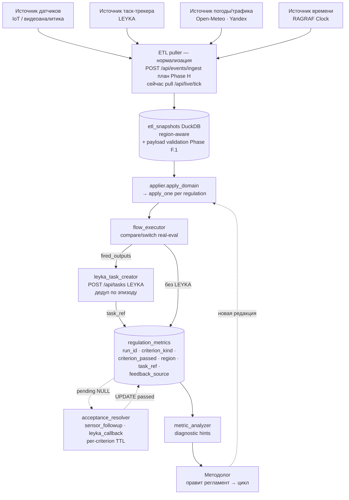

# Техническое задание

**РАГРАФ — платформа замкнутого контура между датчиком, таск-трекером,
мессенджером и человеком**

Версия: 2.1 (2026-06-11) — добавлены ролевая модель и контроль доступа (§5.6, §6.4),
контур обучения «шаблоны / черновики / сообщество» (§5.7) и голосовой ИИ-ассистент
«Сима» (§5.8). База — 2.0 (2026-05-23, переработка под задачный подход и целостный
поток данных).
Идентификатор документа: РГРФ-02-01-01-1/1-ТЗ
Оформление: ГОСТ 19.201-78, серия ГОСТ 19.

---

## Лист утверждения

| | |
|---|---|
| **Разработчик** | РАГРАФ (одиночная разработка, banksnab@gmail.com) |
| **Тема** | Платформа замкнутого контура «датчик ↔ регламент ↔ задача ↔ человек» |
| **Методологическая основа** | Задачный подход Сибирской математической школы (С.С. Гончаров, Д.И. Свириденко); Теория функциональных систем П.К. Анохина |
| **Связанные документы** | DATA-FLOW-AUDIT.md (поток данных), STRATEGY-POSITIONING.md (позиционирование), GLOSSARY.md (термины), ARC-STUDIA-ANALITIKA.md (гибридный поиск Студии), REQ-VOICE-COMPASS-PILOT.md (пилот «Сима»), BACKLOG.md (роадмап) |
| **Стадия** | Опытная эксплуатация → расширение пилотов |
| **Версия ТЗ** | 2.1 от 2026-06-11 (база 2.0 от 2026-05-23) |

---

## 1. Общие положения

### 1.1 Назначение

РАГРАФ — операционная платформа, **замыкающая контур принятия решений** между
автоматическими источниками данных (датчики IoT, таск-трекеры, бизнес-системы),
формальными регламентами реагирования и исполнителями-людьми (через мессенджеры
и таск-трекеры). Платформа реализует **полный цикл шести стадий
функциональной системы П.К. Анохина** — от афферентного синтеза события до
подкрепления методолога на основе результата.

> **Ключевой результат НИР сверх ПО.** В ходе работ сложился самостоятельный артефакт —
> **язык цифровых регламентов Flow DSL** (РИД, кандидат на стандарт), независимый от
> конкретной реализации. Настоящее ТЗ описывает требования к **программной реализации**
> языка (РАГРАФ); оформление самого языка как результата — [RESULT-FLOW-DSL.md](RESULT-FLOW-DSL.md).

### 1.2 Назначение в категориях задачного подхода

В рамках задачного подхода (Гончаров/Свириденко, 2023) каждый цифровой
регламент — это **формальная задача**, состоящая из четырёх обязательных
компонентов:

1. **Предметная область** — онтология домена в OWL/Turtle/SHACL.
2. **Запрос** — событие от датчика или таск-трекера, нормализованное в
   ETL-snapshot.
3. **Критерий решённости** — машинно-проверяемое условие «задача решена»
   (5 типов в РАГРАФ, см. §3.3).
4. **Контекст** — нормативное основание, ожидаемый исход (акцептор результата
   ТФС-3), действия при провале.

Платформа автоматизирует **сборку, исполнение, проверку и обратную связь**
по таким задачам в масштабе команды (10–10 000 регламентов) с возможностью
миграции в городскую платформу Σ Сигма при росте до 10 000+ регламентов.

### 1.3 Область применения

- ИТ-команды (РАГРАФ как ИИ-скрам-мастер над таск-трекером).
- Стройплощадки (ИИ-прораб над нарядами-допусками и видеоаналитикой).
- Городские службы (диспетчер ЖКХ, экологии, безопасности).
- Промышленные объекты (мониторинг инженерных систем).
- ЕДДС / единые диспетчерские службы (агрегация событий + регламент реагирования).
- Источники событий широкого спектра: видеоаналитика (`vd-anpr` — парковка), сейсмоакустика и
  шум (ШУМ-ИИ), оптоволоконный мониторинг (DAS), погодные и городские открытые данные.

---

## 2. Технико-экономическое обоснование

### 2.1 Рыночная ниша — пустота между датчиками и людьми

На текущем рынке (Россия + СНГ, 2026) **отсутствует целостный инструмент**,
который одновременно:

- работает над **любыми датчиками** (IoT, видеоаналитика, оптоволокно DAS,
  пожарные извещатели) через стандартизованный приём событий;
- работает над **любыми таск-трекерами** (LEYKA, Jira, YouTrack, Trello)
  через REST/webhook;
- работает над **любыми мессенджерами** (Telegram, ВКонтакте, корпоративные
  каналы) для финального доведения поручения до исполнителя;
- использует **открытые форматы W3C** (Turtle, SHACL, PROV-O) для регламентов,
  без vendor lock-in.

Существующие категории решений закрывают только **части контура** и оставляют
дыры:

| Категория решений         | Что закрывают                   | Что НЕ закрывают                                              |
|---------------------------|---------------------------------|----------------------------------------------------------------|
| **SCADA / DCS**           | сбор IoT-телеметрии, аларминг   | связь алармов с задачами людей, регламенты на «человеческом» языке |
| **BPM-системы** (Camunda, ELMA) | оркестрация шагов процесса      | работа с непрерывным потоком IoT-событий, объяснимая логика порогов |
| **Таск-трекеры** (Jira, LEYKA)   | задачи людям, статусы           | автоматическое создание задач из IoT-событий, обратная связь   |
| **Городские платформы** (Σ Сигма, ОДУ) | масштаб города, единая база знаний | лёгкий стартовый вход для команды на 10 регламентов |
| **AutoML / no-code AI**   | модели предсказания             | объяснимая логика реагирования, ГОСТ Р 59276-2020 «доверие к ИИ» |
| **LLM-агенты** (AutoGPT, CrewAI) | свободная исследовательская агентика | формальная проверяемость, аудируемость, нормативное основание |

**Уникальное место РАГРАФ:** инструмент **на стыке** датчиков, таск-трекеров
и мессенджеров, с **формально-проверяемой логикой** регламента — не «чёрный
ящик» нейросети, а декларативный DSL с трассировкой каждого решения до пункта
нормативного акта.

### 2.2 Барьер входа для конкурентов

Чтобы воспроизвести предлагаемое РАГРАФ ценностное предложение, конкурент
должен одновременно:

1. **Знать задачный подход** Сибирской математической школы — это узкая
   академическая школа (С.С. Гончаров — академик РАН, ~5 ключевых публикаций
   с 2023, ~15 человек практикующих в РФ).
2. **Уметь упаковывать задачный подход в продукт** — переводить теорию
   четырёх компонентов и шести стадий ТФС в схему данных, API и UI.
3. **Поддерживать W3C-стек** (RDF/Turtle/OWL/SHACL/PROV-O) и одновременно
   современный web-стек (React/FastAPI/DuckDB).
4. **Понимать процессное управление** в широком смысле — от ИТ-скрама до
   городской диспетчерской.

Сочетание этих четырёх компетенций в одной команде — редкое, что и
объясняет наличие свободной ниши.

### 2.3 Уровень готовности технологии (УГТ-7)

Полнофункциональный прототип в условиях, максимально приближенных к
эксплуатационным:

- ~30 регламентов в пяти доменах работают на живых данных
  (Open-Meteo / Yandex.Traffic / LEYKA / RAGRAF Clock).
- Полный замкнутый контур реализован и проверен:
  датчик → snapshot → flow_executor → output → LEYKA-задача → исполнитель →
  закрытие → проверка критерия → метрика → подсказка методологу.
- Точность принятия решений по агрегату — **93–96%** (см. DATA-FLOW-AUDIT.md §6).
- Развёрнут в продакшене (Railway), эксплуатируется в режиме «Студия команды».

### 2.4 Экономика владения

| Параметр                            | РАГРАФ                            | Сравнимая интеграция (SCADA + BPM + трекер + мессенджер на заказ) |
|-------------------------------------|-----------------------------------|--------------------------------------------------------------------|
| Время от установки до 1-го регламента | 30 минут (1 человек)              | 3–6 месяцев (команда 3–5 чел.)                                     |
| Стоимость лицензий                  | 0 ₽ (open-стек, локальная LLM)    | ≥ 5–10 млн ₽/год (Camunda Enterprise + SCADA-лицензия)             |
| Инфраструктура                      | 1 ноутбук / 1 Volume контейнер    | Кластер БД + очереди + observability                              |
| Команда сопровождения               | 1 методолог + 0.5 инженера        | 3–7 человек ОТиС                                                  |
| Объяснимость для регулятора         | ГОСТ Р 59276-2020 «по построению» | Требует отдельной разработки XAI-слоя                              |

### 2.5 Целевая ёмкость рынка

- **Сегмент 1 — ИТ-команды** (заместитель Scrum-мастера): в РФ ~50 000 команд
  разработки, конверсия 2% = 1000 потенциальных пилотов.
- **Сегмент 2 — Промышленные / строительные команды**: ~200 000 объектов с
  собственной телеметрией, конверсия 0.5% = 1000 пилотов.
- **Сегмент 3 — Муниципальные службы** (ЕДДС, ЖКХ): ~2000 единиц в РФ,
  конверсия 5% = 100 пилотов, средний чек выше.

Объединённая ёмкость на горизонте 3 лет — порядка **2000–2500 активных
инсталляций** при сохранении open-core-модели (платная — только enterprise
hosting + поддержка).

---

## 3. Постановка задачи (через задачный подход)

### 3.1 Главная задача платформы

> **Дано:** поток событий от датчиков и таск-трекеров; библиотека регламентов,
> описывающих ожидаемое поведение системы.
>
> **Требуется:** для каждого события автоматически выбрать применимые регламенты,
> исполнить логику принятия решения, создать понятное поручение исполнителю
> через мессенджер или таск-трекер, проверить что поручение выполнено в SLA
> с измеримым результатом, и накопить статистику успешности для методолога.
>
> **Критерий решённости платформы (machine-checkable):** после каждого
> закрытого эпизода в `regulation_metrics` записан `criterion_passed ∈
> {TRUE, FALSE, NULL→TRUE/FALSE}` с источником feedback_source (flow_executor /
> sensor_followup / leyka_callback / manual / timeout).

### 3.2 Декомпозиция по компонентам задачи

#### Компонент 1 — Предметная область

- **Хранение:** DuckDB authoritative + Turtle/SHACL для экспорта в Σ Сигму.
- **Редактор:** Knowledge Studio (CSV → RDF), Regulation Editor (формы / слайдеры / Turtle),
  SPARQL playground с 29 пресетами.
- **Объём:** ≈60 регламентов в 11 доменах (12 — в Ситуационном центре `/live`), включая свежие
  источники: парковка (видеодетектор `vd-anpr`), ШУМ-ИИ (сейсмоакустика / шумовой мониторинг),
  DAS-оптоволокно. Граф знаний — 14 seed-датасетов (1525 триплетов) Smart-City доменов.

#### Компонент 2 — Запрос (событие)

- **Источники:** Open-Meteo, Yandex.Traffic, LEYKA-API (опрос), RAGRAF Clock,
  опционально пуш через `POST /api/events/ingest` (план Phase H).
- **Нормализация:** `etl_snapshots(ts, source_id, subtype, field, value, region)`.
- **Валидация payload:** мягкая проверка по `sensor_field_schemas` (Phase F.1,
  warning при unknown field).
- **Триггеры:** декларативная привязка `regulation_triggers(sensor_subtype,
  event_type, source_regulation)`.

#### Компонент 3 — Критерий решённости

Пять машинно-проверяемых типов критерия:

| kind                       | Семантика                                                        | Resolver              |
|----------------------------|------------------------------------------------------------------|------------------------|
| `no_violation`             | После прогона effective_level=0 (норма)                          | flow_executor (sync)   |
| `specific_output`          | Сработала конкретная output-нода (по action/label)               | flow_executor (sync), фильтрует synthetic |
| `custom`                   | Ручная отметка методолога                                        | manual_pending         |
| `task_closed_within_sla`   | LEYKA-задача закрыта за `sla_seconds`                            | leyka_callback (точно через `/api/tasks/:ref` или агрегатный fallback) |
| `sensor_returned_normal`   | Через `followup_seconds` датчик показал value < `normal_threshold` | sensor_followup (region-aware) |

Дополнительно — `additional_criteria[]` (AND-комбинатор) и
`failure_actions[]` (действия при провале).

#### Компонент 4 — Контекст

- **Нормативное основание:** `source_document`, `source_clause`,
  `source_url`, `source_excerpt`, `source_file_path`, `source_checksum`
  (PROV-O).
- **Ожидаемый исход:** `expected_result.description` — литерал;
  семантическая LLM-проверка в backlog (см. BACKLOG.md «LLM-проверка
  ожидаемого исхода»).
- **Период действия:** `valid_from`, `valid_to`.

### 3.3 Декомпозиция по стадиям ТФС П.К. Анохина

| #  | Стадия                  | Реализация в РАГРАФ                                                                          |
|----|-------------------------|-----------------------------------------------------------------------------------------------|
| 1  | Афферентный синтез      | Триггер + параметры + ETL-payload + метаанализ предыдущих попыток (`metric_analyzer` Phase E) |
| 2  | Принятие решения        | Rule DSL: 7 типов узлов, compare с реальным operator (Phase C.1), switch как маршрутизатор по condition (Phase C.2) |
| 3  | Акцептор результата     | `expected_result.description` — модель ожидаемого исхода                                      |
| 4  | Исполнение действий     | output-ноды с `action='leyka_create_task'` создают задачи через `leyka_task_creator` с дедупликацией по эпизодам (Phase D.2) |
| 5  | Оценка результата       | `_evaluate_acceptance` + `acceptance_resolver` для гибридных kind'ов (region-aware, точный путь LEYKA) |
| 6  | Подкрепление            | `regulation_metrics` + `metric_analyzer` с diagnostic hints («регресс success-rate на 30% за неделю», «проверь expected_output_id») |

Все шесть стадий замкнуты — это означает что **критерий решённости задачного
подхода для самой платформы** машинно-проверяем: для каждого регламента
в каталоге можно ответить, на какой стадии он сейчас и сколько эпизодов
прошло на каждой стадии.

---

## 4. Целостный поток данных (требования к контуру)

### 4.1 Канонический поток

### 4.2 Требования к двунаправленности

Контур обязан быть **замкнутым**, то есть:

1. **Запрос → вердикт** (forward path): O(50 мс) на типовом регламенте,
   гарантированно за 1 ETL-тик (default 30 с).
2. **Вердикт → действие** (action path): для action='leyka_create_task'
   гарантированное создание задачи в LEYKA не позднее следующего тика,
   с дедупликацией по `regulation_id × открытый эпизод`.
3. **Действие → проверка** (callback path): после `sla_seconds` или
   `followup_seconds` — точный запрос статуса (LEYKA `/api/tasks/{ref}`
   или latest_snapshot region-aware) с записью результата.
4. **Проверка → методолог** (learning path): `metric_analyzer` сравнивает
   success-rate 7d vs 14d, перекосы по kind, timeout-rate; UI HealthBanner
   показывает actionable рекомендации.

Разрыв любого из четырёх каналов — критическая ошибка платформы. Контрольная
точка приёмки — `DATA-FLOW-AUDIT.md` §8 чек-лист.

### 4.3 Требования к временным окнам

| Окно                          | Норма     | Аварийный порог |
|-------------------------------|-----------|-----------------|
| ETL-tick (pull)               | 30 с      | > 5 мин — `etl_health.status=degraded` |
| flow_executor (одно правило)  | < 100 мс  | > 1 с — лог warning |
| acceptance_resolver (тик)     | < 1 с     | > 10 с — лог error |
| metric_analyzer (один регламент) | < 50 мс | > 500 мс — кэшировать |
| Per-criterion TTL pending     | 7 дней    | timeout=FALSE через 7 дней |

---

## 5. Функциональные требования

### 5.1 Студия методолога

- **F.1.1** Создание / правка / архивация регламента через UI без правки RDF.
- **F.1.2** Visual Flow Editor (React Flow, 7 типов узлов — `shacl_constraint` убран как узел потока: это контракт ДАННЫХ, не логика, см. 2026-06-09).
- **F.1.3** SHACL constraint editor + SHACL shape для AcceptanceCriterion.
- **F.1.4** SPARQL playground с 29 пресетами.
- **F.1.5** Knowledge Ingest Studio (CSV → RDF) для предметной области.
- **F.1.6** Версионирование регламентов с immutable snapshots и diff.

### 5.2 Контур исполнения

- **F.2.1** Per-source ETL scheduler с настраиваемыми cooldown'ами.
- **F.2.2** Flow executor с реальным compare/switch evaluation.
- **F.2.3** Synthetic evaluator как fallback для legacy фикстур.
- **F.2.4** Acceptance resolver для гибридных критериев с per-criterion TTL.
- **F.2.5** LEYKA task creator с дедупликацией по эпизодам.

### 5.3 Контур обратной связи

- **F.3.1** `regulation_metrics` с tri-state criterion_passed + feedback_source.
- **F.3.2** `metric_analyzer` с дрейф-детектором (7d vs 14d), перекосами по
  kind, timeout-rate.
- **F.3.3** UI HealthBanner с actionable hints в каждой Acceptance секции.
- **F.3.4** Sparkline success-rate за 30 дней.
- **F.3.5** Recent runs table с trace для отладки методологом.

### 5.4 Интеграция

- **F.4.1** Экспорт SIGMA-bundle (`data.ttl` + `shapes.ttl` + `manifest.json`).
- **F.4.2** Импорт SIGMA-bundle (round-trip Turtle с критериями).
- **F.4.3** LEYKA bot-account для создания и опроса задач.
- **F.4.4** Готовность к REST-приёмнику событий `POST /api/events/ingest`
  (план Phase H).

### 5.5 Связь команда → город

- **F.5.1** Экспорт всех регламентов команды в Turtle-bundle для миграции в
  Σ Сигму при превышении 10 000 регламентов в инстансе.
- **F.5.2** Сохранение vendor-neutrality: открытые форматы W3C, нет привязки
  к внутренним структурам платформы.

### 5.6 Ролевая модель и навигация по роли

- **F.6.1** Единый вход «по роли»: один переключатель внизу левой панели даёт 5 входов —
  4 рабочие роли (Аналитик / Оператор СЦ / Инженер / Руководитель) + **Админ** (под паролем).
  Показывается текущая роль; разделы левой панели фильтруются под роль.
- **F.6.2** Редактируемая матрица «роль × раздел»: админ → ⚙ «Настройки ролевой модели»
  включает/выключает видимость раздела для роли; оверрайды поверх дефолтов (хранятся локально).
- **F.6.3** Ситуационный центр — общий главный демо-экран, виден во всех 5 ролях (верхняя плитка).
- **F.6.4** Админ-вид (по паролю) показывает ВСЕ разделы без фильтра.
- *Примечание:* роли — навигационный фильтр на фронте; контроль ПРАВ — серверный (см. §6.4).

### 5.7 Контур обучения: шаблоны / черновики / сообщество

- **F.7.1** Трёхуровневая модель регламентов: **Шаблоны** (read-only, встроенные) / **Мои
  черновики** (`kind='user'`, редактируемые) / **Сообщество** (`kind='community'`, опубликованные).
- **F.7.2** Форк шаблона → личный черновик (атрибуция по email профиля автора, поле `forked_from`).
- **F.7.3** Приватность черновиков: ученик видит ТОЛЬКО свои (фильтр `/templates/tree` по email
  профиля); админ видит все (модерация). Общий корпус для не-админа — read-only.
- **F.7.4** Публикация черновика в Сообщество (`kind='user' → 'community'`): авторство = email,
  видимость для всех ролей.
- **F.7.5** Профиль автора (email) хранится локально — мост до полноценной авторизации (бэклог
  «Обучающий контур», Фаза 3: идентичность / разовые пароли через LEYKA).

### 5.8 Голосовой ИИ-ассистент «Сима» (RAG-компас по регламентам)

- **F.8.1** Студия аналитика: диалог по корпусу регламентов с **цитатами** (имя регламента + ID +
  пункт норматива) и **анти-галлюцинацией** (честное «такого регламента нет» вместо выдумки).
- **F.8.2** **Гибридный (нейро-символьный) поиск**: символьный фасет (домен / класс датчика) ⨉
  векторные эмбеддинги (bge-m3 / qwen3). Деградации: TF-IDF/keyword без эмбеддингов, mock-ответ
  без LLM, ретраи с backoff на 429 облачного провайдера.
- **F.8.3** Голосовой ввод (Web Speech API, `ru-RU`) с wake-word «Сима»; единое имя ассистента
  системы (созвучно «Сигма»).
- **F.8.4** Живой прогон в чат (вердикт последнего ETL-прогона регламента) и создание черновика
  из текста (извлечение параметров с единицами).
- *Документы:* ARC-STUDIA-ANALITIKA.md (архитектура поиска), REQ-VOICE-COMPASS-PILOT.md
  (пилот; статус — испытания начались).

---

## 6. Технические требования

### 6.1 Архитектура

- **Backend:** FastAPI + Pydantic + DuckDB + rdflib.
- **Frontend:** React + Vite + TanStack Query + Tailwind + Lucide.
- **ETL:** asyncio scheduler в lifespan FastAPI, single-process для команды.
- **LLM:** multi-provider (Ollama / Cerebras / Groq / OpenRouter / OpenAI),
  без жёсткой привязки.

### 6.2 Производительность

- Pull-цикл всех источников за тик: ≤ 30 с.
- Apply одного домена (10 регламентов): ≤ 5 с.
- Резолвер pending метрик за тик: ≤ 1 с на 1000 pending.

### 6.3 Надёжность

- WAL-only recovery в `start.sh` (двухстадийный probe).
- Lifespan-CHECKPOINT на shutdown.
- Try/except оборачивание best-effort sync'ов (Flow→Form, Flow→Triggers,
  Flow→Criterion) — сбой sync'а не валит save.

### 6.4 Безопасность

- Single-secret admin auth через `ADMIN_PASS` + HMAC-cookie (dependency `require_admin`).
  `ADMIN_PASS` пуст → защита выключена (dev/демо, все = админ); задан → защищённые endpoint'ы
  требуют cookie. `hmac.compare_digest` (constant-time), cookies httpOnly + secure на https.
- **Роли (analyst/operator/engineer/executive) — навигационный фильтр на фронте, НЕ контроль
  прав.** Серверный контроль доступа — только `require_admin`.
- `require_admin` покрывает разрушающие/структурные мутации: DELETE/PUT регламентов и их Turtle,
  шаблоны датчиков (sensor-subtypes) и их поля, knowledge-датасеты, ETL-пульт, домены графа +
  (Фаза 0, 2026-06-11) modules/processes, словарь извлечения, knowledge-импорт и lifecycle
  регламентов (archive / publish / restore / source-upload / sigma-import).
- Создание регламента (`POST /regulations`) и правка потока (`PUT /{id}/flow`) намеренно открыты —
  это учебный цикл; изоляция ученических правок — через приватные черновики (§5.7).
- ingest-приёмники (ANPR, ШУМ-ИИ) защищены `X-Ingest-Token` (машинный ops-контур, не require_admin).
- Protected sensor_subtypes (интеграции не удаляются случайным кликом); ПДн (ГРЗ) маскируются
  не-админам (152-ФЗ).

### 6.5 Совместимость

- ГОСТ Р 59276-2020 «Способы обеспечения доверия» — объяснимость и
  аудируемость по построению.
- W3C: RDF 1.1, OWL 2, SHACL, PROV-O.
- ГОСТ 19.201-78 — оформление документации.

---

## 7. Стадии и сроки

Платформа разрабатывается итерационно. Главные этапы (от 2026-05):

| Этап        | Содержание                                              | Статус             |
|-------------|---------------------------------------------------------|--------------------|
| Phase 0     | Author Layer (Studio, формы, Turtle)                    | ✅ закрыто 2026-05  |
| Phase 1+2+3 | Критерий решённости (Гончаров/Свириденко)              | ✅ закрыто 2026-05  |
| Phase A     | P0 фиксы (synthetic, region, custom)                   | ✅ закрыто 2026-05  |
| Phase B     | SHACL для критерия + UI warning bar                    | ✅ закрыто 2026-05  |
| Phase C.1   | Compare real evaluation                                 | ✅ закрыто 2026-05  |
| Phase C.2   | Switch real evaluation с edge.condition routing        | ✅ закрыто 2026-05  |
| Phase D.1   | task_ref колонка + LEYKA `/api/tasks/{ref}` resolver   | ✅ закрыто 2026-05  |
| Phase D.2   | leyka_task_creator с дедупом по эпизодам               | ✅ закрыто 2026-05  |
| Phase E     | metric_analyzer + diagnostic hints                     | ✅ закрыто 2026-05  |
| Phase F.1   | Payload validation на ETL-приёме                       | ✅ закрыто 2026-05  |
| Phase F.2   | Flow → Criterion sync                                   | ✅ закрыто 2026-05  |
| 2026-06     | Ролевая модель + матрица, голосовая «Сима» (RAG-компас), черновики/шаблоны/сообщество, безопасность (require_admin Фаза 0) | ✅ закрыто 2026-06 |
| Phase G     | LLM-проверка expected_result (семантическая)           | 🟡 backlog          |
| Phase H     | Webhook-медиатор, push-events, RBAC                    | 🟡 backlog SIGMA-#1, #2, #3 |
| Phase I     | Migration toolkit РАГРАФ → Σ Сигма                     | 🟡 при пилоте города |

Подробный план — DATA-FLOW-AUDIT.md §7 + BACKLOG.md.

---

## 8. Контрольные точки приёмки

Платформа считается принятой в опытную эксплуатацию при выполнении всех
пунктов:

1. **Замкнутый контур работает E2E:** один реальный регламент проходит
   датчик → snapshot → flow_executor → LEYKA-задача → закрытие → resolver →
   metrics с успешным criterion_passed.
2. **Точность принятия решений ≥ 90%** на корпусе ≥ 20 регламентов за
   ≥ 1000 эпизодов.
3. **Все 4 компонента задачи и все 6 стадий ТФС** имеют рабочие реализации
   (см. `/methodology` в UI).
4. **DATA-FLOW-AUDIT.md** показывает закрытыми ≥ 10 из 12 узлов плана.
5. **SHACL shape** для AcceptanceCriterion валидируется через pyshacl без
   ошибок на всех seed-фикстурах.
6. **Round-trip Turtle:** регламент → TTL-export → TTL-import → регламент
   (равенство по содержанию).
7. **Migration smoke:** Turtle-bundle регламентов открывается в Apache Jena
   FUSEKI без ошибок (готовность к Σ Сигме).
8. **UI Methodology page** показывает «12 из 13 узлов закрыто, 4 компонента
   полны, 6 стадий ТФС полны».

---

## 9. Связь с другими системами

### 9.1 LEYKA (таск-трекер)

- РАГРАФ имеет bot-аккаунт (`LEYKA_BOT_EMAIL`, `LEYKA_BOT_PASSWORD`).
- Pull: 11 derived метрик через `pull_leyka` каждые 5 мин.
- Push: создание задач через `leyka_task_creator.ensure_task` с дедупликацией.
- Callback: точная проверка статуса задачи через `/api/tasks/{ref}` в
  acceptance_resolver.

### 9.2 Σ Сигма (городская платформа, в разработке)

- РАГРАФ позиционируется как **студия команды** (10–10 000 регламентов).
- Σ Сигма — **городская платформа** (10 000+ регламентов, единая база
  знаний).
- Связь — через **открытые форматы W3C**: один и тот же Turtle/SHACL
  переносится между ними файлами без переписывания.
- Никакой жёсткой связности: у потребителя всегда есть выбор остаться в
  РАГРАФ или мигрировать в Σ Сигму, регламенты остаются собственностью
  заказчика.

### 9.3 Мессенджеры (Telegram + email + ВКонтакте)

- Notification configurator (план SIGMA-#5): UI «кому, по какому каналу, при
  какой критичности».
- Доставка через output-ноды flow с action='telegram_send' / 'email_send'
  или внешними webhook'ами.
- Регистрация факта доставки в `notification_log` для аудита.

### 9.4 Внешние системы заказчика

- REST API: документированный набор endpoint'ов
  (`/api/regulations`, `/api/flow`, `/api/events/ingest`, `/api/live`,
  `/api/audit-log`).
- Webhook: POST на регистрированные URL при срабатывании регламента (план
  SIGMA-#3).
- Экспорт: SIGMA-bundle (ZIP с TTL+SHACL+manifest).

---

## 10. Требования к документации

| Документ                        | Назначение                                                    | Статус    |
|---------------------------------|---------------------------------------------------------------|-----------|
| ARC.md                          | Архитектура платформы (19 разделов)                          | ✅ актуально |
| DATA-FLOW-AUDIT.md              | Аудит потока данных + mermaid + план до 95%+                 | ✅ актуально |
| STRATEGY-POSITIONING.md         | Позиционирование, 10-узловой стратегический план             | ✅ актуально |
| GLOSSARY.md                     | Глоссарий из 18 частей (включая задачный подход)             | ✅ актуально |
| README.md                       | Главная точка входа + mermaid-диаграммы потока               | ✅ актуально |
| BACKLOG.md                      | Очередь идей + LLM-проверка expected_result                  | ✅ актуально |
| REQ-SIGMA-INTEGRATION.md        | 4 вектора стыковки + 10 открытых вопросов                    | ✅ актуально |
| TZ_RAGRAF.md (этот документ)    | Техническое задание ГОСТ-19                                   | ✅ актуально |
| `/methodology` UI               | Публичный whitepaper по задачному подходу                    | ✅ актуально |

---

## Приложение А — Условия миграции на промышленный масштаб

Текущая инфраструктура РАГРАФ (DuckDB embedded + single-process FastAPI)
рассчитана на **команду**. При достижении следующих порогов **необходима
миграция инфраструктуры или переход в Σ Сигму:**

| Параметр                   | Порог комфорта | Порог насыщения | Действие при превышении                   |
|----------------------------|----------------|------------------|--------------------------------------------|
| Регламенты в инстансе      | 1 000          | 10 000           | Миграция в Σ Сигму (Apache Jena/FUSEKI)   |
| Эпизоды/день               | 10 000         | 100 000          | Шардирование DuckDB или Postgres-миграция |
| Параллельные методологи    | 5              | 20               | RBAC + полная авторизация (Phase H)        |
| Команд / организаций       | 1              | 5+               | Multi-tenant Σ Сигма или sharded РАГРАФ   |

Миграция не требует переписывания регламентов: Turtle + SHACL — открытые
форматы W3C, Σ Сигма принимает их через `POST /api/import/bundle`.

---

## Приложение Б — Соответствие задачному подходу

### Б.1 Маппинг компонентов задачи на код

| Компонент задачи            | Поле модели / модуль                                                |
|-----------------------------|----------------------------------------------------------------------|
| Предметная область          | DuckDB tables + `turtle_bridge` + Knowledge Studio                  |
| Запрос                      | `SensorReading`, `RegulationTrigger`, `puller.*`                    |
| Критерий решённости         | `Regulation.acceptance_criterion`, `validate_criterion`             |
| Контекст                    | `Regulation.expected_result`, `failure_actions`, PROV-O attachment  |

### Б.2 Маппинг шести стадий ТФС на код

| #  | Стадия              | Модуль                                                              |
|----|---------------------|---------------------------------------------------------------------|
| 1  | Афферентный синтез  | `metric_analyzer`, `etl_snapshots`, `regulation_triggers`           |
| 2  | Принятие решения    | `flow_executor` (compare/switch real-eval)                         |
| 3  | Акцептор результата | `Regulation.expected_result.description`                            |
| 4  | Исполнение действий | output-ноды → `leyka_task_creator.ensure_task`                      |
| 5  | Оценка результата   | `_evaluate_acceptance`, `acceptance_resolver`                       |
| 6  | Подкрепление        | `regulation_metrics`, `metric_analyzer.compute_diagnostic_hints`    |

### Б.3 Маппинг функциональных блоков 2026-06 (F.6–F.8) на код

| Требование                           | Реализация (модуль / файл)                                          |
|--------------------------------------|----------------------------------------------------------------------|
| F.6 Ролевая модель + матрица         | `SideRail.tsx` (RoleAdminSwitcher), `lib/roles.ts`, `lib/navSections.ts` (матрица); бэк — `auth.require_admin` |
| F.7 Черновики / шаблоны / сообщество  | `api/templates.py`, `template_service.py` (fork/publish, поле `kind`), `components/regulations-tree/`, `components/drafts/DraftsScreen.tsx` |
| F.8 Голосовая «Сима» (RAG-компас)    | `services/sandbox.py` (chat), `embedding_index.py` (гибридный поиск), `components/sandbox/SandboxScreen.tsx` (STT) |

### Б.4 Литература

- Vityaev E.E., Goncharov S.S., Sviridenko D.I. (2023). Task-driven
  approach to artificial intelligence. Cognitive Systems Research, V.81,
  P.50–56.
- Гончаров С.С., Свириденко Д.И. (1989). Σ-Programming. Amer. Math. Soc.
  Transl., V.142.
- Витяев Е.Е. (2006). Извлечение знаний из данных. Изд-во НГУ.
- Анохин П.К. (1975). Очерки по физиологии функциональных систем.

---

*Документ актуализирован 2026-05-23 одновременно с реализацией Phase A–F и
P2, формализующих замкнутый контур платформы от датчика до исполнителя
с обратной связью методологу.*
