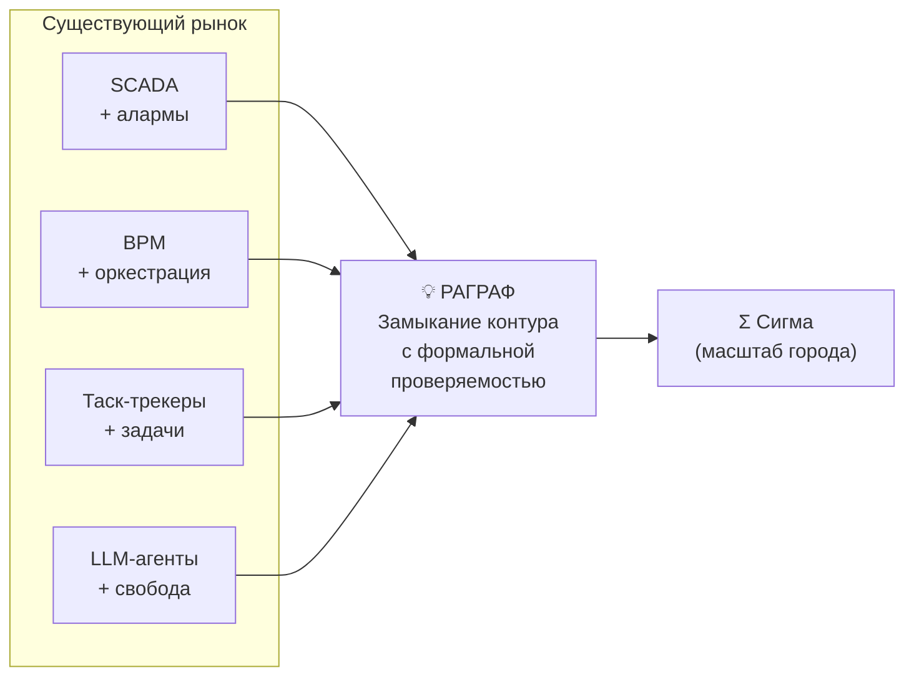
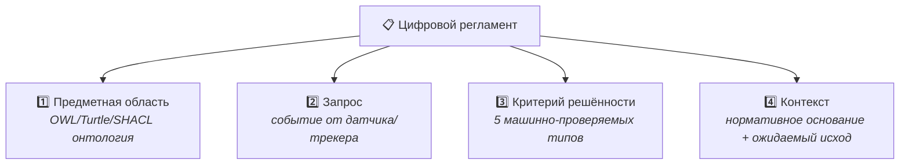
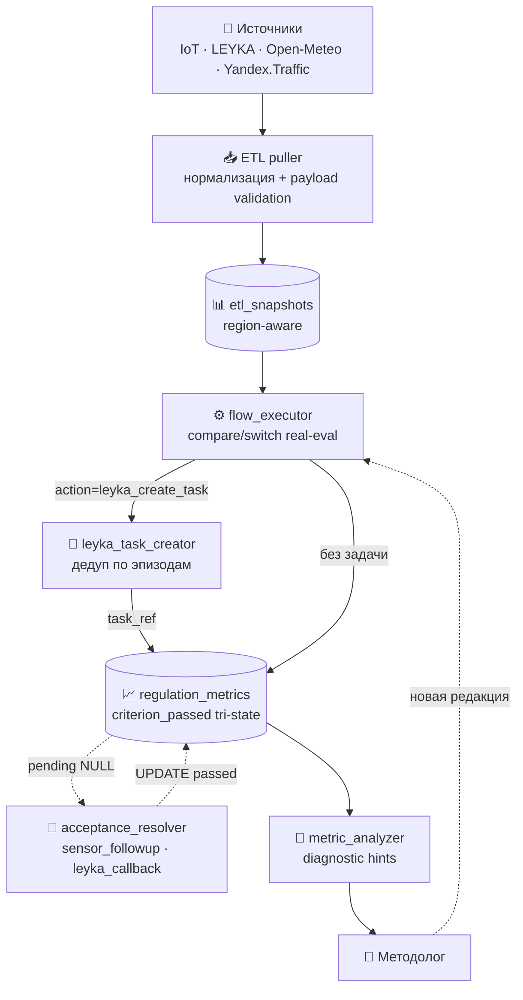
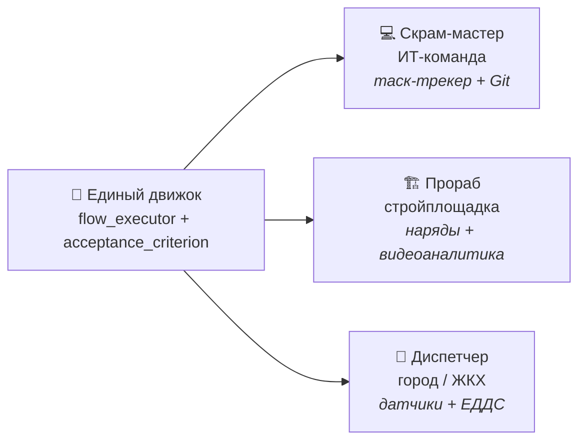
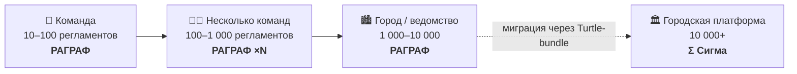
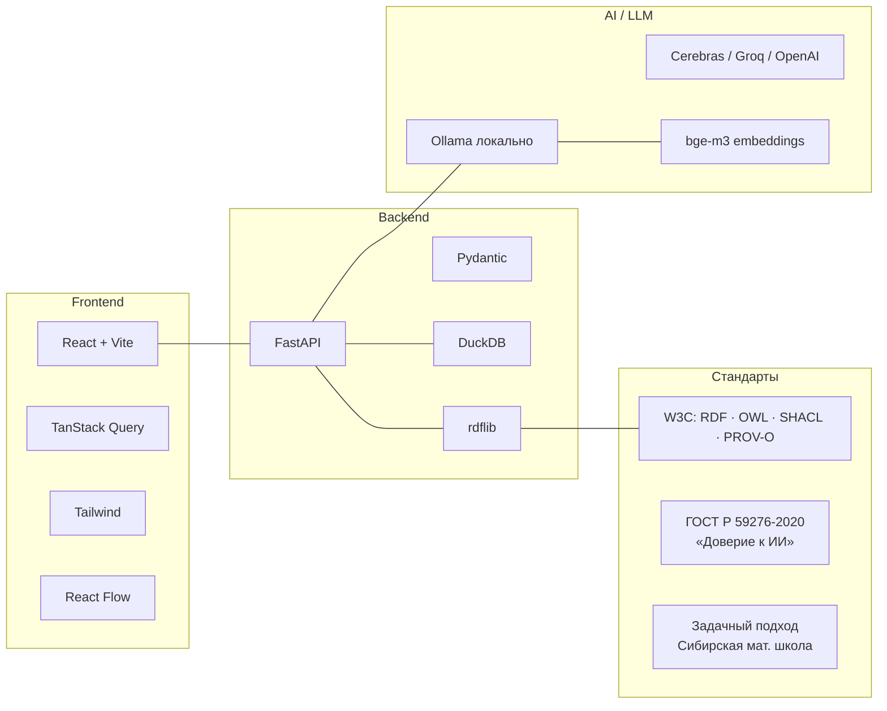
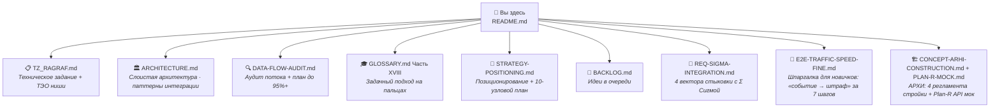
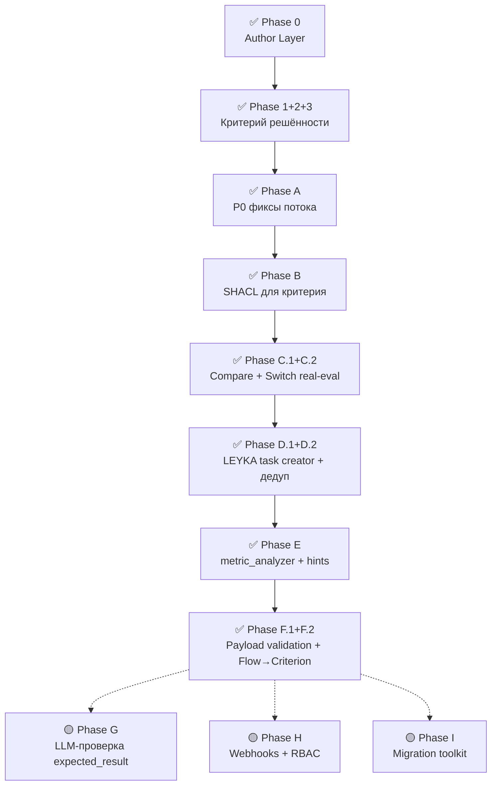
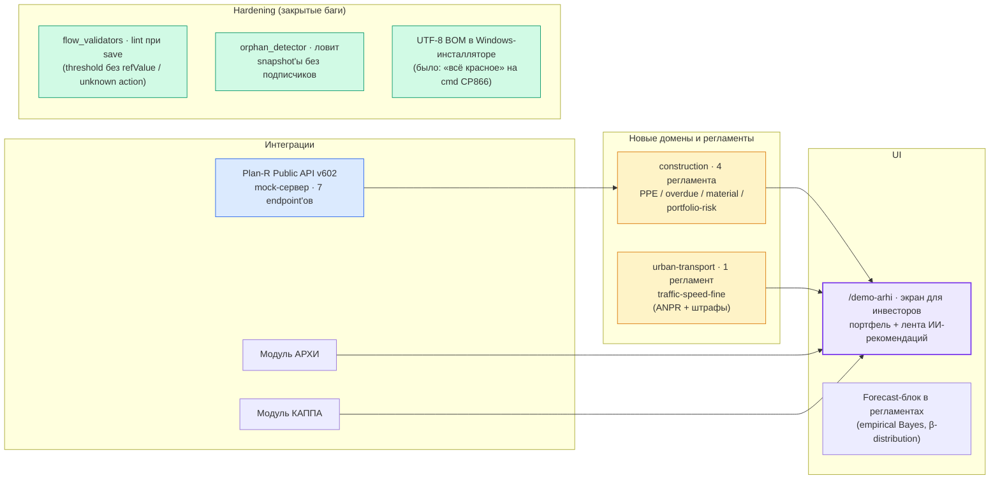

# РАГРАФ

> **Задачи перестают теряться между датчиком и человеком.**
>
> Платформа замыкает контур: датчик или таск-трекер замечает событие,
> регламент решает что делать, исполнитель получает понятное поручение в
> мессенджере — и факт возвращается обратно в систему.

[**🎯 Лендинг**](https://ragraf.up.railway.app) · [**📐 Студия**](https://ragraf.up.railway.app/regulations) · [**🧠 Методология**](https://ragraf.up.railway.app/methodology) · [**📊 Live ETL**](https://ragraf.up.railway.app/live)

---

## Зачем РАГРАФ

На текущем рынке отсутствует целостный инструмент, который **одновременно**
работает над датчиками, таск-трекерами и мессенджерами с **формально-проверяемой
логикой** регламента — не «чёрный ящик» нейросети, а декларативный DSL с
трассировкой каждого решения до пункта нормативного акта.



→ Подробное ТЭО ниши: [docs/TZ_RAGRAF.md §2](docs/TZ_RAGRAF.md#2-технико-экономическое-обоснование).

---

## Главная идея — задачный подход

РАГРАФ — практическая реализация **задачного подхода** Сибирской математической
школы (С.С. Гончаров, Д.И. Свириденко, 2023). Каждый цифровой регламент — это
формальная задача из **четырёх обязательных компонентов**:



И реализует **полный цикл шести стадий функциональной системы П.К. Анохина**
— от афферентного синтеза события до подкрепления методолога на основе
результата.

→ Теория «на пальцах» с примером: [docs/GLOSSARY.md Часть XVIII](docs/GLOSSARY.md)
→ Whitepaper: [/methodology](https://ragraf.up.railway.app/methodology)

---

## Замкнутый контур данных



**Точность принятия решений по агрегату — 93–96%** на текущем корпусе из
~30 регламентов в 5 доменах.

→ Полный аудит потока данных + план до 95%+: [docs/DATA-FLOW-AUDIT.md](docs/DATA-FLOW-AUDIT.md)
→ Архитектура по слоям: [docs/ARCHITECTURE.md](docs/ARCHITECTURE.md)

---

## Один движок — три знакомые роли



Меняется только набор источников и порогов — поведение становится знакомой
ролью для вашей сферы.

→ Подробное позиционирование: [docs/STRATEGY-POSITIONING.md](docs/STRATEGY-POSITIONING.md)

---

## Размер решения — лестница масштаба



Регламенты переносятся **файлами** (Turtle + SHACL — открытые форматы W3C).
Никакого vendor lock-in: у потребителя всегда есть выбор остаться в РАГРАФ
или вырасти в Σ Сигму.

| Параметр                | РАГРАФ                            | Σ Сигма (в разработке)              |
|-------------------------|------------------------------------|--------------------------------------|
| Целевой размер          | 10–10 000 регламентов / команда   | 10 000+ регламентов / город          |
| Хранилище               | DuckDB + rdflib                   | Apache Jena / FUSEKI                 |
| События                 | DuckDB `etl_snapshots`, pull       | Kafka / RabbitMQ, push               |
| Развёртывание           | 1 ноутбук / 1 контейнер           | Кластер в ИТ-инфраструктуре города   |
| Формат регламента       | **Turtle + SHACL (W3C)**           | **Тот же Turtle + SHACL**            |

---

## Внешние модули и интеграции

```mermaid
flowchart TB
    RAGRAF["🎯 РАГРАФ"]
    subgraph "Датчики и видеоаналитика"
        IOT["IoT-теплосеть"]
        AIR["Качество воздуха"]
        DAS["DAS / оптоволокно"]
        CCTV["Видеоаналитика<br/>ANPR-парковки + улицы"]
        ADPI["Пожарные извещатели"]
        BMS["Инженерные сети зданий"]
        PPE["СИЗ-аналитика<br/>(каски/жилеты)"]
    end
    subgraph "Таск-трекеры"
        LEYKA["LEYKA"]
        JIRA["Jira · YouTrack"]
    end
    subgraph "Внешние данные"
        METEO["Open-Meteo"]
        TRAFFIC["Yandex.Traffic"]
        PLANR["Plan-R PMS<br/>(стройка, мок v602)"]
        ODS1C["1С / ЭДО<br/>(расхождения поставок)"]
    end
    subgraph "Модули ЦИИ НГУ"
        ARHI["Платформа АРХИ<br/>(управление стройкой)"]
        KAPPA["Фреймворк КАППА<br/>(валидация датасетов)"]
    end
    subgraph "Мессенджеры"
        TG["Telegram"]
        EMAIL["Email"]
        VK["ВКонтакте"]
        SMS["SMS"]
    end

    IOT & AIR & DAS & CCTV & ADPI & BMS & PPE --> RAGRAF
    LEYKA & JIRA --> RAGRAF
    METEO & TRAFFIC & PLANR & ODS1C --> RAGRAF
    ARHI & KAPPA --> RAGRAF
    RAGRAF --> TG & EMAIL & VK & SMS
    RAGRAF -.->|"Turtle-bundle при росте"| SIGMA["Σ Сигма"]
```



→ Детали 13 seed-модулей + контракты интеграции: [docs/REQ-SIGMA-INTEGRATION.md](docs/REQ-SIGMA-INTEGRATION.md), [docs/PLAN-R-MOCK.md](docs/PLAN-R-MOCK.md), [docs/CONCEPT-ARHI-CONSTRUCTION.md](docs/CONCEPT-ARHI-CONSTRUCTION.md)

---

## Технический стек



- **Multi-provider LLM:** одна переменная `LLM_PROVIDER` переключает между
  Ollama / Cerebras / Groq / OpenRouter / OpenAI / mock.
- **Embedded DuckDB:** один файл, без кластера, мигрирует через WAL-recovery.
- **Open W3C formats:** регламент = `data.ttl` + `shapes.ttl` + `manifest.json`.

---

## Быстрый старт

```bash
# 1. Клон + установка
git clone https://github.com/Barbashin1970/RAGRAF.git
cd RAGRAF
make install

# 2. Запуск
make dev   # backend (FastAPI :8000) + frontend (Vite :5173)

# 3. Открыть в браузере
open http://localhost:5173
```

Готовые инсталляторы для конечных пользователей:
- **Windows:** [installer/INSTALL-WINDOWS.md](installer/INSTALL-WINDOWS.md)
- **macOS:** [installer/INSTALL-MACOS.md](installer/INSTALL-MACOS.md)

Деплой в продакшен:
- **Railway** (текущий прод): [docs/DEPLOY.md](docs/DEPLOY.md)
- **Fly.io:** [docs/DEPLOY-FLY.md](docs/DEPLOY-FLY.md)
- **Vercel** (только лендинг): [docs/DEPLOY-VERCEL.md](docs/DEPLOY-VERCEL.md)

---

## Главные документы — что читать дальше



| Документ                                                      | Когда читать                                      |
|---------------------------------------------------------------|---------------------------------------------------|
| [TZ_RAGRAF.md](docs/TZ_RAGRAF.md)                             | Хочу понять задачу платформы и ТЭО ниши           |
| [ARCHITECTURE.md](docs/ARCHITECTURE.md)                       | Хочу разобраться в слоистой архитектуре + паттерны интеграции|
| [DATA-FLOW-AUDIT.md](docs/DATA-FLOW-AUDIT.md)                 | Хочу точную карту потока + список разрывов и фиксов|
| [STRATEGY-POSITIONING.md](docs/STRATEGY-POSITIONING.md)       | Хочу понять позиционирование и стратегический план|
| [GLOSSARY.md](docs/GLOSSARY.md)                               | Хочу глоссарий из 18 частей включая задачный подход|
| [BACKLOG.md](docs/BACKLOG.md)                                 | Хочу увидеть очередь идей и что в работе          |
| [REQ-SIGMA-INTEGRATION.md](docs/REQ-SIGMA-INTEGRATION.md)     | Хочу понять как соединить РАГРАФ с городской Σ Сигмой|
| [SMART_CITY_ONTOLOGIES.md](docs/SMART_CITY_ONTOLOGIES.md)     | Хочу увидеть онтологии 10 Smart-City доменов      |
| [FORMULA-SPEC.md](docs/FORMULA-SPEC.md)                       | Хочу спецификацию formula evaluator (AST + Kleene)|
| [SKILL-D0SL.md](docs/SKILL-D0SL.md)                           | Хочу разобраться в Rule DSL                       |
| [RAGRAF_UserManual_GOST19.md](docs/RAGRAF_UserManual_GOST19.md) | Хочу пользовательскую инструкцию по ГОСТ 19      |
| [E2E-TRAFFIC-SPEED-FINE.md](docs/E2E-TRAFFIC-SPEED-FINE.md)   | Я новичок — хочу понять путь данных «датчик → штраф» за 7 шагов |
| [CONCEPT-ARHI-CONSTRUCTION.md](docs/CONCEPT-ARHI-CONSTRUCTION.md) | Хочу разобраться в АРХИ-домене (стройка через РАГРАФ) |
| [PLAN-R-MOCK.md](docs/PLAN-R-MOCK.md)                         | Хочу понять Plan-R интеграцию + мок-сервер на 7 endpoint'ах |
| [regulation-flows/](docs/regulation-flows/)                   | Хочу посмотреть **40 примеров регламентов** в виде Mermaid-диаграмм (GitHub рендерит нативно): 10 доменов — стройка, ЕДДС, теплоснабжение, ЖКХ, экология, кампус НГУ, ИТ-поддержка и др. Каждая карточка — граф Rule DSL Flow + ссылки на исходные `*.flow.json` / `*.data.ttl` / `*.shapes.ttl`. Регенерируется скриптом `scripts/export_flows_to_mermaid.py`. |
| [COURSE-RAGRAF-V1.md](docs/COURSE-RAGRAF-V1.md)               | Хочу программу курса повышения квалификации «РАГРАФ — собери своего ИИ-модератора» (72 ак. ч., 7 модулей + защита, LEYKA как LMS курса) |
| [COURSE-SYSTEM-ANALYST-V1.md](docs/COURSE-SYSTEM-ANALYST-V1.md) | Хочу методическое пособие «Системный аналитик в эпоху гибридного ИИ» — продолжение РАГРАФ-курса для тех, кто идёт дальше в проектирование гибридных ИИ-систем класса РАГРАФ/LEYKA/Σ Сигма (12 спринтов + дипломный проект + послесловие, ~9 месяцев self-study, ~6100 строк). Сквозная идея: гибридный ИИ с дообучением через опыт человека-эксперта — путь к сильному ИИ |

---

## Структура репозитория

```
RAGRAF/
├── backend/                    # FastAPI + DuckDB + Pydantic
│   ├── app/
│   │   ├── api/                # routers по доменам
│   │   ├── services/           # бизнес-логика
│   │   │   ├── etl/            # puller, applier, scheduler, acceptance_resolver
│   │   │   ├── flow_executor.py
│   │   │   ├── leyka_task_creator.py
│   │   │   ├── metric_analyzer.py
│   │   │   ├── regulation_store.py
│   │   │   ├── turtle_bridge.py
│   │   │   └── validator.py
│   │   ├── schemas/            # Pydantic-домен
│   │   └── main.py
│   └── data/fixtures/          # seed-регламенты (Turtle + SHACL + flow.json)
├── frontend/                   # React + Vite
│   ├── src/
│   │   ├── components/
│   │   │   ├── landing/        # LandingScreen
│   │   │   ├── methodology/    # /methodology whitepaper
│   │   │   ├── regulations/    # Regulation Editor
│   │   │   ├── flow/           # Flow Editor (React Flow)
│   │   │   └── knowledge/      # Knowledge Ingest Studio
│   │   └── lib/                # api.ts, schemas.ts
│   └── package.json
├── docs/                       # вся документация
└── installer/                  # инсталляторы Windows + macOS
```

---

## Что внутри платформы (по фазам реализации)



**Сделано:** 12/13 узлов плана · 4 компонента задачи полны · 6 стадий ТФС полны · точность 93–96%.

→ Детально по фазам: [docs/DATA-FLOW-AUDIT.md §7](docs/DATA-FLOW-AUDIT.md#7-что-осталось-в-плане)

---

## Свежие добавки (2026 Q2)



| Что | Где | Зачем |
|---|---|---|
| **Платформа АРХИ + Plan-R мок** | `backend/app/api/_planr_mock.py`, [docs/PLAN-R-MOCK.md](docs/PLAN-R-MOCK.md) | Демонстрация переноса функционала ТЗ АРХИ (НГУ ЦИИНГУ, 2024) на стек РАГРАФ. 4 строительных регламента + ETL-puller `pull_planr()` с region=`_global`. |
| **`/demo-arhi` · экран для инвесторов** | `frontend/src/components/demo-arhi/DemoArhiScreen.tsx`, [api/demo_arhi.py](backend/app/api/demo_arhi.py) | 3-колонка «Один день стройки»: портфель из 4 объектов + 7 событий с ИИ-рекомендациями + риск-скоринг. Капабилити-карта Plan-R для питча. |
| **Домен `urban-transport`** | [traffic-speed-fine.flow.json](backend/data/fixtures/traffic-speed-fine.flow.json) + [E2E-шпаргалка](docs/E2E-TRAFFIC-SPEED-FINE.md) | Первый регламент: ANPR-камера + ступенчатые штрафы (КоАП ст. 12.9). Эталонный e2e-сценарий для документации. |
| **Forecast (empirical Bayes)** | `backend/app/services/forecast.py`, [docs/REQ-FORECAST-FEATURE.md](docs/REQ-FORECAST-FEATURE.md) | 4-й уровень модели Палчунова (вероятностный). β-distribution апостериори. Gated: minimum 10 runs. |
| **Flow lint validators** | [backend/app/services/flow_validators.py](backend/app/services/flow_validators.py) | Bug-2 (threshold без refValue) + Bug-4 (output.action не в реестре) — non-blocking warnings при save. |
| **Orphan ETL detector** | [backend/app/services/etl/orphan_detector.py](backend/app/services/etl/orphan_detector.py), endpoint `/api/etl/orphans` | Bug-1: snapshot'ы пишутся в DB, но регламента-подписчика нет → rate-limited audit alert. |
| **Модули АРХИ + КАППА** | `backend/app/services/module_store.py` | Аддитивный seed двух модулей-партнёров ЦИИ НГУ в библиотеку Прикладных модулей. |
| **Windows-инсталлятор v2 — чистая машина за один клик** | [installer/ragraf.ps1](installer/ragraf.ps1), [installer/start-ragraf.bat](installer/start-ragraf.bat), [installer/ragraf.ico](installer/ragraf.ico), [installer/INSTALL-WINDOWS.md](installer/INSTALL-WINDOWS.md) | CRLF EOL через `.gitattributes` (раньше `.bat` схлопывался моментально на LF); `winget` авто-установка Git + Python 3.13 + Node LTS с `--scope user` (без UAC, fallback на machine-scope); `Test-Dependency` отсеивает Microsoft Store Python alias; `Update-PathFromRegistry` подхватывает свежий PATH в той же сессии — без перезапуска `.bat`; `git config core.longpaths true` (защита от 260-символьного лимита в `node_modules`); Desktop-shortcut «RAGRAF» с золотой Σ-иконкой (`installer/ragraf.ico`, 7 размеров), указывает на `_run-server.ps1`. |
| **Двусторонняя LEYKA-интеграция (sensor ↔ output)** | [backend/app/services/leyka_task_poller.py](backend/app/services/leyka_task_poller.py), [backend/app/api/leyka.py](backend/app/api/leyka.py), [frontend/src/components/flow/LinkToLeykaDialog.tsx](frontend/src/components/flow/LinkToLeykaDialog.tsx), [frontend/src/components/flow/LinkSensorToLeykaDialog.tsx](frontend/src/components/flow/LinkSensorToLeykaDialog.tsx) | Output-узел Flow → кнопка «Связать с LEYKA» создаёт задачу с deep-link обратно в регламент. Sensor-узел → кнопка «Привязать к LEYKA-задаче» (trigger=`status_changed`); фоновый поллер каждые 30с замечает смену статуса и дёргает `execute_flow`. При срабатывании регламента автокомментарий улетает в чат привязанных задач (`leyka_pings[]` в response). Все 4 ЦДР стройплощадки демонстрируются на проекте «Платформа АРХИ» в LEYKA — см. [PROGRESS-ARHI-2026-05-27.md](docs/PROGRESS-ARHI-2026-05-27.md). |
| **Лендинг — реструктуризация 10 секций + новый раздел «01 Методология»** | [frontend/src/components/landing/LandingScreen.tsx](frontend/src/components/landing/LandingScreen.tsx) | Полная переработка: раздел 01 теперь «Методология» (3 карточки — задачный подход, ТФС Анохина, онтологическая модель Пальчунова) — научный «козырь» сразу под Hero; разделы 04 «Эффект и окупаемость» (мерж бывших 04 + 08) + 10 «Стек и масштаб» (мерж стек + бывший 06½ «Размер»); новые «длинно-хвостовые» 08 Экономика, 09 Рынок, 10 Стек+масштаб (не в навигации). Hero-CTA синхронизированы с якорями (раньше «Узнать больше» вело в Методологию вместо ROI). Унифицирован термин «модератор» (вместо «модератор»/«заместитель»). Лингвистический аудит и упрощение для смешанной аудитории строителей/диспетчеров/ИТ-команд. |
| **Zod sensorType sync** | [frontend/src/lib/schemas.ts](frontend/src/lib/schemas.ts) + [test_sensor_type_enum_sync.py](backend/tests/test_sensor_type_enum_sync.py) | Регресс-тест: backend `Literal SensorType` ↔ frontend `z.enum`. Без него страница Flow Editor показывала 0 узлов вместо реальных. |

→ Подробный e2e-проход для новичков: [docs/E2E-TRAFFIC-SPEED-FINE.md](docs/E2E-TRAFFIC-SPEED-FINE.md)

---

## Учебные материалы и связанные проекты

- **Методология on-line:** [/methodology](https://ragraf.up.railway.app/methodology) — публичный whitepaper по задачному подходу.
- **Тренажёр операторов:** [sigma-operator.vercel.app/operator](https://sigma-operator.vercel.app/operator) — учебный сайт по компетенциям операторов СЦ.
- **Каппа** (проверка знаний): эксперты сообщества подтверждают онтологии — связанный некоммерческий проект.

Литература по теории:
- Vityaev E.E., Goncharov S.S., Sviridenko D.I. (2023). *Task-driven approach to artificial intelligence.* Cognitive Systems Research, V.81, P.50–56.
- Гончаров С.С., Свириденко Д.И. (1989). *Σ-Programming.* AMS Translations, V.142.
- Анохин П.К. (1975). *Очерки по физиологии функциональных систем.*

---

## Сообщество и контакты

- **GitHub:** [github.com/Barbashin1970/RAGRAF](https://github.com/Barbashin1970/RAGRAF)
- **Email:** banksnab@gmail.com
- **Issues и предложения:** через GitHub Issues — открыто.

---

## Лицензия и происхождение

**РАГРАФ построен на открытых инструментах** (Python/FastAPI, React/TypeScript, DuckDB,
rdflib и др. — под лицензиями MIT / Apache 2.0 / BSD). Это значит: **не нужно покупать
лицензии на компоненты** и нет зависимости от иностранных проприетарных вендоров/облаков.

**Само ПО «РАГРАФ» — не open source**, это проприетарный продукт. При этом лицензия
предоставляется заказчикам НГУ на льготных условиях: для **РАГРАФ Lite** стоимость самой лицензии
фактически близка к нулевой — её, по сути, покрывает **обучение одного специалиста** на программе
ДПО. Монетизация — не продажа лицензий, а **услуги внедрения в бизнес-процессы заказчика**,
**обучение методологов** и **небольшая ежегодная плата за поддержку и обновление кода**
(сопровождение репозитория). РАГРАФ создан в рамках НИОКТР как **стенд для уточнения требований и
пользовательских требований к фреймворку Σ СИГМА**.

> **Σ СИГМА — отдельный продукт** городского масштаба со своей моделью лицензирования; настоящие
> условия относятся к РАГРАФ (в т. ч. редакции РАГРАФ Lite).

**Основание разработки:** Договор о предоставлении средств юридическому лицу,
индивидуальному предпринимателю на безвозмездной и безвозвратной основе в форме гранта,
источником финансового обеспечения которых полностью или частично является субсидия,
предоставленная из федерального бюджета, от 27 декабря 2023 г. № 70-2023-001318.
**Организация, утвердившая документ:** ФГАОУ ВО «Новосибирский национальный
исследовательский государственный университет» (НГУ); грантодатель — Минэкономразвития РФ.
**Тема разработки:** СИГМА.

> По вопросам лицензирования и интеграции: banksnab@gmail.com.

---

> ℹ️ **Этот файл — навигатор**. За полным техническим описанием —
> [docs/draft_readme.md](docs/draft_readme.md) (legacy README с расширенными
> деталями) или конкретные документы из таблицы выше.
